# 指标收集系统

<cite>
**本文档引用的文件**
- [src/monitoring/metrics.py](file://src/monitoring/metrics.py)
- [src/monitoring/service.py](file://src/monitoring/service.py)
- [src/monitoring/dashboard.py](file://src/monitoring/dashboard.py)
- [src/monitoring/config.py](file://src/monitoring/config.py)
- [src/monitoring/health.py](file://src/monitoring/health.py)
- [src/monitoring/alerts.py](file://src/monitoring/alerts.py)
- [src/monitoring/example_usage.py](file://src/monitoring/example_usage.py)
- [src/dashboard/debug/performance.py](file://src/dashboard/debug/performance.py)
- [src/knowledge_evolution/metrics.py](file://src/knowledge_evolution/metrics.py)
- [src/knowledge_evolution/models.py](file://src/knowledge_evolution/models.py)
- [requirements.txt](file://requirements.txt)
- [pyproject.toml](file://pyproject.toml)
</cite>

## 目录
1. [引言](#引言)
2. [项目结构](#项目结构)
3. [核心组件](#核心组件)
4. [架构概览](#架构概览)
5. [详细组件分析](#详细组件分析)
6. [依赖分析](#依赖分析)
7. [性能考虑](#性能考虑)
8. [故障排除指南](#故障排除指南)
9. [结论](#结论)
10. [附录](#附录)

## 引言

NecoRAG 指标收集系统是一个完整的监控解决方案，旨在为认知型检索增强生成框架提供全面的指标收集、分析和可视化能力。该系统不仅监控基础设施状态，还深度集成了知识库健康度指标，为整个系统的运行状态提供多维度的洞察。

系统采用模块化设计，包含系统指标收集、应用指标记录、健康检查、告警管理、性能监控和知识演化指标等多个核心模块。通过统一的监控服务，系统实现了定时采集、实时监控和历史数据分析的完整闭环。

## 项目结构

指标收集系统主要分布在以下目录结构中：

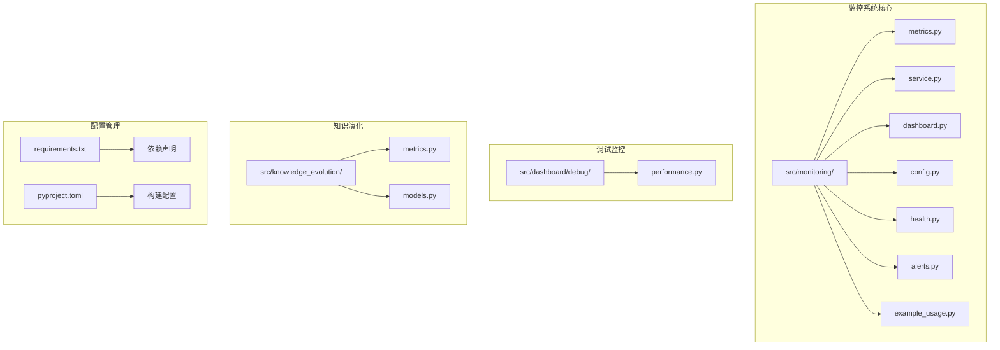

**图表来源**
- [src/monitoring/metrics.py:1-207](file://src/monitoring/metrics.py#L1-L207)
- [src/monitoring/service.py:1-214](file://src/monitoring/service.py#L1-L214)
- [src/dashboard/debug/performance.py:1-658](file://src/dashboard/debug/performance.py#L1-L658)

**章节来源**
- [src/monitoring/metrics.py:1-207](file://src/monitoring/metrics.py#L1-L207)
- [src/monitoring/service.py:1-214](file://src/monitoring/service.py#L1-L214)

## 核心组件

### 系统指标收集器

系统指标收集器负责监控底层基础设施的运行状态，包括CPU、内存、磁盘、网络等关键指标。

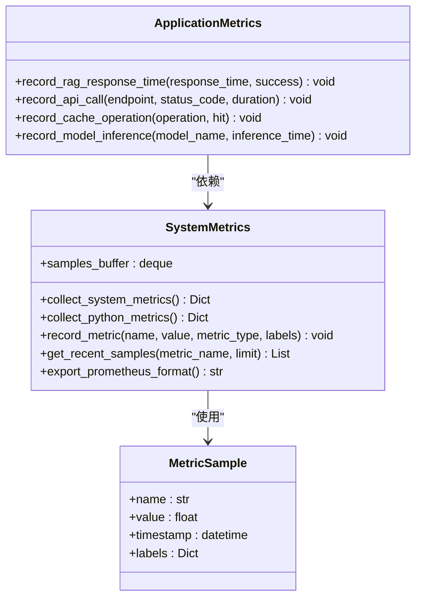

**图表来源**
- [src/monitoring/metrics.py:16-207](file://src/monitoring/metrics.py#L16-L207)

### 监控服务主控制器

监控服务作为整个系统的协调中心，负责调度各类监控任务和管理组件生命周期。

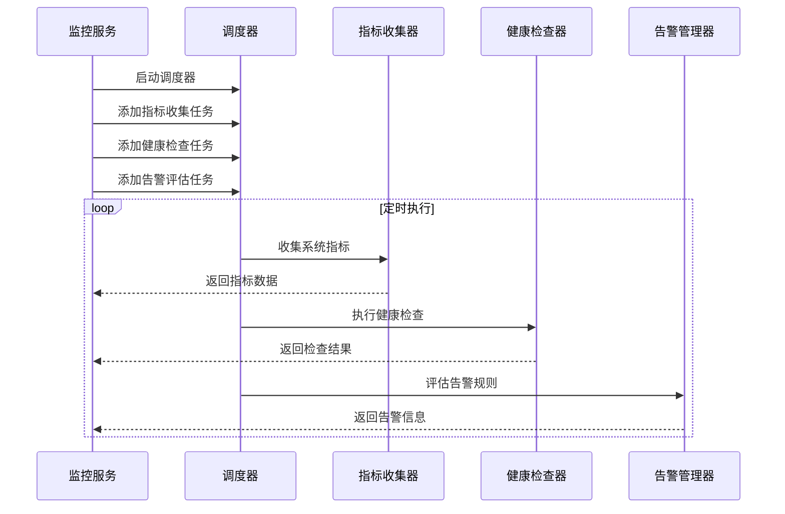

**图表来源**
- [src/monitoring/service.py:99-154](file://src/monitoring/service.py#L99-L154)

**章节来源**
- [src/monitoring/metrics.py:25-207](file://src/monitoring/metrics.py#L25-L207)
- [src/monitoring/service.py:21-174](file://src/monitoring/service.py#L21-L174)

## 架构概览

系统采用分层架构设计，从底层的指标收集到上层的可视化展示形成完整的监控生态：

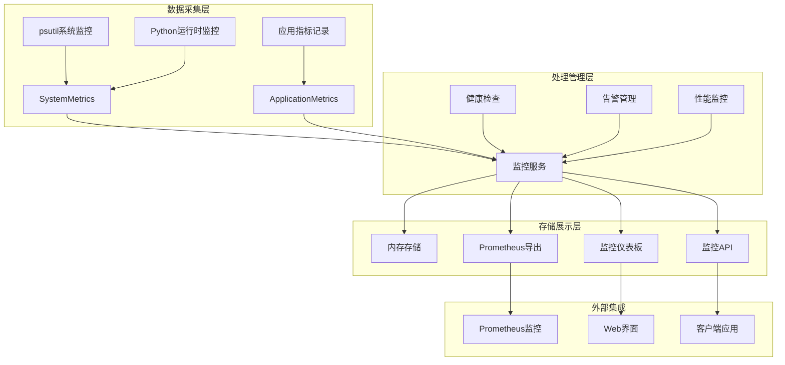

**图表来源**
- [src/monitoring/service.py:177-201](file://src/monitoring/service.py#L177-L201)
- [src/monitoring/dashboard.py:17-250](file://src/monitoring/dashboard.py#L17-L250)

## 详细组件分析

### 系统指标定义与计算

系统指标涵盖了硬件资源、操作系统状态和Python运行时的全方位监控：

#### 硬件资源指标

| 指标类别 | 指标名称 | 数据类型 | 单位 | 计算方式 |
|---------|---------|---------|------|----------|
| CPU | cpu_usage_percent | 浮点数 | % | psutil.cpu_percent() |
| CPU | cpu_count | 整数 | 核数 | psutil.cpu_count() |
| CPU | cpu_frequency_mhz | 浮点数 | MHz | psutil.cpu_freq().current |
| CPU | cpu_load_avg_1min | 浮点数 | % | psutil.getloadavg()[0] |
| 内存 | memory_total_bytes | 整数 | B | psutil.virtual_memory().total |
| 内存 | memory_available_bytes | 整数 | B | psutil.virtual_memory().available |
| 内存 | memory_used_bytes | 整数 | B | psutil.virtual_memory().used |
| 内存 | memory_usage_percent | 浮点数 | % | psutil.virtual_memory().percent |
| 磁盘 | disk_total_bytes | 整数 | B | psutil.disk_usage('/').total |
| 磁盘 | disk_used_bytes | 整数 | B | psutil.disk_usage('/').used |
| 磁盘 | disk_free_bytes | 整数 | B | psutil.disk_usage('/').free |
| 磁盘 | disk_usage_percent | 浮点数 | % | psutil.disk_usage('/').percent |
| 网络 | network_bytes_sent | 整数 | B | psutil.net_io_counters().bytes_sent |
| 网络 | network_bytes_recv | 整数 | B | psutil.net_io_counters().bytes_recv |
| 网络 | network_packets_sent | 整数 | 个 | psutil.net_io_counters().packets_sent |
| 网络 | network_packets_recv | 整数 | 个 | psutil.net_io_counters().packets_recv |

#### Python运行时指标

| 指标类别 | 指标名称 | 数据类型 | 单位 | 计算方式 |
|---------|---------|---------|------|----------|
| 垃圾回收 | gc_collections | 整数 | 次 | gc.get_stats().collections |
| 垃圾回收 | gc_collected | 整数 | 个 | gc.get_stats().collected |
| 垃圾回收 | gc_uncollectable | 整数 | 个 | gc.get_stats().uncollectable |
| 内存使用 | python_memory_rss_bytes | 整数 | B | psutil.Process().memory_info().rss |
| 内存使用 | python_memory_vms_bytes | 整数 | B | psutil.Process().memory_info().vms |
| 环境信息 | python_version | 字符串 | 版本号 | sys.version |
| 环境信息 | python_implementation | 字符串 | 实现名 | sys.implementation.name |

**章节来源**
- [src/monitoring/metrics.py:32-124](file://src/monitoring/metrics.py#L32-L124)

### 应用指标收集

应用指标专注于业务层面的性能和行为监控：

#### RAG系统指标

| 指标名称 | 指标类型 | 标签 | 用途 |
|---------|---------|------|------|
| rag_response_time_seconds | 指标 | 无 | 记录RAG响应时间 |
| rag_request_success | 指标 | 无 | 记录请求成功率 |

#### API调用指标

| 指标名称 | 指标类型 | 标签 | 用途 |
|---------|---------|------|------|
| api_request_duration_seconds | 指标 | endpoint, status_code | 记录API响应时间 |
| api_request_count | 计数器 | endpoint, status_code | 记录API调用次数 |

#### 缓存操作指标

| 指标名称 | 指标类型 | 标签 | 用途 |
|---------|---------|------|------|
| cache_operations | 计数器 | operation, result | 记录缓存操作次数 |

#### 模型推理指标

| 指标名称 | 指标类型 | 标签 | 用途 |
|---------|---------|------|------|
| model_inference_time_seconds | 指标 | model | 记录模型推理时间 |

**章节来源**
- [src/monitoring/metrics.py:183-203](file://src/monitoring/metrics.py#L183-L203)

### 健康检查系统

健康检查系统提供多维度的系统状态评估：

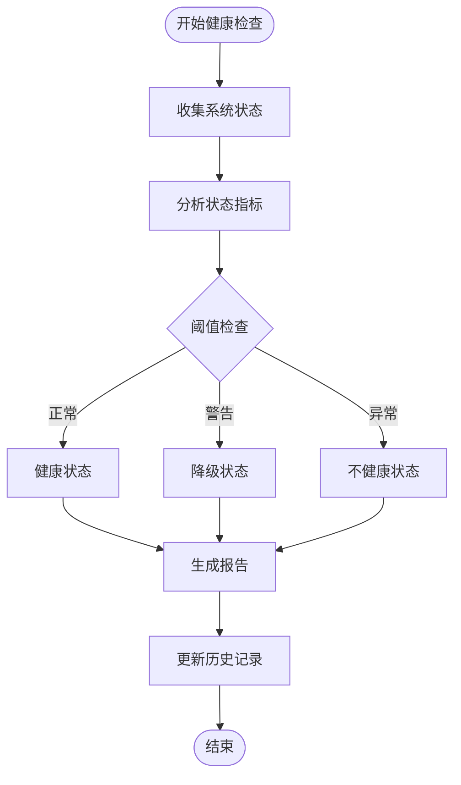

**图表来源**
- [src/monitoring/health.py:107-155](file://src/monitoring/health.py#L107-L155)

健康检查涵盖以下核心组件：

#### 预定义检查项

| 检查名称 | 检查类型 | 关键性 | 描述 |
|---------|---------|--------|------|
| database | 数据库连接 | 关键 | 检查数据库连接状态 |
| redis | Redis连接 | 关键 | 检查Redis连接状态和延迟 |
| llm_service | LLM服务 | 关键 | 检查大语言模型服务可用性 |
| disk_space | 磁盘空间 | 一般 | 检查磁盘使用率 |

#### 健康状态等级

| 状态等级 | 描述 | 判定条件 |
|---------|------|----------|
| healthy | 健康 | 所有检查项均为健康 |
| degraded | 降级 | 存在降级检查项但无不健康项 |
| unhealthy | 不健康 | 存在不健康的关键检查项 |
| unknown | 未知 | 无检查结果或检查异常 |

**章节来源**
- [src/monitoring/health.py:156-300](file://src/monitoring/health.py#L156-L300)

### 告警管理系统

告警系统提供灵活的阈值监控和通知机制：

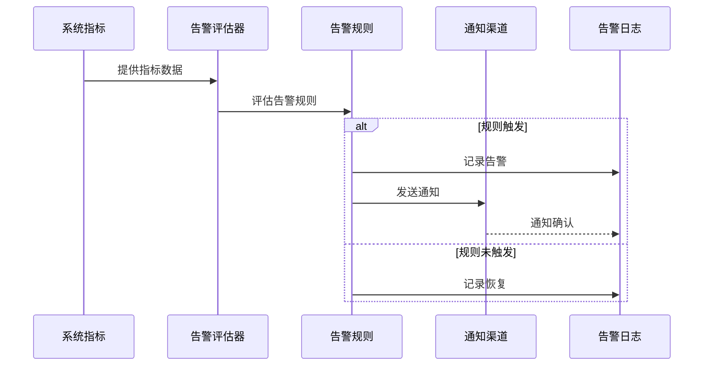

**图表来源**
- [src/monitoring/alerts.py:291-344](file://src/monitoring/alerts.py#L291-L344)

#### 告警规则配置

| 规则名称 | 表达式 | 级别 | 描述 |
|---------|-------|------|------|
| high_cpu_usage | cpu_usage_percent > 90 | CRITICAL | CPU使用率过高 |
| high_memory_usage | memory_usage_percent > 90 | ERROR | 内存使用率过高 |
| system_unhealthy | health_status == UNHEALTHY | CRITICAL | 系统健康状态异常 |

#### 通知渠道

系统支持多种通知渠道，包括控制台、邮件、Webhook和Slack：

| 通知渠道 | 配置参数 | 使用场景 |
|---------|---------|----------|
| Console | 无 | 开发调试和本地测试 |
| Email | SMTP服务器、收件人列表 | 邮件通知 |
| Webhook | URL地址 | 第三方系统集成 |
| Slack | Webhook URL | 团队协作平台 |

**章节来源**
- [src/monitoring/alerts.py:237-435](file://src/monitoring/alerts.py#L237-L435)

### 性能监控系统

性能监控系统提供实时的系统性能跟踪和异常检测：

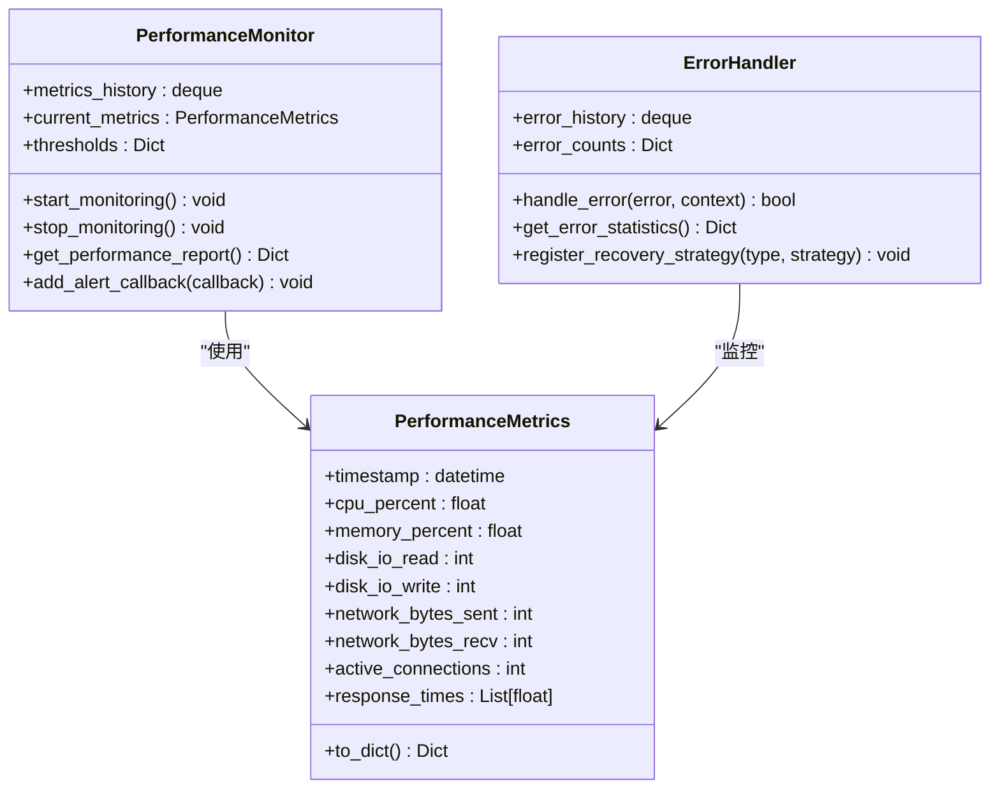

**图表来源**
- [src/dashboard/debug/performance.py:19-658](file://src/dashboard/debug/performance.py#L19-L658)

#### 性能阈值配置

| 指标类型 | 警告阈值 | 严重阈值 | 单位 |
|---------|---------|---------|------|
| CPU使用率 | 70.0 | 90.0 | % |
| 内存使用率 | 80.0 | 95.0 | % |
| 响应时间 | 1000.0 | 5000.0 | ms |

#### 错误处理机制

系统提供多层次的错误处理和恢复策略：

| 错误类型 | 严重程度 | 默认恢复策略 |
|---------|---------|-------------|
| ValueError | medium | 短暂等待后重试 |
| TypeError | medium | 短暂等待后重试 |
| ConnectionError | high | 连接池重试机制 |
| TimeoutError | high | 超时重试策略 |
| MemoryError | critical | 内存清理和重启 |
| SystemExit | critical | 紧急停机程序 |

**章节来源**
- [src/dashboard/debug/performance.py:103-658](file://src/dashboard/debug/performance.py#L103-L658)

### 知识演化指标系统

知识演化系统提供专门的知识库健康度评估：

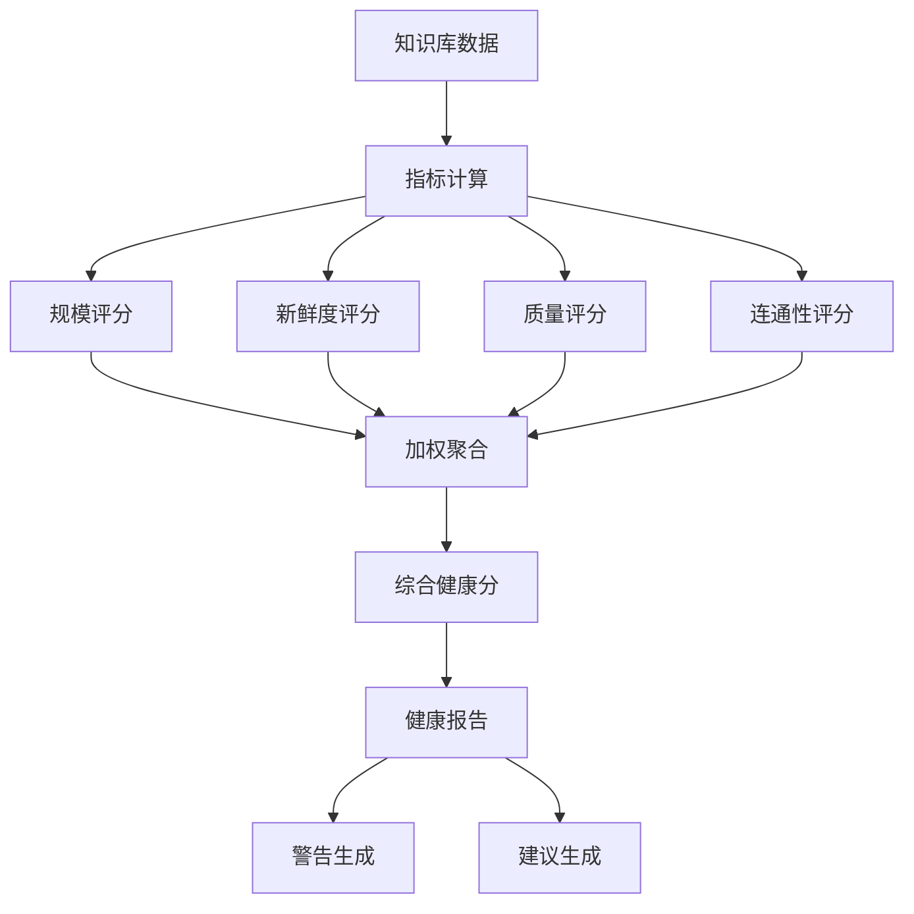

**图表来源**
- [src/knowledge_evolution/metrics.py:413-572](file://src/knowledge_evolution/metrics.py#L413-L572)

#### 知识库指标体系

| 指标类别 | 指标名称 | 计算公式 | 用途 |
|---------|---------|---------|------|
| 规模指标 | total_entries | 总条目数 | 知识库规模评估 |
| 规模指标 | l2_entries | L2覆盖数 | 向量覆盖率评估 |
| 新鲜度指标 | avg_knowledge_age_days | 平均年龄 | 知识时效性评估 |
| 新鲜度指标 | recent_update_rate | 近期更新率 | 知识活跃度评估 |
| 质量指标 | retrieval_hit_rate | 检索命中率 | 检索效果评估 |
| 质量指标 | avg_relevance_score | 平均相关性 | 内容质量评估 |
| 健康度指标 | health_score | 加权聚合 | 综合健康评估 |

#### 健康报告生成

系统根据计算的指标生成详细的健康报告：

| 报告要素 | 生成条件 | 用途 |
|---------|---------|------|
| 健康等级 | 基于健康分 | 系统状态分级 |
| 警告列表 | 基于阈值检查 | 问题识别 |
| 改进建议 | 基于指标分析 | 优化指导 |
| 维度评分 | 各维度独立评分 | 深入分析 |

**章节来源**
- [src/knowledge_evolution/metrics.py:21-725](file://src/knowledge_evolution/metrics.py#L21-L725)
- [src/knowledge_evolution/models.py:194-367](file://src/knowledge_evolution/models.py#L194-L367)

## 依赖分析

系统依赖关系清晰，主要依赖包括监控、Web框架和数据处理库：

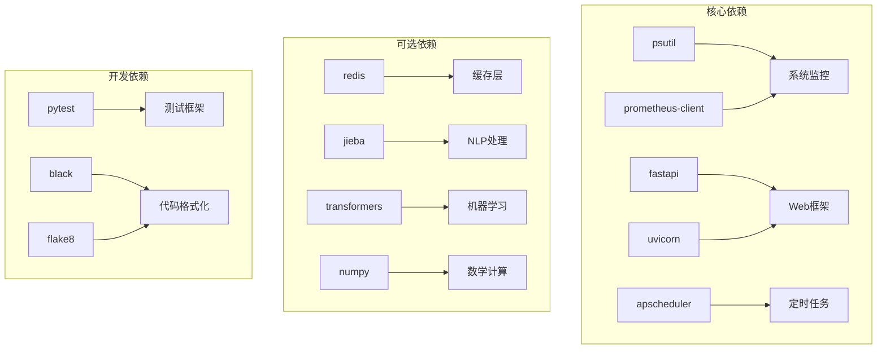

**图表来源**
- [requirements.txt:1-160](file://requirements.txt#L1-L160)
- [pyproject.toml:27-100](file://pyproject.toml#L27-L100)

### 关键依赖说明

#### 监控相关依赖

| 依赖包 | 版本要求 | 用途 |
|-------|---------|------|
| prometheus-client | >=2.0.1-alpha | 指标导出和Prometheus集成 |
| psutil | 无版本限制 | 系统资源监控 |
| apscheduler | >=2.0.1-alpha | 定时任务调度 |

#### Web框架依赖

| 依赖包 | 版本要求 | 用途 |
|-------|---------|------|
| fastapi | >=2.0.1-alpha | API框架 |
| uvicorn | >=2.0.1-alpha | ASGI服务器 |
| websockets | >=12.0 | WebSocket支持 |

#### 可选功能依赖

系统支持多种可选功能，通过条件依赖实现：

- **缓存层**: Redis支持，用于工作记忆和缓存
- **NLP处理**: Jieba中文分词，支持可选的机器学习后端
- **向量数据库**: Qdrant、Milvus等向量存储支持
- **图数据库**: Neo4j、NebulaGraph等图存储支持

**章节来源**
- [requirements.txt:91-95](file://requirements.txt#L91-L95)
- [pyproject.toml:71-73](file://pyproject.toml#L71-L73)

## 性能考虑

系统在设计时充分考虑了性能优化，采用多种策略确保高效运行：

### 指标收集优化

1. **缓冲区管理**: 使用双端队列限制内存使用，最大保留1000个样本
2. **增量计算**: 网络和磁盘IO采用差分计算，减少全量统计开销
3. **异步处理**: 所有监控任务采用异步模式，避免阻塞主线程
4. **缓存机制**: 知识库指标支持缓存，减少重复计算

### 内存管理策略

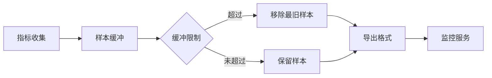

**图表来源**
- [src/monitoring/metrics.py:28-31](file://src/monitoring/metrics.py#L28-L31)

### 并发处理机制

系统采用多线程并发处理不同类型的监控任务：

| 任务类型 | 并发策略 | 适用场景 |
|---------|---------|----------|
| 指标收集 | 异步并发 | 系统资源监控 |
| 健康检查 | 并行执行 | 多组件状态检查 |
| 告警评估 | 顺序处理 | 规则一致性保证 |
| 数据导出 | 流式处理 | 大数据量导出 |

### 性能监控指标

系统内置性能监控，提供以下关键指标：

| 指标名称 | 监控内容 | 采样间隔 |
|---------|---------|---------|
| cpu_percent | CPU使用率 | 1秒 |
| memory_percent | 内存使用率 | 1秒 |
| response_time_ms | 响应时间 | 函数调用时 |
| error_count | 错误计数 | 异常发生时 |

**章节来源**
- [src/dashboard/debug/performance.py:103-373](file://src/dashboard/debug/performance.py#L103-L373)

## 故障排除指南

### 常见问题诊断

#### 指标收集失败

**症状**: 指标数据长时间不变或出现异常值

**排查步骤**:
1. 检查系统权限，确保有足够的访问权限
2. 验证psutil库版本兼容性
3. 查看系统资源是否受限
4. 检查网络连接状态

**解决方案**:
- 更新psutil到最新版本
- 调整采样间隔，避免过于频繁的采集
- 检查防火墙设置，确保系统调用正常

#### 告警通知失败

**症状**: 告警规则触发但未收到通知

**排查步骤**:
1. 检查通知渠道配置
2. 验证网络连接
3. 查看告警历史记录
4. 检查日志输出

**解决方案**:
- 重新配置通知渠道参数
- 检查第三方服务可用性
- 增加重试机制和错误处理

#### 性能监控异常

**症状**: 性能监控数据不准确或丢失

**排查步骤**:
1. 检查监控器状态
2. 验证阈值配置
3. 查看历史数据完整性
4. 检查系统负载

**解决方案**:
- 调整采样间隔和阈值设置
- 增加监控器的内存容量
- 优化系统资源配置

### 调试工具使用

系统提供多种调试工具辅助问题定位：

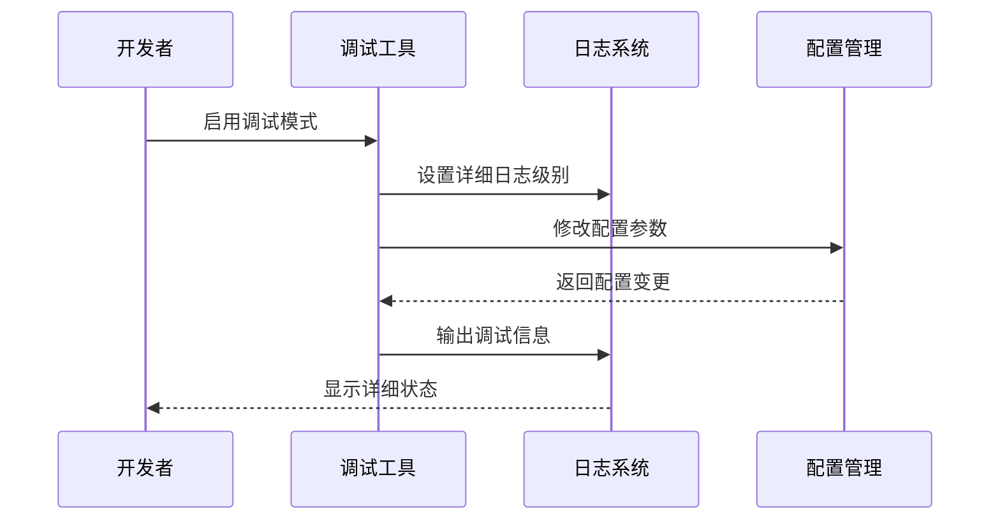

**图表来源**
- [src/monitoring/example_usage.py:23-293](file://src/monitoring/example_usage.py#L23-L293)

**章节来源**
- [src/monitoring/example_usage.py:1-293](file://src/monitoring/example_usage.py#L1-L293)

## 结论

NecoRAG指标收集系统通过模块化设计和多层次监控，为认知型检索增强生成框架提供了全面的运行状态洞察。系统不仅能够监控基础设施的健康状况，还能深度分析知识库的质量和性能表现。

### 系统优势

1. **全面性**: 覆盖系统、应用、知识库三个层面的监控
2. **实时性**: 支持实时数据采集和即时告警
3. **可扩展性**: 模块化设计便于功能扩展和定制
4. **易用性**: 提供丰富的API和可视化界面
5. **可靠性**: 多层错误处理和恢复机制

### 未来发展方向

1. **智能分析**: 集成机器学习算法进行异常检测
2. **预测性维护**: 基于历史数据预测潜在问题
3. **自动化修复**: 实现部分问题的自动恢复
4. **多租户支持**: 支持多用户环境下的指标隔离
5. **云原生集成**: 更好的容器化和微服务支持

通过持续优化和功能扩展，该指标收集系统将成为NecoRAG框架的重要基础设施，为系统的稳定运行和持续改进提供强有力的支持。

## 附录

### 配置参数参考

#### 监控配置参数

| 参数名称 | 默认值 | 说明 |
|---------|--------|------|
| metrics_enabled | True | 是否启用指标收集 |
| collection_interval | 15秒 | 指标收集间隔 |
| health_check_enabled | True | 是否启用健康检查 |
| health_check_interval | 30秒 | 健康检查间隔 |
| alerts_enabled | True | 是否启用告警 |
| alert_evaluation_interval | 60秒 | 告警评估间隔 |

#### 性能阈值配置

| 阈值名称 | 默认值 | 说明 |
|---------|--------|------|
| cpu_threshold_warning | 80.0% | CPU警告阈值 |
| cpu_threshold_critical | 95.0% | CPU严重阈值 |
| memory_threshold_warning | 85.0% | 内存警告阈值 |
| memory_threshold_critical | 95.0% | 内存严重阈值 |
| rag_response_time_threshold | 5.0秒 | RAG响应时间阈值 |

### API接口参考

系统提供RESTful API接口用于监控数据访问：

| 接口路径 | 方法 | 功能 |
|---------|------|------|
| /api/v1/monitoring/metrics/system | GET | 获取系统指标 |
| /api/v1/monitoring/metrics/application | GET | 获取应用指标 |
| /api/v1/monitoring/health | GET | 获取健康状态 |
| /api/v1/monitoring/alerts | GET | 获取告警信息 |
| /api/v1/monitoring/dashboard | GET | 获取仪表板数据 |

### 使用示例

系统提供完整的使用示例，包括基础使用、Web应用集成和性能测试等场景。开发者可以根据具体需求选择合适的集成方式，并通过配置文件调整监控参数以满足不同的应用场景。