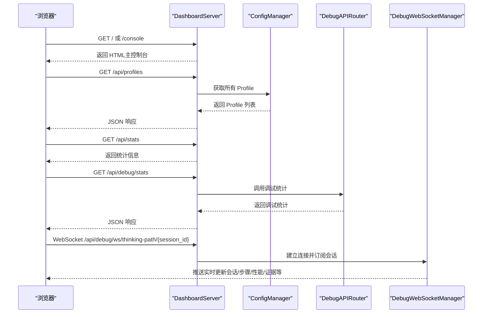
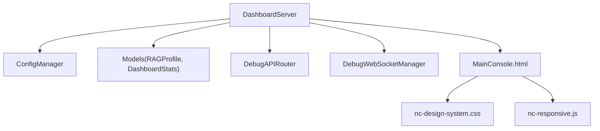

# 监控仪表板

<cite>
**本文档引用的文件**
- [src/dashboard/dashboard.py](file://src/dashboard/dashboard.py)
- [src/dashboard/server.py](file://src/dashboard/server.py)
- [src/dashboard/models.py](file://src/dashboard/models.py)
- [src/dashboard/config_manager.py](file://src/dashboard/config_manager.py)
- [src/dashboard/__init__.py](file://src/dashboard/__init__.py)
- [src/dashboard/static/css/nc-design-system.css](file://src/dashboard/static/css/nc-design-system.css)
- [src/dashboard/static/js/nc-responsive.js](file://src/dashboard/static/js/nc-responsive.js)
- [src/dashboard/static/index.html](file://src/dashboard/static/index.html)
- [src/dashboard/components/MainConsole.html](file://src/dashboard/components/MainConsole.html)
- [src/dashboard/IMPLEMENTATION_SUMMARY.md](file://src/dashboard/IMPLEMENTATION_SUMMARY.md)
- [src/dashboard/debug/api.py](file://src/dashboard/debug/api.py)
- [src/dashboard/debug/websocket.py](file://src/dashboard/debug/websocket.py)
- [src/dashboard/debug/__init__.py](file://src/dashboard/debug/__init__.py)
</cite>

## 目录
1. [引言](#引言)
2. [项目结构](#项目结构)
3. [核心组件](#核心组件)
4. [架构总览](#架构总览)
5. [详细组件分析](#详细组件分析)
6. [依赖关系分析](#依赖关系分析)
7. [性能考虑](#性能考虑)
8. [故障排除指南](#故障排除指南)
9. [结论](#结论)
10. [附录](#附录)

## 引言
本技术文档面向监控仪表板的开发者与运维人员，系统阐述了 NecoRAG 仪表板的架构设计、可视化界面实现、实时数据更新机制、图表组件与交互功能、布局与主题样式、响应式适配、数据源配置、组件扩展以及权限管理等关键主题。文档同时提供部署指南、自定义开发方法与性能优化建议，帮助团队快速构建直观易用的监控可视化界面。

## 项目结构
仪表板相关代码主要位于 src/dashboard 目录，采用“后端服务 + 前端组件 + 静态资源”的分层组织方式：
- 后端服务：FastAPI 服务器，提供 REST API 与 Web UI，负责配置管理、统计信息、知识演化数据对接与调试面板的 WebSocket 通信。
- 前端组件：HTML/CSS/JS 组件，包含主控制台、调试面板、性能监控、路径分析、参数调优、推荐引擎、检索轨迹时间线、知识健康仪表盘等。
- 静态资源：统一的设计系统样式与响应式工具库，支撑跨设备一致的视觉与交互体验。

```mermaid
graph TB
subgraph "后端服务"
S["DashboardServer<br/>FastAPI 应用"]
CM["ConfigManager<br/>配置管理"]
DM["DebugWebSocketManager<br/>调试WS管理"]
API["DebugAPIRouter<br/>调试API"]
end
subgraph "前端组件"
MC["MainConsole.html<br/>主控制台"]
DH["KnowledgeHealthDashboard.html<br/>知识健康仪表盘"]
PD["PerformanceDashboard.html<br/>性能仪表盘"]
PA["PathAnalysis.html<br/>路径分析"]
PT["ParameterTuning.html<br/>参数调优"]
RE["RecommendationEngine.html<br/>推荐引擎"]
RT["RetrievalTraceTimeline.html<br/>检索轨迹时间线"]
RC["ReasoningChainChart.html<br/>推理链图表"]
EP["EvidenceCard.html<br/>证据卡片"]
AB["ABTesting.html<br/>A/B测试"]
DP["DebugPanel.html<br/>调试面板"]
end
subgraph "静态资源"
CSS["nc-design-system.css<br/>设计系统样式"]
JS["nc-responsive.js<br/>响应式/主题/布局管理"]
IDX["index.html<br/>简易仪表板入口"]
end
S --> CM
S --> DM
S --> API
S --> MC
S --> DH
S --> PD
S --> PA
S --> PT
S --> RE
S --> RT
S --> RC
S --> EP
S --> AB
S --> DP
MC --> CSS
MC --> JS
DH --> CSS
DH --> JS
PD --> CSS
PD --> JS
PA --> CSS
PA --> JS
PT --> CSS
PT --> JS
RE --> CSS
RE --> JS
RT --> CSS
RT --> JS
RC --> CSS
RC --> JS
EP --> CSS
EP --> JS
AB --> CSS
AB --> JS
DP --> CSS
DP --> JS
IDX --> CSS
IDX --> JS
```

**图表来源**
- [src/dashboard/server.py:51-108](file://src/dashboard/server.py#L51-L108)
- [src/dashboard/config_manager.py:14-41](file://src/dashboard/config_manager.py#L14-L41)
- [src/dashboard/debug/websocket.py:49-91](file://src/dashboard/debug/websocket.py#L49-L91)
- [src/dashboard/debug/api.py:21-29](file://src/dashboard/debug/api.py#L21-L29)
- [src/dashboard/components/MainConsole.html:1-120](file://src/dashboard/components/MainConsole.html#L1-L120)
- [src/dashboard/static/css/nc-design-system.css:1-120](file://src/dashboard/static/css/nc-design-system.css#L1-L120)
- [src/dashboard/static/js/nc-responsive.js:6-126](file://src/dashboard/static/js/nc-responsive.js#L6-L126)

**章节来源**
- [src/dashboard/dashboard.py:10-26](file://src/dashboard/dashboard.py#L10-L26)
- [src/dashboard/server.py:113-108](file://src/dashboard/server.py#L113-L108)
- [src/dashboard/__init__.py:6-15](file://src/dashboard/__init__.py#L6-L15)

## 核心组件
- DashboardServer：基于 FastAPI 的仪表板服务器，提供配置管理 API、统计信息 API、知识演化 API、调试面板 API 与 WebSocket、Web UI 路由注册与静态资源挂载。
- ConfigManager：负责 RAG Profile 的创建、加载、切换、更新、删除、复制、导入导出与持久化。
- 数据模型：ModuleConfig、RAGProfile、DashboardStats 等，支撑配置与统计信息的数据结构。
- 前端组件：MainConsole.html 为主入口，提供导航、主题切换、实时统计与视图切换；其他组件如 KnowledgeHealthDashboard.html、PerformanceDashboard.html 等提供专业视图。
- 静态资源：nc-design-system.css 提供设计系统与断点；nc-responsive.js 提供响应式、主题与布局管理。

**章节来源**
- [src/dashboard/server.py:51-108](file://src/dashboard/server.py#L51-L108)
- [src/dashboard/config_manager.py:14-41](file://src/dashboard/config_manager.py#L14-L41)
- [src/dashboard/models.py:22-232](file://src/dashboard/models.py#L22-L232)
- [src/dashboard/components/MainConsole.html:310-540](file://src/dashboard/components/MainConsole.html#L310-L540)
- [src/dashboard/static/css/nc-design-system.css:6-106](file://src/dashboard/static/css/nc-design-system.css#L6-L106)
- [src/dashboard/static/js/nc-responsive.js:781-798](file://src/dashboard/static/js/nc-responsive.js#L781-L798)

## 架构总览
仪表板采用前后端分离的架构：后端通过 FastAPI 提供 REST API 与 WebSocket，前端通过 HTML/CSS/JS 组件渲染视图并发起请求。配置管理与统计信息通过 API 与本地持久化结合，调试面板通过 WebSocket 实现实时推送。

**图表来源**
- [src/dashboard/server.py:373-413](file://src/dashboard/server.py#L373-L413)
- [src/dashboard/server.py:118-139](file://src/dashboard/server.py#L118-L139)
- [src/dashboard/server.py:238-254](file://src/dashboard/server.py#L238-L254)
- [src/dashboard/debug/api.py:453-528](file://src/dashboard/debug/api.py#L453-L528)
- [src/dashboard/debug/websocket.py:92-130](file://src/dashboard/debug/websocket.py#L92-L130)

## 详细组件分析

### 1) DashboardServer（后端服务）
- 职责：路由注册、CORS 配置、静态资源挂载、Web UI 提供、调试面板 WebSocket 端点、知识演化 API、统计信息 API。
- 关键路由：
  - 配置管理：GET/POST/PUT/DELETE /api/profiles、GET/POST /api/profiles/{profile_id}/activate、POST /api/profiles/{profile_id}/duplicate、POST /api/profiles/{profile_id}/export、POST /api/profiles/import。
  - 模块参数：GET/PUT /api/profiles/{profile_id}/modules/{module}。
  - 统计信息：GET /api/stats、POST /api/stats/reset。
  - 知识演化：GET /api/knowledge/metrics、/api/knowledge/health、/api/knowledge/dashboard、/api/knowledge/growth、/api/knowledge/timeline、/api/knowledge/candidates、/api/knowledge/candidates/{candidate_id}/approve、/api/knowledge/candidates/{candidate_id}/reject、/api/knowledge/gaps。
  - 调试面板：include_router(DebugAPIRouter)、WebSocket /api/debug/ws/thinking-path/{session_id}。
- Web UI：GET /、/console、/debug、/knowledge-health，静态资源 /static。

**章节来源**
- [src/dashboard/server.py:113-370](file://src/dashboard/server.py#L113-L370)
- [src/dashboard/server.py:372-417](file://src/dashboard/server.py#L372-L417)
- [src/dashboard/server.py:544-557](file://src/dashboard/server.py#L544-L557)

### 2) ConfigManager（配置管理）
- 职责：Profile 的创建、加载、切换、更新、删除、复制、导入导出；参数验证与持久化。
- 关键方法：create_profile、get_profile、get_all_profiles、get_active_profile、set_active_profile、update_profile、delete_profile、duplicate_profile、export_profile、import_profile。
- 持久化：以 JSON 文件形式存储于配置目录，文件名格式为 {profile_id}.json。

**章节来源**
- [src/dashboard/config_manager.py:42-194](file://src/dashboard/config_manager.py#L42-L194)
- [src/dashboard/config_manager.py:279-315](file://src/dashboard/config_manager.py#L279-L315)

### 3) 数据模型（RAGProfile 与统计）
- RAGProfile：包含多个模块配置（感知、记忆、检索、精炼、响应）与活动状态、时间戳等字段，并提供 to_dict/from_dict/to_json/from_json。
- DashboardStats：包含文档数、块数、查询数、活跃会话、内存使用、查询历史、性能指标等字段。
- 模块配置：ModuleConfig、PerceptionConfig、MemoryConfig、RetrievalConfig、RefinementConfig、ResponseConfig，均继承自 ModuleConfig 并提供默认参数。

**章节来源**
- [src/dashboard/models.py:165-232](file://src/dashboard/models.py#L165-L232)
- [src/dashboard/models.py:22-161](file://src/dashboard/models.py#L22-L161)

### 4) 前端主控制台（MainConsole.html）
- 布局：侧边栏导航 + 主内容区，支持移动端汉堡菜单、主题切换、连接状态指示。
- 视图：仪表板、调试面板、性能监控、路径分析、A/B 测试、参数调优、推荐引擎、查询历史、系统设置。
- 交互：导航切换、主题切换、WebSocket 连接、定时刷新统计信息、视图切换事件。
- 样式：依赖 nc-design-system.css，支持暗色主题与响应式断点。

**章节来源**
- [src/dashboard/components/MainConsole.html:310-540](file://src/dashboard/components/MainConsole.html#L310-L540)
- [src/dashboard/components/MainConsole.html:544-753](file://src/dashboard/components/MainConsole.html#L544-L753)

### 5) 设计系统与响应式（nc-design-system.css、nc-responsive.js）
- 设计系统：CSS 变量定义主色、语义色、间距、圆角、阴影、动画与断点；提供按钮、卡片、表单、网格、布局、状态指示器、加载与模态框等组件样式。
- 响应式：ResponsiveManager 提供断点检测与事件；ThemeManager 支持主题切换与系统偏好；LayoutManager 管理侧边栏与移动端菜单；ComponentManager 提供组件懒加载与激活钩子。
- 工具函数：防抖、节流、深合并、格式化、设备检测等。

**章节来源**
- [src/dashboard/static/css/nc-design-system.css:6-106](file://src/dashboard/static/css/nc-design-system.css#L6-L106)
- [src/dashboard/static/js/nc-responsive.js:6-126](file://src/dashboard/static/js/nc-responsive.js#L6-L126)
- [src/dashboard/static/js/nc-responsive.js:128-236](file://src/dashboard/static/js/nc-responsive.js#L128-L236)
- [src/dashboard/static/js/nc-responsive.js:238-391](file://src/dashboard/static/js/nc-responsive.js#L238-L391)
- [src/dashboard/static/js/nc-responsive.js:393-678](file://src/dashboard/static/js/nc-responsive.js#L393-L678)
- [src/dashboard/static/js/nc-responsive.js:680-798](file://src/dashboard/static/js/nc-responsive.js#L680-L798)

### 6) 调试面板与 WebSocket（DebugWebSocketManager、DebugAPIRouter）
- WebSocket 管理：建立连接、订阅会话、广播更新（会话、步骤、性能、证据、系统通知）、清理不活跃连接、查询历史广播。
- API 路由：创建/完成/失败调试会话、添加检索步骤与证据、查询历史分页查询、路径分析、参数调优、调试统计、仪表板统计、健康检查等。
- 实时推送：前端通过 WebSocket 接收实时更新，配合定时轮询补充数据。

**章节来源**
- [src/dashboard/debug/websocket.py:49-91](file://src/dashboard/debug/websocket.py#L49-L91)
- [src/dashboard/debug/websocket.py:92-130](file://src/dashboard/debug/websocket.py#L92-L130)
- [src/dashboard/debug/websocket.py:200-261](file://src/dashboard/debug/websocket.py#L200-L261)
- [src/dashboard/debug/websocket.py:453-554](file://src/dashboard/debug/websocket.py#L453-L554)
- [src/dashboard/debug/api.py:91-181](file://src/dashboard/debug/api.py#L91-L181)
- [src/dashboard/debug/api.py:298-364](file://src/dashboard/debug/api.py#L298-L364)
- [src/dashboard/debug/api.py:366-410](file://src/dashboard/debug/api.py#L366-L410)
- [src/dashboard/debug/api.py:412-451](file://src/dashboard/debug/api.py#L412-L451)
- [src/dashboard/debug/api.py:453-528](file://src/dashboard/debug/api.py#L453-L528)

### 7) 知识健康仪表盘（KnowledgeHealthDashboard.html）
- 功能：关键指标卡、健康分数仪表盘、知识增长趋势图、领域覆盖热力图、知识质量雷达图、更新时间线。
- 特性：响应式布局、SVG 内联绘图、自动刷新、交互式图表、动画过渡。
- 集成：通过 /api/knowledge/* 端点获取数据，与后端知识演化系统对接。

**章节来源**
- [src/dashboard/IMPLEMENTATION_SUMMARY.md:1-68](file://src/dashboard/IMPLEMENTATION_SUMMARY.md#L1-L68)
- [src/dashboard/IMPLEMENTATION_SUMMARY.md:124-144](file://src/dashboard/IMPLEMENTATION_SUMMARY.md#L124-L144)

### 8) 简易仪表板入口（index.html）
- 提供基础的 Profile 列表、统计信息展示与模块配置编辑入口，适合快速验证与演示。

**章节来源**
- [src/dashboard/static/index.html:424-540](file://src/dashboard/static/index.html#L424-L540)

## 依赖关系分析
- 组件耦合：
  - DashboardServer 依赖 ConfigManager、DebugWebSocketManager、DebugAPIRouter、RAGProfile/DashboardStats 等模型。
  - 前端组件依赖 nc-design-system.css 与 nc-responsive.js，MainConsole.html 与调试 API/WebSocket 紧密协作。
- 外部依赖：
  - FastAPI、Uvicorn、Pydantic（后端）。
  - 原生 HTML/CSS/JS（前端，零第三方框架依赖）。
- 潜在风险：
  - WebSocket 连接数上限与清理任务需监控。
  - 配置文件读写异常与 JSON 解析异常需健壮处理。

**图表来源**
- [src/dashboard/server.py:76-108](file://src/dashboard/server.py#L76-L108)
- [src/dashboard/config_manager.py:25-41](file://src/dashboard/config_manager.py#L25-L41)
- [src/dashboard/models.py:165-232](file://src/dashboard/models.py#L165-L232)
- [src/dashboard/debug/api.py:21-29](file://src/dashboard/debug/api.py#L21-L29)
- [src/dashboard/debug/websocket.py:49-91](file://src/dashboard/debug/websocket.py#L49-L91)
- [src/dashboard/components/MainConsole.html:1-120](file://src/dashboard/components/MainConsole.html#L1-L120)

**章节来源**
- [src/dashboard/server.py:16-20](file://src/dashboard/server.py#L16-L20)
- [src/dashboard/__init__.py:6-15](file://src/dashboard/__init__.py#L6-L15)

## 性能考虑
- 前端性能：
  - 使用 CSS Grid/Flexbox 与现代布局减少重排；响应式断点与动画时长合理设置，避免过度动画影响性能。
  - 组件懒加载与 IntersectionObserver 优化首屏渲染与滚动性能。
- 后端性能：
  - WebSocket 广播使用并发任务聚合发送，降低锁竞争；定期清理不活跃连接，控制内存占用。
  - API 路由按需加载与错误处理，避免阻塞主线程。
- 数据刷新：
  - 主控制台定时轮询 /api/debug/stats，建议根据业务场景调整刷新频率，避免频繁请求。
  - 知识健康仪表盘采用 5 秒自动刷新，保证数据时效性。

**章节来源**
- [src/dashboard/static/js/nc-responsive.js:351-373](file://src/dashboard/static/js/nc-responsive.js#L351-L373)
- [src/dashboard/debug/websocket.py:351-373](file://src/dashboard/debug/websocket.py#L351-L373)
- [src/dashboard/components/MainConsole.html:697-711](file://src/dashboard/components/MainConsole.html#L697-L711)

## 故障排除指南
- 无法连接 WebSocket：
  - 检查 /api/debug/ws/thinking-path/{session_id} 是否可达；确认 DebugWebSocketManager 已初始化；查看浏览器网络面板与后端日志。
- API 返回 404：
  - 确认 Profile ID 存在且已激活；检查路由拼写与参数传递。
- 配置导入/导出失败：
  - 检查文件权限与路径；查看异常输出定位具体错误。
- 主控制台统计不更新：
  - 确认定时器运行与 /api/debug/stats 可用；检查前端网络请求状态。
- 知识健康仪表盘数据“计算中...”：
  - 确保后端知识演化服务可用，API /api/knowledge/* 可访问。

**章节来源**
- [src/dashboard/debug/websocket.py:92-130](file://src/dashboard/debug/websocket.py#L92-L130)
- [src/dashboard/server.py:160-167](file://src/dashboard/server.py#L160-L167)
- [src/dashboard/config_manager.py:240-252](file://src/dashboard/config_manager.py#L240-L252)
- [src/dashboard/components/MainConsole.html:697-711](file://src/dashboard/components/MainConsole.html#L697-L711)
- [src/dashboard/IMPLEMENTATION_SUMMARY.md:229-236](file://src/dashboard/IMPLEMENTATION_SUMMARY.md#L229-L236)

## 结论
本仪表板以 FastAPI 为核心，结合原生前端组件与统一设计系统，实现了配置管理、实时监控、调试可视化与知识健康监控的综合能力。通过响应式设计与主题系统，满足多终端使用需求；通过 WebSocket 与定时轮询，保障数据的实时性与稳定性。建议在生产环境中加强 WebSocket 连接监控、配置文件备份与 API 限流策略，持续优化前端组件懒加载与后端并发处理能力。

## 附录

### 部署指南
- 快速启动：
  - 使用命令行参数指定主机、端口与配置目录，启动 DashboardServer。
  - 或使用工具脚本一键启动并自动打开浏览器。
- 访问地址：
  - 主控制台：http://host:port/
  - 调试面板：http://host:port/debug
  - 知识健康仪表盘：http://host:port/knowledge-health
  - API 文档：http://host:port/docs

**章节来源**
- [src/dashboard/dashboard.py:10-26](file://src/dashboard/dashboard.py#L10-L26)
- [src/dashboard/server.py:544-557](file://src/dashboard/server.py#L544-L557)
- [src/dashboard/IMPLEMENTATION_SUMMARY.md:126-143](file://src/dashboard/IMPLEMENTATION_SUMMARY.md#L126-L143)

### 自定义开发方法
- 扩展前端组件：
  - 在 src/dashboard/components 下新增 HTML/CSS/JS 组件，遵循 nc-design-system.css 与 nc-responsive.js 的约定。
  - 在 MainConsole.html 的导航中增加入口，并在内容区域添加 iframe 或内联视图。
- 扩展后端 API：
  - 在 server.py 中注册新路由，在 debug/api.py 中添加调试 API，或在 models.py 中扩展数据模型。
- 配置管理扩展：
  - 在 config_manager.py 中新增模块配置类，完善参数验证与持久化逻辑。
- 权限与安全：
  - 当前未内置鉴权机制，建议在网关或反向代理层增加认证与授权策略，或在 FastAPI 中引入中间件。

**章节来源**
- [src/dashboard/components/MainConsole.html:317-362](file://src/dashboard/components/MainConsole.html#L317-L362)
- [src/dashboard/server.py:113-370](file://src/dashboard/server.py#L113-L370)
- [src/dashboard/debug/api.py:21-29](file://src/dashboard/debug/api.py#L21-L29)
- [src/dashboard/models.py:22-161](file://src/dashboard/models.py#L22-L161)
- [src/dashboard/config_manager.py:14-41](file://src/dashboard/config_manager.py#L14-L41)