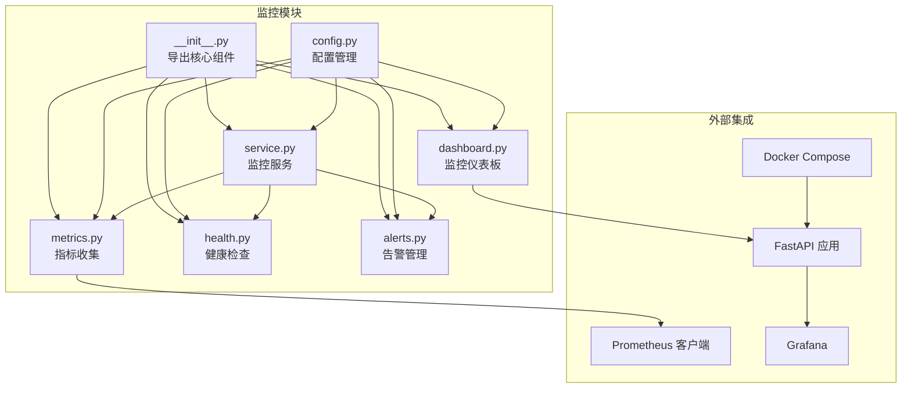
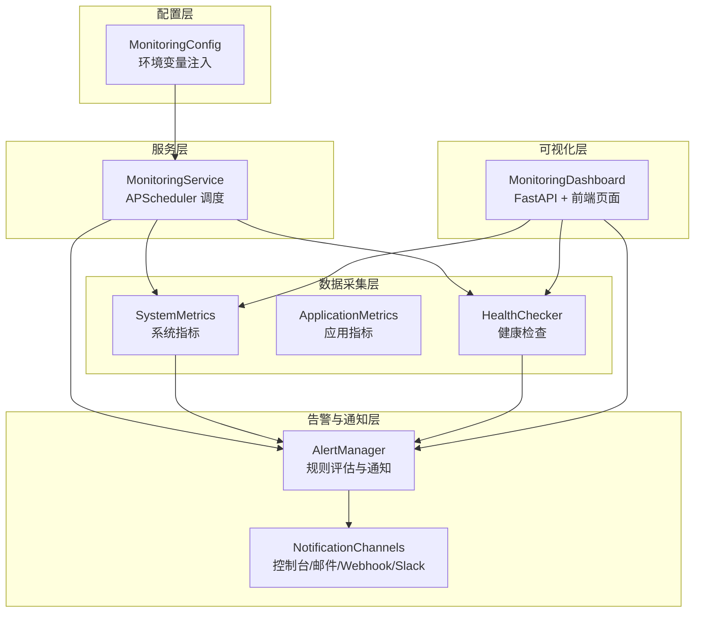
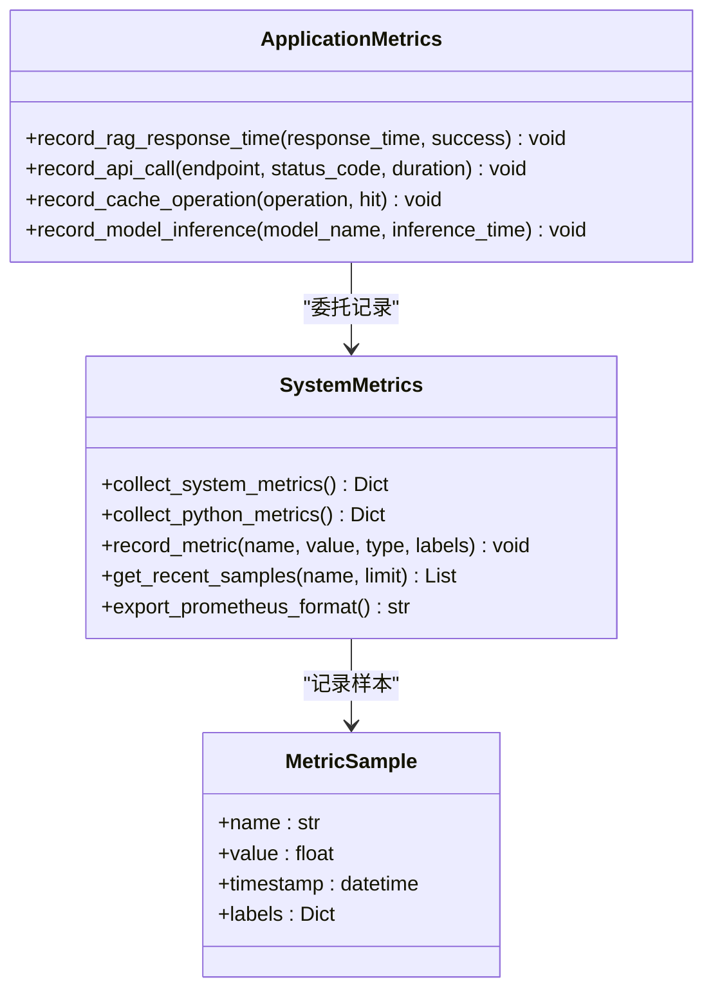
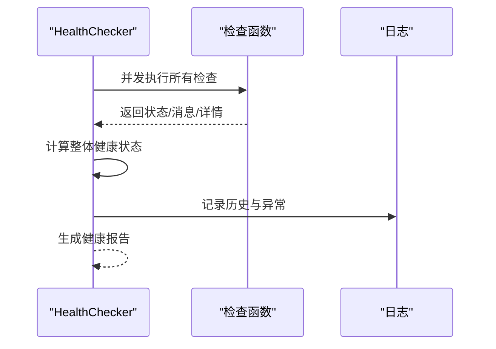
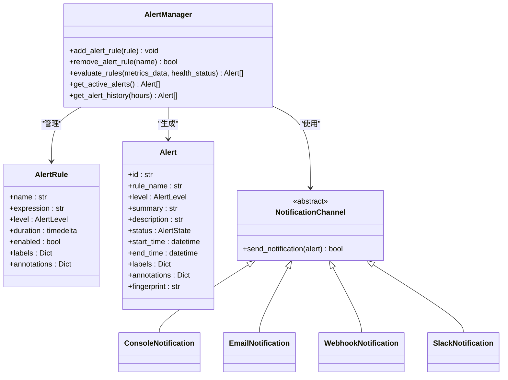
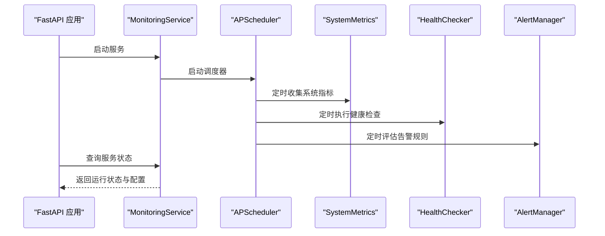
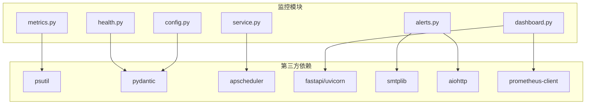

# 监控告警系统

<cite>
**本文引用的文件**
- [__init__.py](file://src/monitoring/__init__.py)
- [metrics.py](file://src/monitoring/metrics.py)
- [health.py](file://src/monitoring/health.py)
- [alerts.py](file://src/monitoring/alerts.py)
- [service.py](file://src/monitoring/service.py)
- [config.py](file://src/monitoring/config.py)
- [dashboard.py](file://src/monitoring/dashboard.py)
- [example_usage.py](file://src/monitoring/example_usage.py)
- [docker-compose.yml](file://devops/docker-compose.yml)
- [requirements.txt](file://requirements.txt)
- [部署与运维.md](file://wiki/wiki/部署与运维/部署与运维.md)
- [仪表板系统/部署与运维.md](file://wiki/wiki/仪表板系统/部署与运维.md)
- [健康监控指标.md](file://wiki/wiki/知识演化系统/健康监控指标.md)
</cite>

## 目录
1. [简介](#简介)
2. [项目结构](#项目结构)
3. [核心组件](#核心组件)
4. [架构总览](#架构总览)
5. [详细组件分析](#详细组件分析)
6. [依赖关系分析](#依赖关系分析)
7. [性能考量](#性能考量)
8. [故障排除指南](#故障排除指南)
9. [结论](#结论)
10. [附录](#附录)

## 简介
本文件为 NecoRAG 监控告警系统的技术文档，聚焦于实时监控的指标收集机制、健康检查的组件状态监测、告警管理的多渠道通知策略。文档详细解释了系统级与应用级指标的定义与计算方法，提供 Grafana/Prometheus 集成的配置方案与告警规则定制化实现思路，阐述监控数据的存储策略、可视化展示的技术方案与性能瓶颈识别方法，并包含配置管理、阈值设定与故障恢复的自动化流程。最后提供完整的部署指南、配置示例与运维最佳实践，帮助开发者建立完善的系统监控体系。

## 项目结构
监控告警系统位于 src/monitoring 目录，包含指标收集、健康检查、告警管理、仪表板与服务集成等模块，并通过配置管理模块统一管理运行参数。系统通过 FastAPI 提供监控仪表板与 API 接口，支持独立运行或作为主应用的子服务挂载。

**图表来源**
- [__init__.py:1-35](file://src/monitoring/__init__.py#L1-L35)
- [config.py:27-117](file://src/monitoring/config.py#L27-L117)
- [metrics.py:25-207](file://src/monitoring/metrics.py#L25-L207)
- [health.py:34-300](file://src/monitoring/health.py#L34-L300)
- [alerts.py:237-435](file://src/monitoring/alerts.py#L237-L435)
- [service.py:21-214](file://src/monitoring/service.py#L21-L214)
- [dashboard.py:17-250](file://src/monitoring/dashboard.py#L17-L250)

**章节来源**
- [__init__.py:1-35](file://src/monitoring/__init__.py#L1-L35)
- [config.py:27-117](file://src/monitoring/config.py#L27-L117)

## 核心组件
- 指标收集器：提供系统级与应用级指标的采集、记录与导出能力，支持 Prometheus 格式输出。
- 健康检查器：定义健康状态枚举与检查结果结构，提供注册检查函数、并发执行与整体状态判定。
- 告警管理器：支持多渠道通知（控制台、邮件、Webhook、Slack），内置默认规则并支持自定义规则与表达式评估。
- 监控服务：基于 APScheduler 的定时任务调度，周期性执行指标收集、健康检查与告警评估。
- 监控仪表板：提供 REST API 与前端页面，展示系统状态、指标概览与活跃告警。
- 配置管理：基于 Pydantic 的配置模型，支持环境变量注入与运行时更新。

**章节来源**
- [metrics.py:25-207](file://src/monitoring/metrics.py#L25-L207)
- [health.py:15-300](file://src/monitoring/health.py#L15-L300)
- [alerts.py:19-435](file://src/monitoring/alerts.py#L19-L435)
- [service.py:21-214](file://src/monitoring/service.py#L21-L214)
- [dashboard.py:17-250](file://src/monitoring/dashboard.py#L17-L250)
- [config.py:27-117](file://src/monitoring/config.py#L27-L117)

## 架构总览
监控系统采用分层架构：配置层、服务层、数据采集层、告警与通知层、可视化层。服务层通过定时任务驱动数据采集与评估，健康检查与指标收集结果被用于告警规则评估，最终通过多渠道通知与仪表板呈现。

**图表来源**
- [service.py:21-214](file://src/monitoring/service.py#L21-L214)
- [metrics.py:25-207](file://src/monitoring/metrics.py#L25-L207)
- [health.py:34-300](file://src/monitoring/health.py#L34-L300)
- [alerts.py:237-435](file://src/monitoring/alerts.py#L237-L435)
- [dashboard.py:17-250](file://src/monitoring/dashboard.py#L17-L250)

## 详细组件分析

### 指标收集机制
- 系统指标：CPU 使用率、核心数、频率、负载；内存总量/使用/可用/交换；磁盘总量/使用/剩余/IO；网络字节收发/包数；进程数、系统运行时长等。
- Python 运行时指标：垃圾回收统计、进程内存 RSS/VMS、Python 版本与实现信息。
- 应用指标：RAG 响应时间、请求成功率、API 调用耗时与计数、缓存命中/未命中、模型推理耗时等。
- 指标样本缓冲：使用双端队列保留最近 N 个样本，支持按指标名称筛选与导出 Prometheus 格式。

**图表来源**
- [metrics.py:16-174](file://src/monitoring/metrics.py#L16-L174)
- [metrics.py:177-207](file://src/monitoring/metrics.py#L177-L207)

**章节来源**
- [metrics.py:25-207](file://src/monitoring/metrics.py#L25-L207)

### 健康检查机制
- 健康状态枚举：健康、降级、不健康、未知。
- 健康检查结果结构：包含检查名称、状态、消息、时间戳、详情与耗时。
- 检查注册与执行：支持注册任意异步检查函数，按关键性标记决定整体状态；并发执行所有检查并保存历史。
- 整体状态判定：任一关键检查不健康则整体不健康；存在降级则整体降级；全部健康则整体健康。
- 预定义检查：数据库连接、Redis 连接、LLM 服务、磁盘空间等。

**图表来源**
- [health.py:34-155](file://src/monitoring/health.py#L34-L155)
- [health.py:205-291](file://src/monitoring/health.py#L205-L291)

**章节来源**
- [health.py:15-300](file://src/monitoring/health.py#L15-L300)

### 告警管理与多渠道通知
- 告警状态：触发中、已解决、已静默。
- 告警规则：名称、表达式、级别、描述、持续时间、启用状态、标签与注解。
- 告警实例：包含规则名、级别、摘要、描述、状态、起止时间、标签与注解指纹。
- 通知渠道：控制台、邮件（SMTP）、Webhook（HTTP）、Slack（Webhook）。
- 规则评估：支持基于健康状态与指标阈值的简单表达式评估；触发后并发发送通知。
- 历史管理：保留告警历史并按保留天数清理。

**图表来源**
- [alerts.py:19-435](file://src/monitoring/alerts.py#L19-L435)

**章节来源**
- [alerts.py:19-435](file://src/monitoring/alerts.py#L19-L435)

### 监控服务与仪表板
- 监控服务：基于 APScheduler 的定时任务，周期性执行指标收集、健康检查与告警评估；提供状态查询接口。
- 仪表板：提供系统指标、应用指标、健康状态与告警的 API，以及前端页面，支持概览卡片与实时刷新。
- FastAPI 集成：可作为主应用的子路径挂载，或独立运行。

**图表来源**
- [service.py:21-171](file://src/monitoring/service.py#L21-L171)
- [dashboard.py:26-111](file://src/monitoring/dashboard.py#L26-L111)

**章节来源**
- [service.py:21-214](file://src/monitoring/service.py#L21-L214)
- [dashboard.py:17-250](file://src/monitoring/dashboard.py#L17-L250)

## 依赖关系分析
- 运行时依赖：系统指标依赖 psutil；通知渠道依赖 smtplib、aiohttp；配置管理依赖 pydantic；调度依赖 apscheduler；Web 框架依赖 fastapi/uvicorn。
- 可选依赖：Prometheus 客户端（用于指标导出与 Grafana 集成）。
- 外部系统：Grafana 通过 Prometheus 数据源抓取指标；容器编排通过 docker-compose 统一部署。

**图表来源**
- [requirements.txt:93-94](file://requirements.txt#L93-L94)
- [metrics.py:5-13](file://src/monitoring/metrics.py#L5-L13)
- [alerts.py:11-14](file://src/monitoring/alerts.py#L11-L14)
- [service.py:11-18](file://src/monitoring/service.py#L11-L18)
- [config.py:7-8](file://src/monitoring/config.py#L7-L8)

**章节来源**
- [requirements.txt:1-160](file://requirements.txt#L1-L160)

## 性能考量
- 指标采样缓冲：使用固定大小的双端队列，避免内存无限增长；导出 Prometheus 格式时按指标名称分组，减少重复解析。
- 并发执行：健康检查采用并发执行，缩短评估总耗时；告警通知按渠道并发发送。
- 调度间隔：通过配置控制指标收集、健康检查与告警评估的间隔，平衡实时性与开销。
- I/O 优化：系统指标依赖 psutil 的高效调用；应用指标通过标签化减少指标维度爆炸。
- 可视化刷新：仪表板前端定时刷新，避免频繁轮询造成压力。

[本节为通用性能讨论，无需具体文件分析]

## 故障排除指南
- 指标为空或异常：检查系统指标采集权限与 psutil 可用性；确认调度器已启动。
- 健康检查失败：查看检查函数异常日志；确认后端服务（数据库、Redis、LLM、磁盘）状态。
- 告警未触发：检查告警规则表达式与阈值配置；确认通知渠道可用性。
- 通知失败：检查邮件 SMTP 配置、Webhook 地址与 Slack 通道权限。
- 仪表板无法访问：确认 FastAPI 应用已启动且端口映射正确；检查容器网络与健康检查。

**章节来源**
- [service.py:78-98](file://src/monitoring/service.py#L78-L98)
- [health.py:95-105](file://src/monitoring/health.py#L95-L105)
- [alerts.py:374-382](file://src/monitoring/alerts.py#L374-L382)

## 结论
NecoRAG 监控告警系统通过模块化设计与配置驱动，提供了从指标采集、健康检查到告警通知与可视化展示的完整能力。系统支持 Prometheus/Grafana 集成与多渠道通知，具备良好的扩展性与运维友好性。结合容器化部署与自动化脚本，可快速在开发与生产环境中落地监控体系。

[本节为总结性内容，无需具体文件分析]

## 附录

### 20+ 性能指标定义与计算方法
- 系统指标
  - CPU 使用率：单位时间内 CPU 忙碌百分比。
  - CPU 核心数/频率/负载：核心数量、当前频率、1 分钟系统负载。
  - 内存使用：总/可用/使用/交换使用与使用率。
  - 磁盘使用：总/已用/剩余/使用率与读写字节数。
  - 网络 IO：字节发送/接收与包数。
  - 进程数与系统运行时长：进程总数与系统启动时间。
- Python 运行时指标
  - 垃圾回收统计：收集次数、回收对象数、不可回收数。
  - 进程内存：RSS/VMS 字节数。
  - Python 版本与实现：版本号与实现信息。
- 应用指标
  - RAG 响应时间：从请求到响应的总耗时。
  - API 请求：按端点与状态码分组的耗时与计数。
  - 缓存命中：按操作类型与命中/未命中分组的计数。
  - 模型推理耗时：按模型名称分组的推理时间。

**章节来源**
- [metrics.py:32-95](file://src/monitoring/metrics.py#L32-L95)
- [metrics.py:97-124](file://src/monitoring/metrics.py#L97-L124)
- [metrics.py:183-202](file://src/monitoring/metrics.py#L183-L202)

### Grafana/Prometheus 集成配置方案
- 指标导出：系统指标支持导出 Prometheus 格式，可直接供 Prometheus 抓取。
- Grafana 数据源：添加 Prometheus 数据源，目标为监控服务的指标端点。
- 仪表板面板：基于导出指标创建 CPU/内存/磁盘/网络/进程等面板。
- 告警规则：在 Prometheus 中定义基于阈值与表达式的告警规则，结合 Alertmanager 实现多渠道通知。

**章节来源**
- [metrics.py:144-174](file://src/monitoring/metrics.py#L144-L174)
- [docker-compose.yml:100-117](file://devops/docker-compose.yml#L100-L117)

### 告警规则定制化实现
- 规则模板：提供默认规则（CPU/内存过高、系统不健康），支持按需修改阈值与持续时间。
- 表达式评估：支持基于健康状态与指标阈值的简单表达式；可扩展为更复杂的条件判断。
- 通知渠道：根据业务需求启用邮件、Webhook、Slack 等渠道，确保关键告警及时触达。

**章节来源**
- [alerts.py:401-427](file://src/monitoring/alerts.py#L401-L427)
- [alerts.py:346-373](file://src/monitoring/alerts.py#L346-L373)

### 监控数据存储策略与可视化
- 存储策略：指标样本缓冲在内存中，结合 Prometheus 抓取实现长期存储；健康检查与告警历史按配置保留天数清理。
- 可视化：仪表板提供概览卡片与前端页面；Grafana 通过 Prometheus 数据源展示多维度指标与趋势。

**章节来源**
- [metrics.py:30-31](file://src/monitoring/metrics.py#L30-L31)
- [alerts.py:392-398](file://src/monitoring/alerts.py#L392-L398)
- [dashboard.py:149-241](file://src/monitoring/dashboard.py#L149-L241)

### 性能瓶颈识别方法
- 指标采样耗时：通过性能测试示例评估指标收集、健康检查与告警评估的耗时。
- 并发与锁竞争：健康检查并发执行，注意检查函数内部的锁与阻塞 IO。
- 网络与外部依赖：检查 Redis、数据库、LLM 服务的响应时间与错误率。

**章节来源**
- [example_usage.py:229-251](file://src/monitoring/example_usage.py#L229-L251)

### 配置管理与阈值设定
- 环境变量：通过环境变量注入监控配置，支持运行时调整。
- 阈值配置：CPU/内存/磁盘警告与严重阈值、RAG 响应时间阈值、API 错误率阈值、缓存命中率阈值等。
- 规则管理：支持添加/移除告警规则，动态更新通知渠道。

**章节来源**
- [config.py:72-100](file://src/monitoring/config.py#L72-L100)
- [config.py:52-64](file://src/monitoring/config.py#L52-L64)
- [alerts.py:280-289](file://src/monitoring/alerts.py#L280-L289)

### 故障恢复自动化流程
- 健康检查：自动检测关键服务状态，异常时触发告警。
- 告警通知：通过邮件、Webhook、Slack 等渠道通知运维人员。
- 仪表板监控：实时展示系统状态与活跃告警，辅助快速定位问题。

**章节来源**
- [health.py:132-155](file://src/monitoring/health.py#L132-L155)
- [alerts.py:374-382](file://src/monitoring/alerts.py#L374-L382)
- [dashboard.py:112-148](file://src/monitoring/dashboard.py#L112-L148)

### 部署指南与运维最佳实践
- 容器化部署：通过 docker-compose 统一编排应用与后端服务，包含 Grafana 监控可视化。
- 启动脚本：提供完整/开发/最小化/带 LLM 四种模式，支持一键启动与状态检查。
- 生产环境：建议启用健康检查、资源限制、日志轮转与备份策略；Grafana 管理员凭据需强口令。

**章节来源**
- [docker-compose.yml:1-164](file://devops/docker-compose.yml#L1-L164)
- [部署与运维.md:194-219](file://wiki/wiki/部署与运维/部署与运维.md#L194-L219)
- [仪表板系统/部署与运维.md:309-324](file://wiki/wiki/仪表板系统/部署与运维.md#L309-L324)