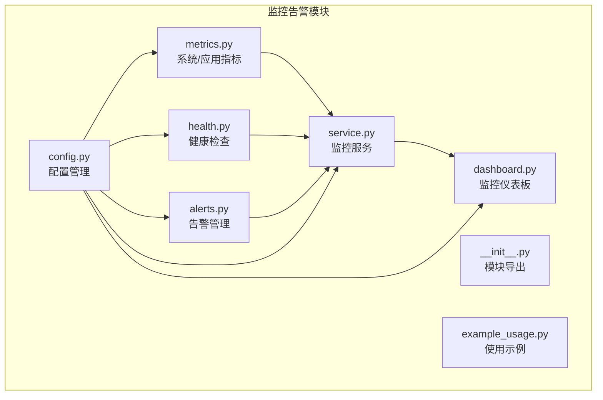
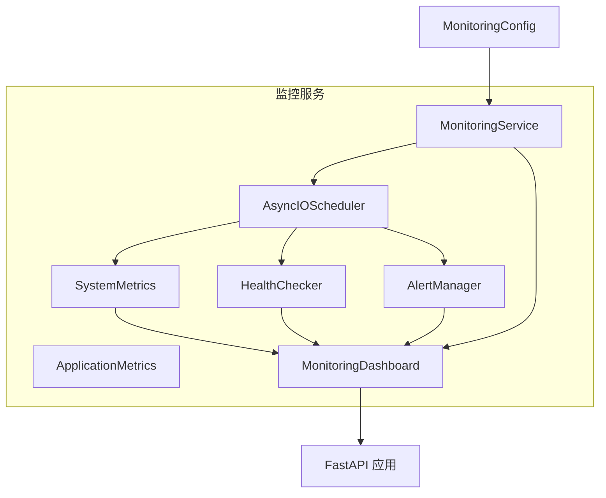
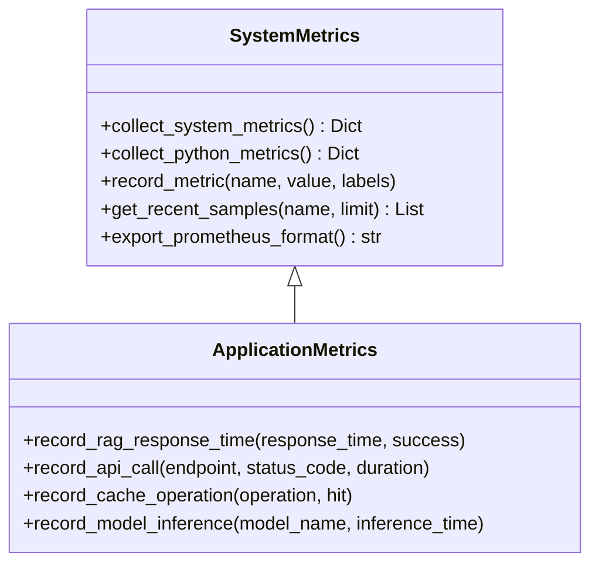
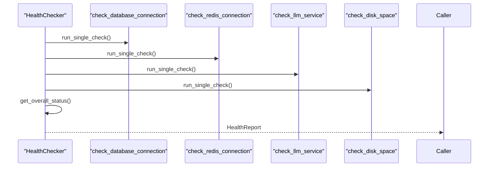
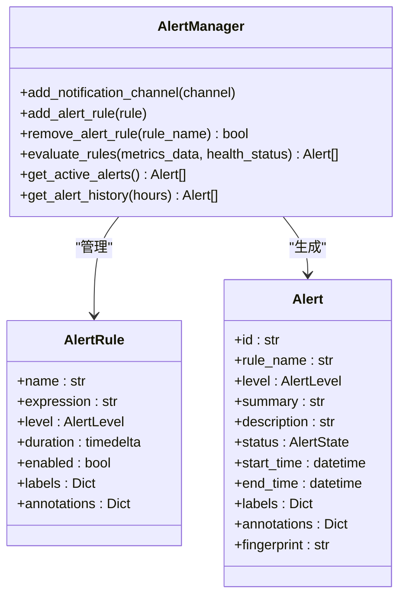
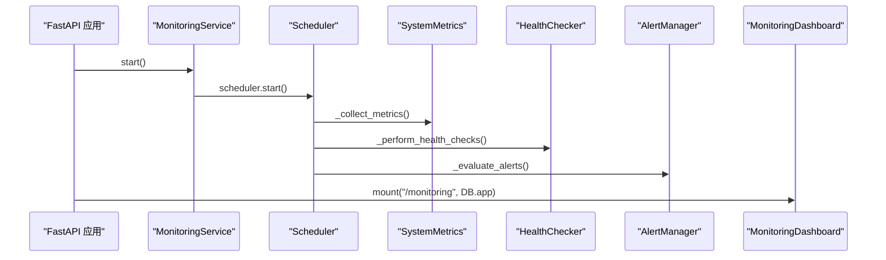
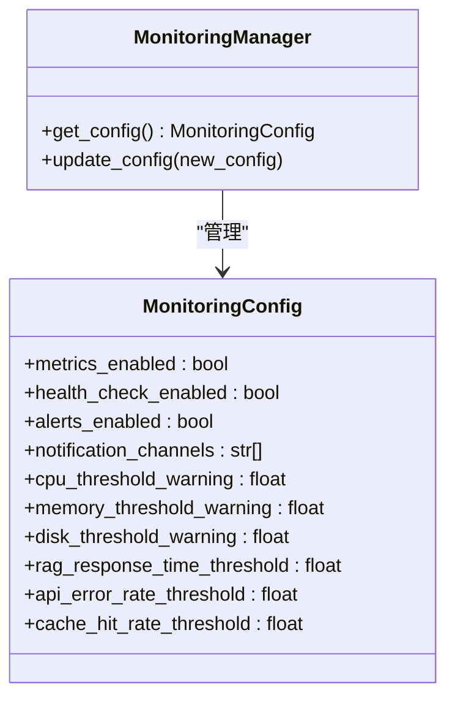
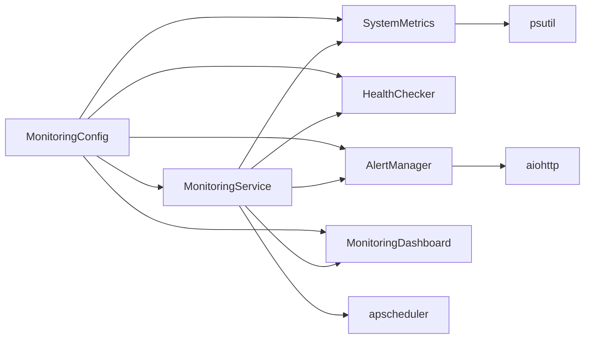

# 监控告警系统

<cite>
**本文引用的文件**
- [src/monitoring/__init__.py](file://src/monitoring/__init__.py)
- [src/monitoring/metrics.py](file://src/monitoring/metrics.py)
- [src/monitoring/health.py](file://src/monitoring/health.py)
- [src/monitoring/alerts.py](file://src/monitoring/alerts.py)
- [src/monitoring/service.py](file://src/monitoring/service.py)
- [src/monitoring/dashboard.py](file://src/monitoring/dashboard.py)
- [src/monitoring/config.py](file://src/monitoring/config.py)
- [src/monitoring/example_usage.py](file://src/monitoring/example_usage.py)
- [src/dashboard/debug/performance.py](file://src/dashboard/debug/performance.py)
- [README.md](file://README.md)
- [wiki/wiki/项目概述/技术架构概览.md](file://wiki/wiki/项目概述/技术架构概览.md)
- [wiki/wiki/部署与运维/监控与告警.md](file://wiki/wiki/部署与运维/监控与告警.md)
- [RELEASE_NOTES_v3.1.0.md](file://RELEASE_NOTES_v3.1.0.md)
</cite>

## 目录
1. [简介](#简介)
2. [项目结构](#项目结构)
3. [核心组件](#核心组件)
4. [架构总览](#架构总览)
5. [详细组件分析](#详细组件分析)
6. [依赖关系分析](#依赖关系分析)
7. [性能考量](#性能考量)
8. [故障排查指南](#故障排查指南)
9. [结论](#结论)
10. [附录](#附录)

## 简介
本文件为 NecoRAG 监控告警系统的详细实现文档，聚焦 v3.3.0-alpha 版本的新增监控功能。系统提供 20+ 系统指标的实时监控，包括 CPU、内存、网络、磁盘、进程等性能指标；内置健康检查机制，覆盖数据库、Redis、LLM 服务、磁盘空间等关键组件；实现多渠道告警通知（控制台、邮件、Webhook、Slack）与告警级别管理；提供监控服务的统一入口，支持数据采集、存储与查询；并通过配置管理实现指标定义与告警规则的灵活配置；同时提供可视化仪表板与趋势分析能力，并给出性能瓶颈识别与优化建议。

## 项目结构
监控告警系统位于 `src/monitoring/` 目录，包含以下核心模块：
- 指标采集：SystemMetrics、ApplicationMetrics
- 健康检查：HealthChecker、预定义健康检查函数
- 告警管理：AlertManager、AlertRule、通知渠道
- 监控服务：MonitoringService、create_monitoring_app
- 仪表板：MonitoringDashboard
- 配置管理：MonitoringConfig、MonitoringManager
- 示例与使用：example_usage.py

**图表来源**
- [src/monitoring/__init__.py:1-35](file://src/monitoring/__init__.py#L1-L35)
- [src/monitoring/metrics.py:1-207](file://src/monitoring/metrics.py#L1-L207)
- [src/monitoring/health.py:1-300](file://src/monitoring/health.py#L1-L300)
- [src/monitoring/alerts.py:1-435](file://src/monitoring/alerts.py#L1-L435)
- [src/monitoring/service.py:1-214](file://src/monitoring/service.py#L1-L214)
- [src/monitoring/dashboard.py:1-250](file://src/monitoring/dashboard.py#L1-L250)
- [src/monitoring/config.py:1-117](file://src/monitoring/config.py#L1-L117)

**章节来源**
- [src/monitoring/__init__.py:1-35](file://src/monitoring/__init__.py#L1-L35)
- [src/monitoring/metrics.py:1-207](file://src/monitoring/metrics.py#L1-L207)
- [src/monitoring/health.py:1-300](file://src/monitoring/health.py#L1-L300)
- [src/monitoring/alerts.py:1-435](file://src/monitoring/alerts.py#L1-L435)
- [src/monitoring/service.py:1-214](file://src/monitoring/service.py#L1-L214)
- [src/monitoring/dashboard.py:1-250](file://src/monitoring/dashboard.py#L1-L250)
- [src/monitoring/config.py:1-117](file://src/monitoring/config.py#L1-L117)

## 核心组件
- SystemMetrics：系统级指标采集，包含 CPU、内存、磁盘、网络、进程等 20+ 指标，并支持 Prometheus 格式导出
- ApplicationMetrics：应用级指标采集，记录 RAG 响应时间、API 调用、缓存操作、模型推理等
- HealthChecker：健康检查器，支持并发执行多项健康检查，生成整体健康状态与报告
- AlertManager：告警管理器，支持多渠道通知、告警级别管理、规则评估与历史记录
- MonitoringService：监控服务主类，整合指标采集、健康检查、告警评估与仪表板，提供统一的启动/停止接口
- MonitoringDashboard：监控仪表板，提供 REST API 与前端页面，支持系统概览、健康状态、活跃告警等展示
- MonitoringConfig：监控配置模型，支持环境变量注入与阈值配置
- 示例与使用：提供基础使用、Web 应用集成、独立运行、自定义监控与性能测试示例

**章节来源**
- [src/monitoring/metrics.py:25-207](file://src/monitoring/metrics.py#L25-L207)
- [src/monitoring/health.py:34-300](file://src/monitoring/health.py#L34-L300)
- [src/monitoring/alerts.py:237-435](file://src/monitoring/alerts.py#L237-L435)
- [src/monitoring/service.py:21-174](file://src/monitoring/service.py#L21-L174)
- [src/monitoring/dashboard.py:17-250](file://src/monitoring/dashboard.py#L17-L250)
- [src/monitoring/config.py:27-117](file://src/monitoring/config.py#L27-L117)
- [src/monitoring/example_usage.py:1-293](file://src/monitoring/example_usage.py#L1-L293)

## 架构总览
监控告警系统采用模块化设计，通过 MonitoringService 统一调度各子系统，支持定时任务与异步评估。系统与 Grafana/Prometheus 的集成通过 Prometheus 格式导出与 HTTP API 暴露实现。

**图表来源**
- [src/monitoring/service.py:21-174](file://src/monitoring/service.py#L21-L174)
- [src/monitoring/metrics.py:25-207](file://src/monitoring/metrics.py#L25-L207)
- [src/monitoring/health.py:34-300](file://src/monitoring/health.py#L34-L300)
- [src/monitoring/alerts.py:237-435](file://src/monitoring/alerts.py#L237-L435)
- [src/monitoring/dashboard.py:17-250](file://src/monitoring/dashboard.py#L17-L250)
- [src/monitoring/config.py:27-117](file://src/monitoring/config.py#L27-L117)

## 详细组件分析

### 指标采集与导出
- SystemMetrics 支持系统级指标采集，包括 CPU 使用率、CPU 频率、负载平均值、内存使用、Swap、磁盘使用、磁盘 IO、网络 IO、进程数量、系统运行时长等
- ApplicationMetrics 支持应用级指标采集，包括 RAG 响应时间、API 请求时长与计数、缓存命中/未命中、模型推理时长等
- 指标样本缓冲区支持最近 1000 个样本的存储，并提供 Prometheus 格式导出能力

**图表来源**
- [src/monitoring/metrics.py:25-207](file://src/monitoring/metrics.py#L25-L207)

**章节来源**
- [src/monitoring/metrics.py:25-207](file://src/monitoring/metrics.py#L25-L207)

### 健康检查机制
- HealthChecker 支持注册多个健康检查函数，支持并发执行与历史记录
- 预定义健康检查包括数据库连接、Redis 连接、LLM 服务、磁盘空间等
- 整体健康状态根据关键检查与非关键检查的组合进行判定

**图表来源**
- [src/monitoring/health.py:34-300](file://src/monitoring/health.py#L34-L300)

**章节来源**
- [src/monitoring/health.py:34-300](file://src/monitoring/health.py#L34-L300)

### 告警管理器
- AlertManager 支持多渠道通知（控制台、邮件、Webhook、Slack），并支持告警级别管理
- 默认规则包括 CPU 使用率过高、内存使用率过高、系统健康状态异常等
- 告警状态包括触发中、已解决、已静默，支持历史记录与保留策略

**图表来源**
- [src/monitoring/alerts.py:237-435](file://src/monitoring/alerts.py#L237-L435)

**章节来源**
- [src/monitoring/alerts.py:237-435](file://src/monitoring/alerts.py#L237-L435)

### 监控服务与仪表板
- MonitoringService 通过 APScheduler 定时调度指标采集、健康检查与告警评估
- MonitoringDashboard 提供 REST API 与前端页面，支持系统概览、健康状态、活跃告警等展示
- create_monitoring_app 将仪表板挂载到 FastAPI 应用，提供统一的监控入口

**图表来源**
- [src/monitoring/service.py:21-174](file://src/monitoring/service.py#L21-L174)
- [src/monitoring/dashboard.py:17-250](file://src/monitoring/dashboard.py#L17-L250)

**章节来源**
- [src/monitoring/service.py:21-174](file://src/monitoring/service.py#L21-L174)
- [src/monitoring/dashboard.py:17-250](file://src/monitoring/dashboard.py#L17-L250)

### 配置管理
- MonitoringConfig 支持指标采集、健康检查、告警评估、通知渠道、性能阈值等配置
- 支持通过环境变量注入配置，便于容器化部署与多环境管理
- 提供全局 MonitoringManager 与 get_monitoring_config 依赖注入

**图表来源**
- [src/monitoring/config.py:27-117](file://src/monitoring/config.py#L27-L117)

**章节来源**
- [src/monitoring/config.py:27-117](file://src/monitoring/config.py#L27-L117)

### 与 Grafana/Prometheus 的集成
- SystemMetrics 提供 Prometheus 格式导出方法，可直接被 Prometheus 抓取
- 通过 MonitoringDashboard 暴露的 API 可以集成到 Grafana 进行可视化展示
- README 与 Wiki 文档明确标注了 Grafana/Prometheus 集成能力

**章节来源**
- [src/monitoring/metrics.py:144-174](file://src/monitoring/metrics.py#L144-L174)
- [README.md:144-149](file://README.md#L144-L149)
- [wiki/wiki/部署与运维/监控与告警.md:329-333](file://wiki/wiki/部署与运维/监控与告警.md#L329-L333)

### v3.3.0-alpha 新增监控功能
- 在 README 中明确标注监控告警系统为 v3.3.0-alpha 新增模块，包含实时监控（20+ 性能指标）、健康检查、告警管理、Grafana/Prometheus 集成
- Wiki 的监控与告警文档提供了更详细的配置与使用指导

**章节来源**
- [README.md:144-149](file://README.md#L144-L149)
- [wiki/wiki/部署与运维/监控与告警.md:1-446](file://wiki/wiki/部署与运维/监控与告警.md#L1-L446)
- [RELEASE_NOTES_v3.1.0.md:104-149](file://RELEASE_NOTES_v3.1.0.md#L104-L149)

## 依赖关系分析
- 组件耦合：MonitoringService 作为统一入口，协调 SystemMetrics、HealthChecker、AlertManager、MonitoringDashboard
- 配置依赖：各组件通过 get_monitoring_config 获取统一配置，支持环境变量注入
- 外部依赖：psutil 用于系统指标采集，aiohttp 用于异步通知发送，apscheduler 用于定时调度

**图表来源**
- [src/monitoring/service.py:21-174](file://src/monitoring/service.py#L21-L174)
- [src/monitoring/metrics.py:5-13](file://src/monitoring/metrics.py#L5-L13)
- [src/monitoring/alerts.py:9-16](file://src/monitoring/alerts.py#L9-L16)
- [src/monitoring/config.py:5-8](file://src/monitoring/config.py#L5-L8)

**章节来源**
- [src/monitoring/service.py:21-174](file://src/monitoring/service.py#L21-L174)
- [src/monitoring/metrics.py:5-13](file://src/monitoring/metrics.py#L5-L13)
- [src/monitoring/alerts.py:9-16](file://src/monitoring/alerts.py#L9-L16)
- [src/monitoring/config.py:5-8](file://src/monitoring/config.py#L5-L8)

## 性能考量
- 指标采集：SystemMetrics 使用 psutil 进行系统指标采集，建议合理设置采集间隔以平衡准确性与性能
- 健康检查：HealthChecker 支持并发执行，避免单点阻塞，建议为关键检查设置超时
- 告警评估：AlertManager 的规则评估目前为简化实现，建议在生产环境中引入更复杂的表达式解析引擎
- 通知渠道：Email、Webhook、Slack 通知为异步发送，建议配置重试与退避策略
- 仪表板：MonitoringDashboard 提供并发获取数据的能力，建议对热点数据进行缓存

**章节来源**
- [src/monitoring/service.py:99-154](file://src/monitoring/service.py#L99-L154)
- [src/monitoring/health.py:107-131](file://src/monitoring/health.py#L107-L131)
- [src/monitoring/alerts.py:374-382](file://src/monitoring/alerts.py#L374-L382)
- [src/monitoring/dashboard.py:82-101](file://src/monitoring/dashboard.py#L82-L101)

## 故障排查指南
- 监控服务启动失败：检查配置项与依赖库安装，查看日志输出定位具体错误
- 指标采集异常：确认 psutil 是否正确安装，检查系统权限与资源可用性
- 健康检查失败：检查对应组件的连接状态与可用性，确认超时设置合理
- 告警通知失败：检查通知渠道配置（SMTP、Webhook、Slack），确认网络连通性
- 仪表板页面无法访问：确认 FastAPI 应用已正确挂载监控仪表板，检查端口占用与 CORS 设置

**章节来源**
- [src/monitoring/service.py:78-98](file://src/monitoring/service.py#L78-L98)
- [src/monitoring/health.py:95-105](file://src/monitoring/health.py#L95-L105)
- [src/monitoring/alerts.py:120-131](file://src/monitoring/alerts.py#L120-L131)
- [src/monitoring/dashboard.py:107-111](file://src/monitoring/dashboard.py#L107-L111)

## 结论
NecoRAG 监控告警系统通过模块化设计实现了对系统性能、健康状态与业务指标的全面监控。v3.3.0-alpha 版本新增的监控告警模块提供了 20+ 系统指标的实时采集、健康检查与多渠道告警通知，并通过 Prometheus 格式导出与 Grafana 集成实现可视化展示。系统支持灵活的配置管理与扩展，能够满足生产环境的监控需求。建议在生产环境中进一步完善告警规则表达式、通知渠道的可靠性与仪表板的性能优化。

## 附录
- 使用示例：包含基础使用、Web 应用集成、独立运行、自定义监控与性能测试示例
- 性能监控与错误处理：提供独立的性能监控与错误处理模块，可与监控告警系统协同使用

**章节来源**
- [src/monitoring/example_usage.py:1-293](file://src/monitoring/example_usage.py#L1-L293)
- [src/dashboard/debug/performance.py:1-658](file://src/dashboard/debug/performance.py#L1-L658)