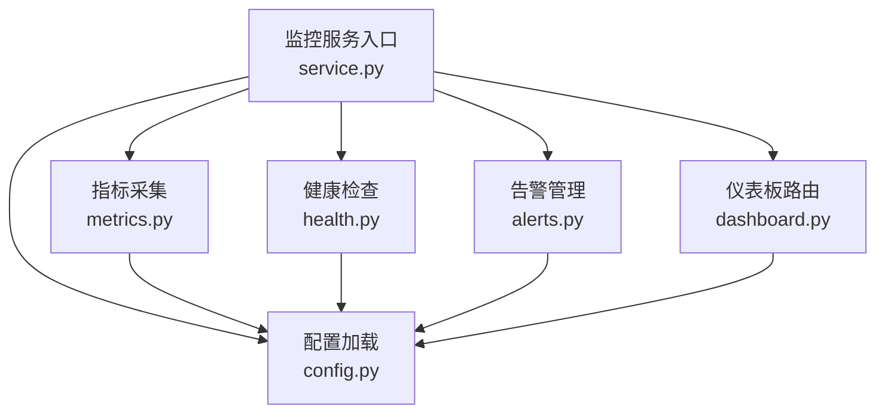
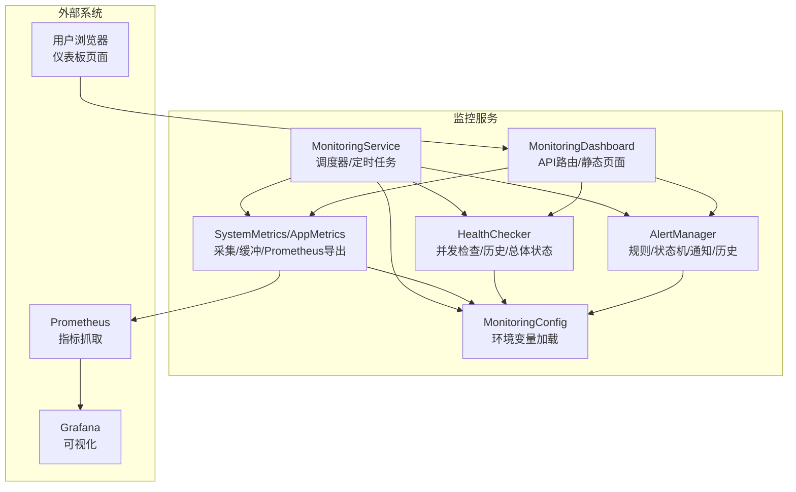
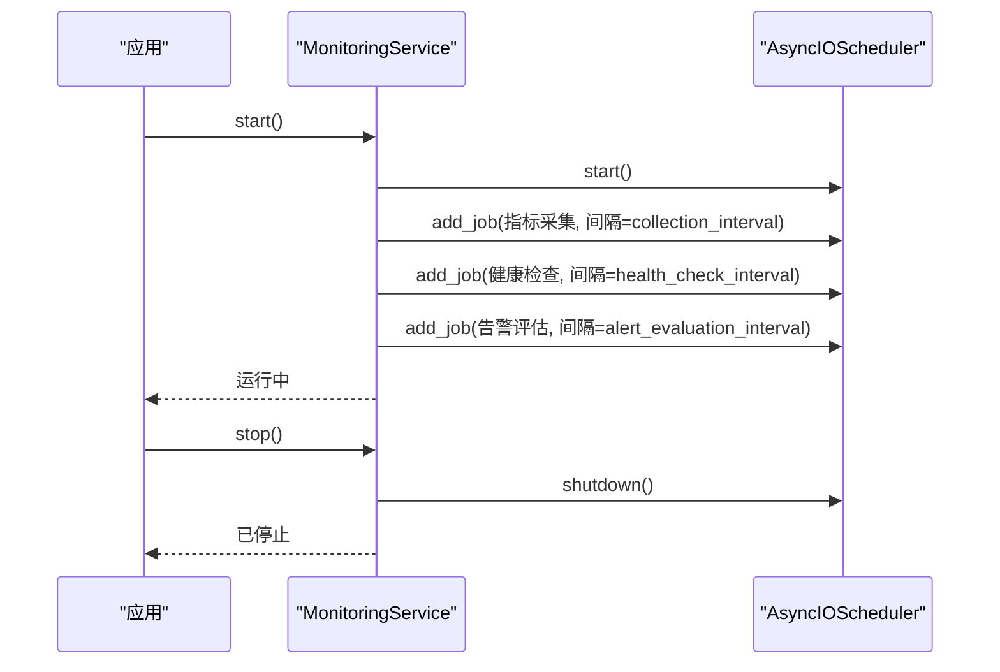
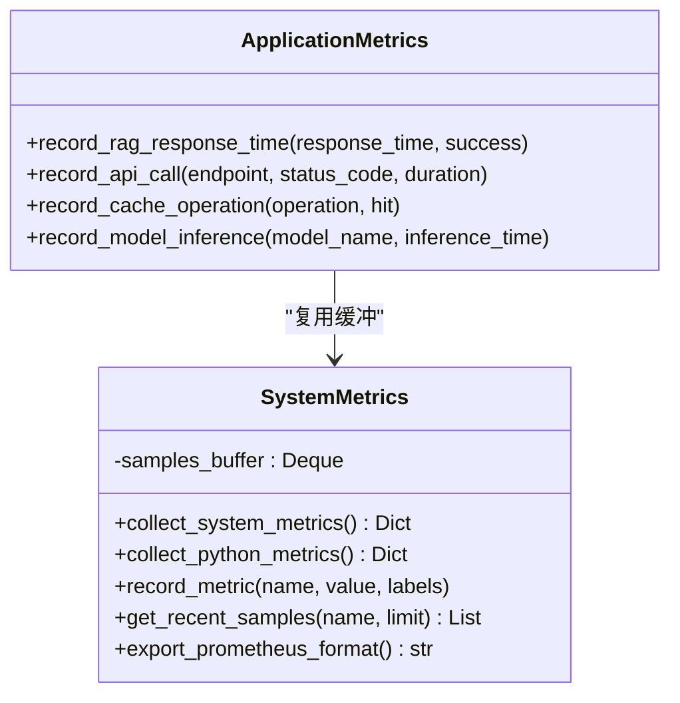
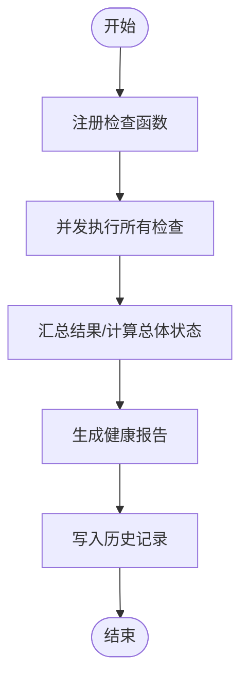
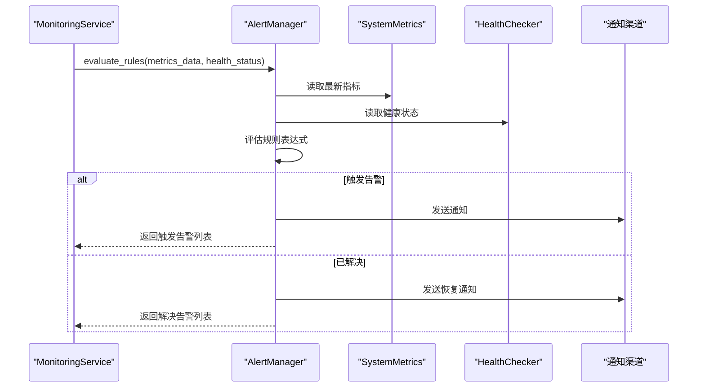
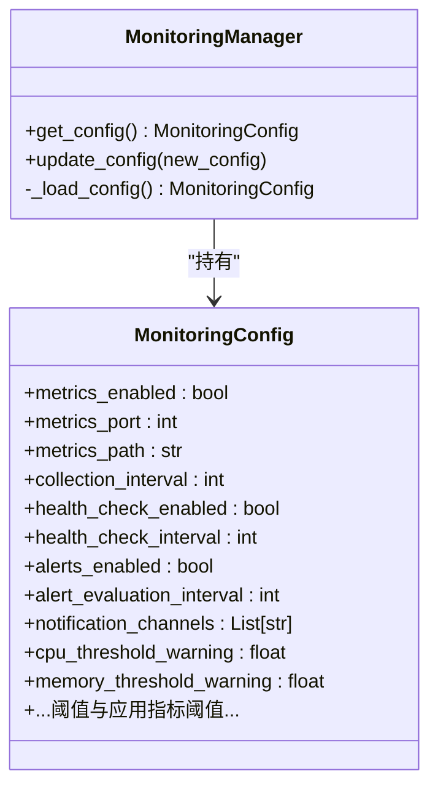
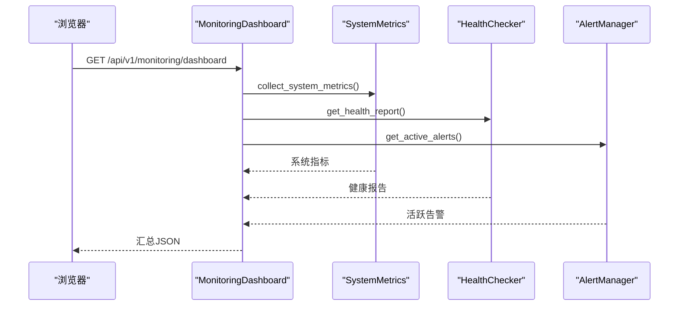
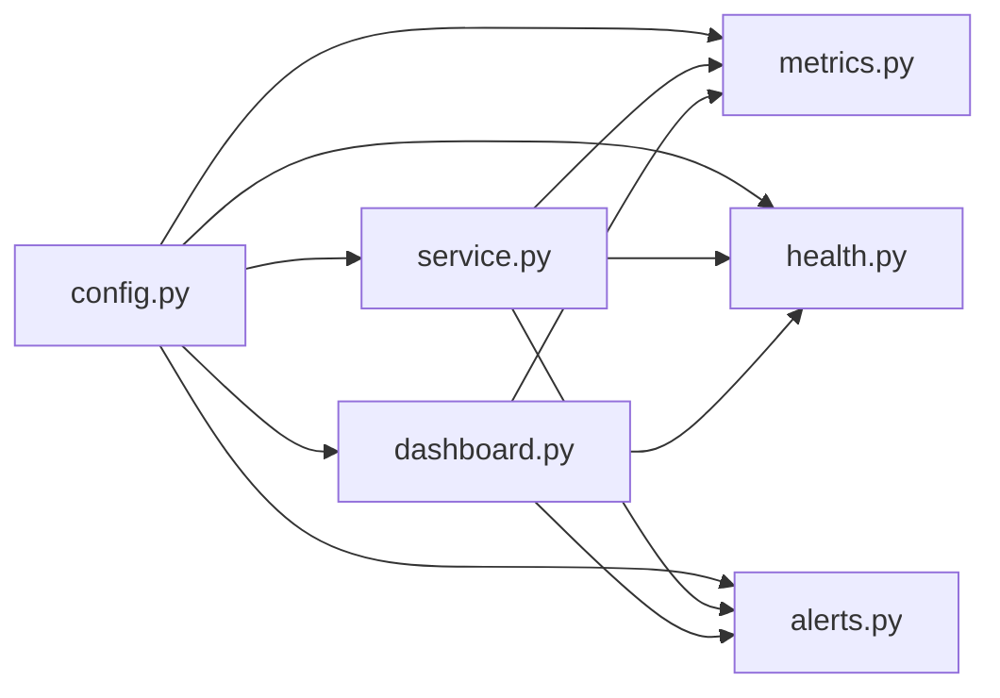

# 监控服务

<cite>
**本文引用的文件**
- [src/monitoring/__init__.py](file://src/monitoring/__init__.py)
- [src/monitoring/service.py](file://src/monitoring/service.py)
- [src/monitoring/metrics.py](file://src/monitoring/metrics.py)
- [src/monitoring/alerts.py](file://src/monitoring/alerts.py)
- [src/monitoring/config.py](file://src/monitoring/config.py)
- [src/monitoring/dashboard.py](file://src/monitoring/dashboard.py)
- [src/monitoring/health.py](file://src/monitoring/health.py)
- [src/monitoring/example_usage.py](file://src/monitoring/example_usage.py)
- [pyproject.toml](file://pyproject.toml)
- [devops/Dockerfile](file://devops/Dockerfile)
- [devops/docker-compose.yml](file://devops/docker-compose.yml)
- [3rd/DEPLOYMENT_GUIDE.md](file://3rd/DEPLOYMENT_GUIDE.md)
- [devops/README.md](file://devops/README.md)
</cite>

## 目录
1. [简介](#简介)
2. [项目结构](#项目结构)
3. [核心组件](#核心组件)
4. [架构总览](#架构总览)
5. [详细组件分析](#详细组件分析)
6. [依赖分析](#依赖分析)
7. [性能考虑](#性能考虑)
8. [故障排查指南](#故障排查指南)
9. [结论](#结论)
10. [附录](#附录)

## 简介
本文件面向监控服务模块，系统化梳理其架构设计、配置加载、指标采集、存储与查询、API 接口、扩展与可配置性、与外部监控系统（如 Prometheus、Grafana）的集成方式、性能优化策略、部署与运维指南，并总结 v3.3.0-alpha 版本的改进要点。文档兼顾工程实践与非技术读者的理解成本，提供可视化图示与分层讲解。

## 项目结构
监控服务位于 src/monitoring 目录，采用“功能模块化 + 轻量集成”的组织方式：
- service.py：监控服务主入口，负责调度器启动、定时任务、服务生命周期管理
- metrics.py：系统与应用指标采集、缓冲与导出
- health.py：健康检查框架与默认检查项
- alerts.py：告警规则、状态机与多渠道通知
- config.py：配置模型与环境变量加载
- dashboard.py：FastAPI 路由与监控仪表板页面
- example_usage.py：使用示例与性能测试
- __init__.py：对外导出聚合入口

**图示来源**
- [src/monitoring/service.py:21-174](file://src/monitoring/service.py#L21-L174)
- [src/monitoring/metrics.py:25-207](file://src/monitoring/metrics.py#L25-L207)
- [src/monitoring/health.py:34-300](file://src/monitoring/health.py#L34-L300)
- [src/monitoring/alerts.py:237-435](file://src/monitoring/alerts.py#L237-L435)
- [src/monitoring/dashboard.py:17-250](file://src/monitoring/dashboard.py#L17-L250)
- [src/monitoring/config.py:27-117](file://src/monitoring/config.py#L27-L117)

**章节来源**
- [src/monitoring/__init__.py:1-35](file://src/monitoring/__init__.py#L1-L35)
- [src/monitoring/service.py:1-214](file://src/monitoring/service.py#L1-L214)
- [src/monitoring/metrics.py:1-207](file://src/monitoring/metrics.py#L1-L207)
- [src/monitoring/health.py:1-300](file://src/monitoring/health.py#L1-L300)
- [src/monitoring/alerts.py:1-435](file://src/monitoring/alerts.py#L1-L435)
- [src/monitoring/dashboard.py:1-250](file://src/monitoring/dashboard.py#L1-L250)
- [src/monitoring/config.py:1-117](file://src/monitoring/config.py#L1-L117)

## 核心组件
- 监控服务（MonitoringService）：封装调度器、定时任务、服务启停与状态查询
- 指标系统（SystemMetrics/ApplicationMetrics）：系统级与应用级指标采集、缓冲与 Prometheus 导出
- 健康检查（HealthChecker）：注册式检查、并发执行、历史记录与总体状态计算
- 告警系统（AlertManager）：规则表达式评估、告警状态机、多渠道通知与历史清理
- 配置系统（MonitoringConfig/MonitoringManager）：Pydantic 模型 + 环境变量加载
- 仪表板（MonitoringDashboard）：REST API 路由与前端页面，聚合系统、健康、告警数据

**章节来源**
- [src/monitoring/service.py:21-174](file://src/monitoring/service.py#L21-L174)
- [src/monitoring/metrics.py:25-207](file://src/monitoring/metrics.py#L25-L207)
- [src/monitoring/health.py:34-300](file://src/monitoring/health.py#L34-L300)
- [src/monitoring/alerts.py:237-435](file://src/monitoring/alerts.py#L237-L435)
- [src/monitoring/config.py:27-117](file://src/monitoring/config.py#L27-L117)
- [src/monitoring/dashboard.py:17-250](file://src/monitoring/dashboard.py#L17-L250)

## 架构总览
监控服务以异步调度器为核心，周期性执行指标采集、健康检查与告警评估；同时通过 FastAPI 提供仪表板与监控 API；配置通过环境变量动态注入；Prometheus 作为外部指标导出目标。

**图示来源**
- [src/monitoring/service.py:38-154](file://src/monitoring/service.py#L38-L154)
- [src/monitoring/metrics.py:144-174](file://src/monitoring/metrics.py#L144-L174)
- [src/monitoring/dashboard.py:26-104](file://src/monitoring/dashboard.py#L26-L104)
- [src/monitoring/config.py:72-100](file://src/monitoring/config.py#L72-L100)

## 详细组件分析

### 监控服务（MonitoringService）
- 职责：启动/停止调度器、注册定时任务（指标采集、健康检查、告警评估）、提供状态查询
- 关键流程：启动时根据配置添加间隔任务；停止时关闭调度器
- 状态：运行状态、配置开关、组件激活状态、更新时间

**图示来源**
- [src/monitoring/service.py:38-98](file://src/monitoring/service.py#L38-L98)

**章节来源**
- [src/monitoring/service.py:21-174](file://src/monitoring/service.py#L21-L174)

### 指标系统（SystemMetrics/ApplicationMetrics）
- SystemMetrics：采集 CPU、内存、磁盘、网络、进程、系统运行时等指标，使用双端队列缓冲最近样本
- ApplicationMetrics：封装应用特定指标（如 RAG 响应时间、API 调用、缓存操作、模型推理）
- Prometheus 导出：将缓冲中的样本按指标名分组，输出 Gauge 类型的最新值

**图示来源**
- [src/monitoring/metrics.py:25-207](file://src/monitoring/metrics.py#L25-L207)

**章节来源**
- [src/monitoring/metrics.py:1-207](file://src/monitoring/metrics.py#L1-L207)

### 健康检查（HealthChecker）
- 支持注册任意检查函数，异步并发执行
- 结果包含状态、消息、耗时、细节；支持历史记录与总体状态计算
- 默认检查项：数据库连接、Redis 连接、LLM 服务、磁盘空间

**图示来源**
- [src/monitoring/health.py:107-154](file://src/monitoring/health.py#L107-L154)

**章节来源**
- [src/monitoring/health.py:1-300](file://src/monitoring/health.py#L1-L300)

### 告警系统（AlertManager）
- 规则：名称、表达式、级别、持续时间、标签与注解
- 状态机：触发中、已解决、已静默
- 通知渠道：控制台、邮件、Webhook、Slack
- 评估：基于表达式与阈值（CPU、内存、健康状态），并发发送通知

**图示来源**
- [src/monitoring/service.py:135-153](file://src/monitoring/service.py#L135-L153)
- [src/monitoring/alerts.py:291-344](file://src/monitoring/alerts.py#L291-L344)

**章节来源**
- [src/monitoring/alerts.py:1-435](file://src/monitoring/alerts.py#L1-L435)

### 配置系统（MonitoringConfig/MonitoringManager）
- 配置项：指标采集开关与周期、健康检查开关与周期、告警开关与评估周期、通知渠道、阈值、应用指标阈值
- 环境变量映射：MONITORING_* 前缀的变量自动注入
- 动态更新：支持运行时替换配置对象

**图示来源**
- [src/monitoring/config.py:27-117](file://src/monitoring/config.py#L27-L117)

**章节来源**
- [src/monitoring/config.py:1-117](file://src/monitoring/config.py#L1-L117)

### 仪表板与 API（MonitoringDashboard）
- 路由：/api/v1/monitoring/metrics/system、/metrics/application、/health、/alerts、/dashboard
- 页面：静态 HTML，定时刷新系统状态、CPU/内存使用率、活跃告警数量
- 并发聚合：仪表板汇总接口并发获取系统、健康、告警数据

**图示来源**
- [src/monitoring/dashboard.py:82-101](file://src/monitoring/dashboard.py#L82-L101)

**章节来源**
- [src/monitoring/dashboard.py:1-250](file://src/monitoring/dashboard.py#L1-L250)

## 依赖分析
- 内部依赖：各模块通过 config.get_monitoring_config() 获取统一配置；service 聚合 metrics/health/alerts/dashboard
- 外部依赖：psutil（系统指标）、apscheduler（调度）、FastAPI/Uvicorn（Web）、aiohttp（异步 HTTP）、prometheus-client（可选）

**图示来源**
- [src/monitoring/config.py:115-117](file://src/monitoring/config.py#L115-L117)
- [src/monitoring/service.py:14-18](file://src/monitoring/service.py#L14-L18)
- [src/monitoring/dashboard.py:11-14](file://src/monitoring/dashboard.py#L11-L14)

**章节来源**
- [pyproject.toml:72-74](file://pyproject.toml#L72-L74)

## 性能考虑
- 指标缓冲：使用固定容量双端队列保留最近样本，避免无限增长
- 并发执行：健康检查与仪表板聚合使用 asyncio.gather 并发获取数据
- 异步调度：基于 AsyncIOScheduler 的定时任务，避免阻塞主线程
- 导出格式：Prometheus 导出为 Gauge 类型，仅输出最新样本，降低体积
- I/O 优化：健康检查与通知渠道均采用异步 HTTP 客户端

**章节来源**
- [src/monitoring/metrics.py:30-31](file://src/monitoring/metrics.py#L30-L31)
- [src/monitoring/dashboard.py:86-94](file://src/monitoring/dashboard.py#L86-L94)
- [src/monitoring/alerts.py:142-169](file://src/monitoring/alerts.py#L142-L169)

## 故障排查指南
- 启动失败：检查调度器启动与异常日志；确认配置开关（指标/健康/告警）与间隔参数
- 指标缺失：确认 psutil 可用与权限；检查缓冲容量与导出逻辑
- 健康检查异常：查看检查函数返回格式与异常捕获；确认默认检查项是否覆盖关键组件
- 告警未触发：核对规则表达式与阈值；检查通知渠道可用性
- 仪表板空白：确认路由挂载与静态页面路径；检查浏览器网络面板与 CORS

**章节来源**
- [src/monitoring/service.py:78-80](file://src/monitoring/service.py#L78-L80)
- [src/monitoring/metrics.py:144-174](file://src/monitoring/metrics.py#L144-L174)
- [src/monitoring/health.py:95-105](file://src/monitoring/health.py#L95-L105)
- [src/monitoring/alerts.py:374-381](file://src/monitoring/alerts.py#L374-L381)
- [src/monitoring/dashboard.py:107-110](file://src/monitoring/dashboard.py#L107-L110)

## 结论
监控服务模块以轻量、可配置、可扩展为目标，通过统一调度与配置中心实现指标采集、健康检查与告警通知的闭环，并提供 REST API 与可视化仪表板。结合 Prometheus/Grafana 可实现企业级可观测性。v3.3.0-alpha 在部署与监控集成方面提供了更完善的容器化与可视化能力。

## 附录

### API 接口清单（RESTful）
- GET /api/v1/monitoring/metrics/system：系统指标
- GET /api/v1/monitoring/metrics/application：应用指标
- GET /api/v1/monitoring/health：健康报告
- GET /api/v1/monitoring/alerts?active_only={bool}：告警列表
- GET /api/v1/monitoring/dashboard：仪表板汇总
- GET /status：监控服务状态

**章节来源**
- [src/monitoring/dashboard.py:29-101](file://src/monitoring/dashboard.py#L29-L101)
- [src/monitoring/service.py:195-198](file://src/monitoring/service.py#L195-L198)

### 与外部监控系统集成
- Prometheus：通过 metrics.export_prometheus_format 输出 Gauge 指标，供 Prometheus 抓取
- Grafana：通过预置数据源与仪表盘模板进行可视化展示

**章节来源**
- [src/monitoring/metrics.py:144-174](file://src/monitoring/metrics.py#L144-L174)
- [devops/docker-compose.yml:100-117](file://devops/docker-compose.yml#L100-L117)
- [3rd/DEPLOYMENT_GUIDE.md:676-707](file://3rd/DEPLOYMENT_GUIDE.md#L676-L707)

### 部署与运维指南
- Docker 镜像：Python 3.11-slim，暴露 8000 端口，内置健康检查
- Compose 编排：包含 necorag、Prometheus、Grafana 等服务
- 环境变量：MONITORING_* 前缀用于监控配置注入
- 端口与访问：应用 8000，Prometheus 9090，Grafana 3000

**章节来源**
- [devops/Dockerfile:1-39](file://devops/Dockerfile#L1-L39)
- [devops/docker-compose.yml:1-164](file://devops/docker-compose.yml#L1-L164)
- [3rd/DEPLOYMENT_GUIDE.md:1-170](file://3rd/DEPLOYMENT_GUIDE.md#L1-L170)
- [devops/README.md:170-194](file://devops/README.md#L170-L194)

### v3.3.0-alpha 版本改进
- 版本号：3.3.0-alpha
- 监控集成：完善 Prometheus/Grafana 集成与仪表盘配置
- 部署指南：提供一键启动脚本、最小化部署与生产优化配置
- 环境变量：新增 PROMETHEUS_*、GRAFANA_* 等监控相关变量

**章节来源**
- [pyproject.toml:7-8](file://pyproject.toml#L7-L8)
- [3rd/DEPLOYMENT_GUIDE.md:519-525](file://3rd/DEPLOYMENT_GUIDE.md#L519-L525)
- [devops/README.md:170-194](file://devops/README.md#L170-L194)