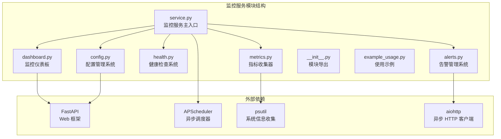
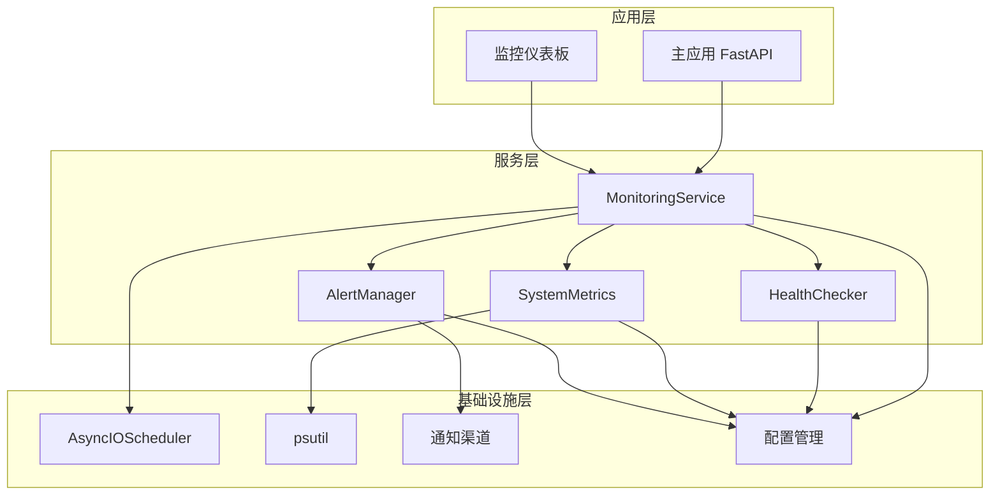
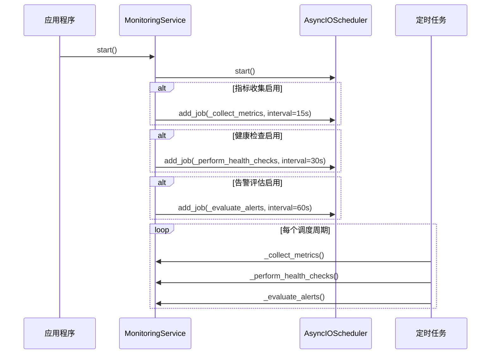
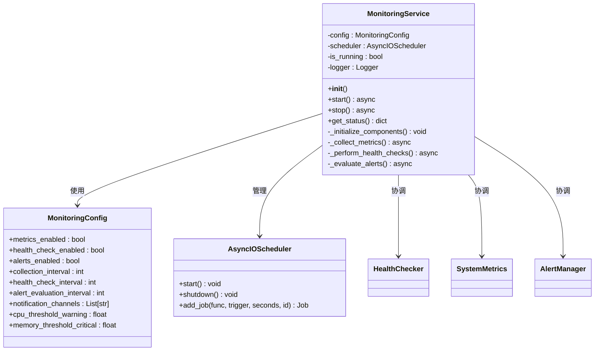
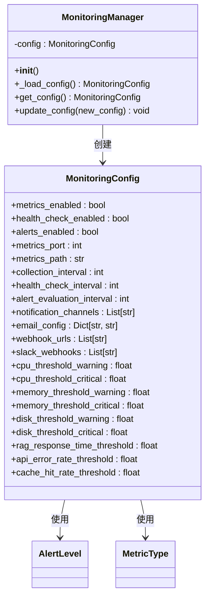
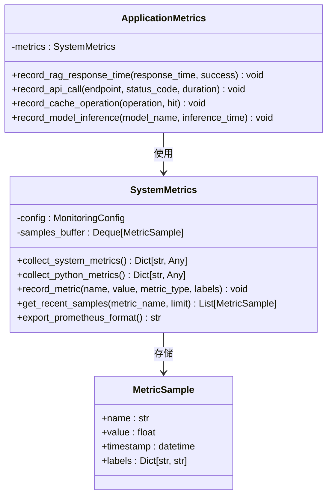
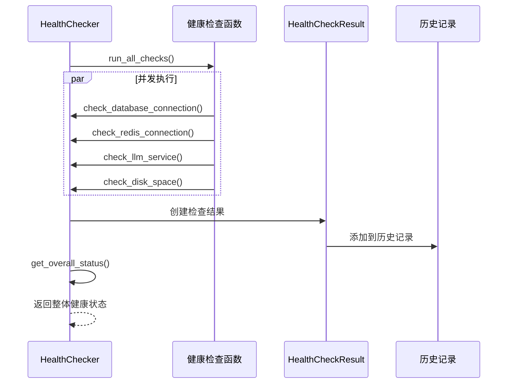
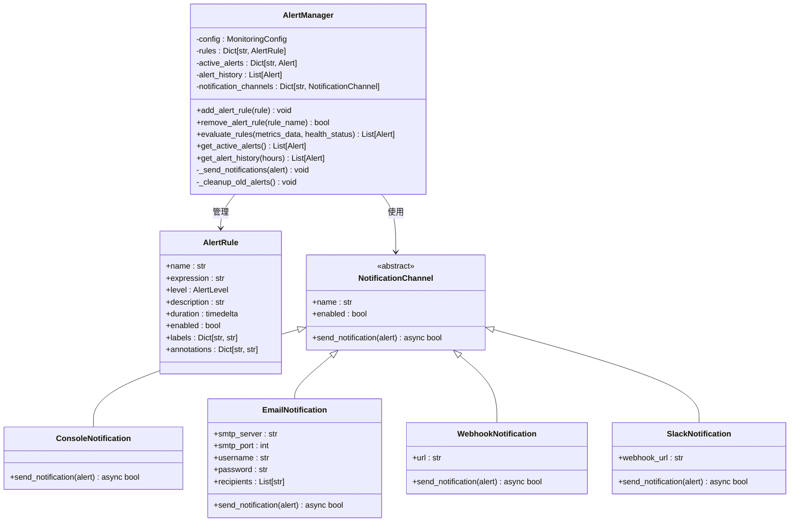
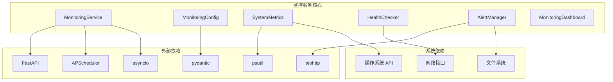

# 监控服务核心

<cite>
**本文档引用的文件**
- [service.py](file://src/monitoring/service.py)
- [config.py](file://src/monitoring/config.py)
- [metrics.py](file://src/monitoring/metrics.py)
- [health.py](file://src/monitoring/health.py)
- [alerts.py](file://src/monitoring/alerts.py)
- [dashboard.py](file://src/monitoring/dashboard.py)
- [example_usage.py](file://src/monitoring/example_usage.py)
- [__init__.py](file://src/monitoring/__init__.py)
- [requirements.txt](file://requirements.txt)
</cite>

## 目录
1. [简介](#简介)
2. [项目结构](#项目结构)
3. [核心组件](#核心组件)
4. [架构概览](#架构概览)
5. [详细组件分析](#详细组件分析)
6. [依赖关系分析](#依赖关系分析)
7. [性能考虑](#性能考虑)
8. [故障排除指南](#故障排除指南)
9. [结论](#结论)
10. [附录](#附录)

## 简介

NecoRAG 监控服务核心模块是一个完整的监控解决方案，提供了系统性能监控、健康检查、指标收集和告警通知功能。该模块采用异步架构设计，集成了 APScheduler 定时调度器，支持多种通知渠道，并提供了直观的 Web 仪表板。

监控服务的核心目标是为 NecoRAG 认知型 RAG 框架提供全面的运行时监控能力，包括系统资源监控、应用性能跟踪、健康状态检查和智能告警通知。

## 项目结构

监控服务模块位于 `src/monitoring/` 目录下，包含以下核心文件：



**图表来源**
- [service.py:1-214](file://src/monitoring/service.py#L1-L214)
- [config.py:1-117](file://src/monitoring/config.py#L1-L117)
- [metrics.py:1-207](file://src/monitoring/metrics.py#L1-L207)
- [health.py:1-300](file://src/monitoring/health.py#L1-L300)
- [alerts.py:1-435](file://src/monitoring/alerts.py#L1-L435)
- [dashboard.py:1-250](file://src/monitoring/dashboard.py#L1-L250)

**章节来源**
- [service.py:1-214](file://src/monitoring/service.py#L1-L214)
- [__init__.py:1-35](file://src/monitoring/__init__.py#L1-L35)

## 核心组件

监控服务由以下核心组件构成：

### 1. MonitoringService 主服务类
- **职责**: 整合所有监控功能，提供统一的服务接口
- **特性**: 异步调度器管理、组件生命周期控制、状态查询接口
- **关键方法**: `start()`, `stop()`, `get_status()`

### 2. 配置管理系统
- **职责**: 提供监控配置的加载、验证和管理
- **特性**: 环境变量支持、默认值设置、配置热更新
- **关键类**: `MonitoringConfig`, `MonitoringManager`

### 3. 指标收集系统
- **职责**: 收集系统和应用层面的性能指标
- **特性**: 多维度指标、Prometheus 格式导出、缓冲区管理
- **关键类**: `SystemMetrics`, `ApplicationMetrics`

### 4. 健康检查系统
- **职责**: 执行系统健康状态检查
- **特性**: 并发检查、状态聚合、历史记录
- **关键类**: `HealthChecker`, `HealthCheckResult`

### 5. 告警管理系统
- **职责**: 管理告警规则和通知渠道
- **特性**: 多级别告警、多种通知渠道、告警状态管理
- **关键类**: `AlertManager`, `AlertRule`, `NotificationChannel`

**章节来源**
- [service.py:21-174](file://src/monitoring/service.py#L21-L174)
- [config.py:27-117](file://src/monitoring/config.py#L27-L117)
- [metrics.py:25-207](file://src/monitoring/metrics.py#L25-L207)
- [health.py:34-300](file://src/monitoring/health.py#L34-L300)
- [alerts.py:237-435](file://src/monitoring/alerts.py#L237-L435)

## 架构概览

监控服务采用分层架构设计，各组件之间通过清晰的接口进行交互：



**图表来源**
- [service.py:38-98](file://src/monitoring/service.py#L38-L98)
- [metrics.py:32-95](file://src/monitoring/metrics.py#L32-L95)
- [health.py:107-130](file://src/monitoring/health.py#L107-L130)
- [alerts.py:291-344](file://src/monitoring/alerts.py#L291-L344)

### 异步调度器配置

监控服务使用 APScheduler 的 AsyncIOScheduler 来管理定时任务：



**图表来源**
- [service.py:48-73](file://src/monitoring/service.py#L48-L73)
- [service.py:99-153](file://src/monitoring/service.py#L99-L153)

**章节来源**
- [service.py:24-36](file://src/monitoring/service.py#L24-L36)
- [service.py:48-73](file://src/monitoring/service.py#L48-L73)

## 详细组件分析

### MonitoringService 类分析

MonitoringService 是监控服务的核心类，负责协调所有监控组件的工作：



**图表来源**
- [service.py:21-174](file://src/monitoring/service.py#L21-L174)
- [config.py:27-64](file://src/monitoring/config.py#L27-L64)

#### 启动流程详解

监控服务的启动流程包含以下关键步骤：

1. **配置初始化**: 加载环境变量配置并创建 MonitoringConfig 实例
2. **调度器启动**: 初始化 AsyncIOScheduler 并启动异步事件循环
3. **定时任务注册**: 根据配置注册指标收集、健康检查和告警评估任务
4. **组件激活**: 设置 is_running 标志为 True，准备接收请求

#### 停止机制分析

停止流程确保优雅关闭所有组件：

1. **状态检查**: 验证服务是否正在运行
2. **调度器关闭**: 调用 scheduler.shutdown() 方法
3. **资源清理**: 清理所有注册的任务和连接
4. **状态更新**: 设置 is_running 为 False

**章节来源**
- [service.py:38-98](file://src/monitoring/service.py#L38-L98)

### 配置系统分析

配置系统采用 Pydantic BaseModel 设计，提供类型安全的配置管理：



**图表来源**
- [config.py:27-117](file://src/monitoring/config.py#L27-L117)

#### 环境变量配置映射

配置系统支持丰富的环境变量配置：

| 配置类别 | 环境变量前缀 | 默认值 | 用途 |
|---------|-------------|--------|------|
| 指标收集 | MONITORING_METRICS_* | 见下方 | 系统指标监控 |
| 健康检查 | MONITORING_HEALTH_* | 见下方 | 系统健康状态 |
| 告警配置 | MONITORING_ALERTS_* | 见下方 | 告警规则管理 |
| 通知渠道 | MONITORING_* | 见下方 | 多渠道通知 |

**章节来源**
- [config.py:72-100](file://src/monitoring/config.py#L72-L100)

### 指标收集系统分析

指标收集系统提供多层次的性能监控能力：



**图表来源**
- [metrics.py:25-207](file://src/monitoring/metrics.py#L25-L207)

#### 系统指标收集范围

系统指标收集涵盖多个维度：

1. **CPU 指标**: 使用率、核心数、频率、负载平均值
2. **内存指标**: 总量、可用量、使用量、交换分区
3. **磁盘指标**: 总量、使用量、IO 统计
4. **网络指标**: 发送/接收字节数、数据包数
5. **进程指标**: 进程数量、系统运行时间

**章节来源**
- [metrics.py:32-95](file://src/monitoring/metrics.py#L32-L95)
- [metrics.py:97-124](file://src/monitoring/metrics.py#L97-L124)

### 健康检查系统分析

健康检查系统提供灵活的健康状态监控：



**图表来源**
- [health.py:107-130](file://src/monitoring/health.py#L107-L130)
- [health.py:132-154](file://src/monitoring/health.py#L132-L154)

#### 健康状态定义

健康状态分为四个等级：

| 状态 | 描述 | 适用场景 |
|------|------|----------|
| healthy | 系统完全正常 | 正常运行状态 |
| degraded | 性能下降但可继续运行 | 需要关注的状态 |
| unhealthy | 系统故障或不可用 | 需要立即处理 |
| unknown | 无法确定状态 | 检查失败或未知情况 |

**章节来源**
- [health.py:15-21](file://src/monitoring/health.py#L15-L21)
- [health.py:132-154](file://src/monitoring/health.py#L132-L154)

### 告警管理系统分析

告警管理系统提供多级别的告警通知能力：



**图表来源**
- [alerts.py:237-435](file://src/monitoring/alerts.py#L237-L435)
- [alerts.py:55-235](file://src/monitoring/alerts.py#L55-L235)

#### 告警级别定义

告警级别按照严重程度分级：

| 级别 | 颜色 | 用途 | 默认行为 |
|------|------|------|----------|
| info | 蓝色 | 一般信息 | 记录日志 |
| warning | 橙色 | 需要关注 | 发送通知 |
| error | 红色 | 严重问题 | 发送紧急通知 |
| critical | 深红色 | 系统故障 | 立即处理 |

**章节来源**
- [alerts.py:19-24](file://src/monitoring/alerts.py#L19-L24)
- [alerts.py:401-427](file://src/monitoring/alerts.py#L401-L427)

## 依赖关系分析

监控服务的依赖关系相对简洁，主要依赖于标准库和第三方库：



**图表来源**
- [service.py:11-18](file://src/monitoring/service.py#L11-L18)
- [metrics.py:5-13](file://src/monitoring/metrics.py#L5-L13)
- [alerts.py:10-16](file://src/monitoring/alerts.py#L10-L16)

### 关键依赖库说明

| 依赖库 | 版本要求 | 用途 | 重要性 |
|-------|---------|------|--------|
| FastAPI | >=3.2.0-alpha | Web 框架 | 核心依赖 |
| APScheduler | >=3.2.0-alpha | 异步调度器 | 核心依赖 |
| psutil | >=3.2.0-alpha | 系统信息收集 | 核心依赖 |
| aiohttp | >=3.2.0-alpha | 异步 HTTP 客户端 | 核心依赖 |
| pydantic | >=3.2.0-alpha | 数据验证 | 核心依赖 |
| prometheus-client | >=3.2.0-alpha | 指标导出 | 可选依赖 |

**章节来源**
- [requirements.txt:22-94](file://requirements.txt#L22-L94)

## 性能考虑

监控服务在设计时充分考虑了性能影响：

### 1. 异步架构优势
- 使用 asyncio 和 APScheduler 实现非阻塞操作
- 并发执行多个健康检查任务
- 异步通知发送避免阻塞主线程

### 2. 资源使用优化
- 指标样本缓冲区限制为 1000 个元素
- 健康检查结果历史记录限制为 1000 条
- 告警历史自动清理机制

### 3. 网络开销控制
- 健康检查超时时间可配置（默认 10 秒）
- 指标收集间隔可配置（默认 15 秒）
- 告警评估间隔可配置（默认 60 秒）

### 4. 内存管理
- 使用 deque 数据结构实现高效的双端队列
- 自动清理过期的告警历史记录
- 指标样本的内存占用有限制

## 故障排除指南

### 常见问题及解决方案

#### 1. 监控服务启动失败
**症状**: 启动时抛出异常
**可能原因**:
- APScheduler 启动失败
- 端口被占用
- 配置参数无效

**解决方案**:
- 检查日志输出获取详细错误信息
- 验证配置参数的有效性
- 确认端口可用性

#### 2. 指标收集异常
**症状**: 指标数据为空或异常
**可能原因**:
- psutil 库版本不兼容
- 权限不足访问系统信息
- 系统资源限制

**解决方案**:
- 更新 psutil 到兼容版本
- 检查系统权限设置
- 查看系统资源使用情况

#### 3. 健康检查失败
**症状**: 健康状态始终为 unknown
**可能原因**:
- 健康检查函数异常
- 网络连接问题
- 依赖服务不可用

**解决方案**:
- 检查自定义健康检查函数
- 验证网络连接状态
- 确认依赖服务运行状态

#### 4. 告警通知失败
**症状**: 告警无法发送到指定渠道
**可能原因**:
- SMTP 服务器配置错误
- Webhook 地址无效
- Slack webhook 配置问题

**解决方案**:
- 验证邮件服务器配置
- 检查 webhook URL 可访问性
- 确认 Slack webhook 有效

**章节来源**
- [service.py:78-80](file://src/monitoring/service.py#L78-L80)
- [metrics.py:118-120](file://src/monitoring/metrics.py#L118-L120)
- [health.py:95-105](file://src/monitoring/health.py#L95-L105)
- [alerts.py:374-382](file://src/monitoring/alerts.py#L374-L382)

## 结论

NecoRAG 监控服务核心模块提供了一个完整、可扩展的监控解决方案。其设计特点包括：

1. **模块化设计**: 各组件职责明确，易于维护和扩展
2. **异步架构**: 高效利用系统资源，避免阻塞操作
3. **配置灵活**: 支持环境变量配置，适应不同部署环境
4. **通知多样**: 支持多种通知渠道，满足不同需求
5. **性能友好**: 优化的内存管理和资源控制

该模块为 NecoRAG 框架提供了坚实的基础监控能力，开发者可以根据具体需求进行定制和扩展。

## 附录

### API 接口说明

#### 监控服务接口
- `start()`: 启动监控服务
- `stop()`: 停止监控服务  
- `get_status()`: 获取服务状态

#### 配置管理接口
- `get_monitoring_config()`: 获取当前配置
- `MonitoringManager.update_config()`: 更新配置

#### 指标收集接口
- `SystemMetrics.collect_system_metrics()`: 收集系统指标
- `ApplicationMetrics.record_*()`: 记录应用指标

#### 健康检查接口
- `HealthChecker.register_check()`: 注册健康检查
- `HealthChecker.run_all_checks()`: 执行所有检查

#### 告警管理接口
- `AlertManager.add_alert_rule()`: 添加告警规则
- `AlertManager.evaluate_rules()`: 评估告警规则

### 使用示例

#### 基础使用
```python
# 启动监控服务
await monitoring_service.start()

# 获取服务状态
status = monitoring_service.get_status()

# 停止监控服务
await monitoring_service.stop()
```

#### 集成到现有应用
```python
# 在 FastAPI 应用中集成监控
app = FastAPI()
monitoring_app = create_monitoring_app()
app.mount("/monitoring", monitoring_app)
```

#### 自定义配置
```python
# 设置环境变量
os.environ["MONITORING_METRICS_ENABLED"] = "false"
os.environ["MONITORING_ALERTS_ENABLED"] = "true"
```

**章节来源**
- [example_usage.py:23-131](file://src/monitoring/example_usage.py#L23-L131)
- [example_usage.py:135-175](file://src/monitoring/example_usage.py#L135-L175)
- [example_usage.py:179-225](file://src/monitoring/example_usage.py#L179-L225)