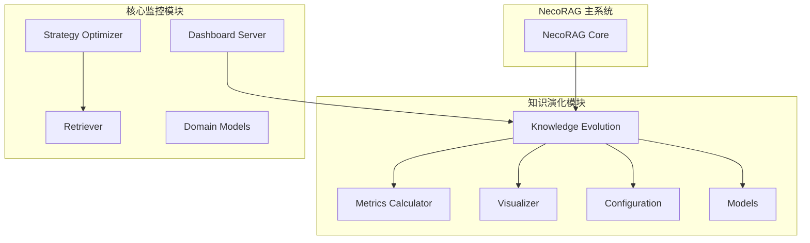
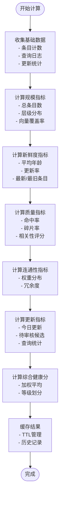
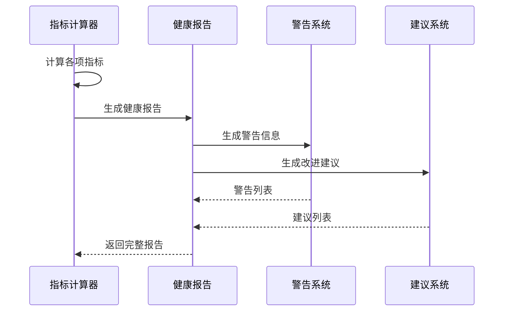
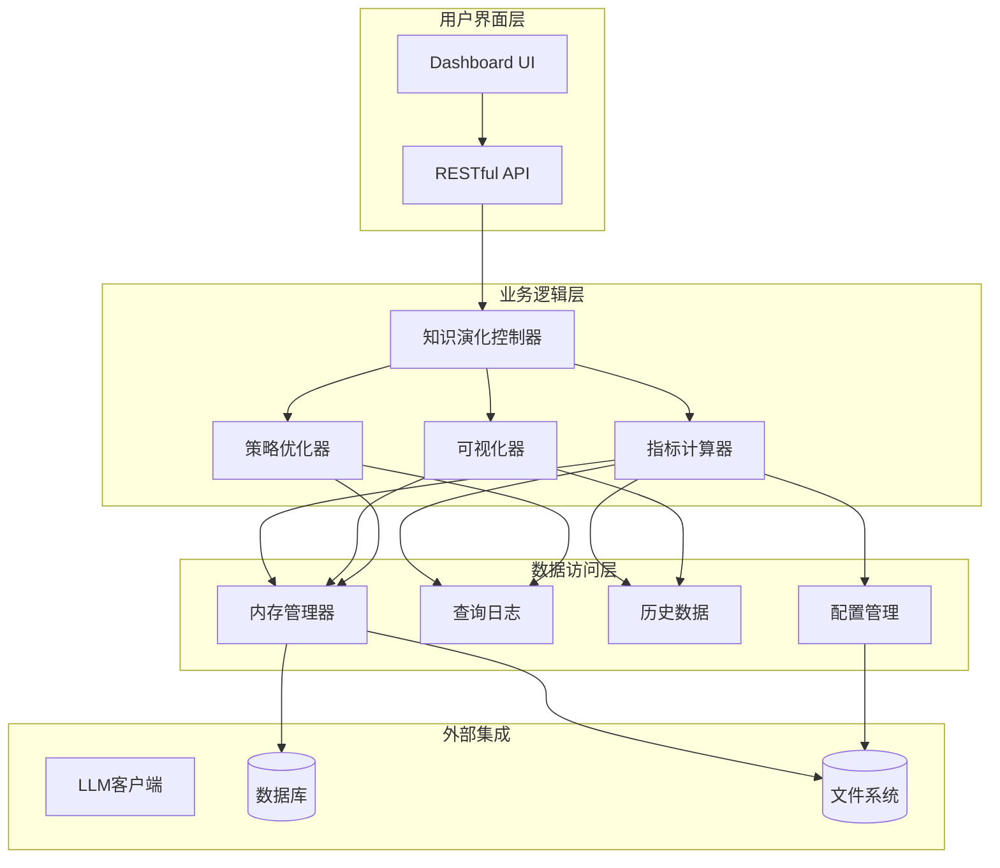
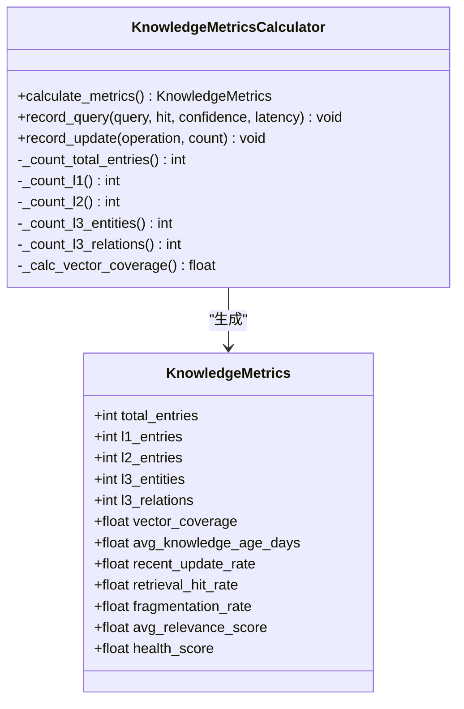
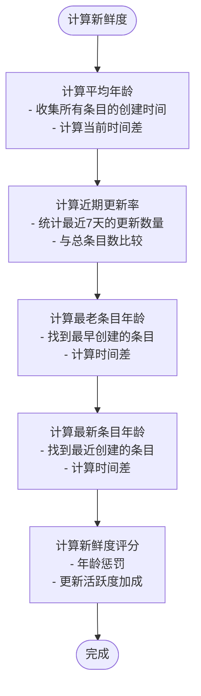
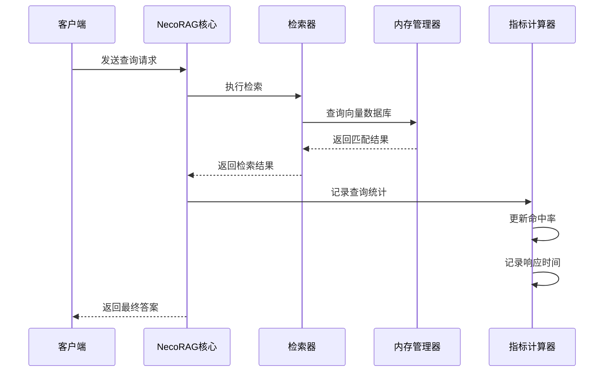
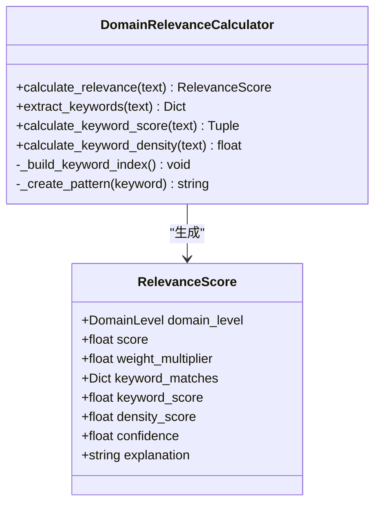
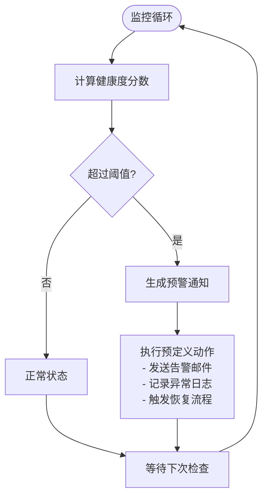
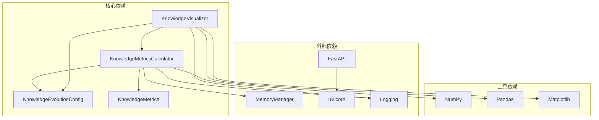

# 健康监控指标

<cite>
**本文档引用的文件**
- [metrics.py](file://src/knowledge_evolution/metrics.py)
- [models.py](file://src/knowledge_evolution/models.py)
- [config.py](file://src/knowledge_evolution/config.py)
- [visualizer.py](file://src/knowledge_evolution/visualizer.py)
- [necorag.py](file://src/necorag.py)
- [server.py](file://src/dashboard/server.py)
- [strategy_optimizer.py](file://src/adaptive/strategy_optimizer.py)
- [retriever.py](file://src/retrieval/retriever.py)
- [relevance.py](file://src/domain/relevance.py)
</cite>

## 目录
1. [简介](#简介)
2. [项目结构](#项目结构)
3. [核心组件](#核心组件)
4. [架构概览](#架构概览)
5. [详细组件分析](#详细组件分析)
6. [依赖分析](#依赖分析)
7. [性能考虑](#性能考虑)
8. [故障排除指南](#故障排除指南)
9. [结论](#结论)
10. [附录](#附录)

## 简介

NecoRAG 健康监控指标系统是一个全面的知识库健康状态评估框架，旨在提供多维度的量化指标来监控和评估知识库的运行状态。该系统不仅关注传统的覆盖率、一致性、时效性等核心指标，还创新性地引入了性能监控指标和质量评估指标，为知识库的持续优化提供了科学依据。

系统的核心设计理念是通过实时计算和历史数据分析相结合的方式，为用户提供全面的知识库健康状况洞察。通过可视化的仪表盘和详细的报告生成，帮助管理员及时发现潜在问题并采取相应的维护措施。

## 项目结构

健康监控指标系统主要分布在以下模块中：

**图表来源**
- [metrics.py:20-133](file://src/knowledge_evolution/metrics.py#L20-L133)
- [visualizer.py:18-66](file://src/knowledge_evolution/visualizer.py#L18-L66)
- [server.py:48-95](file://src/dashboard/server.py#L48-L95)

**章节来源**
- [metrics.py:1-724](file://src/knowledge_evolution/metrics.py#L1-L724)
- [visualizer.py:1-599](file://src/knowledge_evolution/visualizer.py#L1-L599)
- [config.py:1-222](file://src/knowledge_evolution/config.py#L1-L222)

## 核心组件

### 知识库量化指标计算器

知识库量化指标计算器是整个监控系统的核心组件，负责持续计算和维护各种健康指标。该组件实现了完整的指标计算流水线，包括数据收集、处理、分析和缓存机制。

#### 主要功能特性

1. **多维度指标计算**：涵盖规模、新鲜度、质量、连通性等多个维度
2. **实时数据处理**：支持查询日志和更新操作的实时记录
3. **历史数据管理**：维护指标的历史趋势和对比分析
4. **缓存机制**：通过合理的缓存策略提高性能

#### 指标计算流程

**图表来源**
- [metrics.py:65-133](file://src/knowledge_evolution/metrics.py#L65-L133)
- [metrics.py:412-445](file://src/knowledge_evolution/metrics.py#L412-L445)

**章节来源**
- [metrics.py:20-133](file://src/knowledge_evolution/metrics.py#L20-L133)

### 健康报告生成器

健康报告生成器负责将计算得到的量化指标转换为可读性强的健康报告，提供直观的状态评估和改进建议。

#### 报告生成流程

**图表来源**
- [metrics.py:507-571](file://src/knowledge_evolution/metrics.py#L507-L571)

**章节来源**
- [metrics.py:507-571](file://src/knowledge_evolution/metrics.py#L507-L571)

### 可视化接口

可视化接口为仪表盘提供所需的数据格式，支持多种图表类型的数据显示。

#### 支持的可视化类型

1. **健康度仪表盘**：实时显示综合健康分数和状态
2. **增长趋势图**：展示知识库规模随时间的变化
3. **层级分布图**：显示L1/L2/L3层级的分布情况
4. **雷达图**：多维度健康状态的综合展示
5. **更新时间线**：知识库变更的历史记录

**章节来源**
- [visualizer.py:49-66](file://src/knowledge_evolution/visualizer.py#L49-L66)

## 架构概览

健康监控指标系统采用分层架构设计，确保各组件职责清晰、耦合度低、扩展性强。

**图表来源**
- [necorag.py:135-172](file://src/necorag.py#L135-L172)
- [server.py:48-95](file://src/dashboard/server.py#L48-L95)

**章节来源**
- [necorag.py:135-172](file://src/necorag.py#L135-L172)
- [server.py:48-95](file://src/dashboard/server.py#L48-L95)

## 详细组件分析

### 指标计算算法详解

#### 规模指标计算

规模指标反映了知识库的整体体量和结构分布情况。系统通过统计不同层级的条目数量来评估知识库的发展状况。

**图表来源**
- [metrics.py:20-133](file://src/knowledge_evolution/metrics.py#L20-L133)
- [models.py:195-272](file://src/knowledge_evolution/models.py#L195-L272)

#### 新鲜度指标算法

新鲜度指标衡量知识库内容的新近程度，通过计算平均年龄和近期更新率来反映知识的时效性。

**图表来源**
- [metrics.py:228-298](file://src/knowledge_evolution/metrics.py#L228-L298)
- [metrics.py:469-481](file://src/knowledge_evolution/metrics.py#L469-L481)

#### 质量指标评估

质量指标通过检索命中率、相关性评分和碎片率等维度来评估知识库的检索效果和内容质量。

**章节来源**
- [metrics.py:300-333](file://src/knowledge_evolution/metrics.py#L300-L333)
- [metrics.py:483-493](file://src/knowledge_evolution/metrics.py#L483-L493)

### 性能监控指标设计

#### 查询性能指标

系统实现了多层次的查询性能监控，包括响应时间、命中率、置信度等关键指标。

**图表来源**
- [metrics.py:573-601](file://src/knowledge_evolution/metrics.py#L573-L601)
- [metrics.py:670-701](file://src/knowledge_evolution/metrics.py#L670-L701)

#### 自适应学习性能优化

系统集成了自适应学习机制，通过在线学习优化检索策略参数，提高整体性能表现。

**章节来源**
- [strategy_optimizer.py:93-154](file://src/adaptive/strategy_optimizer.py#L93-L154)
- [retriever.py:77-119](file://src/retrieval/retriever.py#L77-L119)

### 质量评估指标体系

#### 相关性评分分布

系统通过领域相关性计算模块，为知识库内容提供客观的相关性评估，并支持评分分布的统计分析。

**图表来源**
- [relevance.py:29-241](file://src/domain/relevance.py#L29-L241)

#### 更新成功率评估

系统通过候选条目管理和变更日志机制，跟踪知识库更新的成功率和质量。

**章节来源**
- [relevance.py:198-241](file://src/domain/relevance.py#L198-L241)

### 异常检测机制

#### 健康度预警系统

系统内置了完善的异常检测和预警机制，通过阈值设定和规则配置实现智能化的异常识别。

**图表来源**
- [metrics.py:516-570](file://src/knowledge_evolution/metrics.py#L516-L570)

#### 配置化预警规则

系统支持灵活的预警规则配置，管理员可以根据实际需求调整阈值和触发条件。

**章节来源**
- [config.py:43-45](file://src/knowledge_evolution/config.py#L43-L45)
- [metrics.py:528-554](file://src/knowledge_evolution/metrics.py#L528-L554)

## 依赖分析

健康监控指标系统具有清晰的依赖关系，各组件之间通过明确定义的接口进行交互。

**图表来源**
- [metrics.py:13-14](file://src/knowledge_evolution/metrics.py#L13-L14)
- [visualizer.py:11-12](file://src/knowledge_evolution/visualizer.py#L11-L12)

**章节来源**
- [metrics.py:1-14](file://src/knowledge_evolution/metrics.py#L1-L14)
- [visualizer.py:1-12](file://src/knowledge_evolution/visualizer.py#L1-L12)

## 性能考虑

### 缓存策略

系统采用了多层次的缓存机制来优化性能：

1. **指标结果缓存**：避免重复计算，提高响应速度
2. **查询日志缓存**：限制内存使用，防止无限增长
3. **可视化数据缓存**：减少数据库查询压力

### 性能优化技术

1. **异步处理**：关键计算任务采用异步执行
2. **批量操作**：支持批量更新和查询处理
3. **资源池管理**：合理管理数据库连接和内存资源

## 故障排除指南

### 常见问题诊断

#### 指标计算异常

当遇到指标计算异常时，可以通过以下步骤进行诊断：

1. **检查内存管理器状态**：确认知识库连接正常
2. **验证配置参数**：确保权重和阈值设置合理
3. **查看日志信息**：分析错误堆栈和异常原因

#### 可视化数据缺失

如果发现可视化数据不完整，可以检查：

1. **API接口状态**：确认RESTful API正常运行
2. **数据源连接**：验证数据库和文件系统连接
3. **缓存状态**：检查缓存是否正常工作

**章节来源**
- [metrics.py:140-148](file://src/knowledge_evolution/metrics.py#L140-L148)
- [visualizer.py:110-112](file://src/knowledge_evolution/visualizer.py#L110-L112)

## 结论

NecoRAG健康监控指标系统通过科学的指标设计、完善的监控机制和智能化的预警系统，为知识库的健康运行提供了全面的技术保障。系统不仅能够实时反映知识库的当前状态，还能通过历史数据分析预测发展趋势，为知识库的持续优化提供了重要的决策支持。

通过模块化的架构设计和灵活的配置机制，系统能够适应不同的应用场景和业务需求，为用户提供个性化的监控解决方案。随着系统的不断完善和优化，相信它将在知识库管理领域发挥越来越重要的作用。

## 附录

### 配置参数说明

系统提供了丰富的配置参数，管理员可以根据实际需求进行调整：

- **健康度阈值**：预警和严重级别的划分标准
- **权重配置**：各指标维度的权重分配
- **缓存设置**：缓存有效期和容量限制
- **日志配置**：查询日志和变更日志的管理策略

### API接口参考

系统提供了完整的RESTful API接口，支持外部系统集成：

- **指标查询接口**：获取当前和历史指标数据
- **健康报告接口**：生成详细的健康状况报告
- **可视化数据接口**：提供图表所需的JSON数据格式
- **配置管理接口**：动态调整监控参数和阈值