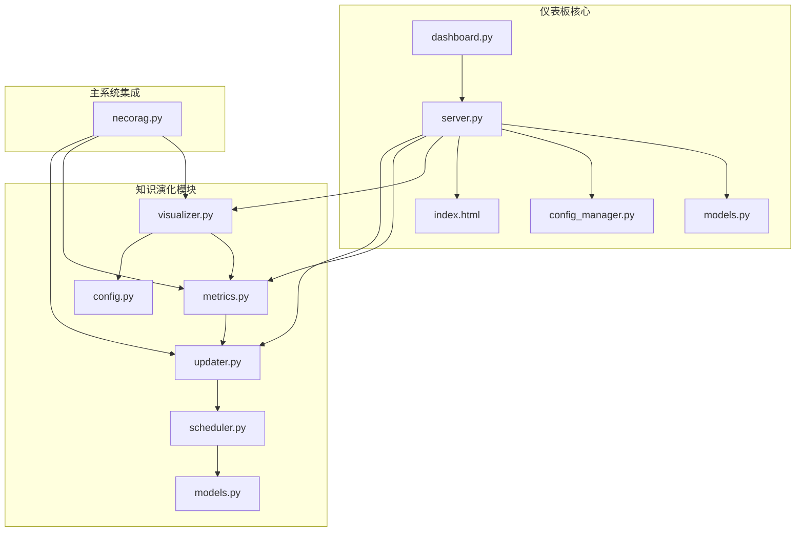
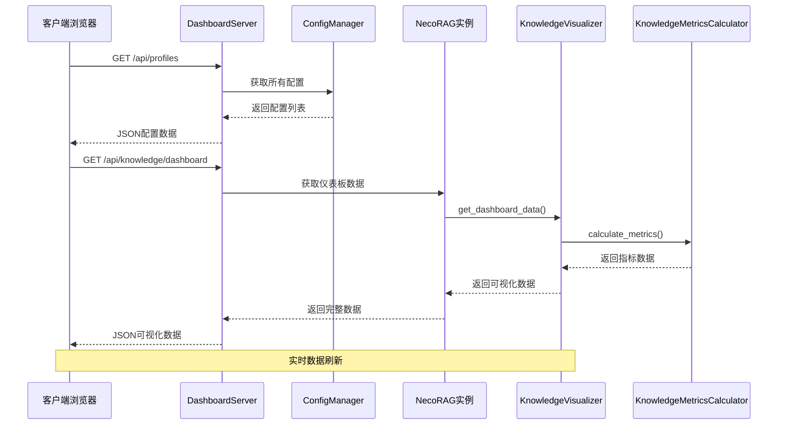
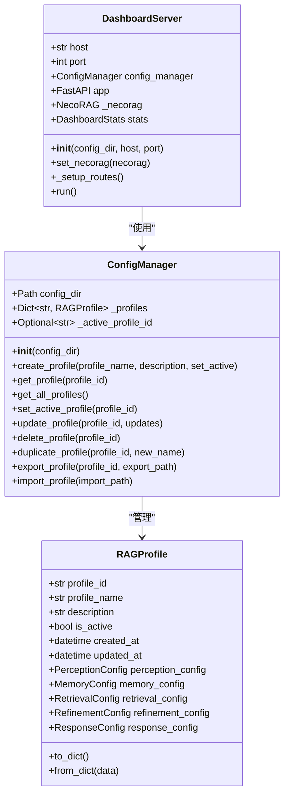
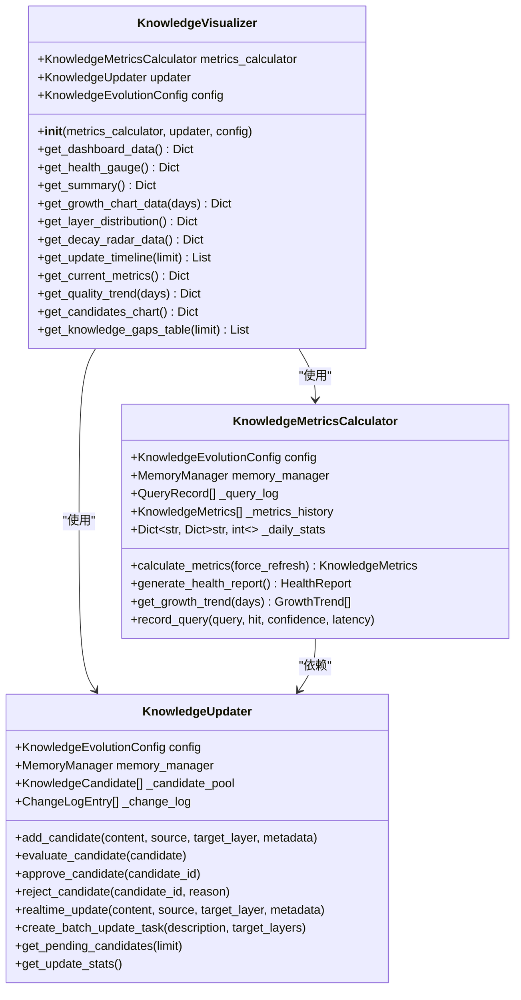
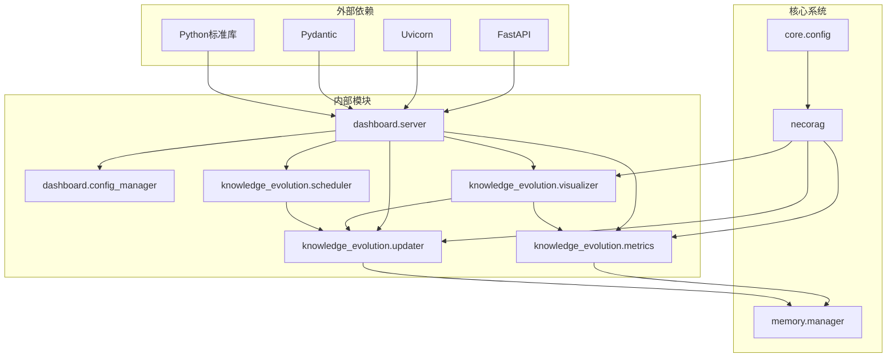
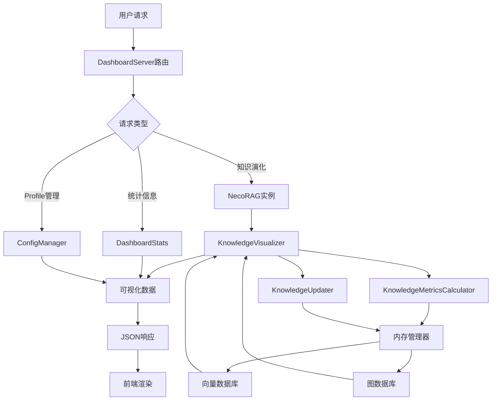

# 可视化仪表板

<cite>
**本文档引用的文件**
- [src/dashboard/dashboard.py](file://src/dashboard/dashboard.py)
- [src/dashboard/server.py](file://src/dashboard/server.py)
- [src/dashboard/models.py](file://src/dashboard/models.py)
- [src/dashboard/config_manager.py](file://src/dashboard/config_manager.py)
- [src/dashboard/static/index.html](file://src/dashboard/static/index.html)
- [src/knowledge_evolution/visualizer.py](file://src/knowledge_evolution/visualizer.py)
- [src/knowledge_evolution/metrics.py](file://src/knowledge_evolution/metrics.py)
- [src/knowledge_evolution/updater.py](file://src/knowledge_evolution/updater.py)
- [src/knowledge_evolution/scheduler.py](file://src/knowledge_evolution/scheduler.py)
- [src/knowledge_evolution/models.py](file://src/knowledge_evolution/models.py)
- [src/knowledge_evolution/config.py](file://src/knowledge_evolution/config.py)
- [src/necorag.py](file://src/necorag.py)
- [DASHBOARD_GUIDE.md](file://DASHBOARD_GUIDE.md)
</cite>

## 目录
1. [简介](#简介)
2. [项目结构](#项目结构)
3. [核心组件](#核心组件)
4. [架构概览](#架构概览)
5. [详细组件分析](#详细组件分析)
6. [依赖关系分析](#依赖关系分析)
7. [性能考虑](#性能考虑)
8. [故障排除指南](#故障排除指南)
9. [结论](#结论)

## 简介

NecoRAG 可视化仪表板是一个功能强大的 Web 管理界面，专门用于监控和管理知识演化状态。该系统提供了实时监控图表、历史趋势分析和统计报表等功能，帮助用户全面了解知识库的健康状况和发展趋势。

仪表板的核心功能包括：
- **实时监控**：显示知识库的实时状态和关键指标
- **历史趋势分析**：提供多维度的历史数据可视化
- **统计报表**：生成详细的统计信息和报告
- **交互式图表**：支持筛选、时间范围选择和数据钻取
- **配置管理**：提供灵活的配置定制和权限管理

## 项目结构

**图表来源**
- [src/dashboard/dashboard.py:1-31](file://src/dashboard/dashboard.py#L1-L31)
- [src/dashboard/server.py:1-484](file://src/dashboard/server.py#L1-L484)
- [src/necorag.py:1-902](file://src/necorag.py#L1-L902)

**章节来源**
- [src/dashboard/dashboard.py:1-31](file://src/dashboard/dashboard.py#L1-L31)
- [src/dashboard/server.py:1-484](file://src/dashboard/server.py#L1-L484)
- [src/necorag.py:1-902](file://src/necorag.py#L1-L902)

## 核心组件

### 仪表板服务器组件

仪表板采用 FastAPI 框架构建，提供 RESTful API 和 Web UI：

- **DashboardServer**：主服务器类，负责路由管理和 API 接口
- **ConfigManager**：配置管理器，处理 Profile 的创建、更新和持久化
- **DashboardStats**：统计信息模型，跟踪系统运行状态

### 知识演化可视化组件

系统集成了完整的知识演化监控体系：

- **KnowledgeVisualizer**：可视化数据接口，提供各种图表所需的数据格式
- **KnowledgeMetricsCalculator**：指标计算器，计算知识库的各项健康指标
- **KnowledgeUpdater**：更新管理器，处理知识的实时和批量更新
- **UpdateScheduler**：调度器，管理定时任务的执行

**章节来源**
- [src/dashboard/server.py:48-484](file://src/dashboard/server.py#L48-L484)
- [src/dashboard/config_manager.py:14-315](file://src/dashboard/config_manager.py#L14-L315)
- [src/knowledge_evolution/visualizer.py:18-599](file://src/knowledge_evolution/visualizer.py#L18-L599)
- [src/knowledge_evolution/metrics.py:20-724](file://src/knowledge_evolution/metrics.py#L20-L724)

## 架构概览

**图表来源**
- [src/dashboard/server.py:249-296](file://src/dashboard/server.py#L249-L296)
- [src/necorag.py:619-629](file://src/necorag.py#L619-L629)
- [src/knowledge_evolution/visualizer.py:49-66](file://src/knowledge_evolution/visualizer.py#L49-L66)

## 详细组件分析

### DashboardServer 组件分析

DashboardServer 是仪表板的核心服务器组件，提供了完整的 API 接口和 Web UI 支持。

#### 核心功能模块

**图表来源**
- [src/dashboard/server.py:48-101](file://src/dashboard/server.py#L48-L101)
- [src/dashboard/config_manager.py:14-41](file://src/dashboard/config_manager.py#L14-L41)
- [src/dashboard/models.py:164-232](file://src/dashboard/models.py#L164-L232)

#### API 路由设计

仪表板提供了丰富的 API 接口：

1. **Profile 管理 API**：创建、更新、删除和激活配置
2. **模块参数 API**：获取和更新各模块的配置参数
3. **统计信息 API**：获取系统运行统计和知识库指标
4. **知识演化 API**：获取知识库健康状态和增长趋势

**章节来源**
- [src/dashboard/server.py:106-344](file://src/dashboard/server.py#L106-L344)
- [src/dashboard/config_manager.py:42-166](file://src/dashboard/config_manager.py#L42-L166)

### KnowledgeVisualizer 组件分析

KnowledgeVisualizer 是知识库可视化的核心组件，为仪表板提供各种图表所需的数据格式。

#### 可视化数据接口

**图表来源**
- [src/knowledge_evolution/visualizer.py:18-48](file://src/knowledge_evolution/visualizer.py#L18-L48)
- [src/knowledge_evolution/metrics.py:20-63](file://src/knowledge_evolution/metrics.py#L20-L63)
- [src/knowledge_evolution/updater.py:23-77](file://src/knowledge_evolution/updater.py#L23-L77)

#### 图表类型和使用场景

系统支持多种图表类型来展示不同的知识演化指标：

1. **健康度仪表盘**：展示知识库的整体健康状况
2. **增长趋势曲线**：显示知识库的增长历史和趋势
3. **层级分布饼图**：展示 L1、L2、L3 各层级的知识分布
4. **衰减雷达图**：多维度展示知识库的健康状态
5. **更新时间线**：记录知识库的重要变更事件
6. **质量趋势图**：显示知识质量随时间的变化

**章节来源**
- [src/knowledge_evolution/visualizer.py:49-599](file://src/knowledge_evolution/visualizer.py#L49-L599)
- [src/knowledge_evolution/metrics.py:65-724](file://src/knowledge_evolution/metrics.py#L65-L724)

### 交互式图表配置

仪表板提供了丰富的交互式配置选项：

#### 时间范围选择
- **增长趋势**：支持 7、14、30 天的时间范围
- **质量趋势**：支持 7 天的质量变化分析
- **更新时间线**：支持限制显示的事件数量

#### 筛选条件
- **层级筛选**：按 L1、L2、L3 层级筛选显示
- **来源筛选**：按知识来源类型筛选
- **状态筛选**：按候选条目状态筛选

#### 数据钻取功能
- **层级钻取**：从总体分布钻取到具体层级
- **时间钻取**：从日趋势钻取到小时级别
- **来源钻取**：从总体来源钻取到具体来源类型

**章节来源**
- [src/dashboard/static/index.html:1-800](file://src/dashboard/static/index.html#L1-L800)

## 依赖关系分析

**图表来源**
- [src/dashboard/server.py:6-16](file://src/dashboard/server.py#L6-L16)
- [src/necorag.py:12-31](file://src/necorag.py#L12-L31)

### 数据流分析

**图表来源**
- [src/dashboard/server.py:249-296](file://src/dashboard/server.py#L249-L296)
- [src/necorag.py:619-629](file://src/necorag.py#L619-L629)

**章节来源**
- [src/dashboard/server.py:1-484](file://src/dashboard/server.py#L1-L484)
- [src/necorag.py:540-698](file://src/necorag.py#L540-L698)

## 性能考虑

### 缓存策略

系统采用了多层次的缓存机制来优化性能：

1. **指标缓存**：KnowledgeMetricsCalculator 使用 60 秒 TTL 的缓存
2. **配置缓存**：ConfigManager 维护内存中的配置缓存
3. **静态资源缓存**：Web UI 使用浏览器缓存机制

### 数据刷新频率

- **实时统计**：每 5 秒刷新一次
- **指标计算**：每 3600 秒（1小时）计算一次
- **批量更新**：默认每 86400 秒（24小时）执行一次

### 性能优化建议

1. **合理设置分块大小**：512-1024 字符
2. **调整检索数量**：根据需求设置 top_k
3. **优化扑击阈值**：0.85-0.90 之间
4. **配置记忆衰减**：根据数据量调整 decay_rate

**章节来源**
- [src/knowledge_evolution/metrics.py:58-63](file://src/knowledge_evolution/metrics.py#L58-L63)
- [src/dashboard/server.py:729-731](file://src/dashboard/server.py#L729-L731)
- [DASHBOARD_GUIDE.md:281-287](file://DASHBOARD_GUIDE.md#L281-L287)

## 故障排除指南

### 常见问题及解决方案

#### 仪表板无法访问
- **检查端口占用**：确认 8000 端口未被其他程序占用
- **防火墙设置**：确保防火墙允许 8000 端口通信
- **网络配置**：检查主机地址配置是否正确

#### 配置文件加载失败
- **检查配置目录**：确认 configs/ 目录存在且可写
- **验证JSON格式**：检查配置文件的 JSON 格式是否正确
- **权限问题**：确认有足够的文件系统权限

#### 知识库数据异常
- **检查内存管理器**：确认 MemoryManager 正常工作
- **验证向量数据库**：检查向量数据库连接状态
- **图数据库状态**：确认图数据库服务正常

**章节来源**
- [DASHBOARD_GUIDE.md:288-306](file://DASHBOARD_GUIDE.md#L288-L306)

### 日志和调试

系统提供了详细的日志记录机制：

- **服务器日志**：记录 API 调用和错误信息
- **配置管理日志**：记录配置变更操作
- **知识演化日志**：记录知识更新和调度信息

**章节来源**
- [src/dashboard/server.py:478-483](file://src/dashboard/server.py#L478-L483)
- [src/knowledge_evolution/visualizer.py:15](file://src/knowledge_evolution/visualizer.py#L15)

## 结论

NecoRAG 可视化仪表板提供了一个功能完整、性能优异的知识演化监控解决方案。通过实时监控、历史趋势分析和统计报表，用户可以全面了解知识库的健康状况和发展趋势。

### 主要优势

1. **实时监控**：提供准确的实时数据和快速响应
2. **多维度分析**：支持多种图表类型和分析视角
3. **灵活配置**：支持多环境配置和动态参数调整
4. **高性能**：采用缓存策略和优化的数据处理机制
5. **易用性**：提供直观的 Web 界面和丰富的交互功能

### 未来发展方向

1. **增强可视化**：添加更多图表类型和交互功能
2. **扩展监控范围**：支持更多的系统组件监控
3. **智能告警**：实现基于规则的智能告警机制
4. **移动端支持**：提供移动端访问和通知功能
5. **高级分析**：集成机器学习算法进行预测分析

该仪表板为 NecoRAG 系统的运维和管理提供了强有力的支持，是知识管理系统不可或缺的重要组成部分。