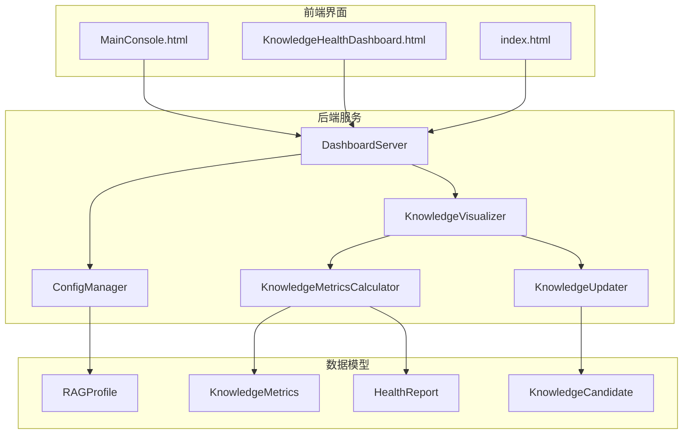
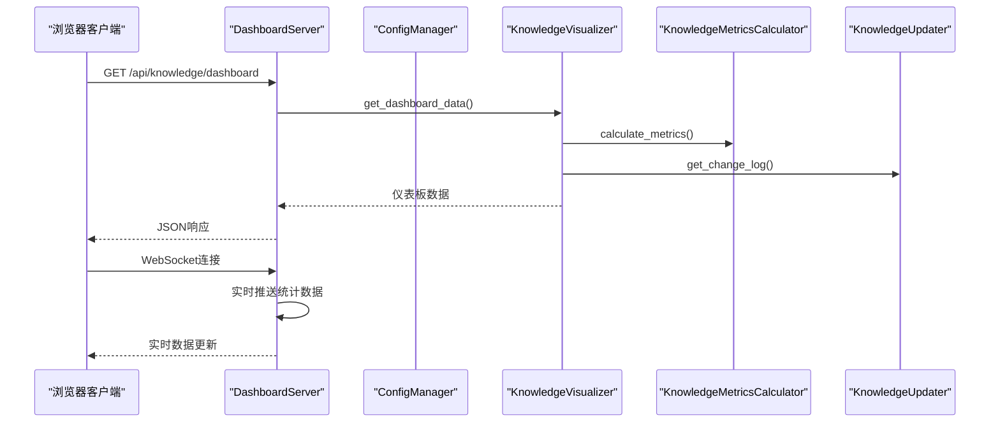
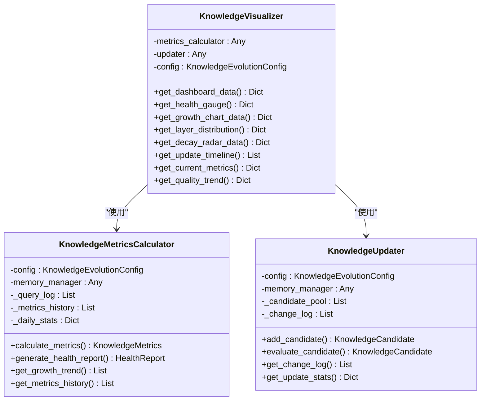
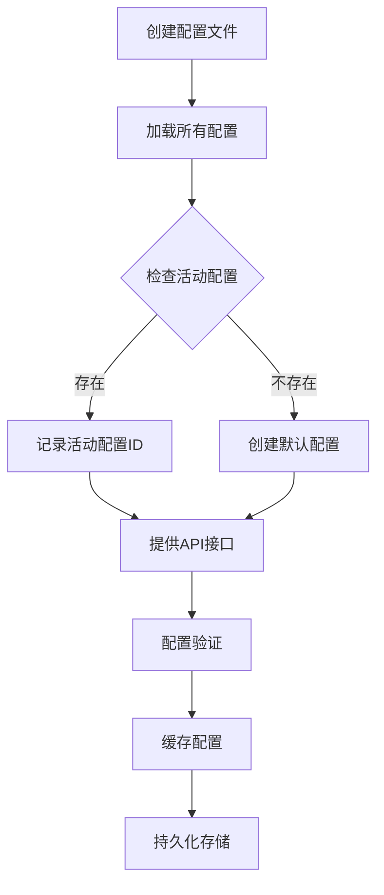
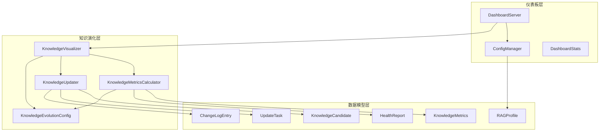

# 可视化仪表板

<cite>
**本文档引用的文件**
- [src/dashboard/dashboard.py](file://src/dashboard/dashboard.py)
- [src/dashboard/server.py](file://src/dashboard/server.py)
- [src/dashboard/models.py](file://src/dashboard/models.py)
- [src/dashboard/config_manager.py](file://src/dashboard/config_manager.py)
- [src/dashboard/static/index.html](file://src/dashboard/static/index.html)
- [src/dashboard/components/KnowledgeHealthDashboard.html](file://src/dashboard/components/KnowledgeHealthDashboard.html)
- [src/dashboard/components/MainConsole.html](file://src/dashboard/components/MainConsole.html)
- [src/knowledge_evolution/visualizer.py](file://src/knowledge_evolution/visualizer.py)
- [src/knowledge_evolution/metrics.py](file://src/knowledge_evolution/metrics.py)
- [src/knowledge_evolution/updater.py](file://src/knowledge_evolution/updater.py)
- [src/knowledge_evolution/models.py](file://src/knowledge_evolution/models.py)
- [src/knowledge_evolution/config.py](file://src/knowledge_evolution/config.py)
</cite>

## 目录
1. [项目概述](#项目概述)
2. [项目结构](#项目结构)
3. [核心组件](#核心组件)
4. [架构概览](#架构概览)
5. [详细组件分析](#详细组件分析)
6. [依赖关系分析](#依赖关系分析)
7. [性能考量](#性能考量)
8. [故障排除指南](#故障排除指南)
9. [结论](#结论)
10. [附录](#附录)

## 项目概述
本项目为知识演化可视化仪表板，旨在为用户提供知识库的实时监控与分析能力。系统通过知识演化模块计算健康度指标、增长趋势与质量分布，并通过仪表板组件以图形化方式呈现。用户可通过配置管理器对不同模块参数进行动态调整，实现个性化配置与主题定制。

## 项目结构
仪表板系统采用前后端分离架构，后端基于FastAPI提供RESTful API与WebSocket服务，前端通过HTML/CSS/JavaScript实现响应式界面与交互功能。

**图表来源**
- [src/dashboard/server.py:51-108](file://src/dashboard/server.py#L51-L108)
- [src/dashboard/config_manager.py:14-41](file://src/dashboard/config_manager.py#L14-L41)
- [src/knowledge_evolution/visualizer.py:18-47](file://src/knowledge_evolution/visualizer.py#L18-L47)

**章节来源**
- [src/dashboard/dashboard.py:1-31](file://src/dashboard/dashboard.py#L1-L31)
- [src/dashboard/server.py:51-108](file://src/dashboard/server.py#L51-L108)

## 核心组件
仪表板系统由以下核心组件构成：

### 1. 仪表板服务器
- 基于FastAPI的Web服务器，提供RESTful API与静态文件服务
- 支持CORS跨域访问，便于前端调用
- 集成调试WebSocket端点，实现实时监控

### 2. 配置管理器
- 管理RAG配置文件的创建、加载、保存与导入导出
- 支持配置文件的版本控制与活动配置切换
- 提供配置验证与缓存机制

### 3. 知识演化可视化器
- 为仪表板提供可视化所需的数据格式
- 包含健康度仪表盘、增长曲线、热力图等数据接口
- 支持历史数据对比与多维度分析

### 4. 知识指标计算器
- 持续计算知识库的健康度指标
- 提供综合评分与维度报告
- 支持缓存机制提升性能

### 5. 知识更新管理器
- 管理知识库的实时更新和定时批量更新
- 维护知识候选池和变更日志
- 支持查询驱动的知识积累

**章节来源**
- [src/dashboard/server.py:51-108](file://src/dashboard/server.py#L51-L108)
- [src/dashboard/config_manager.py:14-41](file://src/dashboard/config_manager.py#L14-L41)
- [src/knowledge_evolution/visualizer.py:18-47](file://src/knowledge_evolution/visualizer.py#L18-L47)
- [src/knowledge_evolution/metrics.py:21-64](file://src/knowledge_evolution/metrics.py#L21-L64)
- [src/knowledge_evolution/updater.py:24-78](file://src/knowledge_evolution/updater.py#L24-L78)

## 架构概览
仪表板采用分层架构设计，确保各组件职责清晰、耦合度低。

**图表来源**
- [src/dashboard/server.py:256-277](file://src/dashboard/server.py#L256-L277)
- [src/knowledge_evolution/visualizer.py:49-66](file://src/knowledge_evolution/visualizer.py#L49-L66)
- [src/knowledge_evolution/metrics.py:66-134](file://src/knowledge_evolution/metrics.py#L66-L134)
- [src/knowledge_evolution/updater.py:598-624](file://src/knowledge_evolution/updater.py#L598-L624)

## 详细组件分析

### 知识演化可视化器
知识演化可视化器是仪表板的核心数据接口，负责将复杂的指标数据转换为可视化友好的格式。

#### 数据接口设计

**图表来源**
- [src/knowledge_evolution/visualizer.py:18-47](file://src/knowledge_evolution/visualizer.py#L18-L47)
- [src/knowledge_evolution/metrics.py:21-64](file://src/knowledge_evolution/metrics.py#L21-L64)
- [src/knowledge_evolution/updater.py:24-78](file://src/knowledge_evolution/updater.py#L24-L78)

#### 可视化图表实现
仪表板提供多种可视化图表，每种图表都有特定的数据格式要求：

**健康度仪表盘**
- 显示综合健康分数与等级
- 包含四个维度评分：规模、新鲜度、质量、连通性
- 支持颜色分级与描述文本

**知识增长趋势图**
- 展示知识库总量、新增、删除、净增长趋势
- 支持7/30/90天周期切换
- 使用SVG绘制折线图与面积填充

**质量趋势图**
- 基于每日健康评分计算质量趋势
- 支持7天滚动平均计算
- 展示知识质量变化情况

**章节来源**
- [src/knowledge_evolution/visualizer.py:49-66](file://src/knowledge_evolution/visualizer.py#L49-L66)
- [src/knowledge_evolution/visualizer.py:179-220](file://src/knowledge_evolution/visualizer.py#L179-L220)
- [src/knowledge_evolution/visualizer.py:407-453](file://src/knowledge_evolution/visualizer.py#L407-L453)

### 配置管理系统
配置管理系统提供完整的配置生命周期管理：

**图表来源**
- [src/dashboard/config_manager.py:290-315](file://src/dashboard/config_manager.py#L290-L315)

#### 配置数据模型
系统使用RAGProfile作为配置的统一载体，包含五个模块的配置信息：

**感知引擎配置**
- 文档分块参数：chunk_size、chunk_overlap
- OCR识别开关
- 向量化模型选择

**记忆层配置**
- L1工作记忆：TTL、最大会话条目
- 记忆衰减：衰减速率、归档阈值
- L2语义记忆：向量维度、集合名称

**检索层配置**
- 检索参数：top_k、最小分数
- HyDE增强技术开关
- 早停机制：置信度阈值

**精炼层配置**
- 质量验证：最低置信度、最大迭代次数
- 幻觉检测：阈值设置

**响应层配置**
- 交互配置：默认语气、详细程度
- 可视化配置：显示检索路径、证据来源

**章节来源**
- [src/dashboard/models.py:22-232](file://src/dashboard/models.py#L22-L232)
- [src/dashboard/models.py:165-232](file://src/dashboard/models.py#L165-L232)

### 前端界面组件
仪表板提供多个前端界面组件，满足不同的监控需求：

#### 主控制台界面
主控制台采用现代化的卡片式布局，支持响应式设计：

**布局特点**
- 采用CSS Grid布局，支持多列自适应
- 左侧配置列表，右侧模块参数编辑
- 支持移动端、平板、桌面端适配

**交互功能**
- Profile管理：创建、激活、删除、复制
- 实时统计：每5秒自动刷新
- 模块参数编辑：支持文本、数字、下拉框输入

**章节来源**
- [src/dashboard/static/index.html:443-691](file://src/dashboard/static/index.html#L443-L691)

#### 知识库健康仪表盘
专门的知识库健康监控界面，提供专业的可视化分析：

**核心组件**
- 关键指标卡：总知识量、今日新增、平均新鲜度
- 健康度仪表盘：综合健康分数与等级
- 增长趋势图：支持多周期切换
- 领域覆盖热力图：知识领域分布
- 知识质量雷达图：多维度质量评估
- 更新时间线：知识库变更历史

**视觉设计**
- 使用渐变色彩方案
- 支持工具提示与动画效果
- 响应式布局适配不同屏幕尺寸

**章节来源**
- [src/dashboard/components/KnowledgeHealthDashboard.html:500-591](file://src/dashboard/components/KnowledgeHealthDashboard.html#L500-L591)

#### 调试控制台界面
提供完整的调试与监控功能：

**导航系统**
- 侧边栏导航：仪表板、调试面板、性能监控等
- 视图切换：支持多页面切换
- 响应式设计：移动端菜单折叠

**实时监控**
- WebSocket连接状态显示
- 实时统计数据更新
- 告警信息展示

**章节来源**
- [src/dashboard/components/MainConsole.html:310-540](file://src/dashboard/components/MainConsole.html#L310-L540)

## 依赖关系分析

**图表来源**
- [src/dashboard/server.py:16-19](file://src/dashboard/server.py#L16-L19)
- [src/dashboard/config_manager.py:11-11](file://src/dashboard/config_manager.py#L11-L11)
- [src/knowledge_evolution/visualizer.py:11-12](file://src/knowledge_evolution/visualizer.py#L11-L12)
- [src/knowledge_evolution/metrics.py:13-15](file://src/knowledge_evolution/metrics.py#L13-L15)
- [src/knowledge_evolution/updater.py:13-18](file://src/knowledge_evolution/updater.py#L13-L18)

### 外部依赖
- **FastAPI**: Web框架，提供异步API服务
- **Uvicorn**: ASGI服务器，处理HTTP/WebSocket请求
- **Pydantic**: 数据验证与序列化
- **Pathlib**: 文件系统操作
- **Datetime**: 时间处理

### 内部依赖关系
- DashboardServer依赖ConfigManager进行配置管理
- KnowledgeVisualizer依赖MetricsCalculator和Updater获取数据
- 所有组件共享数据模型定义
- 配置管理器负责持久化存储

**章节来源**
- [src/dashboard/server.py:6-19](file://src/dashboard/server.py#L6-L19)
- [src/dashboard/config_manager.py:6-11](file://src/dashboard/config_manager.py#L6-L11)
- [src/knowledge_evolution/visualizer.py:7-12](file://src/knowledge_evolution/visualizer.py#L7-L12)

## 性能考量
仪表板系统在设计时充分考虑了性能优化：

### 缓存策略
- 指标计算结果缓存：默认60秒TTL
- 配置文件缓存：内存中缓存已加载的配置
- 增长趋势数据预计算：减少实时计算开销

### 数据优化
- 分页加载：变更日志限制最大条目数
- 按需加载：前端按需请求不同图表数据
- 数据压缩：JSON响应的紧凑格式

### 并发处理
- 异步API处理：基于FastAPI的异步特性
- WebSocket实时推送：减少轮询开销
- 多线程支持：适合高并发场景

### 内存管理
- 查询日志限制：防止内存无限增长
- 候选池容量控制：避免内存溢出
- 定期清理机制：自动清理过期数据

## 故障排除指南

### 常见问题诊断
**配置文件加载失败**
- 检查配置目录权限
- 验证JSON格式正确性
- 查看文件编码格式

**API响应异常**
- 检查服务器运行状态
- 验证CORS配置
- 查看错误日志

**WebSocket连接失败**
- 检查网络连接
- 验证端口开放情况
- 查看防火墙设置

### 性能问题排查
**响应缓慢**
- 检查指标计算复杂度
- 优化数据库查询
- 调整缓存策略

**内存泄漏**
- 检查定时器清理
- 验证事件监听器注销
- 监控对象引用关系

### 数据一致性问题
**指标不准确**
- 检查数据源连接
- 验证计算逻辑
- 查看数据同步状态

**图表显示异常**
- 检查数据格式
- 验证SVG渲染
- 查看浏览器兼容性

**章节来源**
- [src/dashboard/config_manager.py:290-315](file://src/dashboard/config_manager.py#L290-L315)
- [src/knowledge_evolution/metrics.py:66-134](file://src/knowledge_evolution/metrics.py#L66-L134)

## 结论
知识演化可视化仪表板提供了完整的知识库监控与分析解决方案。通过模块化的架构设计、丰富的可视化图表和灵活的配置管理，用户可以有效地监控知识库的健康状况、追踪知识增长趋势并进行深度分析。系统的响应式设计确保了在不同设备上的良好用户体验，而完善的性能优化策略保证了在高负载场景下的稳定运行。

## 附录

### API参考
仪表板提供完整的RESTful API接口，支持配置管理、知识演化监控和实时数据获取。

### 配置选项
系统支持丰富的配置选项，涵盖感知、记忆、检索、精炼、响应五个核心模块，用户可根据实际需求进行个性化配置。

### 用户界面指南
提供详细的用户界面使用指南，包括导航说明、功能操作步骤和最佳实践建议。