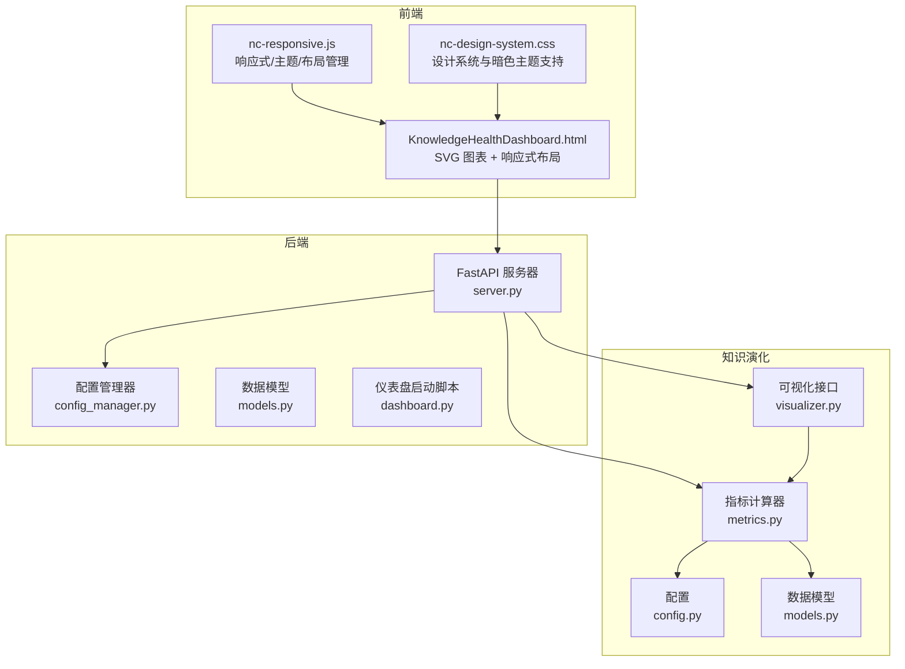
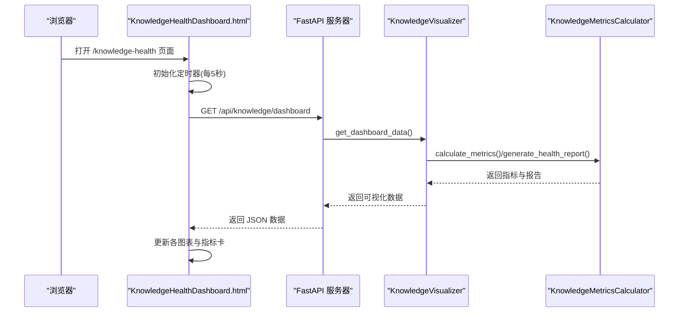
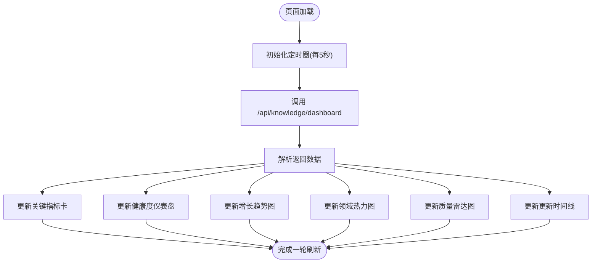
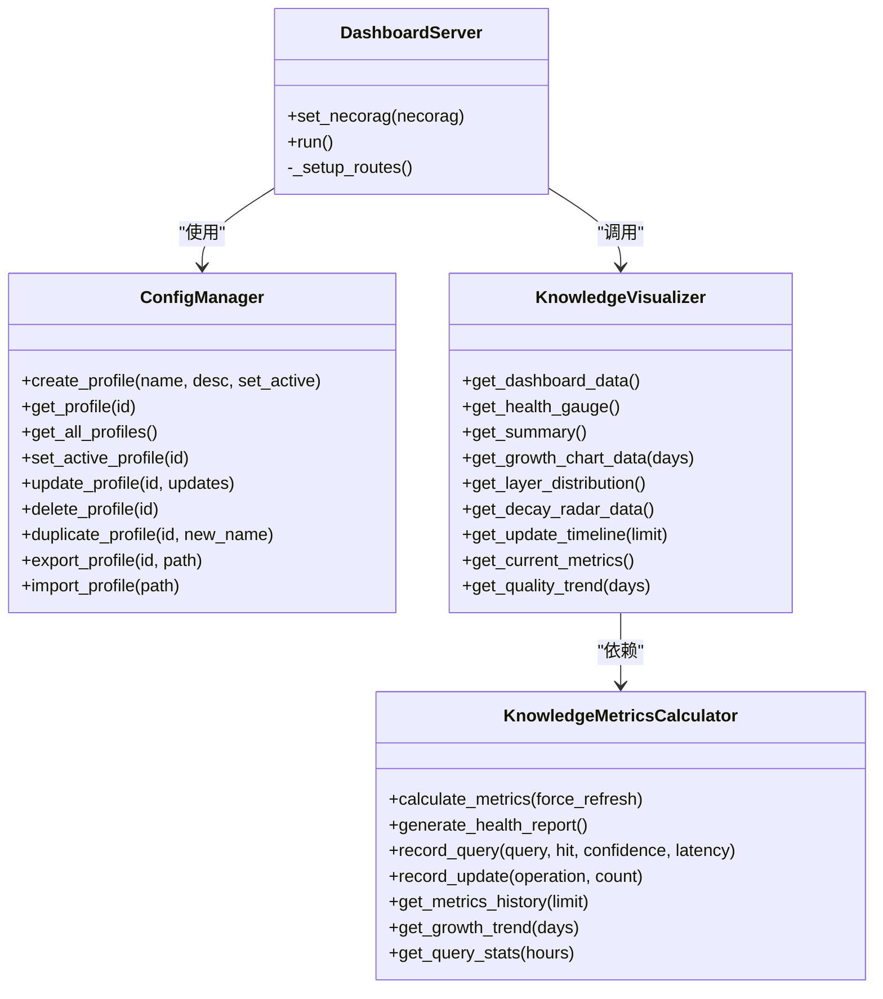
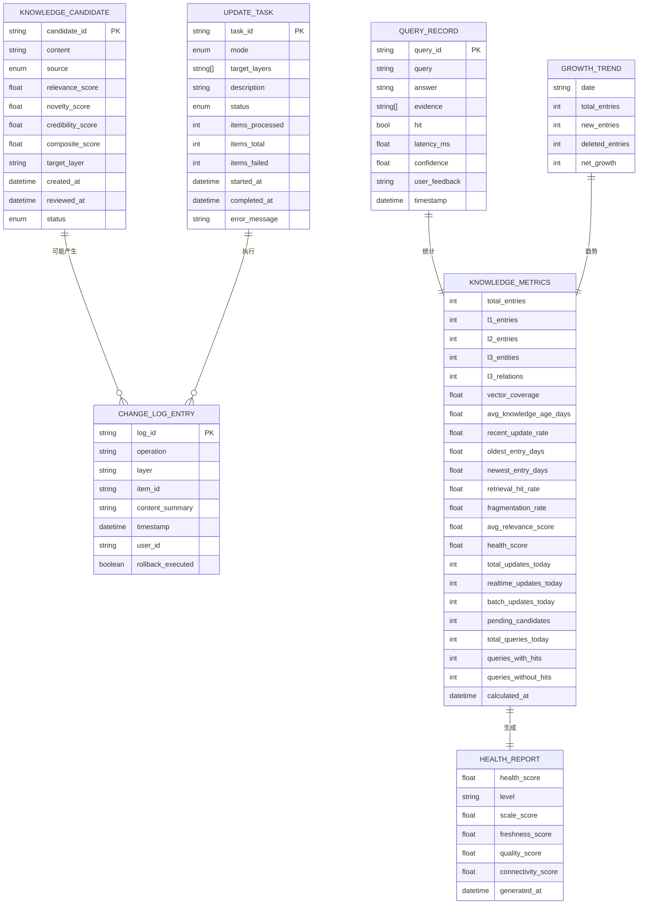
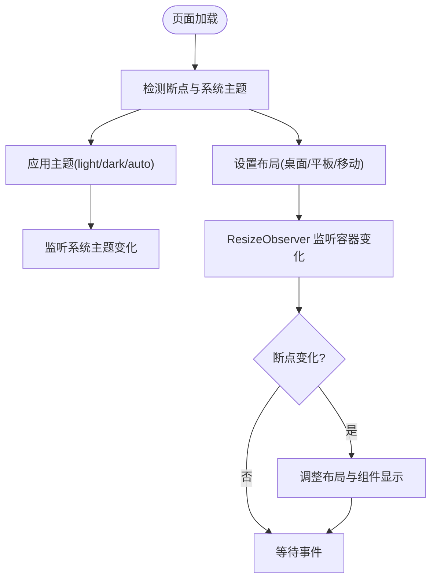
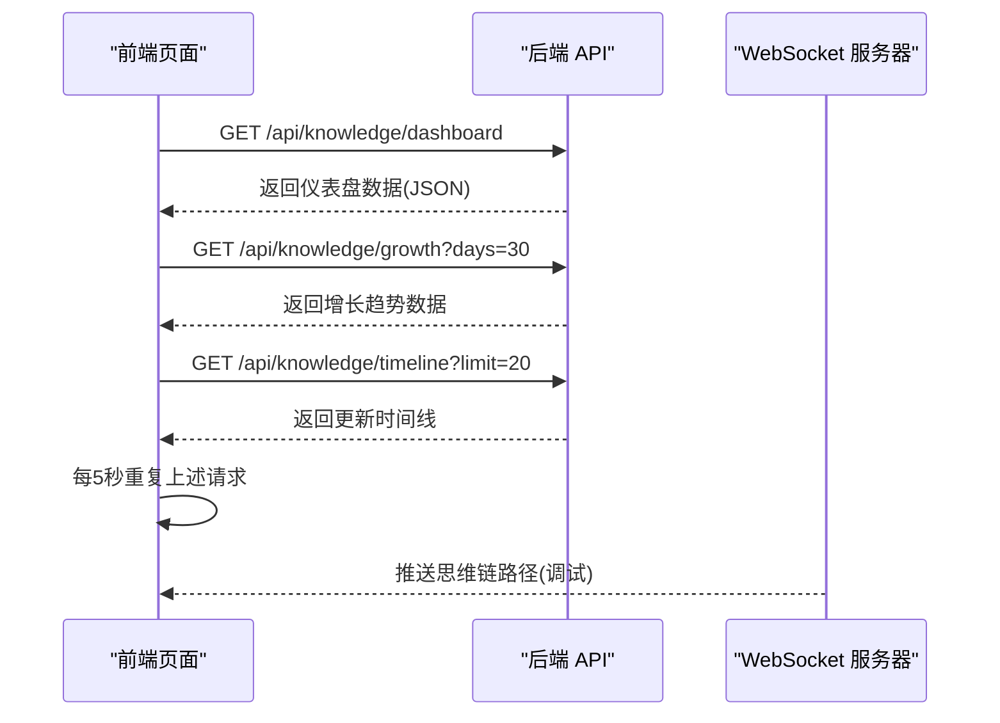
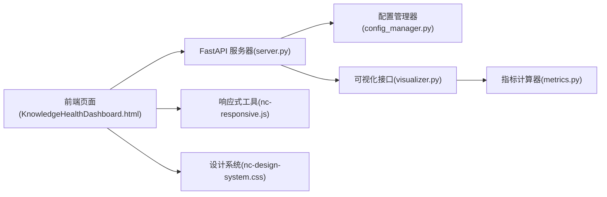

# 可视化仪表板

<cite>
**本文档引用的文件**
- [KnowledgeHealthDashboard.html](file://src/dashboard/components/KnowledgeHealthDashboard.html)
- [dashboard.py](file://src/dashboard/dashboard.py)
- [models.py](file://src/dashboard/models.py)
- [config_manager.py](file://src/dashboard/config_manager.py)
- [server.py](file://src/dashboard/server.py)
- [visualizer.py](file://src/knowledge_evolution/visualizer.py)
- [metrics.py](file://src/knowledge_evolution/metrics.py)
- [models.py](file://src/knowledge_evolution/models.py)
- [config.py](file://src/knowledge_evolution/config.py)
- [test_knowledge_health_dashboard.py](file://src/dashboard/test_knowledge_health_dashboard.py)
- [nc-responsive.js](file://src/dashboard/static/js/nc-responsive.js)
- [nc-design-system.css](file://src/dashboard/static/css/nc-design-system.css)
- [KNOWLEDGE_HEALTH_DASHBOARD_GUIDE.md](file://src/dashboard/KNOWLEDGE_HEALTH_DASHBOARD_GUIDE.md)
</cite>

## 目录
1. [简介](#简介)
2. [项目结构](#项目结构)
3. [核心组件](#核心组件)
4. [架构总览](#架构总览)
5. [详细组件分析](#详细组件分析)
6. [依赖关系分析](#依赖关系分析)
7. [性能考虑](#性能考虑)
8. [故障排查指南](#故障排查指南)
9. [结论](#结论)
10. [附录](#附录)

## 简介
本文件面向知识演化可视化仪表板的实现与使用，围绕知识健康状态的可视化展示、实时监控与历史趋势分析，系统阐述仪表板组件设计、数据展示与交互控制、响应式布局、可视化指标选择与呈现方式、实时数据更新机制、配置管理与个性化定制、集成与部署最佳实践，以及 v3.3.0-alpha 版本的可视化改进与新增特性。

## 项目结构
仪表板系统由前端 HTML/CSS/JS、后端 FastAPI 服务、知识演化模块的数据计算与可视化接口三部分组成，并辅以响应式设计与主题管理工具库。

**图表来源**
- [KnowledgeHealthDashboard.html:1-892](file://src/dashboard/components/KnowledgeHealthDashboard.html#L1-L892)
- [server.py:1-568](file://src/dashboard/server.py#L1-L568)
- [visualizer.py:1-599](file://src/knowledge_evolution/visualizer.py#L1-L599)
- [metrics.py:1-725](file://src/knowledge_evolution/metrics.py#L1-L725)
- [config_manager.py:1-315](file://src/dashboard/config_manager.py#L1-L315)
- [models.py:1-232](file://src/dashboard/models.py#L1-L232)

**章节来源**
- [KnowledgeHealthDashboard.html:1-892](file://src/dashboard/components/KnowledgeHealthDashboard.html#L1-L892)
- [server.py:1-568](file://src/dashboard/server.py#L1-L568)
- [visualizer.py:1-599](file://src/knowledge_evolution/visualizer.py#L1-L599)
- [metrics.py:1-725](file://src/knowledge_evolution/metrics.py#L1-L725)
- [config_manager.py:1-315](file://src/dashboard/config_manager.py#L1-L315)
- [models.py:1-232](file://src/dashboard/models.py#L1-L232)

## 核心组件
- 知识健康仪表盘前端页面：提供关键指标卡、健康度仪表盘、增长趋势图、领域热力图、知识质量雷达图、更新时间线等可视化组件，采用原生 HTML/CSS/JavaScript 实现，内联 SVG 图表，支持响应式布局与主题切换。
- 后端 FastAPI 服务器：提供 RESTful API，包括配置管理、统计信息、知识演化指标与可视化数据接口；内置静态资源服务与调试 WebSocket 端点。
- 知识演化模块：负责知识库量化指标计算、健康报告生成、增长趋势与时间线数据生成，为仪表盘提供数据支撑。
- 响应式与主题系统：提供断点检测、主题切换、布局管理与组件生命周期管理，提升跨设备体验与可定制性。

**章节来源**
- [KnowledgeHealthDashboard.html:1-892](file://src/dashboard/components/KnowledgeHealthDashboard.html#L1-L892)
- [server.py:1-568](file://src/dashboard/server.py#L1-L568)
- [visualizer.py:1-599](file://src/knowledge_evolution/visualizer.py#L1-L599)
- [metrics.py:1-725](file://src/knowledge_evolution/metrics.py#L1-L725)
- [nc-responsive.js:1-822](file://src/dashboard/static/js/nc-responsive.js#L1-L822)
- [nc-design-system.css:1-680](file://src/dashboard/static/css/nc-design-system.css#L1-L680)

## 架构总览
仪表板采用前后端分离架构：前端通过 Fetch API 调用后端 RESTful 接口，后端将知识演化模块的指标与可视化数据封装为统一 JSON 结构返回。服务器同时提供静态文件与调试 WebSocket，便于实时监控与调试。

**图表来源**
- [KnowledgeHealthDashboard.html:593-624](file://src/dashboard/components/KnowledgeHealthDashboard.html#L593-L624)
- [server.py:272-278](file://src/dashboard/server.py#L272-L278)
- [visualizer.py:49-66](file://src/knowledge_evolution/visualizer.py#L49-L66)
- [metrics.py:66-134](file://src/knowledge_evolution/metrics.py#L66-L134)

## 详细组件分析

### 知识健康仪表盘前端组件
- 关键指标卡：展示总知识量、今日新增、平均新鲜度，带趋势指示与状态色边框。
- 健康度仪表盘：半圆形 SVG 仪表，分数随时间动画过渡，颜色随等级变化（健康/一般/预警/严重）。
- 增长趋势图：面积折线图，支持 7/30/90 天周期切换，鼠标悬停显示具体数值。
- 领域覆盖热力图：垂直列表条形图，显示各领域覆盖率百分比。
- 知识质量雷达图：五维雷达图，展示新鲜度、覆盖度、连通性、准确性、多样性评分。
- 更新时间线：事件时间线，区分实时更新、定时任务、事件触发，支持“查看更多”。

**图表来源**
- [KnowledgeHealthDashboard.html:593-624](file://src/dashboard/components/KnowledgeHealthDashboard.html#L593-L624)
- [KnowledgeHealthDashboard.html:626-800](file://src/dashboard/components/KnowledgeHealthDashboard.html#L626-L800)

**章节来源**
- [KnowledgeHealthDashboard.html:1-892](file://src/dashboard/components/KnowledgeHealthDashboard.html#L1-L892)

### 后端服务器与 API
- 配置管理 API：Profile 的创建、查询、激活、复制、导入导出、模块参数更新。
- 统计信息 API：提供文档总量、块总数、查询总数、活动会话、内存使用与性能指标。
- 知识演化 API：健康报告、指标、仪表盘完整数据、增长趋势、更新时间线、候选条目、知识缺口等。
- 调试 WebSocket：提供思维链路径的实时推送与订阅。
- 静态资源与路由：提供主控制台、调试控制台、调试面板、知识健康仪表盘页面。

**图表来源**
- [server.py:51-568](file://src/dashboard/server.py#L51-L568)
- [config_manager.py:14-315](file://src/dashboard/config_manager.py#L14-L315)
- [visualizer.py:18-599](file://src/knowledge_evolution/visualizer.py#L18-L599)
- [metrics.py:21-725](file://src/knowledge_evolution/metrics.py#L21-L725)

**章节来源**
- [server.py:1-568](file://src/dashboard/server.py#L1-L568)
- [config_manager.py:1-315](file://src/dashboard/config_manager.py#L1-L315)
- [visualizer.py:1-599](file://src/knowledge_evolution/visualizer.py#L1-L599)
- [metrics.py:1-725](file://src/knowledge_evolution/metrics.py#L1-L725)

### 知识演化数据模型与指标
- 数据模型：定义更新模式、状态、知识来源、候选状态、知识候选、更新任务、变更日志、知识指标、健康报告、查询记录、增长趋势等。
- 指标计算：计算规模、新鲜度、质量、健康度、更新与查询统计等指标，支持缓存与历史记录。
- 健康报告：基于加权评分生成健康等级与建议，包含维度评分与警告信息。
- 可视化接口：提供仪表盘所需的数据格式，包括健康度、摘要、增长趋势、层级分布、衰减雷达、更新时间线、当前指标、质量趋势等。

**图表来源**
- [models.py:63-367](file://src/knowledge_evolution/models.py#L63-L367)

**章节来源**
- [models.py:1-367](file://src/knowledge_evolution/models.py#L1-L367)
- [metrics.py:66-134](file://src/knowledge_evolution/metrics.py#L66-L134)
- [visualizer.py:49-66](file://src/knowledge_evolution/visualizer.py#L49-L66)

### 响应式设计与主题管理
- 响应式断点：xs(0)、sm(640)、md(768)、lg(1024)、xl(1280)、xxl(1536)，支持断点变化事件与布局自适应。
- 主题系统：支持 light/dark/auto 三种主题，自动监听系统偏好，本地持久化用户选择。
- 布局管理：侧边栏折叠、移动端菜单开关、容器观察与事件派发。
- 组件管理：Intersection/Mutation 观察器，懒加载与组件生命周期管理。

**图表来源**
- [nc-responsive.js:1-822](file://src/dashboard/static/js/nc-responsive.js#L1-L822)
- [nc-design-system.css:1-680](file://src/dashboard/static/css/nc-design-system.css#L1-L680)

**章节来源**
- [nc-responsive.js:1-822](file://src/dashboard/static/js/nc-responsive.js#L1-L822)
- [nc-design-system.css:1-680](file://src/dashboard/static/css/nc-design-system.css#L1-L680)

### 实时数据更新机制
- 前端定时刷新：页面加载后每 5 秒自动拉取仪表盘数据，保持界面实时更新。
- 后端 API：提供 /api/knowledge/dashboard、/api/knowledge/growth、/api/knowledge/timeline 等接口，返回结构化数据。
- WebSocket（调试）：提供 /api/debug/ws/thinking-path/{session_id}，用于实时推送思维链路径，便于调试与监控。

**图表来源**
- [KnowledgeHealthDashboard.html:593-624](file://src/dashboard/components/KnowledgeHealthDashboard.html#L593-L624)
- [server.py:272-295](file://src/dashboard/server.py#L272-L295)
- [server.py:340-370](file://src/dashboard/server.py#L340-L370)

**章节来源**
- [KnowledgeHealthDashboard.html:593-624](file://src/dashboard/components/KnowledgeHealthDashboard.html#L593-L624)
- [server.py:272-295](file://src/dashboard/server.py#L272-L295)
- [server.py:340-370](file://src/dashboard/server.py#L340-L370)

### 可视化指标与呈现方式
- 关键指标卡：总知识量、今日新增、平均新鲜度，带趋势箭头与状态色。
- 健康度仪表盘：半圆弧形仪表，分数动画过渡，颜色随等级变化。
- 增长趋势图：面积折线图，支持 7/30/90 天周期切换，鼠标悬停显示数值。
- 领域覆盖热力图：条形图显示覆盖率百分比，按覆盖率排序。
- 知识质量雷达图：五维评分雷达图，蓝色半透明填充。
- 更新时间线：事件时间线，区分实时/定时/事件触发，显示影响统计。

**章节来源**
- [KnowledgeHealthDashboard.html:1-892](file://src/dashboard/components/KnowledgeHealthDashboard.html#L1-L892)
- [visualizer.py:49-66](file://src/knowledge_evolution/visualizer.py#L49-L66)

### 仪表板配置管理与个性化定制
- 配置管理器：支持 Profile 的创建、查询、激活、复制、导入导出、模块参数更新。
- 主题设置：CSS 变量与主题类切换，支持本地持久化。
- 显示选项：断点检测与布局自适应，移动端菜单与侧边栏折叠。
- 个性化定制：颜色主题、刷新频率、图表样式参数均可通过前端代码与 CSS 变量进行调整。

**章节来源**
- [config_manager.py:1-315](file://src/dashboard/config_manager.py#L1-L315)
- [nc-responsive.js:1-822](file://src/dashboard/static/js/nc-responsive.js#L1-L822)
- [nc-design-system.css:1-680](file://src/dashboard/static/css/nc-design-system.css#L1-L680)

### 集成与部署最佳实践
- 启动仪表板：通过命令行参数指定主机、端口与配置目录，启动 FastAPI 服务器。
- 集成到现有系统：在 server.py 中注册 /knowledge-health 路由，挂载静态文件，确保 HTML 文件存在。
- API 使用：调用 /api/knowledge/dashboard 获取完整数据，/api/knowledge/growth 获取增长趋势，/api/knowledge/timeline 获取更新时间线。
- 部署建议：使用容器化部署，暴露 8000 端口，挂载配置目录，结合反向代理与 HTTPS。

**章节来源**
- [dashboard.py:1-31](file://src/dashboard/dashboard.py#L1-L31)
- [server.py:1-568](file://src/dashboard/server.py#L1-L568)
- [KNOWLEDGE_HEALTH_DASHBOARD_GUIDE.md:173-207](file://src/dashboard/KNOWLEDGE_HEALTH_DASHBOARD_GUIDE.md#L173-L207)

## 依赖关系分析
- 前端依赖：原生 HTML/CSS/JavaScript，内联 SVG 图表，零外部依赖，便于部署与维护。
- 后端依赖：FastAPI、uvicorn、CORS 中间件、静态文件服务、WebSocket 管理器。
- 知识演化模块：独立的数据模型与指标计算，通过可视化接口对外提供数据。
- 响应式与主题：独立的 JS/CSS 工具库，可复用到其他页面组件。

**图表来源**
- [KnowledgeHealthDashboard.html:1-892](file://src/dashboard/components/KnowledgeHealthDashboard.html#L1-L892)
- [server.py:1-568](file://src/dashboard/server.py#L1-L568)
- [visualizer.py:1-599](file://src/knowledge_evolution/visualizer.py#L1-L599)
- [metrics.py:1-725](file://src/knowledge_evolution/metrics.py#L1-L725)
- [nc-responsive.js:1-822](file://src/dashboard/static/js/nc-responsive.js#L1-L822)
- [nc-design-system.css:1-680](file://src/dashboard/static/css/nc-design-system.css#L1-L680)

**章节来源**
- [KnowledgeHealthDashboard.html:1-892](file://src/dashboard/components/KnowledgeHealthDashboard.html#L1-L892)
- [server.py:1-568](file://src/dashboard/server.py#L1-L568)
- [visualizer.py:1-599](file://src/knowledge_evolution/visualizer.py#L1-L599)
- [metrics.py:1-725](file://src/knowledge_evolution/metrics.py#L1-L725)
- [nc-responsive.js:1-822](file://src/dashboard/static/js/nc-responsive.js#L1-L822)
- [nc-design-system.css:1-680](file://src/dashboard/static/css/nc-design-system.css#L1-L680)

## 性能考虑
- 前端性能：SVG 图表内联，避免额外库依赖；定时器每 5 秒刷新一次，减少网络压力；断点变化使用防抖，避免频繁重绘。
- 后端性能：指标计算支持缓存与历史记录，降低重复计算成本；增长趋势与时间线按需查询，限制返回数量。
- 响应式优化：使用 CSS Grid/Flexbox 与媒体查询，减少复杂布局计算；组件懒加载与 IntersectionObserver 优化首屏渲染。
- 数据传输：API 返回结构化 JSON，字段命名简洁，便于前端解析与渲染。

[本节为通用指导，不涉及具体文件分析]

## 故障排查指南
- 数据显示“计算中...”：确认后端已设置 NecoRAG 实例引用，否则 API 将返回错误提示。
- 图表不显示：检查后端服务运行状态与 API 端点可用性，使用 curl 或浏览器开发者工具查看响应。
- 样式错乱：清理浏览器缓存，检查 HTML 中 CSS 路径，使用开发者工具检查元素样式。
- 功能测试：使用测试脚本验证 HTML 结构、API 端点与响应式设计是否符合预期。

**章节来源**
- [KNOWLEDGE_HEALTH_DASHBOARD_GUIDE.md:303-332](file://src/dashboard/KNOWLEDGE_HEALTH_DASHBOARD_GUIDE.md#L303-L332)
- [test_knowledge_health_dashboard.py:1-259](file://src/dashboard/test_knowledge_health_dashboard.py#L1-L259)

## 结论
知识演化可视化仪表板通过清晰的组件划分、完善的 API 接口与灵活的可视化呈现，实现了知识健康状态的实时监控与历史趋势分析。结合响应式设计与主题管理，能够在多种设备与环境下提供一致且优质的用户体验。v3.3.0-alpha 版本在可视化细节与交互体验上进行了多项改进，为后续扩展与集成奠定了坚实基础。

[本节为总结性内容，不涉及具体文件分析]

## 附录

### v3.3.0-alpha 版本可视化改进与新增特性
- 健康度仪表盘：半圆弧形仪表，支持动画过渡与等级颜色提示。
- 增长趋势图：支持 7/30/90 天周期切换，面积折线图与鼠标悬停交互。
- 领域覆盖热力图：条形图展示覆盖率，支持排序与悬停提示。
- 知识质量雷达图：五维评分雷达图，蓝色半透明填充。
- 更新时间线：事件类型区分与影响统计，支持“查看更多”。
- 响应式布局：桌面/平板/移动端自适应，断点变化事件驱动布局调整。
- 主题系统：light/dark/auto 三种主题，自动监听系统偏好并本地持久化。

**章节来源**
- [KNOWLEDGE_HEALTH_DASHBOARD_GUIDE.md:1-423](file://src/dashboard/KNOWLEDGE_HEALTH_DASHBOARD_GUIDE.md#L1-L423)
- [KnowledgeHealthDashboard.html:1-892](file://src/dashboard/components/KnowledgeHealthDashboard.html#L1-L892)
- [nc-responsive.js:1-822](file://src/dashboard/static/js/nc-responsive.js#L1-L822)
- [nc-design-system.css:1-680](file://src/dashboard/static/css/nc-design-system.css#L1-L680)