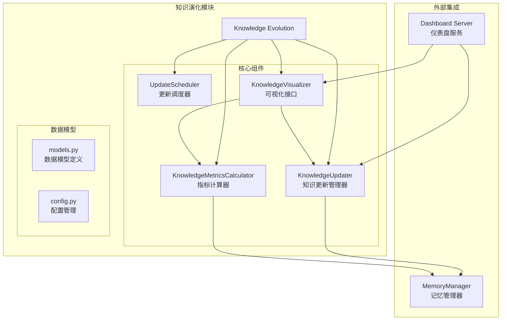
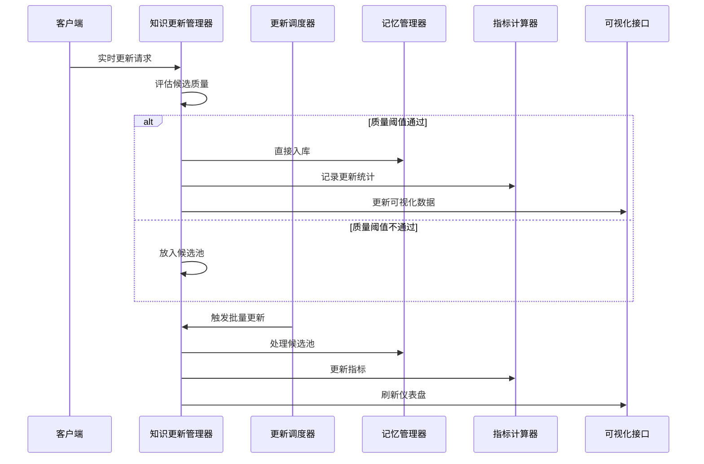
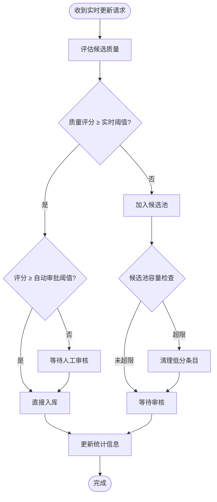
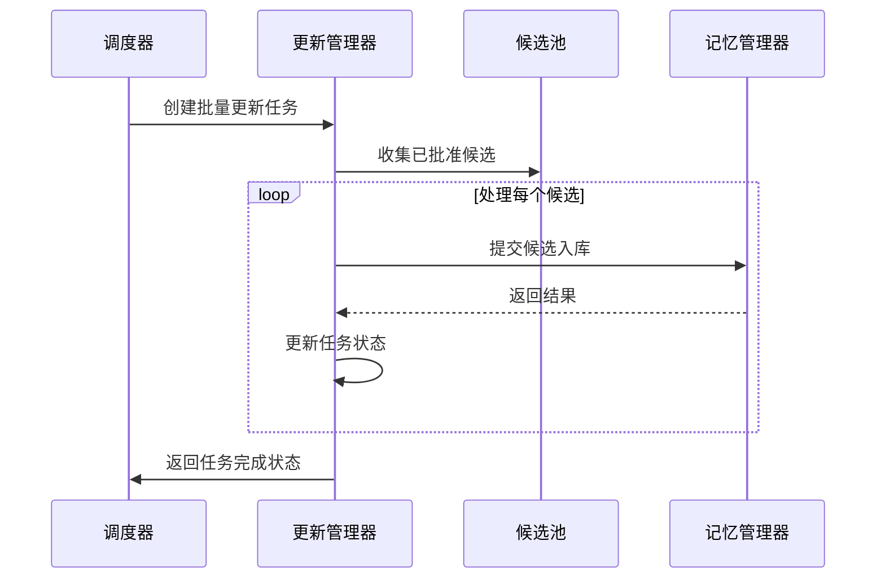
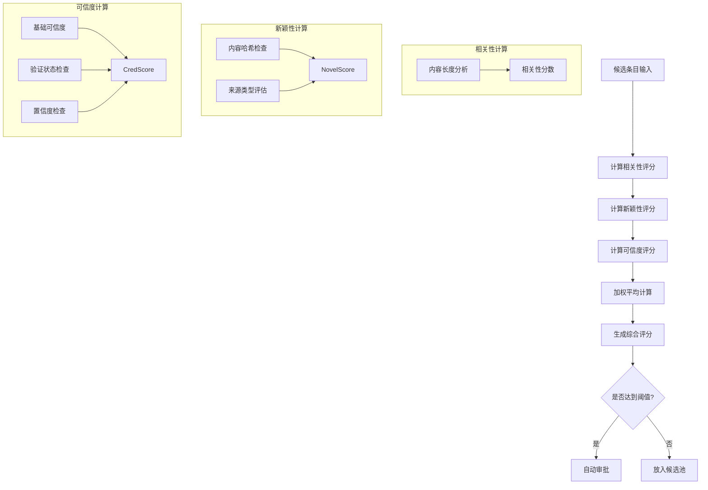
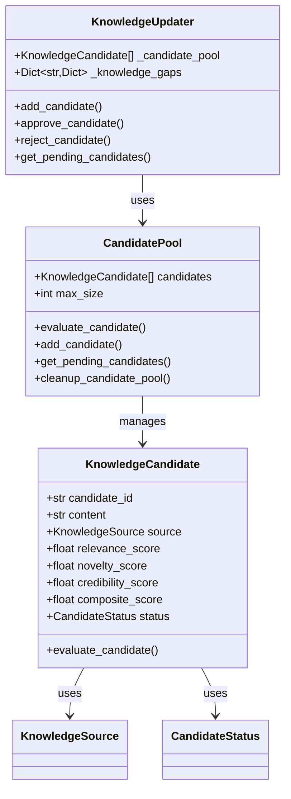
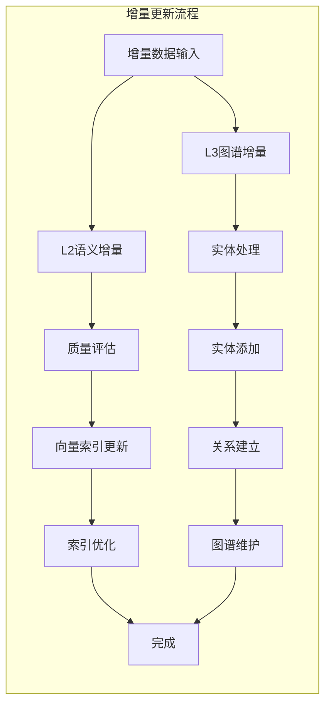
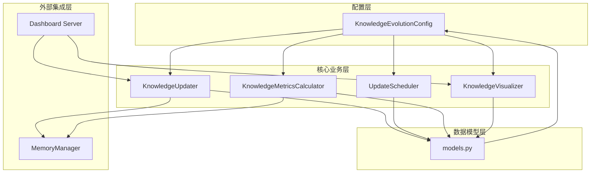

# 知识更新管理器

<cite>
**本文档引用的文件**
- [updater.py](file://src/knowledge_evolution/updater.py)
- [scheduler.py](file://src/knowledge_evolution/scheduler.py)
- [models.py](file://src/knowledge_evolution/models.py)
- [metrics.py](file://src/knowledge_evolution/metrics.py)
- [config.py](file://src/knowledge_evolution/config.py)
- [visualizer.py](file://src/knowledge_evolution/visualizer.py)
- [__init__.py](file://src/knowledge_evolution/__init__.py)
- [server.py](file://src/dashboard/server.py)
- [manager.py](file://src/memory/manager.py)
</cite>

## 目录
1. [简介](#简介)
2. [项目结构](#项目结构)
3. [核心组件](#核心组件)
4. [架构概览](#架构概览)
5. [详细组件分析](#详细组件分析)
6. [依赖关系分析](#依赖关系分析)
7. [性能考量](#性能考量)
8. [故障排除指南](#故障排除指南)
9. [结论](#结论)
10. [附录](#附录)

## 简介
知识更新管理器是 NecoRAG 框架中负责知识库持续更新与演化的核心模块。该模块实现了两类更新模式：实时更新和定时批量更新，并提供了完整的知识候选评估、管理与回滚机制。通过查询驱动的知识积累、增量更新支持以及全面的健康度监控，为整个认知型 RAG 系统提供强大的知识管理能力。

## 项目结构
知识更新管理器位于 `src/knowledge_evolution/` 目录下，包含以下核心文件：

**图表来源**
- [updater.py:1-854](file://src/knowledge_evolution/updater.py#L1-L854)
- [scheduler.py:1-688](file://src/knowledge_evolution/scheduler.py#L1-L688)
- [models.py:1-367](file://src/knowledge_evolution/models.py#L1-L367)
- [metrics.py:1-724](file://src/knowledge_evolution/metrics.py#L1-L724)
- [visualizer.py:1-599](file://src/knowledge_evolution/visualizer.py#L1-L599)

**章节来源**
- [__init__.py:1-133](file://src/knowledge_evolution/__init__.py#L1-L133)

## 核心组件
知识更新管理器由四个核心组件构成，每个组件都有明确的职责分工：

### 1. 知识更新管理器 (KnowledgeUpdater)
负责实时和批量知识更新的核心控制器，管理候选池、变更日志和更新统计。

### 2. 更新调度器 (UpdateScheduler)
管理定时任务的调度执行，支持间隔调度和每日固定时间调度。

### 3. 指标计算器 (KnowledgeMetricsCalculator)
持续计算知识库健康度指标，提供综合评分和维度报告。

### 4. 可视化接口 (KnowledgeVisualizer)
为 Dashboard 提供数据格式，支持健康度仪表盘、增长曲线等可视化展示。

**章节来源**
- [updater.py:23-78](file://src/knowledge_evolution/updater.py#L23-L78)
- [scheduler.py:124-167](file://src/knowledge_evolution/scheduler.py#L124-L167)
- [metrics.py:20-63](file://src/knowledge_evolution/metrics.py#L20-L63)
- [visualizer.py:18-47](file://src/knowledge_evolution/visualizer.py#L18-L47)

## 架构概览

**图表来源**
- [updater.py:360-403](file://src/knowledge_evolution/updater.py#L360-L403)
- [scheduler.py:281-299](file://src/knowledge_evolution/scheduler.py#L281-L299)
- [metrics.py:65-133](file://src/knowledge_evolution/metrics.py#L65-L133)
- [visualizer.py:49-66](file://src/knowledge_evolution/visualizer.py#L49-L66)

## 详细组件分析

### 实时更新模式
实时更新模式适用于需要即时响应的场景，具有以下特点：

#### 工作原理
1. **质量评估**：对新知识进行相关性、新颖性、可信度评分
2. **阈值检查**：只有达到实时质量阈值的知识才能直接入库
3. **自动审批**：高于自动审批阈值的知识无需人工审核
4. **快速响应**：满足条件的知识立即写入记忆系统

#### 触发条件
- 配置启用实时更新 (`enable_realtime_update = True`)
- 知识质量评分达到实时质量阈值
- 记忆管理器可用且配置正确

**图表来源**
- [updater.py:360-403](file://src/knowledge_evolution/updater.py#L360-L403)
- [updater.py:132-160](file://src/knowledge_evolution/updater.py#L132-L160)
- [updater.py:340-356](file://src/knowledge_evolution/updater.py#L340-L356)

**章节来源**
- [updater.py:358-403](file://src/knowledge_evolution/updater.py#L358-L403)

### 定时批量更新模式
定时批量更新模式适用于大规模知识入库场景，具有以下特点：

#### 工作原理
1. **任务创建**：创建批量更新任务，收集已批准的候选条目
2. **批量处理**：按顺序处理候选池中的条目
3. **索引优化**：处理过程中进行向量索引优化和图谱关系维护
4. **状态跟踪**：记录处理进度、失败数量和错误信息

#### 触发条件
- 配置启用定时更新 (`enable_scheduled_update = True`)
- 达到设定的批量更新间隔或时间点
- 候选池中有已批准的条目

**图表来源**
- [scheduler.py:281-299](file://src/knowledge_evolution/scheduler.py#L281-L299)
- [updater.py:438-491](file://src/knowledge_evolution/updater.py#L438-L491)

**章节来源**
- [scheduler.py:169-197](file://src/knowledge_evolution/scheduler.py#L169-L197)
- [updater.py:404-491](file://src/knowledge_evolution/updater.py#L404-L491)

### 候选条目质量评估机制
候选条目的质量评估是知识更新管理器的核心功能，采用多维度评分体系：

#### 评估维度

| 维度 | 计算方法 | 权重 | 说明 |
|------|----------|------|------|
| 相关性 (Relevance) | 基于内容长度和结构特征 | 40% | 衡量与现有知识库的相关程度 |
| 新颖性 (Novelty) | 基于内容独特性和来源类型 | 30% | 衡量知识的新鲜程度 |
| 可信度 (Credibility) | 基于来源可靠性和元数据验证 | 30% | 衡量知识的可靠性 |

#### 评分计算流程

**图表来源**
- [updater.py:132-160](file://src/knowledge_evolution/updater.py#L132-L160)
- [updater.py:162-230](file://src/knowledge_evolution/updater.py#L162-L230)

**章节来源**
- [updater.py:132-230](file://src/knowledge_evolution/updater.py#L132-L230)

### 知识候选池管理策略
候选池管理采用多层次策略，确保知识质量的同时维持系统的高效运行：

#### 自动审批机制
- **阈值设置**：高于自动审批阈值的候选自动通过
- **快速入库**：无需人工干预，立即写入知识库
- **统计记录**：自动审批数量计入统计信息

#### 手动审核机制
- **待审核队列**：综合评分低于自动审批阈值的候选进入队列
- **优先级排序**：按综合评分降序排列，便于审核
- **人工决策**：审核员根据业务需求决定批准或拒绝

#### 容量清理机制
- **容量监控**：实时监控候选池使用情况
- **自动清理**：超过容量上限时清理低分条目
- **策略保留**：保留前80%的高分条目，拒绝剩余20%

**图表来源**
- [updater.py:49-130](file://src/knowledge_evolution/updater.py#L49-L130)
- [models.py:63-103](file://src/knowledge_evolution/models.py#L63-L103)

**章节来源**
- [updater.py:79-130](file://src/knowledge_evolution/updater.py#L79-L130)
- [updater.py:340-356](file://src/knowledge_evolution/updater.py#L340-L356)

### 增量更新功能
增量更新功能支持 L2 语义记忆和 L3 情景图谱的增量知识入库：

#### L2 语义向量增量更新
- **批量处理**：支持批量 L2 向量更新
- **质量控制**：遵循实时更新的质量标准
- **向量索引**：自动更新向量数据库索引

#### L3 情景图谱增量更新
- **实体更新**：支持批量实体添加
- **关系更新**：支持批量关系建立
- **图谱维护**：自动维护图谱的连通性

**图表来源**
- [updater.py:495-576](file://src/knowledge_evolution/updater.py#L495-L576)

**章节来源**
- [updater.py:495-576](file://src/knowledge_evolution/updater.py#L495-L576)

### 变更日志与回滚机制
变更日志系统提供完整的知识库操作追踪和回滚能力：

#### 变更日志记录
- **操作类型**：支持 insert、update、delete、archive 操作
- **层级追踪**：记录操作发生的知识层级 (L1/L2/L3)
- **元数据保存**：保存操作相关的元数据信息

#### 回滚机制
- **时间窗口**：支持在设定时间窗口内的操作回滚
- **状态恢复**：根据操作类型执行相应的回滚逻辑
- **审计追踪**：记录每次回滚操作的详细信息

**章节来源**
- [updater.py:578-684](file://src/knowledge_evolution/updater.py#L578-L684)

### 查询驱动知识积累
系统支持基于查询的主动知识积累机制：

#### 知识缺口检测
- **查询分析**：分析未命中的查询以识别知识缺口
- **频率统计**：统计查询出现的频率和时间分布
- **自动记录**：将重要的知识缺口自动记录到系统中

#### 高质量答案积累
- **置信度检查**：只积累达到最低置信度的答案
- **证据关联**：将答案与相关证据建立关联
- **格式化存储**：统一存储格式，便于后续处理

**章节来源**
- [updater.py:685-784](file://src/knowledge_evolution/updater.py#L685-L784)

## 依赖关系分析

**图表来源**
- [config.py:15-101](file://src/knowledge_evolution/config.py#L15-L101)
- [models.py:14-103](file://src/knowledge_evolution/models.py#L14-L103)
- [updater.py:34-47](file://src/knowledge_evolution/updater.py#L34-L47)
- [scheduler.py:138-154](file://src/knowledge_evolution/scheduler.py#L138-L154)

**章节来源**
- [__init__.py:28-53](file://src/knowledge_evolution/__init__.py#L28-L53)

## 性能考量

### 配置优化建议

| 配置项 | 默认值 | 优化建议 | 适用场景 |
|--------|--------|----------|----------|
| `realtime_quality_threshold` | 0.6 | 0.7-0.8 | 严格质量要求 |
| `auto_approve_threshold` | 0.85 | 0.9-0.95 | 自动化程度高 |
| `candidate_pool_max_size` | 1000 | 500-2000 | 大规模知识库 |
| `batch_update_interval` | 86400s | 43200-172800s | 高频更新需求 |
| `metrics_calculation_interval` | 3600s | 1800-7200s | 实时监控需求 |

### 性能监控指标
- **实时更新延迟**：从请求到入库的平均时间
- **批量处理吞吐量**：每小时处理的候选数量
- **候选池利用率**：候选池的平均使用率
- **指标计算耗时**：健康度指标计算的平均时间

## 故障排除指南

### 常见问题及解决方案

#### 1. 实时更新被拒绝
**症状**：实时更新请求返回 None  
**可能原因**：
- 候选质量评分低于实时阈值
- 实时更新功能被禁用
- 记忆管理器配置错误

**解决方案**：
- 检查候选内容质量和来源
- 验证配置文件中的阈值设置
- 确认记忆管理器正常运行

#### 2. 候选池容量不足
**症状**：候选池频繁清理低分条目  
**可能原因**：
- 候选池容量设置过小
- 候选质量普遍较低
- 审核速度慢于入库速度

**解决方案**：
- 增大候选池最大容量
- 优化候选质量评估算法
- 提高人工审核效率

#### 3. 批量更新失败
**症状**：批量更新任务状态为 FAILED  
**可能原因**：
- 记忆管理器连接异常
- 候选条目格式错误
- 数据库权限不足

**解决方案**：
- 检查记忆管理器连接状态
- 验证候选条目数据格式
- 确认数据库访问权限

**章节来源**
- [updater.py:394-397](file://src/knowledge_evolution/updater.py#L394-L397)
- [updater.py:485-489](file://src/knowledge_evolution/updater.py#L485-L489)

## 结论
知识更新管理器通过实时更新和定时批量更新两种模式，结合智能的质量评估机制和完善的候选池管理策略，为 NecoRAG 框架提供了强大的知识管理能力。其设计充分考虑了实际应用场景的需求，在保证知识质量的同时，确保了系统的高效运行和可维护性。

通过查询驱动的知识积累、增量更新支持以及全面的健康度监控，该模块能够适应不同规模和复杂度的知识管理需求，为构建智能化的认知型 RAG 系统奠定了坚实的基础。

## 附录

### API 接口说明

#### 知识库管理接口
- `GET /api/knowledge/metrics` - 获取知识库指标
- `GET /api/knowledge/health` - 获取健康报告
- `GET /api/knowledge/dashboard` - 获取仪表盘数据
- `GET /api/knowledge/growth` - 获取增长趋势
- `GET /api/knowledge/timeline` - 获取更新时间线
- `GET /api/knowledge/candidates` - 获取待审核候选
- `POST /api/knowledge/candidates/{candidate_id}/approve` - 批准候选
- `POST /api/knowledge/candidates/{candidate_id}/reject` - 拒绝候选
- `GET /api/knowledge/gaps` - 获取知识缺口

#### 知识更新接口
- `POST /api/knowledge/update/realtime` - 实时更新
- `POST /api/knowledge/update/batch` - 批量更新
- `POST /api/knowledge/update/incremental/l2` - L2 增量更新
- `POST /api/knowledge/update/incremental/l3` - L3 增量更新

**章节来源**
- [server.py:251-303](file://src/dashboard/server.py#L251-L303)

### 配置参数参考

#### 核心配置参数
- `enable_realtime_update`: 是否启用实时更新
- `enable_scheduled_update`: 是否启用定时更新
- `realtime_quality_threshold`: 实时更新质量阈值
- `auto_approve_threshold`: 自动审批阈值
- `candidate_pool_max_size`: 候选池最大容量
- `batch_update_interval`: 批量更新间隔
- `metrics_calculation_interval`: 指标计算间隔

#### 权重配置参数
- `relevance_weight`: 相关性权重 (默认 0.4)
- `novelty_weight`: 新颖性权重 (默认 0.3)
- `credibility_weight`: 可信度权重 (默认 0.3)
- `scale_weight`: 规模权重 (默认 0.2)
- `freshness_weight`: 新鲜度权重 (默认 0.3)
- `quality_weight`: 质量权重 (默认 0.3)
- `connectivity_weight`: 连通性权重 (默认 0.2)

**章节来源**
- [config.py:23-67](file://src/knowledge_evolution/config.py#L23-L67)