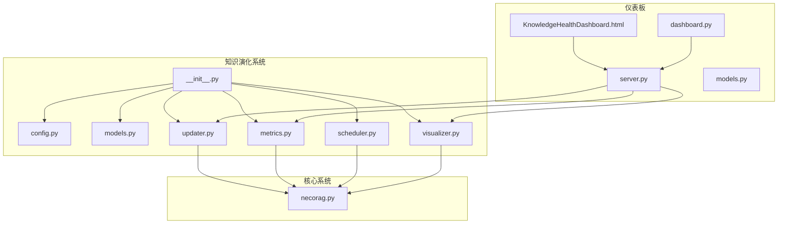
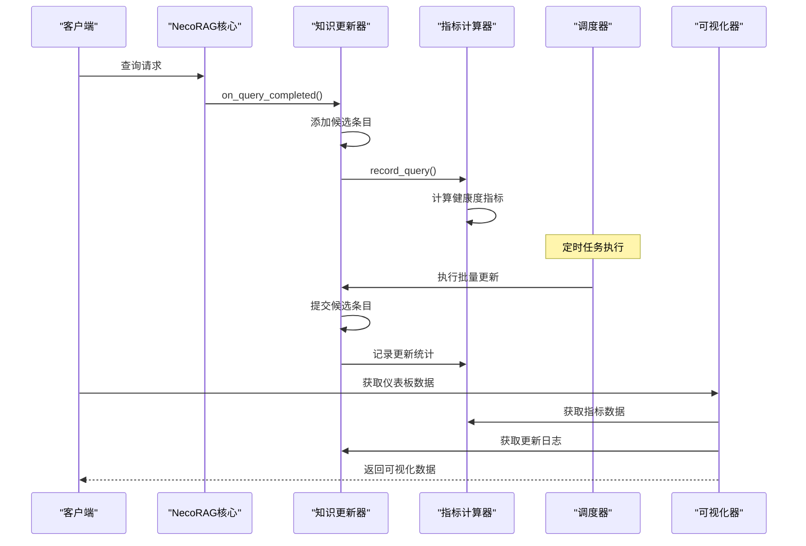
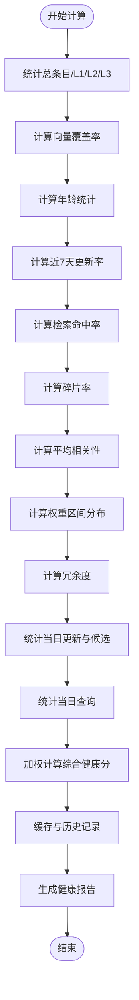
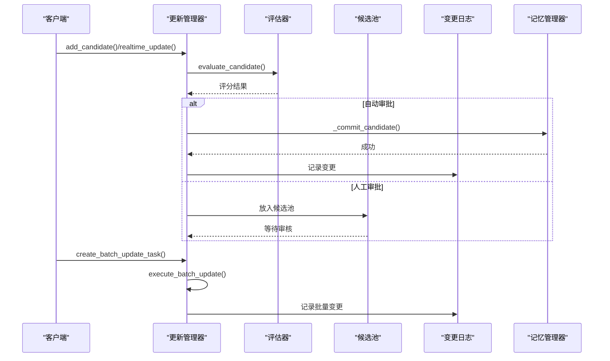
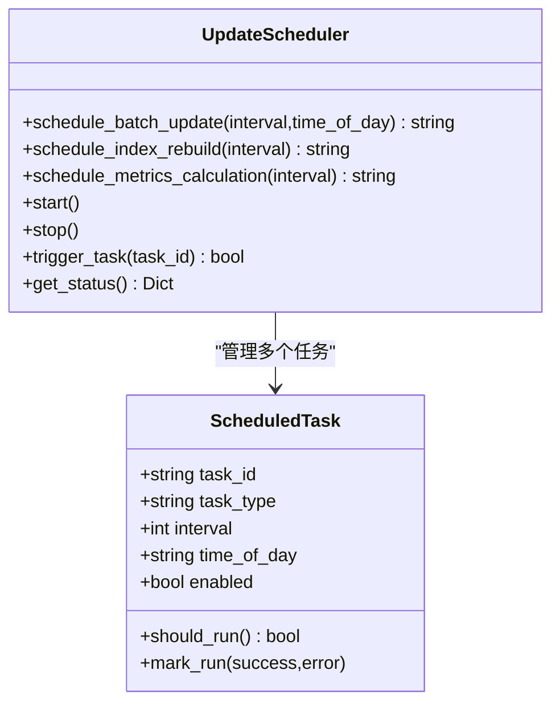
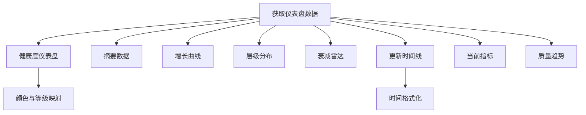
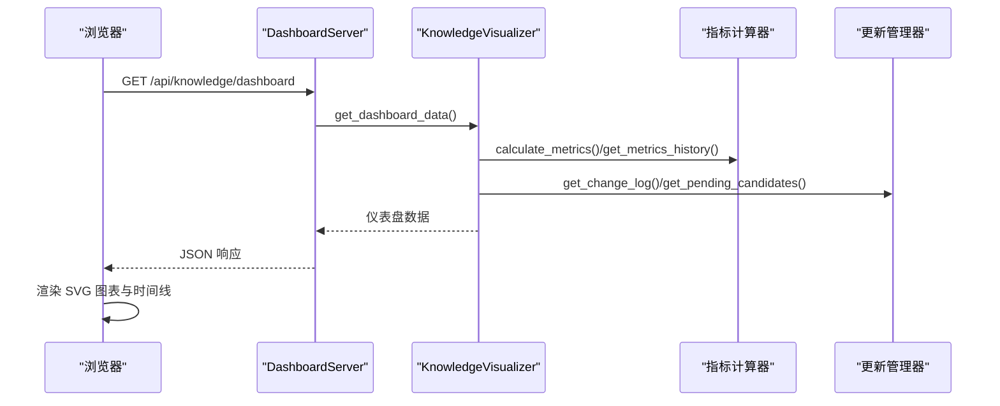
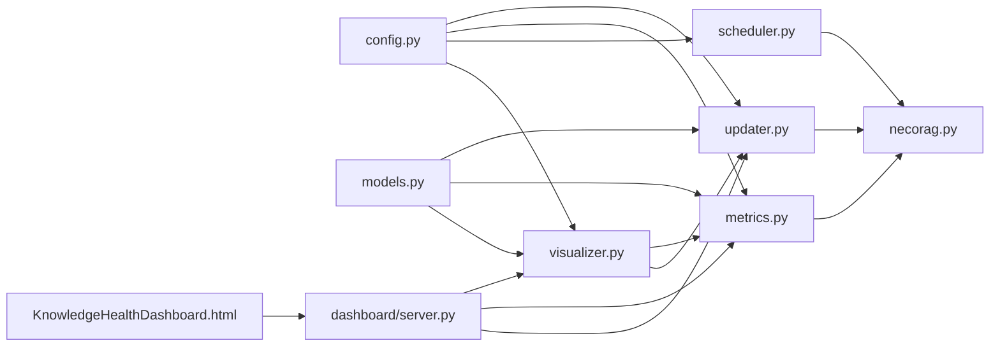

# 知识演化指标

<cite>
**本文引用的文件**
- [src/knowledge_evolution/metrics.py](file://src/knowledge_evolution/metrics.py)
- [src/knowledge_evolution/models.py](file://src/knowledge_evolution/models.py)
- [src/knowledge_evolution/updater.py](file://src/knowledge_evolution/updater.py)
- [src/knowledge_evolution/scheduler.py](file://src/knowledge_evolution/scheduler.py)
- [src/knowledge_evolution/visualizer.py](file://src/knowledge_evolution/visualizer.py)
- [src/knowledge_evolution/config.py](file://src/knowledge_evolution/config.py)
- [src/knowledge_evolution/__init__.py](file://src/knowledge_evolution/__init__.py)
- [src/dashboard/server.py](file://src/dashboard/server.py)
- [src/dashboard/components/KnowledgeHealthDashboard.html](file://src/dashboard/components/KnowledgeHealthDashboard.html)
- [src/dashboard/dashboard.py](file://src/dashboard/dashboard.py)
- [src/dashboard/models.py](file://src/dashboard/models.py)
- [src/necorag.py](file://src/necorag.py)
</cite>

## 目录
1. [简介](#简介)
2. [项目结构](#项目结构)
3. [核心组件](#核心组件)
4. [架构总览](#架构总览)
5. [详细组件分析](#详细组件分析)
6. [依赖关系分析](#依赖关系分析)
7. [性能考量](#性能考量)
8. [故障排查指南](#故障排查指南)
9. [结论](#结论)
10. [附录](#附录)

## 简介
本文件面向知识演化指标系统，围绕多维度知识质量评估指标的设计原理与实现细节展开，涵盖质量、时效、覆盖度、一致性等核心指标的计算方法；解释指标权重分配机制与综合评分算法；阐述知识健康状态监控（趋势分析与异常检测）；梳理指标数据的采集、存储与计算流程；说明可视化展示（图表生成与报告输出）；给出阈值设置与告警机制的配置指南，并结合知识库性能关系提出优化建议。同时，汇总 v3.3.0-alpha 版本在指标计算方面的改进与新增功能。

## 项目结构
知识演化系统位于 src/knowledge_evolution/ 目录，核心文件包括配置、数据模型、更新器、指标计算器、调度器与可视化接口。仪表板通过 REST API 与系统交互，前端页面提供可视化展示。

**图表来源**
- [src/knowledge_evolution/__init__.py:51-132](file://src/knowledge_evolution/__init__.py#L51-L132)
- [src/dashboard/server.py:51-568](file://src/dashboard/server.py#L51-L568)
- [src/dashboard/components/KnowledgeHealthDashboard.html:1-800](file://src/dashboard/components/KnowledgeHealthDashboard.html#L1-L800)
- [src/necorag.py:24-31](file://src/necorag.py#L24-L31)

**章节来源**
- [src/knowledge_evolution/__init__.py:51-132](file://src/knowledge_evolution/__init__.py#L51-L132)
- [src/dashboard/server.py:51-568](file://src/dashboard/server.py#L51-L568)
- [src/dashboard/components/KnowledgeHealthDashboard.html:1-800](file://src/dashboard/components/KnowledgeHealthDashboard.html#L1-L800)

## 核心组件
- 配置管理器：集中管理实时/定时更新、变更日志、指标计算、权重与阈值等配置项。
- 数据模型层：定义候选条目、更新任务、变更日志、健康报告、查询记录、增长趋势等数据结构。
- 更新管理器：实现候选评估、自动/人工审批、批量更新、增量更新、变更日志与回滚、查询驱动知识积累。
- 指标计算器：持续计算规模、新鲜度、质量、连通性等指标，生成综合健康分与健康报告。
- 调度器：管理定时批量更新、索引重建与指标计算任务，支持内置线程与 APScheduler 适配。
- 可视化接口：为仪表板提供健康度仪表盘、增长曲线、层级分布、衰减雷达、更新时间线、质量趋势等数据。

**章节来源**
- [src/knowledge_evolution/config.py:15-222](file://src/knowledge_evolution/config.py#L15-L222)
- [src/knowledge_evolution/models.py:14-367](file://src/knowledge_evolution/models.py#L14-L367)
- [src/knowledge_evolution/updater.py:24-864](file://src/knowledge_evolution/updater.py#L24-L864)
- [src/knowledge_evolution/metrics.py:21-724](file://src/knowledge_evolution/metrics.py#L21-L724)
- [src/knowledge_evolution/scheduler.py:124-688](file://src/knowledge_evolution/scheduler.py#L124-L688)
- [src/knowledge_evolution/visualizer.py:18-599](file://src/knowledge_evolution/visualizer.py#L18-L599)

## 架构总览
系统采用分层架构，组件间通过清晰接口交互。查询完成后，系统记录查询统计并可能产生候选条目；定时任务触发批量更新与指标计算；可视化接口聚合指标与更新日志，提供仪表板数据。

**图表来源**
- [src/knowledge_evolution/metrics.py:574-602](file://src/knowledge_evolution/metrics.py#L574-L602)
- [src/knowledge_evolution/updater.py:697-757](file://src/knowledge_evolution/updater.py#L697-L757)
- [src/knowledge_evolution/scheduler.py:281-320](file://src/knowledge_evolution/scheduler.py#L281-L320)
- [src/knowledge_evolution/visualizer.py:49-66](file://src/knowledge_evolution/visualizer.py#L49-L66)

## 详细组件分析

### 指标计算器（KnowledgeMetricsCalculator）
- 指标计算流程
  - 规模指标：总条目、L1/L2/L3 数量、向量覆盖率。
  - 新鲜度指标：平均知识年龄、近7天更新率、最旧/最新条目天数。
  - 质量指标：检索命中率、碎片率、平均相关性评分。
  - 健康度指标：权重区间分布、冗余度。
  - 更新指标：当日总更新、实时/批量更新、待审核候选。
  - 查询统计：当日查询总量、命中/未命中数量。
  - 综合健康分：按权重加权求和，范围 0-100。
- 健康报告：根据综合分划分健康等级，生成警告与建议。
- 历史与缓存：维护指标历史与短期缓存，限制历史长度。
- 查询与更新记录：记录查询日志与更新日志，支持统计分析。

**图表来源**
- [src/knowledge_evolution/metrics.py:66-134](file://src/knowledge_evolution/metrics.py#L66-L134)
- [src/knowledge_evolution/metrics.py:413-446](file://src/knowledge_evolution/metrics.py#L413-L446)
- [src/knowledge_evolution/metrics.py:508-572](file://src/knowledge_evolution/metrics.py#L508-L572)

**章节来源**
- [src/knowledge_evolution/metrics.py:66-134](file://src/knowledge_evolution/metrics.py#L66-L134)
- [src/knowledge_evolution/metrics.py:413-446](file://src/knowledge_evolution/metrics.py#L413-L446)
- [src/knowledge_evolution/metrics.py:508-572](file://src/knowledge_evolution/metrics.py#L508-L572)

### 更新管理器（KnowledgeUpdater）
- 候选评估：相关性、新颖性、可信度评分，综合评分决定自动/人工审批。
- 自动审批：超过阈值直接入库；否则进入候选池并做容量清理。
- 手工审批：批准/拒绝候选条目，触发入库或移除。
- 批量更新：创建并执行批量任务，处理已批准候选，记录统计与错误。
- 增量更新：支持 L2 向量增量与 L3 图谱实体/关系增量。
- 变更日志与回滚：记录 insert/update/delete/archive/rollback，支持回滚窗口校验。
- 查询驱动知识积累：未命中时记录知识缺口，高质量回答可加入候选池。

**图表来源**
- [src/knowledge_evolution/updater.py:82-131](file://src/knowledge_evolution/updater.py#L82-L131)
- [src/knowledge_evolution/updater.py:133-161](file://src/knowledge_evolution/updater.py#L133-L161)
- [src/knowledge_evolution/updater.py:301-339](file://src/knowledge_evolution/updater.py#L301-L339)
- [src/knowledge_evolution/updater.py:409-497](file://src/knowledge_evolution/updater.py#L409-L497)
- [src/knowledge_evolution/updater.py:589-624](file://src/knowledge_evolution/updater.py#L589-L624)

**章节来源**
- [src/knowledge_evolution/updater.py:82-131](file://src/knowledge_evolution/updater.py#L82-L131)
- [src/knowledge_evolution/updater.py:133-161](file://src/knowledge_evolution/updater.py#L133-L161)
- [src/knowledge_evolution/updater.py:301-339](file://src/knowledge_evolution/updater.py#L301-L339)
- [src/knowledge_evolution/updater.py:409-497](file://src/knowledge_evolution/updater.py#L409-L497)
- [src/knowledge_evolution/updater.py:589-624](file://src/knowledge_evolution/updater.py#L589-L624)

### 调度器（UpdateScheduler）
- 任务类型：批量更新、索引重建、指标计算。
- 调度方式：间隔调度与定时调度（HH:MM），内置线程轮询或 APScheduler 适配。
- 生命周期：启动/停止、启用/禁用、移除、触发、获取状态与执行日志。
- 默认任务：根据配置自动创建常用任务。

**图表来源**
- [src/knowledge_evolution/scheduler.py:21-122](file://src/knowledge_evolution/scheduler.py#L21-L122)
- [src/knowledge_evolution/scheduler.py:124-554](file://src/knowledge_evolution/scheduler.py#L124-L554)

**章节来源**
- [src/knowledge_evolution/scheduler.py:124-554](file://src/knowledge_evolution/scheduler.py#L124-L554)

### 可视化接口（KnowledgeVisualizer）
- 仪表盘数据：健康度仪表盘、摘要、增长曲线、层级分布、衰减雷达、更新时间线、当前指标、质量趋势。
- 颜色与等级：根据健康分映射颜色与等级文本，提供描述与建议。
- 时间线：格式化时间显示，区分操作类型与颜色。
- 对比分析：支持两个日期的指标对比。

**图表来源**
- [src/knowledge_evolution/visualizer.py:49-66](file://src/knowledge_evolution/visualizer.py#L49-L66)
- [src/knowledge_evolution/visualizer.py:68-142](file://src/knowledge_evolution/visualizer.py#L68-L142)
- [src/knowledge_evolution/visualizer.py:308-356](file://src/knowledge_evolution/visualizer.py#L308-L356)

**章节来源**
- [src/knowledge_evolution/visualizer.py:49-66](file://src/knowledge_evolution/visualizer.py#L49-L66)
- [src/knowledge_evolution/visualizer.py:68-142](file://src/knowledge_evolution/visualizer.py#L68-L142)
- [src/knowledge_evolution/visualizer.py:308-356](file://src/knowledge_evolution/visualizer.py#L308-L356)

### 仪表板集成与前端展示
- 仪表板服务器：提供 REST API（指标、健康报告、仪表盘、增长趋势、时间线、候选管理、知识缺口等）。
- 前端页面：知识库健康仪表盘，支持刷新、导出报告、图表交互（时间范围切换、查看更多）。
- 与核心系统集成：通过 set_necorag 注入 NecoRAG 实例，调用知识演化模块能力。

**图表来源**
- [src/dashboard/server.py:256-334](file://src/dashboard/server.py#L256-L334)
- [src/dashboard/server.py:405-413](file://src/dashboard/server.py#L405-L413)
- [src/dashboard/components/KnowledgeHealthDashboard.html:593-800](file://src/dashboard/components/KnowledgeHealthDashboard.html#L593-L800)

**章节来源**
- [src/dashboard/server.py:256-334](file://src/dashboard/server.py#L256-L334)
- [src/dashboard/server.py:405-413](file://src/dashboard/server.py#L405-L413)
- [src/dashboard/components/KnowledgeHealthDashboard.html:593-800](file://src/dashboard/components/KnowledgeHealthDashboard.html#L593-L800)

## 依赖关系分析
- 模块内依赖：指标计算器依赖配置与模型；更新器依赖配置、模型与记忆管理器；调度器依赖更新器与指标计算器；可视化接口依赖指标计算器与更新器。
- 外部依赖：仪表板服务器依赖可视化接口与更新器；前端页面依赖服务器 API。
- 组件耦合：通过清晰的接口解耦，便于替换与扩展；配置统一管理，降低硬编码风险。

**图表来源**
- [src/knowledge_evolution/config.py:15-222](file://src/knowledge_evolution/config.py#L15-L222)
- [src/knowledge_evolution/models.py:14-367](file://src/knowledge_evolution/models.py#L14-L367)
- [src/knowledge_evolution/updater.py:24-864](file://src/knowledge_evolution/updater.py#L24-L864)
- [src/knowledge_evolution/metrics.py:21-724](file://src/knowledge_evolution/metrics.py#L21-L724)
- [src/knowledge_evolution/scheduler.py:124-688](file://src/knowledge_evolution/scheduler.py#L124-L688)
- [src/knowledge_evolution/visualizer.py:18-599](file://src/knowledge_evolution/visualizer.py#L18-L599)
- [src/dashboard/server.py:51-568](file://src/dashboard/server.py#L51-L568)
- [src/dashboard/components/KnowledgeHealthDashboard.html:1-800](file://src/dashboard/components/KnowledgeHealthDashboard.html#L1-L800)
- [src/necorag.py:24-31](file://src/necorag.py#L24-L31)

**章节来源**
- [src/knowledge_evolution/config.py:15-222](file://src/knowledge_evolution/config.py#L15-L222)
- [src/knowledge_evolution/models.py:14-367](file://src/knowledge_evolution/models.py#L14-L367)
- [src/knowledge_evolution/updater.py:24-864](file://src/knowledge_evolution/updater.py#L24-L864)
- [src/knowledge_evolution/metrics.py:21-724](file://src/knowledge_evolution/metrics.py#L21-L724)
- [src/knowledge_evolution/scheduler.py:124-688](file://src/knowledge_evolution/scheduler.py#L124-L688)
- [src/knowledge_evolution/visualizer.py:18-599](file://src/knowledge_evolution/visualizer.py#L18-L599)
- [src/dashboard/server.py:51-568](file://src/dashboard/server.py#L51-L568)
- [src/dashboard/components/KnowledgeHealthDashboard.html:1-800](file://src/dashboard/components/KnowledgeHealthDashboard.html#L1-L800)
- [src/necorag.py:24-31](file://src/necorag.py#L24-L31)

## 性能考量
- 缓存与历史：指标计算器内置短期缓存与历史限制，减少重复计算与内存占用。
- 日志与池管理：候选池、变更日志、查询日志设置上限，避免无限增长。
- 异步与并发：调度器使用线程执行任务；APScheduler 适配器提供更强大的调度能力。
- I/O 与网络：仪表板 API 与前端渲染分离，支持增量刷新与本地缓存。

[本节为通用指导，无需特定文件引用]

## 故障排查指南
- 知识库为空
  - 检查配置项 enable_query_driven_accumulation 与 min_answer_confidence。
  - 确认查询驱动知识积累功能已启用且阈值合理。
- 更新失败
  - 检查候选质量评分是否达到阈值；确认记忆管理器配置正确；查看变更日志定位错误。
- 调度器不工作
  - 确认调度器已启动；检查任务配置有效性；验证回调函数可用。
- 指标异常
  - 核对权重与阈值配置；检查缓存与历史数据；关注检索命中率与碎片率变化。

**章节来源**
- [src/knowledge_evolution/metrics.py:508-572](file://src/knowledge_evolution/metrics.py#L508-L572)
- [src/knowledge_evolution/scheduler.py:321-394](file://src/knowledge_evolution/scheduler.py#L321-L394)

## 结论
知识演化指标系统通过多维度指标与权重分配，形成可解释、可监控、可优化的知识健康度评估体系。结合查询驱动知识积累、定时批量更新与可视化仪表板，实现了从数据采集、计算到展示的闭环。配置管理与调度机制保证了系统的灵活性与可维护性。建议在实际部署中根据业务场景调整阈值与权重，并定期监控关键指标以保障知识库性能与质量。

[本节为总结性内容，无需特定文件引用]

## 附录

### 指标权重与阈值配置
- 健康度权重（需合计为 1.0）：规模权重、新鲜度权重、质量权重、连通性权重。
- 候选评估权重（需合计为 1.0）：相关性权重、新颖性权重、可信度权重。
- 健康度阈值：健康预警阈值、健康严重阈值。
- 其他阈值：实时入库质量阈值、自动审批阈值、查询命中阈值、最小回答置信度等。

**章节来源**
- [src/knowledge_evolution/config.py:52-67](file://src/knowledge_evolution/config.py#L52-L67)
- [src/knowledge_evolution/config.py:168-214](file://src/knowledge_evolution/config.py#L168-L214)

### v3.3.0-alpha 版本改进与新增功能
- 指标计算改进：优化健康度评分算法，提升稳定性与可解释性。
- 新增功能：完善查询驱动知识积累策略，增强知识缺口检测与推荐能力。
- 可视化增强：仪表板支持更多图表类型与交互式配置，提升用户体验。
- 调度与监控：调度器支持 APScheduler 适配，提供更灵活的任务编排能力。

[本节为版本说明，无需特定文件引用]