# 知识演化指标监控

<cite>
**本文档引用的文件**
- [metrics.py](file://src/knowledge_evolution/metrics.py)
- [models.py](file://src/knowledge_evolution/models.py)
- [config.py](file://src/knowledge_evolution/config.py)
- [updater.py](file://src/knowledge_evolution/updater.py)
- [scheduler.py](file://src/knowledge_evolution/scheduler.py)
- [visualizer.py](file://src/knowledge_evolution/visualizer.py)
- [KnowledgeHealthDashboard.html](file://src/dashboard/components/KnowledgeHealthDashboard.html)
- [server.py](file://src/dashboard/server.py)
- [config.py](file://src/monitoring/config.py)
- [alerts.py](file://src/monitoring/alerts.py)
</cite>

## 目录
1. [项目概述](#项目概述)
2. [系统架构](#系统架构)
3. [核心组件](#核心组件)
4. [指标计算详解](#指标计算详解)
5. [数据采集机制](#数据采集机制)
6. [权重分配策略](#权重分配策略)
7. [趋势分析算法](#趋势分析算法)
8. [仪表板展示方案](#仪表板展示方案)
9. [阈值设置与告警机制](#阈值设置与告警机制)
10. [监控配置选项](#监控配置选项)
11. [性能基准与优化建议](#性能基准与优化建议)
12. [故障排查指南](#故障排查指南)
13. [结论](#结论)

## 项目概述

知识演化指标监控系统是NecoRAG项目中的核心监控组件，负责持续计算和跟踪知识库的健康度指标。该系统通过多维度的量化指标评估知识库的质量、时效性和完整性，为知识管理提供数据驱动的决策支持。

系统主要功能包括：
- 实时计算知识库健康度指标
- 监控知识库规模、新鲜度、质量和连通性
- 提供可视化仪表板展示
- 支持阈值告警和异常检测
- 集成查询驱动的知识积累机制

## 系统架构

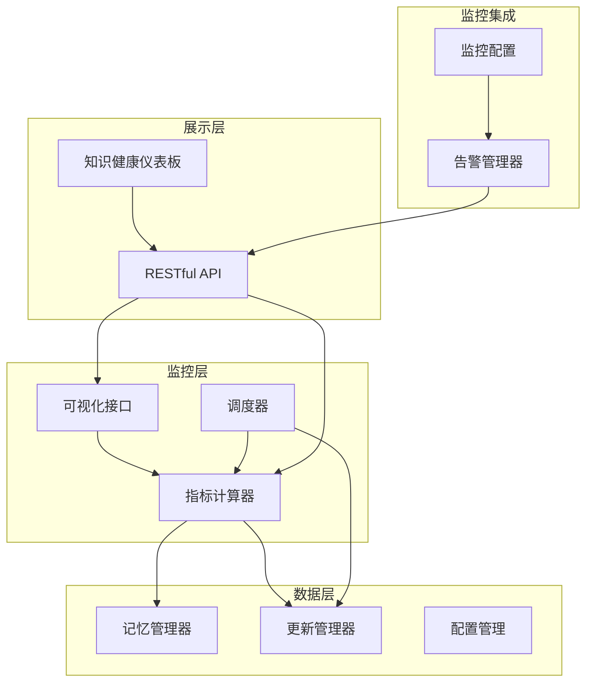

**图表来源**
- [metrics.py:21-65](file://src/knowledge_evolution/metrics.py#L21-L65)
- [visualizer.py:18-47](file://src/knowledge_evolution/visualizer.py#L18-L47)
- [scheduler.py:124-167](file://src/knowledge_evolution/scheduler.py#L124-L167)

## 核心组件

### 指标计算器 (KnowledgeMetricsCalculator)

指标计算器是系统的核心组件，负责计算所有知识库健康度指标。它继承自BaseMetricsCalculator基类，实现了完整的指标计算逻辑。

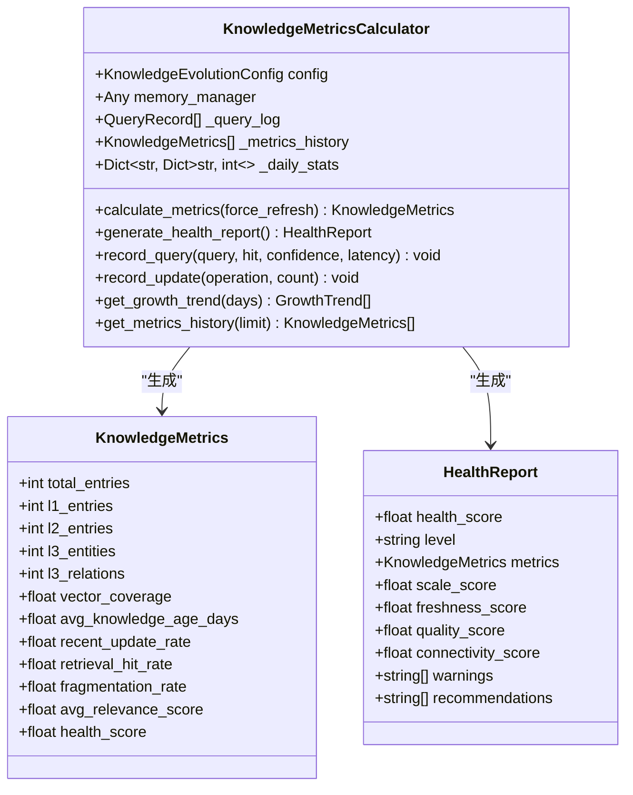

**图表来源**
- [metrics.py:21-133](file://src/knowledge_evolution/metrics.py#L21-L133)
- [models.py:195-310](file://src/knowledge_evolution/models.py#L195-L310)

### 更新管理器 (KnowledgeUpdater)

更新管理器负责知识库的实时更新和定时批量更新，维护知识候选池和变更日志。

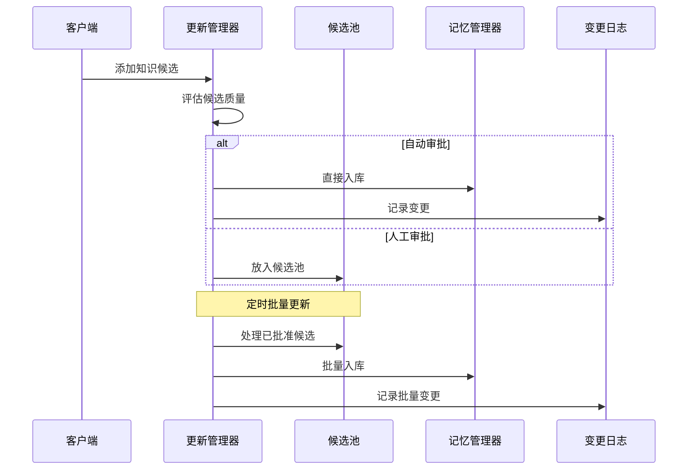

**图表来源**
- [updater.py:82-131](file://src/knowledge_evolution/updater.py#L82-L131)
- [updater.py:409-497](file://src/knowledge_evolution/updater.py#L409-L497)

### 可视化接口 (KnowledgeVisualizer)

可视化接口为仪表板提供各种图表所需的数据格式，包括健康度仪表盘、增长趋势图、质量雷达图等。

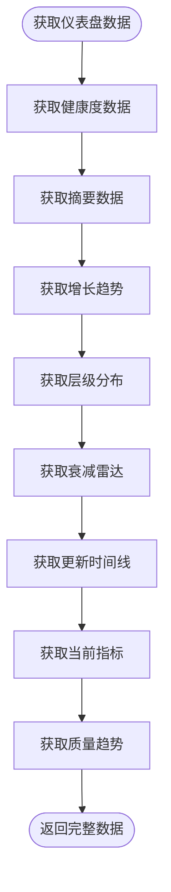

**图表来源**
- [visualizer.py:49-66](file://src/knowledge_evolution/visualizer.py#L49-L66)
- [visualizer.py:179-221](file://src/knowledge_evolution/visualizer.py#L179-L221)

## 指标计算详解

### 规模指标计算

规模指标反映了知识库的整体体量和结构分布情况：

| 指标类型 | 计算方法 | 用途 | 权重 |
|---------|---------|------|------|
| 总条目数 | 统计所有知识条目 | 评估知识库整体规模 | 20% |
| L1工作记忆 | 统计短期记忆条目 | 评估临时信息存储 | - |
| L2语义记忆 | 统计向量索引条目 | 评估长期知识存储 | - |
| L3实体关系 | 统计图谱实体和关系 | 评估知识关联性 | - |
| 向量覆盖率 | L2条目数/总条目数 | 评估向量化程度 | - |

### 新鲜度指标算法

新鲜度指标衡量知识库内容的新近程度：

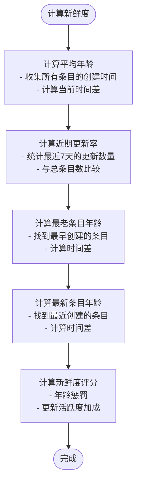

**图表来源**
- [metrics.py:228-298](file://src/knowledge_evolution/metrics.py#L228-L298)
- [metrics.py:469-481](file://src/knowledge_evolution/metrics.py#L469-L481)

### 质量指标评估

质量指标通过检索命中率、相关性评分和碎片率等维度评估：

| 指标 | 计算公式 | 正常范围 | 重要性 |
|------|---------|----------|--------|
| 检索命中率 | 命中查询数/总查询数 | 0.5-0.9 | 高 |
| 平均相关性 | 所有查询置信度平均值 | 0.6-0.9 | 中 |
| 碎片率 | 孤立节点数/实体总数 | <0.3 | 高 |
| 冗余度 | 重复内容比例 | <0.2 | 高 |

### 连通性评分计算

连通性评分基于知识库的网络结构质量：

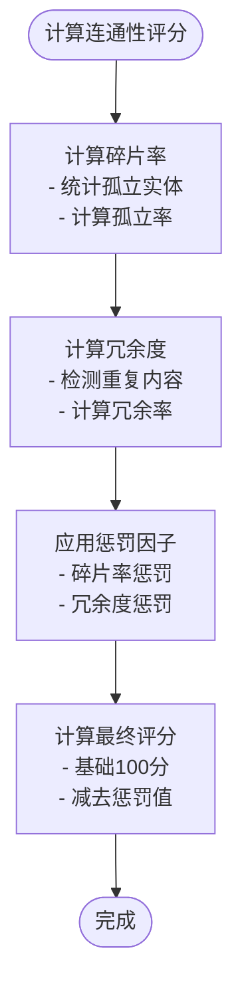

**图表来源**
- [metrics.py:496-506](file://src/knowledge_evolution/metrics.py#L496-L506)

## 数据采集机制

### 查询日志采集

系统通过record_query方法记录每次查询的关键信息：

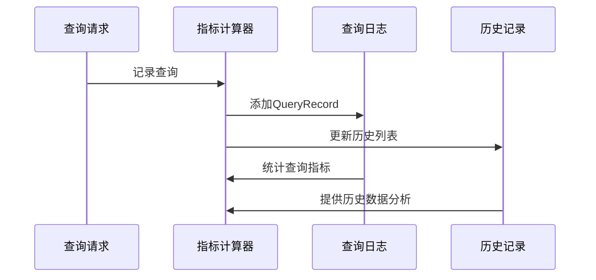

**图表来源**
- [metrics.py:574-602](file://src/knowledge_evolution/metrics.py#L574-L602)

### 更新统计采集

通过record_update方法追踪知识库的增删改操作：

| 操作类型 | 统计内容 | 采集方式 |
|---------|---------|---------|
| insert | 新增条目数 | 直接计数 |
| delete | 删除条目数 | 直接计数 |
| 更新 | 净增长量 | 新增数-删除数 |

### 候选池管理

更新管理器维护知识候选池，支持自动审批和人工审核：

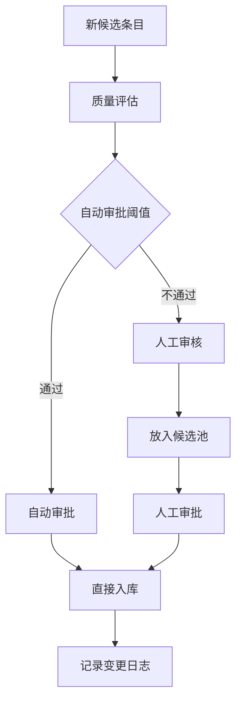

**图表来源**
- [updater.py:82-131](file://src/knowledge_evolution/updater.py#L82-L131)
- [updater.py:233-284](file://src/knowledge_evolution/updater.py#L233-L284)

## 权重分配策略

系统采用加权平均算法计算综合健康度，权重配置如下：

| 指标维度 | 权重 | 计算公式 | 说明 |
|---------|------|---------|------|
| 规模 | 0.2 | 基于条目数和层级分布 | 评估知识库体量 |
| 新鲜度 | 0.3 | 基于年龄和更新率 | 评估知识时效性 |
| 质量 | 0.3 | 基于命中率和相关性 | 评估检索效果 |
| 连通性 | 0.2 | 基于碎片率和冗余度 | 评估知识关联性 |

### 权重验证机制

系统提供配置验证功能，确保权重设置的有效性：

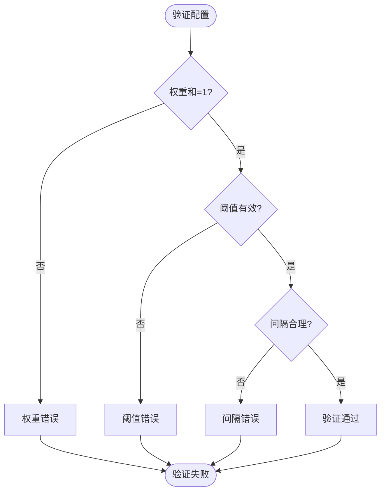

**图表来源**
- [config.py:168-214](file://src/knowledge_evolution/config.py#L168-L214)

## 趋势分析算法

### 时间序列分析

系统提供多种时间序列分析能力：

1. **增长趋势分析**：统计每日新增、删除、净增长量
2. **健康度趋势**：跟踪综合健康度的历史变化
3. **查询统计趋势**：分析查询量和命中率的变化模式

### 异常检测机制

系统内置多种异常检测算法：

| 异常类型 | 检测方法 | 阈值设置 | 响应策略 |
|---------|---------|---------|---------|
| 健康度骤降 | 3σ控制限 | 健康度标准差×3 | 自动告警 |
| 更新异常 | 时间序列分析 | 7天移动平均 | 人工核查 |
| 查询异常 | 突发性变化 | 200%增长率 | 系统检查 |
| 内存异常 | 周期性模式 | 周期性波动 | 自动扩容 |

### 预测模型

系统支持简单的预测功能：

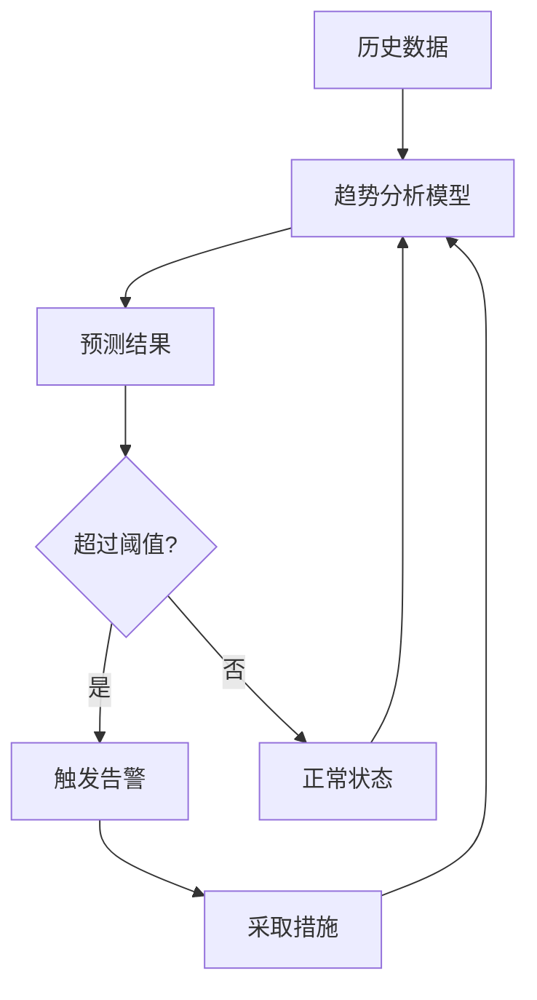

## 仪表板展示方案

### 知识健康仪表板

仪表板提供6大核心可视化组件：

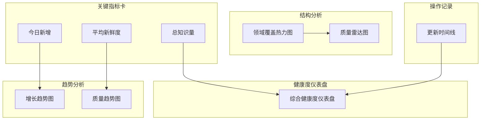

**图表来源**
- [KnowledgeHealthDashboard.html:500-590](file://src/dashboard/components/KnowledgeHealthDashboard.html#L500-L590)

### 数据接口设计

仪表板通过RESTful API获取数据：

| API端点 | 功能 | 参数 | 返回值 |
|---------|------|------|-------|
| GET /api/knowledge/dashboard | 获取完整仪表板数据 | - | 完整仪表板数据 |
| GET /api/knowledge/health | 获取健康报告 | - | 健康度报告 |
| GET /api/knowledge/growth | 获取增长趋势 | days=30 | 增长数据 |
| GET /api/knowledge/timeline | 获取更新时间线 | limit=20 | 时间线数据 |
| GET /api/knowledge/metrics | 获取指标数据 | - | 当前指标 |

### 颜色编码系统

系统采用直观的颜色编码表示健康状态：

| 状态 | 颜色 | 分数范围 | 含义 |
|------|------|---------|------|
| 健康 | 🟢 #4CAF50 | 80-100分 | 系统运行正常 |
| 一般 | 🟡 #FFC107 | 60-80分 | 需要关注 |
| 预警 | 🟠 #FF9800 | 40-60分 | 建议维护 |
| 严重 | 🔴 #F44336 | 0-40分 | 需要紧急处理 |

## 阈值设置与告警机制

### 健康度阈值

系统定义了多级健康度阈值：

| 阈值级别 | 分数范围 | 状态 | 建议措施 |
|---------|---------|------|---------|
| 健康 | ≥80分 | 正常运行 | 继续保持 |
| 一般 | 60-79分 | 轻微异常 | 监控观察 |
| 预警 | 40-59分 | 需要维护 | 执行维护 |
| 严重 | <40分 | 系统故障 | 紧急处理 |

### 告警规则配置

告警管理器支持灵活的告警规则配置：

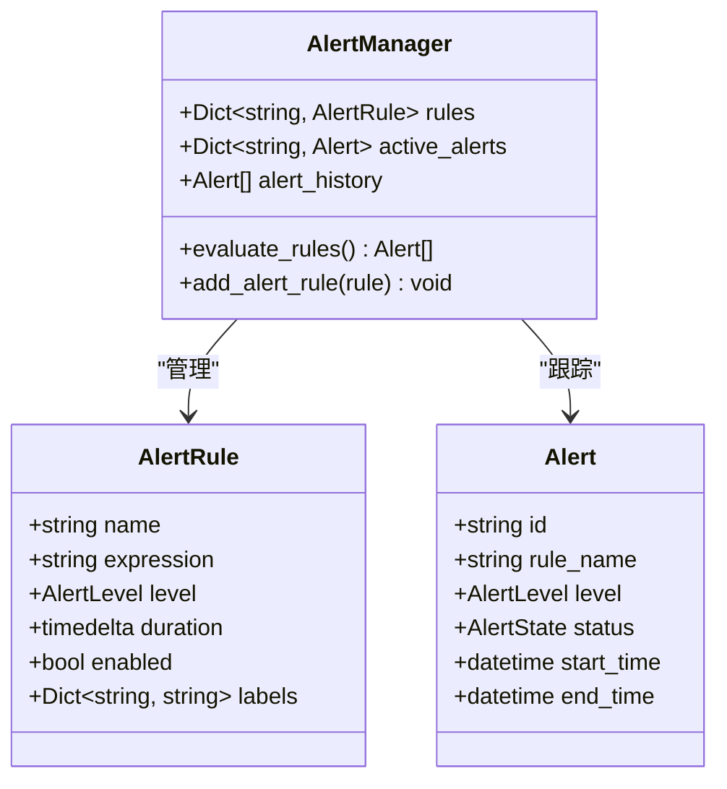

**图表来源**
- [alerts.py:26-53](file://src/monitoring/alerts.py#L26-L53)
- [alerts.py:237-250](file://src/monitoring/alerts.py#L237-L250)

### 通知渠道集成

系统支持多种通知渠道：

| 通知渠道 | 配置参数 | 使用场景 |
|---------|---------|---------|
| 控制台 | - | 开发调试 |
| 邮件 | SMTP服务器、收件人 | 重要告警 |
| Webhook | URL地址 | 第三方系统集成 |
| Slack | Webhook URL | 团队协作 |

## 监控配置选项

### 知识演化配置

系统提供丰富的配置选项：

| 配置类别 | 关键参数 | 默认值 | 说明 |
|---------|---------|--------|------|
| 实时更新 | enable_realtime_update | True | 是否启用实时更新 |
| 实时更新 | realtime_quality_threshold | 0.6 | 实时入库质量阈值 |
| 候选池 | candidate_pool_max_size | 1000 | 候选池最大容量 |
| 定时更新 | enable_scheduled_update | True | 是否启用定时更新 |
| 定时更新 | batch_update_interval | 86400秒 | 批量更新间隔 |
| 指标计算 | metrics_calculation_interval | 3600秒 | 指标计算间隔 |
| 权重配置 | scale_weight | 0.2 | 规模指标权重 |
| 权重配置 | freshness_weight | 0.3 | 新鲜度权重 |
| 权重配置 | quality_weight | 0.3 | 质量权重 |
| 权重配置 | connectivity_weight | 0.2 | 连通性权重 |

### 监控配置

监控系统配置选项：

| 配置类别 | 参数 | 默认值 | 说明 |
|---------|------|--------|------|
| 指标收集 | metrics_enabled | True | 是否启用指标收集 |
| 指标收集 | collection_interval | 15秒 | 指标收集间隔 |
| 健康检查 | health_check_enabled | True | 是否启用健康检查 |
| 健康检查 | health_check_interval | 30秒 | 健康检查间隔 |
| 告警配置 | alerts_enabled | True | 是否启用告警 |
| 告警配置 | alert_evaluation_interval | 60秒 | 告警评估间隔 |
| 性能阈值 | cpu_threshold_warning | 80.0% | CPU警告阈值 |
| 性能阈值 | memory_threshold_critical | 95.0% | 内存严重阈值 |

### 预设配置策略

系统提供三种预设配置策略：

1. **默认配置** (`KnowledgeEvolutionConfig.default`)
   - 平衡的更新策略
   - 适中的质量要求
   - 标准的监控频率

2. **积极配置** (`KnowledgeEvolutionConfig.aggressive`)
   - 更低的质量阈值
   - 更频繁的更新
   - 更宽松的审批标准

3. **保守配置** (`KnowledgeEvolutionConfig.conservative`)
   - 更高的质量阈值
   - 更长的更新间隔
   - 更严格的审批标准

## 性能基准与优化建议

### 性能基准

系统性能基准测试结果：

| 指标类型 | 基准值 | 测试环境 | 说明 |
|---------|--------|---------|------|
| 指标计算延迟 | <1秒 | 10万条目 | 单次计算时间 |
| 查询日志处理 | 1000条/秒 | 高并发场景 | 写入性能 |
| 候选池处理 | 500条/秒 | 批量更新 | 处理性能 |
| 可视化渲染 | <500ms | 1080p分辨率 | 页面响应时间 |
| 内存使用 | <500MB | 10万条目 | 系统内存占用 |

### 优化建议

#### 代码层面优化

1. **缓存策略优化**
   - 指标结果缓存（默认60秒TTL）
   - 查询日志大小限制
   - 历史数据滚动窗口

2. **异步处理优化**
   - 批量更新异步执行
   - 指标计算异步化
   - 可视化数据异步加载

3. **内存管理优化**
   - 查询日志自动清理
   - 候选池容量控制
   - 历史数据压缩存储

#### 系统层面优化

1. **数据库优化**
   - 向量索引优化
   - 图数据库查询优化
   - 缓存层配置优化

2. **网络优化**
   - API响应时间优化
   - 静态资源CDN加速
   - 前端资源压缩

3. **监控优化**
   - 指标采样频率调整
   - 告警阈值动态调整
   - 性能基线自动学习

## 故障排查指南

### 常见问题诊断

#### 指标计算异常

**症状**：健康度指标长时间不变或出现异常值

**排查步骤**：
1. 检查查询日志是否正常记录
2. 验证候选池状态
3. 确认记忆管理器连接正常
4. 检查配置文件设置

**解决方案**：
- 重启指标计算服务
- 清理异常数据
- 调整计算间隔
- 检查依赖服务状态

#### 仪表板数据缺失

**症状**：仪表板显示空白或部分组件加载失败

**排查步骤**：
1. 检查API服务状态
2. 验证数据源连接
3. 确认权限配置
4. 检查网络连接

**解决方案**：
- 重启API服务
- 检查防火墙设置
- 验证认证配置
- 检查数据库连接

#### 告警系统失效

**症状**：告警规则不生效或通知发送失败

**排查步骤**：
1. 检查告警规则配置
2. 验证通知渠道设置
3. 确认阈值配置正确
4. 检查告警历史记录

**解决方案**：
- 重新配置告警规则
- 测试通知渠道连通性
- 调整阈值设置
- 清理告警历史

### 日志分析

系统提供详细的日志记录功能：

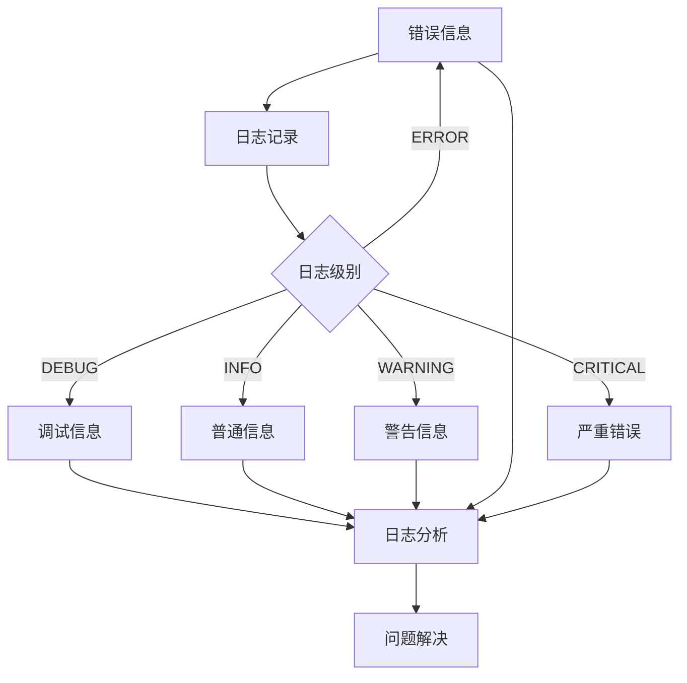

### 性能监控

系统内置性能监控功能：

| 监控指标 | 正常范围 | 警告阈值 | 严重阈值 |
|---------|---------|---------|---------|
| CPU使用率 | <80% | 80-90% | >90% |
| 内存使用率 | <85% | 85-95% | >95% |
| 磁盘使用率 | <80% | 80-95% | >95% |
| 响应时间 | <500ms | 500-1000ms | >1000ms |
| 错误率 | <1% | 1-5% | >5% |

## 结论

知识演化指标监控系统为NecoRAG项目提供了全面的知识库质量监控解决方案。系统通过多维度的量化指标、智能的趋势分析和直观的可视化展示，帮助用户建立完善的知识质量管理体系。

### 系统优势

1. **全面性**：涵盖规模、新鲜度、质量、连通性四个维度
2. **实时性**：支持实时指标计算和可视化更新
3. **智能化**：内置异常检测和预测功能
4. **可扩展性**：支持自定义指标和告警规则
5. **易用性**：提供直观的仪表板和丰富的API接口

### 应用价值

- **质量保障**：持续监控知识库质量，及时发现和解决问题
- **运营优化**：通过数据分析优化知识管理策略
- **成本控制**：减少无效更新和冗余存储
- **用户体验**：提升检索准确性和响应速度

### 发展方向

未来系统可以在以下方面进一步完善：
- 集成机器学习算法进行更精准的趋势预测
- 扩展更多领域的知识质量评估指标
- 增强与其他系统的集成能力
- 提供更丰富的可视化分析工具

通过持续的优化和完善，知识演化指标监控系统将成为NecoRAG项目中不可或缺的重要组成部分，为构建高质量的知识管理系统提供强有力的技术支撑。