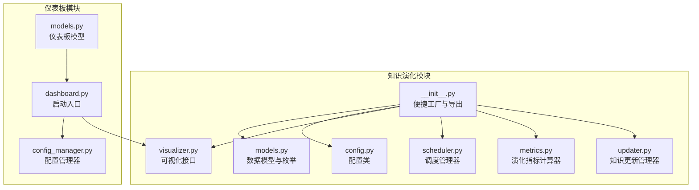
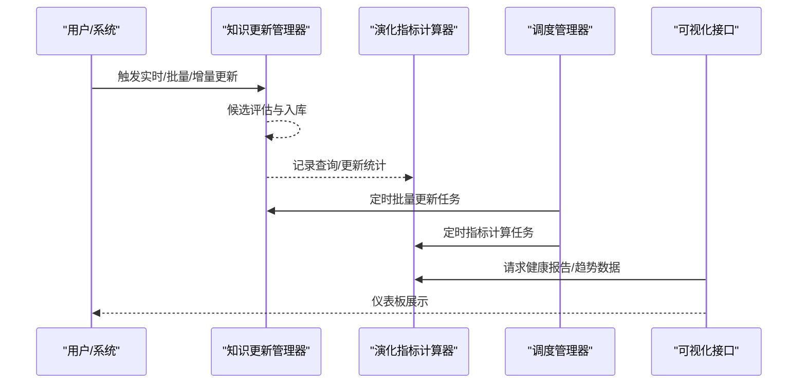
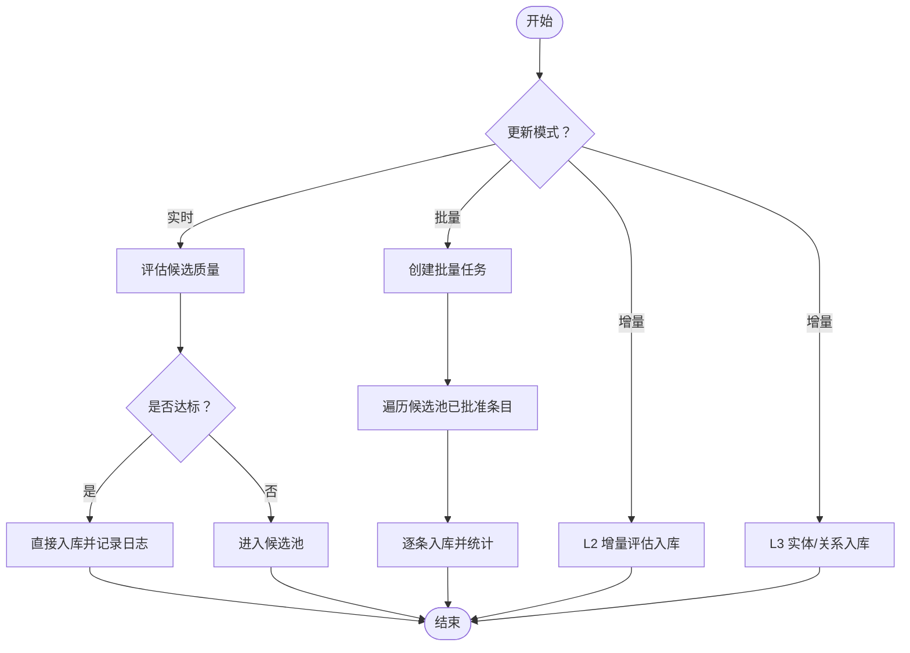
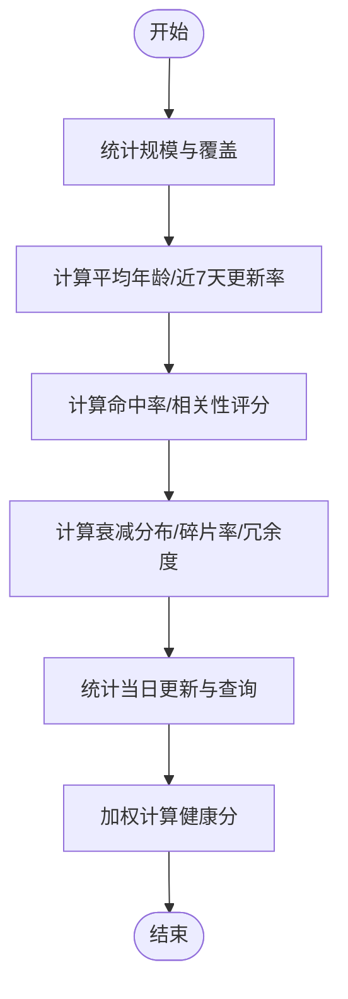
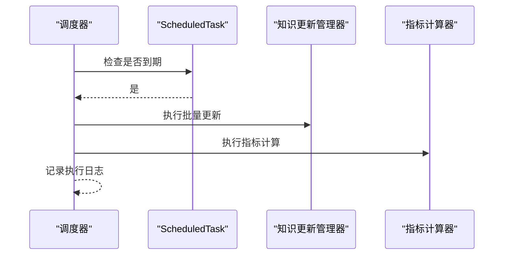
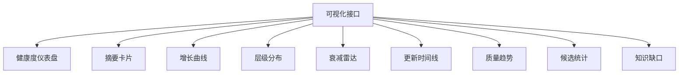
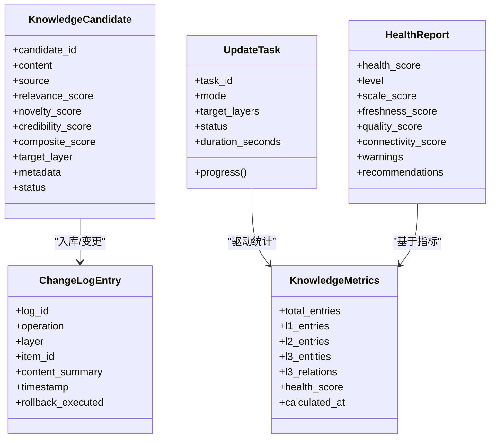
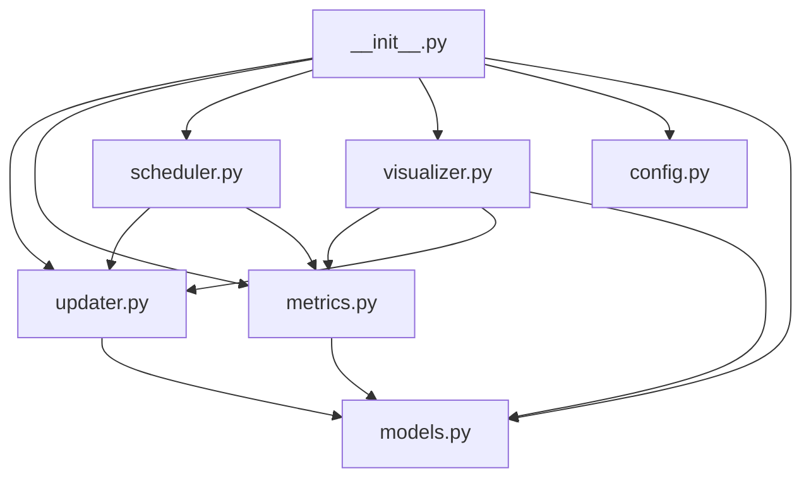

# 知识演化系统

<cite>
**本文引用的文件**
- [src/knowledge_evolution/__init__.py](file://src/knowledge_evolution/__init__.py)
- [src/knowledge_evolution/updater.py](file://src/knowledge_evolution/updater.py)
- [src/knowledge_evolution/metrics.py](file://src/knowledge_evolution/metrics.py)
- [src/knowledge_evolution/scheduler.py](file://src/knowledge_evolution/scheduler.py)
- [src/knowledge_evolution/models.py](file://src/knowledge_evolution/models.py)
- [src/knowledge_evolution/visualizer.py](file://src/knowledge_evolution/visualizer.py)
- [src/knowledge_evolution/config.py](file://src/knowledge_evolution/config.py)
- [src/dashboard/dashboard.py](file://src/dashboard/dashboard.py)
- [src/dashboard/models.py](file://src/dashboard/models.py)
- [src/dashboard/config_manager.py](file://src/dashboard/config_manager.py)
</cite>

## 目录
1. [简介](#简介)
2. [项目结构](#项目结构)
3. [核心组件](#核心组件)
4. [架构总览](#架构总览)
5. [详细组件分析](#详细组件分析)
6. [依赖关系分析](#依赖关系分析)
7. [性能考量](#性能考量)
8. [故障排查指南](#故障排查指南)
9. [结论](#结论)
10. [附录](#附录)

## 简介
本文件面向“知识演化系统”的实现与使用，围绕以下目标展开：
- 解释知识更新管理器的工作原理，包括触发式刷新与增量更新机制
- 详解演化指标计算，覆盖质量、时效、覆盖度等多维度评估
- 阐述调度管理器，包括更新计划制定与执行监控机制
- 说明可视化仪表板，包括知识健康状态展示与趋势分析
- 解释知识演化模型，包括版本管理与变更追踪机制
- 提供演化指标的计算公式与评估算法
- 说明与知识库的集成关系与数据同步机制
- 覆盖 v3.3.0-alpha 版本的新增功能特性

## 项目结构
知识演化系统位于 src/knowledge_evolution 目录，采用模块化设计，包含更新、指标、调度、可视化与配置等子模块；同时，仪表板模块位于 src/dashboard，负责可视化数据接口与前端展示。

**图表来源**
- [src/knowledge_evolution/__init__.py:1-133](file://src/knowledge_evolution/__init__.py#L1-L133)
- [src/knowledge_evolution/updater.py:1-864](file://src/knowledge_evolution/updater.py#L1-L864)
- [src/knowledge_evolution/metrics.py:1-725](file://src/knowledge_evolution/metrics.py#L1-L725)
- [src/knowledge_evolution/scheduler.py:1-688](file://src/knowledge_evolution/scheduler.py#L1-L688)
- [src/knowledge_evolution/visualizer.py:1-599](file://src/knowledge_evolution/visualizer.py#L1-L599)
- [src/knowledge_evolution/config.py:1-222](file://src/knowledge_evolution/config.py#L1-L222)
- [src/knowledge_evolution/models.py:1-367](file://src/knowledge_evolution/models.py#L1-L367)
- [src/dashboard/dashboard.py:1-31](file://src/dashboard/dashboard.py#L1-L31)
- [src/dashboard/models.py:1-232](file://src/dashboard/models.py#L1-L232)
- [src/dashboard/config_manager.py:1-315](file://src/dashboard/config_manager.py#L1-L315)

**章节来源**
- [src/knowledge_evolution/__init__.py:1-133](file://src/knowledge_evolution/__init__.py#L1-L133)
- [src/dashboard/dashboard.py:1-31](file://src/dashboard/dashboard.py#L1-L31)

## 核心组件
- 知识更新管理器（KnowledgeUpdater）：负责实时更新、批量更新、增量更新、候选评估与变更日志管理，并提供查询驱动的知识积累能力。
- 演化指标计算器（KnowledgeMetricsCalculator）：持续计算健康度指标，提供综合评分与维度报告，并支持历史趋势与查询统计。
- 调度管理器（UpdateScheduler/APSchedulerAdapter）：管理定时批量更新、索引重建与指标计算任务，支持内置线程轮询与 APScheduler 集成。
- 可视化接口（KnowledgeVisualizer）：为仪表板提供健康度、增长趋势、层级分布、衰减雷达、更新时间线等数据格式。
- 配置类（KnowledgeEvolutionConfig）：集中管理演化策略、阈值、权重与开关项，支持默认/积极/保守/最小配置预设。
- 数据模型（models.py）：定义更新模式、状态、来源、候选状态、指标、报告、查询记录、增长趋势等数据结构。

**章节来源**
- [src/knowledge_evolution/updater.py:24-800](file://src/knowledge_evolution/updater.py#L24-L800)
- [src/knowledge_evolution/metrics.py:21-725](file://src/knowledge_evolution/metrics.py#L21-L725)
- [src/knowledge_evolution/scheduler.py:124-688](file://src/knowledge_evolution/scheduler.py#L124-L688)
- [src/knowledge_evolution/visualizer.py:18-599](file://src/knowledge_evolution/visualizer.py#L18-L599)
- [src/knowledge_evolution/config.py:15-222](file://src/knowledge_evolution/config.py#L15-L222)
- [src/knowledge_evolution/models.py:14-367](file://src/knowledge_evolution/models.py#L14-L367)

## 架构总览
知识演化系统以“更新—指标—调度—可视化”为主线，形成闭环：
- 更新层：实时/批量/增量更新，候选评估与变更日志
- 指标层：健康度与维度指标计算，历史趋势与查询统计
- 调度层：周期性任务编排与执行监控
- 可视化层：健康仪表盘、增长曲线、雷达图、时间线等

**图表来源**
- [src/knowledge_evolution/updater.py:361-497](file://src/knowledge_evolution/updater.py#L361-L497)
- [src/knowledge_evolution/metrics.py:66-134](file://src/knowledge_evolution/metrics.py#L66-L134)
- [src/knowledge_evolution/scheduler.py:169-320](file://src/knowledge_evolution/scheduler.py#L169-L320)
- [src/knowledge_evolution/visualizer.py:49-66](file://src/knowledge_evolution/visualizer.py#L49-L66)

## 详细组件分析

### 知识更新管理器（触发式刷新与增量更新）
- 触发式刷新
  - 实时更新：对单条知识进行质量评估，高于阈值直接入库；否则进入候选池。
  - 批量更新：创建任务，遍历候选池中已批准条目，统一入库并统计处理结果。
  - 查询驱动积累：在查询完成后，若命中率低且答案质量高，将高质量回答转化为候选条目。
- 增量更新
  - L2 增量：接收外部向量数据，按质量阈值评估后入库。
  - L3 增量：接收实体/关系，记录变更日志并统计更新数量。
- 候选评估
  - 相关性、新颖性、可信度三维度评分，加权得到综合评分；超过阈值自动审批。
- 变更日志与回滚
  - 变更日志记录 insert/update/delete 等操作；支持回滚窗口期内的回滚操作与审计。

**图表来源**
- [src/knowledge_evolution/updater.py:361-497](file://src/knowledge_evolution/updater.py#L361-L497)
- [src/knowledge_evolution/updater.py:501-586](file://src/knowledge_evolution/updater.py#L501-L586)
- [src/knowledge_evolution/updater.py:133-232](file://src/knowledge_evolution/updater.py#L133-L232)

**章节来源**
- [src/knowledge_evolution/updater.py:82-132](file://src/knowledge_evolution/updater.py#L82-L132)
- [src/knowledge_evolution/updater.py:133-232](file://src/knowledge_evolution/updater.py#L133-L232)
- [src/knowledge_evolution/updater.py:361-497](file://src/knowledge_evolution/updater.py#L361-L497)
- [src/knowledge_evolution/updater.py:501-586](file://src/knowledge_evolution/updater.py#L501-L586)
- [src/knowledge_evolution/updater.py:590-694](file://src/knowledge_evolution/updater.py#L590-L694)

### 演化指标计算（质量、时效、覆盖度等）
- 规模指标：总条目、L1/L2/L3 数量、向量覆盖率
- 新鲜度指标：平均知识年龄、近7天更新率、最旧/最新条目天数
- 质量指标：检索命中率、碎片率（孤立节点比例）、平均相关性评分
- 健康度指标：权重区间分布（衰减分布）、冗余度
- 更新指标：当日总更新、实时/批量更新数、待审核候选数
- 查询统计：当日查询总量、命中/未命中数量
- 综合健康分：按权重加权的维度评分，范围 0-100

**图表来源**
- [src/knowledge_evolution/metrics.py:66-134](file://src/knowledge_evolution/metrics.py#L66-L134)
- [src/knowledge_evolution/metrics.py:136-390](file://src/knowledge_evolution/metrics.py#L136-L390)
- [src/knowledge_evolution/metrics.py:413-506](file://src/knowledge_evolution/metrics.py#L413-L506)

**章节来源**
- [src/knowledge_evolution/metrics.py:66-134](file://src/knowledge_evolution/metrics.py#L66-L134)
- [src/knowledge_evolution/metrics.py:136-390](file://src/knowledge_evolution/metrics.py#L136-L390)
- [src/knowledge_evolution/metrics.py:413-506](file://src/knowledge_evolution/metrics.py#L413-L506)

### 调度管理器（更新计划制定与执行监控）
- 任务类型：批量更新、索引重建、指标计算、自定义任务
- 调度方式：间隔调度与每日固定时间（cron 式）
- 执行监控：后台线程轮询检查到期任务，记录执行日志与错误次数
- APScheduler 集成：可选使用 APScheduler 作为生产级调度器

**图表来源**
- [src/knowledge_evolution/scheduler.py:345-381](file://src/knowledge_evolution/scheduler.py#L345-L381)
- [src/knowledge_evolution/scheduler.py:281-320](file://src/knowledge_evolution/scheduler.py#L281-L320)

**章节来源**
- [src/knowledge_evolution/scheduler.py:124-554](file://src/knowledge_evolution/scheduler.py#L124-L554)
- [src/knowledge_evolution/scheduler.py:557-688](file://src/knowledge_evolution/scheduler.py#L557-L688)

### 可视化仪表板（知识健康状态与趋势分析）
- 健康度仪表盘：综合健康分、维度评分、预警与建议
- 摘要卡片：总条目、当日更新、待审核候选、命中率、平均年龄
- 增长曲线：总条目、新增、删除、净增长（按日）
- 层级分布：L1/L2/L3 实体/关系占比
- 衰减雷达：规模、新鲜度、质量、连通性、活跃度
- 更新时间线：变更日志的可视化时间线
- 质量趋势：按日聚合的健康分趋势
- 候选统计：按来源分类的待审核候选分布
- 知识缺口：高频未命中查询的统计

**图表来源**
- [src/knowledge_evolution/visualizer.py:49-66](file://src/knowledge_evolution/visualizer.py#L49-L66)
- [src/knowledge_evolution/visualizer.py:68-142](file://src/knowledge_evolution/visualizer.py#L68-L142)
- [src/knowledge_evolution/visualizer.py:179-221](file://src/knowledge_evolution/visualizer.py#L179-L221)
- [src/knowledge_evolution/visualizer.py:222-255](file://src/knowledge_evolution/visualizer.py#L222-L255)
- [src/knowledge_evolution/visualizer.py:257-293](file://src/knowledge_evolution/visualizer.py#L257-L293)
- [src/knowledge_evolution/visualizer.py:308-341](file://src/knowledge_evolution/visualizer.py#L308-L341)
- [src/knowledge_evolution/visualizer.py:407-453](file://src/knowledge_evolution/visualizer.py#L407-L453)
- [src/knowledge_evolution/visualizer.py:525-568](file://src/knowledge_evolution/visualizer.py#L525-L568)
- [src/knowledge_evolution/visualizer.py:570-599](file://src/knowledge_evolution/visualizer.py#L570-L599)

**章节来源**
- [src/knowledge_evolution/visualizer.py:49-66](file://src/knowledge_evolution/visualizer.py#L49-L66)

### 知识演化模型（版本管理与变更追踪）
- 数据模型
  - 更新模式/状态/来源/候选状态枚举
  - 知识候选条目：内容、来源、评分、目标层级、元数据、状态
  - 更新任务：任务ID、模式、目标层级、状态、进度、耗时
  - 变更日志：操作类型、层级、条目ID、摘要、时间戳、元数据、回滚标记
  - 指标与报告：规模、新鲜度、质量、连通性、健康分、维度评分、警告与建议
  - 查询记录与增长趋势：用于趋势分析与质量评估
- 版本与变更追踪
  - 变更日志记录 insert/update/delete/archive/rollback
  - 回滚窗口控制与回滚执行标记
  - 候选池与审批流程支撑“版本演进”的可控性

**图表来源**
- [src/knowledge_evolution/models.py:63-103](file://src/knowledge_evolution/models.py#L63-L103)
- [src/knowledge_evolution/models.py:106-158](file://src/knowledge_evolution/models.py#L106-L158)
- [src/knowledge_evolution/models.py:161-191](file://src/knowledge_evolution/models.py#L161-L191)
- [src/knowledge_evolution/models.py:194-272](file://src/knowledge_evolution/models.py#L194-L272)
- [src/knowledge_evolution/models.py:275-309](file://src/knowledge_evolution/models.py#L275-L309)

**章节来源**
- [src/knowledge_evolution/models.py:14-367](file://src/knowledge_evolution/models.py#L14-L367)

### 演化指标计算公式与评估算法
- 规模评分：随总条目对数增长加分，L2 覆盖比例加成
- 新鲜度评分：平均年龄惩罚，近7天更新率加成
- 质量评分：命中率与平均相关性加成
- 连通性评分：碎片率与冗余度惩罚
- 综合健康分：按权重加权求和，范围 0-100

**章节来源**
- [src/knowledge_evolution/metrics.py:413-446](file://src/knowledge_evolution/metrics.py#L413-L446)
- [src/knowledge_evolution/metrics.py:448-506](file://src/knowledge_evolution/metrics.py#L448-L506)

### 与知识库的集成关系与数据同步机制
- 更新侧：通过记忆管理器（memory_manager）与各层存储交互，实时/批量/增量更新均通过统一的提交与变更日志接口完成。
- 指标侧：通过查询日志与更新日志统计规模、新鲜度、质量与连通性指标。
- 可视化侧：从指标计算器与更新管理器拉取数据，形成仪表板所需格式。
- 配置侧：集中配置演化策略、阈值与权重，支持默认/积极/保守/最小配置。

**章节来源**
- [src/knowledge_evolution/updater.py:301-339](file://src/knowledge_evolution/updater.py#L301-L339)
- [src/knowledge_evolution/metrics.py:66-134](file://src/knowledge_evolution/metrics.py#L66-L134)
- [src/knowledge_evolution/visualizer.py:49-66](file://src/knowledge_evolution/visualizer.py#L49-L66)
- [src/knowledge_evolution/config.py:15-222](file://src/knowledge_evolution/config.py#L15-L222)

### v3.3.0-alpha 版本新增功能特性
- 新增积极/保守/最小配置预设，便于不同场景选择
- 新增 APScheduler 适配器，支持生产级调度
- 新增查询驱动知识积累与知识缺口检测
- 新增候选条目来源统计与知识缺口表格
- 新增指标对比与领域覆盖热力图占位（待集成）

**章节来源**
- [src/knowledge_evolution/config.py:104-166](file://src/knowledge_evolution/config.py#L104-L166)
- [src/knowledge_evolution/scheduler.py:568-661](file://src/knowledge_evolution/scheduler.py#L568-L661)
- [src/knowledge_evolution/updater.py:697-793](file://src/knowledge_evolution/updater.py#L697-L793)
- [src/knowledge_evolution/visualizer.py:455-466](file://src/knowledge_evolution/visualizer.py#L455-L466)
- [src/knowledge_evolution/visualizer.py:468-523](file://src/knowledge_evolution/visualizer.py#L468-L523)

## 依赖关系分析
- 模块内依赖
  - __init__.py 作为便捷工厂，统一导出核心类与配置
  - updater 依赖 models 与 config，调用 memory_manager 完成入库
  - metrics 依赖 models 与 config，统计查询与更新日志
  - scheduler 依赖 models 与 config，协调 updater 与 metrics
  - visualizer 依赖 metrics 与 updater，提供仪表板数据
- 仪表板模块
  - dashboard.py 作为启动入口，依赖 server（未在本节展开）
  - config_manager 负责配置 Profile 的持久化与切换
  - models 中包含 ModuleType/ModuleConfig/RAGProfile 等仪表板相关模型

**图表来源**
- [src/knowledge_evolution/__init__.py:12-53](file://src/knowledge_evolution/__init__.py#L12-L53)
- [src/knowledge_evolution/visualizer.py:29-47](file://src/knowledge_evolution/visualizer.py#L29-L47)
- [src/knowledge_evolution/scheduler.py:138-167](file://src/knowledge_evolution/scheduler.py#L138-L167)

**章节来源**
- [src/knowledge_evolution/__init__.py:12-53](file://src/knowledge_evolution/__init__.py#L12-L53)
- [src/dashboard/config_manager.py:14-41](file://src/dashboard/config_manager.py#L14-L41)

## 性能考量
- 候选池容量控制与清理：避免内存膨胀与低效排序
- 指标缓存：降低重复计算开销，合理设置 TTL
- 日志与历史限制：控制变更日志与指标历史规模
- 调度轮询间隔：平衡及时性与资源占用
- 批量更新批处理：减少频繁入库带来的系统压力

[本节为通用指导，无需具体文件分析]

## 故障排查指南
- 指标计算异常
  - 检查 memory_manager 接口一致性与可用性
  - 核对配置阈值与权重之和是否合法
- 调度任务失败
  - 查看执行日志与错误计数
  - 确认 APScheduler 依赖是否安装
- 回滚不可用
  - 检查回滚窗口与 enable_rollback 配置
  - 确认变更日志中 rollback_executed 标记
- 可视化数据缺失
  - 确认 metrics_calculator 与 updater 注入
  - 检查仪表板请求参数与时间范围

**章节来源**
- [src/knowledge_evolution/metrics.py:16-64](file://src/knowledge_evolution/metrics.py#L16-L64)
- [src/knowledge_evolution/scheduler.py:382-393](file://src/knowledge_evolution/scheduler.py#L382-L393)
- [src/knowledge_evolution/scheduler.py:557-565](file://src/knowledge_evolution/scheduler.py#L557-L565)
- [src/knowledge_evolution/visualizer.py:114-130](file://src/knowledge_evolution/visualizer.py#L114-L130)

## 结论
知识演化系统通过“更新—指标—调度—可视化”的闭环设计，实现了对知识库的持续演进与健康监控。其核心在于：
- 候选评估与自动审批机制保障入库质量
- 多维度健康指标与趋势分析辅助决策
- 可插拔的调度器与可视化接口满足不同部署需求
- v3.3.0-alpha 版本引入了更丰富的配置与生产级调度能力

[本节为总结性内容，无需具体文件分析]

## 附录
- 快速启动仪表板
  - 通过命令行参数指定 host/port/config-dir 启动 DashboardServer
- 配置管理
  - 支持 Profile 的创建、切换、复制、导入/导出与持久化

**章节来源**
- [src/dashboard/dashboard.py:10-26](file://src/dashboard/dashboard.py#L10-L26)
- [src/dashboard/config_manager.py:42-74](file://src/dashboard/config_manager.py#L42-L74)
- [src/dashboard/config_manager.py:108-133](file://src/dashboard/config_manager.py#L108-L133)
- [src/dashboard/config_manager.py:195-228](file://src/dashboard/config_manager.py#L195-L228)
- [src/dashboard/config_manager.py:230-277](file://src/dashboard/config_manager.py#L230-L277)