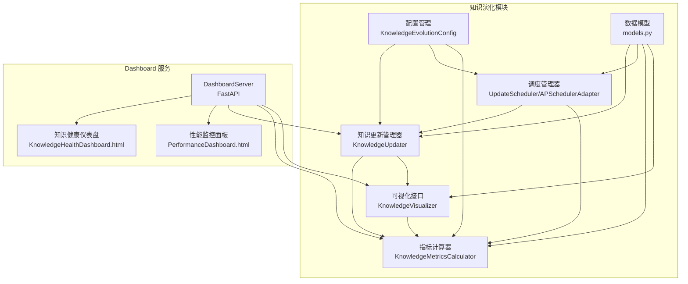
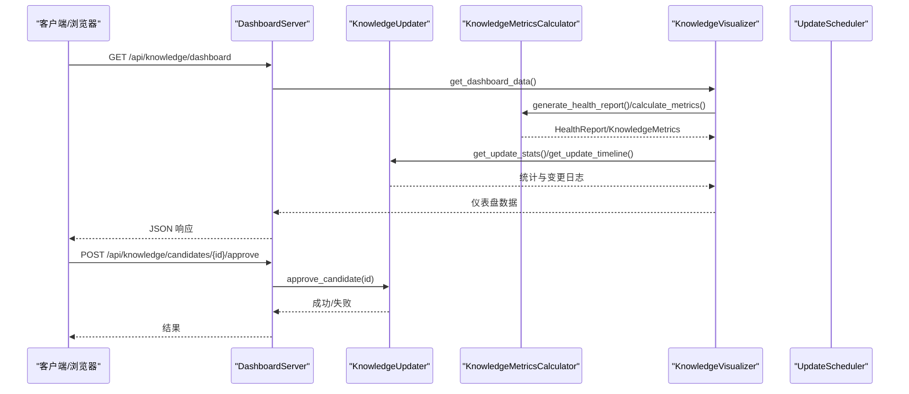
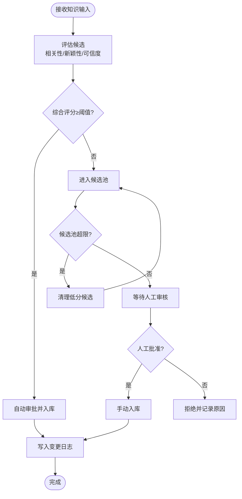
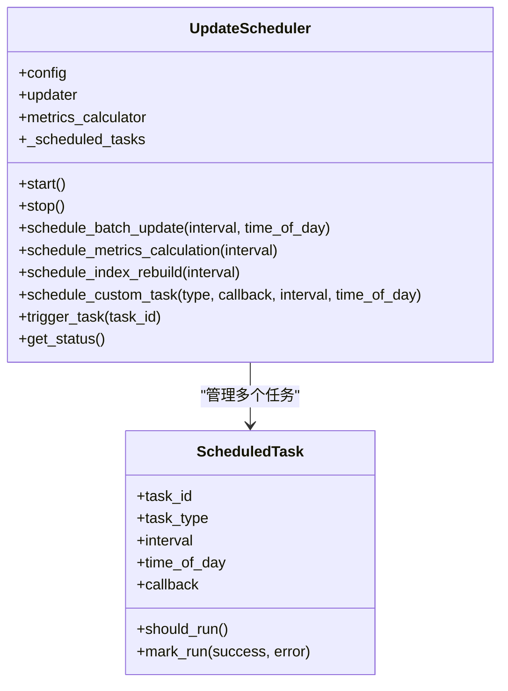
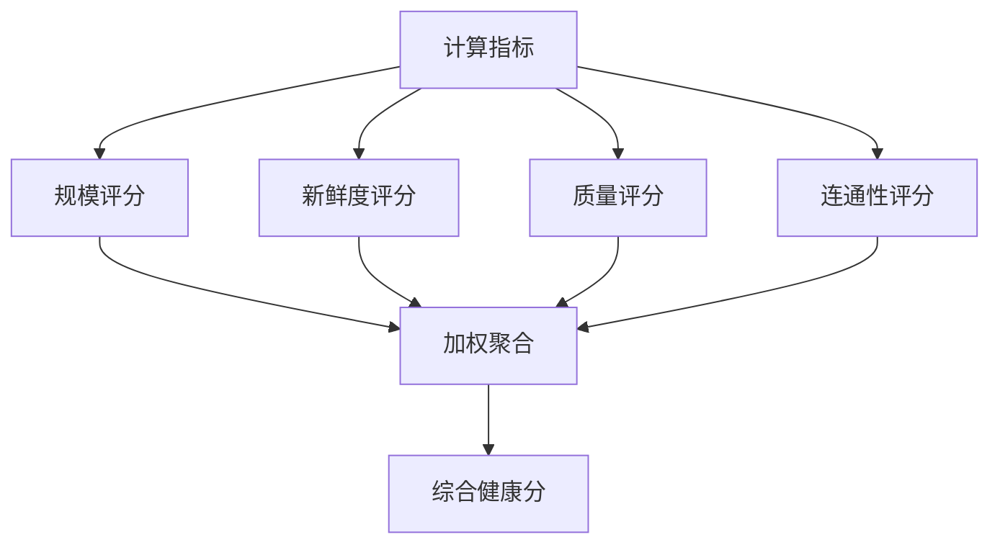
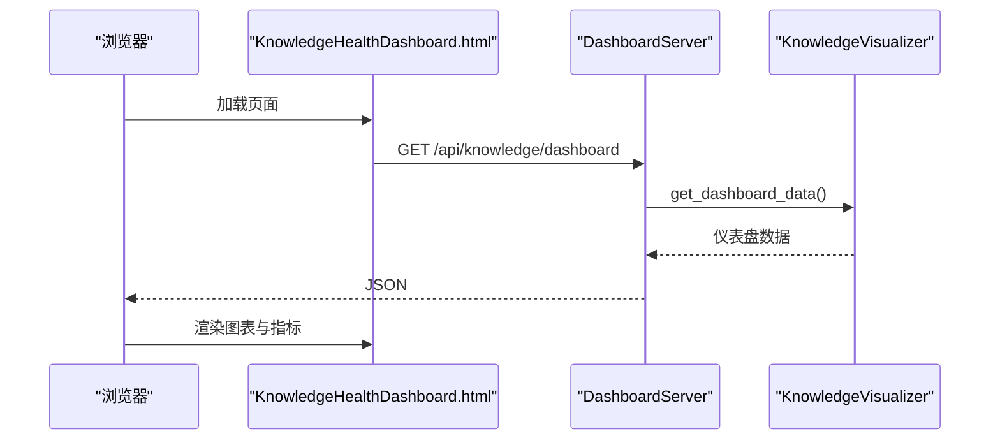
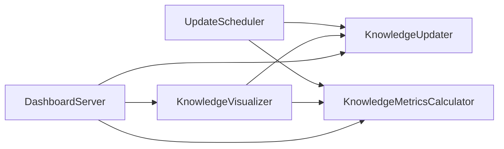

# 知识演化系统

<cite>
**本文档引用的文件**
- [src/knowledge_evolution/__init__.py](file://src/knowledge_evolution/__init__.py)
- [src/knowledge_evolution/updater.py](file://src/knowledge_evolution/updater.py)
- [src/knowledge_evolution/scheduler.py](file://src/knowledge_evolution/scheduler.py)
- [src/knowledge_evolution/metrics.py](file://src/knowledge_evolution/metrics.py)
- [src/knowledge_evolution/models.py](file://src/knowledge_evolution/models.py)
- [src/knowledge_evolution/config.py](file://src/knowledge_evolution/config.py)
- [src/knowledge_evolution/visualizer.py](file://src/knowledge_evolution/visualizer.py)
- [src/dashboard/server.py](file://src/dashboard/server.py)
- [src/dashboard/components/KnowledgeHealthDashboard.html](file://src/dashboard/components/KnowledgeHealthDashboard.html)
- [src/dashboard/components/PerformanceDashboard.html](file://src/dashboard/components/PerformanceDashboard.html)
- [src/dashboard/dashboard.py](file://src/dashboard/dashboard.py)
- [src/dashboard/models.py](file://src/dashboard/models.py)
- [src/dashboard/config_manager.py](file://src/dashboard/config_manager.py)
- [src/dashboard/test_knowledge_health_dashboard.py](file://src/dashboard/test_knowledge_health_dashboard.py)
- [src/dashboard/USAGE_GUIDE.md](file://src/dashboard/USAGE_GUIDE.md)
</cite>

## 目录
1. [简介](#简介)
2. [项目结构](#项目结构)
3. [核心组件](#核心组件)
4. [架构总览](#架构总览)
5. [详细组件分析](#详细组件分析)
6. [依赖关系分析](#依赖关系分析)
7. [性能考量](#性能考量)
8. [故障排查指南](#故障排查指南)
9. [结论](#结论)
10. [附录](#附录)

## 简介
本文件为 NecoRAG 知识演化系统的详细技术文档，聚焦以下目标：
- 解释知识更新管理器的自动化流程与触发条件
- 阐述演化指标监控的评估体系与健康度计算
- 描述调度管理器的执行策略与任务编排
- 详述知识健康度指标、版本管理与变更追踪机制
- 解释可视化仪表板的数据展示与趋势分析算法
- 提供配置管理、性能监控与故障处理机制
- 给出使用示例、监控指标说明与维护指南

## 项目结构
知识演化系统位于 src/knowledge_evolution 目录，配合 dashboard 子系统提供可视化与调试能力。核心模块包括：
- 知识更新管理器：负责候选评估、自动/手动审批、增量更新与变更日志
- 调度管理器：负责定时批量更新、指标计算与索引重建等周期性任务
- 指标计算器：负责知识库健康度与维度指标的计算与报告
- 可视化接口：为前端仪表板提供数据格式与 API
- Dashboard 服务器：提供 REST API 与 Web UI，承载知识演化相关页面

**图表来源**
- [src/knowledge_evolution/__init__.py:56-93](file://src/knowledge_evolution/__init__.py#L56-L93)
- [src/knowledge_evolution/scheduler.py:124-167](file://src/knowledge_evolution/scheduler.py#L124-L167)
- [src/knowledge_evolution/metrics.py:21-64](file://src/knowledge_evolution/metrics.py#L21-L64)
- [src/knowledge_evolution/visualizer.py:18-47](file://src/knowledge_evolution/visualizer.py#L18-L47)
- [src/dashboard/server.py:51-108](file://src/dashboard/server.py#L51-L108)
- [src/dashboard/components/KnowledgeHealthDashboard.html:1-120](file://src/dashboard/components/KnowledgeHealthDashboard.html#L1-L120)

**章节来源**
- [src/knowledge_evolution/__init__.py:1-133](file://src/knowledge_evolution/__init__.py#L1-L133)
- [src/dashboard/server.py:51-108](file://src/dashboard/server.py#L51-L108)

## 核心组件
- 知识更新管理器（KnowledgeUpdater）
  - 候选评估与自动审批、手动审核、批量入库、增量更新（L2/L3）、变更日志与回滚
- 调度管理器（UpdateScheduler/APSchedulerAdapter）
  - 定时批量更新、指标计算、索引重建、任务启停与执行日志
- 指标计算器（KnowledgeMetricsCalculator）
  - 规模、新鲜度、质量、连通性、健康度综合评分与健康报告
- 可视化接口（KnowledgeVisualizer）
  - 仪表盘数据聚合、增长趋势、雷达图、更新时间线、候选统计
- 配置管理（KnowledgeEvolutionConfig）
  - 实时/定时更新开关、阈值、权重、日志与回滚窗口等参数
- Dashboard 服务器与前端组件
  - REST API、WebSocket、Web UI 页面与测试脚本

**章节来源**
- [src/knowledge_evolution/updater.py:24-79](file://src/knowledge_evolution/updater.py#L24-L79)
- [src/knowledge_evolution/scheduler.py:124-167](file://src/knowledge_evolution/scheduler.py#L124-L167)
- [src/knowledge_evolution/metrics.py:21-64](file://src/knowledge_evolution/metrics.py#L21-L64)
- [src/knowledge_evolution/visualizer.py:18-47](file://src/knowledge_evolution/visualizer.py#L18-L47)
- [src/knowledge_evolution/config.py:15-101](file://src/knowledge_evolution/config.py#L15-L101)
- [src/dashboard/server.py:256-334](file://src/dashboard/server.py#L256-L334)

## 架构总览
知识演化系统采用“组件化 + 配置驱动”的架构：
- 组件间通过清晰的接口协作，配置贯穿各模块
- Dashboard 作为统一入口，提供 API 与可视化界面
- 调度器负责周期性任务编排，指标与可视化模块提供观测与决策依据

**图表来源**
- [src/dashboard/server.py:256-334](file://src/dashboard/server.py#L256-L334)
- [src/knowledge_evolution/visualizer.py:49-66](file://src/knowledge_evolution/visualizer.py#L49-L66)
- [src/knowledge_evolution/metrics.py:508-572](file://src/knowledge_evolution/metrics.py#L508-L572)
- [src/knowledge_evolution/updater.py:233-284](file://src/knowledge_evolution/updater.py#L233-L284)

## 详细组件分析

### 知识更新管理器（自动化流程与触发条件）
- 候选评估与自动审批
  - 评估维度：相关性、新颖性、可信度；综合评分加权计算；超过阈值自动审批并实时入库
- 手动审核与批量入库
  - 待审核候选按综合评分排序；支持批准/拒绝；批量任务收集已批准候选统一入库
- 增量更新
  - L2 语义向量增量更新；L3 情景图谱实体/关系增量更新
- 变更日志与回滚
  - 记录 insert/update/delete/archive 操作；支持回滚窗口内回滚
- 查询驱动知识积累
  - 未命中查询记录知识缺口；高质量回答可自动加入候选池

**图表来源**
- [src/knowledge_evolution/updater.py:82-131](file://src/knowledge_evolution/updater.py#L82-L131)
- [src/knowledge_evolution/updater.py:341-357](file://src/knowledge_evolution/updater.py#L341-L357)
- [src/knowledge_evolution/updater.py:409-497](file://src/knowledge_evolution/updater.py#L409-L497)

**章节来源**
- [src/knowledge_evolution/updater.py:82-131](file://src/knowledge_evolution/updater.py#L82-L131)
- [src/knowledge_evolution/updater.py:233-284](file://src/knowledge_evolution/updater.py#L233-L284)
- [src/knowledge_evolution/updater.py:409-497](file://src/knowledge_evolution/updater.py#L409-L497)
- [src/knowledge_evolution/updater.py:501-586](file://src/knowledge_evolution/updater.py#L501-L586)
- [src/knowledge_evolution/updater.py:626-694](file://src/knowledge_evolution/updater.py#L626-L694)
- [src/knowledge_evolution/updater.py:697-794](file://src/knowledge_evolution/updater.py#L697-L794)

### 调度管理器（执行策略与任务编排）
- 任务类型
  - 定时批量更新、指标计算、索引重建、自定义任务
- 执行策略
  - 内置线程轮询调度；支持 APScheduler 适配器（需安装 apscheduler）
  - 任务启停、禁用/启用、移除、立即触发与执行日志
- 默认任务
  - 根据配置自动创建批量更新、索引重建、指标计算任务

**图表来源**
- [src/knowledge_evolution/scheduler.py:124-167](file://src/knowledge_evolution/scheduler.py#L124-L167)
- [src/knowledge_evolution/scheduler.py:21-122](file://src/knowledge_evolution/scheduler.py#L21-L122)

**章节来源**
- [src/knowledge_evolution/scheduler.py:124-167](file://src/knowledge_evolution/scheduler.py#L124-L167)
- [src/knowledge_evolution/scheduler.py:169-245](file://src/knowledge_evolution/scheduler.py#L169-L245)
- [src/knowledge_evolution/scheduler.py:281-320](file://src/knowledge_evolution/scheduler.py#L281-L320)
- [src/knowledge_evolution/scheduler.py:321-394](file://src/knowledge_evolution/scheduler.py#L321-L394)
- [src/knowledge_evolution/scheduler.py:536-554](file://src/knowledge_evolution/scheduler.py#L536-L554)

### 演化指标监控（健康度与评估体系）
- 指标维度
  - 规模：总条目、L1/L2/L3 数量、向量覆盖率
  - 新鲜度：平均年龄、近7天更新率、最老/最新条目
  - 质量：检索命中率、平均相关性评分
  - 连通性：图谱碎片率、冗余度
  - 健康度：综合评分（加权聚合）
- 报告与建议
  - 健康报告包含维度评分、警告与优化建议
- 历史与趋势
  - 指标历史、增长趋势（日粒度）、查询统计

**图表来源**
- [src/knowledge_evolution/metrics.py:413-446](file://src/knowledge_evolution/metrics.py#L413-L446)
- [src/knowledge_evolution/metrics.py:448-506](file://src/knowledge_evolution/metrics.py#L448-L506)

**章节来源**
- [src/knowledge_evolution/metrics.py:66-134](file://src/knowledge_evolution/metrics.py#L66-L134)
- [src/knowledge_evolution/metrics.py:508-572](file://src/knowledge_evolution/metrics.py#L508-L572)
- [src/knowledge_evolution/metrics.py:625-669](file://src/knowledge_evolution/metrics.py#L625-L669)
- [src/knowledge_evolution/metrics.py:671-702](file://src/knowledge_evolution/metrics.py#L671-L702)

### 可视化仪表板（数据展示与趋势分析）
- 仪表盘组件
  - 健康度仪表盘（分数、等级、维度雷达图）
  - 关键指标卡（总知识量、今日新增、平均新鲜度）
  - 增长趋势图（日粒度）
  - 更新时间线（变更日志）
  - 候选统计（来源分布）
- 前端实现
  - HTML + JavaScript，定时拉取 API 数据，SVG 绘制图表
- Dashboard API
  - 提供知识库指标、健康报告、仪表盘数据、增长趋势、时间线、候选列表等接口

**图表来源**
- [src/dashboard/components/KnowledgeHealthDashboard.html:593-624](file://src/dashboard/components/KnowledgeHealthDashboard.html#L593-L624)
- [src/dashboard/server.py:272-277](file://src/dashboard/server.py#L272-L277)
- [src/knowledge_evolution/visualizer.py:49-66](file://src/knowledge_evolution/visualizer.py#L49-L66)

**章节来源**
- [src/dashboard/components/KnowledgeHealthDashboard.html:1-120](file://src/dashboard/components/KnowledgeHealthDashboard.html#L1-L120)
- [src/dashboard/components/KnowledgeHealthDashboard.html:593-624](file://src/dashboard/components/KnowledgeHealthDashboard.html#L593-L624)
- [src/dashboard/server.py:256-334](file://src/dashboard/server.py#L256-L334)
- [src/knowledge_evolution/visualizer.py:49-113](file://src/knowledge_evolution/visualizer.py#L49-L113)

### 配置管理（策略与参数）
- 预设策略
  - 默认、积极、保守、最小配置；分别调整阈值、频率与功能开关
- 关键参数
  - 实时/定时更新开关、阈值、候选池容量、变更日志与回滚窗口、指标计算间隔、权重等
- 配置校验
  - 阈值范围、逻辑一致性、权重和校验

**章节来源**
- [src/knowledge_evolution/config.py:94-166](file://src/knowledge_evolution/config.py#L94-L166)
- [src/knowledge_evolution/config.py:168-214](file://src/knowledge_evolution/config.py#L168-L214)

### 版本管理与变更追踪
- 变更日志
  - 记录 insert/update/delete/archive 操作，支持回滚标记
- 回滚机制
  - 基于时间窗口与日志 ID 的回滚流程（预留实现）

**章节来源**
- [src/knowledge_evolution/updater.py:588-624](file://src/knowledge_evolution/updater.py#L588-L624)
- [src/knowledge_evolution/updater.py:626-694](file://src/knowledge_evolution/updater.py#L626-L694)

### 性能监控与故障处理
- Dashboard 性能面板
  - CPU/内存/响应时间/吞吐量/错误率等指标，WebSocket 实时推送
- 故障处理
  - 调度器异常捕获与日志记录；指标计算缓存与历史限制；可视化降级默认数据

**章节来源**
- [src/dashboard/components/PerformanceDashboard.html:1-120](file://src/dashboard/components/PerformanceDashboard.html#L1-L120)
- [src/dashboard/components/PerformanceDashboard.html:310-451](file://src/dashboard/components/PerformanceDashboard.html#L310-L451)
- [src/knowledge_evolution/metrics.py:64-64](file://src/knowledge_evolution/metrics.py#L64-L64)
- [src/knowledge_evolution/visualizer.py:114-130](file://src/knowledge_evolution/visualizer.py#L114-L130)

## 依赖关系分析
- 组件耦合
  - UpdateScheduler 依赖 KnowledgeUpdater 与 KnowledgeMetricsCalculator
  - KnowledgeVisualizer 依赖 KnowledgeMetricsCalculator 与 KnowledgeUpdater
  - DashboardServer 依赖上述模块并通过 API 暴露
- 外部依赖
  - APScheduler（可选）用于生产级调度
  - FastAPI/uvicorn 提供 API 与 WebSocket

**图表来源**
- [src/knowledge_evolution/scheduler.py:124-167](file://src/knowledge_evolution/scheduler.py#L124-L167)
- [src/knowledge_evolution/visualizer.py:29-47](file://src/knowledge_evolution/visualizer.py#L29-L47)
- [src/dashboard/server.py:100-108](file://src/dashboard/server.py#L100-L108)

**章节来源**
- [src/knowledge_evolution/scheduler.py:124-167](file://src/knowledge_evolution/scheduler.py#L124-L167)
- [src/knowledge_evolution/visualizer.py:29-47](file://src/knowledge_evolution/visualizer.py#L29-L47)
- [src/dashboard/server.py:100-108](file://src/dashboard/server.py#L100-L108)

## 性能考量
- 指标计算缓存
  - 指标结果带 TTL 缓存，减少重复计算
- 日志与历史限制
  - 变更日志与指标历史数量限制，避免内存膨胀
- 候选池清理
  - 超限时按评分清理低分候选，维持池容量
- 增量更新
  - L2/L3 增量更新降低全量更新成本

**章节来源**
- [src/knowledge_evolution/metrics.py:60-62](file://src/knowledge_evolution/metrics.py#L60-L62)
- [src/knowledge_evolution/updater.py:341-357](file://src/knowledge_evolution/updater.py#L341-L357)
- [src/knowledge_evolution/updater.py:501-586](file://src/knowledge_evolution/updater.py#L501-L586)

## 故障排查指南
- Dashboard 页面无法加载
  - 检查 DashboardServer 是否启动、端口占用与静态资源路径
- 知识库 API 返回错误
  - 确认 NecoRAG 实例已注入 DashboardServer；检查知识演化模块初始化
- 调度任务未执行
  - 检查调度器状态、任务启用状态与下次执行时间；查看执行日志
- 指标计算异常
  - 关闭缓存强制刷新；检查内存管理器接口兼容性
- 仪表盘数据为空
  - 确认知识积累功能开启；检查查询日志与候选池状态

**章节来源**
- [src/dashboard/server.py:544-557](file://src/dashboard/server.py#L544-L557)
- [src/dashboard/server.py:256-334](file://src/dashboard/server.py#L256-L334)
- [src/knowledge_evolution/scheduler.py:321-394](file://src/knowledge_evolution/scheduler.py#L321-L394)
- [src/knowledge_evolution/metrics.py:66-80](file://src/knowledge_evolution/metrics.py#L66-L80)
- [src/knowledge_evolution/visualizer.py:114-130](file://src/knowledge_evolution/visualizer.py#L114-L130)

## 结论
知识演化系统通过“候选评估—自动/手动审批—批量入库—指标计算—可视化呈现—调度编排”的闭环，实现了知识库的持续进化与可观测性。配置驱动的设计使得策略可插拔，Dashboard 提供了直观的运营与运维入口。建议在生产环境引入 APScheduler 与完善的监控告警体系，并结合业务场景优化阈值与权重。

## 附录

### 使用示例
- 启动 Dashboard
  - [启动命令示例:26-56](file://src/dashboard/USAGE_GUIDE.md#L26-L56)
- 访问知识健康仪表盘
  - [访问地址:405-413](file://src/dashboard/server.py#L405-L413)
- 通过 API 审批候选
  - [API 示例:304-326](file://src/dashboard/server.py#L304-L326)

**章节来源**
- [src/dashboard/USAGE_GUIDE.md:26-56](file://src/dashboard/USAGE_GUIDE.md#L26-L56)
- [src/dashboard/server.py:405-413](file://src/dashboard/server.py#L405-L413)
- [src/dashboard/server.py:304-326](file://src/dashboard/server.py#L304-L326)

### 监控指标说明
- 健康度指标
  - 规模、新鲜度、质量、连通性四维加权得分
- 增长趋势
  - 日粒度总条目、新增、删除、净增长
- 查询统计
  - 今日查询总量、命中/未命中数量、平均置信度与延迟

**章节来源**
- [src/knowledge_evolution/metrics.py:194-272](file://src/knowledge_evolution/metrics.py#L194-L272)
- [src/knowledge_evolution/metrics.py:637-669](file://src/knowledge_evolution/metrics.py#L637-L669)
- [src/knowledge_evolution/metrics.py:671-702](file://src/knowledge_evolution/metrics.py#L671-L702)

### 维护指南
- 配置管理
  - 使用 ConfigManager 管理 Profile，支持导入/导出/复制/切换
- Dashboard 测试
  - 仪表盘功能完整性测试脚本
- 性能面板
  - 实时监控与 WebSocket 推送，支持启停与刷新

**章节来源**
- [src/dashboard/config_manager.py:14-41](file://src/dashboard/config_manager.py#L14-L41)
- [src/dashboard/test_knowledge_health_dashboard.py:14-137](file://src/dashboard/test_knowledge_health_dashboard.py#L14-L137)
- [src/dashboard/components/PerformanceDashboard.html:310-451](file://src/dashboard/components/PerformanceDashboard.html#L310-L451)