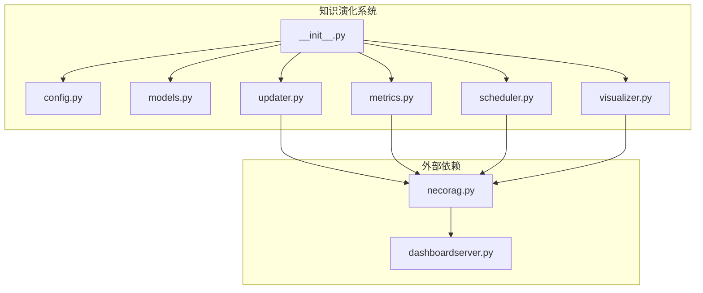
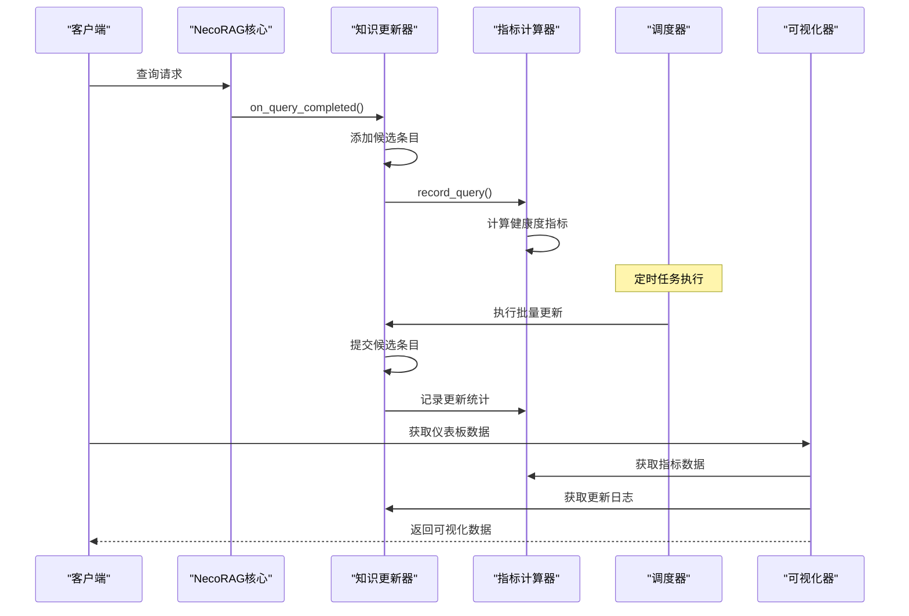
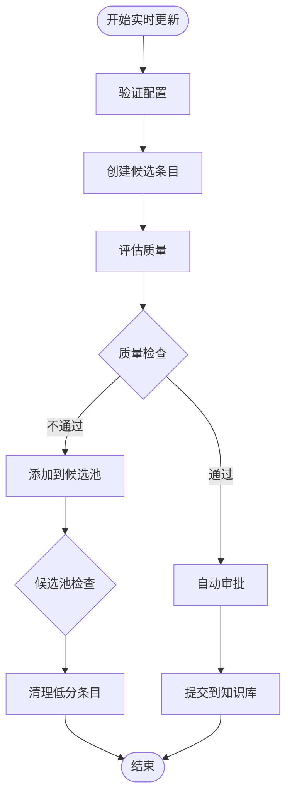
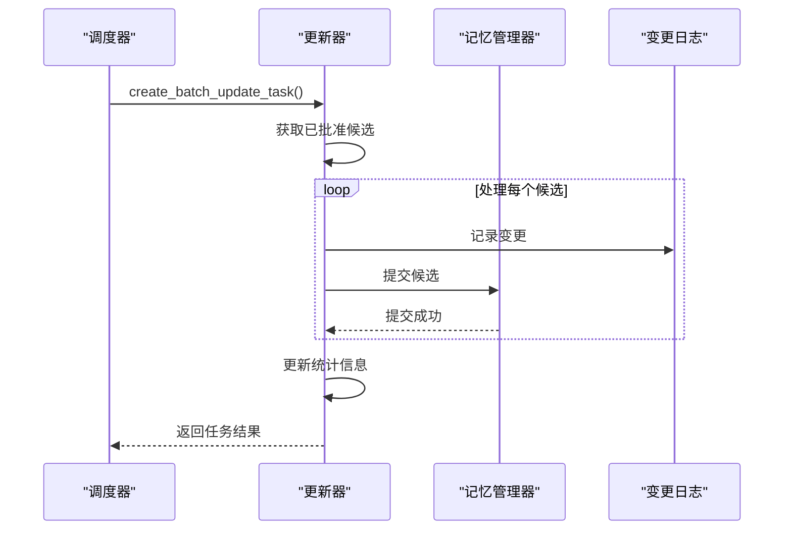
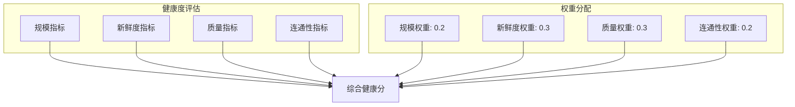
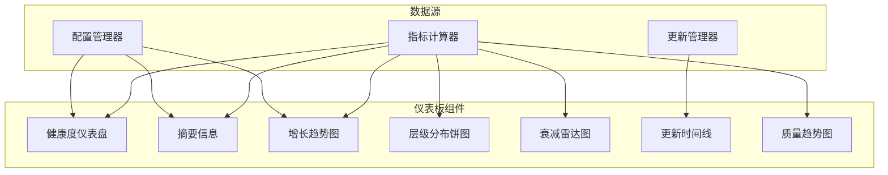
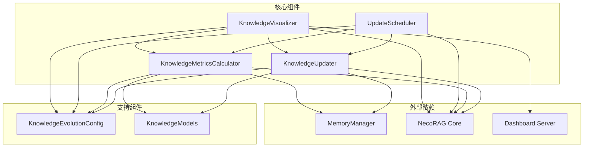

# 知识演化系统

<cite>
**本文档引用的文件**
- [src/knowledge_evolution/__init__.py](file://src/knowledge_evolution/__init__.py)
- [src/knowledge_evolution/config.py](file://src/knowledge_evolution/config.py)
- [src/knowledge_evolution/metrics.py](file://src/knowledge_evolution/metrics.py)
- [src/knowledge_evolution/models.py](file://src/knowledge_evolution/models.py)
- [src/knowledge_evolution/scheduler.py](file://src/knowledge_evolution/scheduler.py)
- [src/knowledge_evolution/updater.py](file://src/knowledge_evolution/updater.py)
- [src/knowledge_evolution/visualizer.py](file://src/knowledge_evolution/visualizer.py)
- [src/necorag.py](file://src/necorag.py)
- [src/dashboard/server.py](file://src/dashboard/server.py)
- [src/dashboard/models.py](file://src/dashboard/models.py)
- [README.md](file://README.md)
</cite>

## 目录
1. [简介](#简介)
2. [项目结构](#项目结构)
3. [核心组件](#核心组件)
4. [架构概览](#架构概览)
5. [详细组件分析](#详细组件分析)
6. [依赖关系分析](#依赖关系分析)
7. [性能考量](#性能考量)
8. [故障排除指南](#故障排除指南)
9. [结论](#结论)
10. [附录](#附录)

## 简介
知识演化系统是 NecoRAG 框架中的核心模块，负责知识库的持续更新、演化和健康度监控。该系统实现了查询驱动的知识积累、实时更新与定时批量更新的双重策略，并提供了全面的健康监控指标和可视化仪表板。

## 项目结构
知识演化系统位于 `src/knowledge_evolution/` 目录下，包含以下核心文件：
- `__init__.py`: 模块入口和便捷函数
- `config.py`: 配置管理类
- `models.py`: 数据模型定义
- `updater.py`: 知识更新管理器
- `metrics.py`: 指标计算器
- `scheduler.py`: 任务调度器
- `visualizer.py`: 可视化数据接口

**图表来源**
- [src/knowledge_evolution/__init__.py:1-133](file://src/knowledge_evolution/__init__.py#L1-L133)
- [src/necorag.py:24-31](file://src/necorag.py#L24-L31)

**章节来源**
- [src/knowledge_evolution/__init__.py:1-133](file://src/knowledge_evolution/__init__.py#L1-L133)
- [README.md:1-678](file://README.md#L1-L678)

## 核心组件
知识演化系统由六个核心组件构成，每个组件都有明确的职责分工：

### 配置管理器
负责管理知识演化系统的各种配置参数，包括实时更新阈值、定时更新间隔、健康度权重等。

### 数据模型层
定义了知识演化过程中使用的核心数据结构，包括候选条目、更新任务、变更日志、健康报告等。

### 更新管理器
实现知识的实时更新和批量更新功能，维护候选池和变更日志。

### 指标计算器
持续计算知识库的健康度指标，提供综合评分和维度报告。

### 调度器
管理定时任务的调度执行，支持间隔调度和定时调度。

### 可视化接口
为 Dashboard 提供数据格式，支持健康度仪表板、增长曲线、热力图等可视化展示。

**章节来源**
- [src/knowledge_evolution/config.py:15-222](file://src/knowledge_evolution/config.py#L15-L222)
- [src/knowledge_evolution/models.py:14-367](file://src/knowledge_evolution/models.py#L14-L367)
- [src/knowledge_evolution/updater.py:23-854](file://src/knowledge_evolution/updater.py#L23-L854)
- [src/knowledge_evolution/metrics.py:20-724](file://src/knowledge_evolution/metrics.py#L20-L724)
- [src/knowledge_evolution/scheduler.py:124-688](file://src/knowledge_evolution/scheduler.py#L124-L688)
- [src/knowledge_evolution/visualizer.py:18-599](file://src/knowledge_evolution/visualizer.py#L18-L599)

## 架构概览
知识演化系统采用分层架构设计，各组件之间通过清晰的接口进行交互：

**图表来源**
- [src/necorag.py:423-447](file://src/necorag.py#L423-L447)
- [src/knowledge_evolution/updater.py:687-747](file://src/knowledge_evolution/updater.py#L687-L747)
- [src/knowledge_evolution/metrics.py:573-601](file://src/knowledge_evolution/metrics.py#L573-L601)
- [src/knowledge_evolution/scheduler.py:281-320](file://src/knowledge_evolution/scheduler.py#L281-L320)
- [src/knowledge_evolution/visualizer.py:49-66](file://src/knowledge_evolution/visualizer.py#L49-L66)

## 详细组件分析

### 配置系统分析
配置系统提供了灵活的参数管理机制，支持多种预设配置和自定义配置。

#### 配置类型
系统支持四种主要配置类型：
- **默认配置**: 标准平衡策略
- **积极配置**: 低阈值、高频更新
- **保守配置**: 高阈值、低频更新
- **最小配置**: 仅启用核心功能

#### 关键配置参数
- **实时更新配置**: 质量阈值、候选池大小、自动审批阈值
- **定时更新配置**: 批量更新间隔、索引重建间隔
- **健康度权重**: 规模、新鲜度、质量、连通性权重
- **评分权重**: 相关性、新颖性、可信度权重

**章节来源**
- [src/knowledge_evolution/config.py:15-222](file://src/knowledge_evolution/config.py#L15-L222)

### 更新机制分析
知识演化系统实现了两种更新模式：实时更新和定时批量更新。

#### 实时更新流程

**图表来源**
- [src/knowledge_evolution/updater.py:360-403](file://src/knowledge_evolution/updater.py#L360-L403)
- [src/knowledge_evolution/updater.py:340-357](file://src/knowledge_evolution/updater.py#L340-L357)

#### 批量更新流程
批量更新通过调度器定期执行，处理候选池中的已批准条目：

**图表来源**
- [src/knowledge_evolution/scheduler.py:281-299](file://src/knowledge_evolution/scheduler.py#L281-L299)
- [src/knowledge_evolution/updater.py:406-491](file://src/knowledge_evolution/updater.py#L406-L491)

**章节来源**
- [src/knowledge_evolution/updater.py:358-491](file://src/knowledge_evolution/updater.py#L358-L491)
- [src/knowledge_evolution/scheduler.py:169-246](file://src/knowledge_evolution/scheduler.py#L169-L246)

### 健康监控指标分析
健康监控系统提供了全面的知识库质量评估机制，包含多个维度的指标计算。

#### 指标计算维度
系统从四个主要维度评估知识库健康度：

**图表来源**
- [src/knowledge_evolution/metrics.py:412-446](file://src/knowledge_evolution/metrics.py#L412-L446)

#### 关键指标说明
- **规模指标**: 总条目数、各层级分布、向量覆盖率
- **新鲜度指标**: 平均知识年龄、近期更新率、最老/最新条目
- **质量指标**: 检索命中率、碎片率、平均相关性评分
- **连通性指标**: 权重分布、冗余度

**章节来源**
- [src/knowledge_evolution/metrics.py:194-273](file://src/knowledge_evolution/metrics.py#L194-L273)
- [src/knowledge_evolution/metrics.py:412-506](file://src/knowledge_evolution/metrics.py#L412-L506)

### 调度器配置分析
调度器支持灵活的任务调度策略，包括间隔调度和定时调度。

#### 调度策略
- **间隔调度**: 基于固定时间间隔的任务执行
- **定时调度**: 每日固定时间点的任务执行
- **自定义任务**: 支持用户自定义任务类型

#### 任务类型
系统预定义了三种核心任务：
- **批量更新任务**: 定期执行知识库批量更新
- **索引重建任务**: 定期重建向量索引
- **指标计算任务**: 定期计算健康度指标

**章节来源**
- [src/knowledge_evolution/scheduler.py:21-122](file://src/knowledge_evolution/scheduler.py#L21-L122)
- [src/knowledge_evolution/scheduler.py:169-246](file://src/knowledge_evolution/scheduler.py#L169-L246)

### 可视化仪表板分析
可视化系统为 Dashboard 提供了丰富的数据接口，支持多种图表类型的展示。

#### 仪表板组件
系统提供了七个主要的可视化组件：

**图表来源**
- [src/knowledge_evolution/visualizer.py:49-66](file://src/knowledge_evolution/visualizer.py#L49-L66)

#### 数据接口
每个组件都提供了专门的数据接口：
- `get_health_gauge()`: 健康度仪表盘数据
- `get_growth_chart_data()`: 知识增长趋势数据
- `get_layer_distribution()`: 层级分布数据
- `get_update_timeline()`: 更新时间线数据

**章节来源**
- [src/knowledge_evolution/visualizer.py:49-599](file://src/knowledge_evolution/visualizer.py#L49-L599)

## 依赖关系分析

### 组件间依赖关系
知识演化系统内部组件之间的依赖关系如下：

**图表来源**
- [src/knowledge_evolution/__init__.py:12-53](file://src/knowledge_evolution/__init__.py#L12-L53)
- [src/necorag.py:139-156](file://src/necorag.py#L139-L156)

### 外部依赖分析
系统对外部组件的依赖主要体现在以下几个方面：

1. **记忆管理器集成**: 通过 `memory_manager` 接口访问知识库存储
2. **NecoRAG核心集成**: 通过 `NecoRAG` 类提供统一的 API 接口
3. **Dashboard集成**: 通过 RESTful API 为可视化提供数据支持

**章节来源**
- [src/knowledge_evolution/updater.py:46-47](file://src/knowledge_evolution/updater.py#L46-L47)
- [src/knowledge_evolution/metrics.py:42-43](file://src/knowledge_evolution/metrics.py#L42-L43)
- [src/knowledge_evolution/scheduler.py:152-154](file://src/knowledge_evolution/scheduler.py#L152-L154)

## 性能考量
知识演化系统在设计时充分考虑了性能优化，主要体现在以下几个方面：

### 缓存机制
- **指标缓存**: 指标计算结果缓存，默认缓存有效期 60 秒
- **候选池管理**: 自动清理低质量候选条目，控制内存使用
- **查询日志限制**: 限制查询日志大小，防止内存泄漏

### 异步处理
- **调度器线程**: 使用后台线程执行定时任务，不影响主线程性能
- **批量处理**: 批量更新任务异步执行，避免阻塞系统响应

### 资源管理
- **内存池管理**: 候选池大小限制，防止内存溢出
- **日志轮转**: 变更日志和查询日志大小限制
- **统计信息**: 提供详细的性能统计信息

## 故障排除指南

### 常见问题诊断
1. **知识库为空**
   - 检查配置中的 `enable_query_driven_accumulation` 设置
   - 确认查询驱动知识积累功能已启用
   - 验证 `min_answer_confidence` 阈值设置

2. **更新失败**
   - 检查候选条目的质量评分是否达到阈值
   - 确认记忆管理器配置正确
   - 查看变更日志获取错误信息

3. **调度器不工作**
   - 确认调度器已启动
   - 检查任务配置的有效性
   - 验证回调函数的正确性

### 性能优化建议
1. **调整更新频率**
   - 根据业务需求调整批量更新间隔
   - 优化候选池大小配置
   - 调整质量阈值平衡

2. **监控系统健康度**
   - 定期检查健康度指标
   - 关注碎片率和冗余度变化
   - 监控检索命中率趋势

3. **配置调优**
   - 根据数据特点调整权重分配
   - 优化缓存配置
   - 调整日志记录级别

**章节来源**
- [src/knowledge_evolution/metrics.py:507-571](file://src/knowledge_evolution/metrics.py#L507-L571)
- [src/knowledge_evolution/scheduler.py:321-394](file://src/knowledge_evolution/scheduler.py#L321-L394)

## 结论
知识演化系统通过精心设计的架构和完善的监控机制，为 NecoRAG 框架提供了强大的知识管理能力。系统支持实时更新和定时批量更新两种策略，能够根据不同的业务场景灵活配置。全面的健康监控指标和可视化仪表板使得知识库的状态管理变得直观和可控。

通过合理的配置和调优，用户可以根据实际需求优化知识演化效果，确保知识库始终保持良好的健康状态和高效的运行性能。

## 附录

### 配置最佳实践
1. **生产环境配置**
   - 使用保守配置策略
   - 启用完整的健康监控
   - 设置合适的更新频率

2. **开发环境配置**
   - 使用默认配置便于测试
   - 减少指标计算频率
   - 启用详细日志记录

3. **性能调优**
   - 根据硬件资源调整候选池大小
   - 优化质量阈值设置
   - 调整缓存配置参数

### API 使用示例
系统提供了丰富的 API 接口，支持知识库的完整生命周期管理：

- `update_knowledge()`: 更新知识到知识库
- `get_knowledge_metrics()`: 获取知识库指标
- `get_health_report()`: 获取健康报告
- `get_pending_candidates()`: 获取待审核候选
- `approve_candidate()`: 批准候选条目
- `reject_candidate()`: 拒绝候选条目

**章节来源**
- [src/necorag.py:504-654](file://src/necorag.py#L504-L654)
- [src/dashboard/server.py:249-327](file://src/dashboard/server.py#L249-L327)