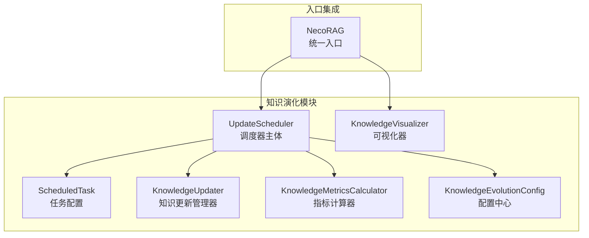
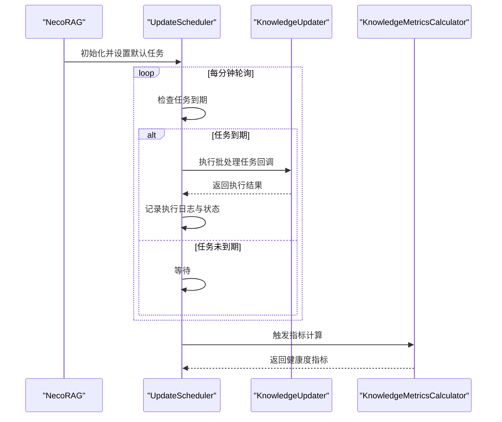
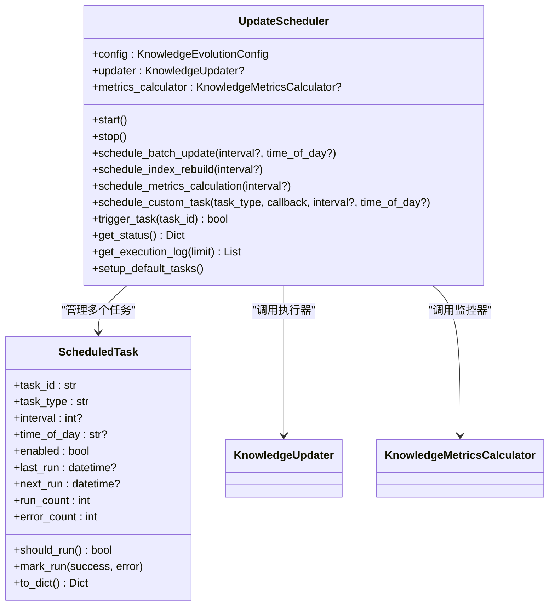
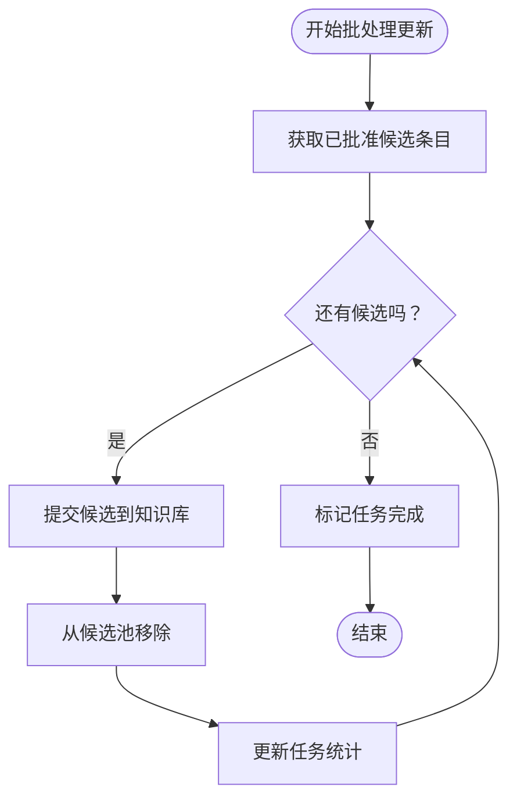
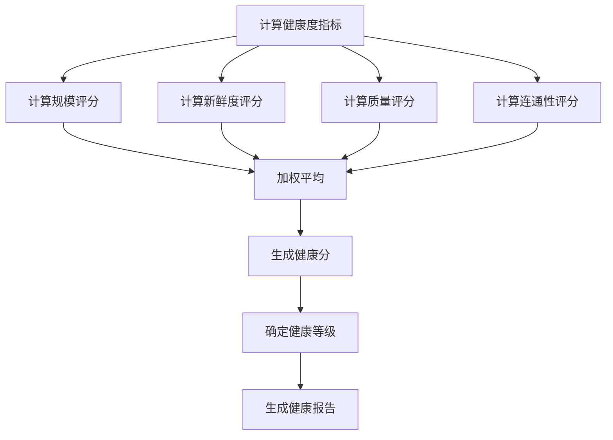
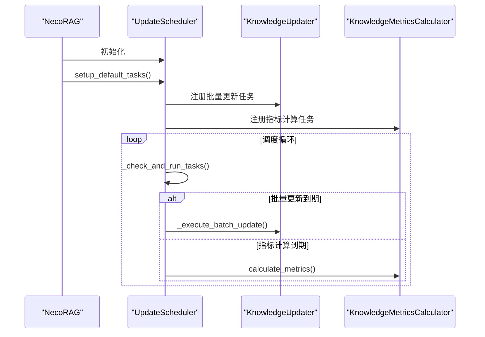
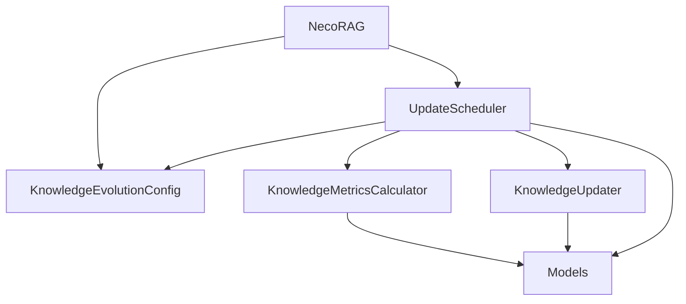

# 调度管理器

<cite>
**本文档引用的文件**
- [scheduler.py](file://src/knowledge_evolution/scheduler.py)
- [updater.py](file://src/knowledge_evolution/updater.py)
- [config.py](file://src/knowledge_evolution/config.py)
- [models.py](file://src/knowledge_evolution/models.py)
- [metrics.py](file://src/knowledge_evolution/metrics.py)
- [necorag.py](file://src/necorag.py)
- [config.py](file://src/core/config.py)
</cite>

## 目录
1. [简介](#简介)
2. [项目结构](#项目结构)
3. [核心组件](#核心组件)
4. [架构总览](#架构总览)
5. [详细组件分析](#详细组件分析)
6. [依赖关系分析](#依赖关系分析)
7. [性能考量](#性能考量)
8. [故障排查指南](#故障排查指南)
9. [结论](#结论)
10. [附录](#附录)

## 简介
本文件面向知识演化调度管理器，系统性阐述定时任务的调度策略与执行机制，涵盖批处理任务的创建、状态管理与执行监控；深入解析调度器配置项（执行频率、优先级、并发控制等）；展示任务队列管理（排队、优先级排序、资源分配策略）；阐明调度器与知识更新流程的集成方式（自动触发与手动干预）；并提供任务生命周期管理与故障恢复策略。该调度器支持实时更新与批量更新两种模式，提供健康度监控与可视化能力，帮助开发者构建可靠的自动化知识更新系统。

## 项目结构
调度管理器位于知识演化模块中，围绕以下核心文件组织：
- 调度器主体：UpdateScheduler 与 ScheduledTask
- 知识更新管理：KnowledgeUpdater（负责批处理任务的实际执行）
- 指标计算：KnowledgeMetricsCalculator（定期计算健康度指标）
- 配置：KnowledgeEvolutionConfig（调度与更新策略的配置来源）
- 数据模型：UpdateTask、UpdateStatus、KnowledgeSource 等
- 入口集成：NecoRAG 统一入口类，负责初始化与启动调度器

**图表来源**
- [scheduler.py:124-555](file://src/knowledge_evolution/scheduler.py#L124-L555)
- [updater.py:23-800](file://src/knowledge_evolution/updater.py#L23-L800)
- [metrics.py:20-724](file://src/knowledge_evolution/metrics.py#L20-L724)
- [config.py:16-222](file://src/knowledge_evolution/config.py#L16-L222)
- [necorag.py:135-172](file://src/necorag.py#L135-L172)

**章节来源**
- [scheduler.py:21-122](file://src/knowledge_evolution/scheduler.py#L21-L122)
- [scheduler.py:124-555](file://src/knowledge_evolution/scheduler.py#L124-L555)
- [updater.py:23-800](file://src/knowledge_evolution/updater.py#L23-L800)
- [metrics.py:20-724](file://src/knowledge_evolution/metrics.py#L20-L724)
- [config.py:16-222](file://src/knowledge_evolution/config.py#L16-L222)
- [necorag.py:135-172](file://src/necorag.py#L135-L172)

## 核心组件
- ScheduledTask：封装单个调度任务的配置与状态，包括任务类型、执行周期、回调函数、启用状态、最近/下次执行时间、执行次数与错误计数等。
- UpdateScheduler：调度器主体，负责注册任务、轮询到期任务、执行回调、记录执行日志与状态统计，并提供启停、手动触发、任务管理等接口。
- KnowledgeUpdater：批处理任务的实际执行者，负责创建与执行 UpdateTask，提交候选条目到知识库，维护变更日志与统计信息。
- KnowledgeMetricsCalculator：定期计算知识库健康度指标，支持缓存与历史记录，为调度器提供健康度监控。
- KnowledgeEvolutionConfig：集中定义调度与更新策略的配置项，如批量更新间隔、定时时间、变更日志开关、回滚窗口、健康度阈值等。
- 数据模型：UpdateTask、UpdateStatus、KnowledgeSource 等，支撑任务状态与数据流转。

**章节来源**
- [scheduler.py:21-122](file://src/knowledge_evolution/scheduler.py#L21-L122)
- [scheduler.py:124-555](file://src/knowledge_evolution/scheduler.py#L124-L555)
- [updater.py:23-800](file://src/knowledge_evolution/updater.py#L23-L800)
- [metrics.py:20-724](file://src/knowledge_evolution/metrics.py#L20-L724)
- [config.py:16-222](file://src/knowledge_evolution/config.py#L16-L222)
- [models.py:14-367](file://src/knowledge_evolution/models.py#L14-L367)

## 架构总览
调度管理器采用"调度器 + 执行器 + 监控器"的分层架构：
- 调度器：UpdateScheduler 负责任务注册、到期判断、执行与日志记录。
- 执行器：KnowledgeUpdater 负责批处理任务的具体执行，包括候选条目入库、变更日志记录与统计更新。
- 监控器：KnowledgeMetricsCalculator 负责健康度指标计算与报告生成，支持缓存与历史趋势。
- 配置中心：KnowledgeEvolutionConfig 提供统一配置，支持默认、积极、保守与最小配置策略。

**图表来源**
- [necorag.py:135-172](file://src/necorag.py#L135-L172)
- [scheduler.py:321-381](file://src/knowledge_evolution/scheduler.py#L321-L381)
- [scheduler.py:281-320](file://src/knowledge_evolution/scheduler.py#L281-L320)
- [metrics.py:65-134](file://src/knowledge_evolution/metrics.py#L65-L134)

## 详细组件分析

### 调度器与任务模型
- ScheduledTask：封装任务配置与状态，支持间隔调度与每日定时两种模式；提供 should_run 判断与 mark_run 状态更新。
- UpdateScheduler：提供 schedule_batch_update、schedule_index_rebuild、schedule_metrics_calculation、schedule_custom_task 等任务注册接口；内部通过轮询线程每分钟检查一次到期任务；支持手动触发、启停、任务管理与状态查询。

**图表来源**
- [scheduler.py:21-122](file://src/knowledge_evolution/scheduler.py#L21-L122)
- [scheduler.py:124-555](file://src/knowledge_evolution/scheduler.py#L124-L555)

**章节来源**
- [scheduler.py:21-122](file://src/knowledge_evolution/scheduler.py#L21-L122)
- [scheduler.py:124-555](file://src/knowledge_evolution/scheduler.py#L124-L555)

### 知识更新与批处理执行
- 实时更新：支持即时质量评估与自动审批，符合阈值的候选可直接入库。
- 批处理更新：通过创建 UpdateTask 批量处理候选池中的条目，逐条提交并记录变更日志。
- 增量更新：支持 L2 语义向量增量更新与 L3 情景图谱增量更新。

**图表来源**
- [updater.py:406-491](file://src/knowledge_evolution/updater.py#L406-L491)

**章节来源**
- [updater.py:23-800](file://src/knowledge_evolution/updater.py#L23-L800)

### 指标计算与健康度监控
- 健康度指标：包括规模、新鲜度、质量、连通性四个维度，综合计算健康分。
- 健康报告：根据健康分生成等级（healthy/warning/critical）与改进建议。
- 历史记录：支持指标历史与增长趋势分析。

**图表来源**
- [metrics.py:412-506](file://src/knowledge_evolution/metrics.py#L412-L506)
- [metrics.py:507-571](file://src/knowledge_evolution/metrics.py#L507-L571)

**章节来源**
- [metrics.py:65-134](file://src/knowledge_evolution/metrics.py#L65-L134)
- [metrics.py:412-506](file://src/knowledge_evolution/metrics.py#L412-L506)
- [metrics.py:507-571](file://src/knowledge_evolution/metrics.py#L507-L571)

### 配置选项与策略
- 批量更新：支持按秒间隔或每日固定时间触发；可通过配置调整间隔与时间。
- 指标计算：支持按秒间隔触发健康度计算。
- 变更日志与回滚：支持开启变更日志与回滚窗口，保障数据安全。
- 查询驱动知识积累：支持基于查询结果的质量阈值与证据数量，自动将高质量回答加入候选池。

**章节来源**
- [config.py:29-68](file://src/knowledge_evolution/config.py#L29-L68)
- [scheduler.py:169-245](file://src/knowledge_evolution/scheduler.py#L169-L245)

### 任务队列管理与资源分配
- 任务队列：UpdateScheduler 内部维护任务字典，按到期时间顺序执行；当前实现为单线程轮询，适合轻量场景。
- 优先级：任务类型包括批量更新、索引重建、指标计算与自定义任务；优先级由业务需求决定，当前未实现显式优先级排序。
- 资源分配：批处理任务在执行时逐条提交候选入库，受内存管理器与外部存储（向量库、图数据库）限制；建议结合配置的候选池容量与质量阈值进行资源规划。

**章节来源**
- [scheduler.py:345-381](file://src/knowledge_evolution/scheduler.py#L345-L381)
- [updater.py:406-491](file://src/knowledge_evolution/updater.py#L406-L491)

### 与知识更新流程的集成
- 自动触发：NecoRAG 初始化时将知识演化配置映射到 KnowledgeEvolutionConfig，并创建 UpdateScheduler；随后调用 setup_default_tasks 自动注册批量更新、索引重建与指标计算任务。
- 手动干预：提供 trigger_task 接口可立即执行指定任务；支持启停、启用/禁用任务与移除任务等管理操作。

**图表来源**
- [necorag.py:135-172](file://src/necorag.py#L135-L172)
- [scheduler.py:536-554](file://src/knowledge_evolution/scheduler.py#L536-L554)
- [scheduler.py:356-381](file://src/knowledge_evolution/scheduler.py#L356-L381)

**章节来源**
- [necorag.py:135-172](file://src/necorag.py#L135-L172)
- [scheduler.py:536-554](file://src/knowledge_evolution/scheduler.py#L536-L554)

### 生命周期管理与故障恢复
- 生命周期：任务从创建、到期、执行、记录日志到状态更新贯穿整个生命周期；支持手动触发与启停控制。
- 故障恢复：任务执行异常会被捕获并记录错误，同时 error_count 增加；调度器提供 get_execution_log 与 get_status 接口便于监控与排障。

**章节来源**
- [scheduler.py:356-381](file://src/knowledge_evolution/scheduler.py#L356-L381)
- [scheduler.py:509-534](file://src/knowledge_evolution/scheduler.py#L509-L534)

## 依赖关系分析
- UpdateScheduler 依赖 KnowledgeEvolutionConfig、KnowledgeUpdater、KnowledgeMetricsCalculator 与 UpdateTask/UpdateStatus 等模型。
- KnowledgeUpdater 依赖 MemoryManager 与变更日志模型，负责批处理任务的实际执行。
- KnowledgeMetricsCalculator 依赖 MemoryManager 与查询日志，负责健康度指标计算。
- NecoRAG 作为统一入口，负责将全局配置映射到知识演化配置并初始化调度器。

**图表来源**
- [scheduler.py:138-167](file://src/knowledge_evolution/scheduler.py#L138-L167)
- [updater.py:34-77](file://src/knowledge_evolution/updater.py#L34-L77)
- [metrics.py:30-63](file://src/knowledge_evolution/metrics.py#L30-L63)
- [necorag.py:135-172](file://src/necorag.py#L135-L172)

**章节来源**
- [scheduler.py:138-167](file://src/knowledge_evolution/scheduler.py#L138-L167)
- [updater.py:34-77](file://src/knowledge_evolution/updater.py#L34-L77)
- [metrics.py:30-63](file://src/knowledge_evolution/metrics.py#L30-L63)
- [necorag.py:135-172](file://src/necorag.py#L135-L172)

## 性能考量
- 轮询频率：当前实现每分钟检查一次到期任务，适合中小规模部署；在高并发场景建议引入 APScheduler 或 Celery 以提升效率与可靠性。
- 批处理执行：批处理任务逐条提交候选入库，受外部存储性能影响；建议结合候选池容量与质量阈值进行资源规划。
- 指标计算：支持缓存与历史记录，避免频繁计算；建议根据业务需求调整计算间隔与历史保留数量。
- 并发控制：当前为单线程轮询，建议在生产环境使用专业调度框架实现多线程/多进程并发执行。

## 故障排查指南
- 调度器未启动：确认已调用 start()；检查 _is_running 状态与线程是否正常。
- 任务未执行：检查 should_run 判断与 next_run 时间；确认任务 enabled 状态。
- 执行异常：查看执行日志与错误计数；定位具体回调函数异常并修复。
- 指标计算失败：检查 MemoryManager 可用性与查询日志状态；确认缓存与历史记录配置。
- 配置验证：使用 validate() 方法检查配置有效性，确保阈值范围与权重和为合理值。

**章节来源**
- [scheduler.py:321-381](file://src/knowledge_evolution/scheduler.py#L321-L381)
- [scheduler.py:509-534](file://src/knowledge_evolution/scheduler.py#L509-L534)
- [metrics.py:65-134](file://src/knowledge_evolution/metrics.py#L65-L134)
- [config.py:168-214](file://src/knowledge_evolution/config.py#L168-L214)

## 结论
调度管理器提供了完整的定时任务调度与执行框架，结合知识更新与健康度监控，形成闭环的知识演化体系。通过灵活的配置与接口，既能满足日常自动化运维需求，也支持手动干预与精细化控制。建议在生产环境中引入更专业的调度框架，并结合监控与告警体系，进一步提升稳定性与可观测性。

## 附录

### 调度配置详解
- 批量更新间隔：batch_update_interval（默认24小时），建议根据数据更新频率调整
- 批量更新时间：batch_update_time（默认03:00），避免业务高峰期
- 指标计算间隔：metrics_calculation_interval（默认1小时）
- 健康度阈值：health_warning_threshold（60）、health_critical_threshold（40）
- 候选池容量：candidate_pool_max_size（1000），防止内存溢出
- 质量阈值：realtime_quality_threshold（0.6）、auto_approve_threshold（0.85）

### 预设配置策略
- 默认配置：标准平衡策略，适合大多数场景
- 积极配置：低阈值、高频更新，适合数据快速增长场景
- 保守配置：高阈值、低频更新，适合数据质量要求严格场景
- 最小配置：仅启用核心功能，适合开发调试场景

### 调度器扩展接口
- create_scheduler()：便捷函数，支持选择 APScheduler 或内置调度器
- schedule_custom_task()：支持自定义任务类型与回调函数
- trigger_task()：立即执行指定任务，支持手动干预
- get_execution_log()：获取执行历史，便于审计与分析