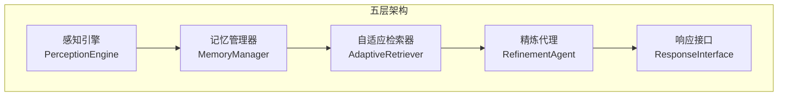
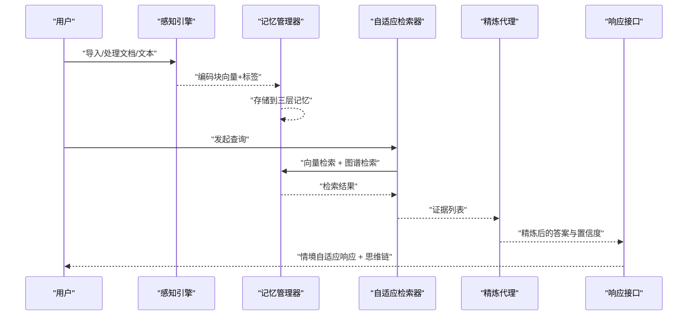
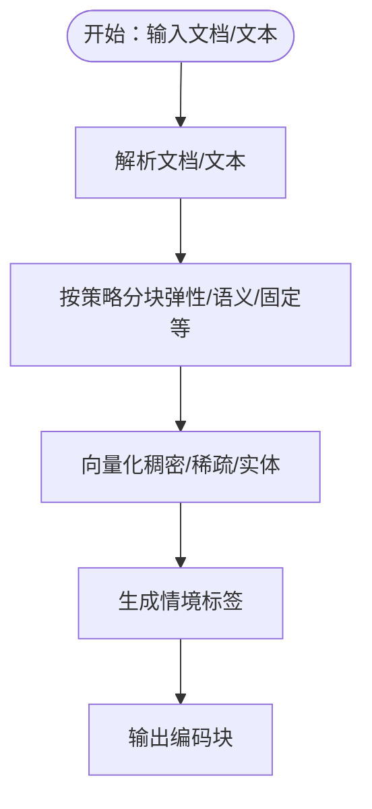
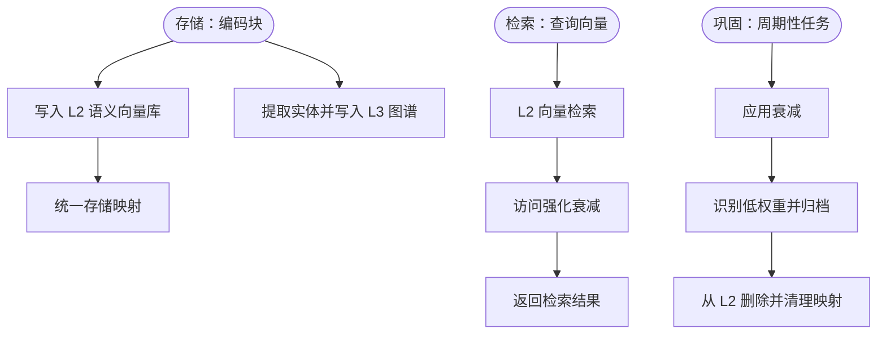
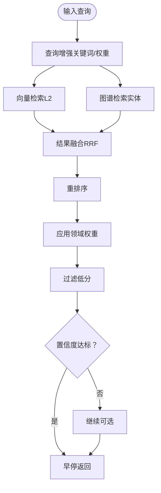
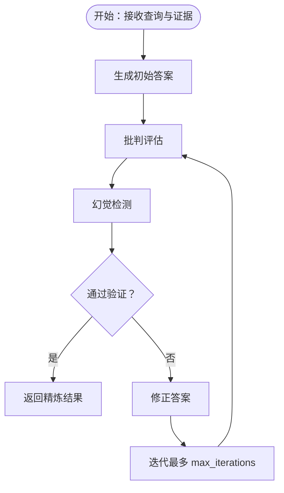
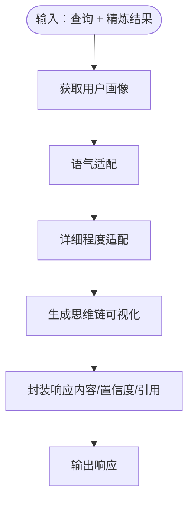

# 基础使用示例

<cite>
**本文引用的文件**
- [README.md](file://README.md)
- [QUICKSTART.md](file://QUICKSTART.md)
- [example/example_usage.py](file://example/example_usage.py)
- [src/necorag.py](file://src/necorag.py)
- [src/perception/engine.py](file://src/perception/engine.py)
- [src/memory/manager.py](file://src/memory/manager.py)
- [src/retrieval/retriever.py](file://src/retrieval/retriever.py)
- [src/refinement/agent.py](file://src/refinement/agent.py)
- [src/response/interface.py](file://src/response/interface.py)
- [src/perception/models.py](file://src/perception/models.py)
- [src/memory/models.py](file://src/memory/models.py)
- [src/retrieval/models.py](file://src/retrieval/models.py)
- [src/refinement/models.py](file://src/refinement/models.py)
- [src/response/models.py](file://src/response/models.py)
- [src/core/config.py](file://src/core/config.py)
</cite>

## 目录
1. [简介](#简介)
2. [项目结构](#项目结构)
3. [核心组件](#核心组件)
4. [架构总览](#架构总览)
5. [详细组件分析](#详细组件分析)
6. [依赖分析](#依赖分析)
7. [性能考虑](#性能考虑)
8. [故障排查指南](#故障排查指南)
9. [结论](#结论)
10. [附录](#附录)

## 简介
本教程面向初学者，基于 NecoRAG v1.7.0-alpha 的完整工作流，提供从感知引擎到响应接口的端到端基础使用示例。通过逐步讲解各模块的初始化参数、配置选项与使用方法，并配合可运行的示例脚本与预期输出，帮助你在最短时间内理解并验证框架的核心能力。

## 项目结构
NecoRAG 采用“五层认知”架构，从底层感知到顶层交互，形成完整的认知闭环。核心模块包括：
- 感知引擎（Perception Engine）：文档解析、分块、向量化与情境标签生成
- 记忆管理器（Memory Manager）：三层记忆（工作记忆 L1、语义记忆 L2、情景图谱 L3）的统一管理
- 自适应检索器（Adaptive Retriever）：多路检索、重排序、早停机制与领域权重
- 精炼代理（Refinement Agent）：生成-批判-修正闭环与幻觉检测
- 响应接口（Response Interface）：情境自适应生成与思维链可视化

**图示来源**
- [src/perception/engine.py:20-195](file://src/perception/engine.py#L20-L195)
- [src/memory/manager.py:20-212](file://src/memory/manager.py#L20-L212)
- [src/retrieval/retriever.py:135-644](file://src/retrieval/retriever.py#L135-L644)
- [src/refinement/agent.py:20-164](file://src/refinement/agent.py#L20-L164)
- [src/response/interface.py:20-232](file://src/response/interface.py#L20-L232)

**章节来源**
- [README.md:44-94](file://README.md#L44-L94)
- [QUICKSTART.md:74-89](file://QUICKSTART.md#L74-L89)

## 核心组件
本节给出五个核心模块的初始化参数、关键配置与基本用法要点，便于快速上手。

- 感知引擎（PerceptionEngine）
  - 关键参数：模型、分块大小、重叠、是否启用 OCR、弹性分块参数、分块策略、语义边界
  - 作用：解析文档/文本，生成编码块（稠密向量、稀疏向量、实体三元组、情境标签）
  - 常用方法：process_file、process_text、process
  - 参考：[src/perception/engine.py:28-76](file://src/perception/engine.py#L28-L76)

- 记忆管理器（MemoryManager）
  - 关键参数：Redis/Qdrant/Neo4j 连接、衰减速率
  - 作用：统一存储与检索三层记忆；支持记忆巩固与主动遗忘
  - 常用方法：store、retrieve、consolidate、forget、count
  - 参考：[src/memory/manager.py:27-51](file://src/memory/manager.py#L27-L51)

- 自适应检索器（AdaptiveRetriever）
  - 关键参数：记忆管理器、重排序模型、置信度阈值、是否启用 HyDE、领域配置
  - 作用：向量检索 + 图谱检索 + 结果融合 + 重排序 + 领域权重 + 早停
  - 常用方法：retrieve、retrieve_with_hyde、multi_hop_retrieve、get_retrieval_trace
  - 参考：[src/retrieval/retriever.py:142-182](file://src/retrieval/retriever.py#L142-L182)

- 精炼代理（RefinementAgent）
  - 关键参数：LLM 模型、记忆管理器、最大迭代次数、最低置信度
  - 作用：生成-批判-修正闭环；幻觉检测；异步知识固化与修剪
  - 常用方法：process、run_background_tasks
  - 参考：[src/refinement/agent.py:31-64](file://src/refinement/agent.py#L31-L64)

- 响应接口（ResponseInterface）
  - 关键参数：记忆管理器、LLM 模型、默认语气、默认详细程度
  - 作用：用户画像适配、语气/详细程度自适应、思维链可视化
  - 常用方法：respond、get_user_preference
  - 参考：[src/response/interface.py:31-58](file://src/response/interface.py#L31-L58)

**章节来源**
- [README.md:260-482](file://README.md#L260-L482)
- [src/perception/engine.py:28-76](file://src/perception/engine.py#L28-L76)
- [src/memory/manager.py:27-51](file://src/memory/manager.py#L27-L51)
- [src/retrieval/retriever.py:142-182](file://src/retrieval/retriever.py#L142-L182)
- [src/refinement/agent.py:31-64](file://src/refinement/agent.py#L31-L64)
- [src/response/interface.py:31-58](file://src/response/interface.py#L31-L58)

## 架构总览
下面的序列图展示了从文档导入到最终响应输出的完整工作流，体现各模块之间的数据流转与协作关系。

**图示来源**
- [src/perception/engine.py:140-154](file://src/perception/engine.py#L140-L154)
- [src/memory/manager.py:52-123](file://src/memory/manager.py#L52-L123)
- [src/retrieval/retriever.py:224-308](file://src/retrieval/retriever.py#L224-L308)
- [src/refinement/agent.py:65-141](file://src/refinement/agent.py#L65-L141)
- [src/response/interface.py:59-140](file://src/response/interface.py#L59-L140)

## 详细组件分析

### 感知引擎（PerceptionEngine）
- 初始化参数
  - model：向量化模型（默认 BGE-M3）
  - chunk_size、chunk_overlap：基础分块参数
  - enable_ocr：是否启用 OCR
  - min_chunk_size、target_chunk_size、max_chunk_size：弹性分块参数
  - enable_elastic_chunking：是否启用弹性分块
  - chunk_strategy：分块策略（elastic/semantic/fixed/structural/sentence）
  - semantic_boundaries：语义边界优先级
- 核心流程
  - 解析文档/文本 → 分块 → 向量化（稠密/稀疏/实体）→ 情境标签 → 编码块
- 使用示例（参考）
  - [example/example_usage.py:20-47](file://example/example_usage.py#L20-L47)
- 数据模型
  - EncodedChunk、ContextTags、ParsedDocument
  - 参考：[src/perception/models.py:14-62](file://src/perception/models.py#L14-L62)

**图示来源**
- [src/perception/engine.py:77-154](file://src/perception/engine.py#L77-L154)
- [src/perception/models.py:14-62](file://src/perception/models.py#L14-L62)

**章节来源**
- [README.md:261-296](file://README.md#L261-L296)
- [src/perception/engine.py:28-76](file://src/perception/engine.py#L28-L76)
- [src/perception/models.py:14-62](file://src/perception/models.py#L14-L62)
- [example/example_usage.py:12-47](file://example/example_usage.py#L12-L47)

### 记忆管理器（MemoryManager）
- 初始化参数
  - redis_url、qdrant_url、neo4j_url：连接参数
  - decay_rate：记忆衰减速率
- 核心流程
  - 存储：编码块 → L2 语义向量存储 → L3 实体关系图谱
  - 检索：向量检索（L2）→ 访问强化（衰减）→ 返回结果
  - 巩固：应用衰减 → 识别归档 → 删除并移出统一存储
  - 遗忘：主动归档低权重记忆
- 使用示例（参考）
  - [example/example_usage.py:58-91](file://example/example_usage.py#L58-L91)
- 数据模型
  - MemoryItem、GraphPath、Intent
  - 参考：[src/memory/models.py:14-43](file://src/memory/models.py#L14-L43)

**图示来源**
- [src/memory/manager.py:52-123](file://src/memory/manager.py#L52-L123)
- [src/memory/manager.py:124-202](file://src/memory/manager.py#L124-L202)

**章节来源**
- [README.md:300-346](file://README.md#L300-L346)
- [src/memory/manager.py:27-51](file://src/memory/manager.py#L27-L51)
- [src/memory/manager.py:124-202](file://src/memory/manager.py#L124-L202)
- [src/memory/models.py:14-43](file://src/memory/models.py#L14-L43)
- [example/example_usage.py:50-91](file://example/example_usage.py#L50-L91)

### 自适应检索器（AdaptiveRetriever）
- 初始化参数
  - memory：记忆管理器
  - reranker_model：重排序模型（默认 BGE-Reranker-v2）
  - confidence_threshold：早停阈值（默认 0.85）
  - enable_hyde：是否启用 HyDE
  - domain_config：领域权重配置（可选）
- 核心流程
  - 查询增强（关键词识别与权重提升）→ 向量检索 + 图谱检索 → 结果融合（RRF）→ 重排序 → 领域权重计算 → 过滤低分 → 早停判断 → 返回结果
  - 支持 HyDE 增强检索与多跳检索
- 使用示例（参考）
  - [example/example_usage.py:94-136](file://example/example_usage.py#L94-L136)
- 数据模型
  - RetrievalResult、QueryAnalysis
  - 参考：[src/retrieval/models.py:9-29](file://src/retrieval/models.py#L9-L29)

**图示来源**
- [src/retrieval/retriever.py:224-308](file://src/retrieval/retriever.py#L224-L308)
- [src/retrieval/retriever.py:362-389](file://src/retrieval/retriever.py#L362-L389)
- [src/retrieval/retriever.py:390-422](file://src/retrieval/retriever.py#L390-L422)

**章节来源**
- [README.md:350-390](file://README.md#L350-L390)
- [src/retrieval/retriever.py:142-182](file://src/retrieval/retriever.py#L142-L182)
- [src/retrieval/retriever.py:224-308](file://src/retrieval/retriever.py#L224-L308)
- [src/retrieval/models.py:9-29](file://src/retrieval/models.py#L9-L29)
- [example/example_usage.py:94-136](file://example/example_usage.py#L94-L136)

### 精炼代理（RefinementAgent）
- 初始化参数
  - llm_model：LLM 模型标识
  - memory：记忆管理器（可选）
  - max_iterations：最大迭代次数（默认 3）
  - min_confidence：最低置信度（默认 0.7）
- 核心流程
  - 生成初始答案 → 批判评估 → 幻觉检测 → 未通过则修正 → 达到阈值或迭代上限后返回
  - 可异步运行知识固化与记忆修剪
- 使用示例（参考）
  - [example/example_usage.py:139-173](file://example/example_usage.py#L139-L173)
- 数据模型
  - GeneratedAnswer、CritiqueReport、RefinementResult、HallucinationReport
  - 参考：[src/refinement/models.py:9-66](file://src/refinement/models.py#L9-L66)

**图示来源**
- [src/refinement/agent.py:65-141](file://src/refinement/agent.py#L65-L141)
- [src/refinement/models.py:9-66](file://src/refinement/models.py#L9-L66)

**章节来源**
- [README.md:394-434](file://README.md#L394-L434)
- [src/refinement/agent.py:31-64](file://src/refinement/agent.py#L31-L64)
- [src/refinement/agent.py:65-141](file://src/refinement/agent.py#L65-L141)
- [src/refinement/models.py:9-66](file://src/refinement/models.py#L9-L66)
- [example/example_usage.py:139-173](file://example/example_usage.py#L139-L173)

### 响应接口（ResponseInterface）
- 初始化参数
  - memory：记忆管理器
  - llm_model：LLM 模型
  - default_tone：默认语气（如 friendly）
  - default_detail_level：默认详细程度（1-4）
- 核心流程
  - 获取用户画像 → 语气适配 → 详细程度适配 → 生成思维链可视化 → 返回响应
  - 支持用户偏好分析与画像更新
- 使用示例（参考）
  - [example/example_usage.py:176-215](file://example/example_usage.py#L176-L215)
- 数据模型
  - UserProfile、Interaction、RetrievalVisualization
  - 参考：[src/response/models.py:13-31](file://src/response/models.py#L13-L31)

**图示来源**
- [src/response/interface.py:59-140](file://src/response/interface.py#L59-L140)
- [src/response/models.py:13-31](file://src/response/models.py#L13-L31)

**章节来源**
- [README.md:438-482](file://README.md#L438-L482)
- [src/response/interface.py:31-58](file://src/response/interface.py#L31-L58)
- [src/response/interface.py:59-140](file://src/response/interface.py#L59-L140)
- [src/response/models.py:13-31](file://src/response/models.py#L13-L31)
- [example/example_usage.py:176-215](file://example/example_usage.py#L176-L215)

## 依赖分析
- 组件耦合
  - PerceptionEngine 与 MemoryManager：感知层负责编码，记忆层负责存储与检索
  - MemoryManager 与 AdaptiveRetriever：检索依赖三层记忆
  - AdaptiveRetriever 与 RefinementAgent：检索结果作为证据输入精炼
  - RefinementAgent 与 ResponseInterface：精炼结果用于生成最终响应
- 外部依赖
  - 向量数据库（Qdrant/Milvus）、图数据库（Neo4j）、缓存（Redis）等
  - LLM 客户端（Mock/第三方）

**图示来源**
- [src/necorag.py:119-124](file://src/necorag.py#L119-L124)

**章节来源**
- [src/necorag.py:119-124](file://src/necorag.py#L119-L124)

## 性能考虑
- 早停机制：在置信度达标时立即终止检索，减少计算开销
- 领域权重：融合时间衰减、领域相关性与新颖性，提升检索质量
- 记忆衰减：定期巩固与归档，控制存储规模与检索效率
- 重排序与融合：减少冗余结果，提高相关性排序稳定性

[本节为通用指导，无需特定文件引用]

## 故障排查指南
- 常见问题
  - Dashboard 启动失败：检查端口占用并更换端口
  - 依赖缺失：安装 v1.7.0 新增依赖（如 jieba、scipy、prometheus-client、PyJWT、plotly 等）
- 日志与监控
  - 使用 Dashboard 实时查看系统资源与错误统计
  - 开启调试模式（配置 debug=true）以获取更详细日志
- 建议步骤
  - 先运行示例脚本验证各模块导入与基本功能
  - 使用最小配置（minimal preset）快速启动，再逐步启用高级功能

**章节来源**
- [QUICKSTART.md:297-348](file://QUICKSTART.md#L297-L348)

## 结论
通过本教程，你已经了解了 NecoRAG 五层架构中各模块的职责、初始化参数与基本用法，并掌握了从文档导入到最终响应输出的完整工作流。建议在实际项目中结合配置管理与可视化调试面板，持续优化检索与生成效果。

[本节为总结性内容，无需特定文件引用]

## 附录

### 快速开始与运行步骤
- 安装依赖
  - 参考：[README.md:167-179](file://README.md#L167-L179)
- 运行测试与示例
  - 参考：[QUICKSTART.md:15-45](file://QUICKSTART.md#L15-L45)
- 启动 Dashboard
  - 参考：[README.md:216-230](file://README.md#L216-L230)

### 完整使用示例（逐段讲解）
- 感知引擎示例
  - 初始化与处理文本/文件
  - 参考：[example/example_usage.py:12-47](file://example/example_usage.py#L12-L47)
- 记忆管理器示例
  - 存储与检索、巩固与遗忘
  - 参考：[example/example_usage.py:50-91](file://example/example_usage.py#L50-L91)
- 自适应检索器示例
  - 检索、HyDE 增强、多跳检索与检索路径追踪
  - 参考：[example/example_usage.py:94-136](file://example/example_usage.py#L94-L136)
- 精炼代理示例
  - 生成-批判-修正闭环与幻觉检测
  - 参考：[example/example_usage.py:139-173](file://example/example_usage.py#L139-L173)
- 响应接口示例
  - 情境自适应生成与思维链可视化
  - 参考：[example/example_usage.py:176-215](file://example/example_usage.py#L176-L215)

### 配置管理与参数参考
- 全局配置类与预设
  - 参考：[src/core/config.py:277-420](file://src/core/config.py#L277-L420)
- 各层配置项
  - 感知层：chunk_size、chunk_overlap、chunk_strategy、弹性分块参数、标签开关、支持格式
  - 记忆层：工作记忆 TTL、向量数据库提供商与连接、图数据库提供商与连接、衰减参数
  - 检索层：top_k、向量/图谱权重、早停阈值、HyDE、重排序、互联网搜索
  - 巩固层：最大迭代、置信度阈值、幻觉检测阈值、固化与修剪
  - 响应层：默认语气、默认详细程度、思维链可视化开关、输出格式
  - 领域权重：关键字/时间/领域因子、时间衰减、常青知识开关
  - 参考：[src/core/config.py:105-234](file://src/core/config.py#L105-L234)

### 数据模型一览
- 感知层：EncodedChunk、ContextTags、ParsedDocument
  - 参考：[src/perception/models.py:14-62](file://src/perception/models.py#L14-L62)
- 记忆层：MemoryItem、GraphPath、Intent
  - 参考：[src/memory/models.py:14-43](file://src/memory/models.py#L14-L43)
- 检索层：RetrievalResult、QueryAnalysis
  - 参考：[src/retrieval/models.py:9-29](file://src/retrieval/models.py#L9-L29)
- 巩固层：GeneratedAnswer、CritiqueReport、RefinementResult、HallucinationReport、KnowledgeGap、QueryPattern
  - 参考：[src/refinement/models.py:9-66](file://src/refinement/models.py#L9-L66)
- 响应层：UserProfile、Interaction、RetrievalVisualization
  - 参考：[src/response/models.py:13-31](file://src/response/models.py#L13-L31)