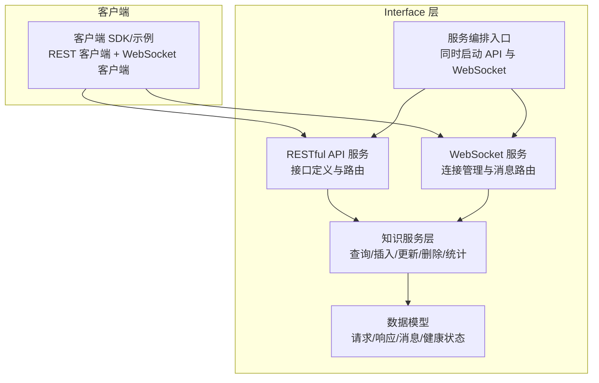
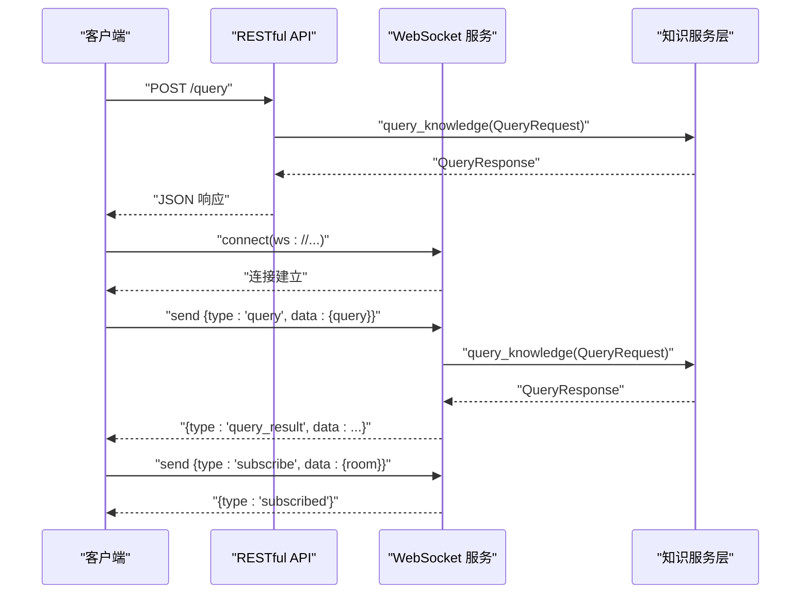
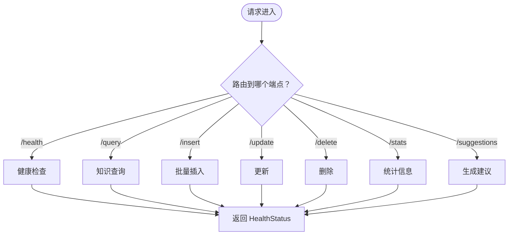
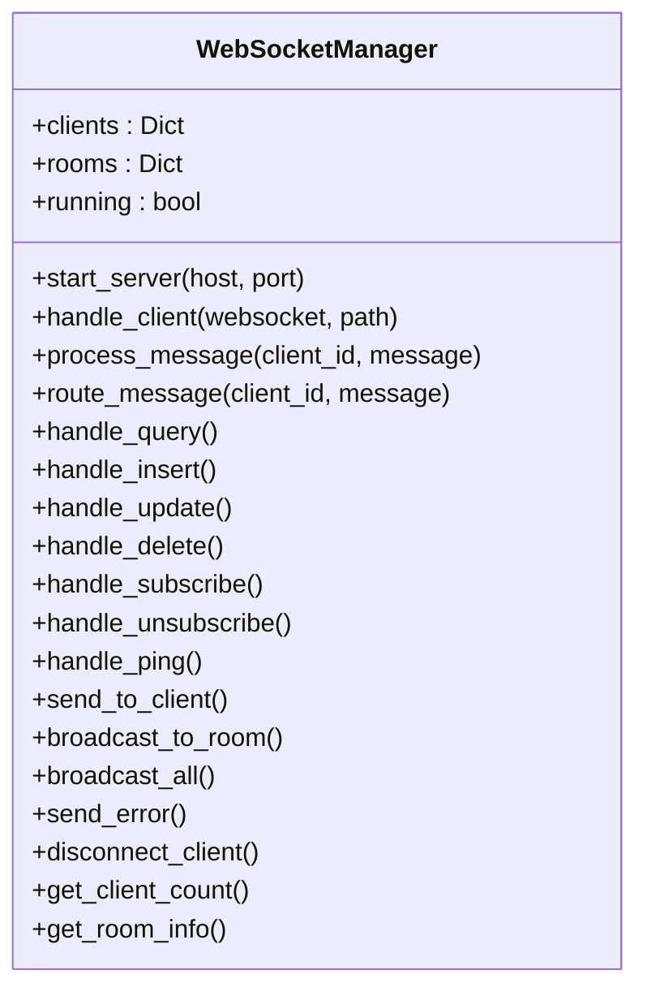
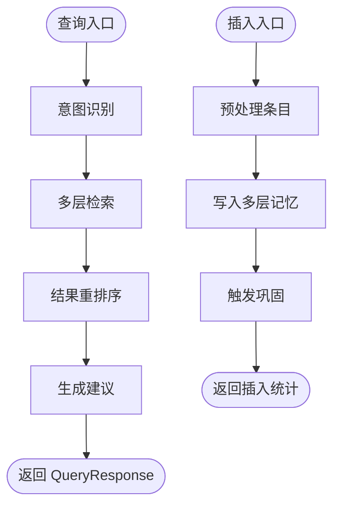
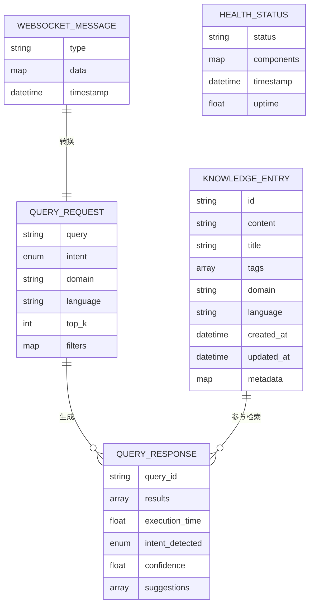
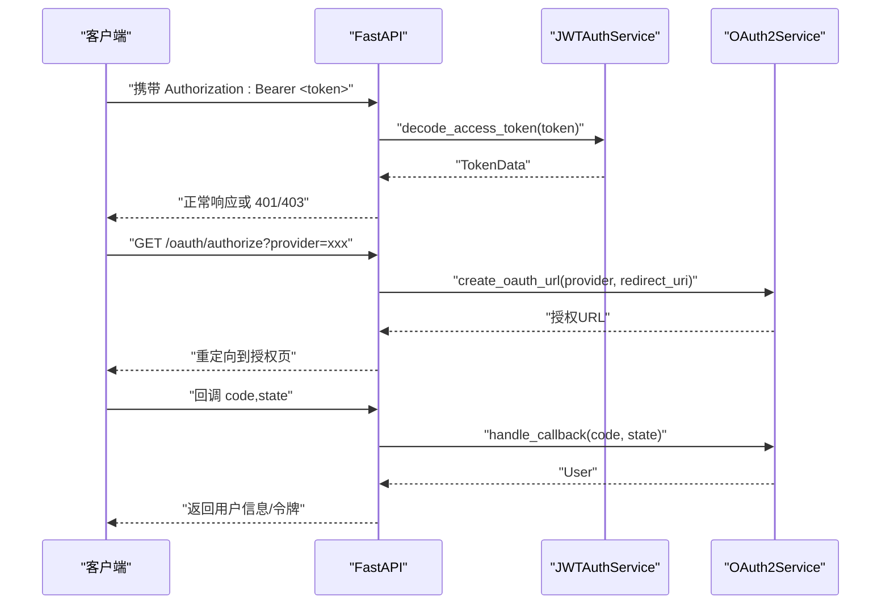
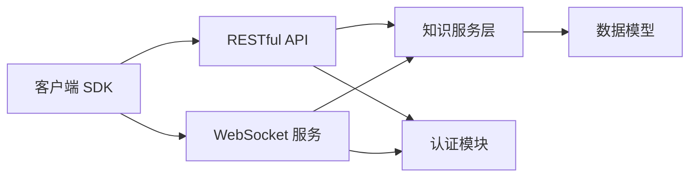

# 客户端集成指南

<cite>
**本文引用的文件**
- [interface/example_client.py](file://interface/example_client.py)
- [interface/api.py](file://interface/api.py)
- [interface/websocket.py](file://interface/websocket.py)
- [interface/main.py](file://interface/main.py)
- [interface/models.py](file://interface/models.py)
- [interface/knowledge_service.py](file://interface/knowledge_service.py)
- [src/security/auth.py](file://src/security/auth.py)
- [src/core/config.py](file://src/core/config.py)
- [src/core/exceptions.py](file://src/core/exceptions.py)
- [README.md](file://README.md)
</cite>

## 目录
1. [引言](#引言)
2. [项目结构](#项目结构)
3. [核心组件](#核心组件)
4. [架构总览](#架构总览)
5. [详细组件分析](#详细组件分析)
6. [依赖分析](#依赖分析)
7. [性能考虑](#性能考虑)
8. [故障排查指南](#故障排查指南)
9. [结论](#结论)
10. [附录](#附录)

## 引言
本指南面向需要在客户端集成 NecoRAG 的开发者，提供基于 RESTful API 与 WebSocket 的完整接入方案。内容涵盖：
- 客户端初始化与配置
- 认证与权限（JWT/OAuth2）
- 连接管理与错误处理
- 常见业务场景（文档上传、知识检索、实时对话）
- 性能优化与重连策略
- 多语言客户端集成思路与最佳实践
- 完整 API 参考与使用示例路径

## 项目结构
NecoRAG 的 Interface 模块提供了统一的 RESTful API 与 WebSocket 服务，并封装了知识服务层，便于客户端以一致的方式访问。

**图表来源**
- [interface/api.py:19-152](file://interface/api.py#L19-L152)
- [interface/websocket.py:18-299](file://interface/websocket.py#L18-L299)
- [interface/knowledge_service.py:27-307](file://interface/knowledge_service.py#L27-L307)
- [interface/models.py:11-85](file://interface/models.py#L11-L85)
- [interface/main.py:14-82](file://interface/main.py#L14-L82)

**章节来源**
- [README.md:165-257](file://README.md#L165-L257)
- [interface/main.py:14-82](file://interface/main.py#L14-L82)

## 核心组件
- RESTful API 服务：提供健康检查、查询、插入、更新、删除、统计、查询建议等接口。
- WebSocket 服务：提供实时查询、插入、更新、删除、订阅/退订、心跳等消息通道。
- 知识服务层：封装查询意图识别、多层检索、结果重排序、建议生成、统计聚合等。
- 数据模型：统一定义查询、插入、更新、删除、WebSocket 消息、健康状态等数据结构。
- 认证与权限：支持 JWT 与 OAuth2，提供依赖注入获取当前用户。
- 配置管理：集中式配置，支持从文件与环境变量加载，含 LLM、感知层、记忆层、检索层、巩固层、响应层、领域权重、知识演化等配置。

**章节来源**
- [interface/api.py:19-152](file://interface/api.py#L19-L152)
- [interface/websocket.py:18-299](file://interface/websocket.py#L18-L299)
- [interface/knowledge_service.py:27-307](file://interface/knowledge_service.py#L27-L307)
- [interface/models.py:11-85](file://interface/models.py#L11-L85)
- [src/security/auth.py:23-210](file://src/security/auth.py#L23-L210)
- [src/core/config.py:277-420](file://src/core/config.py#L277-L420)

## 架构总览
客户端通过两种通道与 NecoRAG 交互：
- RESTful API：适合批量操作、非实时场景（如文档上传、统计查询）。
- WebSocket：适合实时交互（如实时检索、订阅推送）。

**图表来源**
- [interface/api.py:73-84](file://interface/api.py#L73-L84)
- [interface/websocket.py:68-108](file://interface/websocket.py#L68-L108)
- [interface/knowledge_service.py:45-77](file://interface/knowledge_service.py#L45-L77)

## 详细组件分析

### RESTful API 组件
- 健康检查：/health 返回服务整体健康状态与组件状态。
- 查询接口：/query 支持指定语言、领域、top_k、过滤条件等。
- 插入接口：/insert 支持批量插入，返回成功/失败统计。
- 更新接口：/update 支持部分/全量更新。
- 删除接口：/delete 支持批量删除。
- 统计接口：/stats 返回知识库统计信息。
- 查询建议：/suggestions/{query} 返回相关建议。

**图表来源**
- [interface/api.py:49-151](file://interface/api.py#L49-L151)

**章节来源**
- [interface/api.py:19-152](file://interface/api.py#L19-L152)

### WebSocket 组件
- 连接管理：维护客户端集合与房间订阅，支持广播与单播。
- 消息路由：根据消息类型分派到查询、插入、更新、删除、订阅、退订、心跳处理。
- 房间订阅：支持按房间广播（如知识更新事件）。
- 错误处理：对无效 JSON、处理异常、连接断开进行统一错误返回与清理。

**图表来源**
- [interface/websocket.py:18-299](file://interface/websocket.py#L18-L299)

**章节来源**
- [interface/websocket.py:18-299](file://interface/websocket.py#L18-L299)

### 知识服务层
- 查询流程：意图识别 → 多层检索 → 结果重排序 → 建议生成 → 返回 QueryResponse。
- 插入流程：逐条预处理 → 写入多层记忆 → 触发巩固。
- 更新流程：校验存在 → 部分/全量更新 → 更新多层记忆 → 更新关联项。
- 删除流程：逐条校验 → 从多层记忆删除 → 清理关系。
- 统计聚合：总条目数、领域分布、语言分布、最近更新、健康状态。

**图表来源**
- [interface/knowledge_service.py:45-307](file://interface/knowledge_service.py#L45-L307)

**章节来源**
- [interface/knowledge_service.py:27-307](file://interface/knowledge_service.py#L27-L307)

### 数据模型
- 查询请求/响应：包含查询文本、意图、领域、语言、top_k、过滤条件、结果、执行时间、置信度、建议等。
- 插入/更新/删除：分别对应请求体结构。
- WebSocket 消息：包含消息类型、数据、时间戳。
- 健康状态：服务状态、组件状态、时间戳、运行时长。

**图表来源**
- [interface/models.py:22-85](file://interface/models.py#L22-L85)

**章节来源**
- [interface/models.py:11-85](file://interface/models.py#L11-L85)

### 认证与权限
- JWT 认证：创建/解码访问令牌，依赖注入获取当前用户，校验用户状态。
- OAuth2：生成授权 URL，处理回调，返回模拟用户。
- 安全配置：密码强度校验、角色与权限字段。

**图表来源**
- [src/security/auth.py:56-133](file://src/security/auth.py#L56-L133)
- [src/security/auth.py:134-191](file://src/security/auth.py#L134-L191)

**章节来源**
- [src/security/auth.py:23-210](file://src/security/auth.py#L23-L210)

### 配置管理
- 全局配置：包含 LLM、感知层、记忆层、检索层、巩固层、响应层、领域权重、知识演化等子配置。
- 环境变量覆盖：支持通过环境变量覆盖关键配置项。
- 预设配置：开发、生产、最小化三种预设。

**章节来源**
- [src/core/config.py:277-420](file://src/core/config.py#L277-L420)

## 依赖分析
- 接口层依赖知识服务层；知识服务层依赖数据模型；认证模块独立但可与 API 层集成。
- WebSocket 服务依赖知识服务层与数据模型；连接管理器负责生命周期与广播。
- 客户端 SDK 依赖 requests/websockets 与接口层提供的端点。

**图表来源**
- [interface/api.py:12-16](file://interface/api.py#L12-L16)
- [interface/websocket.py:14-15](file://interface/websocket.py#L14-L15)
- [interface/knowledge_service.py:13-16](file://interface/knowledge_service.py#L13-L16)
- [src/security/auth.py:14-15](file://src/security/auth.py#L14-L15)

**章节来源**
- [interface/api.py:12-16](file://interface/api.py#L12-L16)
- [interface/websocket.py:14-15](file://interface/websocket.py#L14-L15)
- [interface/knowledge_service.py:13-16](file://interface/knowledge_service.py#L13-L16)
- [src/security/auth.py:14-15](file://src/security/auth.py#L14-L15)

## 性能考虑
- 检索优化：合理设置 top_k、启用重排序与 HyDE 增强，结合早停阈值减少无效检索。
- 批量插入：控制批量大小，避免单次请求过大导致超时。
- WebSocket 连接池：复用连接，避免频繁握手；对高并发场景考虑多路复用或连接池。
- 缓存策略：对热点查询结果进行缓存，降低重复检索成本。
- 超时与重试：为 REST 请求设置合理超时与指数退避重试；WebSocket 断线后按指数退避重连。
- 日志与监控：开启必要的日志级别，结合监控指标定位性能瓶颈。

[本节为通用性能建议，无需特定文件引用]

## 故障排查指南
- 健康检查失败：检查知识服务与各组件状态，关注返回的组件状态与时间戳。
- 查询异常：确认查询参数（语言、领域、top_k、过滤条件）是否合法；查看服务端日志。
- 插入失败：检查条目格式与必填字段；关注失败条目列表与错误详情。
- WebSocket 连接断开：检查网络稳定性与心跳机制；实现指数退避重连。
- 认证失败：确认令牌有效、未过期；OAuth 回调状态参数是否正确。

**章节来源**
- [interface/api.py:49-71](file://interface/api.py#L49-L71)
- [interface/websocket.py:44-50](file://interface/websocket.py#L44-L50)
- [src/core/exceptions.py:10-455](file://src/core/exceptions.py#L10-L455)

## 结论
通过 RESTful API 与 WebSocket，NecoRAG 为客户端提供了稳定、可扩展的接入方式。结合统一的数据模型、完善的认证与配置管理，开发者可以快速构建文档上传、知识检索、实时对话等应用场景。建议在生产环境中配合监控、缓存与重连策略，确保系统的可靠性与性能。

[本节为总结性内容，无需特定文件引用]

## 附录

### 客户端初始化与配置
- 初始化 REST 客户端：设置 base_url，默认指向 http://localhost:8000。
- 初始化 WebSocket 客户端：设置 ws_url，默认指向 ws://localhost:8001。
- 配置加载：可通过环境变量覆盖关键配置（如 LLM 提供商、向量/图数据库提供商等）。

**章节来源**
- [interface/example_client.py:16-58](file://interface/example_client.py#L16-L58)
- [src/core/config.py:338-377](file://src/core/config.py#L338-L377)

### 认证方式
- Bearer Token：在请求头中携带 Authorization: Bearer <token>。
- OAuth2：通过 create_oauth_url 获取授权 URL，处理回调后获取用户信息。

**章节来源**
- [src/security/auth.py:56-133](file://src/security/auth.py#L56-L133)
- [src/security/auth.py:134-191](file://src/security/auth.py#L134-L191)

### 连接管理与重连策略
- REST：设置超时与重试，对 5xx 与网络异常进行指数退避重试。
- WebSocket：捕获连接断开异常，实现指数退避重连；定期发送 ping 保持心跳。

**章节来源**
- [interface/websocket.py:44-50](file://interface/websocket.py#L44-L50)
- [interface/websocket.py:215-221](file://interface/websocket.py#L215-L221)

### 常见使用场景与示例路径
- 健康检查：调用 /health。
- 知识查询：POST /query，携带查询文本与可选参数。
- 批量插入：POST /insert，携带条目数组。
- 更新/删除：PUT /update 与 DELETE /delete。
- 统计查询：GET /stats。
- 实时对话：WebSocket 连接后发送 query/subscribe/unsubscribe/ping 等消息。

**章节来源**
- [interface/example_client.py:97-184](file://interface/example_client.py#L97-L184)
- [interface/api.py:49-151](file://interface/api.py#L49-L151)
- [interface/websocket.py:68-221](file://interface/websocket.py#L68-L221)

### API 参考（端点与字段）
- GET /health：返回健康状态。
- POST /query：请求体包含 query、intent、domain、language、top_k、filters；响应包含 query_id、results、execution_time、intent_detected、confidence、suggestions。
- POST /insert：请求体包含 entries、batch_size；响应包含成功/失败统计。
- PUT /update：请求体包含 entry_id、updates、partial_update；响应包含更新字段列表。
- DELETE /delete：请求体包含 entry_ids；响应包含删除统计。
- GET /stats：返回知识库统计信息。
- GET /suggestions/{query}：返回查询建议列表。

**章节来源**
- [interface/api.py:49-151](file://interface/api.py#L49-L151)
- [interface/models.py:35-85](file://interface/models.py#L35-L85)

### 多语言客户端集成建议
- REST：使用任意支持 HTTP/JSON 的语言，遵循上述端点与数据模型。
- WebSocket：选择支持 WebSocket 的语言库，实现连接管理、消息编解码与重连策略。
- 认证：在请求头中携带 Bearer Token；或按 OAuth2 流程完成授权。

[本节为通用集成建议，无需特定文件引用]