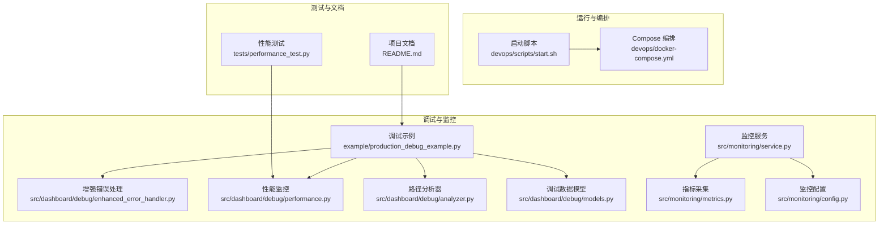
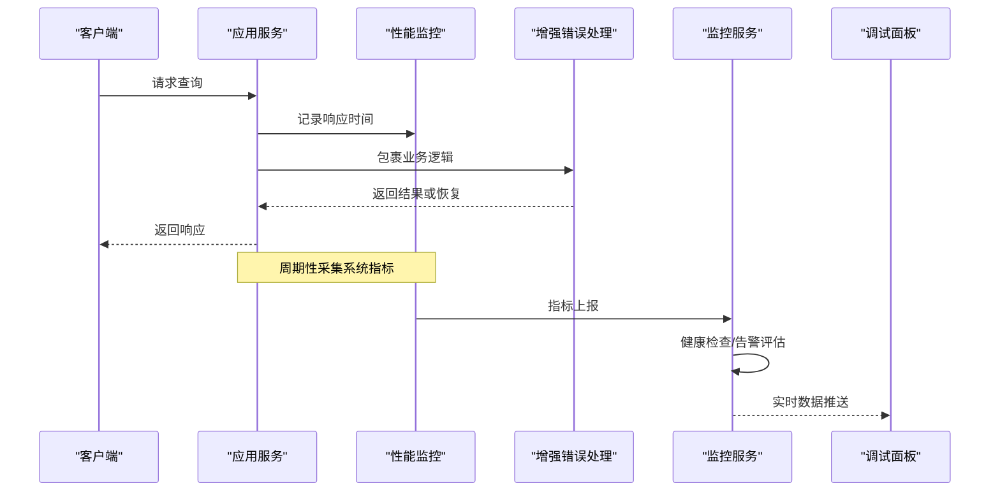
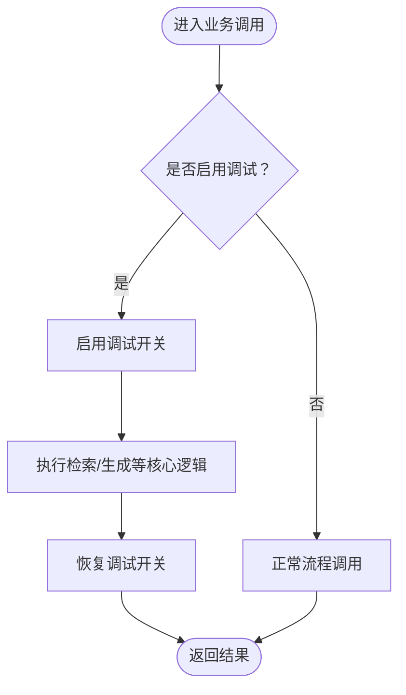
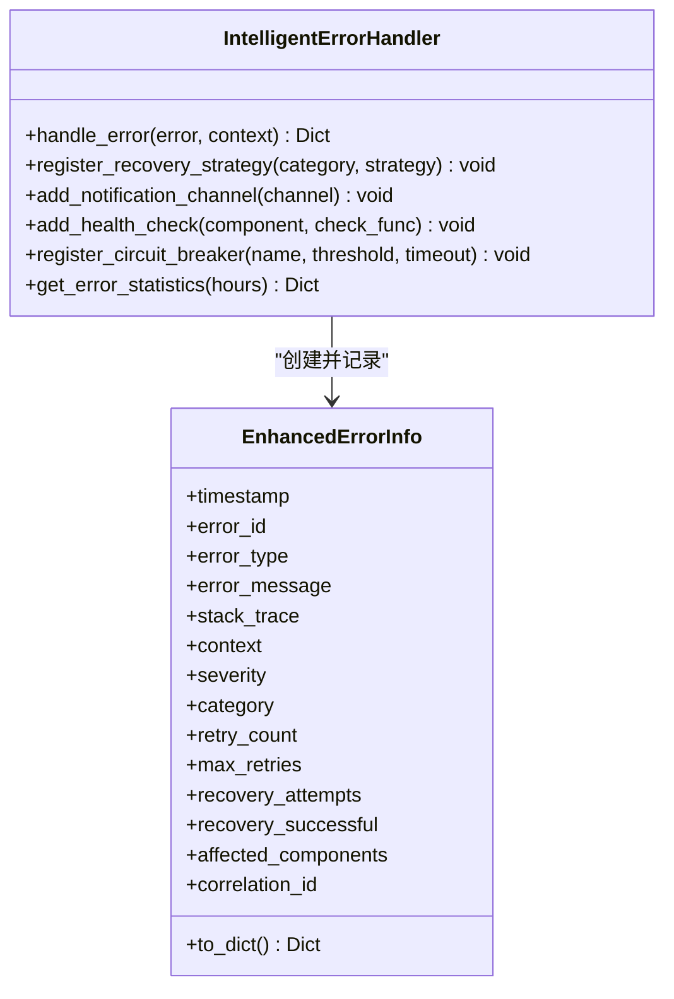
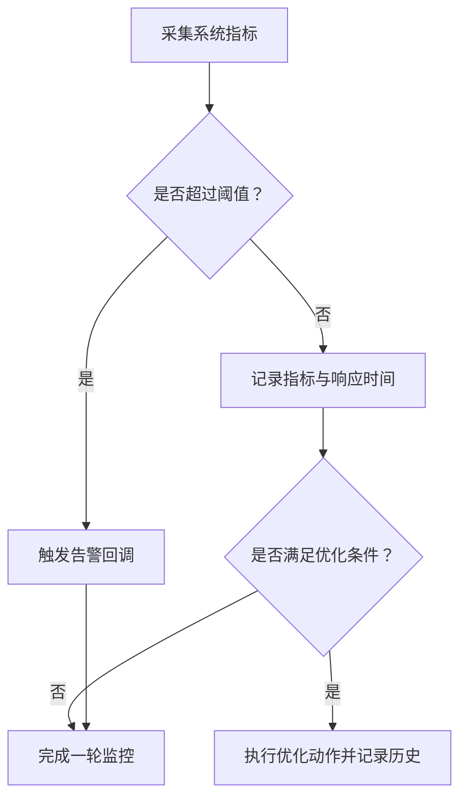
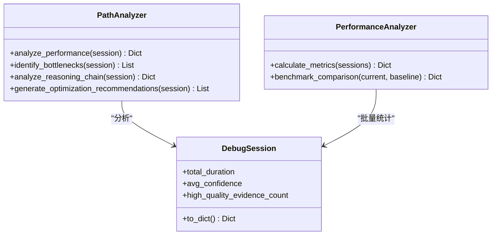
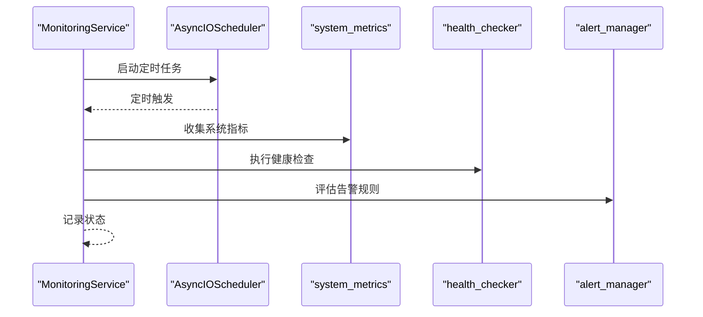
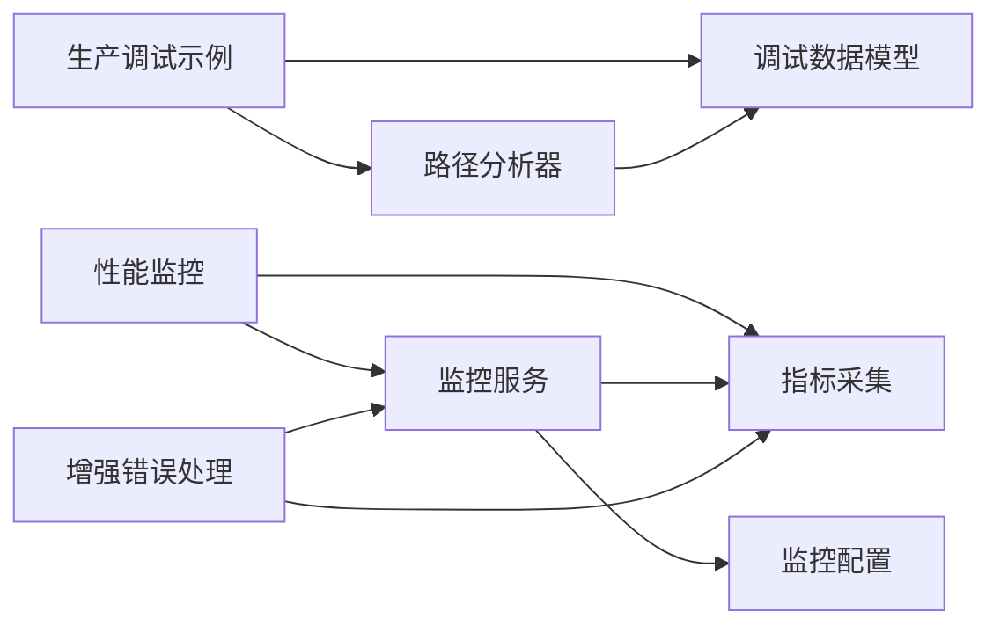

# 生产环境调试示例

<cite>
**本文引用的文件**
- [production_debug_example.py](file://example/production_debug_example.py)
- [enhanced_error_handler.py](file://src/dashboard/debug/enhanced_error_handler.py)
- [performance.py](file://src/dashboard/debug/performance.py)
- [analyzer.py](file://src/dashboard/debug/analyzer.py)
- [models.py](file://src/dashboard/debug/models.py)
- [service.py](file://src/monitoring/service.py)
- [metrics.py](file://src/monitoring/metrics.py)
- [config.py](file://src/monitoring/config.py)
- [exceptions.py](file://src/core/exceptions.py)
- [start.sh](file://devops/scripts/start.sh)
- [docker-compose.yml](file://devops/docker-compose.yml)
- [performance_test.py](file://tests/performance_test.py)
- [README.md](file://README.md)
</cite>

## 目录
1. [引言](#引言)
2. [项目结构](#项目结构)
3. [核心组件](#核心组件)
4. [架构总览](#架构总览)
5. [详细组件分析](#详细组件分析)
6. [依赖分析](#依赖分析)
7. [性能考量](#性能考量)
8. [故障排查指南](#故障排查指南)
9. [结论](#结论)
10. [附录](#附录)

## 引言
本指南面向在生产环境中使用 NecoRAG 的工程师，围绕“系统调试与性能优化”提供一套可落地的实践方法。内容涵盖：
- 生产环境特有的挑战（高并发、资源限制、错误恢复）
- 日志分析、性能监控、异常处理与系统维护
- 调试流程与最佳实践
- 实际生产案例与问题解决经验
- 故障排查清单与预防性维护建议

## 项目结构
NecoRAG 采用模块化分层架构，调试与监控能力集中在 dashboard/debug 与 monitoring 两大子系统，并通过容器化编排在生产环境稳定运行。

**图表来源**
- [production_debug_example.py:1-381](file://example/production_debug_example.py#L1-L381)
- [enhanced_error_handler.py:1-558](file://src/dashboard/debug/enhanced_error_handler.py#L1-L558)
- [performance.py:1-658](file://src/dashboard/debug/performance.py#L1-L658)
- [analyzer.py:1-410](file://src/dashboard/debug/analyzer.py#L1-L410)
- [models.py:1-336](file://src/dashboard/debug/models.py#L1-L336)
- [service.py:1-214](file://src/monitoring/service.py#L1-L214)
- [metrics.py:1-207](file://src/monitoring/metrics.py#L1-L207)
- [config.py:1-117](file://src/monitoring/config.py#L1-L117)
- [start.sh:1-101](file://devops/scripts/start.sh#L1-L101)
- [docker-compose.yml:1-164](file://devops/docker-compose.yml#L1-L164)
- [performance_test.py:1-322](file://tests/performance_test.py#L1-L322)
- [README.md:1-953](file://README.md#L1-L953)

**章节来源**
- [README.md:1-953](file://README.md#L1-L953)
- [docker-compose.yml:1-164](file://devops/docker-compose.yml#L1-L164)
- [start.sh:1-101](file://devops/scripts/start.sh#L1-L101)

## 核心组件
- 生产调试示例：提供可直接在生产环境启用的调试开关、采样策略与批处理示例，兼顾性能与可观测性。
- 增强错误处理：智能分类、严重程度评估、熔断器、自动恢复策略与通知通道。
- 性能监控：系统级指标采集、响应时间记录、阈值告警与性能报告。
- 路径分析器：对检索路径、证据质量与推理链进行瓶颈识别与优化建议。
- 监控服务：统一调度指标采集、健康检查与告警评估。
- 指标采集：系统与应用级指标，支持 Prometheus 导出。
- 监控配置：集中化阈值与通知渠道配置，支持环境变量注入。
- 异常体系：统一异常基类与模块化异常类型，便于定位与恢复。
- 启动与编排：Docker Compose 编排与启动脚本，支持最小/开发/完整模式。
- 性能测试：基准测试、并发测试、压力测试与内存使用测试。

**章节来源**
- [production_debug_example.py:1-381](file://example/production_debug_example.py#L1-L381)
- [enhanced_error_handler.py:1-558](file://src/dashboard/debug/enhanced_error_handler.py#L1-L558)
- [performance.py:1-658](file://src/dashboard/debug/performance.py#L1-L658)
- [analyzer.py:1-410](file://src/dashboard/debug/analyzer.py#L1-L410)
- [models.py:1-336](file://src/dashboard/debug/models.py#L1-L336)
- [service.py:1-214](file://src/monitoring/service.py#L1-L214)
- [metrics.py:1-207](file://src/monitoring/metrics.py#L1-L207)
- [config.py:1-117](file://src/monitoring/config.py#L1-L117)
- [exceptions.py:1-455](file://src/core/exceptions.py#L1-L455)
- [start.sh:1-101](file://devops/scripts/start.sh#L1-L101)
- [docker-compose.yml:1-164](file://devops/docker-compose.yml#L1-L164)
- [performance_test.py:1-322](file://tests/performance_test.py#L1-L322)

## 架构总览
生产环境调试与监控的整体流程如下：

**图表来源**
- [performance.py:572-594](file://src/dashboard/debug/performance.py#L572-L594)
- [enhanced_error_handler.py:135-168](file://src/dashboard/debug/enhanced_error_handler.py#L135-L168)
- [service.py:99-154](file://src/monitoring/service.py#L99-L154)
- [metrics.py:126-143](file://src/monitoring/metrics.py#L126-L143)

## 详细组件分析

### 生产调试示例（ProductionDebugger）
- 功能要点
  - 基于用户 ID 或随机采样决定是否启用调试，避免全量调试带来的性能开销。
  - 在业务调用前后自动切换调试开关，保证业务逻辑不受污染。
  - 提供批处理示例与性能对比示例，便于评估调试模式对吞吐的影响。
- 生产实践
  - 开发环境：采样率 100%，开启调试与 WebSocket。
  - 生产环境：采样率 1%~10%，关闭 WebSocket，降低网络与存储压力。
  - 通过配置项控制日志级别、会话 TTL、最大会话数等，平衡可观测性与资源占用。

**图表来源**
- [production_debug_example.py:213-253](file://example/production_debug_example.py#L213-L253)

**章节来源**
- [production_debug_example.py:213-381](file://example/production_debug_example.py#L213-L381)

### 增强错误处理（IntelligentErrorHandler）
- 功能要点
  - 错误分类与严重程度评估，结合上下文（如影响组件、是否影响用户）动态提升严重等级。
  - 内置恢复策略（网络、数据库、内存、超时），支持异步策略与熔断器。
  - 通知通道（控制台、邮件、Webhook、Slack）可插拔扩展。
  - 提供错误统计与恢复率分析，辅助容量规划与稳定性评估。
- 生产实践
  - 为高频错误提高严重等级，避免雪崩效应。
  - 为关键组件（核心引擎、数据库、网关）单独注册熔断器。
  - 通过通知渠道联动值班与自动化恢复。

**图表来源**
- [enhanced_error_handler.py:72-168](file://src/dashboard/debug/enhanced_error_handler.py#L72-L168)

**章节来源**
- [enhanced_error_handler.py:1-558](file://src/dashboard/debug/enhanced_error_handler.py#L1-L558)

### 性能监控（PerformanceMonitor + ErrorHandler + PerformanceOptimizer）
- 功能要点
  - 系统指标采集：CPU、内存、磁盘、网络、进程、负载、交换分区等。
  - 响应时间记录与阈值告警；支持回调扩展。
  - 错误处理：按异常类型映射严重程度，提供默认与自定义恢复策略。
  - 性能优化器：可配置规则，按条件触发优化动作并记录历史。
- 生产实践
  - 设置合理的阈值（CPU/内存/响应时间），避免误报与漏报。
  - 通过装饰器自动埋点，减少侵入式代码。
  - 结合 Grafana/Prometheus 导出指标，建立可视化看板。

**图表来源**
- [performance.py:130-329](file://src/dashboard/debug/performance.py#L130-L329)
- [metrics.py:32-95](file://src/monitoring/metrics.py#L32-L95)

**章节来源**
- [performance.py:1-658](file://src/dashboard/debug/performance.py#L1-L658)
- [metrics.py:1-207](file://src/monitoring/metrics.py#L1-L207)

### 路径分析器（PathAnalyzer + PerformanceAnalyzer）
- 功能要点
  - 性能分析：总耗时、平均步骤耗时、慢步骤识别、吞吐量等。
  - 瓶颈识别：慢步骤、失败步骤、证据质量低等。
  - 推理链分析：迭代次数、置信度趋势、证据使用分布。
  - 优化建议：基于统计与规则生成针对性建议。
- 生产实践
  - 将分析结果与调试会话关联，形成“问题定位—根因分析—优化建议”的闭环。
  - 对高影响瓶颈制定专项优化计划（索引优化、参数调优、缓存策略）。

**图表来源**
- [analyzer.py:17-227](file://src/dashboard/debug/analyzer.py#L17-L227)
- [models.py:185-276](file://src/dashboard/debug/models.py#L185-L276)

**章节来源**
- [analyzer.py:1-410](file://src/dashboard/debug/analyzer.py#L1-L410)
- [models.py:1-336](file://src/dashboard/debug/models.py#L1-L336)

### 监控服务（MonitoringService）
- 功能要点
  - 基于 APScheduler 的定时任务，周期性采集指标、执行健康检查、评估告警。
  - 统一服务状态查询接口，便于运维与自动化系统集成。
- 生产实践
  - 启动/停止钩子与异常处理，确保服务稳定。
  - 与 Grafana 集成，提供统一的可视化与告警平台。

**图表来源**
- [service.py:38-154](file://src/monitoring/service.py#L38-L154)

**章节来源**
- [service.py:1-214](file://src/monitoring/service.py#L1-L214)
- [config.py:1-117](file://src/monitoring/config.py#L1-L117)

### 异常体系（NecoRAGError 与模块化异常）
- 功能要点
  - 统一异常基类，支持错误码、消息与详情字段。
  - 按模块划分异常类型（感知层、记忆层、检索层、生成层、LLM、配置、知识演化、自适应学习等）。
- 生产实践
  - 在业务层捕获具体异常类型，进行差异化处理与恢复。
  - 将异常详情写入日志与监控系统，便于追踪与统计。

**章节来源**
- [exceptions.py:1-455](file://src/core/exceptions.py#L1-L455)

### 启动与编排（Docker Compose 与启动脚本）
- 功能要点
  - 支持最小模式（Redis + Qdrant）、开发模式（仅后台服务）、完整模式（含 LLM）。
  - 一键启动/停止，健康检查与端口映射。
- 生产实践
  - 使用最小模式进行预生产验证，再逐步扩展到完整模式。
  - 通过环境变量控制端口、凭据与调试开关。

**章节来源**
- [start.sh:1-101](file://devops/scripts/start.sh#L1-L101)
- [docker-compose.yml:1-164](file://devops/docker-compose.yml#L1-L164)

### 性能测试（PerformanceTester）
- 功能要点
  - 单操作基准测试、并发测试、压力测试、内存使用测试。
  - 统计指标：最小/最大/平均/中位数/标准差/百分位数/吞吐量。
- 生产实践
  - 在灰度发布前进行基准与压力测试，设定性能基线。
  - 结合监控指标与测试报告，评估变更对系统的影响。

**章节来源**
- [performance_test.py:1-322](file://tests/performance_test.py#L1-L322)

## 依赖分析
- 组件耦合
  - 调试示例依赖调试数据模型与路径分析器，形成“观测—分析—建议”的闭环。
  - 监控服务依赖指标采集与健康检查模块，统一调度与告警。
  - 增强错误处理与性能监控相互配合，共同保障系统稳定性。
- 外部依赖
  - Docker Compose 用于服务编排与健康检查。
  - Prometheus/Grafana 用于指标导出与可视化。
  - APScheduler 用于定时任务调度。

**图表来源**
- [production_debug_example.py:1-381](file://example/production_debug_example.py#L1-L381)
- [models.py:1-336](file://src/dashboard/debug/models.py#L1-L336)
- [analyzer.py:1-410](file://src/dashboard/debug/analyzer.py#L1-L410)
- [performance.py:1-658](file://src/dashboard/debug/performance.py#L1-L658)
- [metrics.py:1-207](file://src/monitoring/metrics.py#L1-L207)
- [service.py:1-214](file://src/monitoring/service.py#L1-L214)
- [config.py:1-117](file://src/monitoring/config.py#L1-L117)
- [enhanced_error_handler.py:1-558](file://src/dashboard/debug/enhanced_error_handler.py#L1-L558)

**章节来源**
- [README.md:1-953](file://README.md#L1-L953)

## 性能考量
- 调试模式的性能开销
  - 通过对比示例可知，调试模式会引入额外的会话记录、证据收集与分析成本，需谨慎控制采样率。
- 指标采集频率与阈值
  - 合理设置采集间隔与阈值，避免频繁告警与系统抖动。
- 资源限制下的优化
  - 通过缓存、早停、索引优化与参数调优降低响应时间与资源消耗。
- 压力测试与基线
  - 建立性能基线，定期回归测试，确保变更不会引入性能退化。

[本节为通用指导，无需特定文件引用]

## 故障排查指南
- 常见问题与定位思路
  - 网络/数据库/内存/超时错误：优先检查熔断器状态与恢复策略执行结果。
  - 响应时间异常：结合性能监控与路径分析器，定位慢步骤与证据质量。
  - 高失败率：查看错误统计与恢复率，识别高频错误与恢复失败原因。
- 快速处置流程
  1) 观察监控看板与告警通知。
  2) 通过调试面板查看最近会话与证据来源。
  3) 使用路径分析器生成优化建议。
  4) 调整参数或触发恢复策略，观察指标回落。
  5) 记录变更与效果，纳入基线与回归测试。
- 预防性维护
  - 定期清理过期会话与日志，控制存储占用。
  - 监控资源使用趋势，提前扩容或优化。
  - 建立变更评审与灰度发布流程，降低风险。

**章节来源**
- [enhanced_error_handler.py:296-330](file://src/dashboard/debug/enhanced_error_handler.py#L296-L330)
- [performance.py:248-311](file://src/dashboard/debug/performance.py#L248-L311)
- [analyzer.py:72-133](file://src/dashboard/debug/analyzer.py#L72-L133)

## 结论
通过将“调试可观测性、性能监控、错误恢复与路径分析”有机整合，NecoRAG 在生产环境中实现了“可观察—可诊断—可优化”的闭环。建议在生产中：
- 以采样驱动的调试模式为主，严格控制调试开销；
- 建立完善的阈值与告警体系，结合熔断器与自动恢复；
- 将路径分析与性能分析常态化，持续优化检索与生成链路；
- 以测试与基线为抓手，确保每次变更都可控、可追踪。

[本节为总结性内容，无需特定文件引用]

## 附录
- 生产环境配置建议
  - 采样率：生产 1%~10%，开发 100%。
  - 日志级别：生产 WARNING 或更高，开发 INFO。
  - WebSocket：生产关闭，避免额外连接压力。
  - 存储 TTL：生产 30 天，开发 7 天。
- 启动模式选择
  - 最小模式：验证核心存储（Redis + Qdrant）。
  - 开发模式：仅后台服务，本地运行应用。
  - 完整模式：包含 LLM 与监控可视化。

**章节来源**
- [production_debug_example.py:335-365](file://example/production_debug_example.py#L335-L365)
- [start.sh:48-95](file://devops/scripts/start.sh#L48-L95)