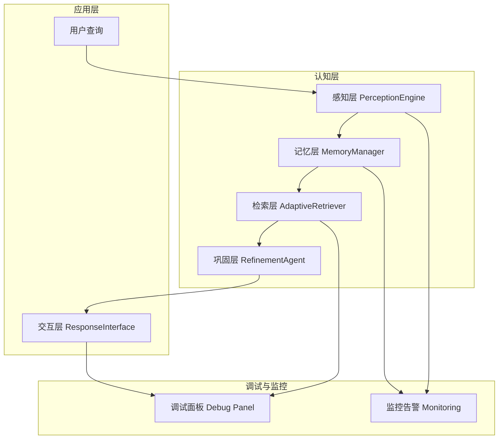
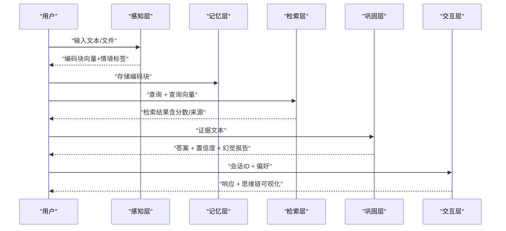
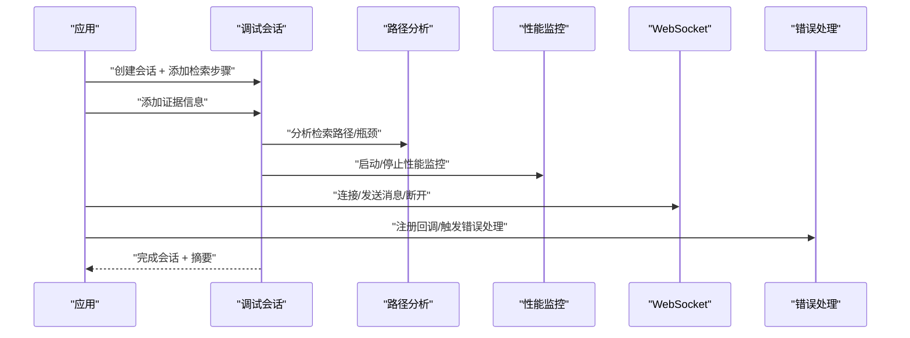
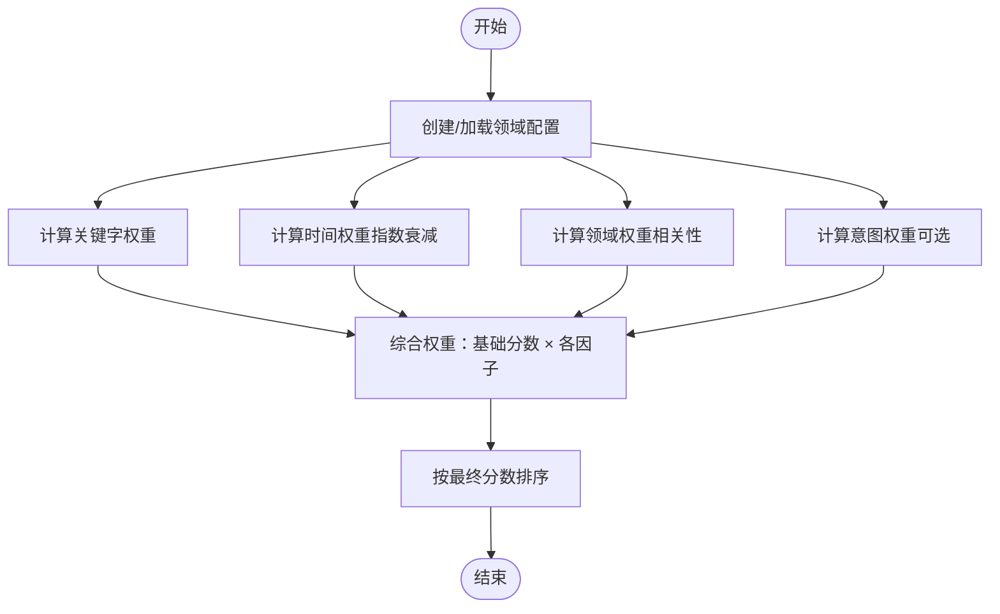
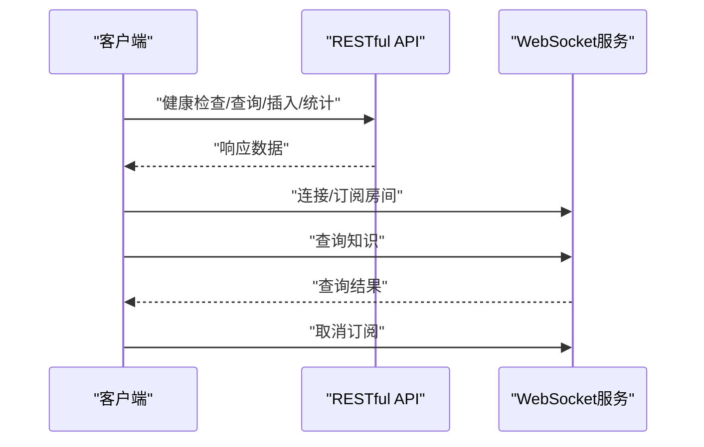
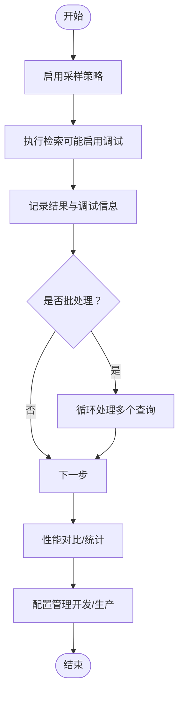
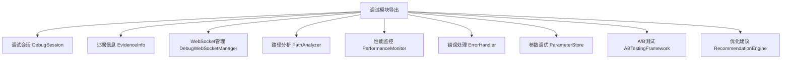
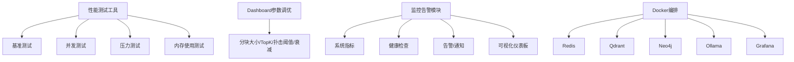

# 示例与教程

<cite>
**本文引用的文件**
- [example_usage.py](file://example/example_usage.py)
- [debug_panel_demo.py](file://example/debug_panel_demo.py)
- [domain_weight_example.py](file://example/domain_weight_example.py)
- [production_debug_example.py](file://example/production_debug_example.py)
- [example_client.py](file://interface/example_client.py)
- [README.md](file://README.md)
- [QUICKSTART.md](file://QUICKSTART.md)
- [src/dashboard/debug/__init__.py](file://src/dashboard/debug/__init__.py)
- [src/dashboard/USAGE_GUIDE.md](file://src/dashboard/USAGE_GUIDE.md)
- [src/domain/README.md](file://src/domain/README.md)
- [src/dashboard/debug/README.md](file://src/dashboard/debug/README.md)
- [devops/docker-compose.yml](file://devops/docker-compose.yml)
- [devops/Dockerfile](file://devops/Dockerfile)
- [src/monitoring/README.md](file://src/monitoring/README.md)
- [tests/performance_test.py](file://tests/performance_test.py)
</cite>

## 目录
1. [引言](#引言)
2. [项目结构](#项目结构)
3. [核心组件](#核心组件)
4. [架构总览](#架构总览)
5. [详细组件分析](#详细组件分析)
6. [依赖分析](#依赖分析)
7. [性能考虑](#性能考虑)
8. [故障排查指南](#故障排查指南)
9. [结论](#结论)
10. [附录](#附录)

## 引言
本教程面向希望快速上手并深入掌握 NecoRAG 的开发者，围绕“基础使用示例”“高级配置示例”“集成示例”三大主题，系统讲解从感知、记忆、检索、巩固到交互的完整工作流；同时覆盖调试面板的使用、生产环境部署、领域权重计算、客户端 SDK 集成、批量处理优化与性能调优等实战要点，并提供可直接运行的示例与效果说明，帮助读者在最短时间内完成端到端落地。

## 项目结构
NecoRAG 采用“五层认知架构”，示例与教程聚焦以下关键模块与示例文件：
- 基础使用示例：example/example_usage.py
- 调试面板快速入门：example/debug_panel_demo.py
- 领域权重示例：example/domain_weight_example.py
- 生产调试实战：example/production_debug_example.py
- Interface 客户端示例：interface/example_client.py
- Dashboard 使用指南：src/dashboard/USAGE_GUIDE.md
- 调试面板模块导出：src/dashboard/debug/__init__.py
- 领域权重系统文档：src/domain/README.md
- 调试面板项目总结：src/dashboard/debug/README.md
- 部署与容器编排：devops/docker-compose.yml、devops/Dockerfile
- 监控告警模块：src/monitoring/README.md
- 性能测试工具：tests/performance_test.py

```mermaid
graph TB
A["示例与教程入口<br/>example/example_usage.py"] --> B["感知层<br/>PerceptionEngine"]
A --> C["记忆层<br/>MemoryManager"]
A --> D["检索层<br/>AdaptiveRetriever"]
A --> E["巩固层<br/>RefinementAgent"]
A --> F["交互层<br/>ResponseInterface"]
G["调试面板示例<br/>example/debug_panel_demo.py"] --> H["调试会话/路径分析/性能监控"]
I["生产调试示例<br/>example/production_debug_example.py"] --> J["批处理/采样/性能对比"]
K["领域权重示例<br/>example/domain_weight_example.py"] --> L["时间权重/相关性/综合权重"]
M["Interface客户端示例<br/>interface/example_client.py"] --> N["RESTful/WebSocket集成"]
O["Dashboard使用指南<br/>src/dashboard/USAGE_GUIDE.md"] --> P["配置管理/参数调优/实时监控"]
Q["调试面板项目总结<br/>src/dashboard/debug/README.md"] --> R["可视化调试/路径分析/优化建议"]
S["部署与容器编排<br/>devops/docker-compose.yml"] --> T["Redis/Qdrant/Neo4j/Ollama/Grafana"]
U["监控告警模块<br/>src/monitoring/README.md"] --> V["系统指标/健康检查/告警/可视化"]
W["性能测试工具<br/>tests/performance_test.py"] --> X["基准/并发/压力/内存测试"]
```

**图表来源**
- [example/example_usage.py:1-252](file://example/example_usage.py#L1-L252)
- [example/debug_panel_demo.py:1-268](file://example/debug_panel_demo.py#L1-L268)
- [example/domain_weight_example.py:1-267](file://example/domain_weight_example.py#L1-L267)
- [example/production_debug_example.py:1-381](file://example/production_debug_example.py#L1-L381)
- [interface/example_client.py:1-200](file://interface/example_client.py#L1-L200)
- [src/dashboard/USAGE_GUIDE.md:1-309](file://src/dashboard/USAGE_GUIDE.md#L1-L309)
- [src/dashboard/debug/README.md:1-190](file://src/dashboard/debug/README.md#L1-L190)
- [devops/docker-compose.yml:1-164](file://devops/docker-compose.yml#L1-L164)
- [devops/Dockerfile:1-39](file://devops/Dockerfile#L1-L39)
- [src/monitoring/README.md:1-373](file://src/monitoring/README.md#L1-L373)
- [tests/performance_test.py:1-322](file://tests/performance_test.py#L1-L322)

**章节来源**
- [README.md:165-236](file://README.md#L165-L236)
- [QUICKSTART.md:1-441](file://QUICKSTART.md#L1-L441)

## 核心组件
- 感知层（PerceptionEngine）：文档解析与多维编码，输出带情境标签的编码块。
- 记忆层（MemoryManager）：分层存储（L1/L2/L3），支持检索与巩固。
- 检索层（AdaptiveRetriever）：混合检索与重排序，支持 HyDE、早停与领域权重。
- 巩固层（RefinementAgent）：生成-批评-精炼闭环，幻觉检测与知识固化。
- 交互层（ResponseInterface）：情境自适应输出，思维链可视化。
- 调试面板（Dashboard Debug）：思维路径可视化、实时监控、A/B测试、参数调优。
- 领域权重系统（Domain Weight）：时间衰减、关键字权重、领域相关性与综合权重。
- Interface 模块：RESTful API 与 WebSocket 客户端集成示例。
- 监控告警（Monitoring）：系统指标采集、健康检查、告警与可视化。
- 部署与容器编排（DevOps）：一键编排 Redis/Qdrant/Neo4j/Ollama/Grafana。

**章节来源**
- [README.md:259-482](file://README.md#L259-L482)
- [src/dashboard/debug/__init__.py:1-50](file://src/dashboard/debug/__init__.py#L1-L50)
- [src/domain/README.md:1-516](file://src/domain/README.md#L1-L516)
- [src/monitoring/README.md:1-373](file://src/monitoring/README.md#L1-L373)

## 架构总览
下图展示了从“感知-记忆-检索-巩固-交互”的完整工作流，以及调试面板与监控告警的辅助作用。

**图表来源**
- [README.md:44-94](file://README.md#L44-L94)
- [src/dashboard/debug/README.md:37-56](file://src/dashboard/debug/README.md#L37-L56)
- [src/monitoring/README.md:7-32](file://src/monitoring/README.md#L7-L32)

## 详细组件分析

### 基础使用示例（完整工作流）
本示例演示从感知编码到交互输出的完整流程，涵盖：
- 感知层：文本处理与编码，输出编码块（含向量与情境标签）。
- 记忆层：存储编码块、检索与巩固。
- 检索层：混合检索、HyDE 增强、重排序与检索路径追踪。
- 巩固层：答案生成、置信度与幻觉检测。
- 交互层：情境自适应输出、思维链可视化与用户偏好分析。

**图表来源**
- [example/example_usage.py:12-252](file://example/example_usage.py#L12-L252)

**章节来源**
- [example/example_usage.py:12-252](file://example/example_usage.py#L12-L252)

### 调试面板使用（快速入门与实战）
调试面板提供“思维路径可视化、实时监控、A/B测试、参数调优、路径分析与优化建议”。示例涵盖：
- 快速入门：创建调试会话、模拟检索步骤、添加证据、路径分析、性能监控、完成会话与摘要。
- 高级功能：WebSocket 连接管理、错误处理机制、通知回调注册与触发。
- 生产实战：在真实检索流程中集成调试、批处理示例、性能对比、采样策略与配置管理。

**图表来源**
- [example/debug_panel_demo.py:16-187](file://example/debug_panel_demo.py#L16-L187)
- [example/production_debug_example.py:14-153](file://example/production_debug_example.py#L14-L153)

**章节来源**
- [example/debug_panel_demo.py:16-268](file://example/debug_panel_demo.py#L16-L268)
- [example/production_debug_example.py:14-381](file://example/production_debug_example.py#L14-L381)
- [src/dashboard/debug/__init__.py:1-50](file://src/dashboard/debug/__init__.py#L1-L50)
- [src/dashboard/debug/README.md:1-190](file://src/dashboard/debug/README.md#L1-L190)

### 领域权重系统（配置与计算）
领域权重系统通过“关键字权重 + 时间权重 + 领域权重 + 意图权重”融合，动态提升相关知识的检索权重。示例涵盖：
- 领域配置：创建/自定义领域、关键字分级与权重因子。
- 时间权重：指数衰减模型、不同领域衰减系数与时间分级。
- 相关性评分：领域等级、关键字得分、密度得分与权重乘数。
- 综合权重：基础相似度分数与多因子融合，按最终分数排序。
- 配置持久化：临时目录下的配置保存与加载。

**图表来源**
- [src/domain/README.md:24-275](file://src/domain/README.md#L24-L275)
- [example/domain_weight_example.py:22-267](file://example/domain_weight_example.py#L22-L267)

**章节来源**
- [src/domain/README.md:1-516](file://src/domain/README.md#L1-L516)
- [example/domain_weight_example.py:22-267](file://example/domain_weight_example.py#L22-L267)

### 客户端SDK集成（RESTful与WebSocket）
Interface 模块提供 RESTful API 与 WebSocket 的客户端示例，便于在业务系统中集成：
- RESTful 客户端：健康检查、知识查询、插入知识、统计信息。
- WebSocket 客户端：连接、查询、订阅/取消订阅房间。
- 综合演示：先通过 RESTful 插入知识，再通过 WebSocket 实时查询。

**图表来源**
- [interface/example_client.py:13-200](file://interface/example_client.py#L13-L200)

**章节来源**
- [interface/example_client.py:13-200](file://interface/example_client.py#L13-L200)

### 生产环境调试与批处理（采样、对比与配置）
生产调试示例展示如何在真实检索系统中集成调试面板，包括：
- 采样策略：基于用户 ID 哈希或随机采样，控制调试开销。
- 批处理：对多个查询进行批处理，统计吞吐与平均响应时间。
- 性能对比：调试模式 vs 非调试模式，评估性能开销。
- 配置管理：开发/生产环境的差异配置（采样率、日志级别、存储保留、WebSocket开关）。

**图表来源**
- [example/production_debug_example.py:254-381](file://example/production_debug_example.py#L254-L381)

**章节来源**
- [example/production_debug_example.py:254-381](file://example/production_debug_example.py#L254-L381)

## 依赖分析
调试面板模块导出的公共接口与组件，便于在应用中按需集成。

**图表来源**
- [src/dashboard/debug/__init__.py:28-50](file://src/dashboard/debug/__init__.py#L28-L50)

**章节来源**
- [src/dashboard/debug/__init__.py:1-50](file://src/dashboard/debug/__init__.py#L1-L50)

## 性能考虑
- 性能测试工具提供基准测试、并发测试、压力测试与内存使用测试，支持计算最小/最大/平均/中位数/标准差/百分位数与吞吐量。
- Dashboard 使用指南提供参数调优建议（分块大小、top_k、扑击阈值、记忆衰减等）。
- 监控告警模块提供系统指标采集、健康检查、告警与可视化，便于定位性能瓶颈。
- Docker 编排文件定义了 Redis/Qdrant/Neo4j/Ollama/Grafana 的服务与端口映射，便于一键部署与资源监控。

**图表来源**
- [tests/performance_test.py:31-322](file://tests/performance_test.py#L31-L322)
- [src/dashboard/USAGE_GUIDE.md:281-287](file://src/dashboard/USAGE_GUIDE.md#L281-L287)
- [src/monitoring/README.md:9-32](file://src/monitoring/README.md#L9-L32)
- [devops/docker-compose.yml:4-164](file://devops/docker-compose.yml#L4-L164)

**章节来源**
- [tests/performance_test.py:31-322](file://tests/performance_test.py#L31-L322)
- [src/dashboard/USAGE_GUIDE.md:281-287](file://src/dashboard/USAGE_GUIDE.md#L281-L287)
- [src/monitoring/README.md:1-373](file://src/monitoring/README.md#L1-L373)
- [devops/docker-compose.yml:1-164](file://devops/docker-compose.yml#L1-L164)

## 故障排查指南
- 调试面板常见问题：会话状态异常、路径分析无结果、性能监控无数据、WebSocket 连接失败。
- Dashboard 使用问题：端口占用、配置未生效、Profile 导入导出失败。
- 领域权重异常：关键字权重未生效、时间衰减过快/过慢、相关性评分异常。
- 监控告警问题：指标采集失败、健康检查超时、告警重复发送。
- 容器编排问题：服务健康检查失败、端口冲突、数据卷挂载异常。

**章节来源**
- [src/dashboard/debug/README.md:285-306](file://src/dashboard/debug/README.md#L285-L306)
- [src/dashboard/USAGE_GUIDE.md:288-306](file://src/dashboard/USAGE_GUIDE.md#L288-L306)
- [src/domain/README.md:403-464](file://src/domain/README.md#L403-L464)
- [src/monitoring/README.md:285-321](file://src/monitoring/README.md#L285-L321)
- [devops/docker-compose.yml:16-95](file://devops/docker-compose.yml#L16-L95)

## 结论
通过本教程，您可以在本地快速完成 NecoRAG 的基础使用与调试面板体验，并掌握领域权重计算、客户端 SDK 集成、生产调试与批处理优化、性能测试与监控告警等关键技能。建议结合 Dashboard 的可视化调试与监控，持续迭代参数与策略，逐步实现从入门到精通的进阶路径。

## 附录

### 快速开始与运行步骤
- 安装依赖与运行示例：参考 [QUICKSTART.md:5-46](file://QUICKSTART.md#L5-L46)。
- 启动 Dashboard：参考 [README.md:216-236](file://README.md#L216-L236) 与 [src/dashboard/USAGE_GUIDE.md:26-56](file://src/dashboard/USAGE_GUIDE.md#L26-L56)。
- 运行示例脚本：
  - 基础使用：python example/example_usage.py
  - 调试面板：python example/debug_panel_demo.py
  - 领域权重：python example/domain_weight_example.py
  - 生产调试：python example/production_debug_example.py
  - Interface 客户端：python interface/example_client.py

**章节来源**
- [QUICKSTART.md:5-46](file://QUICKSTART.md#L5-L46)
- [README.md:216-236](file://README.md#L216-L236)
- [src/dashboard/USAGE_GUIDE.md:26-56](file://src/dashboard/USAGE_GUIDE.md#L26-L56)

### Dashboard 与调试面板使用指南
- Dashboard 功能概览与启动方式：参考 [src/dashboard/USAGE_GUIDE.md:1-120](file://src/dashboard/USAGE_GUIDE.md#L1-120)。
- 调试面板项目总结与使用价值：参考 [src/dashboard/debug/README.md:1-190](file://src/dashboard/debug/README.md#L1-190)。

**章节来源**
- [src/dashboard/USAGE_GUIDE.md:1-120](file://src/dashboard/USAGE_GUIDE.md#L1-L120)
- [src/dashboard/debug/README.md:1-190](file://src/dashboard/debug/README.md#L1-L190)

### 部署与容器编排
- Docker Compose 编排：Redis/Qdrant/Neo4j/Ollama/Grafana 服务与端口映射。
- Dockerfile 构建：基础镜像、依赖安装、健康检查与启动命令。

**章节来源**
- [devops/docker-compose.yml:1-164](file://devops/docker-compose.yml#L1-L164)
- [devops/Dockerfile:1-39](file://devops/Dockerfile#L1-L39)