# 调试面板演示

<cite>
**本文档引用的文件**
- [DebugPanel.html](file://src/dashboard/components/DebugPanel.html)
- [ComponentIntegrator.js](file://src/dashboard/components/ComponentIntegrator.js)
- [RetrievalTraceTimeline.html](file://src/dashboard/components/RetrievalTraceTimeline.html)
- [EvidenceCard.html](file://src/dashboard/components/EvidenceCard.html)
- [ReasoningChainChart.html](file://src/dashboard/components/ReasoningChainChart.html)
- [PerformanceDashboard.html](file://src/dashboard/components/PerformanceDashboard.html)
- [__init__.py](file://src/dashboard/debug/__init__.py)
- [api.py](file://src/dashboard/debug/api.py)
- [models.py](file://src/dashboard/debug/models.py)
- [websocket.py](file://src/dashboard/debug/websocket.py)
- [performance.py](file://src/dashboard/debug/performance.py)
- [analyzer.py](file://src/dashboard/debug/analyzer.py)
- [path_analyzer.py](file://src/dashboard/debug/path_analyzer.py)
- [recommendation.py](file://src/dashboard/debug/recommendation.py)
- [push_service.py](file://src/dashboard/debug/push_service.py)
</cite>

## 目录
1. [简介](#简介)
2. [项目结构](#项目结构)
3. [核心组件](#核心组件)
4. [架构概览](#架构概览)
5. [详细组件分析](#详细组件分析)
6. [依赖关系分析](#依赖关系分析)
7. [性能考虑](#性能考虑)
8. [故障排除指南](#故障排除指南)
9. [结论](#结论)

## 简介

NecoRAG调试面板是一个功能强大的可视化调试工具，专为监控和分析认知架构系统的运行状态而设计。该面板提供了实时数据流监控、检索路径分析、性能指标跟踪等功能，帮助开发者有效诊断和优化系统性能。

调试面板采用现代化的前端架构，结合FastAPI后端服务，实现了完整的实时监控生态系统。通过直观的可视化界面，开发者可以深入分析系统的各个方面，从检索路径到推理过程，从性能指标到错误处理。

## 项目结构

调试面板系统采用模块化架构设计，主要分为以下几个核心部分：

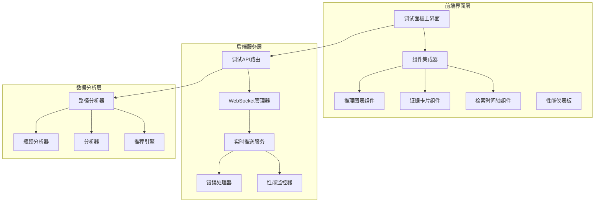

**图表来源**
- [DebugPanel.html:1-899](file://src/dashboard/components/DebugPanel.html#L1-L899)
- [ComponentIntegrator.js:1-656](file://src/dashboard/components/ComponentIntegrator.js#L1-L656)
- [api.py:1-557](file://src/dashboard/debug/api.py#L1-L557)

**章节来源**
- [DebugPanel.html:1-899](file://src/dashboard/components/DebugPanel.html#L1-L899)
- [ComponentIntegrator.js:1-656](file://src/dashboard/components/ComponentIntegrator.js#L1-L656)
- [api.py:1-557](file://src/dashboard/debug/api.py#L1-L557)

## 核心组件

### 调试面板主界面

调试面板主界面采用现代化的设计风格，提供了完整的调试功能入口。界面包含以下主要功能区域：

- **头部工具栏**：显示连接状态和控制按钮
- **侧边栏会话列表**：管理多个调试会话
- **主视图区域**：包含五个主要视图标签页

### 组件集成器

组件集成器负责动态加载和管理各种可视化组件，支持以下组件类型：

- **检索时间轴组件**：展示检索步骤的详细流程
- **证据网格组件**：可视化证据来源和质量
- **推理图表组件**：分析推理过程和置信度变化

### 实时数据推送

系统通过WebSocket实现实时数据推送，支持以下数据类型的实时更新：

- 调试会话状态更新
- 检索步骤进度
- 证据添加通知
- 推理过程更新
- 性能指标变化

**章节来源**
- [DebugPanel.html:283-410](file://src/dashboard/components/DebugPanel.html#L283-L410)
- [ComponentIntegrator.js:6-94](file://src/dashboard/components/ComponentIntegrator.js#L6-L94)
- [websocket.py:49-554](file://src/dashboard/debug/websocket.py#L49-L554)

## 架构概览

调试面板采用分层架构设计，确保了系统的可扩展性和可维护性：

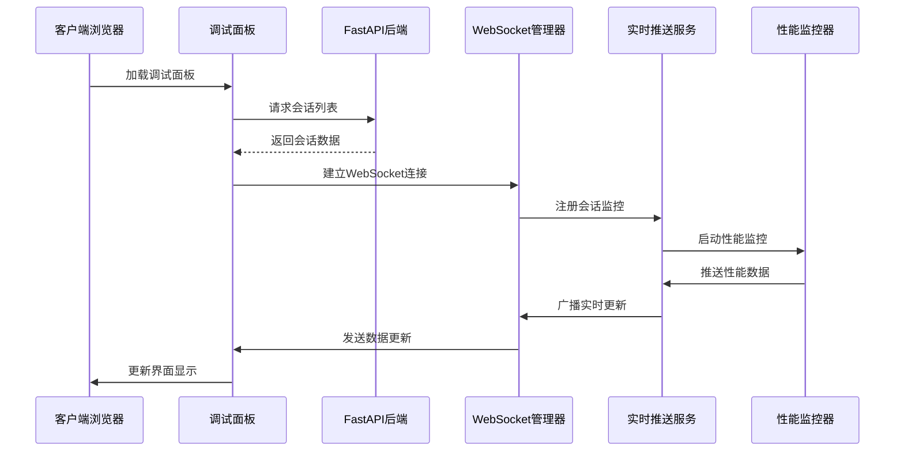

**图表来源**
- [DebugPanel.html:428-454](file://src/dashboard/components/DebugPanel.html#L428-L454)
- [api.py:91-128](file://src/dashboard/debug/api.py#L91-L128)
- [websocket.py:92-130](file://src/dashboard/debug/websocket.py#L92-L130)
- [push_service.py:29-44](file://src/dashboard/debug/push_service.py#L29-L44)

### 数据流架构

系统采用事件驱动的数据流架构，确保了数据的一致性和实时性：

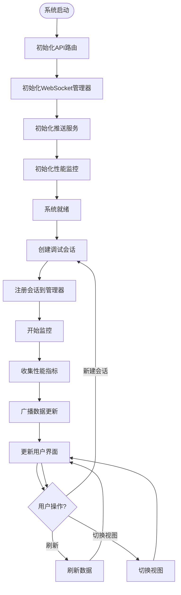

**图表来源**
- [performance.py:130-154](file://src/dashboard/debug/performance.py#L130-L154)
- [push_service.py:63-133](file://src/dashboard/debug/push_service.py#L63-L133)
- [websocket.py:200-240](file://src/dashboard/debug/websocket.py#L200-L240)

## 详细组件分析

### 调试会话管理

调试会话是整个调试系统的核心概念，负责跟踪和管理单个调试过程的完整生命周期。

#### 会话数据模型

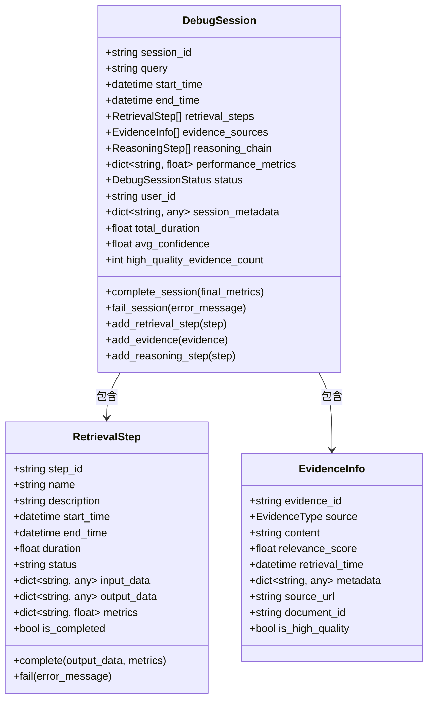

**图表来源**
- [models.py:186-276](file://src/dashboard/debug/models.py#L186-L276)
- [models.py:78-144](file://src/dashboard/debug/models.py#L78-L144)
- [models.py:30-75](file://src/dashboard/debug/models.py#L30-L75)

#### 会话状态管理

会话状态管理确保了调试过程的完整性和可追溯性：

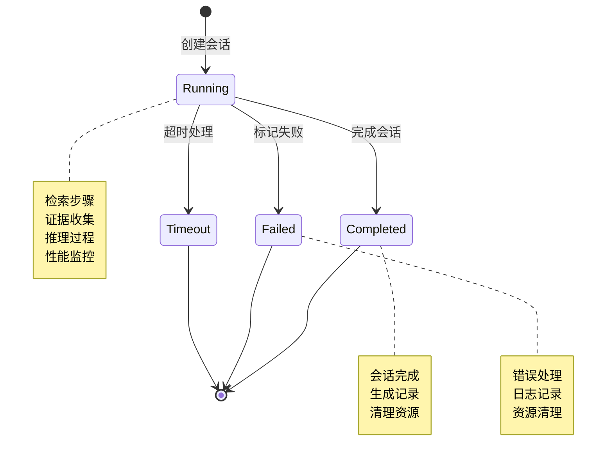

**图表来源**
- [models.py:13-19](file://src/dashboard/debug/models.py#L13-L19)
- [models.py:215-227](file://src/dashboard/debug/models.py#L215-L227)

**章节来源**
- [models.py:13-336](file://src/dashboard/debug/models.py#L13-L336)

### 实时监控系统

实时监控系统是调试面板的核心功能之一，提供了系统运行状态的实时可视化。

#### 性能监控器

性能监控器负责收集和分析系统的关键性能指标：

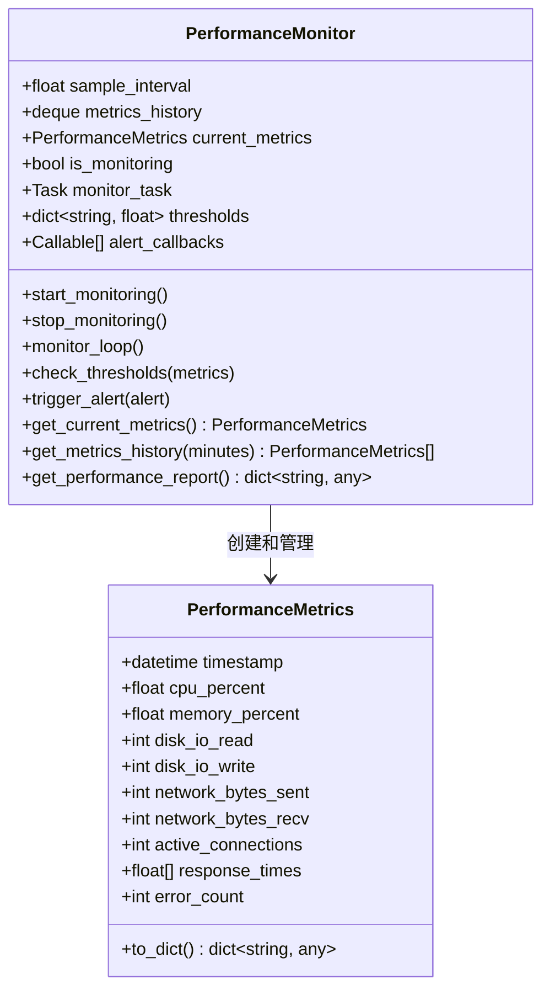

**图表来源**
- [performance.py:103-373](file://src/dashboard/debug/performance.py#L103-L373)
- [performance.py:19-78](file://src/dashboard/debug/performance.py#L19-L78)

#### 错误处理机制

错误处理机制确保了系统的稳定性和可靠性：

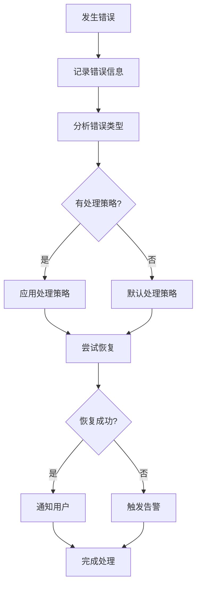

**图表来源**
- [performance.py:374-471](file://src/dashboard/debug/performance.py#L374-L471)

**章节来源**
- [performance.py:1-658](file://src/dashboard/debug/performance.py#L1-L658)

### 路径分析系统

路径分析系统提供了深入的系统行为分析能力，帮助开发者理解复杂的处理流程。

#### 路径分析器

路径分析器能够识别性能瓶颈和优化机会：

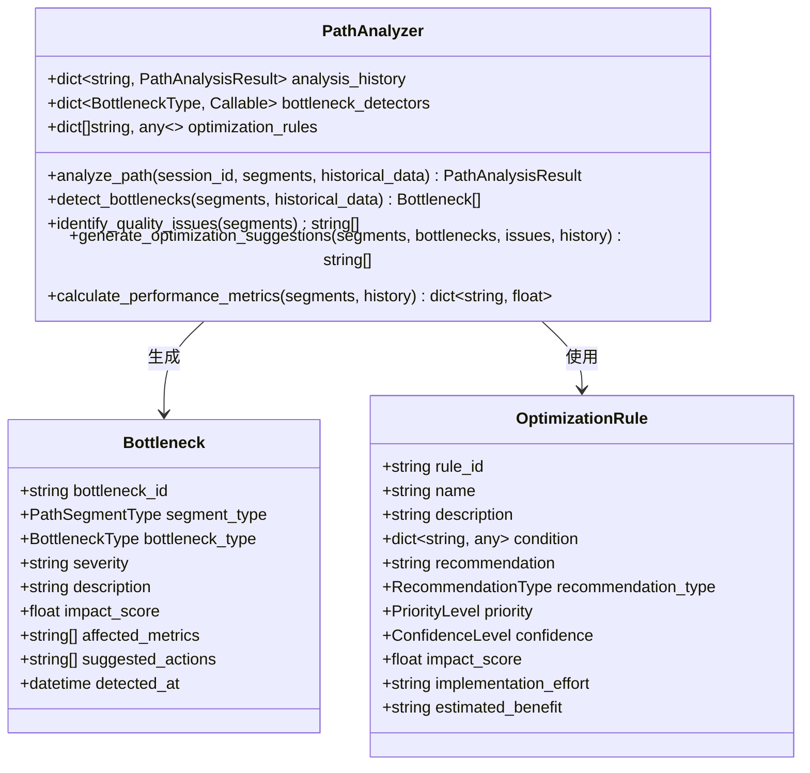

**图表来源**
- [path_analyzer.py:126-237](file://src/dashboard/debug/path_analyzer.py#L126-L237)
- [path_analyzer.py:96-124](file://src/dashboard/debug/path_analyzer.py#L96-L124)
- [path_analyzer.py:46-67](file://src/dashboard/debug/path_analyzer.py#L46-L67)

#### 推荐引擎

推荐引擎基于AI分析提供智能化的优化建议：

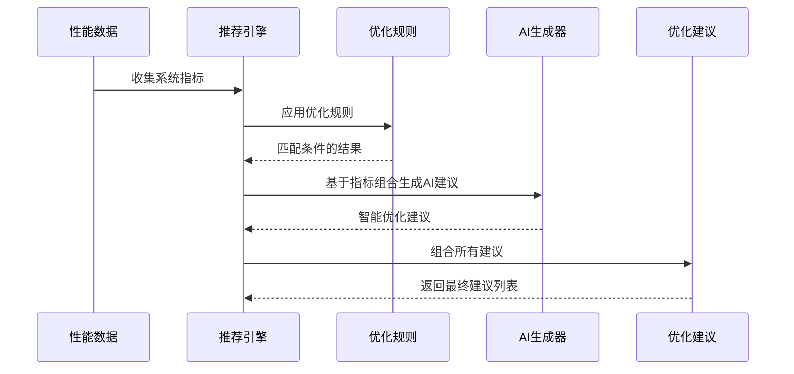

**图表来源**
- [recommendation.py:157-714](file://src/dashboard/debug/recommendation.py#L157-L714)

**章节来源**
- [path_analyzer.py:1-628](file://src/dashboard/debug/path_analyzer.py#L1-L628)
- [recommendation.py:1-853](file://src/dashboard/debug/recommendation.py#L1-L853)

### 可视化组件系统

可视化组件系统提供了丰富的数据展示能力，支持多种图表和界面元素。

#### 检索时间轴组件

检索时间轴组件展示了完整的检索过程：

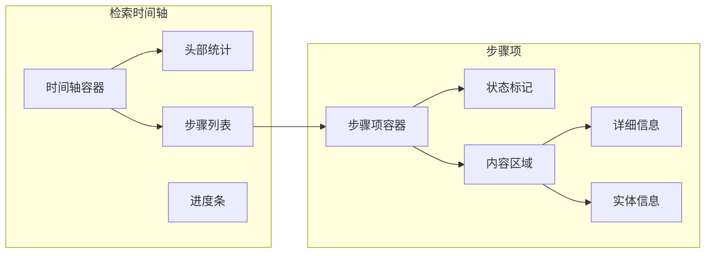

**图表来源**
- [RetrievalTraceTimeline.html:261-297](file://src/dashboard/components/RetrievalTraceTimeline.html#L261-L297)
- [RetrievalTraceTimeline.html:410-447](file://src/dashboard/components/RetrievalTraceTimeline.html#L410-L447)

#### 证据网格组件

证据网格组件提供了证据来源的可视化展示：

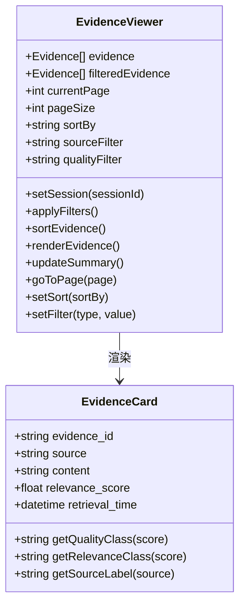

**图表来源**
- [EvidenceCard.html:415-683](file://src/dashboard/components/EvidenceCard.html#L415-L683)
- [EvidenceCard.html:545-597](file://src/dashboard/components/EvidenceCard.html#L545-L597)

#### 推理图表组件

推理图表组件分析推理过程和置信度变化：

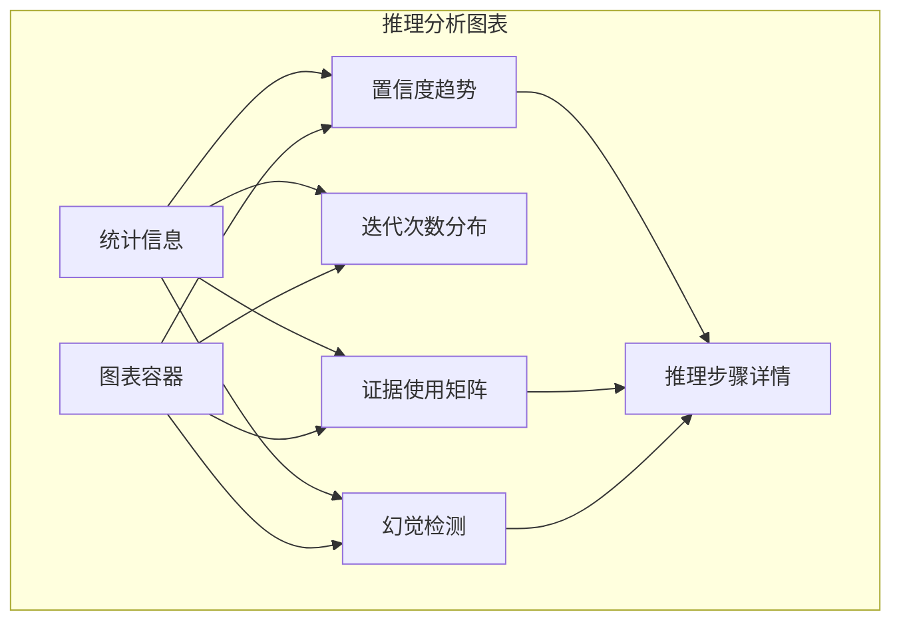

**图表来源**
- [ReasoningChainChart.html:415-504](file://src/dashboard/components/ReasoningChainChart.html#L415-L504)
- [ReasoningChainChart.html:567-736](file://src/dashboard/components/ReasoningChainChart.html#L567-L736)

**章节来源**
- [RetrievalTraceTimeline.html:1-572](file://src/dashboard/components/RetrievalTraceTimeline.html#L1-L572)
- [EvidenceCard.html:1-740](file://src/dashboard/components/EvidenceCard.html#L1-L740)
- [ReasoningChainChart.html:1-857](file://src/dashboard/components/ReasoningChainChart.html#L1-L857)

## 依赖关系分析

调试面板系统具有清晰的模块化依赖关系，确保了系统的可维护性和可扩展性。

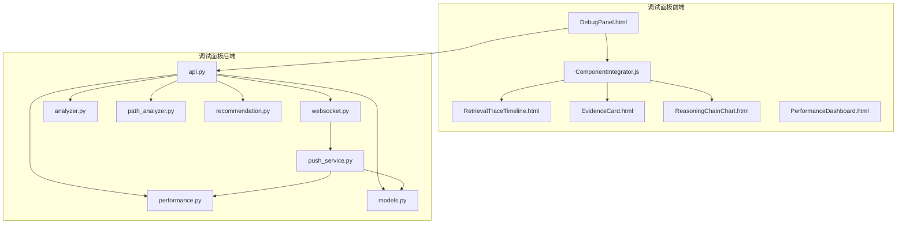

**图表来源**
- [__init__.py:1-50](file://src/dashboard/debug/__init__.py#L1-L50)
- [DebugPanel.html:411-413](file://src/dashboard/components/DebugPanel.html#L411-L413)
- [ComponentIntegrator.js:9-14](file://src/dashboard/components/ComponentIntegrator.js#L9-L14)

### 数据流依赖

系统内部的数据流依赖关系确保了数据的一致性和完整性：

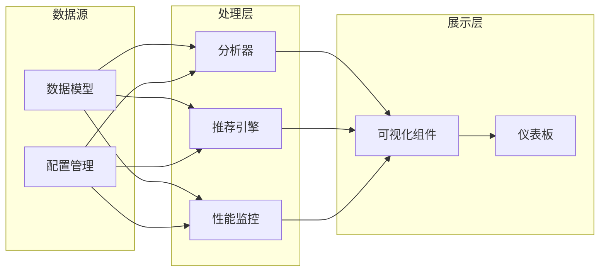

**图表来源**
- [models.py:1-336](file://src/dashboard/debug/models.py#L1-L336)
- [analyzer.py:1-410](file://src/dashboard/debug/analyzer.py#L1-L410)
- [recommendation.py:1-853](file://src/dashboard/debug/recommendation.py#L1-L853)

**章节来源**
- [__init__.py:1-50](file://src/dashboard/debug/__init__.py#L1-L50)
- [models.py:1-336](file://src/dashboard/debug/models.py#L1-L336)

## 性能考虑

调试面板系统在设计时充分考虑了性能优化，采用了多种技术和策略来确保系统的高效运行。

### 内存管理

系统采用了智能的内存管理策略：

- **数据结构优化**：使用高效的Python数据结构如deque和defaultdict
- **内存池管理**：对频繁创建的对象进行池化管理
- **垃圾回收优化**：合理设置垃圾回收参数，避免长时间停顿

### 网络性能

WebSocket连接管理确保了低延迟的数据传输：

- **连接池管理**：限制最大连接数，防止资源耗尽
- **心跳机制**：定期发送心跳包维持连接活跃
- **自动重连**：网络中断时自动重连机制

### 前端性能

前端组件采用了多种优化技术：

- **懒加载机制**：组件按需加载，减少初始加载时间
- **虚拟滚动**：大数据集时使用虚拟滚动技术
- **防抖节流**：对高频操作进行防抖节流处理

## 故障排除指南

### 常见问题诊断

#### 连接问题

**问题症状**：调试面板无法连接到后端服务

**诊断步骤**：
1. 检查网络连接状态
2. 验证WebSocket连接是否建立
3. 查看浏览器控制台错误信息
4. 确认后端服务是否正常运行

**解决方案**：
- 检查防火墙设置
- 验证端口是否被占用
- 确认跨域配置正确
- 重启后端服务

#### 性能问题

**问题症状**：调试面板响应缓慢或卡顿

**诊断步骤**：
1. 检查系统资源使用情况
2. 分析JavaScript性能瓶颈
3. 监控WebSocket连接状态
4. 查看内存使用情况

**解决方案**：
- 优化数据加载策略
- 实施数据分页机制
- 减少不必要的DOM操作
- 实现数据缓存机制

#### 数据显示问题

**问题症状**：调试数据无法正确显示

**诊断步骤**：
1. 检查API响应状态
2. 验证数据格式正确性
3. 确认WebSocket消息处理
4. 查看前端组件渲染状态

**解决方案**：
- 实现数据验证机制
- 添加错误边界处理
- 实现数据格式转换
- 增加重试机制

### 调试技巧

#### 日志分析

系统提供了多层次的日志记录机制：

- **系统日志**：记录系统级别的运行信息
- **调试日志**：详细的调试信息和错误堆栈
- **性能日志**：性能指标和监控数据
- **用户行为日志**：用户操作和交互记录

#### 性能监控

实时监控系统的关键指标：

- **响应时间**：API请求和页面渲染时间
- **内存使用**：系统和应用内存使用情况
- **CPU使用率**：处理器资源占用情况
- **连接数**：WebSocket连接数量统计

**章节来源**
- [performance.py:248-320](file://src/dashboard/debug/performance.py#L248-L320)
- [websocket.py:398-421](file://src/dashboard/debug/websocket.py#L398-L421)

## 结论

NecoRAG调试面板是一个功能完整、架构清晰的可视化调试工具。通过模块化的组件设计和实时的数据监控机制，它为开发者提供了强大的系统分析和优化能力。

系统的主要优势包括：

1. **完整的功能覆盖**：从基础的会话管理到高级的路径分析
2. **实时数据监控**：通过WebSocket实现实时数据更新
3. **丰富的可视化**：多种图表和界面组件满足不同分析需求
4. **智能分析能力**：基于AI的推荐引擎提供优化建议
5. **良好的扩展性**：模块化设计便于功能扩展和定制

调试面板不仅能够帮助开发者诊断和解决现有问题，更重要的是能够预防潜在问题的发生，提高系统的整体质量和稳定性。通过持续使用调试面板，开发者可以更好地理解和优化复杂的认知架构系统。

随着系统的不断发展和完善，调试面板将继续演进，为NecoRAG项目提供更加强大和智能的调试支持。