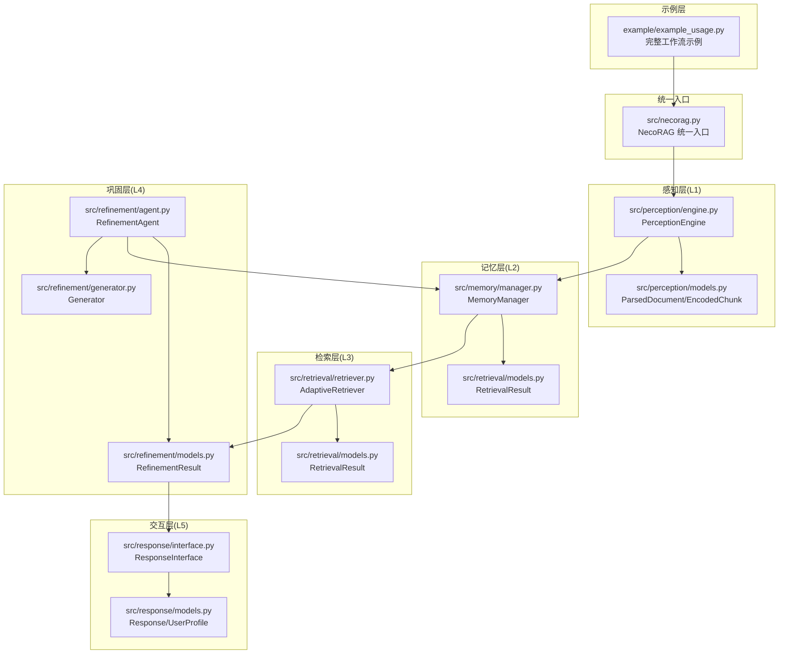
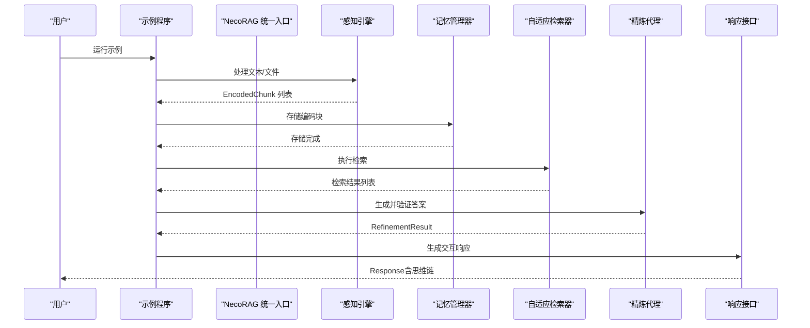
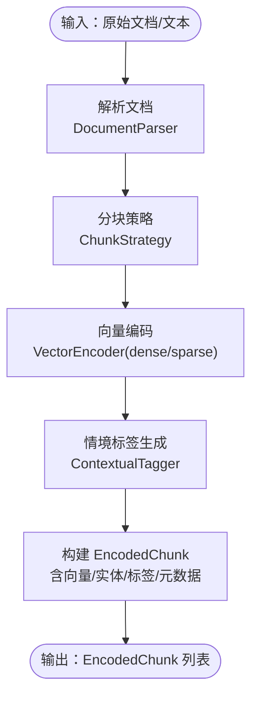
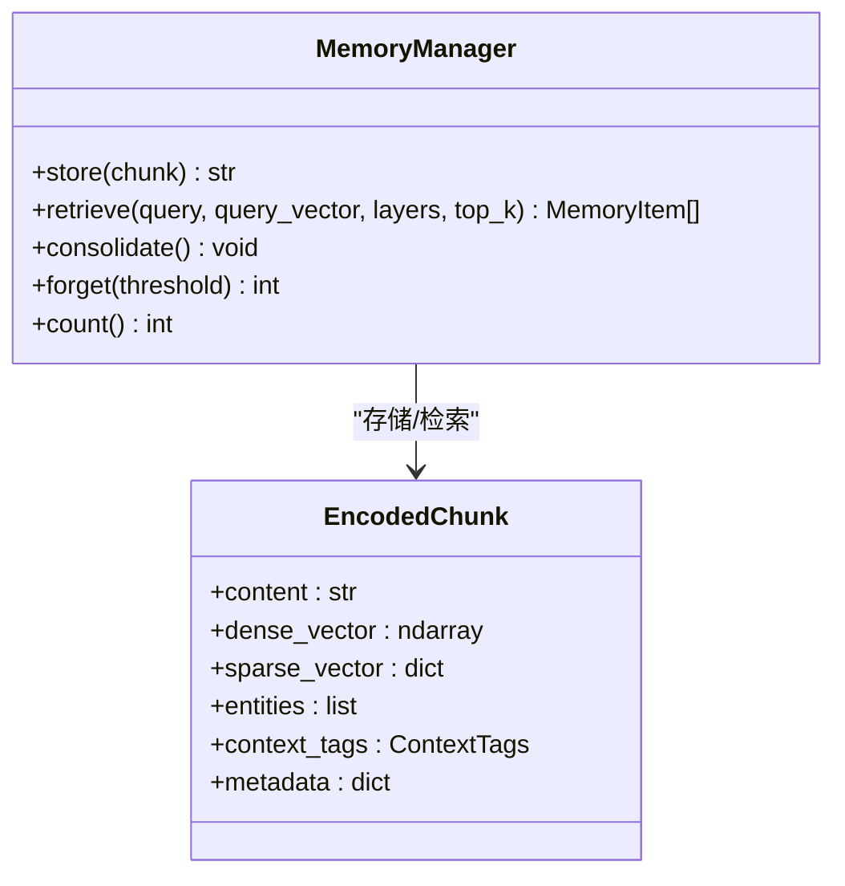
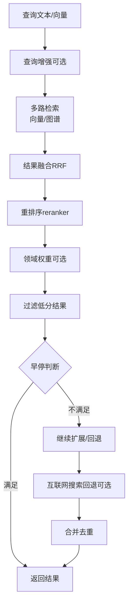
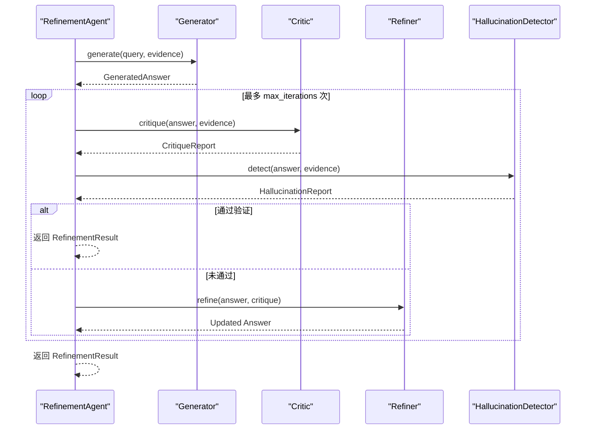
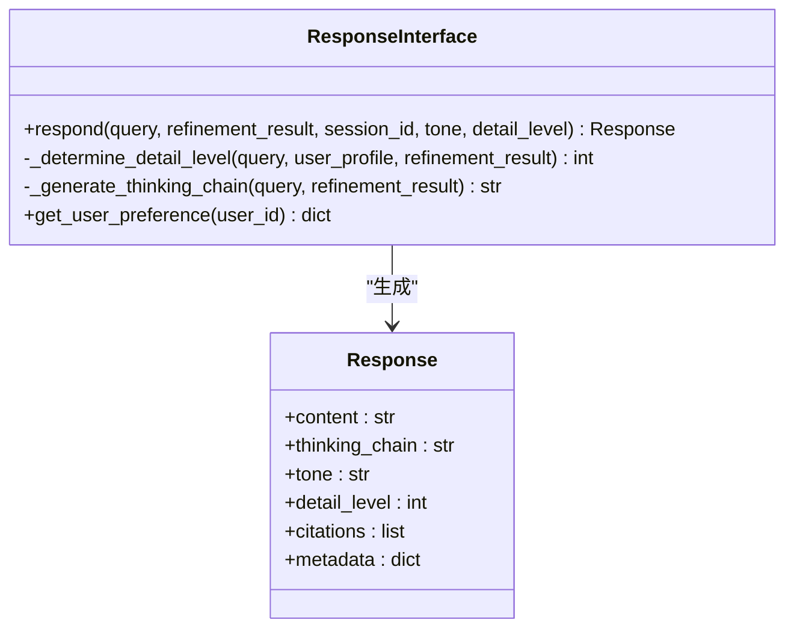
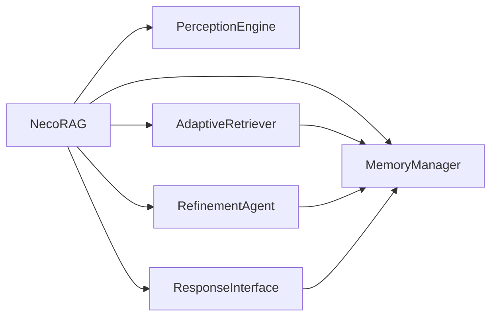

# 基础使用示例

<cite>
**本文引用的文件**
- [example_usage.py](file://example/example_usage.py)
- [necorag.py](file://src/necorag.py)
- [engine.py](file://src/perception/engine.py)
- [manager.py](file://src/memory/manager.py)
- [retriever.py](file://src/retrieval/retriever.py)
- [generator.py](file://src/refinement/generator.py)
- [agent.py](file://src/refinement/agent.py)
- [interface.py](file://src/response/interface.py)
- [models.py](file://src/perception/models.py)
- [models.py](file://src/retrieval/models.py)
- [models.py](file://src/refinement/models.py)
- [models.py](file://src/response/models.py)
- [config.py](file://src/core/config.py)
- [knowledge_base_example.py](file://example/knowledge_base_example.py)
</cite>

## 目录
1. [简介](#简介)
2. [项目结构](#项目结构)
3. [核心组件](#核心组件)
4. [架构总览](#架构总览)
5. [详细组件分析](#详细组件分析)
6. [依赖关系分析](#依赖关系分析)
7. [性能考虑](#性能考虑)
8. [故障排查指南](#故障排查指南)
9. [结论](#结论)
10. [附录](#附录)

## 简介
本文件面向初学者与开发者，围绕 NecoRAG 的基础使用示例，系统讲解从感知层到交互层的完整工作流程。文档聚焦以下能力：
- 文档解析与编码：将原始文档或文本切分为可向量化编码的块，并打上情境标签
- 知识存储与检索：将编码后的知识写入三层记忆（工作记忆、语义记忆、情景图谱），并支持向量检索
- 智能检索与重排序：多路检索、融合、重排序、早停控制、领域权重与 HyDE 增强
- 答案生成与验证：生成器、批评者、精炼器、幻觉检测与知识固化/修剪
- 情境自适应响应：语气、详细程度、思维链可视化、用户画像与偏好分析

同时，文档提供实际运行示例与预期输出说明，解释各组件间的协作关系与数据传递过程，并给出错误处理与配置参数影响的说明。

## 项目结构
NecoRAG 采用分层架构，典型调用链为：感知层 → 记忆层 → 检索层 → 巩固层 → 交互层。示例程序 example/example_usage.py 展示了从头到尾的端到端流程；src/necorag.py 提供统一入口 NecoRAG 类，封装了上述各层组件的初始化与编排。

图表来源
- [example_usage.py:12-252](file://example/example_usage.py#L12-L252)
- [necorag.py:51-149](file://src/necorag.py#L51-L149)
- [engine.py:20-195](file://src/perception/engine.py#L20-L195)
- [manager.py:20-212](file://src/memory/manager.py#L20-L212)
- [retriever.py:135-309](file://src/retrieval/retriever.py#L135-L309)
- [generator.py:16-209](file://src/refinement/generator.py#L16-L209)
- [agent.py:20-164](file://src/refinement/agent.py#L20-L164)
- [interface.py:20-232](file://src/response/interface.py#L20-L232)

章节来源
- [example_usage.py:12-252](file://example/example_usage.py#L12-L252)
- [necorag.py:51-149](file://src/necorag.py#L51-L149)

## 核心组件
- 感知引擎（PerceptionEngine）：负责文档解析、分块、向量编码、情境标签生成与统一处理入口
- 记忆管理器（MemoryManager）：统一管理三层记忆，提供存储、检索、巩固与主动遗忘
- 自适应检索器（AdaptiveRetriever）：多路检索、融合、重排序、早停控制、领域权重、HyDE 增强与互联网搜索回退
- 精炼代理（RefinementAgent）：生成器-批评者-精炼器闭环，幻觉检测，知识固化与修剪
- 响应接口（ResponseInterface）：情境自适应生成、语气与详细程度适配、思维链可视化、用户画像与偏好分析

章节来源
- [engine.py:20-195](file://src/perception/engine.py#L20-L195)
- [manager.py:20-212](file://src/memory/manager.py#L20-L212)
- [retriever.py:135-309](file://src/retrieval/retriever.py#L135-L309)
- [agent.py:20-164](file://src/refinement/agent.py#L20-L164)
- [interface.py:20-232](file://src/response/interface.py#L20-L232)

## 架构总览
下图展示 NecoRAG 从感知到交互的端到端流程，以及关键数据模型之间的映射关系。

图表来源
- [example_usage.py:218-252](file://example/example_usage.py#L218-L252)
- [necorag.py:390-513](file://src/necorag.py#L390-L513)
- [engine.py:140-195](file://src/perception/engine.py#L140-L195)
- [manager.py:52-159](file://src/memory/manager.py#L52-L159)
- [retriever.py:224-309](file://src/retrieval/retriever.py#L224-L309)
- [agent.py:65-141](file://src/refinement/agent.py#L65-L141)
- [interface.py:59-140](file://src/response/interface.py#L59-L140)

## 详细组件分析

### 感知层：文档解析与编码
- 功能要点
  - 支持多种分块策略（固定、语义、结构化、弹性、句子级）
  - 文档解析、向量编码（稠密/稀疏）、实体抽取、情境标签生成
  - 统一处理入口：process_file/process_text，返回 EncodedChunk 列表
- 关键参数
  - model：向量编码模型名称
  - chunk_size/chunk_overlap：基础分块大小与重叠
  - min_chunk_size/target_chunk_size/max_chunk_size：弹性分块范围
  - enable_elastic_chunking/semantic_boundaries：弹性分块开关与语义边界优先级
- 数据模型
  - ParsedDocument：解析后的文档结构
  - EncodedChunk：编码后的文本块（含稠密向量、稀疏向量、实体、情境标签、元数据）

图表来源
- [engine.py:77-195](file://src/perception/engine.py#L77-L195)
- [models.py:14-62](file://src/perception/models.py#L14-L62)

章节来源
- [engine.py:20-195](file://src/perception/engine.py#L20-L195)
- [models.py:14-62](file://src/perception/models.py#L14-L62)

### 记忆层：知识存储与检索
- 功能要点
  - 存储：将 EncodedChunk 写入 L2 语义记忆，实体写入 L3 情景图谱
  - 检索：基于查询向量在 L2 语义记忆中搜索，返回 MemoryItem 列表
  - 巩固：应用记忆衰减，归档低权重记忆
  - 主动遗忘：按阈值删除低价值记忆
- 关键参数
  - decay_rate：记忆衰减速率
  - top_k：检索返回数量
- 数据模型
  - MemoryItem：记忆条目（含内容、向量、元数据）
  - EncodedChunk：感知层输出

图表来源
- [manager.py:20-212](file://src/memory/manager.py#L20-L212)
- [models.py:14-62](file://src/perception/models.py#L14-L62)

章节来源
- [manager.py:20-212](file://src/memory/manager.py#L20-L212)

### 检索层：智能检索与重排序
- 功能要点
  - 多路检索：向量检索、图谱检索（预留）
  - 结果融合：倒数秩融合（Reciprocal Rank Fusion）
  - 重排序：基于 BGE-Reranker-v2 的交叉编码重排序
  - 早停控制：基于置信度阈值与边际收益的智能终止
  - 领域权重：结合关键字、时间、领域权重综合评分
  - HyDE 增强：生成假设文档向量辅助检索
  - 互联网搜索回退：当本地检索不足时触发网络搜索
- 关键参数
  - reranker_model：重排序模型名称
  - confidence_threshold：早停置信度阈值
  - enable_hyde：是否启用 HyDE
  - apply_domain_weight：是否应用领域权重
- 数据模型
  - RetrievalResult：检索结果（含内容、分数、来源、元数据、检索路径）

图表来源
- [retriever.py:224-309](file://src/retrieval/retriever.py#L224-L309)
- [retriever.py:433-451](file://src/retrieval/retriever.py#L433-L451)
- [retriever.py:500-547](file://src/retrieval/retriever.py#L500-L547)
- [models.py:9-29](file://src/retrieval/models.py#L9-L29)

章节来源
- [retriever.py:135-309](file://src/retrieval/retriever.py#L135-L309)
- [models.py:9-29](file://src/retrieval/models.py#L9-L29)

### 巩固层：答案生成与验证
- 功能要点
  - 生成器：基于证据生成答案，支持 LLM 客户端与规则回退
  - 批评者：对答案进行有效性评估
  - 精炼器：根据批评意见修正答案
  - 幻觉检测：检测事实一致性、逻辑连贯性、证据支撑度
  - 知识固化与修剪：异步执行，减少噪声、巩固高频知识
- 关键参数
  - max_iterations：最大迭代次数
  - min_confidence：最低置信度
  - max_evidence：最大使用证据数量
  - temperature：生成温度
- 数据模型
  - RefinementResult：最终答案（含置信度、引用、迭代次数、幻觉报告）
  - HallucinationReport：幻觉检测报告

图表来源
- [agent.py:65-141](file://src/refinement/agent.py#L65-L141)
- [generator.py:68-141](file://src/refinement/generator.py#L68-L141)
- [models.py:9-66](file://src/refinement/models.py#L9-L66)

章节来源
- [agent.py:20-164](file://src/refinement/agent.py#L20-L164)
- [generator.py:16-209](file://src/refinement/generator.py#L16-L209)
- [models.py:9-66](file://src/refinement/models.py#L9-L66)

### 交互层：情境自适应响应
- 功能要点
  - 语气适配：根据用户画像与偏好调整语气
  - 详细程度适配：基于查询复杂度与用户专业水平动态调整
  - 思维链可视化：生成检索路径、证据来源、推理链
  - 用户画像与偏好分析：统计交互历史，提取交互风格与知识水平
- 关键参数
  - default_tone/default_detail_level：默认语气与详细程度
  - tone/detail_level：可覆盖默认值
- 数据模型
  - Response：最终响应（含内容、思维链、语气、详细程度、引用、元数据）
  - UserProfile：用户画像（知识水平、偏好语气）

图表来源
- [interface.py:20-232](file://src/response/interface.py#L20-L232)
- [models.py:9-31](file://src/response/models.py#L9-L31)

章节来源
- [interface.py:20-232](file://src/response/interface.py#L20-L232)
- [models.py:9-31](file://src/response/models.py#L9-L31)

## 依赖关系分析
- 组件耦合
  - NecoRAG 统一入口负责延迟初始化各层组件，并在 query 流程中串联感知、记忆、检索、巩固与交互
  - 检索层依赖记忆层（语义记忆）与可选的领域权重模块
  - 巩固层依赖记忆层进行知识固化与修剪
  - 交互层依赖记忆层（工作记忆）与用户画像管理
- 外部依赖
  - LLM 客户端（Mock/第三方）用于生成器与批评者
  - 向量数据库（Qdrant/Milvus/Chroma）与图数据库（Neo4j/Nebula）用于记忆层持久化
- 潜在循环依赖
  - 通过延迟初始化与模块内导入避免循环依赖

图表来源
- [necorag.py:123-148](file://src/necorag.py#L123-L148)

章节来源
- [necorag.py:123-148](file://src/necorag.py#L123-L148)

## 性能考虑
- 检索性能
  - 早停阈值与边际收益控制可显著减少无效计算
  - 重排序与领域权重会增加计算开销，建议按需启用
  - 多路检索与融合提升召回质量，但需平衡 top_k 与 min_score
- 生成性能
  - 证据数量与生成温度影响 LLM 调用成本
  - 规则回退在无 LLM 客户端时可降低延迟
- 记忆性能
  - 合理设置衰减阈值与归档策略，避免过期数据占用资源
  - 主动遗忘可释放存储空间，但需谨慎设置阈值

## 故障排查指南
- 常见异常与处理
  - 文档解析失败：检查文件格式与 OCR 启用状态
  - 记忆存储异常：确认向量维度与元数据字段完整性
  - 检索结果为空：检查查询向量是否生成、top_k 是否过小、min_score 是否过高
  - 生成器无 LLM 客户端：使用 MockLLMClient 或正确配置 LLM 提供商
  - 响应生成失败：检查用户画像与偏好数据可用性
- 日志与调试
  - 各组件均使用结构化日志，可通过 debug 模式查看详细流程
  - 检索路径追踪（get_retrieval_trace）可用于定位问题环节

章节来源
- [engine.py:87-94](file://src/perception/engine.py#L87-L94)
- [manager.py:120-122](file://src/memory/manager.py#L120-L122)
- [retriever.py:294-308](file://src/retrieval/retriever.py#L294-L308)
- [generator.py:46-51](file://src/refinement/generator.py#L46-L51)
- [interface.py:80-84](file://src/response/interface.py#L80-L84)

## 结论
NecoRAG 的基础使用示例展示了从感知到交互的完整闭环：感知层负责高质量编码与情境标注，记忆层提供稳定持久化，检索层实现智能融合与重排序，巩固层确保答案质量与可信度，交互层实现情境自适应与可视化。通过合理配置与参数调优，可在准确性、性能与用户体验之间取得良好平衡。

## 附录

### 示例运行与预期输出
- 示例程序入口：example/example_usage.py
- 运行步骤
  - 感知层：处理文本，生成 EncodedChunk 列表
  - 记忆层：存储编码块，执行检索并巩固
  - 检索层：执行智能检索与重排序，输出检索路径
  - 巩固层：生成答案并进行幻觉检测
  - 交互层：生成情境自适应响应与思维链可视化
- 预期输出
  - 各阶段打印处理结果与统计信息
  - 最终输出 Response 对象，包含内容、思维链、语气、详细程度与引用

章节来源
- [example_usage.py:218-252](file://example/example_usage.py#L218-L252)

### 配置参数对功能行为的影响
- LLM 配置
  - provider/model_name：决定 LLM 客户端类型与模型名称
  - embedding_dimension：影响向量维度与存储开销
- 感知层配置
  - chunk_strategy/min_chunk_size/target_chunk_size/max_chunk_size：影响分块粒度与语义完整性
  - enable_elastic_chunking/semantic_boundaries：弹性分块提升语义连贯性
- 记忆层配置
  - decay_rate/decay_threshold：影响记忆留存与归档策略
  - vector_db_provider/graph_db_provider：决定持久化后端
- 检索层配置
  - enable_early_termination/confidence_threshold：控制早停灵敏度
  - enable_hyde/hyde_temperature：影响 HyDE 启用与生成温度
  - enable_rerank/rerank_top_k：影响重排序效果与性能
- 巩固层配置
  - max_iterations/confidence_threshold：影响答案质量与迭代成本
  - enable_consolidation/enable_pruning：影响知识固化与修剪策略
- 响应层配置
  - default_tone/default_detail_level：决定默认交互风格
  - enable_thinking_chain/show_retrieval_path/show_evidence_sources：影响可视化内容

章节来源
- [config.py:18-420](file://src/core/config.py#L18-L420)

### 知识库管理示例（可选）
- 示例文件：example/knowledge_base_example.py
- 功能要点
  - 创建知识库、添加关键字与 FAQ
  - 从文件导入关键字、语料库自动扩充
  - 保存与加载知识库
- 适用场景
  - 领域知识增强、FAQ 快速检索、关键字权重与别名管理

章节来源
- [knowledge_base_example.py:1-305](file://example/knowledge_base_example.py#L1-L305)