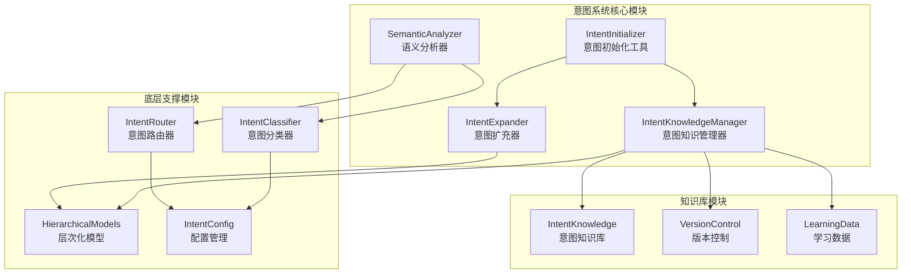
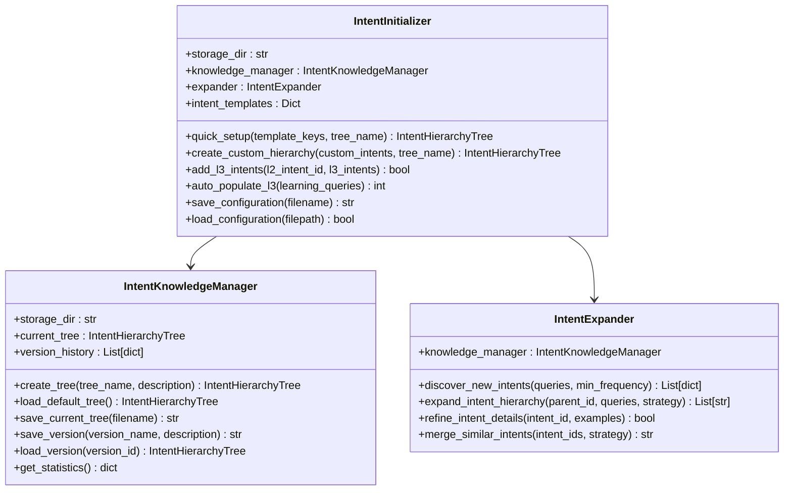
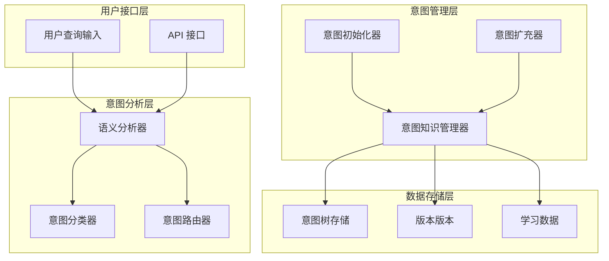
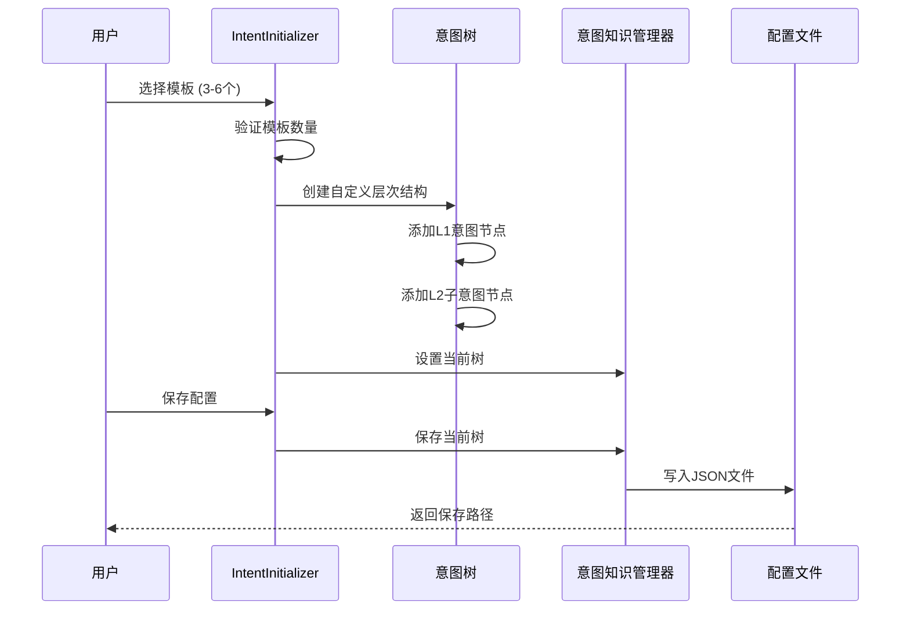
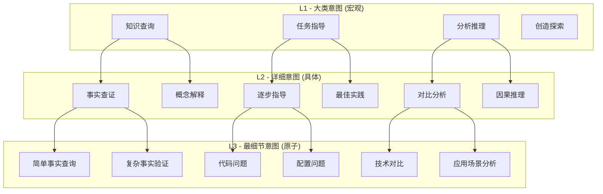
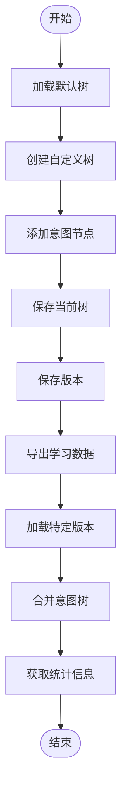
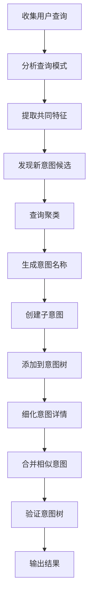
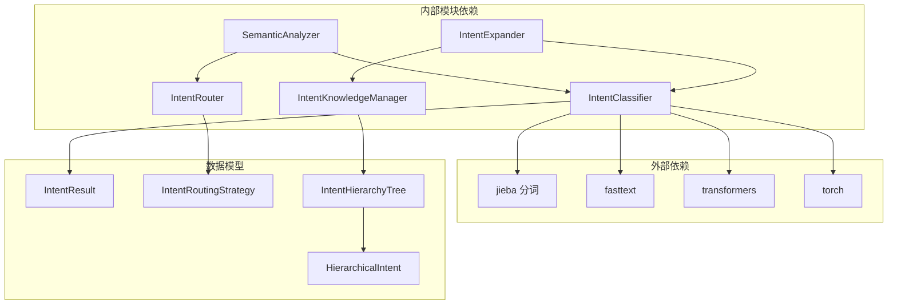

# 意图初始化完整示例

<cite>
**本文档引用的文件**
- [intent_initialization_complete.py](file://example/intent_initialization_complete.py)
- [intent_initializer.py](file://src/intent/intent_initializer.py)
- [classifier.py](file://src/intent/classifier.py)
- [semantic_analyzer.py](file://src/intent/semantic_analyzer.py)
- [router.py](file://src/intent/router.py)
- [intent_knowledge.py](file://src/intent/intent_knowledge.py)
- [hierarchical_models.py](file://src/intent/hierarchical_models.py)
- [models.py](file://src/intent/models.py)
- [config.py](file://src/intent/config.py)
- [intent_expander.py](file://src/intent/intent_expander.py)
- [__init__.py](file://src/intent/__init__.py)
- [INTENT_SETUP_GUIDE.md](file://src/intent/INTENT_SETUP_GUIDE.md)
- [INTENT_QUICKREF.md](file://src/intent/INTENT_QUICKREF.md)
- [my_intent_system.json.json](file://src/intent/intent_knowledge/trees/my_intent_system.json.json)
- [v_20260319_171230.json](file://src/intent/intent_knowledge/versions/v_20260319_171230.json)
</cite>

## 目录
1. [简介](#简介)
2. [项目结构](#项目结构)
3. [核心组件](#核心组件)
4. [架构概览](#架构概览)
5. [详细组件分析](#详细组件分析)
6. [依赖关系分析](#依赖关系分析)
7. [性能考虑](#性能考虑)
8. [故障排除指南](#故障排除指南)
9. [结论](#结论)
10. [附录](#附录)

## 简介

NecoRAG 意图初始化完整示例展示了如何构建和管理三级层次化意图系统。该系统支持从预定义模板快速设置基础意图，通过 AI 学习进行智能扩充，并提供完整的知识库管理和版本控制功能。

该示例涵盖了意图分析系统的完整生命周期，包括初始化、训练、配置、路由和维护等各个环节。

## 项目结构

NecoRAG 意图系统采用模块化设计，主要包含以下核心模块：



**图表来源**
- [intent_initializer.py:21-406](file://src/intent/intent_initializer.py#L21-L406)
- [semantic_analyzer.py:24-352](file://src/intent/semantic_analyzer.py#L24-L352)
- [intent_knowledge.py:25-407](file://src/intent/intent_knowledge.py#L25-L407)

**章节来源**
- [intent_initialization_complete.py:1-407](file://example/intent_initialization_complete.py#L1-L407)
- [__init__.py:1-135](file://src/intent/__init__.py#L1-L135)

## 核心组件

### 意图初始化工具 (IntentInitializer)

IntentInitializer 是整个意图系统的核心入口，负责：

- **模板管理**：提供预定义的 6 种基础意图模板
- **树形结构创建**：支持快速设置和自定义创建
- **L3 意图自动填充**：基于 AI 学习进行智能扩充
- **配置管理**：保存和加载意图配置



**图表来源**
- [intent_initializer.py:21-406](file://src/intent/intent_initializer.py#L21-L406)
- [intent_knowledge.py:25-407](file://src/intent/intent_knowledge.py#L25-L407)
- [intent_expander.py:30-451](file://src/intent/intent_expander.py#L30-L451)

### 语义分析器 (SemanticAnalyzer)

SemanticAnalyzer 提供统一的语义分析接口，整合了意图分类和路由功能：

- **意图分类**：支持规则、FastText 和 Transformer 三种后端
- **路由策略**：根据意图类型确定最优检索策略
- **查询增强**：提供查询归一化和关键词提取
- **批量处理**：支持批量查询分析

**章节来源**
- [semantic_analyzer.py:24-352](file://src/intent/semantic_analyzer.py#L24-L352)
- [classifier.py:20-493](file://src/intent/classifier.py#L20-L493)
- [router.py:18-350](file://src/intent/router.py#L18-L350)

## 架构概览

NecoRAG 意图系统采用分层架构设计，实现了高度模块化和可扩展性：



**图表来源**
- [semantic_analyzer.py:69-122](file://src/intent/semantic_analyzer.py#L69-L122)
- [intent_initializer.py:160-195](file://src/intent/intent_initializer.py#L160-L195)
- [intent_knowledge.py:118-139](file://src/intent/intent_knowledge.py#L118-L139)

## 详细组件分析

### 意图初始化完整流程

下面展示从模板选择到最终保存的完整初始化流程：



**图表来源**
- [intent_initialization_complete.py:27-74](file://example/intent_initialization_complete.py#L27-L74)
- [intent_initializer.py:107-158](file://src/intent/intent_initializer.py#L107-L158)
- [intent_knowledge.py:118-139](file://src/intent/intent_knowledge.py#L118-L139)

### 层次化意图模型

系统支持三级意图体系，每级都有明确的职责和特点：



**图表来源**
- [hierarchical_models.py:105-272](file://src/intent/hierarchical_models.py#L105-L272)
- [intent_initializer.py:42-105](file://src/intent/intent_initializer.py#L42-L105)

### 意图知识库管理

意图知识库提供了完整的数据持久化和版本控制功能：



**图表来源**
- [intent_knowledge.py:88-96](file://src/intent/intent_knowledge.py#L88-L96)
- [intent_knowledge.py:141-179](file://src/intent/intent_knowledge.py#L141-L179)
- [intent_knowledge.py:247-298](file://src/intent/intent_knowledge.py#L247-L298)

**章节来源**
- [intent_knowledge.py:25-407](file://src/intent/intent_knowledge.py#L25-L407)
- [my_intent_system.json.json:1-273](file://src/intent/intent_knowledge/trees/my_intent_system.json.json#L1-L273)
- [v_20260319_171230.json:1-508](file://src/intent/intent_knowledge/versions/v_20260319_171230.json#L1-L508)

### 意图扩充器工作流程

意图扩充器支持从真实用户数据中自动发现和创建新的意图：



**图表来源**
- [intent_expander.py:80-126](file://src/intent/intent_expander.py#L80-L126)
- [intent_expander.py:128-199](file://src/intent/intent_expander.py#L128-L199)
- [intent_expander.py:201-243](file://src/intent/intent_expander.py#L201-L243)

**章节来源**
- [intent_expander.py:30-451](file://src/intent/intent_expander.py#L30-L451)

## 依赖关系分析

### 核心依赖关系



**图表来源**
- [classifier.py:325-458](file://src/intent/classifier.py#L325-L458)
- [semantic_analyzer.py:64-65](file://src/intent/semantic_analyzer.py#L64-L65)
- [router.py:18-53](file://src/intent/router.py#L18-L53)

### 配置管理

系统提供了灵活的配置管理机制：

**章节来源**
- [config.py:18-333](file://src/intent/config.py#L18-L333)
- [models.py:12-231](file://src/intent/models.py#L12-L231)

## 性能考虑

### 分类器性能优化

1. **后端选择策略**：
   - 规则分类：无外部依赖，适合快速启动
   - FastText：中等性能，适合一般场景
   - Transformer：高性能，适合复杂场景

2. **缓存机制**：
   - 关键词模式编译缓存
   - 查询结果缓存
   - 模型加载缓存

### 检索性能优化

1. **路由策略优化**：
   - 根据意图类型选择最优检索模式
   - 动态调整 top_k 参数
   - 权重因子优化

2. **批量处理**：
   - 支持批量查询分类
   - 批量路由策略计算

## 故障排除指南

### 常见问题及解决方案

1. **模板数量错误**
   - 错误：选择模板数量不在 3-6 范围内
   - 解决：检查模板选择数量

2. **意图树验证失败**
   - 错误：L2/L3 意图缺少父节点引用
   - 解决：使用 `tree.validate()` 检查完整性

3. **模型加载失败**
   - 错误：FastText 或 Transformers 依赖未安装
   - 解决：降级到规则分类后端

**章节来源**
- [intent_initializer.py:173-174](file://src/intent/intent_initializer.py#L173-L174)
- [hierarchical_models.py:273-302](file://src/intent/hierarchical_models.py#L273-L302)

## 结论

NecoRAG 意图初始化完整示例展示了如何构建一个功能完整、可扩展的三级层次化意图系统。该系统具有以下优势：

1. **模块化设计**：清晰的职责分离和接口定义
2. **智能化扩展**：支持 AI 驱动的自动扩充
3. **完整生命周期管理**：从初始化到维护的全流程支持
4. **灵活配置**：支持多种后端和配置选项
5. **版本控制**：完整的版本管理和回滚机制

通过合理使用这些组件和最佳实践，可以构建出符合实际业务需求的意图体系，显著提升 RAG 系统的语义理解能力和用户体验。

## 附录

### 完整示例运行

要运行完整的意图初始化示例：

```bash
python example/intent_initialization_complete.py
```

该示例包含了 6 个完整的使用场景：
1. 快速设置基础意图
2. 完全自定义配置
3. 手动添加 L3 意图
4. AI 自动扩充
5. 持续学习
6. 保存和加载

### API 参考

系统提供了丰富的 API 接口，支持各种使用场景：

**章节来源**
- [INTENT_SETUP_GUIDE.md:395-430](file://src/intent/INTENT_SETUP_GUIDE.md#L395-L430)
- [INTENT_QUICKREF.md:41-112](file://src/intent/INTENT_QUICKREF.md#L41-L112)