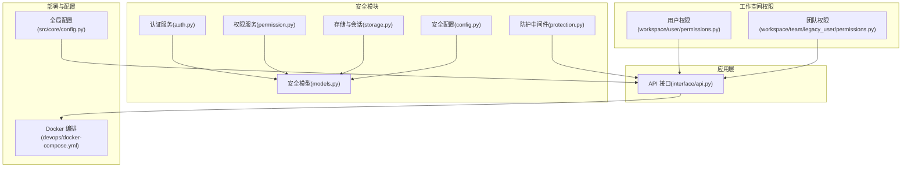
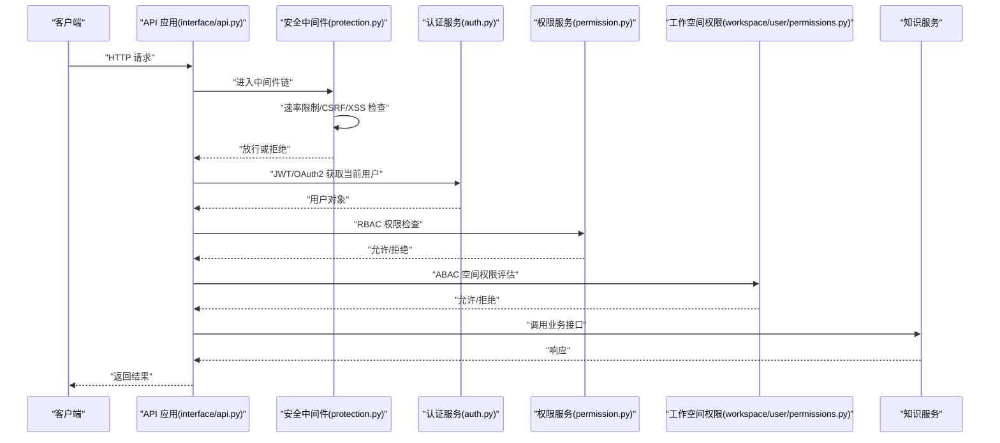
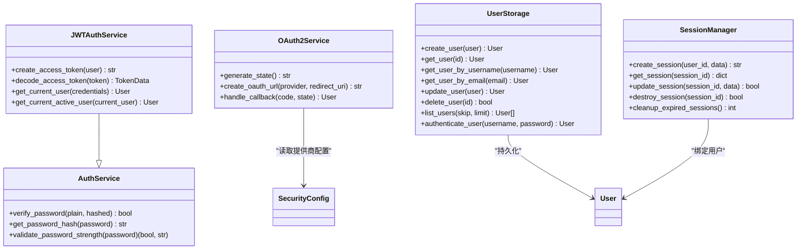
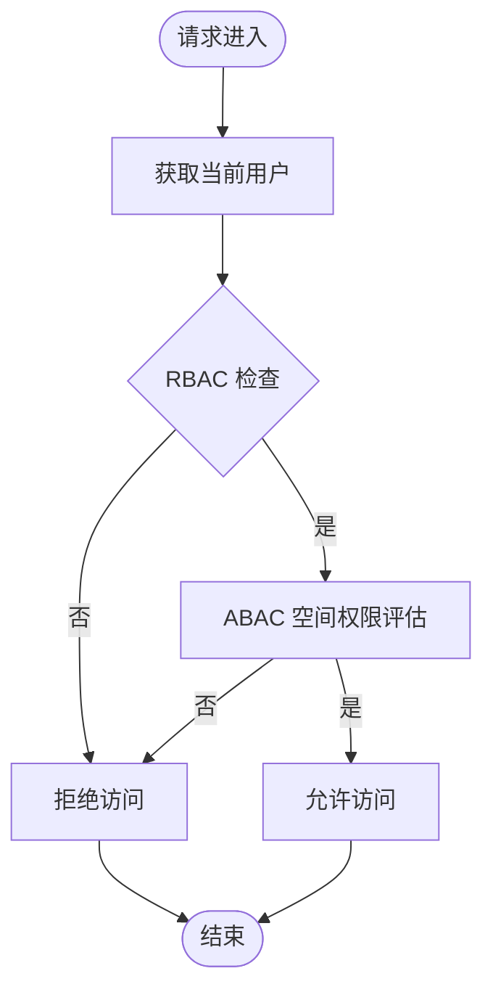
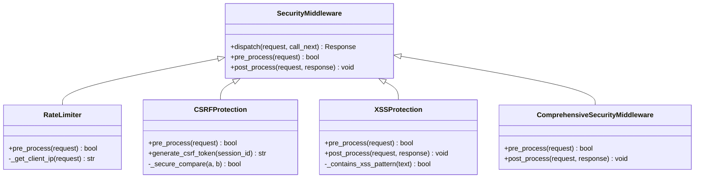
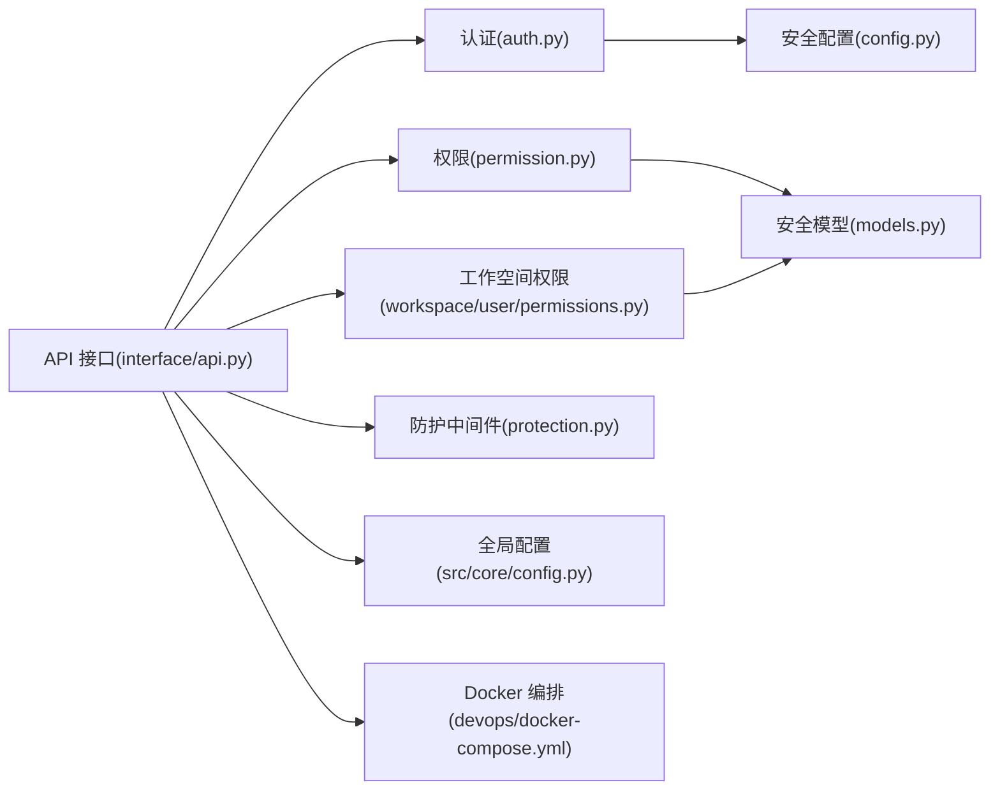

# 安全配置

<cite>
**本文引用的文件**
- [src/security/__init__.py](file://src/security/__init__.py)
- [src/security/auth.py](file://src/security/auth.py)
- [src/security/permission.py](file://src/security/permission.py)
- [src/security/protection.py](file://src/security/protection.py)
- [src/security/storage.py](file://src/security/storage.py)
- [src/security/models.py](file://src/security/models.py)
- [src/security/config.py](file://src/security/config.py)
- [src/workspace/user/permissions.py](file://src/workspace/user/permissions.py)
- [src/workspace/team/legacy_user/permissions.py](file://src/workspace/team/legacy_user/permissions.py)
- [interface/api.py](file://interface/api.py)
- [devops/docker-compose.yml](file://devops/docker-compose.yml)
- [src/core/config.py](file://src/core/config.py)
</cite>

## 目录
1. [简介](#简介)
2. [项目结构](#项目结构)
3. [核心组件](#核心组件)
4. [架构总览](#架构总览)
5. [详细组件分析](#详细组件分析)
6. [依赖分析](#依赖分析)
7. [性能考虑](#性能考虑)
8. [故障排查指南](#故障排查指南)
9. [结论](#结论)
10. [附录](#附录)

## 简介
本文件面向 NecoRAG 生产环境的安全配置，围绕认证授权、访问控制、数据保护、安全审计与合规、最佳实践与应急响应展开，结合仓库中安全模块与工作空间权限模块的实现，给出可落地的配置与实施建议。文档同时提供架构图、序列图与流程图，帮助不同背景读者快速理解并部署。

## 项目结构
安全相关能力主要分布在以下模块：
- 安全认证与会话：auth.py、storage.py、config.py、models.py
- 权限控制：permission.py、工作空间权限模块（用户/团队）
- 安全防护中间件：protection.py
- API 层接入：interface/api.py
- 部署与网络边界：devops/docker-compose.yml
- 全局配置：src/core/config.py

图表来源
- [src/security/auth.py:23-210](file://src/security/auth.py#L23-L210)
- [src/security/permission.py:61-187](file://src/security/permission.py#L61-L187)
- [src/security/protection.py:12-196](file://src/security/protection.py#L12-L196)
- [src/security/storage.py:13-209](file://src/security/storage.py#L13-L209)
- [src/security/config.py:11-92](file://src/security/config.py#L11-L92)
- [src/security/models.py:38-101](file://src/security/models.py#L38-L101)
- [src/workspace/user/permissions.py:29-368](file://src/workspace/user/permissions.py#L29-L368)
- [src/workspace/team/legacy_user/permissions.py:29-368](file://src/workspace/team/legacy_user/permissions.py#L29-L368)
- [interface/api.py:26-174](file://interface/api.py#L26-L174)
- [devops/docker-compose.yml:1-164](file://devops/docker-compose.yml#L1-L164)
- [src/core/config.py:45-200](file://src/core/config.py#L45-L200)

章节来源
- [src/security/__init__.py:1-107](file://src/security/__init__.py#L1-L107)
- [src/security/auth.py:1-210](file://src/security/auth.py#L1-L210)
- [src/security/permission.py:1-187](file://src/security/permission.py#L1-L187)
- [src/security/protection.py:1-196](file://src/security/protection.py#L1-L196)
- [src/security/storage.py:1-209](file://src/security/storage.py#L1-L209)
- [src/security/models.py:1-101](file://src/security/models.py#L1-L101)
- [src/security/config.py:1-92](file://src/security/config.py#L1-L92)
- [src/workspace/user/permissions.py:1-368](file://src/workspace/user/permissions.py#L1-L368)
- [src/workspace/team/legacy_user/permissions.py:1-368](file://src/workspace/team/legacy_user/permissions.py#L1-L368)
- [interface/api.py:1-174](file://interface/api.py#L1-L174)
- [devops/docker-compose.yml:1-164](file://devops/docker-compose.yml#L1-L164)
- [src/core/config.py:1-200](file://src/core/config.py#L1-L200)

## 核心组件
- 认证服务：提供密码哈希、JWT 签发与校验、OAuth2 授权链接生成与回调处理、依赖注入获取当前用户。
- 权限服务：基于角色的 RBAC 权限模型，支持权限检查、装饰器权限校验、角色与权限的动态增删。
- 安全防护：速率限制、CSRF/XSS 防护、综合安全中间件，统一注入安全头部与会话 Cookie。
- 存储与会话：用户存储、会话管理（TTL、刷新）、索引与分页查询。
- 工作空间权限：基于空间类型的 ABAC/RBAC 混合权限控制，支持个人/团队/公共空间的差异化访问。
- API 层：FastAPI 应用，挂载 CORS、健康检查、知识库接口；可扩展安全中间件。
- 部署与网络：容器编排定义各组件端口、健康检查与依赖关系，便于生产网络边界隔离。

章节来源
- [src/security/auth.py:23-210](file://src/security/auth.py#L23-L210)
- [src/security/permission.py:61-187](file://src/security/permission.py#L61-L187)
- [src/security/protection.py:12-196](file://src/security/protection.py#L12-L196)
- [src/security/storage.py:13-209](file://src/security/storage.py#L13-L209)
- [src/workspace/user/permissions.py:29-368](file://src/workspace/user/permissions.py#L29-L368)
- [interface/api.py:26-174](file://interface/api.py#L26-L174)
- [devops/docker-compose.yml:1-164](file://devops/docker-compose.yml#L1-L164)

## 架构总览
下图展示生产环境安全配置的关键交互：API 请求经安全中间件进入，进行速率限制、CSRF/XSS 检查；随后 JWT/OAuth2 认证获取用户身份，RBAC/ABAC 决策访问控制，最终调用业务服务。

图表来源
- [interface/api.py:26-174](file://interface/api.py#L26-L174)
- [src/security/protection.py:12-196](file://src/security/protection.py#L12-L196)
- [src/security/auth.py:56-210](file://src/security/auth.py#L56-L210)
- [src/security/permission.py:61-187](file://src/security/permission.py#L61-L187)
- [src/workspace/user/permissions.py:182-312](file://src/workspace/user/permissions.py#L182-L312)

## 详细组件分析

### 认证授权机制
- JWT 认证：签发含用户角色与权限的令牌，设置过期时间；解码时处理过期与无效签名异常。
- OAuth2 集成：生成授权 URL、状态管理、回调处理；支持 GitHub/Google 等提供商配置。
- 依赖注入：提供获取当前用户与活跃用户的依赖函数，便于路由保护。
- 会话管理：内存存储会话，带 TTL 自动过期；支持创建、读取、更新、销毁与过期清理。

图表来源
- [src/security/auth.py:23-210](file://src/security/auth.py#L23-L210)
- [src/security/storage.py:13-209](file://src/security/storage.py#L13-L209)
- [src/security/models.py:38-101](file://src/security/models.py#L38-L101)
- [src/security/config.py:11-92](file://src/security/config.py#L11-L92)

章节来源
- [src/security/auth.py:23-210](file://src/security/auth.py#L23-L210)
- [src/security/storage.py:13-209](file://src/security/storage.py#L13-L209)
- [src/security/models.py:38-101](file://src/security/models.py#L38-L101)
- [src/security/config.py:11-92](file://src/security/config.py#L11-L92)

### 访问控制策略（API/数据/操作）
- RBAC 权限模型：内置管理员、开发者、普通用户、访客角色，每个角色具备一组权限集合。
- 权限检查：支持单权限、任一权限、全部权限检查；提供装饰器简化路由保护。
- 工作空间权限（ABAC/RBAC 混合）：按个人/团队/公共空间区分权限；支持基于领域专家、成员角色的细粒度控制。
- API 访问控制：在接口层通过依赖注入获取当前用户，并结合权限服务与工作空间权限进行判定。

图表来源
- [src/security/permission.py:88-126](file://src/security/permission.py#L88-L126)
- [src/workspace/user/permissions.py:141-180](file://src/workspace/user/permissions.py#L141-L180)

章节来源
- [src/security/permission.py:1-187](file://src/security/permission.py#L1-L187)
- [src/workspace/user/permissions.py:1-368](file://src/workspace/user/permissions.py#L1-L368)
- [src/workspace/team/legacy_user/permissions.py:1-368](file://src/workspace/team/legacy_user/permissions.py#L1-L368)

### 安全防护与会话管理
- 速率限制：基于客户端 IP 的滑动窗口计数，支持自定义每分钟请求数。
- CSRF 防护：对非 GET 请求校验 CSRF Token，使用安全比较防止时序攻击。
- XSS 防护：检测危险模式并阻断，响应阶段设置安全头部。
- 综合安全中间件：统一注入 HSTS、X-Frame-Options、X-Content-Type-Options 等头部；GET 请求下发 CSRF Token Cookie。
- 会话管理：内存存储会话，带 TTL；自动刷新 last_access；支持清理过期会话。

图表来源
- [src/security/protection.py:12-196](file://src/security/protection.py#L12-L196)

章节来源
- [src/security/protection.py:1-196](file://src/security/protection.py#L1-L196)
- [src/security/storage.py:145-209](file://src/security/storage.py#L145-L209)

### 数据保护措施
- 传输安全：综合安全中间件设置 HSTS、X-Frame-Options、X-Content-Type-Options 等头部，提升浏览器侧安全。
- 会话安全：CSRF Token Cookie 设置 httponly 与 secure 标记，降低 XSS 与会话劫持风险。
- 存储安全：用户存储采用内存后端（演示用途），生产建议替换为持久化存储并启用访问控制与备份策略。
- 隐私保护：工作空间权限模块提供查询记录保留策略与过期清理工具方法，支持匿名化与加密（待完善）。

章节来源
- [src/security/protection.py:178-192](file://src/security/protection.py#L178-L192)
- [src/security/storage.py:145-209](file://src/security/storage.py#L145-L209)
- [src/workspace/user/permissions.py:314-368](file://src/workspace/user/permissions.py#L314-L368)

### 安全审计与合规
- 访问日志：访问控制器记录每次访问尝试、结果与上下文，支持按用户、时间范围过滤与审计轨迹导出。
- 合规建议：结合日志与访问控制，建立最小权限、职责分离、定期审计与合规报告流程。

章节来源
- [src/workspace/user/permissions.py:182-312](file://src/workspace/user/permissions.py#L182-L312)

### 安全配置最佳实践
- 最小权限原则：仅授予完成任务所需的最小权限；定期复核角色与权限映射。
- 安全边界设置：容器网络隔离、端口暴露最小化、健康检查与只读根文件系统。
- 威胁防护：启用速率限制、CSRF/XSS 防护、HSTS；严格管理密钥与环境变量。
- 加密与密钥管理：使用强密钥与安全算法；定期轮换；避免硬编码密钥。
- 审计与监控：开启访问日志与错误日志；建立告警与事件响应流程。

章节来源
- [src/security/config.py:17-83](file://src/security/config.py#L17-L83)
- [devops/docker-compose.yml:1-164](file://devops/docker-compose.yml#L1-L164)

### 安全漏洞预防与应急响应
- 预防：输入校验、参数化查询、最小暴露面、安全头部、速率限制与 CSRF/XSS 防护。
- 应急：快速隔离受影响服务、回滚变更、审查访问日志、修复漏洞并发布补丁、复盘与改进流程。

章节来源
- [src/security/protection.py:36-146](file://src/security/protection.py#L36-L146)
- [src/workspace/user/permissions.py:271-312](file://src/workspace/user/permissions.py#L271-L312)

## 依赖分析
- 安全模块内部耦合：认证服务依赖安全配置与用户模型；权限服务依赖用户角色与权限枚举；防护中间件独立性强，可按需组合。
- API 层依赖：接口层依赖认证与权限服务，工作空间权限模块提供空间级访问控制。
- 部署依赖：应用服务依赖 Redis/Qdrant/Neo4j 等后端，健康检查确保服务可用。

图表来源
- [interface/api.py:26-174](file://interface/api.py#L26-L174)
- [src/security/auth.py:14-21](file://src/security/auth.py#L14-L21)
- [src/security/permission.py:8-9](file://src/security/permission.py#L8-L9)
- [src/security/protection.py:9-10](file://src/security/protection.py#L9-L10)
- [src/security/config.py:8-9](file://src/security/config.py#L8-L9)
- [src/security/models.py:5-8](file://src/security/models.py#L5-L8)
- [src/core/config.py:45-101](file://src/core/config.py#L45-L101)
- [devops/docker-compose.yml:1-164](file://devops/docker-compose.yml#L1-L164)

章节来源
- [interface/api.py:1-174](file://interface/api.py#L1-L174)
- [src/security/auth.py:1-210](file://src/security/auth.py#L1-L210)
- [src/security/permission.py:1-187](file://src/security/permission.py#L1-L187)
- [src/security/protection.py:1-196](file://src/security/protection.py#L1-L196)
- [src/security/config.py:1-92](file://src/security/config.py#L1-L92)
- [src/security/models.py:1-101](file://src/security/models.py#L1-L101)
- [src/core/config.py:1-200](file://src/core/config.py#L1-L200)
- [devops/docker-compose.yml:1-164](file://devops/docker-compose.yml#L1-L164)

## 性能考虑
- 速率限制：合理设置每分钟请求数与时间窗口，避免误伤正常流量。
- 中间件顺序：将快速失败的检查（如速率限制）前置，减少后续处理开销。
- 会话存储：内存存储适合演示；生产建议使用高性能缓存并配置 TTL 与清理策略。
- 日志与审计：避免在高频路径记录大量字段；采用采样或异步写入。

## 故障排查指南
- 认证失败：检查 JWT 密钥、算法与过期时间；确认用户状态与密码哈希。
- 权限不足：核对用户角色与权限映射；检查装饰器使用与依赖注入。
- CSRF/XSS 拦截：确认 CSRF Token Cookie 设置与请求头携带；检查危险模式检测规则。
- 访问日志缺失：检查访问控制器日志记录与过滤条件；确认审计轨迹查询参数。
- 会话异常：检查会话 TTL、last_access 更新与清理策略。

章节来源
- [src/security/auth.py:81-132](file://src/security/auth.py#L81-L132)
- [src/security/permission.py:128-174](file://src/security/permission.py#L128-L174)
- [src/security/protection.py:77-110](file://src/security/protection.py#L77-L110)
- [src/workspace/user/permissions.py:271-312](file://src/workspace/user/permissions.py#L271-L312)
- [src/security/storage.py:169-198](file://src/security/storage.py#L169-L198)

## 结论
NecoRAG 安全模块提供了从认证、权限到防护的完整能力，配合工作空间权限模块实现了多维度的访问控制。生产部署建议结合容器编排与严格的密钥管理、速率限制与安全头部策略，构建纵深防御体系，并持续完善数据加密与隐私保护机制，确保系统在满足合规要求的同时保持高性能与高可用。

## 附录
- 环境变量与配置项：JWT 密钥/算法/过期时间、OAuth2 提供商配置、速率限制开关与阈值、CSRF/XSS 开关、允许的跨域来源、密码策略等。
- 部署要点：容器网络隔离、端口暴露最小化、健康检查、只读根文件系统与卷权限控制。

章节来源
- [src/security/config.py:17-83](file://src/security/config.py#L17-L83)
- [devops/docker-compose.yml:1-164](file://devops/docker-compose.yml#L1-L164)