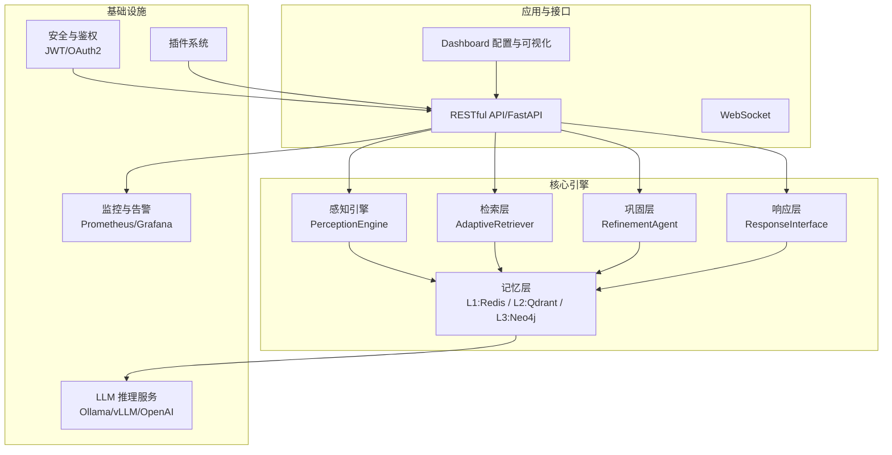
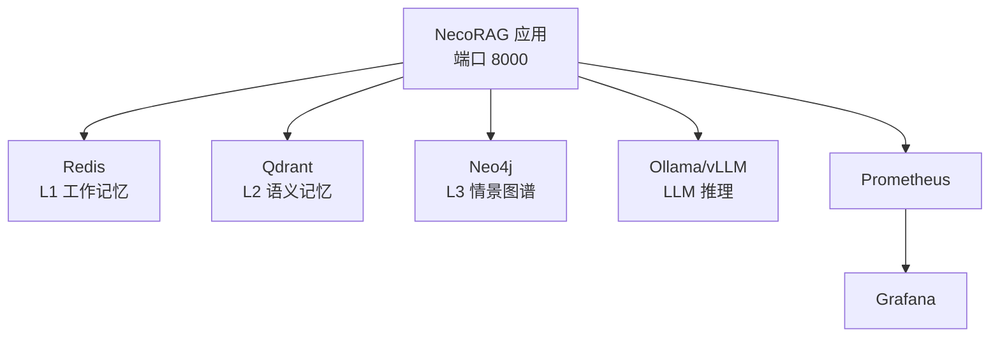
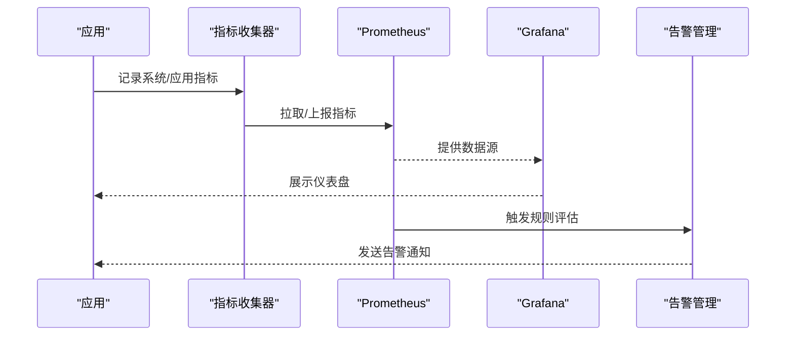
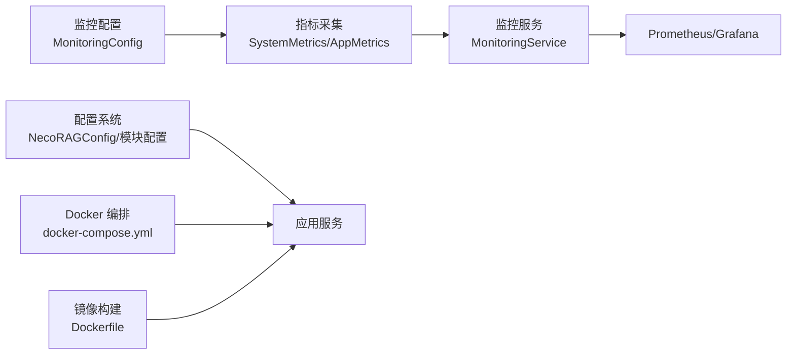

# 容量规划

<cite>
**本文引用的文件**
- [README.md](file://README.md)
- [src/necorag.py](file://src/necorag.py)
- [src/core/config.py](file://src/core/config.py)
- [src/monitoring/config.py](file://src/monitoring/config.py)
- [src/monitoring/metrics.py](file://src/monitoring/metrics.py)
- [src/monitoring/service.py](file://src/monitoring/service.py)
- [src/dashboard/config_manager.py](file://src/dashboard/config_manager.py)
- [src/dashboard/models.py](file://src/dashboard/models.py)
- [devops/Dockerfile](file://devops/Dockerfile)
- [devops/docker-compose.yml](file://devops/docker-compose.yml)
- [3rd/DEPLOYMENT_GUIDE.md](file://3rd/DEPLOYMENT_GUIDE.md)
- [3rd/TECH_STACK.md](file://3rd/TECH_STACK.md)
- [requirements.txt](file://requirements.txt)
</cite>

## 目录
1. [简介](#简介)
2. [项目结构](#项目结构)
3. [核心组件](#核心组件)
4. [架构总览](#架构总览)
5. [详细组件分析](#详细组件分析)
6. [依赖分析](#依赖分析)
7. [性能考量](#性能考量)
8. [故障排查指南](#故障排查指南)
9. [结论](#结论)
10. [附录](#附录)

## 简介
本文件面向 NecoRAG 生产环境容量规划，围绕“用户规模预测、数据量增长预测、性能需求评估”展开，结合仓库中的配置、监控与部署资料，给出硬件资源配置策略、扩展性设计、高可用与弹性伸缩、负载均衡与冗余、容量监控与预警、以及成本优化与资源利用率提升的实践建议。目标是在满足延迟与可用性目标的前提下，实现稳定、可扩展且成本可控的生产部署。

## 项目结构
NecoRAG 采用五层认知架构，核心模块包括感知层、记忆层（L1/L2/L3）、检索层、巩固层与响应层；同时提供 Dashboard 配置管理、监控告警、安全与插件系统，并通过 Docker 与 docker-compose 提供一键部署能力。

**图表来源**
- [README.md:52-183](file://README.md#L52-L183)
- [src/necorag.py:51-148](file://src/necorag.py#L51-L148)
- [devops/docker-compose.yml:4-164](file://devops/docker-compose.yml#L4-L164)

**章节来源**
- [README.md:25-183](file://README.md#L25-L183)
- [devops/docker-compose.yml:4-164](file://devops/docker-compose.yml#L4-L164)

## 核心组件
- 统一入口与流程编排：NecoRAG 类负责文档导入、查询检索、意图分析、知识演化与自适应学习的编排与统计。
- 配置系统：集中化的全局配置与模块配置，支持从文件与环境变量加载，便于容量参数的集中治理。
- 监控与告警：系统指标采集、健康检查、告警评估与可视化仪表盘。
- Dashboard：Profile 管理、模块参数配置、实时统计与可视化调试面板。
- 部署与编排：Dockerfile 与 docker-compose 提供服务编排、健康检查与资源暴露。

**章节来源**
- [src/necorag.py:51-148](file://src/necorag.py#L51-L148)
- [src/core/config.py:275-420](file://src/core/config.py#L275-L420)
- [src/monitoring/config.py:27-117](file://src/monitoring/config.py#L27-L117)
- [src/monitoring/metrics.py:25-207](file://src/monitoring/metrics.py#L25-L207)
- [src/monitoring/service.py:21-174](file://src/monitoring/service.py#L21-L174)
- [src/dashboard/config_manager.py:14-315](file://src/dashboard/config_manager.py#L14-L315)
- [src/dashboard/models.py:164-232](file://src/dashboard/models.py#L164-L232)
- [devops/Dockerfile:1-39](file://devops/Dockerfile#L1-L39)
- [devops/docker-compose.yml:4-164](file://devops/docker-compose.yml#L4-L164)

## 架构总览
NecoRAG 的生产架构以“容器化 + 分层存储 + 可插拔模型服务 + 统一监控”为核心，通过 docker-compose 将应用、缓存、向量库、图数据库与 LLM 推理服务统一编排，配合 Prometheus/Grafana 实现可观测性。

**图表来源**
- [devops/docker-compose.yml:4-164](file://devops/docker-compose.yml#L4-L164)
- [3rd/TECH_STACK.md:132-494](file://3rd/TECH_STACK.md#L132-L494)

**章节来源**
- [devops/docker-compose.yml:4-164](file://devops/docker-compose.yml#L4-L164)
- [3rd/TECH_STACK.md:132-494](file://3rd/TECH_STACK.md#L132-L494)

## 详细组件分析

### 容量需求分析方法
- 用户规模预测
  - 基于并发 QPS 与响应时间的目标，反推所需实例数与资源上限。参考技术栈中的性能基准，企业环境端到端延迟 < 500ms、并发 QPS 500-2000，据此估算峰值并发与吞吐。
  - 通过 Dashboard 统计与监控指标（API 请求量、错误率、响应时间）持续观测实际负载，滚动预测未来增长趋势。
- 数据量增长预测
  - 记忆层数据规模：L1（Redis）短期会话与缓存、L2（Qdrant）向量库、L3（Neo4j）图谱节点与边。结合导入速率与保留策略（如 TTL、衰减与归档阈值）估算存储增长。
  - 参考配置中的记忆层参数（如 L1 TTL、衰减阈值、集合命名与索引类型）制定数据生命周期策略。
- 性能需求评估
  - 依据检索层与巩固层的关键阈值（top_k、置信度阈值、重排序与多样性权重）评估对向量检索与图查询的性能压力。
  - 通过监控指标（CPU/内存/磁盘/网络、进程数、垃圾回收）与应用指标（RAG 响应时间、API 错误率、缓存命中率）建立性能基线与预警阈值。

**章节来源**
- [3rd/TECH_STACK.md:570-589](file://3rd/TECH_STACK.md#L570-L589)
- [src/core/config.py:134-216](file://src/core/config.py#L134-L216)
- [src/monitoring/config.py:52-100](file://src/monitoring/config.py#L52-L100)
- [src/dashboard/models.py:164-232](file://src/dashboard/models.py#L164-L232)

### 硬件资源配置策略
- CPU
  - 应用服务：按并发 QPS 与响应时间目标，结合容器资源限制（deploy.resources.limits.cpus）评估 CPU 需求。生产环境建议 4 核起步，结合 Prometheus 监控实际使用率。
  - LLM 推理：GPU 加速（如 vLLM）显著降低推理延迟，需预留显存与 CUDA 资源。
- 内存
  - 应用服务：结合容器内存限制与监控指标（内存使用率、GC 统计）设定上限，避免 OOM。
  - 缓存与数据库：Redis（maxmemory）、Qdrant（性能参数）、Neo4j（heap/pagecache）需按数据规模与查询模式调优。
- 存储
  - 数据卷：为 Redis、Qdrant、Neo4j、Ollama、Grafana 等分配持久化卷，监控磁盘使用率与 IO。
  - 日志与模型：分离日志与模型缓存目录，避免影响业务盘。
- 网络
  - 暴露端口：应用 8000、数据库与服务端口按需开放，限制入站访问，启用防火墙与安全组。

**章节来源**
- [3rd/DEPLOYMENT_GUIDE.md:520-720](file://3rd/DEPLOYMENT_GUIDE.md#L520-L720)
- [devops/docker-compose.yml:540-720](file://devops/docker-compose.yml#L540-L720)
- [devops/Dockerfile:30-39](file://devops/Dockerfile#L30-L39)
- [3rd/TECH_STACK.md:267-372](file://3rd/TECH_STACK.md#L267-L372)

### 扩展性设计考虑
- 水平扩展
  - 应用层：通过容器副本与负载均衡（如反向代理/云 LB）横向扩展，结合健康检查与就绪探针保障流量接入。
  - 数据层：Qdrant/Neo4j 支持集群部署，按数据规模与查询并发选择集群节点数。
- 垂直扩展
  - 在单节点上增加 CPU/内存/GPU 资源，适用于短期内无法扩容或数据规模较小的场景。
- 弹性伸缩策略
  - 基于 CPU/内存使用率与请求量的自动伸缩（HPA），结合监控阈值与告警联动，实现动态扩缩容。

**章节来源**
- [3rd/TECH_STACK.md:496-566](file://3rd/TECH_STACK.md#L496-L566)
- [devops/docker-compose.yml:565-570](file://devops/docker-compose.yml#L565-L570)

### 负载均衡与高可用架构
- 服务冗余与故障转移
  - 应用：多副本部署 + 健康检查（Docker HEALTHCHECK/应用内 /health）。
  - 数据：Redis Sentinel/Cluster、Qdrant 集群、Neo4j 集群，确保主从切换与数据高可用。
- 数据同步
  - 缓存与向量库：通过连接池与重试策略保障一致性；图数据库使用事务与索引同步。
- API 网关与反向代理
  - 通过 Nginx/Traefik/云网关实现路由、限流、熔断与灰度发布。

**章节来源**
- [devops/Dockerfile:33-35](file://devops/Dockerfile#L33-L35)
- [3rd/TECH_STACK.md:313-372](file://3rd/TECH_STACK.md#L313-L372)
- [3rd/DEPLOYMENT_GUIDE.md:101-149](file://3rd/DEPLOYMENT_GUIDE.md#L101-L149)

### 容量监控与预警机制
- 指标采集
  - 系统指标：CPU/内存/磁盘/网络/进程数/负载。
  - 应用指标：RAG 响应时间、API 错误率、缓存命中率、模型推理耗时。
- 阈值与告警
  - CPU/内存/磁盘使用率阈值（警告/严重）；RAG 响应时间、API 错误率、缓存命中率阈值。
  - 告警通道：控制台、邮件、Webhook、Slack。
- 可视化与仪表盘
  - Prometheus + Grafana，结合内置仪表盘模板与自定义面板。
- 健康检查
  - 定时健康检查与整体状态评估，异常时触发告警与自愈流程。

**图表来源**
- [src/monitoring/metrics.py:25-207](file://src/monitoring/metrics.py#L25-L207)
- [src/monitoring/config.py:27-117](file://src/monitoring/config.py#L27-L117)
- [src/monitoring/service.py:38-154](file://src/monitoring/service.py#L38-L154)

**章节来源**
- [src/monitoring/metrics.py:25-207](file://src/monitoring/metrics.py#L25-L207)
- [src/monitoring/config.py:27-117](file://src/monitoring/config.py#L27-L117)
- [src/monitoring/service.py:21-174](file://src/monitoring/service.py#L21-L174)

### 成本优化与资源利用率提升
- 选型与部署
  - 根据预算与规模选择开源/云托管方案，参考“四套推荐配置”，平衡成本与性能。
- 资源复用
  - 模型服务（向量化/重排序）与 LLM 推理服务可共用 GPU 资源，按峰值与空闲时段调度。
- 缓存与索引
  - 合理设置 Redis 缓存策略与 TTL，优化 Qdrant/HNSW 索引参数，降低检索延迟与资源消耗。
- 自动化运维
  - 通过 APScheduler/Celery 等实现定时任务与异步处理，减少阻塞与资源浪费。
- 监控驱动优化
  - 基于监控数据持续调优参数（top_k、置信度阈值、重排序权重），提升命中率与降低无效计算。

**章节来源**
- [3rd/TECH_STACK.md:496-566](file://3rd/TECH_STACK.md#L496-L566)
- [src/core/config.py:158-216](file://src/core/config.py#L158-L216)
- [3rd/DEPLOYMENT_GUIDE.md:520-720](file://3rd/DEPLOYMENT_GUIDE.md#L520-L720)

## 依赖分析
- 配置依赖
  - 全局配置与模块配置通过 dataclass 与枚举组织，支持从文件与环境变量加载，便于在不同环境间切换。
- 监控依赖
  - 指标采集依赖 psutil 与 Prometheus 客户端，健康检查与告警依赖 APScheduler 与通知通道。
- 部署依赖
  - Dockerfile 与 docker-compose 定义镜像构建、端口暴露、健康检查与服务依赖关系。

**图表来源**
- [src/core/config.py:275-420](file://src/core/config.py#L275-L420)
- [src/monitoring/config.py:27-117](file://src/monitoring/config.py#L27-L117)
- [src/monitoring/metrics.py:25-207](file://src/monitoring/metrics.py#L25-L207)
- [src/monitoring/service.py:21-174](file://src/monitoring/service.py#L21-L174)
- [devops/docker-compose.yml:118-147](file://devops/docker-compose.yml#L118-L147)
- [devops/Dockerfile:1-39](file://devops/Dockerfile#L1-L39)

**章节来源**
- [src/core/config.py:275-420](file://src/core/config.py#L275-L420)
- [src/monitoring/config.py:27-117](file://src/monitoring/config.py#L27-L117)
- [src/monitoring/metrics.py:25-207](file://src/monitoring/metrics.py#L25-L207)
- [src/monitoring/service.py:21-174](file://src/monitoring/service.py#L21-L174)
- [devops/docker-compose.yml:118-147](file://devops/docker-compose.yml#L118-L147)
- [devops/Dockerfile:1-39](file://devops/Dockerfile#L1-L39)

## 性能考量
- 延迟分布
  - LLM 推理、向量检索、图谱查询、意图识别等组件的延迟分布与并发能力直接影响端到端性能。
- 资源瓶颈
  - CPU/内存/GPU/网络/磁盘 IO 的瓶颈点需通过监控与压测识别，针对性优化。
- 参数调优
  - 检索层 top_k、置信度阈值、重排序权重、记忆层衰减与归档阈值等，均会影响性能与资源占用。

**章节来源**
- [3rd/TECH_STACK.md:570-589](file://3rd/TECH_STACK.md#L570-L589)
- [src/core/config.py:158-216](file://src/core/config.py#L158-L216)

## 故障排查指南
- 健康检查
  - 应用健康端点与第三方服务健康检查（Ollama/Qdrant/Neo4j）失败时，优先检查容器日志与网络连通性。
- 日志定位
  - 使用 docker logs 查看容器日志，结合监控面板定位异常时段与指标突变。
- 配置核对
  - 确认 .env 与 docker-compose 中的环境变量、端口映射与资源限制是否正确。
- 快速恢复
  - 通过重启容器、回滚配置、切换备用 LLM 提供商等方式快速恢复服务。

**章节来源**
- [devops/Dockerfile:33-35](file://devops/Dockerfile#L33-L35)
- [3rd/DEPLOYMENT_GUIDE.md:789-800](file://3rd/DEPLOYMENT_GUIDE.md#L789-L800)

## 结论
NecoRAG 的生产容量规划应以“可观测性驱动 + 参数化治理 + 分层存储 + 可插拔模型服务”为基础，结合用户规模与数据增长预测，制定 CPU/内存/GPU/存储与网络的资源策略，并通过水平/垂直扩展与弹性伸缩实现动态适配。以 Prometheus/Grafana 为核心的监控体系与阈值化告警机制，可有效保障系统稳定性与性能；通过合理的选型与缓存/索引优化，持续提升资源利用率并控制成本。

## 附录
- 配置与参数要点
  - 全局配置与模块配置：参考全局配置类与各模块配置项，结合环境变量覆盖关键参数。
  - Dashboard Profile：通过配置管理器创建/切换 Profile，统一管理各模块参数。
- 部署与运维
  - Dockerfile 与 docker-compose 提供一键编排与健康检查；生产环境建议启用资源限制与 GPU 加速。
- 依赖清单
  - 核心依赖与可选模块依赖，按需安装以满足不同功能与性能需求。

**章节来源**
- [src/core/config.py:275-420](file://src/core/config.py#L275-L420)
- [src/dashboard/config_manager.py:14-315](file://src/dashboard/config_manager.py#L14-L315)
- [src/dashboard/models.py:164-232](file://src/dashboard/models.py#L164-L232)
- [devops/Dockerfile:1-39](file://devops/Dockerfile#L1-L39)
- [devops/docker-compose.yml:4-164](file://devops/docker-compose.yml#L4-L164)
- [requirements.txt:1-161](file://requirements.txt#L1-L161)