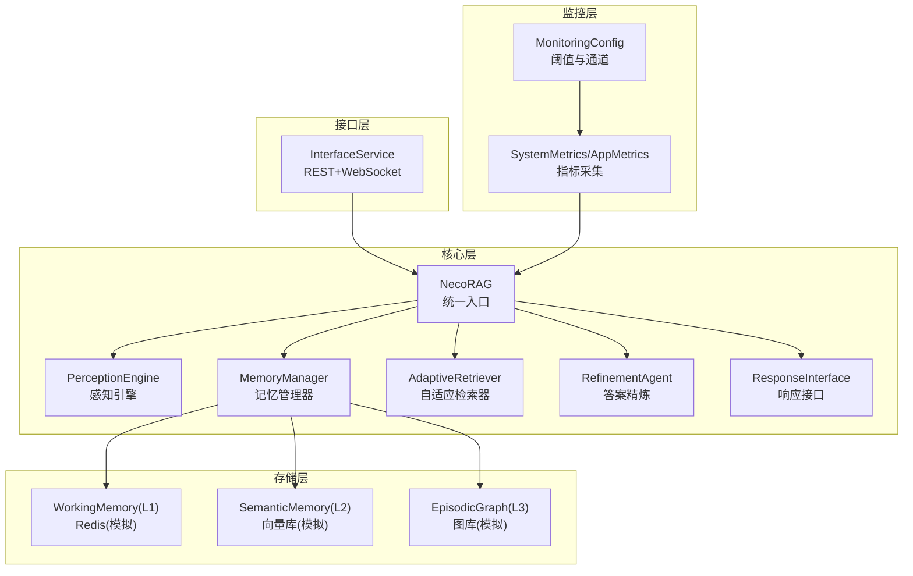
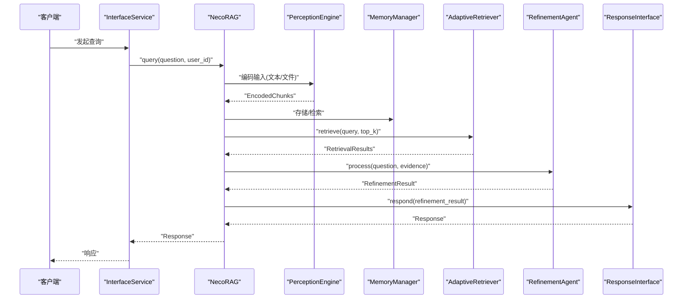
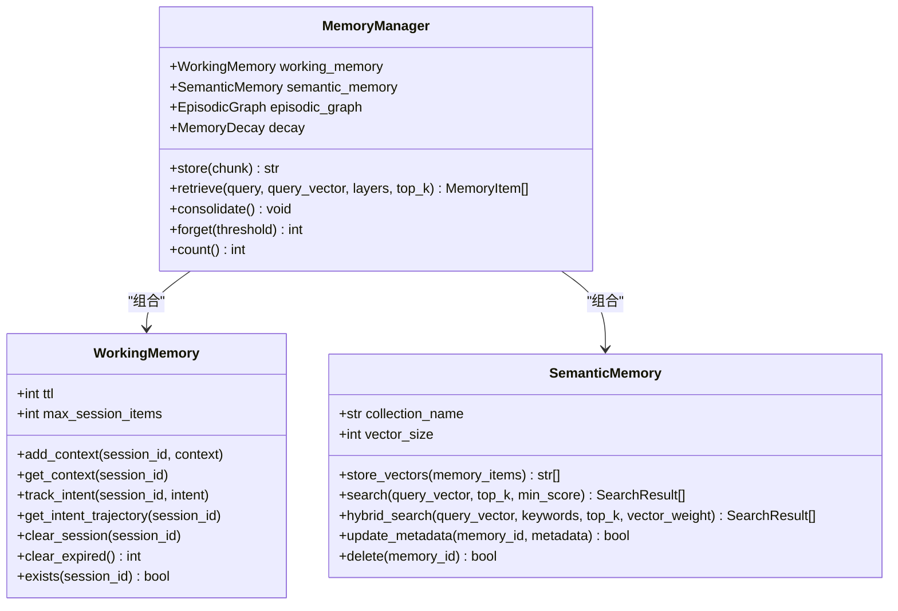
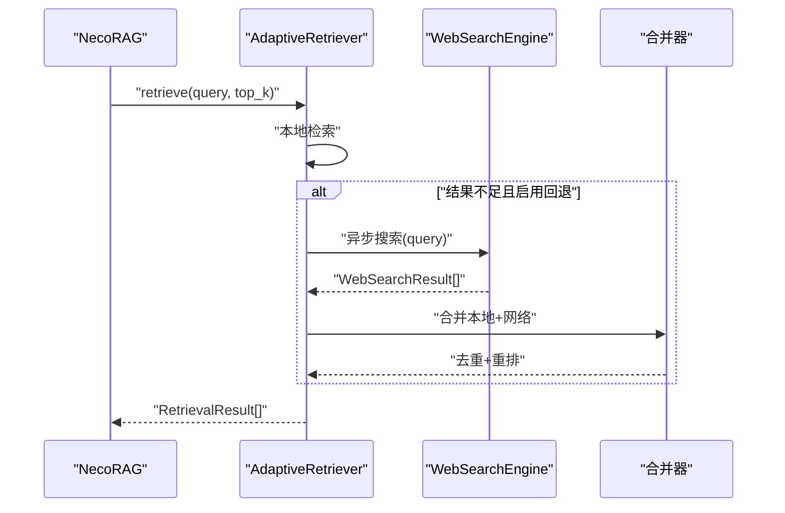
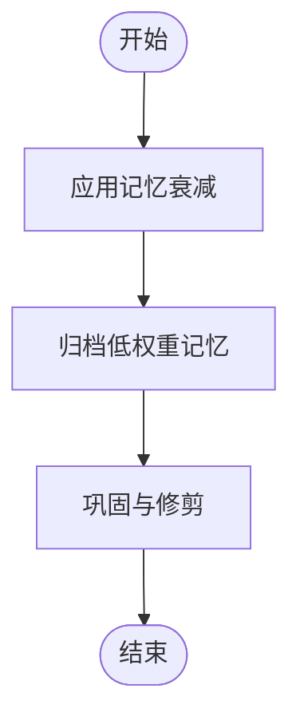
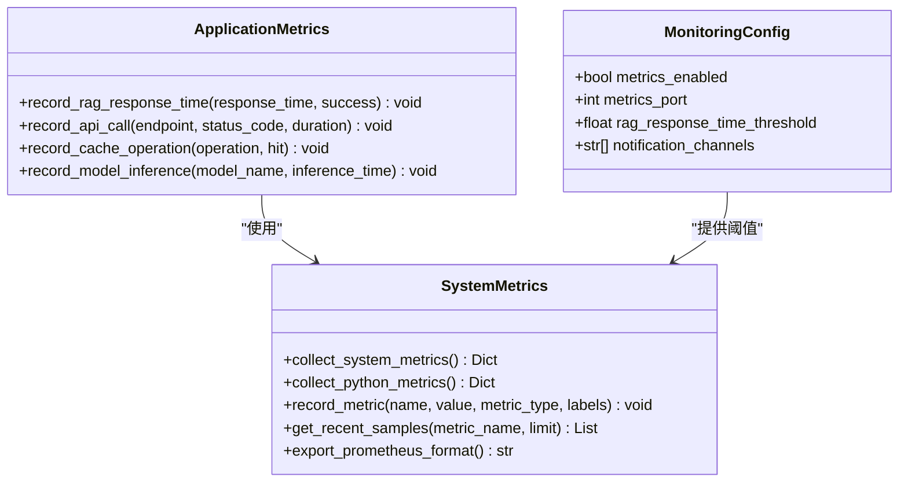
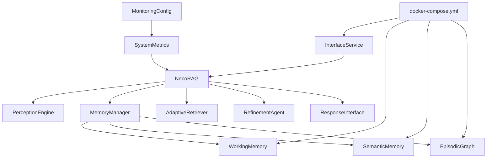

# 性能优化

<cite>
**本文档引用的文件**
- [src/necorag.py](file://src/necorag.py)
- [src/core/config.py](file://src/core/config.py)
- [src/memory/manager.py](file://src/memory/manager.py)
- [src/memory/working_memory.py](file://src/memory/working_memory.py)
- [src/memory/semantic_memory.py](file://src/memory/semantic_memory.py)
- [src/memory/decay.py](file://src/memory/decay.py)
- [src/perception/engine.py](file://src/perception/engine.py)
- [src/retrieval/retriever.py](file://src/retrieval/retriever.py)
- [src/refinement/models.py](file://src/refinement/models.py)
- [src/monitoring/metrics.py](file://src/monitoring/metrics.py)
- [src/monitoring/config.py](file://src/monitoring/config.py)
- [tests/performance_test.py](file://tests/performance_test.py)
- [interface/main.py](file://interface/main.py)
- [devops/docker-compose.yml](file://devops/docker-compose.yml)
</cite>

## 目录
1. [简介](#简介)
2. [项目结构](#项目结构)
3. [核心组件](#核心组件)
4. [架构总览](#架构总览)
5. [详细组件分析](#详细组件分析)
6. [依赖关系分析](#依赖关系分析)
7. [性能考量](#性能考量)
8. [故障排查指南](#故障排查指南)
9. [结论](#结论)
10. [附录](#附录)

## 简介
本文件面向 NecoRAG 生产环境性能优化，围绕缓存机制（工作记忆缓存、向量存储缓存、结果缓存）、并发处理（异步处理、连接池与线程池）、资源管理（内存/CPU/存储）与性能监控指标展开，提供参数配置建议、最佳实践与压测/基准测试方法论，帮助在真实生产环境中稳定、高效地运行系统。

## 项目结构
NecoRAG 采用分层架构：感知层负责文档解析与编码；记忆层负责三层记忆（工作记忆/语义记忆/情景图谱）；检索层负责向量检索、融合与重排序；巩固层负责答案精炼与幻觉检测；响应层负责最终输出适配；监控模块负责系统与应用指标采集；接口模块提供 REST/WebSocket 服务。

**图表来源**
- [interface/main.py:14-79](file://interface/main.py#L14-L79)
- [src/necorag.py:51-148](file://src/necorag.py#L51-L148)
- [src/perception/engine.py:20-76](file://src/perception/engine.py#L20-L76)
- [src/memory/manager.py:20-51](file://src/memory/manager.py#L20-L51)
- [src/retrieval/retriever.py:135-182](file://src/retrieval/retriever.py#L135-L182)
- [src/monitoring/metrics.py:25-95](file://src/monitoring/metrics.py#L25-L95)
- [src/monitoring/config.py:27-64](file://src/monitoring/config.py#L27-L64)

**章节来源**
- [interface/main.py:14-79](file://interface/main.py#L14-L79)
- [src/necorag.py:51-148](file://src/necorag.py#L51-L148)
- [src/core/config.py:277-334](file://src/core/config.py#L277-L334)

## 核心组件
- 统一入口 NecoRAG：负责组件初始化、文档导入、查询检索、知识演化与自适应学习的编排。
- 感知引擎：文档解析、弹性分块、向量编码与情境标签生成。
- 记忆管理器：统一管理 L1/L2/L3 三层记忆，提供存储、检索、巩固与主动遗忘。
- 自适应检索器：多路检索、融合、重排序、早停控制与领域权重。
- 答案精炼与响应：生成与精炼、幻觉检测、输出适配。
- 监控与指标：系统级与应用级指标采集，Prometheus 导出与阈值告警。

**章节来源**
- [src/necorag.py:51-148](file://src/necorag.py#L51-L148)
- [src/perception/engine.py:20-76](file://src/perception/engine.py#L20-L76)
- [src/memory/manager.py:20-51](file://src/memory/manager.py#L20-L51)
- [src/retrieval/retriever.py:135-182](file://src/retrieval/retriever.py#L135-L182)
- [src/refinement/models.py:9-47](file://src/refinement/models.py#L9-L47)
- [src/monitoring/metrics.py:25-95](file://src/monitoring/metrics.py#L25-L95)

## 架构总览
NecoRAG 的查询路径从接口层进入，经统一入口编排，依次通过感知层编码、记忆层检索、检索层融合与重排序、巩固层精炼，最终由响应层输出。监控模块贯穿全链路，采集系统与应用指标。

**图表来源**
- [interface/main.py:30-59](file://interface/main.py#L30-L59)
- [src/necorag.py:390-513](file://src/necorag.py#L390-L513)
- [src/perception/engine.py:140-154](file://src/perception/engine.py#L140-L154)
- [src/retrieval/retriever.py:224-308](file://src/retrieval/retriever.py#L224-L308)

## 详细组件分析

### 缓存机制设计与实现
- 工作记忆缓存（L1）
  - 作用：会话上下文、意图轨迹、短期上下文，强调低延迟与 TTL 过期。
  - 实现：当前以内存字典模拟 Redis，支持会话上下文添加、意图轨迹跟踪、会话清理与过期清理占位。
  - 参数：TTL、单会话最大条目数。
  - 优化建议：生产环境接入 Redis，配置持久化、淘汰策略与连接池；对热点键设置更短 TTL；对会话清理增加后台扫描。
- 向量存储缓存（L2）
  - 作用：高维向量检索，支持模糊匹配与直觉检索。
  - 实现：当前以内存字典模拟向量库，提供向量插入、检索与元数据更新；检索采用余弦相似度。
  - 参数：集合名、向量维度、top_k、最低分数。
  - 优化建议：生产环境接入 Qdrant/Milvus，启用 HNSW 索引、批量写入与增量刷新；开启向量压缩与分片；合理设置索引参数与副本。
- 结果缓存策略
  - 作用：减少重复检索与重排序开销。
  - 现状：代码中未见显式结果缓存实现。
  - 建议：对相同查询（含增强）与 top_k 组合建立缓存键，缓存融合/重排序后的结果；设置 TTL 与容量上限；区分用户/租户维度。

**图表来源**
- [src/memory/working_memory.py:11-120](file://src/memory/working_memory.py#L11-L120)
- [src/memory/semantic_memory.py:21-179](file://src/memory/semantic_memory.py#L21-L179)
- [src/memory/manager.py:20-51](file://src/memory/manager.py#L20-L51)

**章节来源**
- [src/memory/working_memory.py:22-120](file://src/memory/working_memory.py#L22-L120)
- [src/memory/semantic_memory.py:44-179](file://src/memory/semantic_memory.py#L44-L179)
- [src/memory/manager.py:52-212](file://src/memory/manager.py#L52-L212)

### 并发处理优化
- 异步处理
  - 检索器提供异步回退方案：当本地检索不足时，异步触发互联网搜索并合并结果。
  - 接口层使用 Uvicorn 异步运行 REST 服务，WebSocket 管理器支持并发连接。
- 连接池与线程池
  - 现状：未见显式连接池/线程池配置。
  - 建议：对外部服务（Redis/Qdrant/Neo4j/Ollama）配置连接池；对 CPU 密集型任务（编码/重排序）使用线程池；对 I/O 密集型任务（网络搜索）使用异步；限制并发度防止资源争用。
- 并发监控
  - 建议：记录并发请求数、队列长度、等待时间与拒绝率；对慢请求进行超时与熔断。

**图表来源**
- [src/retrieval/retriever.py:500-546](file://src/retrieval/retriever.py#L500-L546)
- [src/retrieval/retriever.py:548-602](file://src/retrieval/retriever.py#L548-L602)
- [interface/main.py:30-59](file://interface/main.py#L30-L59)

**章节来源**
- [src/retrieval/retriever.py:500-644](file://src/retrieval/retriever.py#L500-L644)
- [interface/main.py:30-59](file://interface/main.py#L30-L59)

### 资源管理策略
- 内存使用优化
  - 记忆衰减：通过权重衰减与强化，动态维持知识新鲜度，定期归档低价值记忆。
  - 向量存储：限制 top_k、设置最低分数阈值，减少无效结果；对向量维度与索引参数进行调优。
  - 编码阶段：分批处理与流式写入，避免一次性占用过多内存。
- CPU 资源分配
  - 对编码与重排序等计算密集型模块进行限流与批处理；在异步回退中控制并发度。
- 存储空间管理
  - L1：设置 TTL 与会话上限，定期清理过期数据。
  - L2：启用分片与副本，定期维护索引；对低频访问数据迁移至冷存储。
  - L3：限制遍历深度与关系类型，避免图爆炸。

**图表来源**
- [src/memory/decay.py:72-118](file://src/memory/decay.py#L72-L118)
- [src/memory/manager.py:161-182](file://src/memory/manager.py#L161-L182)

**章节来源**
- [src/memory/decay.py:11-155](file://src/memory/decay.py#L11-L155)
- [src/memory/manager.py:161-202](file://src/memory/manager.py#L161-L202)

### 性能监控指标与分析
- 系统级指标：CPU 使用率、内存使用、磁盘 IO、网络 IO、进程数、负载均值。
- 应用级指标：RAG 响应时间、请求成功率、API 调用耗时与状态码计数、模型推理耗时、缓存命中/未命中。
- 导出格式：Prometheus 格式，便于 Grafana 展示。
- 阈值与告警：基于配置设定 CPU/内存/磁盘/RAG 响应时间等阈值，支持多通道通知。

**图表来源**
- [src/monitoring/metrics.py:25-203](file://src/monitoring/metrics.py#L25-L203)
- [src/monitoring/config.py:27-100](file://src/monitoring/config.py#L27-L100)

**章节来源**
- [src/monitoring/metrics.py:25-203](file://src/monitoring/metrics.py#L25-L203)
- [src/monitoring/config.py:27-100](file://src/monitoring/config.py#L27-L100)

### 压测与基准测试方法论
- 单操作基准测试：预热后多次执行，统计最小/最大/平均/中位/标准差与百分位数，计算吞吐量。
- 并发基准测试：多线程并发执行，统计总耗时、总操作数与吞吐量。
- 压力测试：持续运行直至失败率超过阈值，统计成功/失败数、失败率与性能指标。
- 内存使用测试：记录初始/峰值/平均内存，评估内存泄漏风险。
- 建议指标：P50/P95/P99 延迟、吞吐量、错误率、缓存命中率、资源利用率。

**章节来源**
- [tests/performance_test.py:31-291](file://tests/performance_test.py#L31-L291)

## 依赖关系分析
- 组件耦合
  - NecoRAG 作为编排器，依赖感知、记忆、检索、巩固与响应模块；模块间通过协议与数据模型解耦。
  - 记忆管理器聚合三层记忆实现，当前以内存模拟为主，便于替换为真实存储。
- 外部依赖
  - 当前未引入 Redis/Qdrant/Neo4j/Ollama 等外部库，使用内存模拟实现；生产环境需按配置注入真实客户端与连接参数。
- 部署依赖
  - docker-compose 提供 Redis/Qdrant/Neo4j/Ollama/Grafana 的编排与健康检查，便于一键部署与监控。

**图表来源**
- [src/necorag.py:123-148](file://src/necorag.py#L123-L148)
- [src/memory/manager.py:44-51](file://src/memory/manager.py#L44-L51)
- [interface/main.py:30-59](file://interface/main.py#L30-L59)
- [devops/docker-compose.yml:4-164](file://devops/docker-compose.yml#L4-L164)

**章节来源**
- [src/necorag.py:123-148](file://src/necorag.py#L123-L148)
- [src/memory/manager.py:44-51](file://src/memory/manager.py#L44-L51)
- [devops/docker-compose.yml:4-164](file://devops/docker-compose.yml#L4-L164)

## 性能考量
- 缓存策略
  - 工作记忆：接入 Redis，设置合理 TTL 与淘汰策略；对热点键做本地二级缓存。
  - 向量存储：接入 Qdrant/Milvus，启用 HNSW/IVF 等索引；批量写入与增量刷新；设置副本与分片。
  - 结果缓存：对查询+top_k+增强组合做缓存，设置 TTL 与容量上限。
- 并发与资源
  - 外部服务连接池：Redis/Qdrant/Neo4j/Ollama 配置连接池大小与超时。
  - 异步与限流：对网络搜索与模型推理使用异步；对 CPU 密集任务使用线程池；对 I/O 密集任务使用异步；设置全局并发上限。
  - 资源隔离：不同租户/用户维度隔离缓存与连接池，避免相互影响。
- 监控与告警
  - 指标细化：增加缓存命中率、检索耗时分布、模型推理耗时、慢查询追踪。
  - 告警分级：CPU/内存/磁盘/延迟/错误率分级告警；支持多通道通知。
- 配置与参数
  - 生产配置：提升检索 top_k、启用重排序与领域权重、适度放宽早停阈值；根据业务调优缓存 TTL 与淘汰策略。
  - 环境变量：通过环境变量覆盖关键配置，便于不同环境差异化部署。

**章节来源**
- [src/core/config.py:390-420](file://src/core/config.py#L390-L420)
- [src/monitoring/config.py:52-100](file://src/monitoring/config.py#L52-L100)

## 故障排查指南
- 响应时间异常
  - 检查检索耗时、重排序耗时、网络搜索回退耗时；查看缓存命中率；确认外部服务延迟。
- 吞吐量下降
  - 检查连接池饱和、线程池阻塞、GC 抖动；核对慢查询与热点键。
- 资源耗尽
  - 检查内存峰值、磁盘使用率、进程数；核对 TTL 与归档策略是否生效。
- 监控告警
  - 查看 Prometheus 指标与 Grafana 面板；根据阈值定位问题根因；结合日志与追踪信息复盘。

**章节来源**
- [src/monitoring/metrics.py:126-203](file://src/monitoring/metrics.py#L126-L203)
- [src/monitoring/config.py:66-100](file://src/monitoring/config.py#L66-L100)

## 结论
通过在生产环境引入 Redis/Qdrant/Neo4j 等真实存储、完善结果缓存与异步回退、配置连接池与线程池、细化监控与告警，NecoRAG 可在保证稳定性的同时显著提升响应时间与吞吐量。建议以渐进方式落地上述优化，并结合压测与基准测试持续验证与调优。

## 附录
- 部署与运维
  - 使用 docker-compose 一键编排 Redis/Qdrant/Neo4j/Ollama/Grafana；通过环境变量覆盖配置。
- 配置参考
  - 全局配置与各层配置（LLM/感知/记忆/检索/巩固/响应/领域/知识演化）；预设开发/生产/最小配置。
- 测试参考
  - 性能测试器提供基准、并发、压力与内存测试模板，便于快速开展压测。

**章节来源**
- [devops/docker-compose.yml:4-164](file://devops/docker-compose.yml#L4-L164)
- [src/core/config.py:277-420](file://src/core/config.py#L277-L420)
- [tests/performance_test.py:31-291](file://tests/performance_test.py#L31-L291)