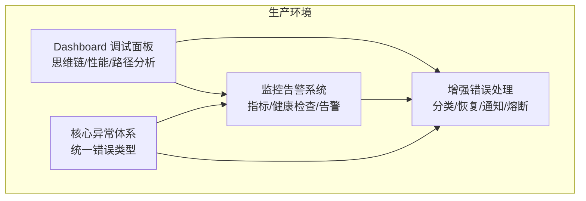
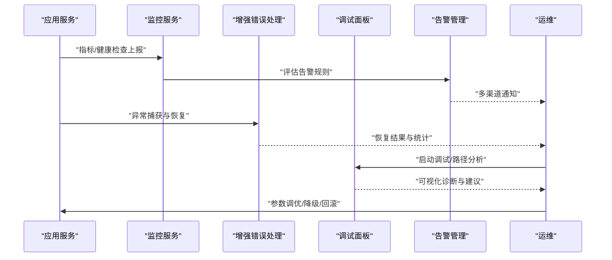
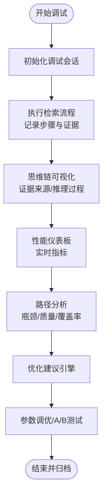
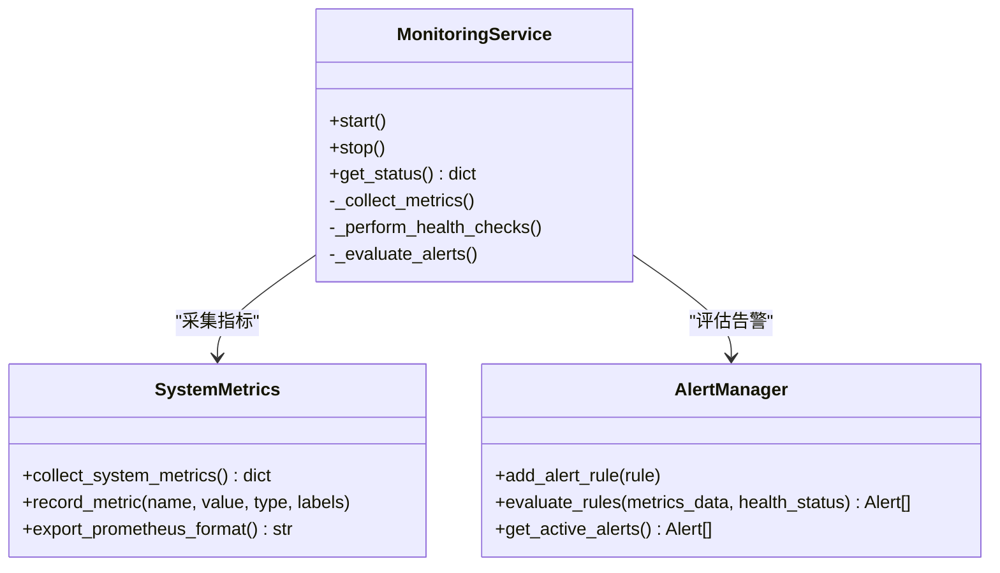
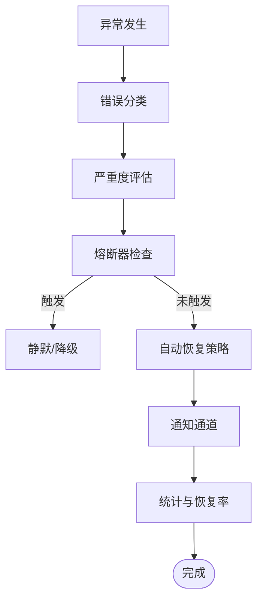
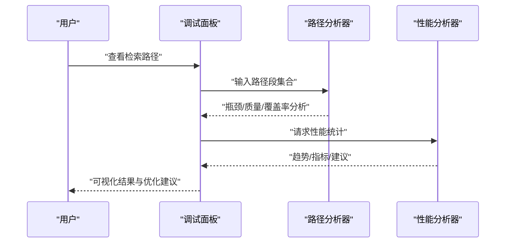
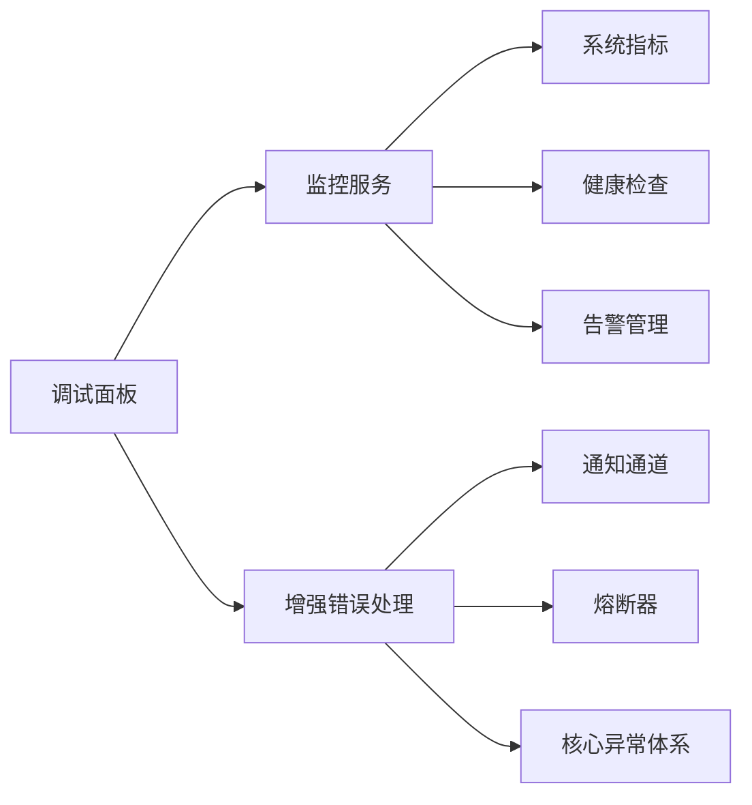
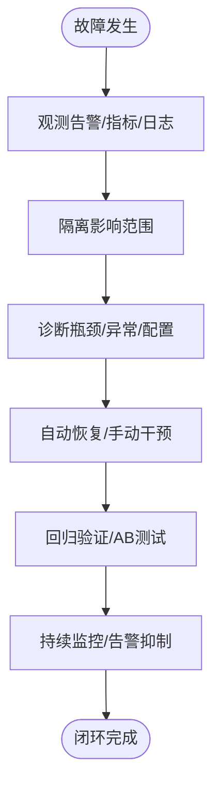
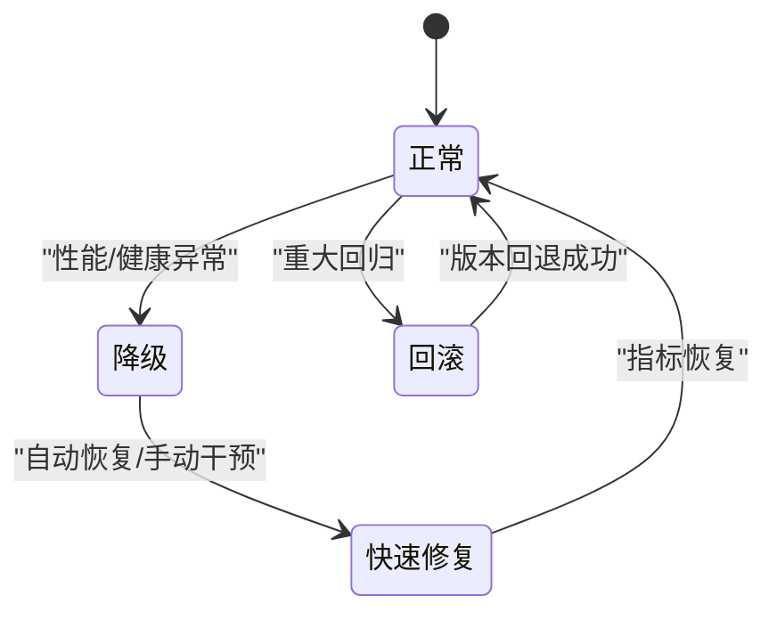

# 故障排除

<cite>
**本文引用的文件**   
- [README.md](file://README.md)
- [devops/README.md](file://devops/README.md)
- [src/dashboard/USAGE_GUIDE.md](file://src/dashboard/USAGE_GUIDE.md)
- [src/dashboard/IMPLEMENTATION_SUMMARY.md](file://src/dashboard/IMPLEMENTATION_SUMMARY.md)
- [src/dashboard/debug/README.md](file://src/dashboard/debug/README.md)
- [src/dashboard/debug/enhanced_error_handler.py](file://src/dashboard/debug/enhanced_error_handler.py)
- [src/dashboard/debug/analyzer.py](file://src/dashboard/debug/analyzer.py)
- [src/dashboard/debug/performance.py](file://src/dashboard/debug/performance.py)
- [src/dashboard/debug/path_analyzer.py](file://src/dashboard/debug/path_analyzer.py)
- [src/monitoring/README.md](file://src/monitoring/README.md)
- [src/monitoring/alerts.py](file://src/monitoring/alerts.py)
- [src/monitoring/metrics.py](file://src/monitoring/metrics.py)
- [src/monitoring/service.py](file://src/monitoring/service.py)
- [src/core/exceptions.py](file://src/core/exceptions.py)
</cite>

## 目录
1. [简介](#简介)
2. [项目结构](#项目结构)
3. [核心组件](#核心组件)
4. [架构总览](#架构总览)
5. [详细组件分析](#详细组件分析)
6. [依赖分析](#依赖分析)
7. [性能考量](#性能考量)
8. [故障排除指南](#故障排除指南)
9. [结论](#结论)
10. [附录](#附录)

## 简介
本文件面向生产环境的 NecoRAG 故障排除，围绕“查询失败、性能下降、系统崩溃”等典型问题，提供系统化的诊断流程、日志分析技巧、性能瓶颈定位方法、调试面板使用指南、故障恢复标准操作程序（SOP）、以及预防性维护与风险控制最佳实践。文档同时结合项目现有的监控告警、可视化调试面板与增强错误处理能力，形成“可观测—可诊断—可恢复”的闭环。

## 项目结构
NecoRAG 采用五层认知架构，生产环境的关键可观测与排障能力分布在以下模块：
- Dashboard 调试面板：可视化思维链、性能仪表板、路径分析、参数调优、A/B 测试与优化建议引擎
- 监控告警系统：系统指标采集、健康检查、告警规则与多渠道通知
- 增强错误处理：错误分类、严重度评估、自动恢复策略、熔断器与通知
- 核心异常体系：统一错误类型定义，便于日志与告警的结构化处理

**图表来源**
- [src/dashboard/debug/README.md:1-190](file://src/dashboard/debug/README.md#L1-L190)
- [src/monitoring/README.md:1-373](file://src/monitoring/README.md#L1-L373)
- [src/dashboard/debug/enhanced_error_handler.py:1-558](file://src/dashboard/debug/enhanced_error_handler.py#L1-L558)
- [src/core/exceptions.py:1-455](file://src/core/exceptions.py#L1-L455)

**章节来源**
- [README.md:1-979](file://README.md#L1-L979)
- [devops/README.md:1-336](file://devops/README.md#L1-L336)

## 核心组件
- 调试面板（Debug Panel）
  - 思维链可视化、证据来源展示、推理过程图表、实时监控与性能仪表板、路径分析工具、参数调优面板、A/B 测试框架、优化建议引擎
  - 参考：[src/dashboard/debug/README.md:1-190](file://src/dashboard/debug/README.md#L1-L190)，[src/dashboard/USAGE_GUIDE.md:1-309](file://src/dashboard/USAGE_GUIDE.md#L1-L309)，[src/dashboard/IMPLEMENTATION_SUMMARY.md:1-256](file://src/dashboard/IMPLEMENTATION_SUMMARY.md#L1-L256)
- 监控告警（Monitoring & Alerts）
  - 系统指标采集（CPU/内存/磁盘/网络/进程/Python 运行时）、应用指标记录、健康检查、告警规则与多渠道通知（控制台/邮件/Webhook/Slack）
  - 参考：[src/monitoring/README.md:1-373](file://src/monitoring/README.md#L1-L373)，[src/monitoring/metrics.py:1-207](file://src/monitoring/metrics.py#L1-L207)，[src/monitoring/alerts.py:1-435](file://src/monitoring/alerts.py#L1-L435)，[src/monitoring/service.py:1-214](file://src/monitoring/service.py#L1-L214)
- 增强错误处理（Enhanced Error Handler）
  - 错误分类与严重度评估、自动恢复策略、熔断器、通知通道、错误统计与恢复率分析
  - 参考：[src/dashboard/debug/enhanced_error_handler.py:1-558](file://src/dashboard/debug/enhanced_error_handler.py#L1-L558)
- 路径分析与性能分析（Path/Performance Analyzer）
  - 检索路径段分析、瓶颈识别、性能统计、趋势分析、优化建议
  - 参考：[src/dashboard/debug/analyzer.py:1-410](file://src/dashboard/debug/analyzer.py#L1-L410)，[src/dashboard/debug/performance.py:1-658](file://src/dashboard/debug/performance.py#L1-L658)，[src/dashboard/debug/path_analyzer.py:1-628](file://src/dashboard/debug/path_analyzer.py#L1-L628)
- 核心异常体系（Core Exceptions）
  - 按模块划分的统一异常类型，便于日志结构化与告警联动
  - 参考：[src/core/exceptions.py:1-455](file://src/core/exceptions.py#L1-L455)

**章节来源**
- [src/dashboard/debug/README.md:1-190](file://src/dashboard/debug/README.md#L1-L190)
- [src/monitoring/README.md:1-373](file://src/monitoring/README.md#L1-L373)
- [src/dashboard/debug/enhanced_error_handler.py:1-558](file://src/dashboard/debug/enhanced_error_handler.py#L1-L558)
- [src/dashboard/debug/analyzer.py:1-410](file://src/dashboard/debug/analyzer.py#L1-L410)
- [src/dashboard/debug/performance.py:1-658](file://src/dashboard/debug/performance.py#L1-L658)
- [src/dashboard/debug/path_analyzer.py:1-628](file://src/dashboard/debug/path_analyzer.py#L1-L628)
- [src/core/exceptions.py:1-455](file://src/core/exceptions.py#L1-L455)

## 架构总览
下图展示了生产环境故障排除的观测与处置闭环：监控采集与健康检查提供基础数据，增强错误处理与异常体系实现自动恢复与告警，调试面板负责可视化诊断与参数调优，最终通过 SOP 实现快速恢复与回滚。

**图表来源**
- [src/monitoring/service.py:1-214](file://src/monitoring/service.py#L1-L214)
- [src/monitoring/alerts.py:1-435](file://src/monitoring/alerts.py#L1-L435)
- [src/dashboard/debug/enhanced_error_handler.py:1-558](file://src/dashboard/debug/enhanced_error_handler.py#L1-L558)
- [src/dashboard/debug/README.md:1-190](file://src/dashboard/debug/README.md#L1-L190)

## 详细组件分析

### 调试面板（可视化诊断与性能分析）
- 功能要点
  - 思维链可视化：时间轴、证据卡片、推理过程图表，支持 WebSocket 实时更新
  - 性能仪表板：CPU/内存/磁盘/网络/连接数/响应时间等指标
  - 路径分析：识别瓶颈、质量与覆盖率问题、趋势对比与优化建议
  - 参数调优与 A/B 测试：在线参数调整与实验框架
  - 优化建议引擎：基于数据分析的智能建议
- 使用建议
  - 在检索流程中集成调试会话，完整记录检索步骤与证据来源
  - 通过 WebSocket 实时查看性能与思维链变化
  - 使用路径分析工具定位慢步骤与失败步骤，结合优化建议落地改进

**图表来源**
- [src/dashboard/debug/README.md:1-190](file://src/dashboard/debug/README.md#L1-L190)
- [src/dashboard/debug/analyzer.py:1-410](file://src/dashboard/debug/analyzer.py#L1-L410)
- [src/dashboard/debug/performance.py:1-658](file://src/dashboard/debug/performance.py#L1-L658)
- [src/dashboard/debug/path_analyzer.py:1-628](file://src/dashboard/debug/path_analyzer.py#L1-L628)

**章节来源**
- [src/dashboard/USAGE_GUIDE.md:1-309](file://src/dashboard/USAGE_GUIDE.md#L1-L309)
- [src/dashboard/IMPLEMENTATION_SUMMARY.md:1-256](file://src/dashboard/IMPLEMENTATION_SUMMARY.md#L1-L256)
- [src/dashboard/debug/README.md:1-190](file://src/dashboard/debug/README.md#L1-L190)

### 监控告警系统（可观测性基石）
- 指标采集
  - 系统级：CPU/内存/磁盘/网络/进程/负载
  - 应用级：RAG 响应时间、API 调用统计、缓存命中率、Python 运行时
  - Prometheus 导出格式，便于外部监控系统接入
- 健康检查
  - 多维度并行检查、历史记录、可配置阈值
- 告警管理
  - 多级告警（INFO/WARNING/ERROR/CRITICAL）、多渠道通知（控制台/邮件/Webhook/Slack）、告警抑制与去重
- 集成方式
  - 与 FastAPI 集成中间件记录指标；挂载监控应用；定时任务自动采集与评估

**图表来源**
- [src/monitoring/service.py:1-214](file://src/monitoring/service.py#L1-L214)
- [src/monitoring/metrics.py:1-207](file://src/monitoring/metrics.py#L1-L207)
- [src/monitoring/alerts.py:1-435](file://src/monitoring/alerts.py#L1-L435)

**章节来源**
- [src/monitoring/README.md:1-373](file://src/monitoring/README.md#L1-L373)
- [src/monitoring/metrics.py:1-207](file://src/monitoring/metrics.py#L1-L207)
- [src/monitoring/alerts.py:1-435](file://src/monitoring/alerts.py#L1-L435)
- [src/monitoring/service.py:1-214](file://src/monitoring/service.py#L1-L214)

### 增强错误处理（自动恢复与熔断）
- 能力概览
  - 错误分类与严重度评估：基于异常类型与上下文自动分级
  - 自动恢复策略：网络/数据库/内存/超时等内置策略
  - 熔断器：失败次数与超时控制，避免雪崩
  - 通知通道：控制台/邮件/Slack/Webhook
  - 统计与恢复率：错误历史、高频错误识别、恢复成功率
- 使用建议
  - 为关键路径添加装饰器，自动记录上下文并触发恢复
  - 配置熔断器阈值与超时，结合健康检查联动
  - 通过通知通道确保问题及时触达值班人员

**图表来源**
- [src/dashboard/debug/enhanced_error_handler.py:1-558](file://src/dashboard/debug/enhanced_error_handler.py#L1-L558)

**章节来源**
- [src/dashboard/debug/enhanced_error_handler.py:1-558](file://src/dashboard/debug/enhanced_error_handler.py#L1-L558)

### 路径分析与性能分析（定位瓶颈与优化）
- 路径分析
  - 段类型识别（查询分析/实体识别/向量检索/图推理/结果融合/答案生成）
  - 瓶颈检测（性能/质量/覆盖率/一致性）
  - 历史对比与趋势分析，生成优化建议
- 性能分析
  - 总耗时、平均段耗时、成功率、标准差、趋势评估
  - 与历史数据对比，识别退化与改善

**图表来源**
- [src/dashboard/debug/path_analyzer.py:1-628](file://src/dashboard/debug/path_analyzer.py#L1-L628)
- [src/dashboard/debug/analyzer.py:1-410](file://src/dashboard/debug/analyzer.py#L1-L410)
- [src/dashboard/debug/performance.py:1-658](file://src/dashboard/debug/performance.py#L1-L658)

**章节来源**
- [src/dashboard/debug/analyzer.py:1-410](file://src/dashboard/debug/analyzer.py#L1-L410)
- [src/dashboard/debug/performance.py:1-658](file://src/dashboard/debug/performance.py#L1-L658)
- [src/dashboard/debug/path_analyzer.py:1-628](file://src/dashboard/debug/path_analyzer.py#L1-L628)

### 核心异常体系（统一错误类型）
- 作用
  - 为感知层、记忆层、检索层、巩固层、LLM 相关、配置与知识演化等模块提供统一异常类型
  - 便于日志结构化、告警联动与恢复策略匹配
- 建议
  - 在业务关键路径抛出结构化异常，携带上下文字段（如文件路径、模型名、查询等）
  - 与增强错误处理联动，自动分类与恢复

**章节来源**
- [src/core/exceptions.py:1-455](file://src/core/exceptions.py#L1-L455)

## 依赖分析
- 组件耦合
  - 调试面板依赖监控与增强错误处理，提供可视化诊断与建议
  - 监控服务依赖指标采集与健康检查，驱动告警管理
  - 增强错误处理依赖通知通道与熔断器，实现自动恢复与告警
- 外部依赖
  - 监控系统：psutil、APScheduler、aiohttp
  - 通知系统：SMTP、Webhook、Slack
  - 可视化：原生 HTML/CSS/JS，零第三方依赖

**图表来源**
- [src/monitoring/service.py:1-214](file://src/monitoring/service.py#L1-L214)
- [src/monitoring/alerts.py:1-435](file://src/monitoring/alerts.py#L1-L435)
- [src/dashboard/debug/enhanced_error_handler.py:1-558](file://src/dashboard/debug/enhanced_error_handler.py#L1-L558)
- [src/dashboard/debug/README.md:1-190](file://src/dashboard/debug/README.md#L1-L190)

**章节来源**
- [src/monitoring/service.py:1-214](file://src/monitoring/service.py#L1-L214)
- [src/monitoring/alerts.py:1-435](file://src/monitoring/alerts.py#L1-L435)
- [src/dashboard/debug/enhanced_error_handler.py:1-558](file://src/dashboard/debug/enhanced_error_handler.py#L1-L558)
- [src/dashboard/debug/README.md:1-190](file://src/dashboard/debug/README.md#L1-L190)

## 性能考量
- 指标采集与阈值
  - CPU/内存/响应时间阈值可配置，支持分级告警
  - Prometheus 导出格式便于外部监控系统接入
- 性能优化器
  - 可注册优化规则，按条件自动执行优化动作，并记录历史
- 路径与性能分析
  - 基于历史数据对比趋势，识别退化与改善
  - 通过瓶颈检测与优化建议，指导参数调优与算法优化

**章节来源**
- [src/monitoring/metrics.py:1-207](file://src/monitoring/metrics.py#L1-L207)
- [src/monitoring/alerts.py:1-435](file://src/monitoring/alerts.py#L1-L435)
- [src/dashboard/debug/performance.py:1-658](file://src/dashboard/debug/performance.py#L1-L658)
- [src/dashboard/debug/analyzer.py:1-410](file://src/dashboard/debug/analyzer.py#L1-L410)
- [src/dashboard/debug/path_analyzer.py:1-628](file://src/dashboard/debug/path_analyzer.py#L1-L628)

## 故障排除指南

### 一、常见问题诊断流程

- 查询失败
  1) 检查检索路径：在调试面板查看思维链与证据来源，定位失败步骤（如向量检索/图推理）
  2) 分析瓶颈：使用路径分析工具识别慢步骤与失败步骤，结合优化建议
  3) 检查指标：通过性能仪表板确认 CPU/内存/响应时间是否异常
  4) 触发恢复：若为瞬时错误，增强错误处理自动恢复；若为持续错误，结合告警通知与降级策略
  5) 回归验证：通过 A/B 测试对比优化前后效果

- 性能下降
  1) 采集指标：确认系统与应用指标是否异常
  2) 趋势分析：对比历史数据，识别退化趋势
  3) 瓶颈定位：使用路径分析与性能分析定位高耗时段与低质量证据
  4) 参数调优：在调试面板参数调优面板调整 top_k、阈值等参数
  5) 降级策略：必要时启用早停/降级策略，保障关键路径可用

- 系统崩溃
  1) 观察告警：确认是否触发 CPU/内存/健康状态异常告警
  2) 错误统计：查看增强错误处理的错误统计与恢复率
  3) 熔断器状态：检查熔断器是否开启，避免雪崩
  4) 降级与回滚：启用降级策略，必要时执行回滚
  5) 根因分析：结合思维链与性能报告，定位根本原因

**图表来源**
- [src/monitoring/alerts.py:1-435](file://src/monitoring/alerts.py#L1-L435)
- [src/dashboard/debug/enhanced_error_handler.py:1-558](file://src/dashboard/debug/enhanced_error_handler.py#L1-L558)
- [src/dashboard/debug/performance.py:1-658](file://src/dashboard/debug/performance.py#L1-L658)
- [src/dashboard/debug/analyzer.py:1-410](file://src/dashboard/debug/analyzer.py#L1-L410)

**章节来源**
- [src/monitoring/alerts.py:1-435](file://src/monitoring/alerts.py#L1-L435)
- [src/dashboard/debug/enhanced_error_handler.py:1-558](file://src/dashboard/debug/enhanced_error_handler.py#L1-L558)
- [src/dashboard/debug/performance.py:1-658](file://src/dashboard/debug/performance.py#L1-L658)
- [src/dashboard/debug/analyzer.py:1-410](file://src/dashboard/debug/analyzer.py#L1-L410)

### 二、日志分析技巧
- 日志级别设置
  - 生产环境建议 INFO/DEBUG 混合：关键告警与错误使用 ERROR/CRITICAL，调试使用 DEBUG
- 关键信息提取
  - 错误 ID、错误类型、严重程度、受影响组件、堆栈、上下文参数
- 异常模式识别
  - 高频错误识别：增强错误处理提供近期相似错误统计
  - 告警风暴抑制：告警管理器具备去重与抑制机制
- 与监控联动
  - 核心异常体系与增强错误处理配合，实现结构化日志与自动恢复

**章节来源**
- [src/dashboard/debug/enhanced_error_handler.py:1-558](file://src/dashboard/debug/enhanced_error_handler.py#L1-L558)
- [src/core/exceptions.py:1-455](file://src/core/exceptions.py#L1-L455)
- [src/monitoring/alerts.py:1-435](file://src/monitoring/alerts.py#L1-L435)

### 三、性能瓶颈定位方法
- 慢查询分析
  - 使用路径分析器识别耗时段与占比，结合历史数据对比趋势
  - 通过性能分析器计算平均/最大/标准差与成功率
- 资源争用检测
  - 通过系统指标与应用指标对比，识别 CPU/内存/网络瓶颈
  - 结合健康检查与告警，确认外部依赖（数据库/缓存/LLM）状态
- 内存泄漏排查
  - 使用 Python 运行时指标与垃圾回收统计，关注对象未释放与内存持续增长
  - 结合增强错误处理的内存恢复策略与 GC 触发

**章节来源**
- [src/dashboard/debug/path_analyzer.py:1-628](file://src/dashboard/debug/path_analyzer.py#L1-L628)
- [src/dashboard/debug/analyzer.py:1-410](file://src/dashboard/debug/analyzer.py#L1-L410)
- [src/monitoring/metrics.py:1-207](file://src/monitoring/metrics.py#L1-L207)
- [src/dashboard/debug/performance.py:1-658](file://src/dashboard/debug/performance.py#L1-L658)

### 四、调试面板使用方法
- 启动与访问
  - 通过脚本或命令行启动 Dashboard，访问 Web UI 与 API 文档
- 会话追踪
  - 在检索流程中集成调试会话，完整记录检索步骤与证据来源
- 证据收集
  - 查看思维链可视化与证据卡片，定位证据质量与来源
- 性能分析
  - 使用性能仪表板与路径分析工具，识别瓶颈并生成优化建议
- 参数调优与 A/B 测试
  - 在参数调优面板调整关键参数，结合 A/B 测试对比效果

**章节来源**
- [src/dashboard/USAGE_GUIDE.md:1-309](file://src/dashboard/USAGE_GUIDE.md#L1-L309)
- [src/dashboard/IMPLEMENTATION_SUMMARY.md:1-256](file://src/dashboard/IMPLEMENTATION_SUMMARY.md#L1-L256)
- [src/dashboard/debug/README.md:1-190](file://src/dashboard/debug/README.md#L1-L190)

### 五、故障恢复标准操作程序（SOP）

- 快速修复
  - 自动恢复：增强错误处理根据错误类型自动执行恢复策略
  - 通知：多渠道通知确保问题及时触达
  - 降级：启用早停/降级策略，保障关键路径可用
- 降级策略
  - 检索层：降低 top_k、启用早停阈值、减少重排序
  - 生成层：简化提示词、降低详细度等级
  - 记忆层：临时禁用低效后端或切换只读模式
- 回滚机制
  - 通过知识演化与自适应学习模块的版本与回滚能力，回退到稳定版本
  - 配置层面：使用 Dashboard 的配置 Profile 管理与导入导出，快速回滚到历史配置

**图表来源**
- [src/dashboard/debug/enhanced_error_handler.py:1-558](file://src/dashboard/debug/enhanced_error_handler.py#L1-L558)
- [src/dashboard/debug/performance.py:1-658](file://src/dashboard/debug/performance.py#L1-L658)
- [src/monitoring/alerts.py:1-435](file://src/monitoring/alerts.py#L1-L435)

**章节来源**
- [src/dashboard/debug/enhanced_error_handler.py:1-558](file://src/dashboard/debug/enhanced_error_handler.py#L1-L558)
- [src/monitoring/alerts.py:1-435](file://src/monitoring/alerts.py#L1-L435)
- [src/dashboard/USAGE_GUIDE.md:1-309](file://src/dashboard/USAGE_GUIDE.md#L1-L309)

### 六、预防性维护与风险控制最佳实践
- 分层监控策略
  - 基础设施层、服务层、应用层分别设置检查与告警阈值
- 告警分级处理
  - Critical 立即处理，Warning 关注，合理配置通知渠道
- 通知渠道选择
  - 生产环境多渠道通知，开发/测试环境最小通知
- 指标采样与超时控制
  - 高频指标短采样，低频指标长采样；健康检查设置超时
- 配置管理
  - 使用 Dashboard 的配置 Profile 管理与导入导出，定期备份与演练

**章节来源**
- [src/monitoring/README.md:1-373](file://src/monitoring/README.md#L1-L373)
- [src/dashboard/USAGE_GUIDE.md:1-309](file://src/dashboard/USAGE_GUIDE.md#L1-L309)

## 结论
NecoRAG 生产环境的故障排除以“可观测—可诊断—可恢复”为核心，结合调试面板的可视化能力、监控告警的指标与健康检查、增强错误处理的自动恢复与熔断机制，以及统一的异常体系，形成闭环。通过上述流程与工具，可高效定位查询失败、性能下降与系统崩溃等典型问题，并建立标准化的恢复与预防机制，保障系统稳定运行。

## 附录
- 快速入口
  - Dashboard 启动与使用：[src/dashboard/USAGE_GUIDE.md:1-309](file://src/dashboard/USAGE_GUIDE.md#L1-L309)
  - 调试面板实现总结：[src/dashboard/IMPLEMENTATION_SUMMARY.md:1-256](file://src/dashboard/IMPLEMENTATION_SUMMARY.md#L1-L256)
  - 监控告警模块：[src/monitoring/README.md:1-373](file://src/monitoring/README.md#L1-L373)
  - 增强错误处理：[src/dashboard/debug/enhanced_error_handler.py:1-558](file://src/dashboard/debug/enhanced_error_handler.py#L1-L558)
  - 路径与性能分析：[src/dashboard/debug/analyzer.py:1-410](file://src/dashboard/debug/analyzer.py#L1-L410)，[src/dashboard/debug/performance.py:1-658](file://src/dashboard/debug/performance.py#L1-L658)，[src/dashboard/debug/path_analyzer.py:1-628](file://src/dashboard/debug/path_analyzer.py#L1-L628)
  - 核心异常体系：[src/core/exceptions.py:1-455](file://src/core/exceptions.py#L1-L455)