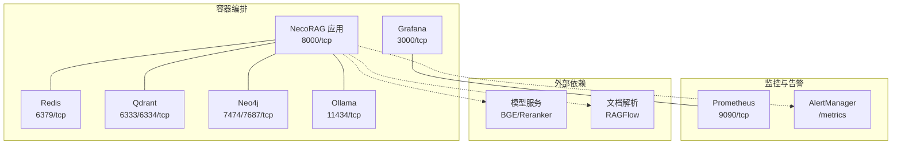
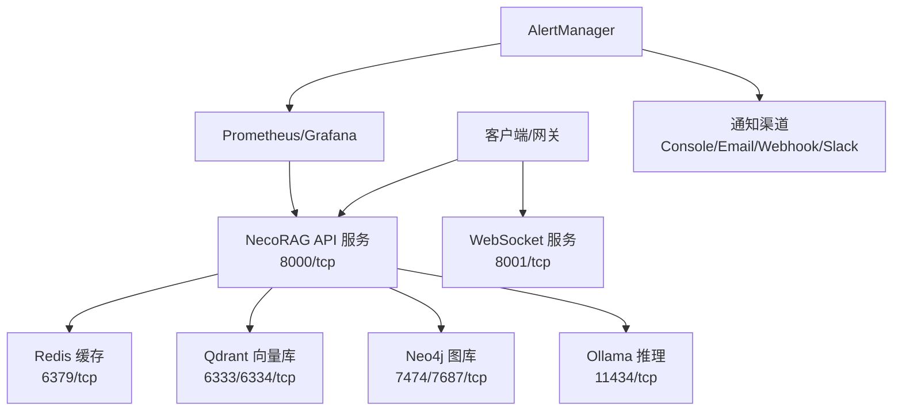
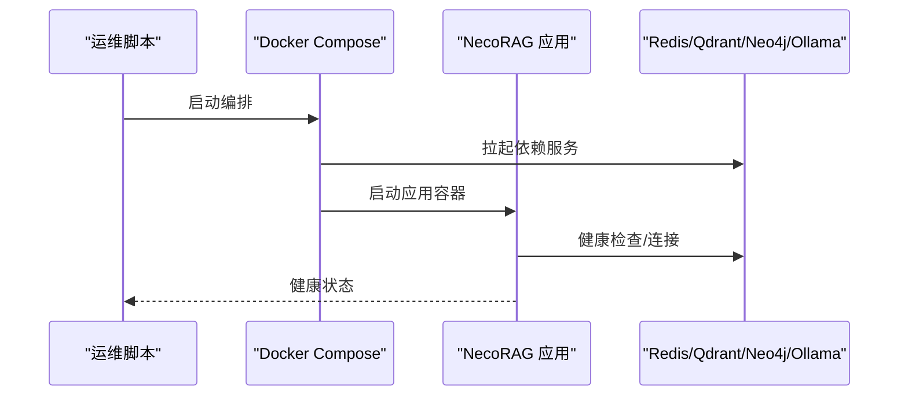
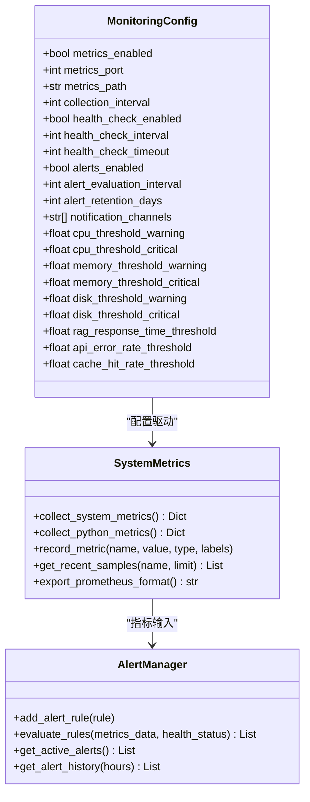
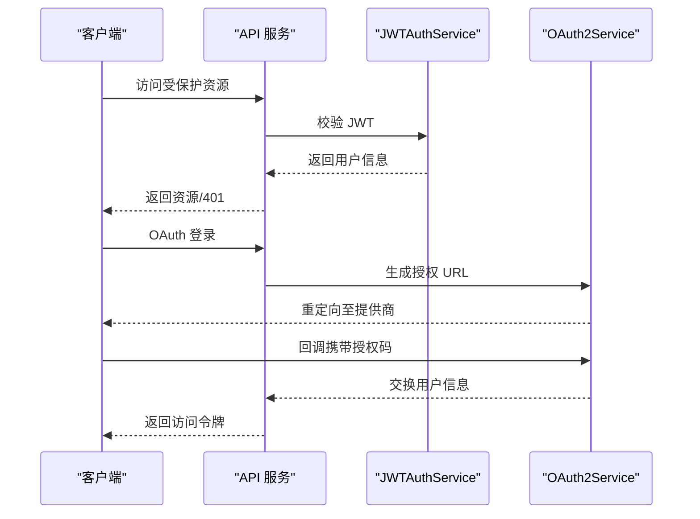
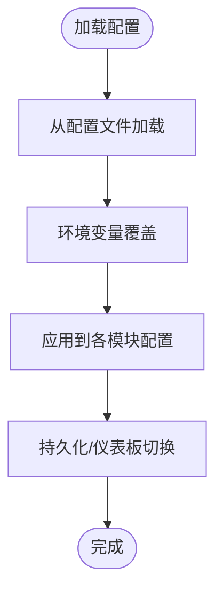
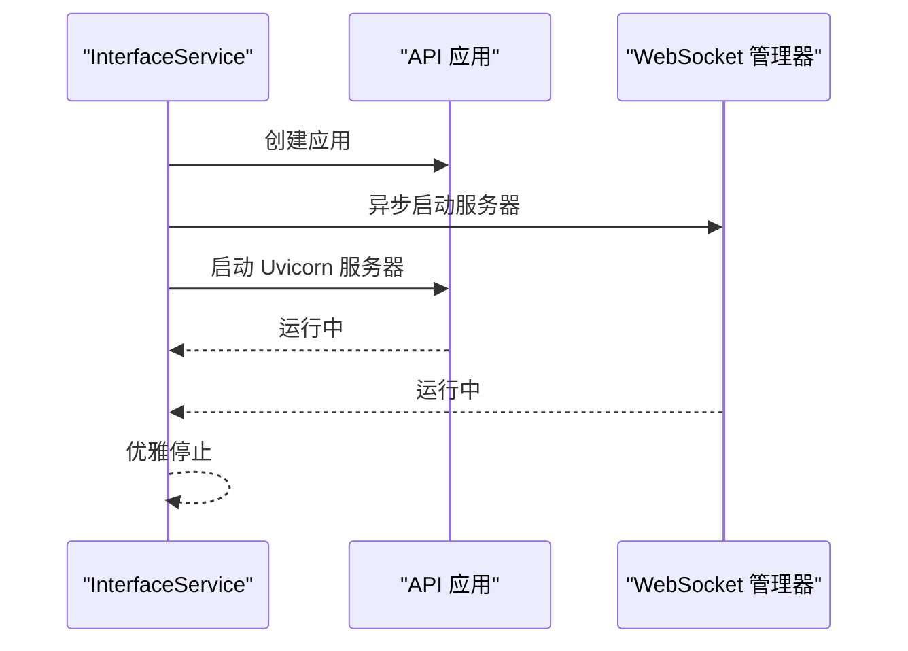
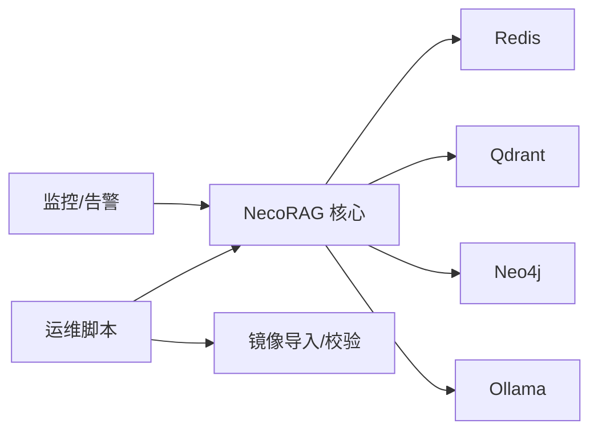
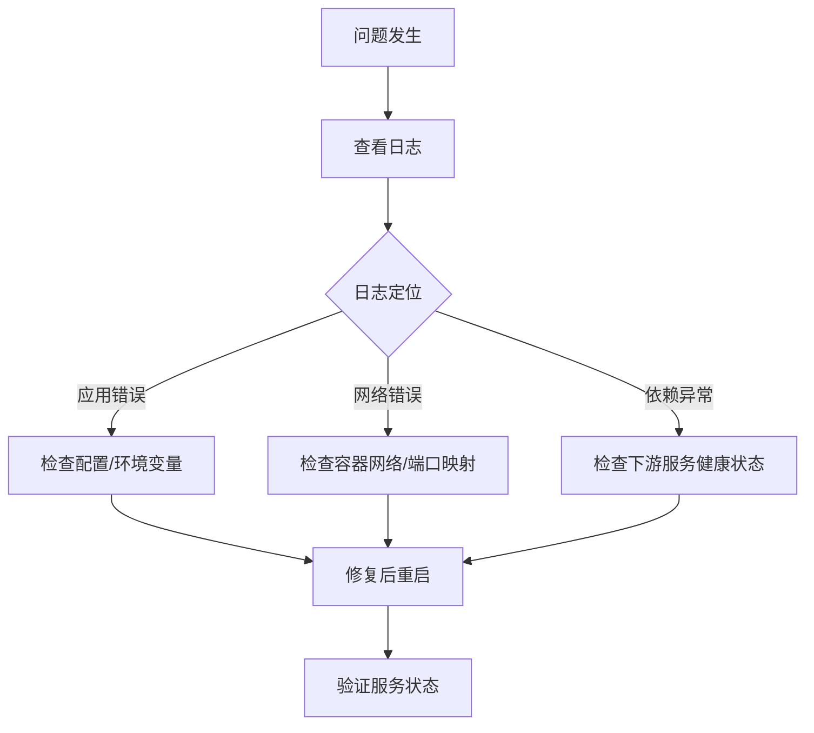

# 生产环境实践

<cite>
**本文引用的文件**
- [Dockerfile](file://devops/Dockerfile)
- [docker-compose.yml](file://devops/docker-compose.yml)
- [devops/README.md](file://devops/README.md)
- [3rd/DEPLOYMENT_GUIDE.md](file://3rd/DEPLOYMENT_GUIDE.md)
- [devops/scripts/start.sh](file://devops/scripts/start.sh)
- [devops/scripts/stop.sh](file://devops/scripts/stop.sh)
- [src/monitoring/config.py](file://src/monitoring/config.py)
- [src/monitoring/metrics.py](file://src/monitoring/metrics.py)
- [src/monitoring/alerts.py](file://src/monitoring/alerts.py)
- [src/security/config.py](file://src/security/config.py)
- [src/security/auth.py](file://src/security/auth.py)
- [src/security/permission.py](file://src/security/permission.py)
- [src/core/config.py](file://src/core/config.py)
- [src/dashboard/config_manager.py](file://src/dashboard/config_manager.py)
- [interface/main.py](file://interface/main.py)
- [3rd/docker_scripts/import_docker_images.sh](file://3rd/docker_scripts/import_docker_images.sh)
- [3rd/docker_scripts/verify_docker_images.sh](file://3rd/docker_scripts/verify_docker_images.sh)
</cite>

## 目录
1. [简介](#简介)
2. [项目结构](#项目结构)
3. [核心组件](#核心组件)
4. [架构总览](#架构总览)
5. [详细组件分析](#详细组件分析)
6. [依赖关系分析](#依赖关系分析)
7. [性能考虑](#性能考虑)
8. [故障排除指南](#故障排除指南)
9. [结论](#结论)
10. [附录](#附录)

## 简介
本文件面向生产环境的 NecoRAG 实践，围绕容器化部署、高可用与负载均衡、性能优化、监控告警、安全与访问控制、容量规划与扩展、备份与灾备以及版本升级与回滚策略进行系统化说明。文档结合仓库中的 Docker 配置、监控与安全模块、配置管理与接口服务等代码实现，提供可落地的生产实践建议。

## 项目结构
NecoRAG 的生产实践主要由以下部分组成：
- 容器化与编排：Dockerfile、docker-compose.yml、运维脚本与第三方镜像导入/校验脚本
- 监控与告警：指标采集、健康检查、告警规则与通知通道
- 安全与权限：JWT、OAuth2、速率限制、跨域与密码策略
- 配置管理：全局配置、模块配置、仪表板配置文件管理
- 接口服务：RESTful API 与 WebSocket 服务入口
- 部署指南：一键启动、最小化部署、LLM 集成与端口说明

图表来源
- [docker-compose.yml:1-164](file://devops/docker-compose.yml#L1-L164)
- [devops/README.md:29-46](file://devops/README.md#L29-L46)

章节来源
- [devops/Dockerfile:1-39](file://devops/Dockerfile#L1-L39)
- [devops/docker-compose.yml:1-164](file://devops/docker-compose.yml#L1-L164)
- [devops/README.md:27-46](file://devops/README.md#L27-L46)

## 核心组件
- 容器镜像与入口：基于 Python 3.11 slim 的镜像，暴露 8000 端口，内置健康检查，启动仪表盘服务
- 编排服务：包含 Redis、Qdrant、Neo4j、Ollama、Grafana；通过环境变量与网络隔离实现解耦
- 监控与告警：系统指标采集、应用指标记录、告警规则与多通道通知
- 安全与权限：JWT 签发与校验、OAuth2 集成、速率限制、XSS/CSRF 保护、密码强度策略
- 配置管理：全局配置类、模块配置、仪表板配置文件持久化与切换
- 接口服务：RESTful API 与 WebSocket 并行启动，统一日志与优雅关闭

章节来源
- [devops/Dockerfile:1-39](file://devops/Dockerfile#L1-L39)
- [devops/docker-compose.yml:118-148](file://devops/docker-compose.yml#L118-L148)
- [src/monitoring/metrics.py:1-207](file://src/monitoring/metrics.py#L1-L207)
- [src/monitoring/alerts.py:1-435](file://src/monitoring/alerts.py#L1-L435)
- [src/security/config.py:1-92](file://src/security/config.py#L1-L92)
- [src/security/auth.py:1-210](file://src/security/auth.py#L1-L210)
- [src/security/permission.py:1-187](file://src/security/permission.py#L1-L187)
- [src/core/config.py:275-420](file://src/core/config.py#L275-L420)
- [src/dashboard/config_manager.py:1-315](file://src/dashboard/config_manager.py#L1-L315)
- [interface/main.py:1-82](file://interface/main.py#L1-L82)

## 架构总览
生产环境采用“容器即服务”的架构，NecoRAG 应用作为核心服务，通过环境变量与网络与下游存储与推理服务解耦。监控系统通过 Prometheus/Grafana 实现指标采集与可视化，告警系统负责异常检测与通知。

图表来源
- [interface/main.py:14-79](file://interface/main.py#L14-L79)
- [devops/docker-compose.yml:4-164](file://devops/docker-compose.yml#L4-L164)
- [src/monitoring/alerts.py:237-435](file://src/monitoring/alerts.py#L237-L435)

## 详细组件分析

### 容器化与编排
- 镜像构建：基础镜像为 python:3.11-slim，安装系统依赖后复制依赖与源码，创建数据/配置/日志目录，暴露 8000 端口，健康检查访问 /api/stats
- 编排服务：包含 necorag 应用、Redis、Qdrant、Neo4j、Ollama、Grafana；通过环境变量注入 LLM/数据库连接信息；服务间通过自定义桥接网络通信
- 运维脚本：一键启动/停止，支持开发/最小化/完整模式；支持带 LLM 的启动与模型拉取

图表来源
- [devops/scripts/start.sh:48-95](file://devops/scripts/start.sh#L48-L95)
- [devops/Dockerfile:33-39](file://devops/Dockerfile#L33-L39)
- [devops/docker-compose.yml:118-148](file://devops/docker-compose.yml#L118-L148)

章节来源
- [devops/Dockerfile:1-39](file://devops/Dockerfile#L1-L39)
- [devops/docker-compose.yml:1-164](file://devops/docker-compose.yml#L1-L164)
- [devops/scripts/start.sh:1-101](file://devops/scripts/start.sh#L1-L101)
- [devops/scripts/stop.sh:1-36](file://devops/scripts/stop.sh#L1-L36)

### 监控与告警
- 指标采集：系统指标（CPU/内存/磁盘/网络/进程）、Python 运行时指标、应用指标（RAG 响应时间、API 调用、缓存操作、模型推理）
- 健康检查：系统健康状态与阈值配置，支持自定义规则表达式
- 告警规则：CPU/内存使用率阈值、系统健康状态异常等默认规则，支持多通道通知（控制台、邮件、Webhook、Slack）

图表来源
- [src/monitoring/config.py:27-117](file://src/monitoring/config.py#L27-L117)
- [src/monitoring/metrics.py:25-207](file://src/monitoring/metrics.py#L25-L207)
- [src/monitoring/alerts.py:237-435](file://src/monitoring/alerts.py#L237-L435)

章节来源
- [src/monitoring/config.py:1-117](file://src/monitoring/config.py#L1-L117)
- [src/monitoring/metrics.py:1-207](file://src/monitoring/metrics.py#L1-L207)
- [src/monitoring/alerts.py:1-435](file://src/monitoring/alerts.py#L1-L435)

### 安全与访问控制
- JWT：密钥、算法、过期间配置，令牌签发与解码，依赖注入获取当前用户
- OAuth2：GitHub/Google 等提供商配置，授权 URL 生成与回调处理
- 速率限制：请求次数与窗口配置
- 安全策略：CSRF/XSS 保护、允许的 CORS 来源、密码强度要求

图表来源
- [src/security/auth.py:56-133](file://src/security/auth.py#L56-L133)
- [src/security/auth.py:134-191](file://src/security/auth.py#L134-L191)
- [src/security/config.py:11-92](file://src/security/config.py#L11-L92)

章节来源
- [src/security/auth.py:1-210](file://src/security/auth.py#L1-L210)
- [src/security/permission.py:1-187](file://src/security/permission.py#L1-L187)
- [src/security/config.py:1-92](file://src/security/config.py#L1-L92)

### 配置管理与仪表板
- 全局配置：LLM、感知层、记忆层、检索层、巩固层、响应层、领域权重、知识演化等模块化配置
- 仪表板配置：Profile 的创建、切换、复制、导入导出、参数验证与持久化

图表来源
- [src/core/config.py:336-377](file://src/core/config.py#L336-L377)
- [src/dashboard/config_manager.py:14-315](file://src/dashboard/config_manager.py#L14-L315)

章节来源
- [src/core/config.py:1-420](file://src/core/config.py#L1-L420)
- [src/dashboard/config_manager.py:1-315](file://src/dashboard/config_manager.py#L1-L315)

### 接口服务与并发处理
- 同时启动 RESTful API 与 WebSocket 服务，使用 uvicorn 运行 API，异步启动 WebSocket
- 日志统一配置，优雅停止流程

图表来源
- [interface/main.py:30-79](file://interface/main.py#L30-L79)

章节来源
- [interface/main.py:1-82](file://interface/main.py#L1-L82)

## 依赖关系分析
- 组件耦合：NecoRAG 应用通过环境变量与下游服务解耦；监控与告警模块独立于业务逻辑
- 外部依赖：Redis/Qdrant/Neo4j/Ollama/Grafana/Prometheus；第三方镜像导入脚本提供镜像选择与校验
- 配置依赖：全局配置与模块配置相互独立，仪表板配置独立于核心配置

图表来源
- [devops/docker-compose.yml:118-148](file://devops/docker-compose.yml#L118-L148)
- [3rd/docker_scripts/import_docker_images.sh:297-328](file://3rd/docker_scripts/import_docker_images.sh#L297-L328)
- [3rd/docker_scripts/verify_docker_images.sh:24-31](file://3rd/docker_scripts/verify_docker_images.sh#L24-L31)

章节来源
- [devops/docker-compose.yml:1-164](file://devops/docker-compose.yml#L1-L164)
- [3rd/docker_scripts/import_docker_images.sh:1-589](file://3rd/docker_scripts/import_docker_images.sh#L1-L589)
- [3rd/docker_scripts/verify_docker_images.sh:1-84](file://3rd/docker_scripts/verify_docker_images.sh#L1-L84)

## 性能考虑
- 资源限制：通过 Compose 的 deploy.resources 限制 CPU/内存，避免资源争抢
- 缓存优化：Redis 缓存热点数据，HNSW 索引提升向量检索性能
- 数据库调优：Qdrant/HNSW 参数、Neo4j 内存与插件配置、Redis 持久化策略
- 并发与超时：最大并发查询、请求超时、模型推理超时
- 指标导出：Prometheus 格式导出，便于外部监控系统抓取

章节来源
- [devops/README.md:283-305](file://devops/README.md#L283-L305)
- [src/monitoring/metrics.py:144-174](file://src/monitoring/metrics.py#L144-L174)
- [src/core/config.py:390-420](file://src/core/config.py#L390-L420)

## 故障排除指南
- 常见问题：容器无法启动、端口冲突、数据库连接失败
- 排查步骤：查看日志、检查配置、网络连通性、健康检查状态
- 运维脚本：一键启动/停止、最小化部署、清理数据卷

图表来源
- [devops/README.md:239-282](file://devops/README.md#L239-L282)
- [devops/scripts/start.sh:28-34](file://devops/scripts/start.sh#L28-L34)

章节来源
- [devops/README.md:239-282](file://devops/README.md#L239-L282)
- [devops/scripts/start.sh:1-101](file://devops/scripts/start.sh#L1-L101)
- [devops/scripts/stop.sh:1-36](file://devops/scripts/stop.sh#L1-L36)

## 结论
NecoRAG 的生产实践以容器化为核心，通过编排与环境变量实现解耦，结合监控告警、安全权限与配置管理，形成可扩展、可观测、可治理的生产体系。建议在生产中启用资源限制、缓存与索引优化、完善的告警与通知，并建立定期的备份与演练流程。

## 附录

### 部署模式与端口
- 单机/集群/云部署：依据 Compose 与脚本支持不同部署形态
- 端口清单：应用、数据库、推理、监控等端口说明

章节来源
- [devops/README.md:212-239](file://devops/README.md#L212-L239)
- [3rd/DEPLOYMENT_GUIDE.md:724-745](file://3rd/DEPLOYMENT_GUIDE.md#L724-L745)

### 容量规划与扩展策略
- 资源规划：CPU/内存/GPU、存储与网络带宽
- 扩展策略：水平扩展应用副本、数据库分片/集群、缓存扩容

章节来源
- [devops/README.md:283-305](file://devops/README.md#L283-L305)
- [3rd/DEPLOYMENT_GUIDE.md:255-312](file://3rd/DEPLOYMENT_GUIDE.md#L255-L312)

### 备份与灾难恢复
- 数据卷与持久化：Redis/Qdrant/Neo4j/Ollama 数据目录
- 备份策略：定期快照/导出、异地容灾、恢复演练

章节来源
- [devops/docker-compose.yml:149-158](file://devops/docker-compose.yml#L149-L158)
- [devops/README.md:195-211](file://devops/README.md#L195-L211)

### 版本升级与回滚
- 镜像版本管理：第三方镜像导入与校验脚本
- 配置迁移：仪表板配置文件导入导出与版本化管理
- 回滚策略：滚动回滚、灰度发布、配置回滚

章节来源
- [3rd/docker_scripts/import_docker_images.sh:1-589](file://3rd/docker_scripts/import_docker_images.sh#L1-L589)
- [3rd/docker_scripts/verify_docker_images.sh:1-84](file://3rd/docker_scripts/verify_docker_images.sh#L1-L84)
- [src/dashboard/config_manager.py:230-278](file://src/dashboard/config_manager.py#L230-L278)