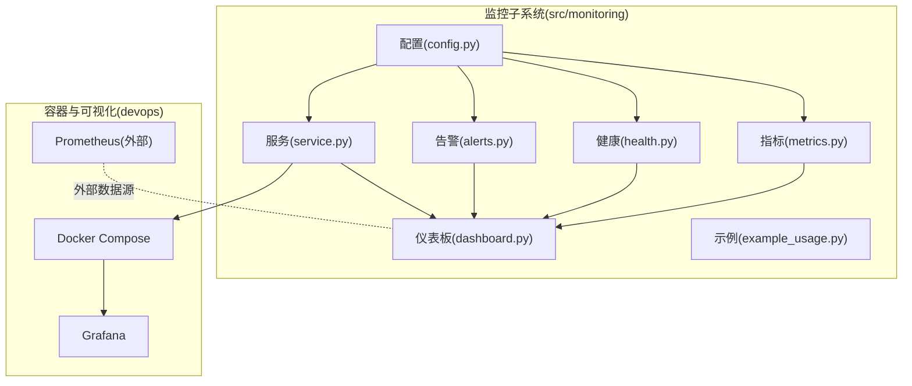
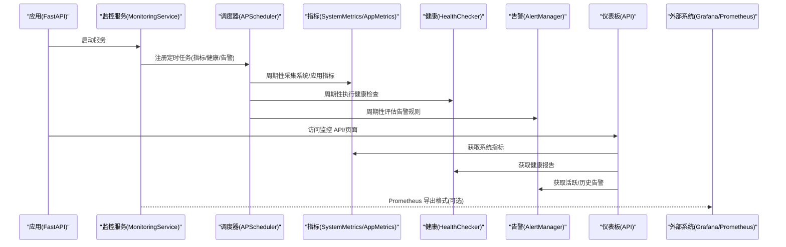
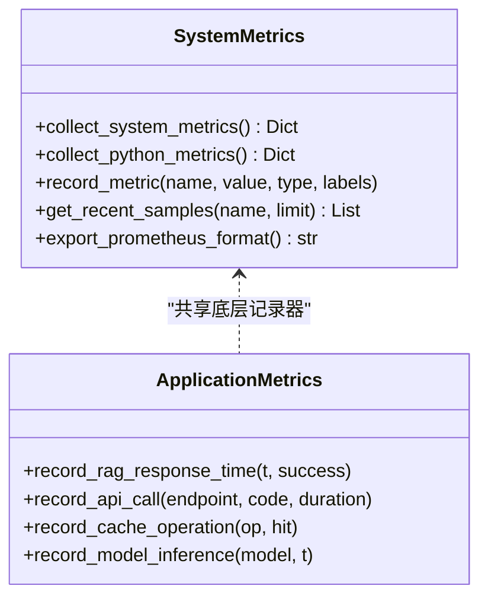
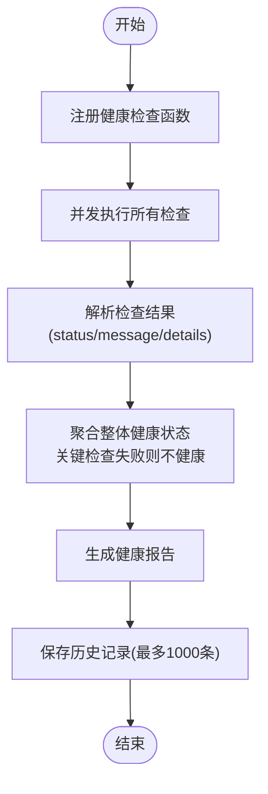
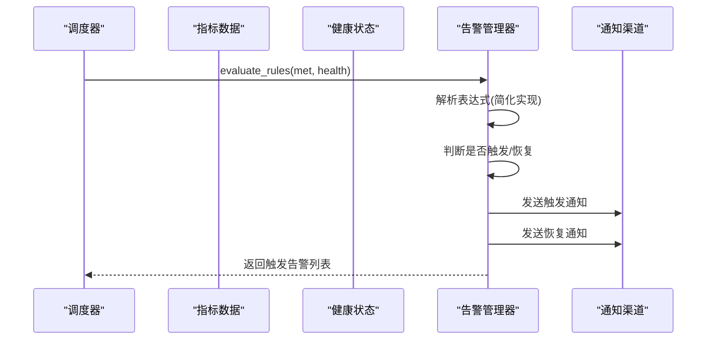
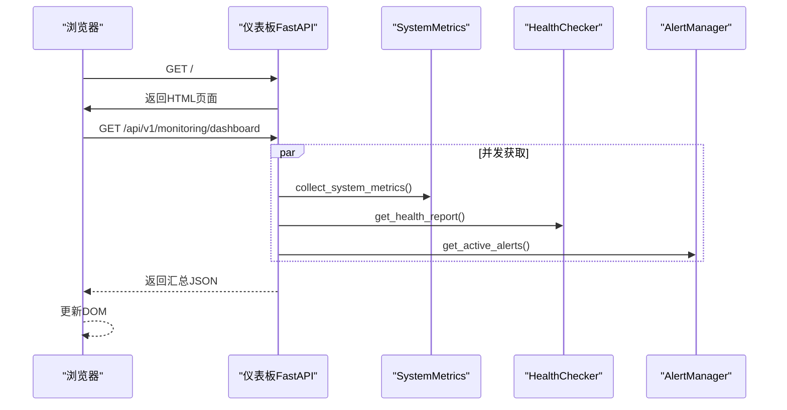
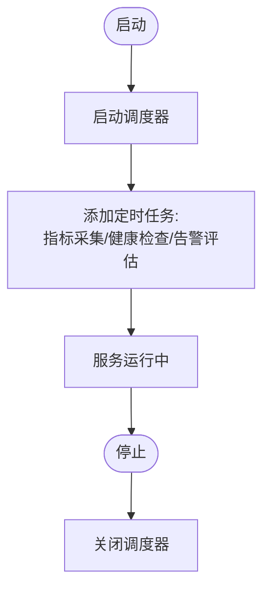
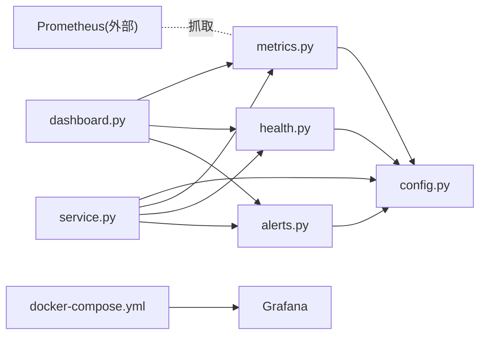

# 监控告警

<cite>
**本文引用的文件**
- [src/monitoring/__init__.py](file://src/monitoring/__init__.py)
- [src/monitoring/config.py](file://src/monitoring/config.py)
- [src/monitoring/metrics.py](file://src/monitoring/metrics.py)
- [src/monitoring/alerts.py](file://src/monitoring/alerts.py)
- [src/monitoring/health.py](file://src/monitoring/health.py)
- [src/monitoring/service.py](file://src/monitoring/service.py)
- [src/monitoring/dashboard.py](file://src/monitoring/dashboard.py)
- [src/monitoring/example_usage.py](file://src/monitoring/example_usage.py)
- [devops/docker-compose.yml](file://devops/docker-compose.yml)
- [devops/Dockerfile](file://devops/Dockerfile)
- [pyproject.toml](file://pyproject.toml)
- [requirements.txt](file://requirements.txt)
</cite>

## 目录
1. [引言](#引言)
2. [项目结构](#项目结构)
3. [核心组件](#核心组件)
4. [架构总览](#架构总览)
5. [详细组件分析](#详细组件分析)
6. [依赖分析](#依赖分析)
7. [性能考虑](#性能考虑)
8. [故障排查指南](#故障排查指南)
9. [结论](#结论)
10. [附录](#附录)

## 引言
本文件面向生产环境，系统化阐述 NecoRAG 监控告警体系的实现与运维实践，覆盖指标体系设计（系统性能、业务指标、错误指标）、告警规则配置（阈值、级别、通知渠道）、健康检查机制（可用性、依赖服务、自动恢复思路）、实时监控面板（关键指标、趋势、异常检测）、监控数据存储与查询（时序数据库选择与查询优化），以及扩展性与维护策略。

## 项目结构
监控子系统位于 src/monitoring 目录，采用模块化设计，包含配置、指标、健康检查、告警、仪表板与服务入口等模块，并通过 Docker Compose 提供 Grafana 可视化与 Prometheus 数据源对接能力。

**图表来源**
- [src/monitoring/config.py:27-100](file://src/monitoring/config.py#L27-L100)
- [src/monitoring/metrics.py:25-207](file://src/monitoring/metrics.py#L25-L207)
- [src/monitoring/health.py:34-300](file://src/monitoring/health.py#L34-L300)
- [src/monitoring/alerts.py:237-435](file://src/monitoring/alerts.py#L237-L435)
- [src/monitoring/dashboard.py:17-250](file://src/monitoring/dashboard.py#L17-L250)
- [src/monitoring/service.py:21-214](file://src/monitoring/service.py#L21-L214)
- [devops/docker-compose.yml:99-117](file://devops/docker-compose.yml#L99-L117)

**章节来源**
- [src/monitoring/__init__.py:1-35](file://src/monitoring/__init__.py#L1-L35)
- [src/monitoring/config.py:27-117](file://src/monitoring/config.py#L27-L117)
- [src/monitoring/metrics.py:25-207](file://src/monitoring/metrics.py#L25-L207)
- [src/monitoring/health.py:34-300](file://src/monitoring/health.py#L34-L300)
- [src/monitoring/alerts.py:237-435](file://src/monitoring/alerts.py#L237-L435)
- [src/monitoring/dashboard.py:17-250](file://src/monitoring/dashboard.py#L17-L250)
- [src/monitoring/service.py:21-214](file://src/monitoring/service.py#L21-L214)
- [devops/docker-compose.yml:99-117](file://devops/docker-compose.yml#L99-L117)

## 核心组件
- 配置管理：集中定义指标采集、健康检查、告警与通知渠道的参数，支持环境变量覆盖。
- 指标采集：系统级与应用级指标收集，支持 Prometheus 导出格式。
- 健康检查：多维度健康检查与整体状态聚合，支持并发执行与历史记录。
- 告警管理：规则驱动的告警评估、状态机与多渠道通知。
- 仪表板：FastAPI 提供的监控 API 与前端页面，支持实时数据刷新。
- 服务入口：基于 APScheduler 的定时任务调度，统一启动/停止与状态查询。

**章节来源**
- [src/monitoring/config.py:27-117](file://src/monitoring/config.py#L27-L117)
- [src/monitoring/metrics.py:25-207](file://src/monitoring/metrics.py#L25-L207)
- [src/monitoring/health.py:34-300](file://src/monitoring/health.py#L34-L300)
- [src/monitoring/alerts.py:237-435](file://src/monitoring/alerts.py#L237-L435)
- [src/monitoring/dashboard.py:17-250](file://src/monitoring/dashboard.py#L17-L250)
- [src/monitoring/service.py:21-214](file://src/monitoring/service.py#L21-L214)

## 架构总览
监控系统通过服务入口统一调度指标采集、健康检查与告警评估，并通过仪表板提供可视化与 API 查询；同时，生产环境建议结合 Grafana/Prometheus 进行长期存储与可视化。

**图表来源**
- [src/monitoring/service.py:38-154](file://src/monitoring/service.py#L38-L154)
- [src/monitoring/metrics.py:97-174](file://src/monitoring/metrics.py#L97-L174)
- [src/monitoring/health.py:107-154](file://src/monitoring/health.py#L107-L154)
- [src/monitoring/alerts.py:291-344](file://src/monitoring/alerts.py#L291-L344)
- [src/monitoring/dashboard.py:26-104](file://src/monitoring/dashboard.py#L26-L104)
- [src/monitoring/metrics.py:144-174](file://src/monitoring/metrics.py#L144-L174)

## 详细组件分析

### 指标体系设计与采集
- 系统指标：CPU、内存、磁盘、网络、进程数、运行时长等，来源于 psutil 与 Python 运行时统计。
- 应用指标：RAG 响应时间、API 请求耗时与计数、缓存命中/未命中等，便于业务 SLA 监控。
- Prometheus 导出：将最近样本导出为 Prometheus 格式，便于外部系统抓取。

**图表来源**
- [src/monitoring/metrics.py:25-207](file://src/monitoring/metrics.py#L25-L207)

**章节来源**
- [src/monitoring/metrics.py:25-207](file://src/monitoring/metrics.py#L25-L207)

### 健康检查机制
- 健康状态枚举：健康、降级、不健康、未知。
- 检查注册与并发执行：支持关键/非关键检查，整体状态由关键检查决定。
- 报告与历史：提供健康报告与最近检查历史分组，便于趋势分析。

**图表来源**
- [src/monitoring/health.py:107-154](file://src/monitoring/health.py#L107-L154)
- [src/monitoring/health.py:156-198](file://src/monitoring/health.py#L156-L198)

**章节来源**
- [src/monitoring/health.py:34-300](file://src/monitoring/health.py#L34-L300)

### 告警规则与通知
- 规则模型：规则名、表达式、级别、持续时间、标签与注解。
- 状态机：触发中、已解决、已静默。
- 通知渠道：控制台、邮件、Webhook、Slack，支持按配置启用。
- 评估流程：根据系统指标与健康状态评估规则，触发/恢复告警并发送通知。

**图表来源**
- [src/monitoring/alerts.py:291-344](file://src/monitoring/alerts.py#L291-L344)
- [src/monitoring/alerts.py:374-382](file://src/monitoring/alerts.py#L374-L382)

**章节来源**
- [src/monitoring/alerts.py:237-435](file://src/monitoring/alerts.py#L237-L435)

### 实时监控面板
- API 路由：系统指标、应用指标、健康状态、告警列表、仪表板汇总。
- 前端页面：定期拉取 /api/v1/monitoring/dashboard，更新系统状态、CPU/内存使用率与活跃告警数量。
- 并发获取：仪表板数据通过并发任务并行获取，降低延迟。

**图表来源**
- [src/monitoring/dashboard.py:107-111](file://src/monitoring/dashboard.py#L107-L111)
- [src/monitoring/dashboard.py:82-101](file://src/monitoring/dashboard.py#L82-L101)

**章节来源**
- [src/monitoring/dashboard.py:17-250](file://src/monitoring/dashboard.py#L17-L250)

### 监控服务与调度
- 启停控制：启动时注册指标采集、健康检查、告警评估三类定时任务；停止时关闭调度器。
- 配置驱动：采集间隔、健康检查间隔、告警评估间隔、保留天数等均可配置。
- 状态查询：提供 /status 接口返回运行状态与组件开关。

**图表来源**
- [src/monitoring/service.py:38-98](file://src/monitoring/service.py#L38-L98)
- [src/monitoring/service.py:155-170](file://src/monitoring/service.py#L155-L170)

**章节来源**
- [src/monitoring/service.py:21-214](file://src/monitoring/service.py#L21-L214)

## 依赖分析
- 内部依赖：各模块通过配置模块进行参数注入，服务模块协调指标、健康、告警与仪表板。
- 外部依赖：Prometheus 客户端库用于指标导出；Grafana 作为可视化工具；Docker Compose 提供容器化与健康检查。
- 依赖清单：核心依赖、Web 框架、监控与告警、安全模块、可视化等均有明确版本要求。

**图表来源**
- [src/monitoring/metrics.py:13-13](file://src/monitoring/metrics.py#L13-L13)
- [src/monitoring/config.py:5-8](file://src/monitoring/config.py#L5-L8)
- [src/monitoring/service.py:14-18](file://src/monitoring/service.py#L14-L18)
- [devops/docker-compose.yml:99-117](file://devops/docker-compose.yml#L99-L117)

**章节来源**
- [pyproject.toml:72-74](file://pyproject.toml#L72-L74)
- [requirements.txt:92-96](file://requirements.txt#L92-L96)
- [devops/docker-compose.yml:99-117](file://devops/docker-compose.yml#L99-L117)

## 性能考虑
- 指标采集：系统指标采集开销较低，建议采集间隔≥15s；对高频场景可考虑滑动窗口或采样策略。
- 健康检查：并发执行所有检查，避免阻塞；关键检查失败快速判定整体不健康。
- 告警评估：表达式简化实现，建议在规则层面做幂等与去抖动处理。
- 通知渠道：异步发送，失败日志记录，避免阻塞主流程。
- 可视化：仪表板数据并发获取，前端轮询周期建议≥5s，避免过度刷新。

[本节为通用性能建议，无需特定文件引用]

## 故障排查指南
- 服务启动失败：检查配置项与依赖库安装，查看日志输出。
- 指标为空：确认指标采集任务已注册且未被禁用；检查导出格式是否正确。
- 健康检查异常：检查关键检查函数实现与外部依赖连通性；查看历史记录定位问题。
- 告警未触发/误触发：核对规则表达式与阈值配置；检查通知渠道可用性。
- 仪表板空白：确认路由挂载与静态页面返回；检查 CORS 与跨域配置。

**章节来源**
- [src/monitoring/service.py:78-98](file://src/monitoring/service.py#L78-L98)
- [src/monitoring/metrics.py:144-174](file://src/monitoring/metrics.py#L144-L174)
- [src/monitoring/health.py:95-105](file://src/monitoring/health.py#L95-L105)
- [src/monitoring/alerts.py:374-382](file://src/monitoring/alerts.py#L374-L382)
- [src/monitoring/dashboard.py:107-111](file://src/monitoring/dashboard.py#L107-L111)

## 结论
NecoRAG 监控告警系统以模块化方式实现了指标采集、健康检查、告警管理与可视化面板，并通过配置驱动与调度器实现生产级的自动化运维。结合 Grafana/Prometheus 可构建完善的长期监控与告警体系，满足生产环境对稳定性与可观测性的需求。

## 附录

### 指标体系与阈值建议
- 系统性能指标
  - CPU 使用率：警告阈值 80%，严重阈值 95%
  - 内存使用率：警告阈值 85%，严重阈值 95%
  - 磁盘使用率：警告阈值 80%，严重阈值 95%
- 业务指标
  - RAG 响应时间：建议按业务 SLA 设定（例如 P95 ≤ 5s）
  - API 错误率：建议按端点设定（如 5%）
  - 缓存命中率：建议 ≥80%
- 错误指标
  - 业务错误计数与错误率，结合告警规则进行阈值报警

**章节来源**
- [src/monitoring/config.py:52-64](file://src/monitoring/config.py#L52-L64)

### 告警规则配置示例
- 规则级别：INFO/WARNING/ERROR/CRITICAL
- 表达式：支持基于健康状态与系统指标的简单表达式
- 持续时间：建议 5 分钟以上，避免瞬时波动误报
- 标签与注解：用于分类与补充说明，便于筛选与通知

**章节来源**
- [src/monitoring/alerts.py:26-53](file://src/monitoring/alerts.py#L26-L53)
- [src/monitoring/alerts.py:401-427](file://src/monitoring/alerts.py#L401-L427)

### 通知渠道配置
- 控制台：默认启用，便于本地调试
- 邮件：需配置 SMTP 参数与收件人
- Webhook/Slack：需配置目标 URL，支持异步发送

**章节来源**
- [src/monitoring/alerts.py:55-235](file://src/monitoring/alerts.py#L55-L235)
- [src/monitoring/config.py:46-51](file://src/monitoring/config.py#L46-L51)

### 健康检查与自动恢复策略
- 健康检查：关键检查失败即整体不健康；降级检查影响整体状态但非致命
- 自动恢复：建议结合容器编排的健康检查与重启策略，配合告警通知进行人工干预

**章节来源**
- [src/monitoring/health.py:132-154](file://src/monitoring/health.py#L132-L154)
- [devops/docker-compose.yml:16-22](file://devops/docker-compose.yml#L16-L22)
- [devops/docker-compose.yml:38-44](file://devops/docker-compose.yml#L38-L44)
- [devops/docker-compose.yml:64-70](file://devops/docker-compose.yml#L64-L70)
- [devops/docker-compose.yml:90-96](file://devops/docker-compose.yml#L90-L96)

### 实时监控面板使用
- 访问路径：/（仪表板页面）、/api/v1/monitoring/dashboard（汇总数据）
- 关键指标：CPU/内存使用率、整体健康状态、活跃告警数量
- 趋势分析：结合 Grafana 面板与历史数据进行趋势观察
- 异常检测：结合告警规则与健康检查报告定位异常

**章节来源**
- [src/monitoring/dashboard.py:107-111](file://src/monitoring/dashboard.py#L107-L111)
- [src/monitoring/dashboard.py:82-101](file://src/monitoring/dashboard.py#L82-L101)

### 监控数据存储与查询
- 时序数据库：建议使用 Prometheus 存储短期指标，Grafana 进行可视化
- 导出格式：系统指标支持 Prometheus 格式导出，便于外部抓取
- 查询优化：合理设置采集间隔与保留策略，避免数据膨胀

**章节来源**
- [src/monitoring/metrics.py:144-174](file://src/monitoring/metrics.py#L144-L174)
- [devops/docker-compose.yml:99-117](file://devops/docker-compose.yml#L99-L117)
- [pyproject.toml:72-74](file://pyproject.toml#L72-L74)
- [requirements.txt:92-96](file://requirements.txt#L92-L96)

### 扩展性与维护策略
- 扩展指标：通过 SystemMetrics.record_metric 扩展自定义指标
- 扩展健康检查：通过 HealthChecker.register_check 注册新的检查函数
- 扩展告警规则：通过 AlertManager.add_alert_rule 添加规则
- 维护策略：定期审查阈值与规则，清理历史告警与检查记录，升级依赖与配置

**章节来源**
- [src/monitoring/metrics.py:126-143](file://src/monitoring/metrics.py#L126-L143)
- [src/monitoring/health.py:42-48](file://src/monitoring/health.py#L42-L48)
- [src/monitoring/alerts.py:280-289](file://src/monitoring/alerts.py#L280-L289)
- [src/monitoring/service.py:155-170](file://src/monitoring/service.py#L155-L170)