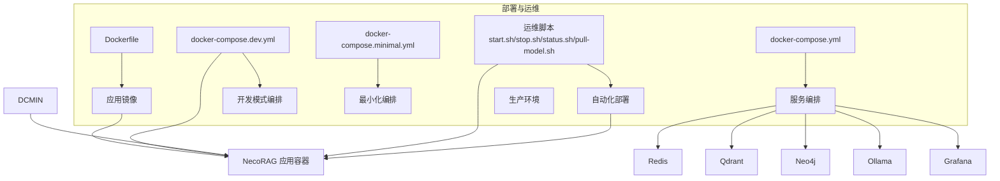
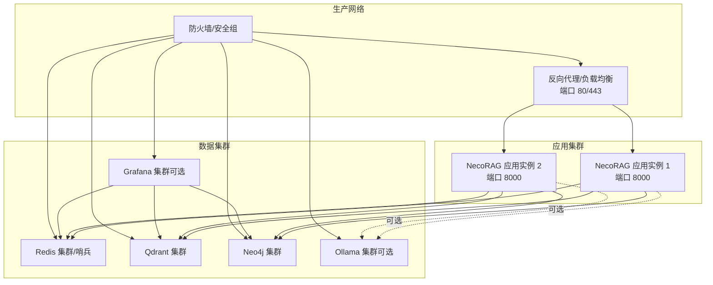
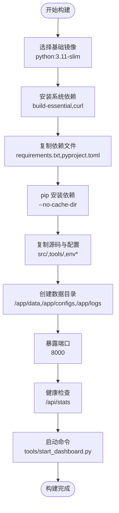
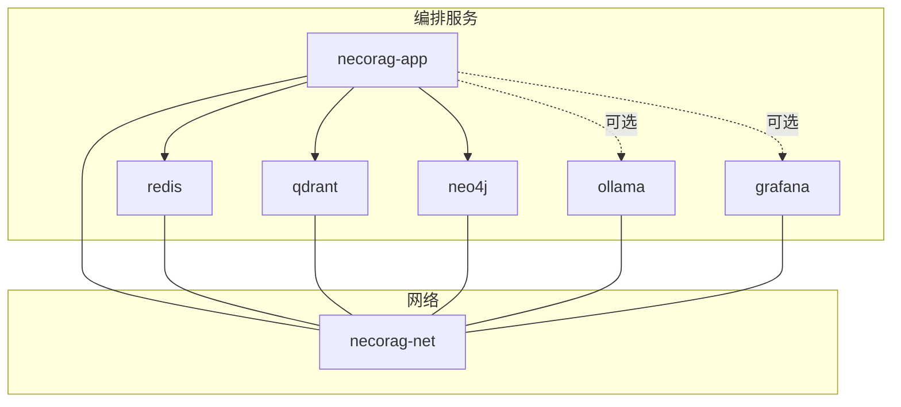
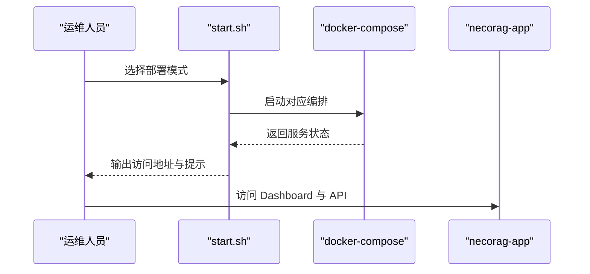
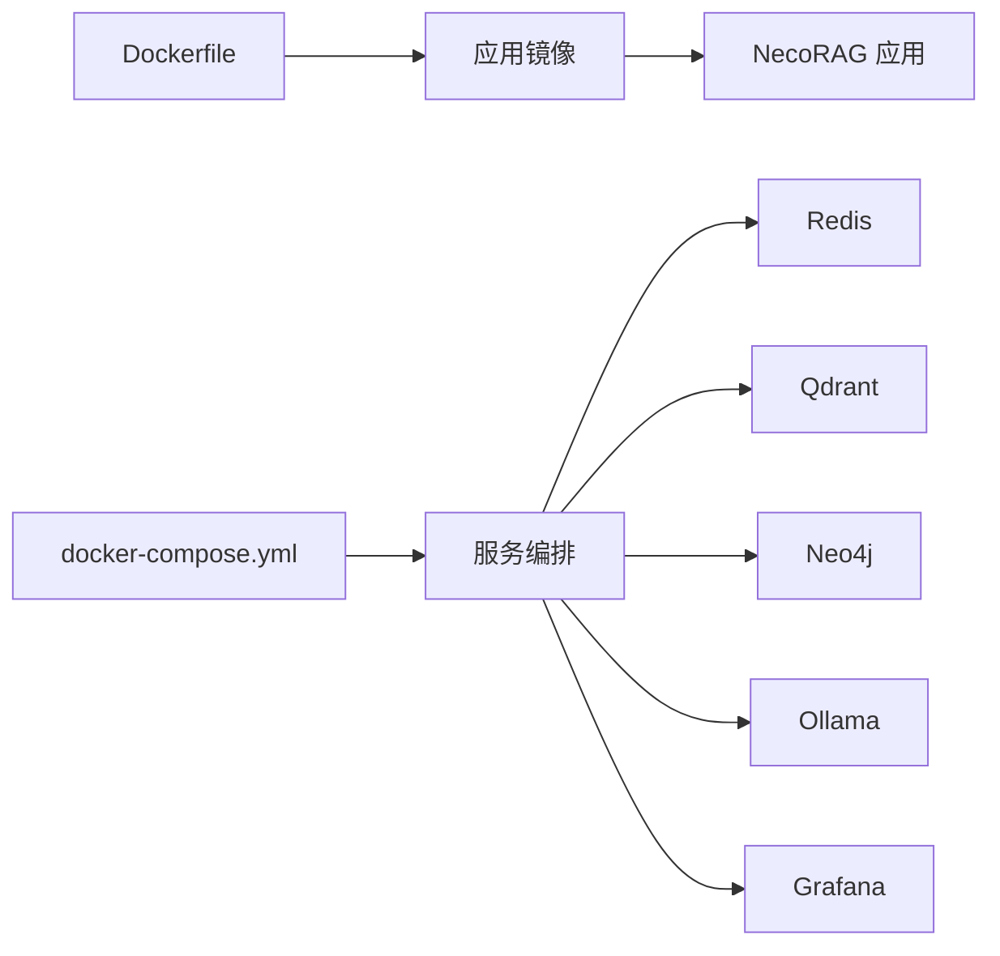

# 部署配置

<cite>
**本文引用的文件**
- [Dockerfile](file://devops/Dockerfile)
- [docker-compose.yml](file://devops/docker-compose.yml)
- [docker-compose.dev.yml](file://devops/docker-compose.dev.yml)
- [docker-compose.minimal.yml](file://devops/docker-compose.minimal.yml)
- [.dockerignore](file://devops/.dockerignore)
- [start.sh](file://devops/scripts/start.sh)
- [stop.sh](file://devops/scripts/stop.sh)
- [status.sh](file://devops/scripts/status.sh)
- [pull-model.sh](file://devops/scripts/pull-model.sh)
- [生产环境配置.md](file://wiki/wiki/部署与运维/生产环境配置.md)
- [监控与告警.md](file://wiki/wiki/部署与运维/监控与告警.md)
- [DEPLOYMENT_GUIDE.md](file://3rd/DEPLOYMENT_GUIDE.md)
- [README.md](file://devops/README.md)
- [requirements.txt](file://requirements.txt)
</cite>

## 目录
1. [引言](#引言)
2. [项目结构](#项目结构)
3. [核心组件](#核心组件)
4. [架构总览](#架构总览)
5. [详细组件分析](#详细组件分析)
6. [依赖分析](#依赖分析)
7. [性能考虑](#性能考虑)
8. [故障排查指南](#故障排查指南)
9. [结论](#结论)
10. [附录](#附录)

## 引言
本文件面向生产环境部署与运维，围绕容器化镜像构建、Docker Compose 编排、生产专用配置、容器编排最佳实践、自动化部署脚本与监控日志配置，结合代码库中的 Dockerfile、docker-compose 配置与 Wiki 文档，给出可落地的实施指南。目标是在满足功能需求的同时，确保系统的稳定性、安全性与可维护性。

## 项目结构
- devops 目录包含 Dockerfile、docker-compose 编排文件、.dockerignore 与运维脚本，是生产部署的核心。
- wiki/wiki/部署与运维 目录提供生产环境配置与监控告警的权威说明。
- 3rd 目录提供部署指南与镜像导入脚本，便于大规模环境快速准备。

图表来源
- [Dockerfile:1-39](file://devops/Dockerfile#L1-L39)
- [docker-compose.yml:1-164](file://devops/docker-compose.yml#L1-L164)
- [docker-compose.dev.yml:1-16](file://devops/docker-compose.dev.yml#L1-L16)
- [docker-compose.minimal.yml:1-33](file://devops/docker-compose.minimal.yml#L1-L33)
- [start.sh:1-101](file://devops/scripts/start.sh#L1-L101)

章节来源
- [README.md:1-336](file://devops/README.md#L1-L336)
- [DEPLOYMENT_GUIDE.md:1-999](file://3rd/DEPLOYMENT_GUIDE.md#L1-L999)

## 核心组件
- 应用容器：基于 Python 3.11 Slim，暴露 8000 端口，内置健康检查，启动 Dashboard 服务。
- 缓存（L1 工作记忆）：Redis，提供会话上下文与意图轨迹的短期存储。
- 向量数据库（L2 语义记忆）：Qdrant，提供高维向量检索与索引能力。
- 图数据库（L3 情景图谱）：Neo4j，提供实体关系网络与多跳推理。
- 本地 LLM（可选）：Ollama，提供本地推理能力；可按需启用。
- 监控（可选）：Grafana，提供可视化与告警能力。

章节来源
- [Dockerfile:1-39](file://devops/Dockerfile#L1-L39)
- [docker-compose.yml:4-164](file://devops/docker-compose.yml#L4-L164)
- [requirements.txt:1-71](file://requirements.txt#L1-L71)

## 架构总览
生产环境推荐采用“容器化 + 编排 + 外部化配置”的方式，将数据库与缓存作为独立服务，应用通过环境变量与配置文件进行连接与参数化。容器网络统一桥接，服务间通过服务名与端口通信，健康检查与重启策略保证可用性。

图表来源
- [docker-compose.yml:4-164](file://devops/docker-compose.yml#L4-L164)
- [生产环境配置.md:82-113](file://wiki/wiki/部署与运维/生产环境配置.md#L82-L113)

## 详细组件分析

### Dockerfile 构建策略与镜像优化
- 基础镜像：Python 3.11-slim，体积较小，适合生产环境。
- 系统依赖：apt 安装构建工具与 curl，随后清理包缓存，减少镜像体积。
- 依赖安装：pip 安装 requirements.txt，避免缓存残留。
- 源码与配置：复制 src、tools、.env* 等，创建 /app/data、/app/configs、/app/logs 作为数据目录。
- 端口与健康检查：暴露 8000，健康检查通过 HTTP 探针访问 /api/stats。
- 入口命令：启动 Dashboard 服务，绑定 0.0.0.0，便于容器网络访问。

图表来源
- [Dockerfile:1-39](file://devops/Dockerfile#L1-L39)

章节来源
- [Dockerfile:1-39](file://devops/Dockerfile#L1-L39)

### docker-compose 编排配置
- 服务定义：包含 necorag 应用、Redis、Qdrant、Neo4j、Ollama、Grafana 等。
- 网络配置：自定义桥接网络 necorag-net，服务间通过服务名通信。
- 卷挂载：为各服务创建命名卷，持久化数据与配置。
- 环境变量：通过环境变量传递 LLM 提供商、数据库连接串、认证信息等。
- 健康检查：各服务均配置健康检查，确保依赖就绪后再启动应用。
- 依赖关系：应用服务 depends_on 各数据库服务，且要求服务健康。

图表来源
- [docker-compose.yml:4-164](file://devops/docker-compose.yml#L4-L164)

章节来源
- [docker-compose.yml:1-164](file://devops/docker-compose.yml#L1-L164)

### 生产环境专用配置
- 环境变量与敏感信息管理：应用与数据库连接、服务端口映射、认证信息通过环境变量注入，避免硬编码。
- 网络安全：仅开放必需端口，内部服务间通信使用容器网络，建议在反向代理层启用 HTTPS。
- 存储与持久化：各服务卷挂载到独立目录，定期备份与快照，确保数据安全。
- 性能调优：根据业务规模调整应用实例数量、数据库连接池与索引参数，启用健康检查与优雅关闭。

章节来源
- [生产环境配置.md:138-205](file://wiki/wiki/部署与运维/生产环境配置.md#L138-L205)

### 容器编排最佳实践
- 服务发现：通过服务名与端口进行服务间通信，避免硬编码 IP。
- 负载均衡：在应用层前放置反向代理或负载均衡器，实现多实例横向扩展。
- 健康检查：容器层面与应用层面健康检查双保险，确保故障快速恢复。
- 重启策略：unless-stopped，结合健康检查与依赖关系，保证系统稳定。

章节来源
- [docker-compose.yml:9-147](file://devops/docker-compose.yml#L9-L147)
- [生产环境配置.md:257-275](file://wiki/wiki/部署与运维/生产环境配置.md#L257-L275)

### 自动化部署脚本
- start.sh：支持完整模式、开发模式、最小模式与带 LLM 模式，自动检查 Docker 与 .env，输出服务访问地址。
- stop.sh：支持普通停止与清理数据卷两种模式，谨慎使用清理模式。
- status.sh：检查容器状态、端口连通性与健康检查结果。
- pull-model.sh：按需拉取 Ollama 模型，支持自动启动 Ollama 容器。

图表来源
- [start.sh:1-101](file://devops/scripts/start.sh#L1-L101)
- [docker-compose.yml:118-147](file://devops/docker-compose.yml#L118-L147)

章节来源
- [start.sh:1-101](file://devops/scripts/start.sh#L1-L101)
- [stop.sh:1-36](file://devops/scripts/stop.sh#L1-L36)
- [status.sh:1-48](file://devops/scripts/status.sh#L1-L48)
- [pull-model.sh:1-28](file://devops/scripts/pull-model.sh#L1-L28)

### 监控与日志配置
- Dashboard API：提供 /api/stats 等接口，便于观测应用运行状态与性能指标。
- Grafana 预置仪表盘：系统监控、应用性能、知识库健康、用户行为等。
- 健康检查：容器健康检查与应用健康端点，结合日志与指标进行故障定位。
- 日志策略：建议使用 RotatingFileHandler 进行日志轮转，集中化收集至 ELK/EFK 或 Loki/Grafana。

章节来源
- [监控与告警.md:312-328](file://wiki/wiki/部署与运维/监控与告警.md#L312-L328)
- [监控与告警.md:384-429](file://wiki/wiki/部署与运维/监控与告警.md#L384-L429)
- [监控与告警.md:409-414](file://wiki/wiki/部署与运维/监控与告警.md#L409-L414)

## 依赖分析
- 应用依赖：FastAPI/Uvicorn、Python 核心库、可选深度学习与 NLP 工具。
- 数据库与中间件：Redis/Qdrant/Neo4j/Ollama/Grafana 通过 Docker Compose 统一编排。
- 配置与编排：Dockerfile 定义镜像与启动命令；docker-compose.yml 定义服务、端口、卷与环境变量；脚本提供启动/停止自动化。

图表来源
- [Dockerfile:1-39](file://devops/Dockerfile#L1-L39)
- [docker-compose.yml:1-164](file://devops/docker-compose.yml#L1-L164)

章节来源
- [requirements.txt:1-71](file://requirements.txt#L1-L71)
- [README.md:283-305](file://devops/README.md#L283-L305)

## 性能考虑
- 查询路径优化：Top-K、重排序与早停阈值需结合业务调优，避免无效计算。
- 并发与资源：应用实例水平扩展，结合反向代理实现会话粘性或无状态化；数据库连接池与超时设置，避免阻塞与资源耗尽。
- 监控与告警：Grafana 面板监控 CPU/内存/磁盘/网络与数据库指标，设置阈值告警；Dashboard 提供统计信息接口，便于观测整体运行状态。

章节来源
- [生产环境配置.md:241-250](file://wiki/wiki/部署与运维/生产环境配置.md#L241-L250)
- [监控与告警.md:384-393](file://wiki/wiki/部署与运维/监控与告警.md#L384-L393)

## 故障排查指南
- 健康检查：应用 /api/stats 健康探针，失败时自动重启；Redis/Qdrant/Neo4j/Ollama 健康检查，失败时重试直至就绪。
- 常见问题定位：检查端口冲突、认证失败、依赖不可达；确认容器网络与服务名正确。
- 日志与审计：应用日志输出至标准输出，结合容器平台日志收集；Grafana 仪表盘记录关键指标，辅助定位瓶颈。

章节来源
- [Dockerfile:33-35](file://devops/Dockerfile#L33-L35)
- [docker-compose.yml:16-95](file://devops/docker-compose.yml#L16-L95)
- [监控与告警.md:303-311](file://wiki/wiki/部署与运维/监控与告警.md#L303-L311)

## 结论
通过容器化编排与外部化配置，NecoRAG 可在生产环境中实现高可用、可扩展与易维护。建议以“最小可用”为基础，逐步引入监控、备份与安全加固，持续以压测与指标驱动优化，确保在高负载下的稳定运行。

## 附录

### 部署与运维脚本
- 启动脚本：支持完整模式、开发模式、最小模式与带 LLM 模式，自动检查 Docker 与 .env。
- 停止脚本：支持普通停止与清理数据卷两种模式，谨慎使用清理模式。

章节来源
- [start.sh:1-101](file://devops/scripts/start.sh#L1-L101)
- [stop.sh:1-36](file://devops/scripts/stop.sh#L1-L36)

### Dashboard API 一览（生产常用）
- 配置管理：GET/POST/PUT/DELETE Profile 与模块参数。
- 统计信息：GET /api/stats 与 POST /api/stats/reset。

章节来源
- [生产环境配置.md:289-301](file://wiki/wiki/部署与运维/生产环境配置.md#L289-L301)