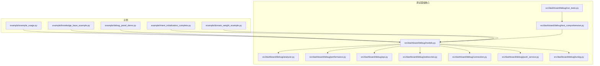
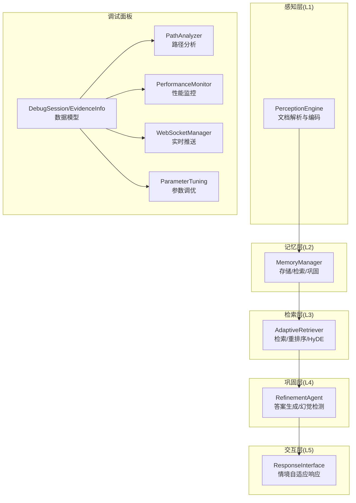
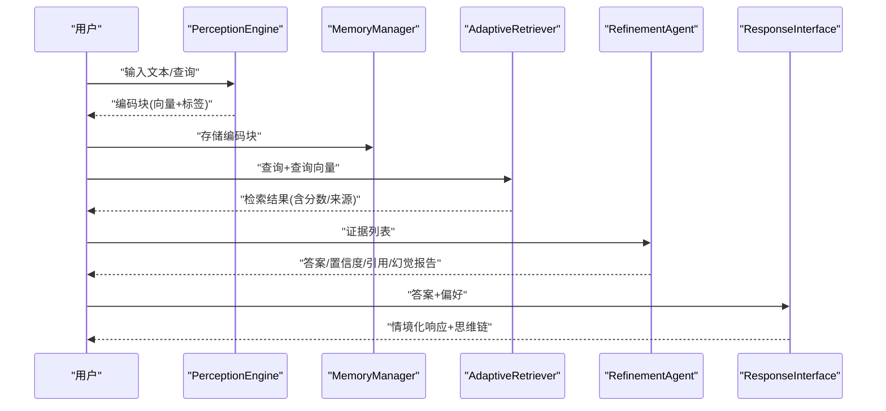
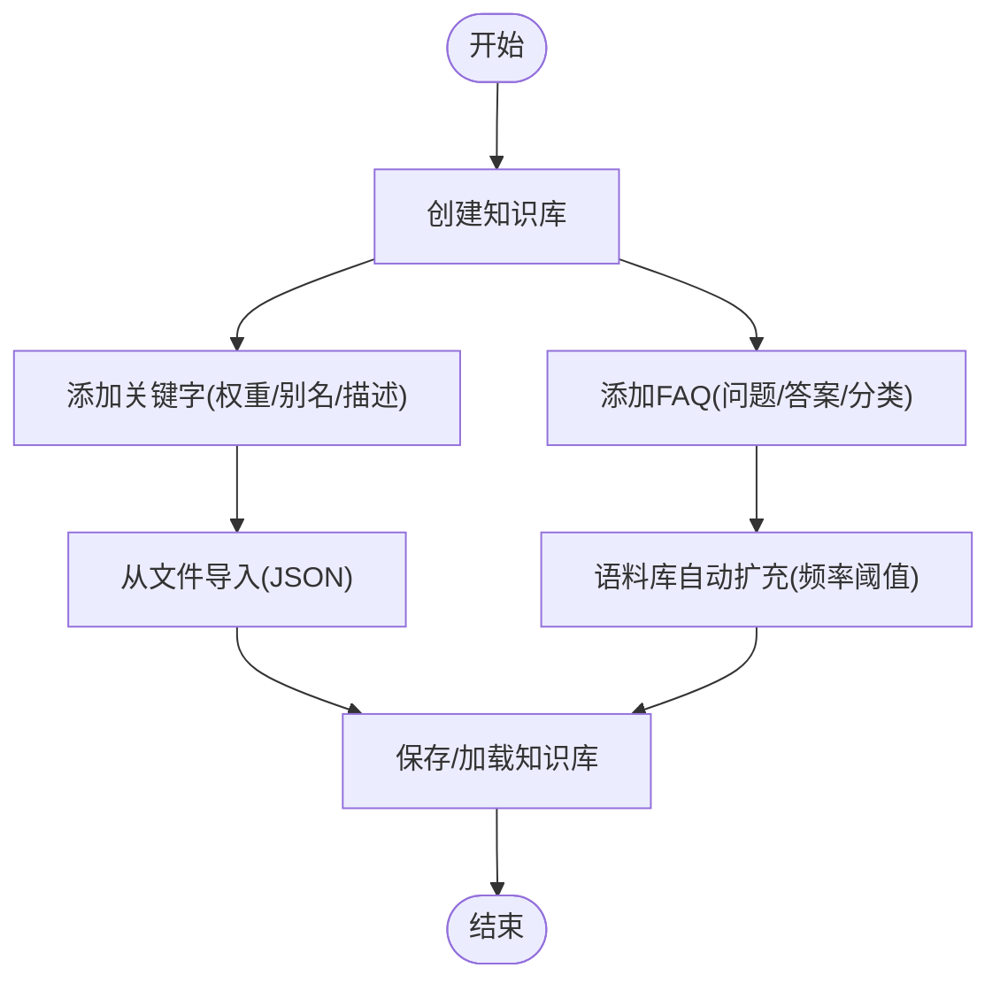
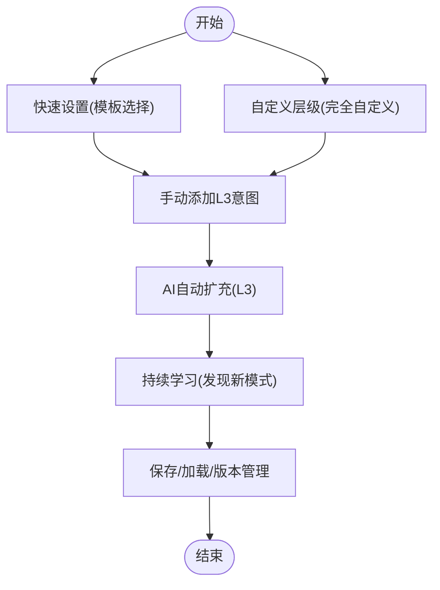
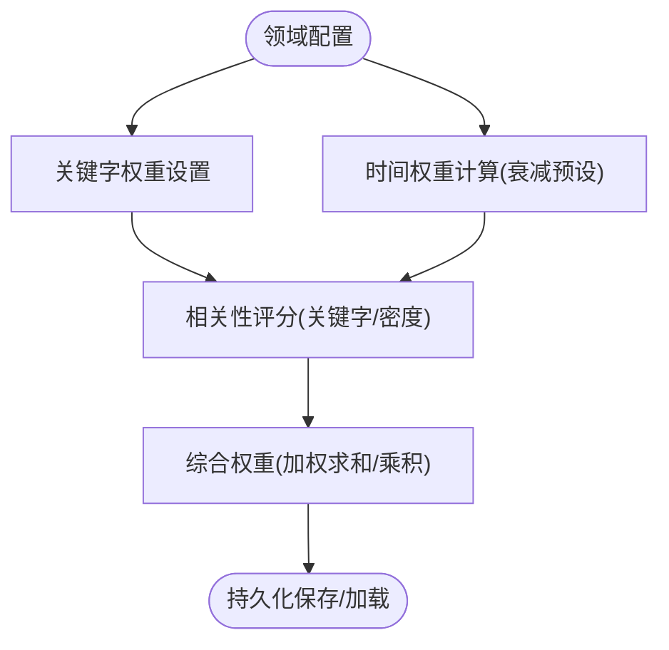
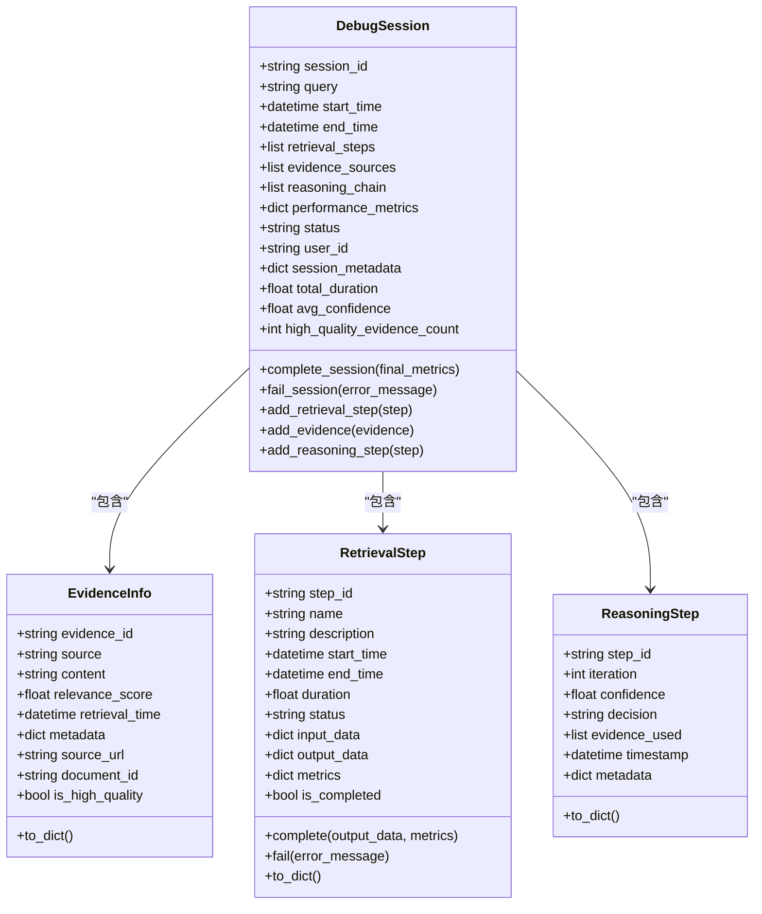
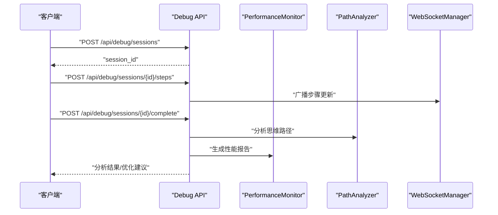
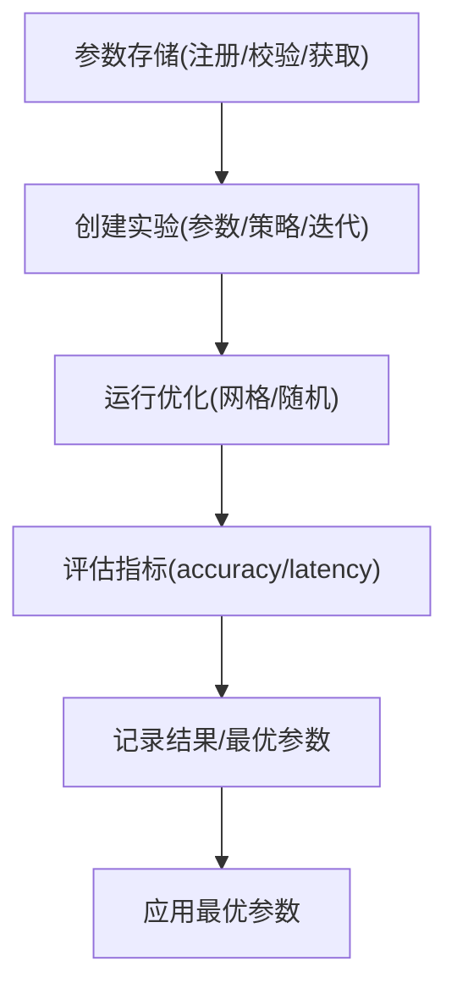
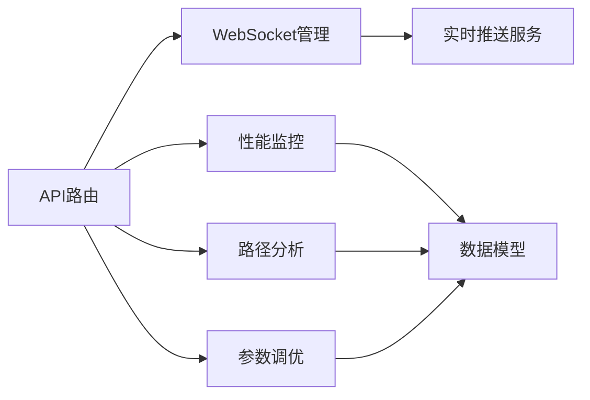

# 示例与最佳实践

<cite>
**本文引用的文件**   
- [example/example_usage.py](file://example/example_usage.py)
- [example/knowledge_base_example.py](file://example/knowledge_base_example.py)
- [example/debug_panel_demo.py](file://example/debug_panel_demo.py)
- [example/intent_initialization_complete.py](file://example/intent_initialization_complete.py)
- [example/domain_weight_example.py](file://example/domain_weight_example.py)
- [src/dashboard/debug/models.py](file://src/dashboard/debug/models.py)
- [src/dashboard/debug/analyzer.py](file://src/dashboard/debug/analyzer.py)
- [src/dashboard/debug/performance.py](file://src/dashboard/debug/performance.py)
- [src/dashboard/debug/api.py](file://src/dashboard/debug/api.py)
- [src/dashboard/debug/websocket.py](file://src/dashboard/debug/websocket.py)
- [src/dashboard/debug/connection.py](file://src/dashboard/debug/connection.py)
- [src/dashboard/debug/push_service.py](file://src/dashboard/debug/push_service.py)
- [src/dashboard/debug/tuning.py](file://src/dashboard/debug/tuning.py)
- [src/dashboard/debug/test_comprehensive.py](file://src/dashboard/debug/test_comprehensive.py)
- [src/dashboard/debug/run_tests.py](file://src/dashboard/debug/run_tests.py)
</cite>

## 目录
1. [引言](#引言)
2. [项目结构](#项目结构)
3. [核心组件](#核心组件)
4. [架构总览](#架构总览)
5. [详细组件分析](#详细组件分析)
6. [依赖分析](#依赖分析)
7. [性能考虑](#性能考虑)
8. [故障排查指南](#故障排查指南)
9. [结论](#结论)
10. [附录](#附录)

## 引言
本文件面向NecoRAG示例与最佳实践，围绕以下目标展开：  
- 基础使用示例：文档导入、查询处理与响应生成的完整流程  
- 高级应用场景：智能路由查询、知识库管理、参数调优与性能优化  
- 调试面板：思维路径可视化、实时监控与告警  
- 生产实践：配置优化、性能调优与故障排除  
- 常见问题与解决方案、性能基准与优化建议  
- 不同使用场景的配置差异与注意事项  
- v3.3.0-alpha版本新增能力的示例与说明  

## 项目结构
NecoRAG示例与调试相关代码主要分布在以下位置：
- example：示例脚本，覆盖基础使用、知识库、意图体系、领域权重与调试面板演示
- src/dashboard/debug：调试面板核心模块，包含数据模型、分析器、性能监控、WebSocket管理、参数调优等

**图表来源**
- [example/example_usage.py:1-252](file://example/example_usage.py#L1-L252)
- [example/knowledge_base_example.py:1-305](file://example/knowledge_base_example.py#L1-L305)
- [example/debug_panel_demo.py:1-268](file://example/debug_panel_demo.py#L1-L268)
- [example/intent_initialization_complete.py:1-407](file://example/intent_initialization_complete.py#L1-L407)
- [example/domain_weight_example.py:1-267](file://example/domain_weight_example.py#L1-L267)
- [src/dashboard/debug/models.py:1-336](file://src/dashboard/debug/models.py#L1-L336)
- [src/dashboard/debug/analyzer.py:1-410](file://src/dashboard/debug/analyzer.py#L1-L410)
- [src/dashboard/debug/performance.py:1-658](file://src/dashboard/debug/performance.py#L1-L658)
- [src/dashboard/debug/api.py:1-557](file://src/dashboard/debug/api.py#L1-L557)
- [src/dashboard/debug/websocket.py:1-554](file://src/dashboard/debug/websocket.py#L1-L554)
- [src/dashboard/debug/connection.py:1-595](file://src/dashboard/debug/connection.py#L1-L595)
- [src/dashboard/debug/push_service.py:1-258](file://src/dashboard/debug/push_service.py#L1-L258)
- [src/dashboard/debug/tuning.py:1-600](file://src/dashboard/debug/tuning.py#L1-L600)
- [src/dashboard/debug/test_comprehensive.py:1-486](file://src/dashboard/debug/test_comprehensive.py#L1-L486)
- [src/dashboard/debug/run_tests.py:1-88](file://src/dashboard/debug/run_tests.py#L1-L88)

**章节来源**
- [example/example_usage.py:1-252](file://example/example_usage.py#L1-L252)
- [example/knowledge_base_example.py:1-305](file://example/knowledge_base_example.py#L1-L305)
- [example/debug_panel_demo.py:1-268](file://example/debug_panel_demo.py#L1-L268)
- [example/intent_initialization_complete.py:1-407](file://example/intent_initialization_complete.py#L1-L407)
- [example/domain_weight_example.py:1-267](file://example/domain_weight_example.py#L1-L267)

## 核心组件
- 感知层（Perception Engine）：负责文档解析与向量编码，输出带情境标签的编码块
- 记忆层（Memory Manager）：负责知识存储、检索与巩固
- 检索层（Adaptive Retriever）：结合重排序与HyDE增强，提供高质量检索结果，并支持检索路径追踪
- 巩固层（Refinement Agent）：生成答案、验证幻觉、控制迭代次数与引用数量
- 交互层（Response Interface）：根据用户偏好与情境生成适配的响应，支持思维链可视化
- 调试面板（Debug Panel）：提供思维路径分析、性能监控、实时推送、参数调优与A/B测试能力

**章节来源**
- [example/example_usage.py:12-252](file://example/example_usage.py#L12-L252)

## 架构总览
NecoRAG采用五层认知架构：感知层（L1）、记忆层（L2）、检索层（L3）、巩固层（L4）、交互层（L5）。调试面板贯穿各层，提供实时监控与可视化。

**图表来源**
- [example/example_usage.py:12-252](file://example/example_usage.py#L12-L252)
- [src/dashboard/debug/models.py:186-277](file://src/dashboard/debug/models.py#L186-L277)
- [src/dashboard/debug/analyzer.py:17-227](file://src/dashboard/debug/analyzer.py#L17-L227)
- [src/dashboard/debug/performance.py:103-373](file://src/dashboard/debug/performance.py#L103-L373)
- [src/dashboard/debug/websocket.py:49-351](file://src/dashboard/debug/websocket.py#L49-L351)
- [src/dashboard/debug/tuning.py:242-485](file://src/dashboard/debug/tuning.py#L242-L485)

## 详细组件分析

### 基础使用示例：完整工作流
- 感知层：PerceptionEngine处理文本，输出编码块（含向量与情境标签）
- 记忆层：MemoryManager存储编码块，支持向量检索与记忆巩固
- 检索层：AdaptiveRetriever执行检索、重排序与HyDE增强，支持检索路径追踪
- 巩固层：RefinementAgent生成答案、评估置信度、检测幻觉
- 交互层：ResponseInterface生成情境化响应，支持思维链可视化与用户偏好分析

**图表来源**
- [example/example_usage.py:12-252](file://example/example_usage.py#L12-L252)

**章节来源**
- [example/example_usage.py:12-252](file://example/example_usage.py#L12-L252)

### 知识库管理：导入、扩展与持久化
- 关键字与FAQ管理：支持添加关键字、设置权重与别名、FAQ检索
- 语料库自动扩充：基于关键词频率建议新关键字并自动添加
- 文件导入：支持从JSON导入关键字
- 持久化：支持知识库保存与加载

**图表来源**
- [example/knowledge_base_example.py:23-274](file://example/knowledge_base_example.py#L23-L274)

**章节来源**
- [example/knowledge_base_example.py:23-274](file://example/knowledge_base_example.py#L23-L274)

### 意图初始化与扩充：构建三级意图体系
- 快速设置：从模板选择基础意图，快速生成L1-L3层级
- 自定义层级：完全自定义L1-L3意图结构
- 手动添加L3：为选定L2意图添加细节意图
- AI自动扩充：基于学习数据自动填充L3意图
- 持续学习：发现新模式并扩展L2子意图
- 保存与加载：配置备份、学习数据导出、版本管理

**图表来源**
- [example/intent_initialization_complete.py:27-334](file://example/intent_initialization_complete.py#L27-L334)

**章节来源**
- [example/intent_initialization_complete.py:27-334](file://example/intent_initialization_complete.py#L27-L334)

### 领域权重系统：时间衰减与综合评分
- 领域配置：创建与自定义领域，设置关键字权重因子
- 时间权重：基于衰减预设计算文档时间权重
- 相关性评分：结合关键字与密度计算领域相关性
- 综合权重：融合关键字、时间与领域权重
- 配置持久化：临时目录下的配置保存与加载

**图表来源**
- [example/domain_weight_example.py:22-243](file://example/domain_weight_example.py#L22-L243)

**章节来源**
- [example/domain_weight_example.py:22-243](file://example/domain_weight_example.py#L22-L243)

### 调试面板：数据模型与分析
- 数据模型：DebugSession、EvidenceInfo、RetrievalStep、ReasoningStep等
- 路径分析：性能分析、瓶颈识别、推理链分析、优化建议生成
- 性能监控：CPU/内存/Disk/Network等指标采集、阈值告警、性能报告
- WebSocket：连接管理、订阅/广播、事件推送、心跳与清理
- 参数调优：参数注册/校验、实验创建/运行、结果处理与最优参数提取
- API路由：会话创建/完成/失败、证据添加、历史查询、分析与参数调优接口

**图表来源**
- [src/dashboard/debug/models.py:186-277](file://src/dashboard/debug/models.py#L186-L277)
- [src/dashboard/debug/models.py:29-75](file://src/dashboard/debug/models.py#L29-L75)
- [src/dashboard/debug/models.py:77-144](file://src/dashboard/debug/models.py#L77-L144)
- [src/dashboard/debug/models.py:146-183](file://src/dashboard/debug/models.py#L146-L183)

**章节来源**
- [src/dashboard/debug/models.py:13-336](file://src/dashboard/debug/models.py#L13-L336)

### 路径分析与性能监控
- 路径分析：识别最慢步骤、失败步骤、证据质量低等问题，生成优化建议
- 性能监控：周期采样系统指标，阈值告警，生成性能报告
- API端点：提供会话管理、证据添加、历史查询、分析与参数调优等REST接口

**图表来源**
- [src/dashboard/debug/api.py:91-181](file://src/dashboard/debug/api.py#L91-L181)
- [src/dashboard/debug/analyzer.py:24-227](file://src/dashboard/debug/analyzer.py#L24-L227)
- [src/dashboard/debug/performance.py:130-373](file://src/dashboard/debug/performance.py#L130-L373)
- [src/dashboard/debug/websocket.py:200-261](file://src/dashboard/debug/websocket.py#L200-L261)

**章节来源**
- [src/dashboard/debug/analyzer.py:17-410](file://src/dashboard/debug/analyzer.py#L17-L410)
- [src/dashboard/debug/performance.py:103-658](file://src/dashboard/debug/performance.py#L103-L658)
- [src/dashboard/debug/api.py:21-557](file://src/dashboard/debug/api.py#L21-L557)
- [src/dashboard/debug/websocket.py:49-554](file://src/dashboard/debug/websocket.py#L49-L554)

### 参数调优与A/B测试
- 参数存储：支持整数、浮点、布尔、枚举、范围等类型，参数值校验与分类
- 实验管理：创建实验、运行策略（网格/随机）、记录结果、提取最优参数
- A/B测试：框架提供配置与统计显著性计算（T检验）

**图表来源**
- [src/dashboard/debug/tuning.py:134-485](file://src/dashboard/debug/tuning.py#L134-L485)

**章节来源**
- [src/dashboard/debug/tuning.py:19-600](file://src/dashboard/debug/tuning.py#L19-L600)

### 调试面板快速入门与高级功能
- 快速入门：创建调试会话、模拟检索步骤、添加证据、路径分析、性能监控、完成会话
- 高级功能：WebSocket连接管理、错误处理机制、实时推送、参数调优API

**章节来源**
- [example/debug_panel_demo.py:16-268](file://example/debug_panel_demo.py#L16-L268)

## 依赖分析
- 组件耦合：调试面板核心模块高度内聚，围绕数据模型与分析器形成清晰边界
- 外部依赖：性能监控依赖psutil；WebSocket依赖FastAPI；参数调优支持异步策略
- 潜在风险：WebSocket连接清理与告警回调需谨慎处理异常；参数存储的并发访问需加锁

**图表来源**
- [src/dashboard/debug/api.py:21-557](file://src/dashboard/debug/api.py#L21-L557)
- [src/dashboard/debug/websocket.py:49-554](file://src/dashboard/debug/websocket.py#L49-L554)
- [src/dashboard/debug/performance.py:103-658](file://src/dashboard/debug/performance.py#L103-L658)
- [src/dashboard/debug/analyzer.py:17-410](file://src/dashboard/debug/analyzer.py#L17-L410)
- [src/dashboard/debug/tuning.py:134-485](file://src/dashboard/debug/tuning.py#L134-L485)
- [src/dashboard/debug/push_service.py:16-258](file://src/dashboard/debug/push_service.py#L16-L258)

**章节来源**
- [src/dashboard/debug/api.py:21-557](file://src/dashboard/debug/api.py#L21-L557)
- [src/dashboard/debug/websocket.py:49-554](file://src/dashboard/debug/websocket.py#L49-L554)
- [src/dashboard/debug/performance.py:103-658](file://src/dashboard/debug/performance.py#L103-L658)
- [src/dashboard/debug/analyzer.py:17-410](file://src/dashboard/debug/analyzer.py#L17-L410)
- [src/dashboard/debug/tuning.py:134-485](file://src/dashboard/debug/tuning.py#L134-L485)
- [src/dashboard/debug/push_service.py:16-258](file://src/dashboard/debug/push_service.py#L16-L258)

## 性能考虑
- 检索层优化：合理设置top_k、相似度阈值与重排序策略；HyDE增强可提升相关性
- 记忆层优化：向量维度与索引策略影响检索速度；定期巩固减少碎片
- 生成层优化：温度与最大token数影响响应质量与延迟；迭代次数与幻觉检测成本需平衡
- 调试面板优化：WebSocket连接池与清理策略；性能监控采样间隔与阈值配置
- 参数调优：网格/随机搜索策略的选择与迭代次数；A/B测试统计显著性

[本节提供通用指导，无需特定文件引用]

## 故障排查指南
- 连接与健康：使用连接管理器与健康监控器检查连接状态、响应时间与告警
- 错误处理：通过错误处理器记录堆栈与上下文，注册通知回调并实现恢复策略
- 性能瓶颈：利用路径分析识别慢步骤与失败步骤；结合性能监控报告定位CPU/内存/磁盘瓶颈
- 实时推送：确认WebSocket连接状态、订阅关系与广播通道；检查心跳与清理任务
- 参数异常：验证参数类型与范围，避免非法值导致系统不稳定

**章节来源**
- [src/dashboard/debug/connection.py:315-595](file://src/dashboard/debug/connection.py#L315-L595)
- [src/dashboard/debug/performance.py:374-658](file://src/dashboard/debug/performance.py#L374-L658)
- [src/dashboard/debug/websocket.py:49-554](file://src/dashboard/debug/websocket.py#L49-L554)
- [src/dashboard/debug/analyzer.py:72-227](file://src/dashboard/debug/analyzer.py#L72-L227)

## 结论
NecoRAG示例与调试面板为RAG系统的落地提供了从基础使用到高级优化的完整路径。通过感知-记忆-检索-巩固-交互的五层架构与调试面板的实时监控、路径分析与参数调优能力，可在生产环境中实现稳定、可观测与可优化的问答系统。

[本节为总结性内容，无需特定文件引用]

## 附录

### v3.3.0-alpha版本新能力示例
- 调试面板：新增思维路径可视化、实时性能监控、参数调优与A/B测试接口
- 知识库：支持从文件导入关键字、语料库自动扩充与持久化
- 意图体系：模板快速设置、自定义层级、AI自动扩充与版本管理
- 领域权重：时间衰减、相关性评分与综合权重计算

**章节来源**
- [example/debug_panel_demo.py:16-268](file://example/debug_panel_demo.py#L16-L268)
- [example/knowledge_base_example.py:134-235](file://example/knowledge_base_example.py#L134-L235)
- [example/intent_initialization_complete.py:188-334](file://example/intent_initialization_complete.py#L188-L334)
- [example/domain_weight_example.py:76-202](file://example/domain_weight_example.py#L76-L202)

### 测试与基准
- 单元测试：覆盖调试会话、WebSocket集成、性能监控、错误处理、参数调优、路径分析、A/B测试、推荐引擎、集成场景与性能基准
- 测试运行器：一键运行调试面板测试套件，输出汇总结果

**章节来源**
- [src/dashboard/debug/test_comprehensive.py:1-486](file://src/dashboard/debug/test_comprehensive.py#L1-L486)
- [src/dashboard/debug/run_tests.py:12-88](file://src/dashboard/debug/run_tests.py#L12-L88)