# 调试面板使用指南

<cite>
**本文档引用的文件**
- [DebugPanel.html](file://src/dashboard/components/DebugPanel.html)
- [__init__.py](file://src/dashboard/debug/__init__.py)
- [api.py](file://src/dashboard/debug/api.py)
- [websocket.py](file://src/dashboard/debug/websocket.py)
- [models.py](file://src/dashboard/debug/models.py)
- [performance.py](file://src/dashboard/debug/performance.py)
- [connection.py](file://src/dashboard/debug/connection.py)
- [push_service.py](file://src/dashboard/debug/push_service.py)
- [history.py](file://src/dashboard/debug/history.py)
- [tuning.py](file://src/dashboard/debug/tuning.py)
- [path_analyzer.py](file://src/dashboard/debug/path_analyzer.py)
- [recommendation.py](file://src/dashboard/debug/recommendation.py)
- [enhanced_error_handler.py](file://src/dashboard/debug/enhanced_error_handler.py)
- [ab_testing.py](file://src/dashboard/debug/ab_testing.py)
</cite>

## 目录
1. [简介](#简介)
2. [项目结构](#项目结构)
3. [核心组件](#核心组件)
4. [架构概览](#架构概览)
5. [详细组件分析](#详细组件分析)
6. [依赖关系分析](#依赖关系分析)
7. [性能考虑](#性能考虑)
8. [故障排除指南](#故障排除指南)
9. [结论](#结论)
10. [附录](#附录)

## 简介

NecoRAG调试面板是一个功能强大的可视化调试工具，专为大型语言模型和检索增强生成(RAG)系统设计。该系统提供了完整的思维路径可视化、实时监控和性能分析功能，帮助开发者和运维人员深入了解系统的运行状态和性能表现。

调试面板的核心功能包括：
- **思维路径可视化**：实时展示查询处理的完整流程
- **实时监控**：WebSocket驱动的实时数据推送
- **性能分析**：全面的性能指标监控和分析
- **调试会话管理**：完整的调试生命周期管理
- **参数调优**：智能的参数优化建议
- **A/B测试**：多配置对比测试框架

## 项目结构

调试面板系统采用模块化架构设计，主要分为以下几个核心模块：

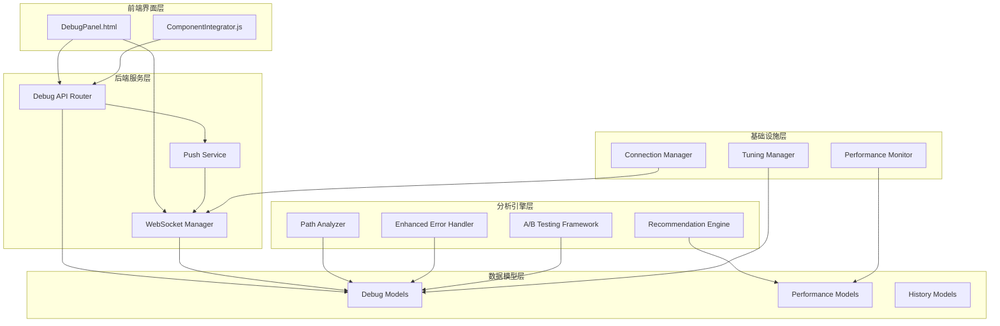

**图表来源**
- [DebugPanel.html:1-899](file://src/dashboard/components/DebugPanel.html#L1-L899)
- [api.py:1-557](file://src/dashboard/debug/api.py#L1-L557)
- [websocket.py:1-554](file://src/dashboard/debug/websocket.py#L1-L554)

**章节来源**
- [DebugPanel.html:1-899](file://src/dashboard/components/DebugPanel.html#L1-L899)
- [__init__.py:1-50](file://src/dashboard/debug/__init__.py#L1-L50)

## 核心组件

### 调试面板前端组件

调试面板采用现代化的Web技术栈构建，提供了直观易用的用户界面：

#### 界面布局结构
- **头部工具栏**：显示连接状态和控制按钮
- **侧边栏**：调试会话列表管理
- **主视图区域**：多标签页内容展示
- **响应式设计**：支持移动端和桌面端

#### 功能按钮说明
- **新建会话**：创建新的调试会话
- **自动刷新**：启用/停止自动数据刷新
- **会话切换**：在不同调试会话间切换
- **手动刷新**：手动更新当前视图数据

### 后端API服务

调试面板提供完整的REST API接口，支持所有调试功能：

#### 核心API端点
- `/api/debug/sessions`：会话管理
- `/api/debug/sessions/{id}`：会话详情
- `/api/debug/sessions/{id}/complete`：完成会话
- `/api/debug/sessions/{id}/steps`：检索步骤管理
- `/api/debug/sessions/{id}/evidence`：证据管理
- `/api/debug/queries/history`：查询历史
- `/api/debug/analyze`：路径分析
- `/api/debug/stats`：系统统计

**章节来源**
- [api.py:91-557](file://src/dashboard/debug/api.py#L91-L557)

## 架构概览

调试面板采用分层架构设计，确保系统的可扩展性和可维护性：

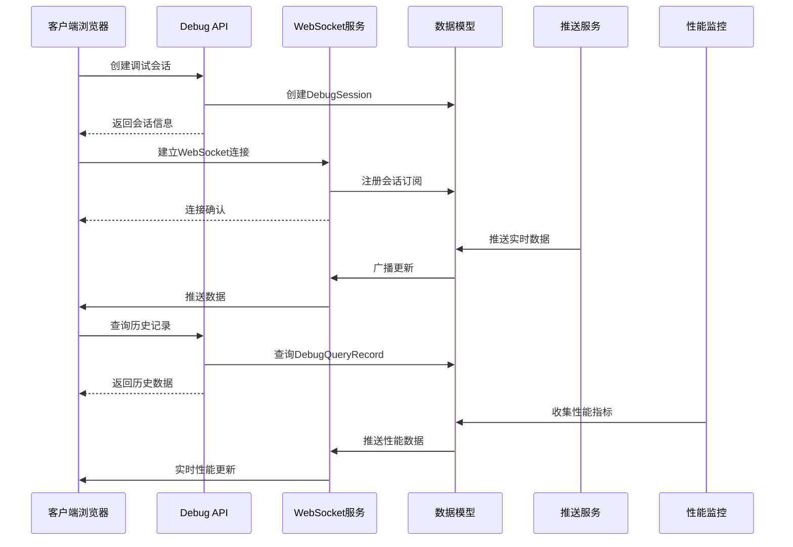

**图表来源**
- [api.py:91-181](file://src/dashboard/debug/api.py#L91-L181)
- [websocket.py:19-130](file://src/dashboard/debug/websocket.py#L19-L130)
- [push_service.py:29-133](file://src/dashboard/debug/push_service.py#L29-L133)

### 数据流架构

系统采用事件驱动的数据流架构，确保数据的一致性和实时性：

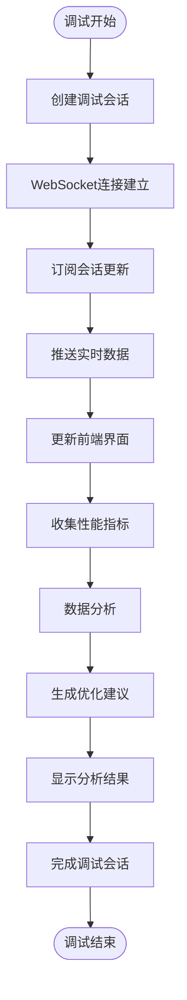

**图表来源**
- [websocket.py:200-261](file://src/dashboard/debug/websocket.py#L200-L261)
- [performance.py:103-155](file://src/dashboard/debug/performance.py#L103-L155)

## 详细组件分析

### 数据模型系统

调试面板使用强类型的数据模型来确保数据的完整性和一致性：

#### 调试会话模型
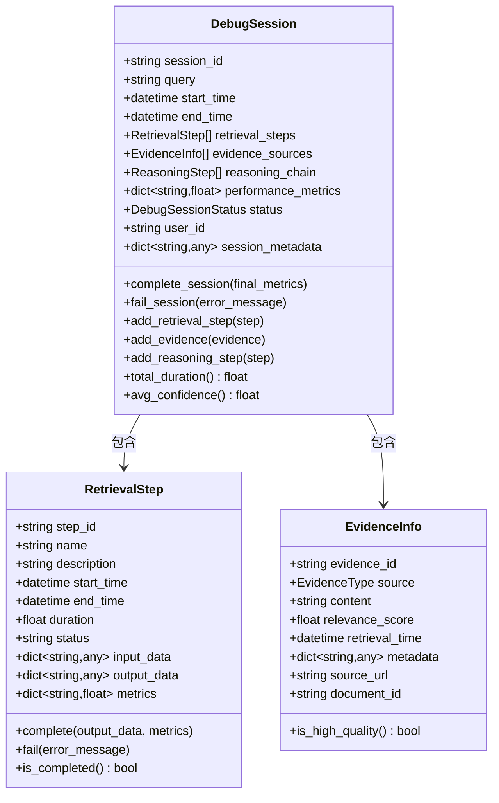

**图表来源**
- [models.py:186-276](file://src/dashboard/debug/models.py#L186-L276)
- [models.py:78-144](file://src/dashboard/debug/models.py#L78-L144)
- [models.py:30-75](file://src/dashboard/debug/models.py#L30-L75)

#### 性能监控模型
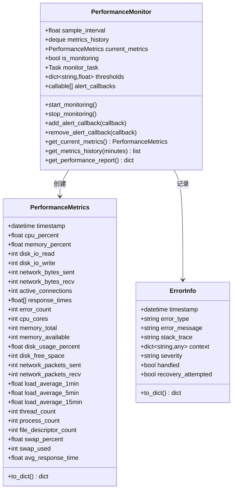

**图表来源**
- [performance.py:19-78](file://src/dashboard/debug/performance.py#L19-L78)
- [performance.py:103-155](file://src/dashboard/debug/performance.py#L103-L155)

**章节来源**
- [models.py:1-336](file://src/dashboard/debug/models.py#L1-L336)
- [performance.py:1-658](file://src/dashboard/debug/performance.py#L1-L658)

### WebSocket通信系统

调试面板采用WebSocket实现实时双向通信：

#### 连接管理架构
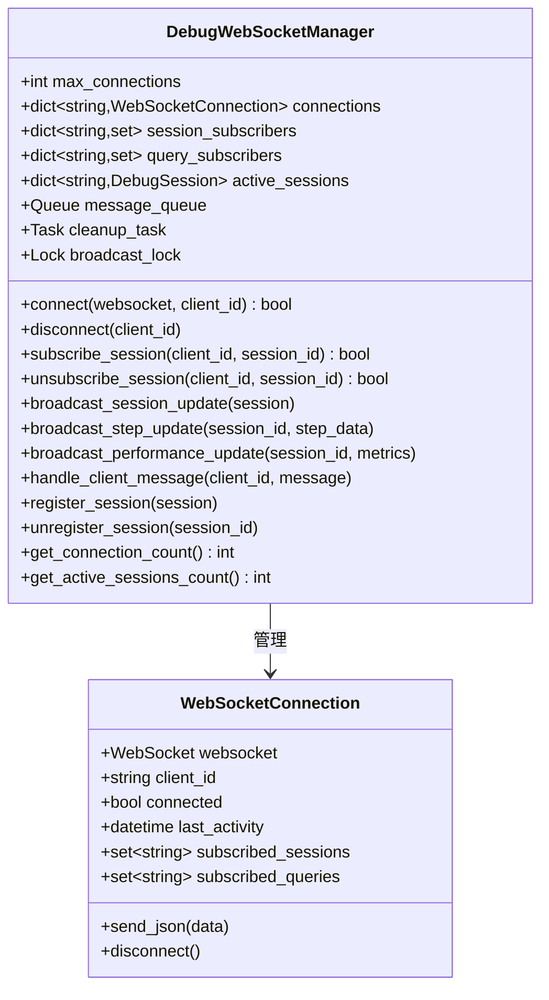

**图表来源**
- [websocket.py:49-130](file://src/dashboard/debug/websocket.py#L49-L130)
- [websocket.py:19-47](file://src/dashboard/debug/websocket.py#L19-L47)

#### 实时数据推送流程
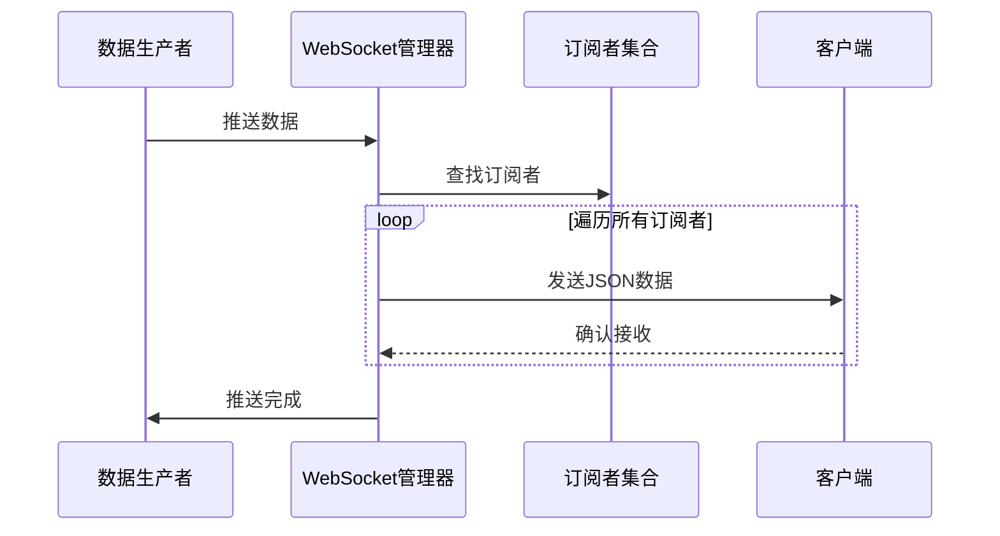

**图表来源**
- [websocket.py:351-373](file://src/dashboard/debug/websocket.py#L351-L373)
- [push_service.py:72-133](file://src/dashboard/debug/push_service.py#L72-L133)

**章节来源**
- [websocket.py:1-554](file://src/dashboard/debug/websocket.py#L1-L554)
- [push_service.py:1-258](file://src/dashboard/debug/push_service.py#L1-L258)

### 分析引擎系统

调试面板集成了多个智能分析引擎：

#### 路径分析器
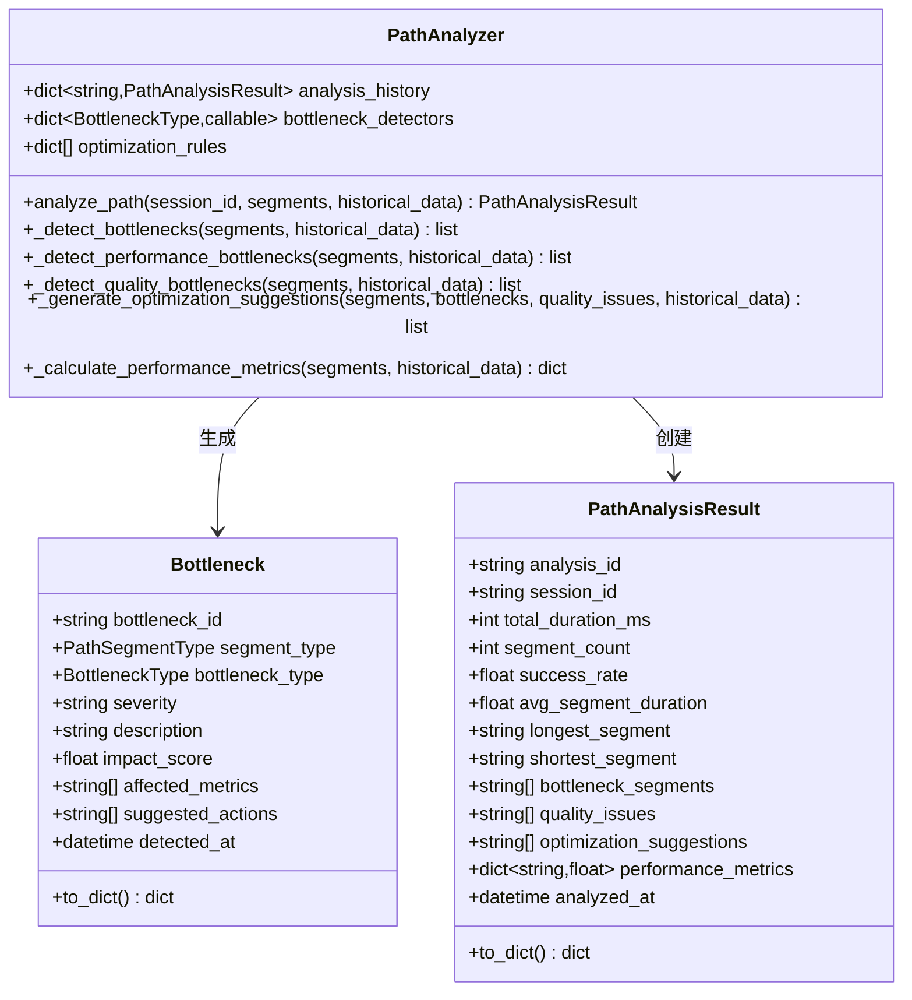

**图表来源**
- [path_analyzer.py:126-237](file://src/dashboard/debug/path_analyzer.py#L126-L237)
- [path_analyzer.py:97-124](file://src/dashboard/debug/path_analyzer.py#L97-L124)

#### 推荐引擎
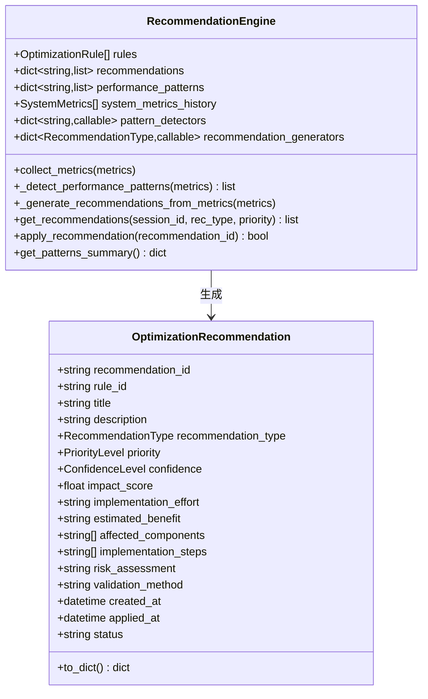

**图表来源**
- [recommendation.py:157-200](file://src/dashboard/debug/recommendation.py#L157-L200)
- [recommendation.py:117-155](file://src/dashboard/debug/recommendation.py#L117-L155)

**章节来源**
- [path_analyzer.py:1-628](file://src/dashboard/debug/path_analyzer.py#L1-L628)
- [recommendation.py:1-853](file://src/dashboard/debug/recommendation.py#L1-L853)

### 错误处理系统

调试面板实现了智能的错误处理和恢复机制：

#### 增强型错误处理器
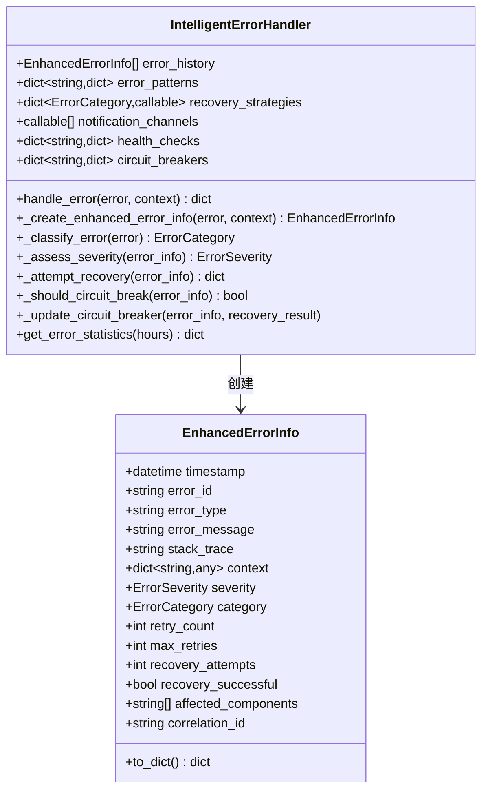

**图表来源**
- [enhanced_error_handler.py:72-170](file://src/dashboard/debug/enhanced_error_handler.py#L72-L170)
- [enhanced_error_handler.py:36-71](file://src/dashboard/debug/enhanced_error_handler.py#L36-L71)

**章节来源**
- [enhanced_error_handler.py:1-558](file://src/dashboard/debug/enhanced_error_handler.py#L1-L558)

## 依赖关系分析

调试面板系统具有清晰的模块化依赖关系：

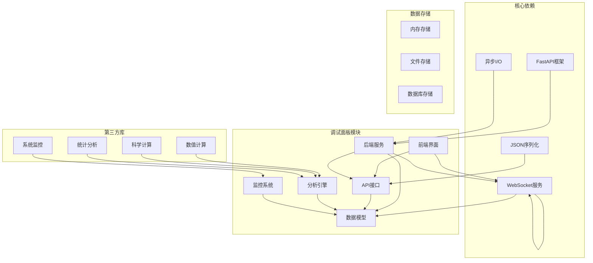

**图表来源**
- [performance.py:1-16](file://src/dashboard/debug/performance.py#L1-L16)
- [ab_testing.py:1-18](file://src/dashboard/debug/ab_testing.py#L1-L18)

### 模块间耦合分析

调试面板采用了松耦合的设计原则：

#### 低耦合设计
- **接口隔离**：每个模块通过明确定义的接口进行交互
- **依赖注入**：使用依赖注入减少直接依赖
- **事件驱动**：通过事件机制实现模块间的解耦
- **数据契约**：严格的数据格式约定确保兼容性

#### 循环依赖避免
- **单向依赖**：所有依赖关系都是单向的
- **抽象层**：通过抽象层避免具体实现的直接依赖
- **工厂模式**：使用工厂模式创建对象实例

**章节来源**
- [__init__.py:1-50](file://src/dashboard/debug/__init__.py#L1-L50)
- [connection.py:1-595](file://src/dashboard/debug/connection.py#L1-L595)

## 性能考虑

调试面板在设计时充分考虑了性能优化：

### 性能监控指标

系统提供了全面的性能监控能力：

#### 系统资源监控
- **CPU使用率**：实时监控CPU使用情况
- **内存使用**：跟踪内存分配和使用
- **磁盘I/O**：监控磁盘读写性能
- **网络流量**：统计网络带宽使用
- **连接数**：监控WebSocket连接状态

#### 应用性能指标
- **响应时间**：测量API请求响应时间
- **吞吐量**：统计每秒处理请求数
- **错误率**：监控系统错误发生频率
- **缓存命中率**：评估缓存系统效率

### 性能优化策略

#### 缓存策略
- **多级缓存**：内存缓存 + 文件缓存 + 数据库缓存
- **智能过期**：基于使用频率的动态过期策略
- **预加载机制**：预测性数据预加载

#### 异步处理
- **非阻塞I/O**：使用异步I/O提高并发性能
- **任务队列**：后台任务异步处理
- **流式传输**：WebSocket实时数据推送

#### 内存管理
- **对象池**：复用频繁创建的对象
- **垃圾回收**：定期清理无用数据
- **内存监控**：实时监控内存使用情况

## 故障排除指南

### 常见问题诊断

#### 连接问题
**症状**：调试面板无法连接到后端服务
**诊断步骤**：
1. 检查WebSocket连接状态
2. 验证API端点可用性
3. 确认网络连接稳定
4. 检查防火墙设置

**解决方案**：
- 重启WebSocket服务
- 检查反向代理配置
- 验证SSL证书有效性

#### 性能问题
**症状**：调试面板响应缓慢或数据更新延迟
**诊断步骤**：
1. 检查系统资源使用情况
2. 分析数据库查询性能
3. 监控网络延迟
4. 评估缓存命中率

**解决方案**：
- 优化数据库索引
- 增加缓存层
- 调整并发设置

#### 数据不一致
**症状**：前端显示的数据与实际不符
**诊断步骤**：
1. 检查数据同步机制
2. 验证数据完整性
3. 分析数据版本控制
4. 检查事务一致性

**解决方案**：
- 实施数据校验机制
- 增加重试逻辑
- 优化数据同步策略

### 调试技巧

#### 日志分析
- **详细日志**：启用详细日志模式
- **时间戳**：使用精确的时间戳
- **上下文信息**：包含完整的执行上下文
- **错误堆栈**：记录完整的错误堆栈

#### 性能分析
- **性能剖析**：使用性能剖析工具
- **内存泄漏检测**：定期检测内存泄漏
- **并发问题排查**：分析并发访问问题
- **资源竞争分析**：检查资源竞争情况

**章节来源**
- [connection.py:90-176](file://src/dashboard/debug/connection.py#L90-L176)
- [performance.py:248-320](file://src/dashboard/debug/performance.py#L248-L320)

## 结论

NecoRAG调试面板是一个功能完整、架构清晰的可视化调试工具。通过模块化设计和智能分析引擎，它为RAG系统的开发和运维提供了强有力的支持。

### 主要优势
- **功能全面**：涵盖调试、监控、分析的完整功能链
- **实时性强**：基于WebSocket的实时数据推送
- **可视化友好**：直观的界面设计和丰富的图表展示
- **扩展性强**：模块化架构便于功能扩展和定制

### 适用场景
- **开发调试**：日常开发过程中的问题定位和调试
- **性能优化**：系统性能瓶颈的识别和优化
- **运维监控**：生产环境的实时监控和告警
- **A/B测试**：多配置对比和效果评估

### 未来发展
- **AI辅助分析**：集成更多AI分析能力
- **自动化运维**：实现更多自动化运维功能
- **多租户支持**：支持多用户和多租户场景
- **云原生集成**：更好的云原生平台集成

## 附录

### API参考

#### 调试会话管理
- `POST /api/debug/sessions`：创建调试会话
- `GET /api/debug/sessions/{session_id}`：获取会话详情
- `POST /api/debug/sessions/{session_id}/complete`：完成会话
- `POST /api/debug/sessions/{session_id}/fail`：标记会话失败

#### 实时数据接口
- `POST /api/debug/sessions/{session_id}/steps`：添加检索步骤
- `POST /api/debug/sessions/{session_id}/evidence`：添加证据
- `GET /api/debug/queries/history`：获取查询历史

#### 分析功能
- `POST /api/debug/analyze`：路径分析
- `POST /api/debug/tune-parameters`：参数调优
- `GET /api/debug/stats`：系统统计

### 配置选项

#### 系统配置
- **端口设置**：默认端口8000，可通过环境变量配置
- **连接限制**：最大WebSocket连接数配置
- **缓存设置**：缓存大小和过期时间
- **日志级别**：调试、信息、警告、错误级别

#### 性能配置
- **采样间隔**：性能数据采样间隔设置
- **历史数据**：历史数据保留时间
- **告警阈值**：性能告警阈值配置
- **并发限制**：最大并发请求数

### 安全考虑

#### 访问控制
- **身份认证**：支持多种身份认证方式
- **权限管理**：细粒度的权限控制
- **会话管理**：安全的会话管理和过期机制
- **数据加密**：敏感数据的加密存储和传输

#### 安全最佳实践
- **输入验证**：严格的输入数据验证
- **SQL注入防护**：防止SQL注入攻击
- **XSS防护**：防止跨站脚本攻击
- **CSRF防护**：防止跨站请求伪造

### 生产环境部署

#### 部署要求
- **硬件要求**：根据预期并发用户数配置硬件资源
- **网络配置**：确保网络带宽和延迟满足要求
- **存储配置**：合理的存储空间和备份策略
- **监控配置**：完善的监控和告警系统

#### 运维建议
- **定期备份**：定期备份重要数据
- **性能监控**：持续监控系统性能
- **安全审计**：定期进行安全审计
- **版本升级**：及时进行系统升级