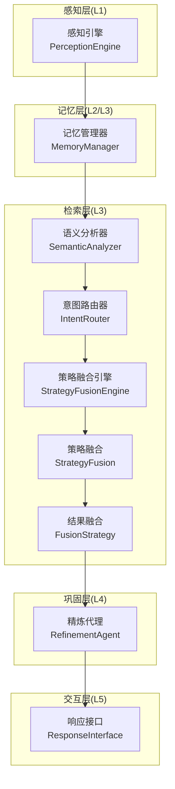
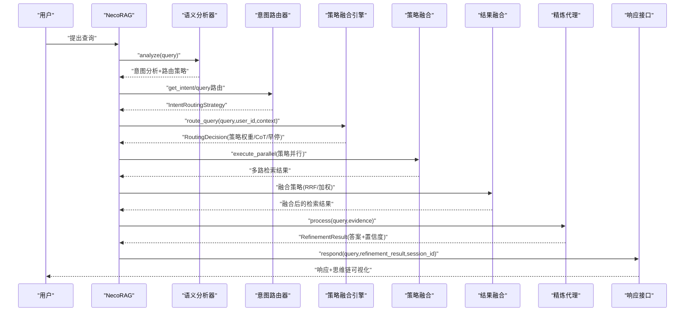
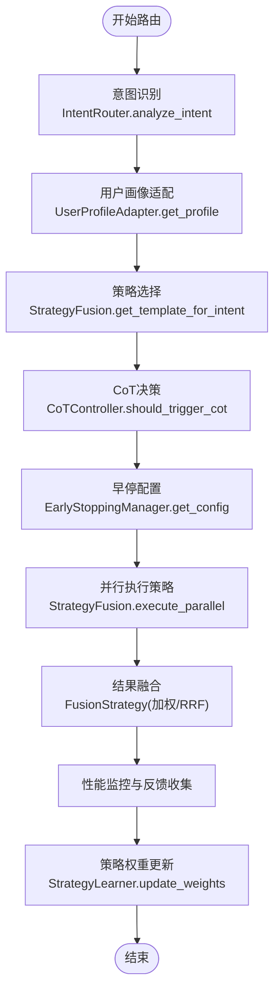
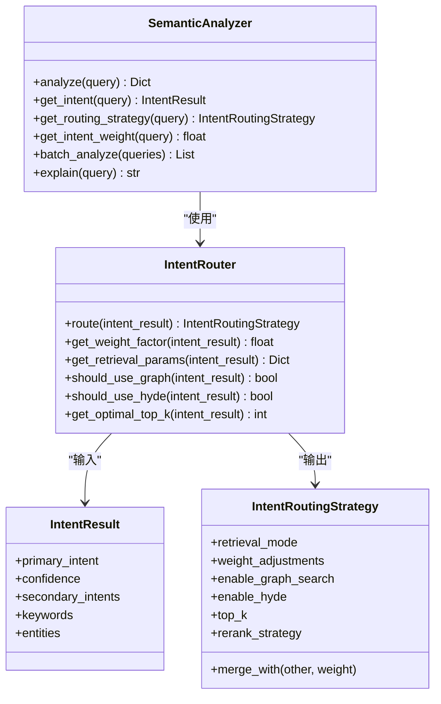
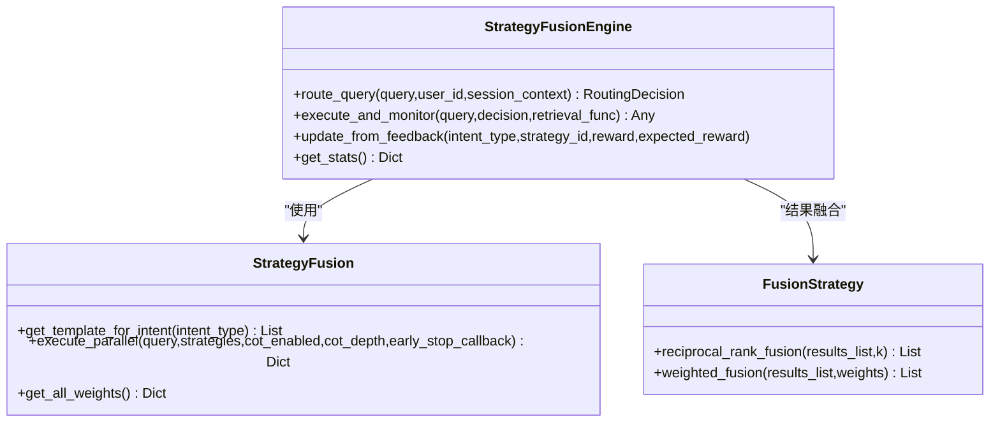
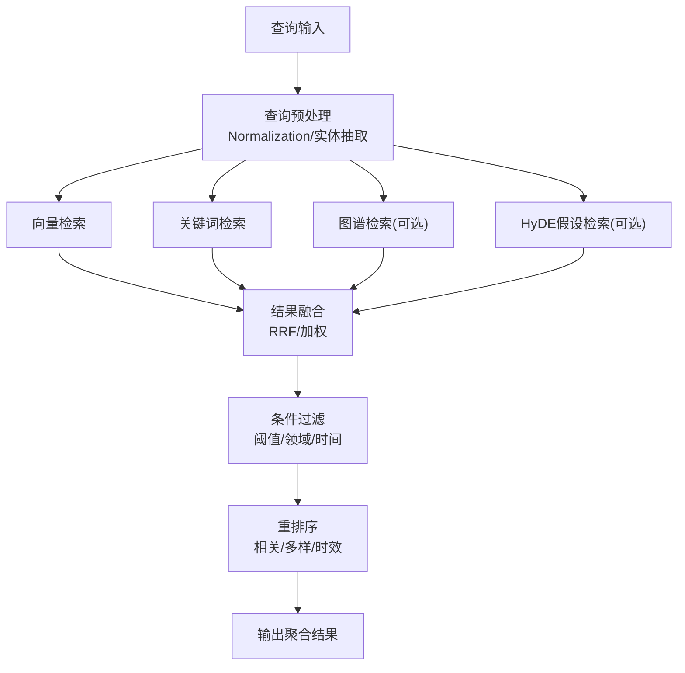
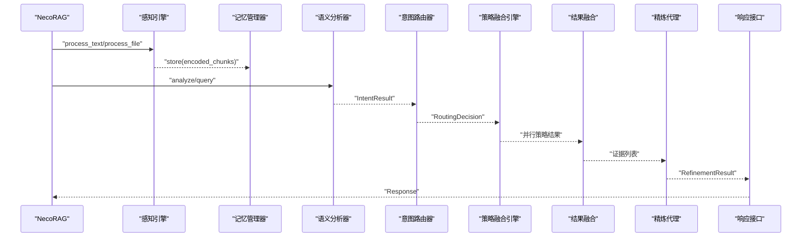
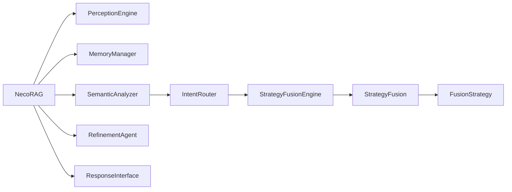

# 复杂查询处理

<cite>
**本文引用的文件**
- [src/necorag.py](file://src/necorag.py)
- [src/intent/semantic_analyzer.py](file://src/intent/semantic_analyzer.py)
- [src/intent/router.py](file://src/intent/router.py)
- [src/intent/models.py](file://src/intent/models.py)
- [src/retrieval/smart_routing/engine.py](file://src/retrieval/smart_routing/engine.py)
- [src/retrieval/smart_routing/strategy_fusion.py](file://src/retrieval/smart_routing/strategy_fusion.py)
- [src/retrieval/smart_routing/intent_router.py](file://src/retrieval/smart_routing/intent_router.py)
- [src/retrieval/fusion.py](file://src/retrieval/fusion.py)
- [src/memory/manager.py](file://src/memory/manager.py)
- [src/perception/engine.py](file://src/perception/engine.py)
- [src/refinement/agent.py](file://src/refinement/agent.py)
- [src/response/interface.py](file://src/response/interface.py)
- [src/retrieval/models.py](file://src/retrieval/models.py)
- [src/core/config.py](file://src/core/config.py)
- [example/example_usage.py](file://example/example_usage.py)
</cite>

## 目录
1. [简介](#简介)
2. [项目结构](#项目结构)
3. [核心组件](#核心组件)
4. [架构总览](#架构总览)
5. [详细组件分析](#详细组件分析)
6. [依赖分析](#依赖分析)
7. [性能考虑](#性能考虑)
8. [故障排查指南](#故障排查指南)
9. [结论](#结论)
10. [附录](#附录)

## 简介
本文件面向“NecoRAG复杂查询处理”的实现与实践，围绕以下目标展开：
- 多轮对话的上下文管理与状态保持机制
- 意图分析系统：查询分类、意图识别与路由决策
- 智能路由引擎：查询预处理、策略选择与多路检索协调
- 复杂业务场景：模糊查询、条件过滤、排序规则与结果聚合
- 性能优化与缓存策略：查询类型优先级与资源分配
- 实际案例：展示复杂查询场景的处理效果

## 项目结构
NecoRAG采用分层架构，核心分为感知层、记忆层、检索层、巩固层与交互层。查询处理从感知层编码输入，经记忆层存储，通过检索层的意图路由与策略融合，再进入巩固层精炼与幻觉检测，最后由交互层生成情境化响应。

图表来源
- [src/perception/engine.py:20-195](file://src/perception/engine.py#L20-L195)
- [src/memory/manager.py:20-212](file://src/memory/manager.py#L20-L212)
- [src/intent/semantic_analyzer.py:24-352](file://src/intent/semantic_analyzer.py#L24-L352)
- [src/intent/router.py:18-350](file://src/intent/router.py#L18-L350)
- [src/retrieval/smart_routing/engine.py:34-274](file://src/retrieval/smart_routing/engine.py#L34-L274)
- [src/retrieval/smart_routing/strategy_fusion.py:43-349](file://src/retrieval/smart_routing/strategy_fusion.py#L43-L349)
- [src/retrieval/fusion.py:9-128](file://src/retrieval/fusion.py#L9-L128)
- [src/refinement/agent.py:20-164](file://src/refinement/agent.py#L20-L164)
- [src/response/interface.py:20-232](file://src/response/interface.py#L20-L232)

章节来源
- [src/necorag.py:51-513](file://src/necorag.py#L51-L513)
- [src/core/config.py:277-420](file://src/core/config.py#L277-L420)

## 核心组件
- 统一入口与控制流：NecoRAG类负责组件初始化、文档导入、查询处理与统计。
- 意图分析与路由：SemanticAnalyzer整合分类与路由；IntentRouter根据意图生成检索策略。
- 智能路由与策略融合：StrategyFusionEngine三层决策；StrategyFusion并行执行与结果融合。
- 记忆与检索：MemoryManager统一管理三层记忆；感知层编码文档；检索层融合策略。
- 巩固与交互：RefinementAgent进行生成-批判-精炼闭环与幻觉检测；ResponseInterface情境化生成与思维链可视化。

章节来源
- [src/necorag.py:51-513](file://src/necorag.py#L51-L513)
- [src/intent/semantic_analyzer.py:24-352](file://src/intent/semantic_analyzer.py#L24-L352)
- [src/intent/router.py:18-350](file://src/intent/router.py#L18-L350)
- [src/retrieval/smart_routing/engine.py:34-274](file://src/retrieval/smart_routing/engine.py#L34-L274)
- [src/retrieval/smart_routing/strategy_fusion.py:43-349](file://src/retrieval/smart_routing/strategy_fusion.py#L43-L349)
- [src/memory/manager.py:20-212](file://src/memory/manager.py#L20-L212)
- [src/perception/engine.py:20-195](file://src/perception/engine.py#L20-L195)
- [src/refinement/agent.py:20-164](file://src/refinement/agent.py#L20-L164)
- [src/response/interface.py:20-232](file://src/response/interface.py#L20-L232)

## 架构总览
NecoRAG查询处理的关键流程如下：

图表来源
- [src/necorag.py:390-513](file://src/necorag.py#L390-L513)
- [src/intent/semantic_analyzer.py:69-122](file://src/intent/semantic_analyzer.py#L69-L122)
- [src/intent/router.py:55-197](file://src/intent/router.py#L55-L197)
- [src/retrieval/smart_routing/engine.py:68-129](file://src/retrieval/smart_routing/engine.py#L68-L129)
- [src/retrieval/smart_routing/strategy_fusion.py:78-158](file://src/retrieval/smart_routing/strategy_fusion.py#L78-L158)
- [src/retrieval/fusion.py:18-127](file://src/retrieval/fusion.py#L18-L127)
- [src/refinement/agent.py:65-141](file://src/refinement/agent.py#L65-L141)
- [src/response/interface.py:59-140](file://src/response/interface.py#L59-L140)

## 详细组件分析

### 多轮对话上下文管理与状态保持
- 会话上下文：智能路由引擎接收session_context，用于复杂度与领域调整，从而影响策略权重与CoT触发。
- 用户画像适配：UserProfileAdapter结合用户专业度与偏好，动态调整策略权重（例如专家用户提升向量检索权重，简洁偏好降低深度策略权重）。
- 早停与降级：EarlyStoppingManager依据置信度与用户画像配置早停策略，避免无效计算；DegradationLevel用于系统降级保护。
- 状态记录：策略学习器StrategyLearner通过隐式反馈更新权重，形成自适应闭环。

图表来源
- [src/retrieval/smart_routing/engine.py:68-264](file://src/retrieval/smart_routing/engine.py#L68-L264)
- [src/retrieval/smart_routing/strategy_fusion.py:78-349](file://src/retrieval/smart_routing/strategy_fusion.py#L78-L349)

章节来源
- [src/retrieval/smart_routing/engine.py:34-274](file://src/retrieval/smart_routing/engine.py#L34-L274)
- [src/retrieval/smart_routing/strategy_fusion.py:43-349](file://src/retrieval/smart_routing/strategy_fusion.py#L43-L349)

### 意图分析系统：查询分类、识别与路由
- 语义分析器：提供统一接口，完成意图分类、路由策略确定与检索参数生成，并支持批量分析与解释。
- 意图路由器：根据IntentResult路由到对应IntentRoutingStrategy，支持多意图融合与权重因子计算。
- 模型定义：IntentType枚举定义七类意图；IntentResult与IntentRoutingStrategy承载分类与策略数据结构。

图表来源
- [src/intent/semantic_analyzer.py:24-352](file://src/intent/semantic_analyzer.py#L24-L352)
- [src/intent/router.py:18-350](file://src/intent/router.py#L18-L350)
- [src/intent/models.py:12-231](file://src/intent/models.py#L12-L231)

章节来源
- [src/intent/semantic_analyzer.py:24-352](file://src/intent/semantic_analyzer.py#L24-L352)
- [src/intent/router.py:18-350](file://src/intent/router.py#L18-L350)
- [src/intent/models.py:12-231](file://src/intent/models.py#L12-L231)

### 智能路由引擎：预处理、策略选择与多路检索协调
- 三层决策：意图识别层、用户画像层、策略融合层；CoT控制器与早停管理器贯穿执行阶段。
- 策略模板：基于意图类型提供默认策略权重；用户画像调节权重；策略并行执行与结果融合。
- 多样性与重排序：融合时考虑新颖性与来源多样性，支持后续重排序（预留接口）。

图表来源
- [src/retrieval/smart_routing/engine.py:34-274](file://src/retrieval/smart_routing/engine.py#L34-L274)
- [src/retrieval/smart_routing/strategy_fusion.py:43-349](file://src/retrieval/smart_routing/strategy_fusion.py#L43-L349)
- [src/retrieval/fusion.py:9-128](file://src/retrieval/fusion.py#L9-L128)

章节来源
- [src/retrieval/smart_routing/engine.py:34-274](file://src/retrieval/smart_routing/engine.py#L34-L274)
- [src/retrieval/smart_routing/strategy_fusion.py:43-349](file://src/retrieval/smart_routing/strategy_fusion.py#L43-L349)
- [src/retrieval/fusion.py:9-128](file://src/retrieval/fusion.py#L9-L128)

### 复杂业务场景的查询处理方案
- 模糊查询：通过向量检索与关键词检索的加权融合，提升召回覆盖；必要时启用HyDE假设答案增强。
- 条件过滤：在检索结果上叠加领域权重与时间权重因子，结合阈值筛选与早停机制。
- 排序规则：支持相关性、多样性与时效性三种重排序策略；融合时引入新颖性加成与来源多样性惩罚。
- 结果聚合：采用RRF与加权融合，对重复项去重并按融合分数排序。

图表来源
- [src/retrieval/fusion.py:18-127](file://src/retrieval/fusion.py#L18-L127)
- [src/retrieval/smart_routing/strategy_fusion.py:217-328](file://src/retrieval/smart_routing/strategy_fusion.py#L217-L328)

章节来源
- [src/retrieval/fusion.py:9-128](file://src/retrieval/fusion.py#L9-L128)
- [src/retrieval/smart_routing/strategy_fusion.py:197-349](file://src/retrieval/smart_routing/strategy_fusion.py#L197-L349)

### 统一入口与查询处理主流程
- 文档导入：感知层编码→记忆层存储；支持文件与文本两种导入方式。
- 查询处理：意图分析→路由决策→策略执行→结果融合→精炼→响应生成；支持HyDE与精炼开关。
- 统计与可观测性：查询计数、内存条目数、知识演化统计等。

图表来源
- [src/necorag.py:237-513](file://src/necorag.py#L237-L513)
- [src/perception/engine.py:96-195](file://src/perception/engine.py#L96-L195)
- [src/memory/manager.py:52-123](file://src/memory/manager.py#L52-L123)
- [src/intent/semantic_analyzer.py:69-122](file://src/intent/semantic_analyzer.py#L69-L122)
- [src/intent/router.py:55-197](file://src/intent/router.py#L55-L197)
- [src/retrieval/smart_routing/engine.py:68-129](file://src/retrieval/smart_routing/engine.py#L68-L129)
- [src/retrieval/fusion.py:18-127](file://src/retrieval/fusion.py#L18-L127)
- [src/refinement/agent.py:65-141](file://src/refinement/agent.py#L65-L141)
- [src/response/interface.py:59-140](file://src/response/interface.py#L59-L140)

章节来源
- [src/necorag.py:237-513](file://src/necorag.py#L237-L513)

## 依赖分析
- 组件耦合：NecoRAG作为编排器，依赖感知、记忆、意图分析、路由、融合、精炼与响应模块；各模块职责清晰、接口稳定。
- 外部依赖：配置系统提供全局参数；智能路由与策略融合模块预留实际检索器集成点（TODO标注）。
- 潜在风险：策略融合模块的检索器实现需与底层向量库、图数据库对接，避免阻塞与超时。

图表来源
- [src/necorag.py:123-148](file://src/necorag.py#L123-L148)
- [src/intent/semantic_analyzer.py:64-65](file://src/intent/semantic_analyzer.py#L64-L65)
- [src/intent/router.py:52-53](file://src/intent/router.py#L52-L53)
- [src/retrieval/smart_routing/engine.py:54-61](file://src/retrieval/smart_routing/engine.py#L54-L61)
- [src/retrieval/smart_routing/strategy_fusion.py:54-56](file://src/retrieval/smart_routing/strategy_fusion.py#L54-L56)
- [src/retrieval/fusion.py:9-16](file://src/retrieval/fusion.py#L9-L16)

章节来源
- [src/necorag.py:123-148](file://src/necorag.py#L123-L148)

## 性能考虑
- 查询类型优先级与资源分配
  - 高置信度事实查询：降低top_k与策略权重，启用早停，优先向量检索。
  - 复杂推理/比较：提升图谱与HyDE权重，适度放宽top_k，启用CoT与重排序。
  - 用户偏好：专家用户倾向深度检索；简洁偏好降低深度策略权重。
- 并行与早停
  - 策略并行执行，早停回调根据置信度与耗时提前终止，避免无效计算。
- 结果融合
  - RRF与加权融合结合，控制同源比例，避免单一策略主导。
- 缓存与持久化
  - 记忆层L2语义向量与L3图谱持久化；建议在感知层与检索层增加查询向量缓存与热点命中统计。
- 配置建议
  - 根据场景调整RetrievalConfig的阈值与权重；开启/关闭HyDE与重排序以平衡速度与质量。

章节来源
- [src/retrieval/smart_routing/engine.py:131-204](file://src/retrieval/smart_routing/engine.py#L131-L204)
- [src/retrieval/smart_routing/strategy_fusion.py:78-158](file://src/retrieval/smart_routing/strategy_fusion.py#L78-L158)
- [src/retrieval/fusion.py:18-127](file://src/retrieval/fusion.py#L18-L127)
- [src/core/config.py:160-193](file://src/core/config.py#L160-L193)

## 故障排查指南
- 意图识别异常
  - 现象：路由策略不符合预期。
  - 排查：检查IntentClassifier后端与规则映射；使用explain接口查看路由解释。
- 策略执行失败
  - 现象：部分策略抛出异常或返回空结果。
  - 排查：确认策略融合模块的检索器实现；检查早停回调与异常捕获逻辑。
- 精炼失败或幻觉
  - 现象：答案置信度低或包含不实信息。
  - 排查：调整RefinementConfig阈值；检查幻觉检测与批判模块输出。
- 响应风格与细节不符
  - 现象：语气或详细程度与用户偏好不一致。
  - 排查：检查UserProfileManager与ToneAdapter/DetailLevelAdapter配置。

章节来源
- [src/intent/semantic_analyzer.py:252-276](file://src/intent/semantic_analyzer.py#L252-L276)
- [src/retrieval/smart_routing/strategy_fusion.py:123-140](file://src/retrieval/smart_routing/strategy_fusion.py#L123-L140)
- [src/refinement/agent.py:86-141](file://src/refinement/agent.py#L86-L141)
- [src/response/interface.py:142-173](file://src/response/interface.py#L142-L173)

## 结论
NecoRAG通过“意图分析+智能路由+策略融合+结果聚合+精炼与响应”的完整链路，实现了复杂查询的高效与准确处理。其三层路由决策、用户画像适配、策略并行与多样性保障，使得系统在多场景下具备良好的鲁棒性与扩展性。建议在实际部署中结合业务特征完善检索器实现、优化缓存策略，并持续通过反馈机制迭代策略权重。

## 附录
- 实际使用示例可参考example_usage.py，涵盖感知、记忆、检索、精炼与响应的完整流程。

章节来源
- [example/example_usage.py:12-252](file://example/example_usage.py#L12-L252)