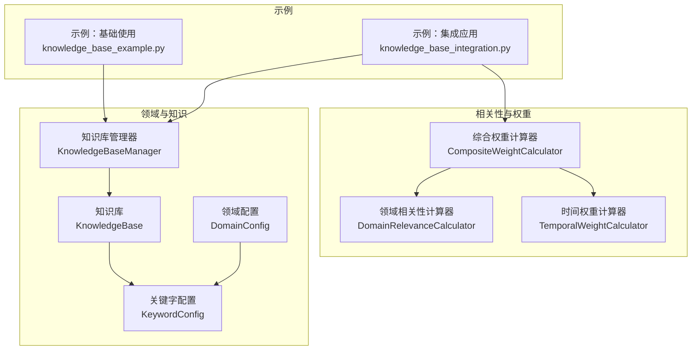
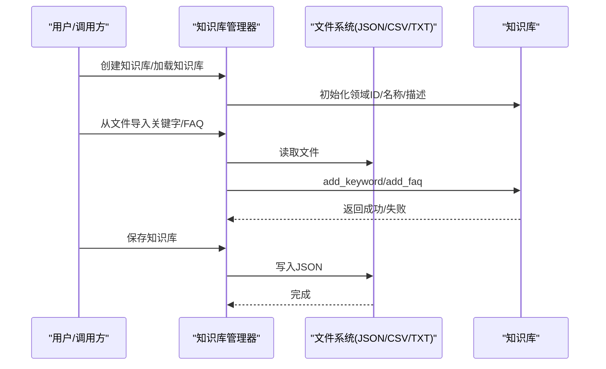
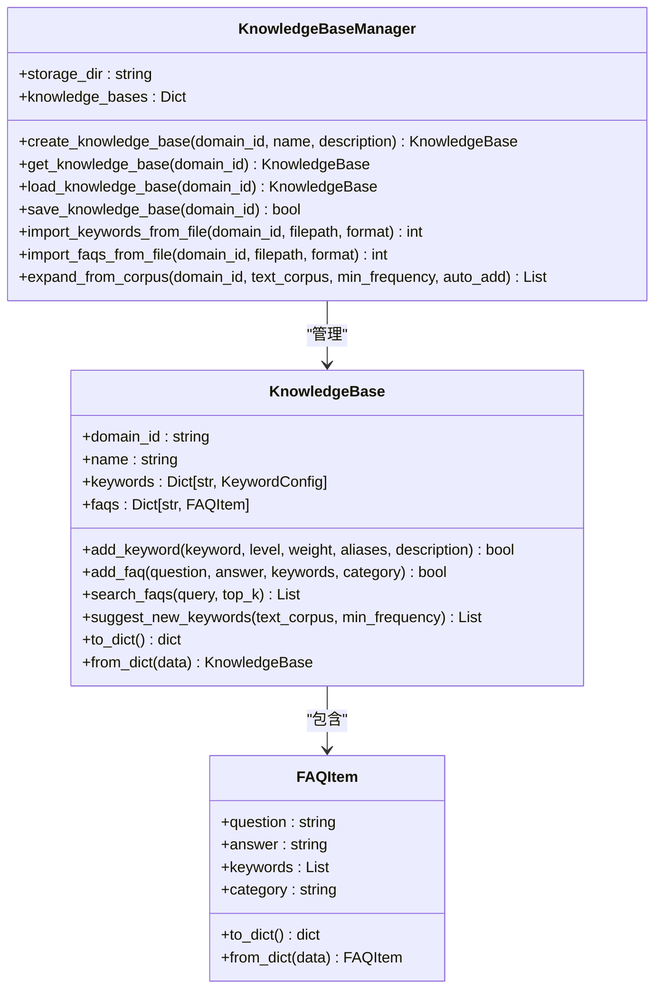
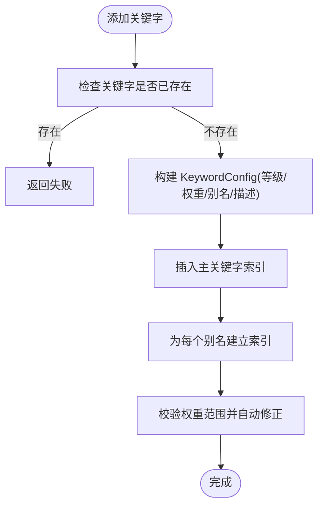
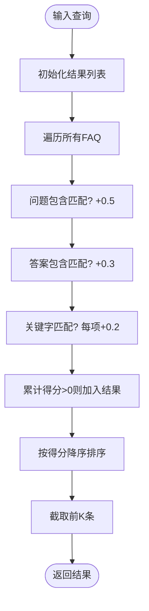
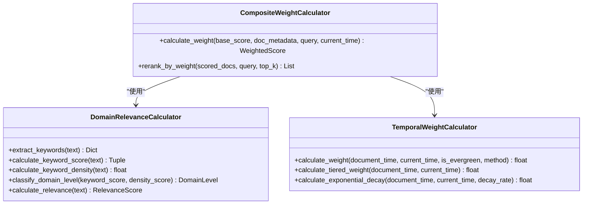
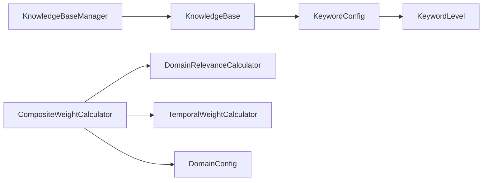

# 知识库管理系统

<cite>
**本文引用的文件**
- [src/domain/knowledge_base.py](file://src/domain/knowledge_base.py)
- [src/domain/config.py](file://src/domain/config.py)
- [src/domain/relevance.py](file://src/domain/relevance.py)
- [src/domain/temporal_weight.py](file://src/domain/temporal_weight.py)
- [src/domain/weight_calculator.py](file://src/domain/weight_calculator.py)
- [example/knowledge_base_example.py](file://example/knowledge_base_example.py)
- [example/knowledge_base_integration.py](file://example/knowledge_base_integration.py)
</cite>

## 目录
1. [简介](#简介)
2. [项目结构](#项目结构)
3. [核心组件](#核心组件)
4. [架构总览](#架构总览)
5. [详细组件分析](#详细组件分析)
6. [依赖分析](#依赖分析)
7. [性能考量](#性能考量)
8. [故障排查指南](#故障排查指南)
9. [结论](#结论)
10. [附录](#附录)

## 简介
本文件为 NecoRAG 知识库管理系统（领域知识库与 FAQ 管理）的实现文档，聚焦于知识库管理器的使用方法与内部机制，包括：
- 创建知识库、添加关键字与 FAQ、文件导入导出
- 关键字级别管理（CORE、IMPORTANT、NORMAL 等）、权重设置与别名管理
- FAQ 管理系统的查询与匹配机制
- 大规模知识库的管理策略（数据持久化、备份恢复、性能优化）
- 实际代码示例路径与最佳实践、常见问题解决方案

## 项目结构
知识库相关的核心代码位于 src/domain 目录，围绕“领域配置”“关键字与FAQ”“相关性与权重”三大模块协同工作，配合示例脚本展示典型使用场景。

图表来源
- [src/domain/knowledge_base.py:64-263](file://src/domain/knowledge_base.py#L64-L263)
- [src/domain/config.py:30-160](file://src/domain/config.py#L30-L160)
- [src/domain/relevance.py:29-241](file://src/domain/relevance.py#L29-L241)
- [src/domain/temporal_weight.py:47-195](file://src/domain/temporal_weight.py#L47-L195)
- [src/domain/weight_calculator.py:56-205](file://src/domain/weight_calculator.py#L56-L205)
- [example/knowledge_base_example.py:23-304](file://example/knowledge_base_example.py#L23-L304)
- [example/knowledge_base_integration.py:21-362](file://example/knowledge_base_integration.py#L21-L362)

章节来源
- [src/domain/knowledge_base.py:1-564](file://src/domain/knowledge_base.py#L1-L564)
- [src/domain/config.py:1-285](file://src/domain/config.py#L1-L285)
- [src/domain/relevance.py:1-328](file://src/domain/relevance.py#L1-L328)
- [src/domain/temporal_weight.py:1-271](file://src/domain/temporal_weight.py#L1-L271)
- [src/domain/weight_calculator.py:1-318](file://src/domain/weight_calculator.py#L1-L318)
- [example/knowledge_base_example.py:1-305](file://example/knowledge_base_example.py#L1-L305)
- [example/knowledge_base_integration.py:1-363](file://example/knowledge_base_integration.py#L1-L363)

## 核心组件
- 知识库与知识库管理器
  - 知识库对象维护领域 ID、名称、关键字词典、FAQ 字典、扩充历史与时间戳
  - 管理器负责创建、加载、保存、导入关键字与 FAQ、从语料库自动扩充
- 关键字与领域配置
  - 关键字等级与权重范围约束，支持别名索引
  - 领域配置包含关键字集合、领域权重因子、时间衰减参数等
- 相关性与权重
  - 基于关键字与密度的领域相关性评分
  - 时间权重（分层/指数/混合）
  - 综合权重计算器整合关键字、时间、领域权重，输出最终排序分数

章节来源
- [src/domain/knowledge_base.py:64-263](file://src/domain/knowledge_base.py#L64-L263)
- [src/domain/config.py:14-160](file://src/domain/config.py#L14-L160)
- [src/domain/relevance.py:29-241](file://src/domain/relevance.py#L29-L241)
- [src/domain/temporal_weight.py:47-195](file://src/domain/temporal_weight.py#L47-L195)
- [src/domain/weight_calculator.py:56-205](file://src/domain/weight_calculator.py#L56-L205)

## 架构总览
知识库管理器通过文件系统持久化知识库，支持 JSON/CSV/TXT 等格式导入；同时与领域配置、相关性与权重模块协作，为检索与排序提供加权支持。

图表来源
- [src/domain/knowledge_base.py:299-380](file://src/domain/knowledge_base.py#L299-L380)
- [src/domain/knowledge_base.py:312-321](file://src/domain/knowledge_base.py#L312-L321)
- [src/domain/knowledge_base.py:323-380](file://src/domain/knowledge_base.py#L323-L380)

## 详细组件分析

### 知识库与知识库管理器
- 关键字管理
  - 支持 CORE/IMPORTANT/NORMAL/PERIPHERAL 等等级与权重范围校验
  - 别名索引：别名与关键字共享同一配置对象，便于统一权重与描述
- FAQ 管理
  - FAQItem 包含问题、答案、关键字、分类、统计字段与序列化
  - FAQ 搜索：问题/答案/关键字三通道匹配，按综合得分排序
- 文件导入导出
  - 支持 JSON/CSV/TXT 格式导入关键字与 FAQ
  - 知识库持久化为 JSON，包含关键字、FAQ、扩充历史与时间戳
- 语料扩充
  - 从文本语料提取候选词，统计频次，过滤已有关键字，给出建议
  - 可自动按频次映射等级与权重，批量添加到知识库

图表来源
- [src/domain/knowledge_base.py:64-263](file://src/domain/knowledge_base.py#L64-L263)

章节来源
- [src/domain/knowledge_base.py:64-263](file://src/domain/knowledge_base.py#L64-L263)

### 关键字级别与权重、别名管理
- 关键字等级与权重范围
  - CORE: 1.5–2.0；IMPORTANT: 1.2–1.5；NORMAL: 0.9–1.1；PERIPHERAL: 0.5–0.8
  - 权重超出范围会自动修正至对应等级允许区间
- 别名索引
  - 关键字与别名共享同一 KeywordConfig，查询时可直接命中
- 领域配置
  - DomainConfig 维护关键字集合、领域权重因子、时间衰减参数等
  - 提供 to_dict/from_dict 序列化能力

图表来源
- [src/domain/knowledge_base.py:76-97](file://src/domain/knowledge_base.py#L76-L97)
- [src/domain/config.py:39-50](file://src/domain/config.py#L39-L50)

章节来源
- [src/domain/config.py:14-51](file://src/domain/config.py#L14-L51)

### FAQ 查询与匹配机制
- 匹配策略
  - 问题包含匹配 +0.5、答案包含匹配 +0.3、关键字匹配每项 +0.2
  - 按综合得分降序，返回 top_k
- FAQItem 序列化
  - 支持 to_dict/from_dict，便于持久化与传输

图表来源
- [src/domain/knowledge_base.py:118-144](file://src/domain/knowledge_base.py#L118-L144)

章节来源
- [src/domain/knowledge_base.py:114-144](file://src/domain/knowledge_base.py#L114-L144)

### 相关性评分与时间权重
- 关键字相关性
  - 构建关键字/别名正则索引，统计匹配次数与权重，计算关键字得分与密度得分
  - 综合评分=关键字得分×0.7+密度得分×0.3，归一化到[0,1]
  - 根据等级映射领域权重乘数
- 时间权重
  - 分层权重：按时间区间线性插值
  - 指数衰减：exp(-λ×天数)
  - 混合：两者均值
- 综合权重
  - final_score = base_score × α×keyword_weight × β×temporal_weight × γ×domain_weight × custom_weight

图表来源
- [src/domain/relevance.py:29-241](file://src/domain/relevance.py#L29-L241)
- [src/domain/temporal_weight.py:47-195](file://src/domain/temporal_weight.py#L47-L195)
- [src/domain/weight_calculator.py:56-205](file://src/domain/weight_calculator.py#L56-L205)

章节来源
- [src/domain/relevance.py:29-241](file://src/domain/relevance.py#L29-L241)
- [src/domain/temporal_weight.py:47-195](file://src/domain/temporal_weight.py#L47-L195)
- [src/domain/weight_calculator.py:56-205](file://src/domain/weight_calculator.py#L56-L205)

### 使用示例与最佳实践
- 基础使用与关键字添加
  - 示例路径：[example/knowledge_base_example.py:23-92](file://example/knowledge_base_example.py#L23-L92)
  - 步骤：创建管理器 → 创建知识库 → 添加关键字（含别名）→ 校验权重
- FAQ 添加与搜索
  - 示例路径：[example/knowledge_base_example.py:94-132](file://example/knowledge_base_example.py#L94-L132)
  - 步骤：添加 FAQ → 搜索 top_k → 展示匹配度与摘要
- 从文件导入
  - 示例路径：[example/knowledge_base_example.py:134-184](file://example/knowledge_base_example.py#L134-L184)
  - 支持 JSON/CSV/TXT；JSON/CSV 读取后逐条 add_faq/add_keyword
- 语料库自动扩充
  - 示例路径：[example/knowledge_base_example.py:187-236](file://example/knowledge_base_example.py#L187-L236)
  - suggest_new_keywords → expand_from_corpus(auto_add=true/false)
- 持久化与加载
  - 示例路径：[example/knowledge_base_example.py:238-274](file://example/knowledge_base_example.py#L238-L274)
  - save_knowledge_base → load_knowledge_base
- 实际应用集成
  - 示例路径：[example/knowledge_base_integration.py:21-362](file://example/knowledge_base_integration.py#L21-L362)
  - 初始化领域知识库 → 增强查询理解 → 文档权重计算 → 批量导入 → 持续学习扩充

章节来源
- [example/knowledge_base_example.py:23-304](file://example/knowledge_base_example.py#L23-L304)
- [example/knowledge_base_integration.py:21-362](file://example/knowledge_base_integration.py#L21-L362)

## 依赖分析
- 组件耦合
  - KnowledgeBaseManager 依赖 KnowledgeBase 与文件系统
  - KnowledgeBase 依赖 DomainConfig/KeywordLevel/KeywordConfig
  - CompositeWeightCalculator 依赖 DomainRelevanceCalculator、TemporalWeightCalculator 与 DomainConfig
- 外部依赖
  - JSON/CSV 文件读写
  - 正则表达式匹配（关键字/别名）

图表来源
- [src/domain/knowledge_base.py:15-20](file://src/domain/knowledge_base.py#L15-L20)
- [src/domain/config.py:14-51](file://src/domain/config.py#L14-L51)
- [src/domain/weight_calculator.py:59-74](file://src/domain/weight_calculator.py#L59-L74)

章节来源
- [src/domain/knowledge_base.py:15-20](file://src/domain/knowledge_base.py#L15-L20)
- [src/domain/config.py:14-51](file://src/domain/config.py#L14-L51)
- [src/domain/weight_calculator.py:59-74](file://src/domain/weight_calculator.py#L59-L74)

## 性能考量
- 关键字匹配
  - 使用预构建正则索引，避免重复编译；匹配阶段按词频加权，复杂度与匹配数量线性相关
- FAQ 搜索
  - 遍历 FAQ 字典，O(N)；top_k 截断降低输出成本
- 时间权重
  - 分层/指数/混合三种方法可按领域特性切换；指数衰减对大量文档排序时计算开销较小
- 批量导入
  - CSV/JSON 逐条解析与入库，建议分批写入与事务化（当前实现未使用事务，注意异常处理）
- 持久化
  - JSON 序列化/反序列化简单可靠；大体量知识库建议压缩或拆分存储

[本节为通用性能讨论，无需具体文件引用]

## 故障排查指南
- 关键字未生效
  - 检查关键字是否已存在（大小写不敏感）；确认别名索引是否正确建立
  - 参考：[src/domain/knowledge_base.py:76-97](file://src/domain/knowledge_base.py#L76-L97)
- FAQ 搜索无结果
  - 确认问题/答案/关键字字段是否包含查询词；适当提高 top_k
  - 参考：[src/domain/knowledge_base.py:118-144](file://src/domain/knowledge_base.py#L118-L144)
- 导入失败
  - 校验文件格式与字段完整性；JSON/CSV/ TXT 解析逻辑不同
  - 参考：[src/domain/knowledge_base.py:323-380](file://src/domain/knowledge_base.py#L323-L380)
- 权重异常
  - 超出等级允许范围的权重会被自动修正；检查 KeywordLevel 与权重范围
  - 参考：[src/domain/config.py:39-50](file://src/domain/config.py#L39-L50)
- 时间权重恒定
  - 确认启用时间衰减与 decay_rate 设置；is_evergreen 标记会影响权重
  - 参考：[src/domain/temporal_weight.py:160-195](file://src/domain/temporal_weight.py#L160-L195)

章节来源
- [src/domain/knowledge_base.py:76-97](file://src/domain/knowledge_base.py#L76-L97)
- [src/domain/knowledge_base.py:118-144](file://src/domain/knowledge_base.py#L118-L144)
- [src/domain/knowledge_base.py:323-380](file://src/domain/knowledge_base.py#L323-L380)
- [src/domain/config.py:39-50](file://src/domain/config.py#L39-L50)
- [src/domain/temporal_weight.py:160-195](file://src/domain/temporal_weight.py#L160-L195)

## 结论
NecoRAG 的知识库管理模块以简洁的数据结构与清晰的职责划分，提供了从关键字与 FAQ 管理到文件导入导出、从语料扩充到综合权重计算的完整能力。通过领域配置与相关性/时间权重模块的协同，系统能够为检索与排序提供稳定而可调的加权支持。建议在生产环境中结合持久化策略、备份恢复与性能优化方案，确保大规模知识库的可用性与稳定性。

[本节为总结性内容，无需具体文件引用]

## 附录
- 实际代码示例路径
  - 基础使用与关键字/FAQ/导入/扩充/持久化：[example/knowledge_base_example.py:23-304](file://example/knowledge_base_example.py#L23-L304)
  - 集成应用（查询增强、文档权重、批量导入、持续学习）：[example/knowledge_base_integration.py:21-362](file://example/knowledge_base_integration.py#L21-L362)
- 关键 API 一览
  - 知识库管理器：创建/获取/加载/保存/导入/扩充
  - 知识库：添加关键字/FAQ、FAQ 搜索、关键字提取、建议新词、序列化
  - 权重计算器：综合加权、批量重排、因子更新

[本节为补充信息，无需具体文件引用]