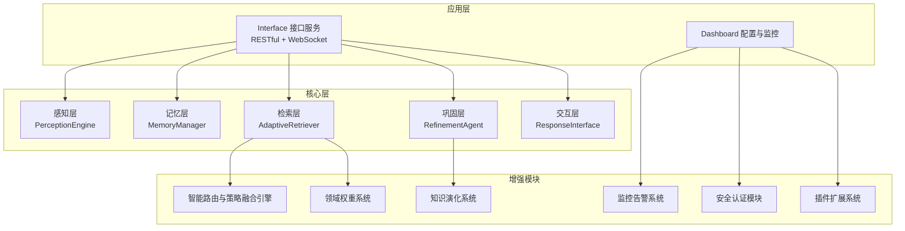
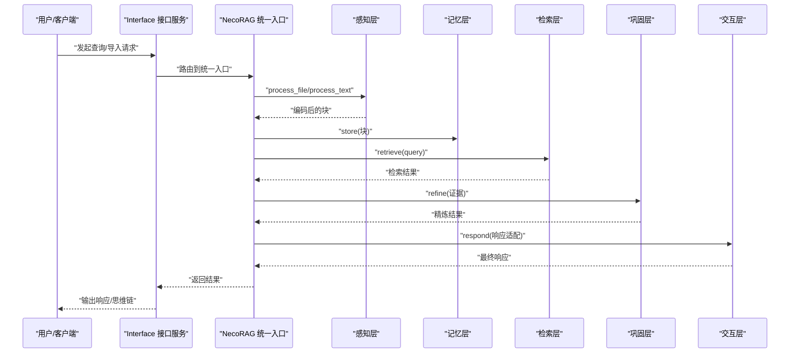
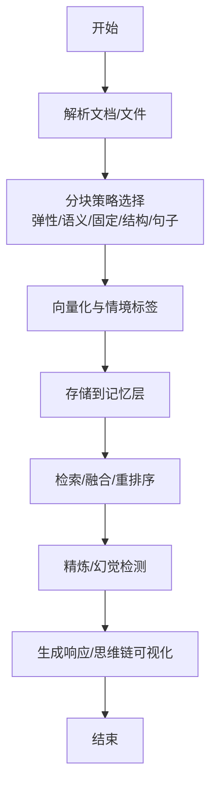
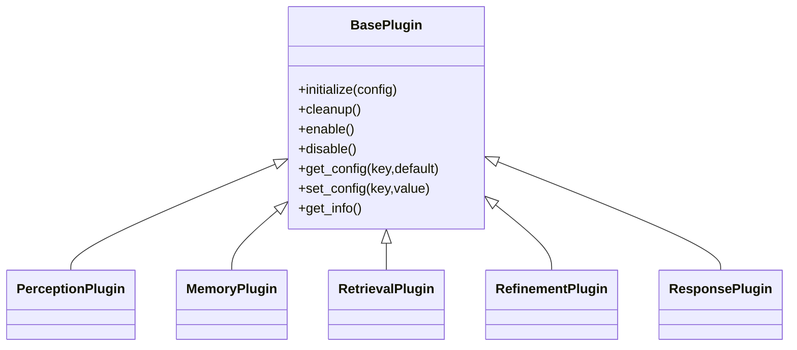
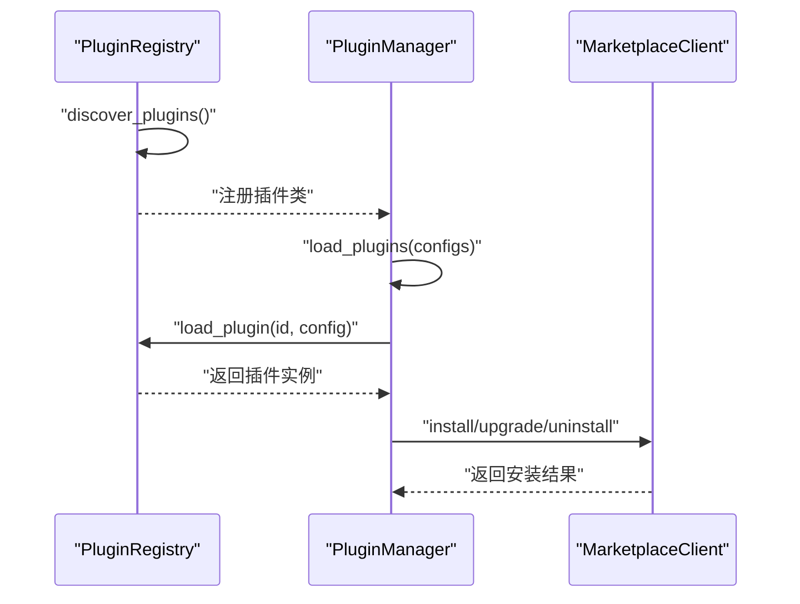
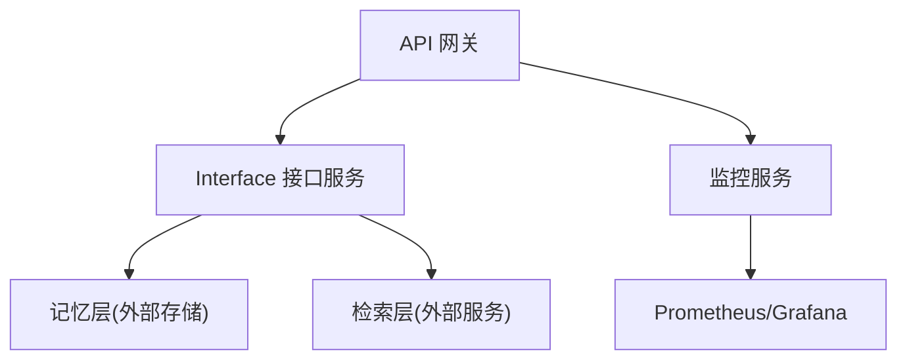
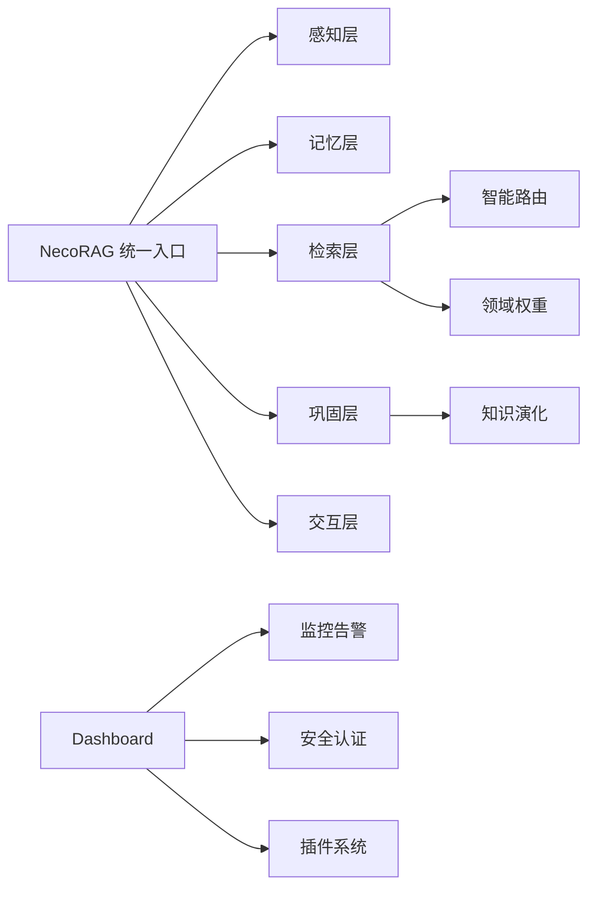

# 集成最佳实践

<cite>
**本文引用的文件**
- [README.md](file://README.md)
- [QUICKSTART.md](file://QUICKSTART.md)
- [src/necorag.py](file://src/necorag.py)
- [src/plugins/README.md](file://src/plugins/README.md)
- [src/plugins/base.py](file://src/plugins/base.py)
- [src/plugins/manager.py](file://src/plugins/manager.py)
- [src/plugins/registry.py](file://src/plugins/registry.py)
- [src/security/README.md](file://src/security/README.md)
- [src/monitoring/README.md](file://src/monitoring/README.md)
- [src/monitoring/metrics.py](file://src/monitoring/metrics.py)
- [src/monitoring/service.py](file://src/monitoring/service.py)
- [src/perception/chunker.py](file://src/perception/chunker.py)
- [src/perception/parser.py](file://src/perception/parser.py)
- [interface/main.py](file://interface/main.py)
- [devops/Dockerfile](file://devops/Dockerfile)
</cite>

## 目录
1. [简介](#简介)
2. [项目结构](#项目结构)
3. [核心组件](#核心组件)
4. [架构总览](#架构总览)
5. [详细组件分析](#详细组件分析)
6. [依赖分析](#依赖分析)
7. [性能考量](#性能考量)
8. [故障排除指南](#故障排除指南)
9. [结论](#结论)
10. [附录](#附录)

## 简介
本文件面向在生产环境中集成 NecoRAG 的工程团队，提供从数据接入、清洗与质量控制，到插件系统、安全与监控，再到生产部署与运维的系统化最佳实践。文档以仓库现有实现为依据，结合五层认知架构与新增的智能路由、领域权重、知识演化、监控告警、安全认证等模块，给出可落地的实施步骤与排障建议。

## 项目结构
NecoRAG 采用模块化分层架构，核心分为感知层、记忆层、检索层、巩固层与交互层，并配套插件扩展、安全认证、监控告警与接口服务等支撑模块。项目提供 Docker 一键编排与 Dashboard 可视化配置，便于快速部署与运维。

**图示来源**
- [README.md: 52-183:52-183](file://README.md#L52-L183)
- [QUICKSTART.md: 120-191:120-191](file://QUICKSTART.md#L120-L191)

**章节来源**
- [README.md: 25-183:25-183](file://README.md#L25-L183)
- [QUICKSTART.md: 89-191:89-191](file://QUICKSTART.md#L89-L191)

## 核心组件
- 统一入口 NecoRAG：封装文档导入、查询检索、知识演化与自适应学习等能力，提供简洁 API。
- 感知层：文档解析、分块与编码，支持多策略分块与结构化抽取。
- 记忆层：三层记忆系统（工作记忆/语义记忆/情景图谱），支持权重衰减与主动遗忘。
- 检索层：混合检索、HyDE 增强、重排序与早停机制，配合智能路由与领域权重。
- 巩固层：答案精炼、幻觉检测与知识固化闭环。
- 交互层：情境自适应响应、思维链可视化与证据溯源。
- 增强模块：智能路由与策略融合、领域权重、知识演化、监控告警、安全认证、插件系统。

**章节来源**
- [src/necorag.py: 51-800:51-800](file://src/necorag.py#L51-L800)
- [README.md: 383-606:383-606](file://README.md#L383-L606)

## 架构总览
下图展示 NecoRAG 五层架构与关键增强模块的交互关系，以及数据在各层之间的流转。

**图示来源**
- [src/necorag.py: 390-513:390-513](file://src/necorag.py#L390-L513)
- [README.md: 383-606:383-606](file://README.md#L383-L606)

## 详细组件分析

### 数据接入与多来源整合
- 结构化数据：通过感知层的解析与分块策略，将表格、图片等结构化元素抽取为统一的块对象，便于后续向量化与检索。
- 非结构化文档：支持 PDF、Word、Markdown 等格式的解析与分块，提供弹性分块、语义分块、句子分块等多种策略，兼顾准确性与性能。
- 实时数据流：通过接口服务提供 RESTful 与 WebSocket，支持实时推送与增量更新，结合监控系统记录 API 调用与响应时间。

**图示来源**
- [src/perception/parser.py: 28-113:28-113](file://src/perception/parser.py#L28-L113)
- [src/perception/chunker.py: 49-141:49-141](file://src/perception/chunker.py#L49-L141)
- [src/necorag.py: 237-336:237-336](file://src/necorag.py#L237-L336)

**章节来源**
- [src/perception/parser.py: 12-113:12-113](file://src/perception/parser.py#L12-L113)
- [src/perception/chunker.py: 12-567:12-567](file://src/perception/chunker.py#L12-L567)
- [src/necorag.py: 237-336:237-336](file://src/necorag.py#L237-L336)

### 数据清洗与质量控制
- 去重与标准化：在记忆层通过权重衰减与访问频率动态调整，结合主动遗忘机制剔除低价值内容；检索层通过早停与重排序抑制重复、提升新颖性。
- 格式转换：感知层统一输出块对象，包含内容、位置与元数据，确保下游模块一致消费。
- 异常处理：接口服务与监控系统提供健康检查与告警，统一捕获异常并记录指标，保障稳定性。

**章节来源**
- [src/necorag.py: 417-501:417-501](file://src/necorag.py#L417-L501)
- [src/monitoring/service.py: 38-154:38-154](file://src/monitoring/service.py#L38-L154)

### 插件系统使用与管理
- 插件开发：基于插件基类（感知/记忆/检索/巩固/响应）实现标准接口，支持配置管理、生命周期钩子与市场元数据。
- 插件管理：通过插件管理器进行发现、注册、加载、卸载、启用/禁用与事件处理；支持依赖解析与拓扑排序加载。
- 插件市场：支持从市场安装、升级与卸载插件，记录版本与安装路径，提供同步与钩子回调。

**图示来源**
- [src/plugins/base.py: 25-385:25-385](file://src/plugins/base.py#L25-L385)

**图示来源**
- [src/plugins/registry.py: 15-383:15-383](file://src/plugins/registry.py#L15-L383)
- [src/plugins/manager.py: 14-584:14-584](file://src/plugins/manager.py#L14-L584)

**章节来源**
- [src/plugins/README.md: 1-239:1-239](file://src/plugins/README.md#L1-L239)
- [src/plugins/base.py: 25-385:25-385](file://src/plugins/base.py#L25-L385)
- [src/plugins/manager.py: 14-584:14-584](file://src/plugins/manager.py#L14-L584)
- [src/plugins/registry.py: 15-383:15-383](file://src/plugins/registry.py#L15-L383)

### 安全集成与访问控制
- 认证授权：支持 JWT 与 OAuth2，提供用户认证、会话管理与权限装饰器。
- 权限控制：基于 RBAC 的细粒度权限模型，支持 API、数据与界面权限。
- 安全防护：速率限制、CSRF 与 XSS 防护，提供综合安全中间件。
- 配置管理：通过环境变量与 Dashboard 配置，集中管理密钥与策略。

**章节来源**
- [src/security/README.md: 1-299:1-299](file://src/security/README.md#L1-L299)

### 生产环境集成方案
- 微服务架构：将接口服务与监控服务分离，通过 API 网关统一入口，实现鉴权、限流与路由。
- 负载均衡：在网关层配置多副本与健康检查，结合监控告警实现自动扩缩容。
- 数据持久化：记忆层使用 Redis/Qdrant/Neo4j 等外部存储，确保高可用与可扩展。
- 容器化部署：使用 Dockerfile 与 docker-compose 编排，提供健康检查与端口暴露。

**图示来源**
- [devops/Dockerfile: 1-39:1-39](file://devops/Dockerfile#L1-L39)
- [src/monitoring/README.md: 146-166:146-166](file://src/monitoring/README.md#L146-L166)

**章节来源**
- [devops/Dockerfile: 1-39:1-39](file://devops/Dockerfile#L1-L39)
- [src/monitoring/README.md: 146-166:146-166](file://src/monitoring/README.md#L146-L166)

### 性能监控与可观测性
- 指标采集：系统级（CPU/内存/磁盘/网络）与应用级（RAG 响应时间、API 调用、缓存命中）指标，支持 Prometheus 导出。
- 健康检查：多维度健康检查与历史记录，支持并发执行与超时控制。
- 告警管理：基于规则的智能告警与多渠道通知，支持告警抑制与分级处理。
- Dashboard：可视化仪表板与 RESTful API，便于运维与开发观察。

**章节来源**
- [src/monitoring/metrics.py: 25-207:25-207](file://src/monitoring/metrics.py#L25-L207)
- [src/monitoring/service.py: 21-214:21-214](file://src/monitoring/service.py#L21-L214)
- [src/monitoring/README.md: 1-373:1-373](file://src/monitoring/README.md#L1-L373)

## 依赖分析
- 组件耦合：统一入口 NecoRAG 依赖感知、记忆、检索、巩固与交互层；增强模块（智能路由、领域权重、知识演化）与核心模块松耦合，通过配置与事件交互。
- 外部依赖：感知层依赖嵌入模型与文档解析工具；记忆层依赖 Redis/Qdrant/Neo4j；监控依赖 psutil 与 APScheduler；安全依赖 passlib 与 jose；接口服务依赖 FastAPI/Uvicorn/WebSocket。

**图示来源**
- [src/necorag.py: 17-48:17-48](file://src/necorag.py#L17-L48)
- [README.md: 104-183:104-183](file://README.md#L104-L183)

**章节来源**
- [src/necorag.py: 17-48:17-48](file://src/necorag.py#L17-L48)
- [README.md: 104-183:104-183](file://README.md#L104-L183)

## 性能考量
- 检索性能：通过早停机制与重排序抑制重复，结合领域权重与多策略融合降低无效计算。
- 记忆效率：动态权重衰减与主动遗忘减少冗余存储，提升检索命中率与响应速度。
- 监控开销：指标采样与异步调度器降低监控对业务的影响，建议按环境调整采样频率。
- 插件隔离：插件沙箱与依赖解析避免插件异常影响主流程，建议启用必要的权限与资源限制。

[本节为通用指导，无需引用具体文件]

## 故障排除指南
- 插件加载失败：检查插件类继承与必需方法实现，查看日志定位错误；使用依赖解析工具排查循环依赖。
- 监控指标缺失：确认 psutil 权限与采样间隔配置；检查健康检查超时与告警去重逻辑。
- 安全认证问题：核对 JWT 密钥与 OAuth 凭据配置；验证用户角色与权限映射。
- 接口服务异常：检查端口占用与健康检查；通过 Dashboard 查看统计与错误分类。

**章节来源**
- [src/plugins/README.md: 208-226:208-226](file://src/plugins/README.md#L208-L226)
- [src/monitoring/README.md: 285-321:285-321](file://src/monitoring/README.md#L285-L321)
- [src/security/README.md: 268-284:268-284](file://src/security/README.md#L268-L284)
- [QUICKSTART.md: 397-409:397-409](file://QUICKSTART.md#L397-L409)

## 结论
NecoRAG 提供了从数据接入、检索优化到安全与监控的完整能力矩阵。通过统一入口与模块化设计，可在生产环境中实现稳定、可观测与可扩展的集成。建议在集成过程中优先完善数据清洗与质量控制、建立完善的监控与告警体系，并以插件化方式逐步扩展能力，确保系统在高负载下的可靠性与可维护性。

[本节为总结性内容，无需引用具体文件]

## 附录

### 快速开始与最小工作示例
- 使用统一入口进行文档导入与查询，结合智能路由与领域权重提升检索质量。
- 通过 Dashboard 配置各模块参数，实时查看统计与监控指标。

**章节来源**
- [README.md: 281-382:281-382](file://README.md#L281-L382)
- [QUICKSTART.md: 135-191:135-191](file://QUICKSTART.md#L135-L191)

### 接口服务与 WebSocket
- 同时启动 RESTful API 与 WebSocket 服务，支持实时推送与调试面板。

**章节来源**
- [interface/main.py: 14-82:14-82](file://interface/main.py#L14-L82)