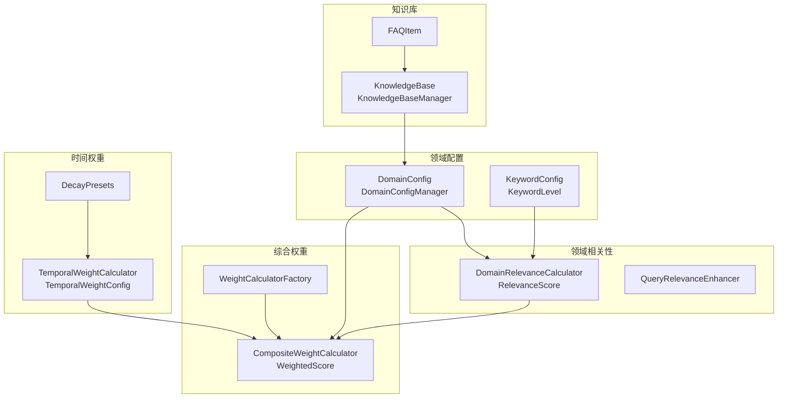
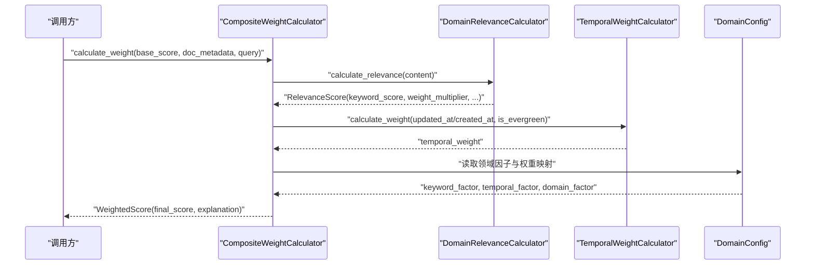
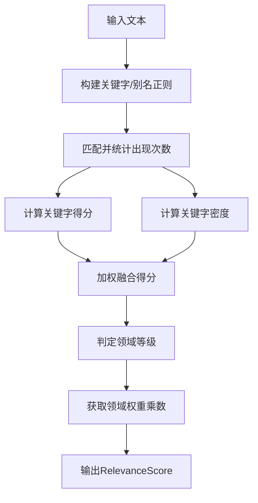
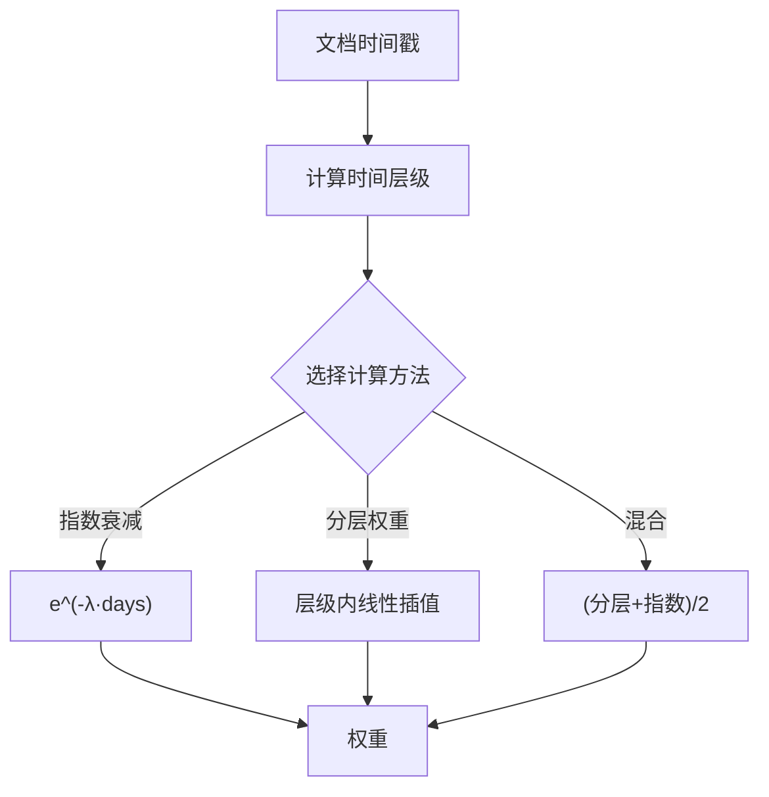
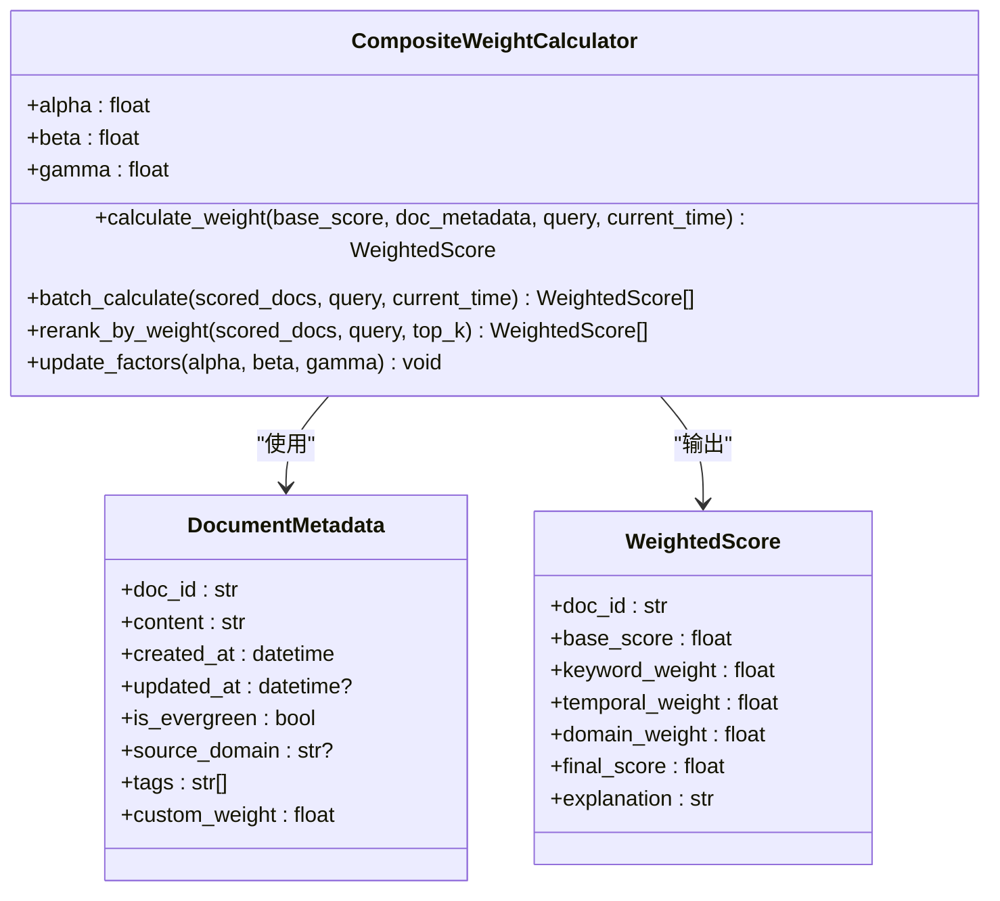
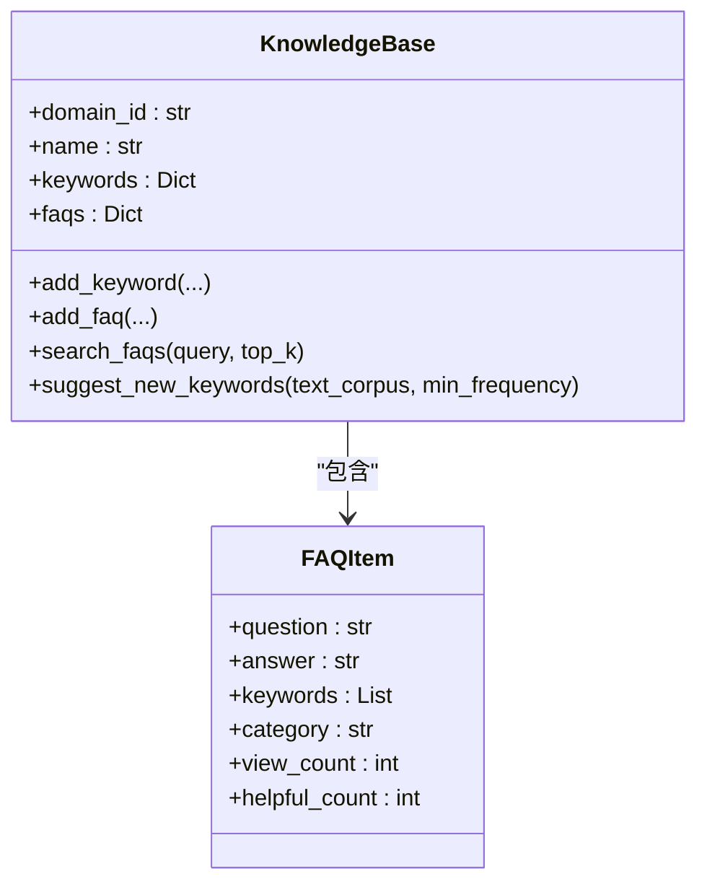
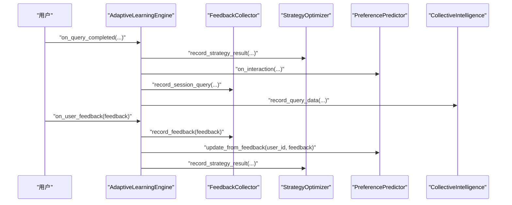
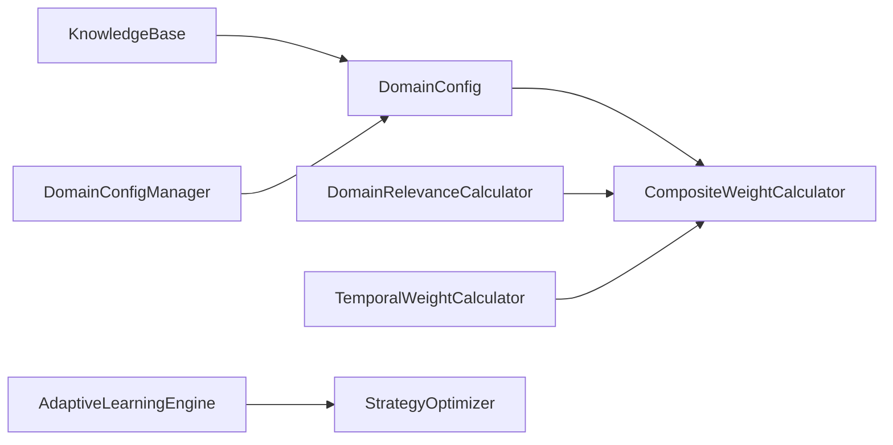

# 领域权重系统

<cite>
**本文引用的文件**
- [relevance.py](file://src/domain/relevance.py)
- [temporal_weight.py](file://src/domain/temporal_weight.py)
- [weight_calculator.py](file://src/domain/weight_calculator.py)
- [knowledge_base.py](file://src/domain/knowledge_base.py)
- [config.py](file://src/domain/config.py)
- [domain_weight_example.py](file://example/domain_weight_example.py)
- [engine.py](file://src/adaptive/engine.py)
- [strategy_optimizer.py](file://src/adaptive/strategy_optimizer.py)
</cite>

## 目录
1. [简介](#简介)
2. [项目结构](#项目结构)
3. [核心组件](#核心组件)
4. [架构总览](#架构总览)
5. [详细组件分析](#详细组件分析)
6. [依赖关系分析](#依赖关系分析)
7. [性能考量](#性能考量)
8. [故障排查指南](#故障排查指南)
9. [结论](#结论)
10. [附录](#附录)

## 简介
本文件面向 NecoRAG 的“领域权重系统”，系统性阐述领域相关性计算、时间权重处理、权重优化与人工校正机制，并提供不同业务场景的权重配置建议与性能优化策略。读者无需深厚的背景知识即可理解与应用。

## 项目结构
领域权重系统位于 src/domain 目录，围绕“领域配置”“领域相关性评分”“时间权重”“综合权重计算”“知识库管理”五大模块协同工作，形成从关键字到文档、从时效性到领域匹配的多维度加权体系。

图表来源
- [config.py:54-161](file://src/domain/config.py#L54-L161)
- [relevance.py:29-241](file://src/domain/relevance.py#L29-L241)
- [temporal_weight.py:47-195](file://src/domain/temporal_weight.py#L47-L195)
- [weight_calculator.py:56-206](file://src/domain/weight_calculator.py#L56-L206)
- [knowledge_base.py:64-263](file://src/domain/knowledge_base.py#L64-L263)

章节来源
- [config.py:54-161](file://src/domain/config.py#L54-L161)
- [relevance.py:29-241](file://src/domain/relevance.py#L29-L241)
- [temporal_weight.py:47-195](file://src/domain/temporal_weight.py#L47-L195)
- [weight_calculator.py:56-206](file://src/domain/weight_calculator.py#L56-L206)
- [knowledge_base.py:64-263](file://src/domain/knowledge_base.py#L64-L263)

## 核心组件
- 领域配置与关键字：定义领域、关键字等级与权重、领域因子系数、时间衰减参数等。
- 领域相关性评分：基于关键字与密度的评分，输出领域等级与权重乘数。
- 时间权重：提供指数衰减、分层权重、混合方法与预设衰减配置。
- 综合权重计算：整合基础相似度、关键字权重、时间权重、领域权重与自定义权重，输出最终排序分数。
- 知识库管理：关键字与FAQ导入导出、语料扩充、持久化与加载。

章节来源
- [config.py:54-161](file://src/domain/config.py#L54-L161)
- [relevance.py:29-241](file://src/domain/relevance.py#L29-L241)
- [temporal_weight.py:47-195](file://src/domain/temporal_weight.py#L47-L195)
- [weight_calculator.py:56-206](file://src/domain/weight_calculator.py#L56-L206)
- [knowledge_base.py:64-263](file://src/domain/knowledge_base.py#L64-L263)

## 架构总览
领域权重系统采用“配置驱动 + 多维度评分 + 综合加权”的架构。查询流程大致如下：
- 输入：基础相似度分数、文档元数据、可选查询文本
- 步骤：
  1) 关键字相关性评分（DomainRelevanceCalculator）
  2) 时间权重计算（TemporalWeightCalculator）
  3) 领域权重映射（DomainConfig）
  4) 综合加权（CompositeWeightCalculator）
- 输出：加权评分与解释

图表来源
- [weight_calculator.py:81-146](file://src/domain/weight_calculator.py#L81-L146)
- [relevance.py:198-241](file://src/domain/relevance.py#L198-L241)
- [temporal_weight.py:160-195](file://src/domain/temporal_weight.py#L160-L195)
- [config.py:54-161](file://src/domain/config.py#L54-L161)

## 详细组件分析

### 领域相关性计算
- 关键字提取与匹配：构建关键字与别名的正则模式，大小写不敏感匹配，统计出现次数与权重。
- 关键字得分：对每个匹配关键字，按权重×频次累加，再除以总出现次数，归一化至合理区间。
- 关键字密度：按词数统计关键字出现比例，假设约20%密度为满分，再做缩放。
- 综合评分与等级：加权融合关键字得分与密度得分，映射到核心/相关/边缘/领域外等级，并给出对应权重乘数。
- 置信度：基于匹配关键字数量，上限为5个，超过即满置信度。
- 查询增强：识别查询中的关键字，计算权重加成，支持同义词扩展。

图表来源
- [relevance.py:66-241](file://src/domain/relevance.py#L66-L241)

章节来源
- [relevance.py:29-241](file://src/domain/relevance.py#L29-L241)

### 时间权重处理
- 时间层级：按天数划分最近、近期、中期、远期、历史与常青，分别映射权重范围。
- 指数衰减：e^(-λ × 天数)，适合强调“越新越重要”的场景。
- 分层权重：在各层级内线性插值，保证连续性。
- 混合方法：分层权重与指数衰减取均值，兼顾层级与指数特性。
- 预设配置：快变领域（新闻）、正常领域（学术）、慢变领域（法律）、常青领域（禁用衰减）。

图表来源
- [temporal_weight.py:53-195](file://src/domain/temporal_weight.py#L53-L195)

章节来源
- [temporal_weight.py:47-195](file://src/domain/temporal_weight.py#L47-L195)

### 综合权重计算与重排序
- 输入：基础相似度分数、文档元数据（含时间、是否常青、自定义权重等）、可选查询文本。
- 计算步骤：
  1) 关键字权重：取领域相关性评分中的关键字得分，裁剪到[0.5, 2.0]。
  2) 时间权重：依据文档时间与是否常青，按配置方法计算。
  3) 领域权重：依据领域等级映射到配置中的权重乘数。
  4) 最终分数：base_score × (α×关键字) × (β×时间) × (γ×领域) × 自定义权重。
- 批量计算与重排序：支持批量加权与Top-K排序。
- 权重因子更新：运行时可调整α、β、γ以适配不同场景。

图表来源
- [weight_calculator.py:56-206](file://src/domain/weight_calculator.py#L56-L206)

章节来源
- [weight_calculator.py:56-206](file://src/domain/weight_calculator.py#L56-L206)

### 知识库与关键字管理
- FAQ 数据结构：问题、答案、关键字、分类、统计字段。
- 知识库：关键字与FAQ的增删改查、搜索、从语料建议新关键字、历史记录。
- 导入导出：支持JSON/CSV/TXT格式，便于外部知识迁移。
- 示例知识库：内置AI/ML示例，便于快速上手。

图表来源
- [knowledge_base.py:64-263](file://src/domain/knowledge_base.py#L64-L263)

章节来源
- [knowledge_base.py:64-263](file://src/domain/knowledge_base.py#L64-L263)

### 权重优化与人工校正
- 机器学习驱动的权重调整：自适应学习引擎通过反馈收集、偏好预测、策略优化、集体智慧四大子系统，实现“越用越智能”。策略优化器采用epsilon-greedy平衡探索与利用，基于满意度等信号在线更新策略权重。
- 人工校正机制：通过仪表盘与调试面板，观察学习指标、策略表现、用户画像与社区洞察，进行人工干预与参数校正。

图表来源
- [engine.py:122-244](file://src/adaptive/engine.py#L122-L244)
- [strategy_optimizer.py:93-154](file://src/adaptive/strategy_optimizer.py#L93-L154)

章节来源
- [engine.py:30-406](file://src/adaptive/engine.py#L30-L406)
- [strategy_optimizer.py:19-401](file://src/adaptive/strategy_optimizer.py#L19-L401)

## 依赖关系分析
- 领域配置与权重因子：DomainConfig 提供关键字等级、领域权重映射与因子系数，被综合权重计算器使用。
- 相关性与时间权重：DomainRelevanceCalculator 与 TemporalWeightCalculator 分别提供关键字得分与时间权重，共同参与最终加权。
- 知识库与配置：KnowledgeBase 与 DomainConfigManager 协作，支撑关键字与FAQ的持久化与加载。
- 自适应学习：AdaptiveLearningEngine 与 StrategyOptimizer 通过反馈驱动策略权重优化，间接影响权重配置的合理性。

图表来源
- [weight_calculator.py:59-80](file://src/domain/weight_calculator.py#L59-L80)
- [relevance.py:32-40](file://src/domain/relevance.py#L32-L40)
- [temporal_weight.py:50-51](file://src/domain/temporal_weight.py#L50-L51)
- [knowledge_base.py:266-322](file://src/domain/knowledge_base.py#L266-L322)
- [engine.py:30-100](file://src/adaptive/engine.py#L30-L100)

章节来源
- [weight_calculator.py:56-206](file://src/domain/weight_calculator.py#L56-L206)
- [relevance.py:29-241](file://src/domain/relevance.py#L29-L241)
- [temporal_weight.py:47-195](file://src/domain/temporal_weight.py#L47-L195)
- [knowledge_base.py:266-322](file://src/domain/knowledge_base.py#L266-L322)
- [engine.py:30-100](file://src/adaptive/engine.py#L30-L100)

## 性能考量
- 批量处理：提供批量计算与重排序接口，减少重复初始化成本。
- 关键字索引：构建正则模式与别名索引，避免重复扫描。
- 权重裁剪：关键字权重在[0.5, 2.0]范围内裁剪，防止极端波动。
- 时间权重缓存：对于相同文档与时间的多次计算，可复用中间结果（需在调用侧实现）。
- 大数据量策略：分页重排序、Top-K截断、异步批处理、向量化相似度预计算。

## 故障排查指南
- 关键字未匹配：检查关键字大小写、别名是否正确注册；确认正则转义与边界处理。
- 权重异常：核对 DomainConfig 中的权重映射与因子系数；检查是否启用了时间衰减。
- 时间权重恒定：确认文档时间字段与当前时间传入；检查是否标记为常青内容。
- 重排序结果异常：检查基础相似度分数来源与范围；确认自定义权重是否合理。

章节来源
- [relevance.py:42-93](file://src/domain/relevance.py#L42-L93)
- [weight_calculator.py:103-129](file://src/domain/weight_calculator.py#L103-L129)
- [temporal_weight.py:160-195](file://src/domain/temporal_weight.py#L160-L195)

## 结论
NecoRAG 的领域权重系统通过“关键字+密度+领域等级+时间衰减+自定义权重”的多维融合，实现了可配置、可解释、可优化的加权排序。配合自适应学习引擎与知识库管理，系统具备持续演进能力，适用于电商、客服、技术文档等多样化业务场景。

## 附录

### 不同业务场景的权重配置建议
- 电商（商品检索/推荐）
  - 关键字因子：偏高（强调标题/属性匹配）
  - 时间因子：中等（新品优先，但不过度压制历史商品）
  - 领域因子：中等
  - 时间衰减：启用，衰减系数适中
- 客服（FAQ/工单知识检索）
  - 关键字因子：高（FAQ关键字精准）
  - 时间因子：低（历史FAQ仍有价值）
  - 领域因子：高（严格限定客服领域）
  - 时间衰减：启用，但对FAQ可设置常青
- 技术文档（研发/运维知识库）
  - 关键字因子：高（术语密集）
  - 时间因子：中等（技术方案随版本更新）
  - 领域因子：高（技术领域严格）
  - 时间衰减：按领域选择（快变技术快衰减，基础理论慢衰减）

### 使用示例与最佳实践
- 使用示例脚本演示了领域配置、时间权重、相关性评分与综合权重计算的完整流程。
- 建议在生产环境中：
  - 将领域配置持久化到文件，定期备份与回滚。
  - 通过仪表盘监控学习指标与策略表现，必要时人工校正。
  - 对高频文档进行缓存与增量更新，降低重复计算开销。

章节来源
- [domain_weight_example.py:22-267](file://example/domain_weight_example.py#L22-L267)