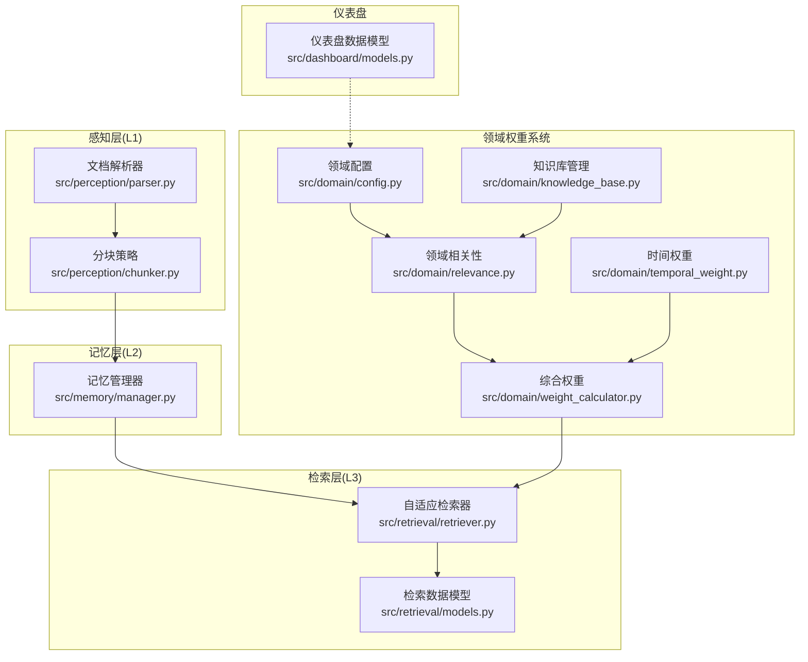
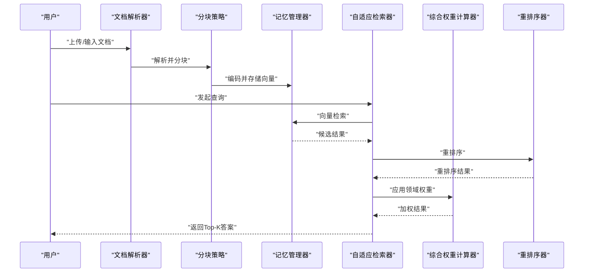
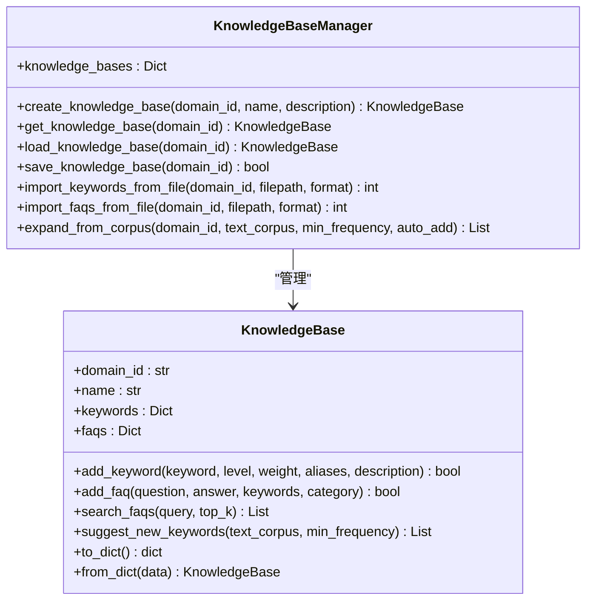
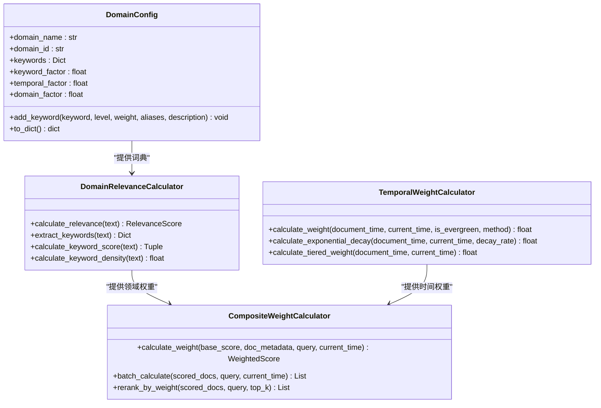
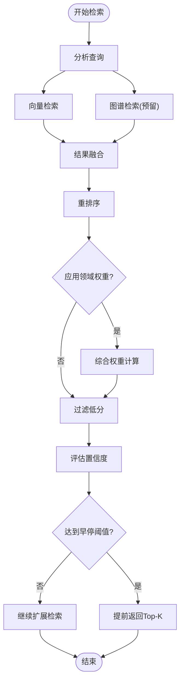
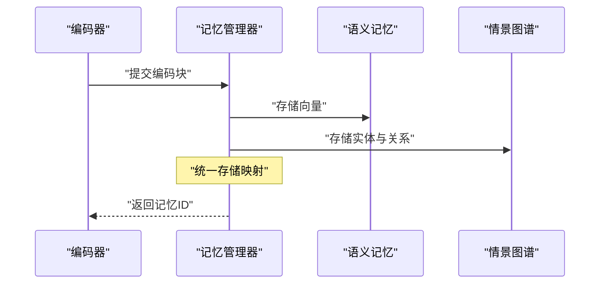
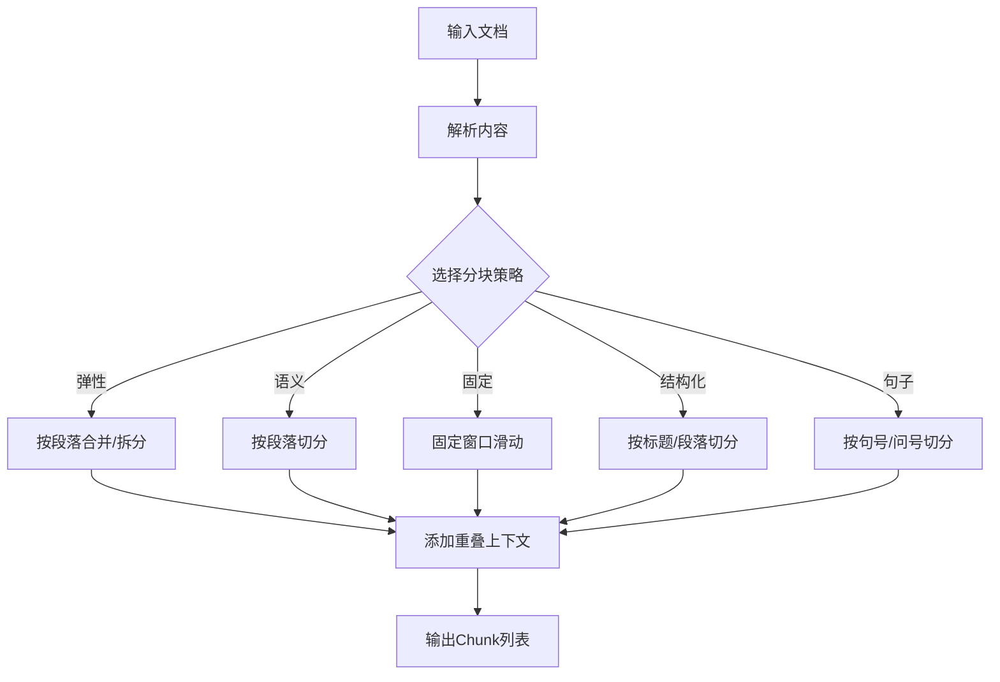
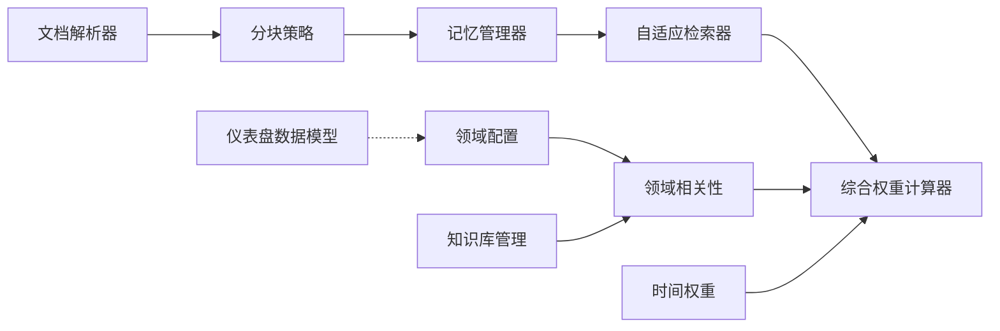

# 高级应用场景

<cite>
**本文引用的文件**
- [src/domain/knowledge_base.py](file://src/domain/knowledge_base.py)
- [src/domain/config.py](file://src/domain/config.py)
- [src/domain/weight_calculator.py](file://src/domain/weight_calculator.py)
- [src/domain/temporal_weight.py](file://src/domain/temporal_weight.py)
- [src/domain/relevance.py](file://src/domain/relevance.py)
- [example/knowledge_base_example.py](file://example/knowledge_base_example.py)
- [example/domain_weight_example.py](file://example/domain_weight_example.py)
- [example/knowledge_base_integration.py](file://example/knowledge_base_integration.py)
- [src/perception/chunker.py](file://src/perception/chunker.py)
- [src/perception/parser.py](file://src/perception/parser.py)
- [src/retrieval/retriever.py](file://src/retrieval/retriever.py)
- [src/retrieval/models.py](file://src/retrieval/models.py)
- [src/memory/manager.py](file://src/memory/manager.py)
- [src/dashboard/models.py](file://src/dashboard/models.py)
</cite>

## 目录
1. [引言](#引言)
2. [项目结构](#项目结构)
3. [核心组件](#核心组件)
4. [架构总览](#架构总览)
5. [详细组件分析](#详细组件分析)
6. [依赖分析](#依赖分析)
7. [性能考量](#性能考量)
8. [故障排查指南](#故障排查指南)
9. [结论](#结论)
10. [附录](#附录)

## 引言
本文件面向NecoRAG高级应用场景，围绕“知识库管理”“领域权重系统”“知识库集成最佳实践”“复杂查询处理”“性能优化与大数据策略”“业务场景参数调优”六个维度，提供系统化、可操作的实现文档。读者无需深入底层即可理解各模块职责、数据流与控制流，并能在生产环境中安全地扩展与优化。

## 项目结构
NecoRAG采用分层架构：感知层负责文档解析与分块；记忆层承载工作记忆、语义记忆与情景图谱；检索层实现向量检索、融合与重排序，并引入“早停机制”；领域权重系统贯穿检索与重排序阶段，提供关键字、时间与领域相关性加权；仪表盘提供配置与统计视图。

图表来源
- [src/perception/parser.py:12-113](file://src/perception/parser.py#L12-L113)
- [src/perception/chunker.py:12-567](file://src/perception/chunker.py#L12-L567)
- [src/memory/manager.py:20-212](file://src/memory/manager.py#L20-L212)
- [src/retrieval/retriever.py:135-644](file://src/retrieval/retriever.py#L135-L644)
- [src/retrieval/models.py:9-29](file://src/retrieval/models.py#L9-L29)
- [src/domain/config.py:54-161](file://src/domain/config.py#L54-L161)
- [src/domain/knowledge_base.py:65-264](file://src/domain/knowledge_base.py#L65-L264)
- [src/domain/relevance.py:29-328](file://src/domain/relevance.py#L29-L328)
- [src/domain/temporal_weight.py:47-271](file://src/domain/temporal_weight.py#L47-L271)
- [src/domain/weight_calculator.py:56-318](file://src/domain/weight_calculator.py#L56-L318)
- [src/dashboard/models.py:22-232](file://src/dashboard/models.py#L22-L232)

章节来源
- [src/perception/parser.py:12-113](file://src/perception/parser.py#L12-L113)
- [src/perception/chunker.py:12-567](file://src/perception/chunker.py#L12-L567)
- [src/memory/manager.py:20-212](file://src/memory/manager.py#L20-L212)
- [src/retrieval/retriever.py:135-644](file://src/retrieval/retriever.py#L135-L644)
- [src/retrieval/models.py:9-29](file://src/retrieval/models.py#L9-L29)
- [src/domain/config.py:54-161](file://src/domain/config.py#L54-L161)
- [src/domain/knowledge_base.py:65-264](file://src/domain/knowledge_base.py#L65-L264)
- [src/domain/relevance.py:29-328](file://src/domain/relevance.py#L29-L328)
- [src/domain/temporal_weight.py:47-271](file://src/domain/temporal_weight.py#L47-L271)
- [src/domain/weight_calculator.py:56-318](file://src/domain/weight_calculator.py#L56-L318)
- [src/dashboard/models.py:22-232](file://src/dashboard/models.py#L22-L232)

## 核心组件
- 知识库管理模块：提供关键字与FAQ的增删改查、导入导出、自动扩充与持久化能力，支撑领域权重系统的基础词典。
- 领域权重系统：由领域配置、关键字权重、时间权重、领域相关性三部分组成，通过综合权重计算器对检索结果进行加权重排。
- 检索器：实现多路检索、结果融合、重排序、领域权重应用与早停控制，支持异步回退至网络搜索。
- 记忆管理器：统一管理三层记忆，负责向量存储、实体图谱与记忆巩固/遗忘。
- 感知与分块：文档解析与多策略分块，确保高质量的向量输入。
- 仪表盘数据模型：提供模块配置与统计视图，便于参数调优与监控。

章节来源
- [src/domain/knowledge_base.py:65-264](file://src/domain/knowledge_base.py#L65-L264)
- [src/domain/weight_calculator.py:56-318](file://src/domain/weight_calculator.py#L56-L318)
- [src/domain/temporal_weight.py:47-271](file://src/domain/temporal_weight.py#L47-L271)
- [src/domain/relevance.py:29-328](file://src/domain/relevance.py#L29-L328)
- [src/retrieval/retriever.py:135-644](file://src/retrieval/retriever.py#L135-L644)
- [src/memory/manager.py:20-212](file://src/memory/manager.py#L20-L212)
- [src/perception/chunker.py:12-567](file://src/perception/chunker.py#L12-L567)
- [src/perception/parser.py:12-113](file://src/perception/parser.py#L12-L113)
- [src/dashboard/models.py:22-232](file://src/dashboard/models.py#L22-L232)

## 架构总览
下图展示从文档到检索再到加权重排的完整流程，以及领域权重系统在其中的嵌入点。

图表来源
- [src/perception/parser.py:28-60](file://src/perception/parser.py#L28-L60)
- [src/perception/chunker.py:49-86](file://src/perception/chunker.py#L49-L86)
- [src/memory/manager.py:52-123](file://src/memory/manager.py#L52-L123)
- [src/retrieval/retriever.py:224-308](file://src/retrieval/retriever.py#L224-L308)
- [src/retrieval/retriever.py:310-360](file://src/retrieval/retriever.py#L310-L360)
- [src/retrieval/retriever.py:282-289](file://src/retrieval/retriever.py#L282-L289)

## 详细组件分析

### 知识库管理系统
- 关键字与FAQ管理：支持添加、查询、搜索与持久化；FAQ搜索采用问题/答案/关键字三维度打分。
- 自动扩充：从文本语料中提取候选词并按出现频次建议新增关键字，支持自动添加。
- 导入导出：支持JSON/CSV/TXT等格式，便于大规模数据迁移与备份。
- 示例与集成：提供基础使用、FAQ搜索、文件导入、语料扩充与持久化的完整示例。

图表来源
- [src/domain/knowledge_base.py:65-264](file://src/domain/knowledge_base.py#L65-L264)
- [src/domain/knowledge_base.py:266-518](file://src/domain/knowledge_base.py#L266-L518)

章节来源
- [src/domain/knowledge_base.py:65-264](file://src/domain/knowledge_base.py#L65-L264)
- [src/domain/knowledge_base.py:266-518](file://src/domain/knowledge_base.py#L266-L518)
- [example/knowledge_base_example.py:23-305](file://example/knowledge_base_example.py#L23-L305)
- [example/knowledge_base_integration.py:21-363](file://example/knowledge_base_integration.py#L21-L363)

### 领域权重系统
- 领域配置：定义关键字词典、权重因子与领域权重乘数，支持持久化与动态加载。
- 领域相关性：基于关键字匹配与密度计算，给出领域等级与权重乘数。
- 时间权重：提供指数衰减、分层权重与混合策略，支持常青内容与快速变化领域的预设配置。
- 综合权重：将关键字、时间与领域权重按因子系数加权，支持批量计算与重排序。

图表来源
- [src/domain/config.py:54-161](file://src/domain/config.py#L54-L161)
- [src/domain/relevance.py:29-328](file://src/domain/relevance.py#L29-L328)
- [src/domain/temporal_weight.py:47-271](file://src/domain/temporal_weight.py#L47-L271)
- [src/domain/weight_calculator.py:56-318](file://src/domain/weight_calculator.py#L56-L318)

章节来源
- [src/domain/config.py:54-161](file://src/domain/config.py#L54-L161)
- [src/domain/relevance.py:29-328](file://src/domain/relevance.py#L29-L328)
- [src/domain/temporal_weight.py:47-271](file://src/domain/temporal_weight.py#L47-L271)
- [src/domain/weight_calculator.py:56-318](file://src/domain/weight_calculator.py#L56-L318)
- [example/domain_weight_example.py:22-267](file://example/domain_weight_example.py#L22-L267)

### 检索器与早停机制
- 多路检索：向量检索与图谱检索（预留），结果经融合策略合并。
- 重排序：使用重排序器对候选进行再排序。
- 领域权重应用：对重排序后的结果应用综合权重，更新分数并重排。
- 早停控制：基于置信度阈值与边际收益递减策略决定是否提前终止。
- 异步回退：当本地检索不足时，异步触发网络搜索并合并结果。

图表来源
- [src/retrieval/retriever.py:224-308](file://src/retrieval/retriever.py#L224-L308)
- [src/retrieval/retriever.py:310-360](file://src/retrieval/retriever.py#L310-L360)
- [src/retrieval/retriever.py:43-133](file://src/retrieval/retriever.py#L43-L133)

章节来源
- [src/retrieval/retriever.py:135-644](file://src/retrieval/retriever.py#L135-L644)
- [src/retrieval/models.py:9-29](file://src/retrieval/models.py#L9-L29)

### 记忆管理与存储
- 存储：将编码后的文本块存入语义记忆（向量库），同时抽取实体关系写入图谱。
- 检索：基于查询向量在语义记忆中检索Top-K，并强化访问记忆权重。
- 巩固与遗忘：应用衰减策略，定期归档低价值记忆，释放存储空间。

图表来源
- [src/memory/manager.py:52-123](file://src/memory/manager.py#L52-L123)

章节来源
- [src/memory/manager.py:20-212](file://src/memory/manager.py#L20-L212)

### 感知与分块
- 文档解析：读取文本并进行简单分块，为后续编码与检索做准备。
- 分块策略：支持弹性分块、语义分块、固定大小分块、结构化分块与句子分块，兼顾语义完整性与性能。

图表来源
- [src/perception/parser.py:28-60](file://src/perception/parser.py#L28-L60)
- [src/perception/chunker.py:49-86](file://src/perception/chunker.py#L49-L86)
- [src/perception/chunker.py:89-141](file://src/perception/chunker.py#L89-L141)
- [src/perception/chunker.py:185-216](file://src/perception/chunker.py#L185-L216)
- [src/perception/chunker.py:218-248](file://src/perception/chunker.py#L218-L248)
- [src/perception/chunker.py:250-265](file://src/perception/chunker.py#L250-L265)
- [src/perception/chunker.py:143-183](file://src/perception/chunker.py#L143-L183)

章节来源
- [src/perception/parser.py:12-113](file://src/perception/parser.py#L12-L113)
- [src/perception/chunker.py:12-567](file://src/perception/chunker.py#L12-L567)

### 仪表盘与配置
- 模块配置：提供感知、记忆、检索、精炼、响应与知识演化等模块的配置模板。
- RAG配置Profile：统一管理各模块参数，支持序列化与反序列化，便于部署与迁移。
- 统计视图：提供文档总量、查询历史、性能指标等统计信息。

章节来源
- [src/dashboard/models.py:22-232](file://src/dashboard/models.py#L22-L232)

## 依赖分析
- 模块耦合
  - 检索器依赖记忆管理器与领域权重系统；领域权重系统依赖领域配置与知识库。
  - 感知层与记忆层解耦，通过统一的数据模型对接。
- 外部依赖
  - 向量库（语义记忆）、图数据库（情景图谱）、网络搜索（可选）。
- 循环依赖
  - 代码层面未见循环导入；领域权重系统以可选方式被检索器使用，避免硬耦合。

图表来源
- [src/perception/parser.py:28-60](file://src/perception/parser.py#L28-L60)
- [src/perception/chunker.py:49-86](file://src/perception/chunker.py#L49-L86)
- [src/memory/manager.py:52-123](file://src/memory/manager.py#L52-L123)
- [src/retrieval/retriever.py:135-182](file://src/retrieval/retriever.py#L135-L182)
- [src/domain/config.py:54-161](file://src/domain/config.py#L54-L161)
- [src/domain/knowledge_base.py:65-264](file://src/domain/knowledge_base.py#L65-L264)
- [src/domain/relevance.py:29-328](file://src/domain/relevance.py#L29-L328)
- [src/domain/temporal_weight.py:47-271](file://src/domain/temporal_weight.py#L47-L271)
- [src/domain/weight_calculator.py:56-318](file://src/domain/weight_calculator.py#L56-L318)
- [src/dashboard/models.py:22-232](file://src/dashboard/models.py#L22-L232)

## 性能考量
- 分块策略
  - 弹性分块：在语义边界处切割，避免碎片化与过度拆分，平衡召回与吞吐。
  - 句子分块：适合细粒度检索与证据定位；固定大小分块：适合批处理与缓存复用。
- 检索与重排序
  - 早停机制：在置信度高时提前终止，显著降低延迟；阈值与边际收益参数需结合业务调优。
  - 融合策略：倒数秩融合（RRF）在多源检索中表现稳定，适合异构结果合并。
- 内存与存储
  - 记忆巩固与主动遗忘：定期归档低价值向量，控制向量库规模。
  - 向量维度与索引类型：根据硬件与延迟要求选择合适维度与索引（如HNSW）。
- 网络搜索回退
  - 异步回退：在本地不足时补充网络结果，注意去重与可信度过滤。

[本节为通用性能指导，不直接分析具体文件]

## 故障排查指南
- 知识库导入失败
  - 检查文件格式与字段完整性；确认领域ID存在或已创建。
  - 参考示例中的导入流程与异常处理。
- 权重计算异常
  - 确认领域配置已加载；检查关键字词典是否存在；核对时间戳与是否为常青内容。
- 检索结果质量差
  - 调整早停阈值与重排序模型；检查分块策略与向量维度；评估融合权重。
- 记忆膨胀
  - 提升衰减率与归档阈值；定期执行巩固与遗忘；监控向量库容量。

章节来源
- [example/knowledge_base_example.py:134-184](file://example/knowledge_base_example.py#L134-L184)
- [example/domain_weight_example.py:204-243](file://example/domain_weight_example.py#L204-L243)
- [src/retrieval/retriever.py:43-133](file://src/retrieval/retriever.py#L43-L133)
- [src/memory/manager.py:161-202](file://src/memory/manager.py#L161-L202)

## 结论
NecoRAG在高级应用场景中提供了从“知识库管理”到“领域权重加权”的完整闭环：以知识库为基础词典，结合时间与领域相关性，通过综合权重对检索结果进行精细化重排；配合弹性分块、早停与融合策略，实现高效稳定的RAG系统。通过仪表盘配置与统计视图，可实现参数的持续优化与可观测性。

[本节为总结性内容，不直接分析具体文件]

## 附录

### 复杂查询场景处理方案
- 多轮对话
  - 通过记忆管理器保留上下文，检索器在查询增强阶段识别领域关键字，结合早停机制减少重复计算。
- 上下文理解
  - 使用查询增强器提取关键字并给予权重加成，结合领域权重提升相关段落的相对分数。
- 推理链构建
  - 检索结果按加权分数排序，前端可视化展示证据卡片与检索轨迹，辅助推理链呈现。

章节来源
- [src/retrieval/retriever.py:224-308](file://src/retrieval/retriever.py#L224-L308)
- [src/retrieval/retriever.py:310-360](file://src/retrieval/retriever.py#L310-L360)
- [src/dashboard/models.py:222-232](file://src/dashboard/models.py#L222-L232)

### 知识库集成最佳实践
- 多来源数据整合
  - 统一使用知识库管理模块导入，确保关键字与FAQ的标准化；对非结构化数据先解析再分块入库。
- 数据清洗与质量控制
  - 导入前进行去重与格式校验；对别名进行一致性处理；定期清理无效关键字与低质量FAQ。
- 持续学习与更新
  - 基于用户交互与日志数据，自动提取新词并建议新增关键字；设定阈值与级别自动添加。

章节来源
- [example/knowledge_base_integration.py:186-248](file://example/knowledge_base_integration.py#L186-L248)
- [example/knowledge_base_integration.py:251-326](file://example/knowledge_base_integration.py#L251-L326)
- [src/domain/knowledge_base.py:440-494](file://src/domain/knowledge_base.py#L440-L494)

### 参数优化建议（业务场景）
- 快速变化领域（新闻/科技）
  - 时间权重：启用指数衰减或混合策略；缩短近期阈值；提高衰减系数。
  - 领域权重：提高时间因子与领域因子，强调时效性与相关性。
- 缓慢变化领域（法律/历史）
  - 时间权重：禁用时间衰减或降低衰减系数；常青内容优先。
  - 领域权重：适度提高关键字因子，弱化时间权重。
- 通用领域
  - 默认配置：平衡关键字、时间与领域因子；早停阈值与边际收益适中。

章节来源
- [src/domain/temporal_weight.py:231-271](file://src/domain/temporal_weight.py#L231-L271)
- [src/domain/weight_calculator.py:207-223](file://src/domain/weight_calculator.py#L207-L223)
- [src/retrieval/retriever.py:43-133](file://src/retrieval/retriever.py#L43-L133)