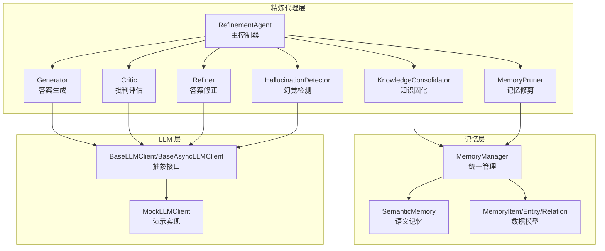
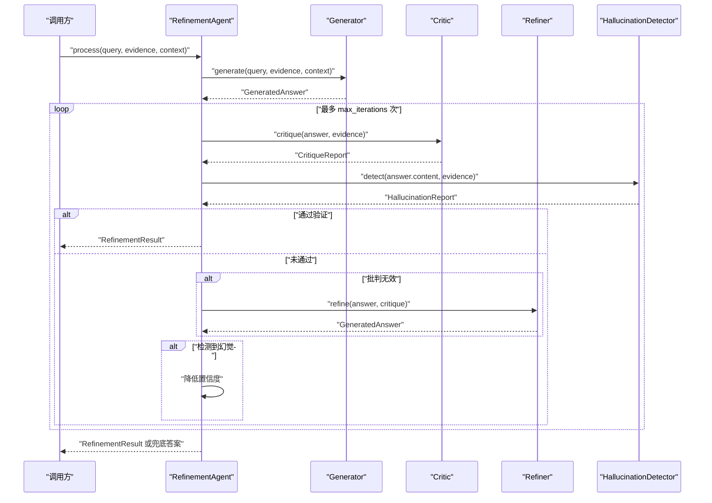
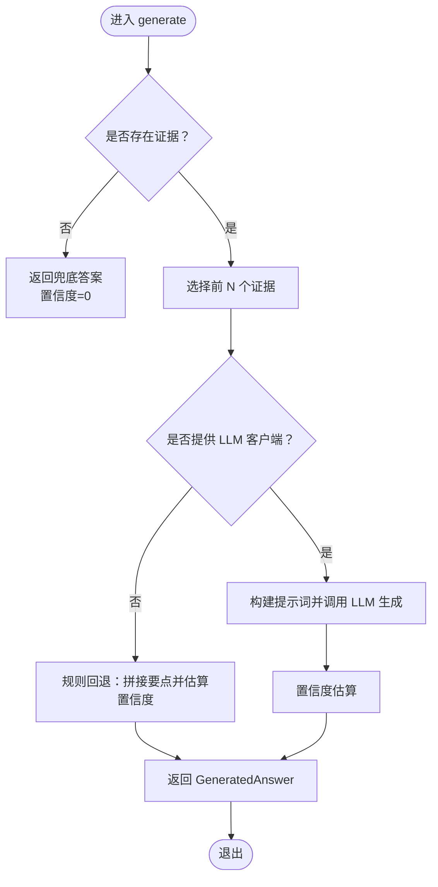
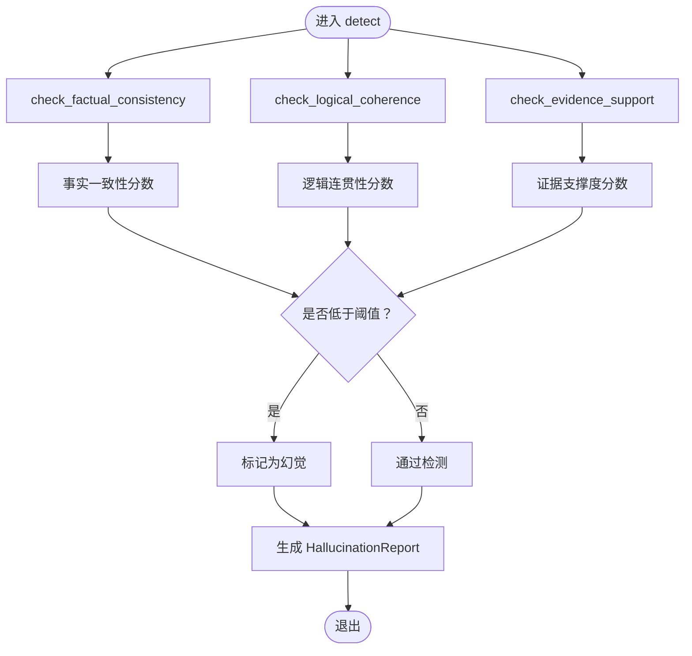
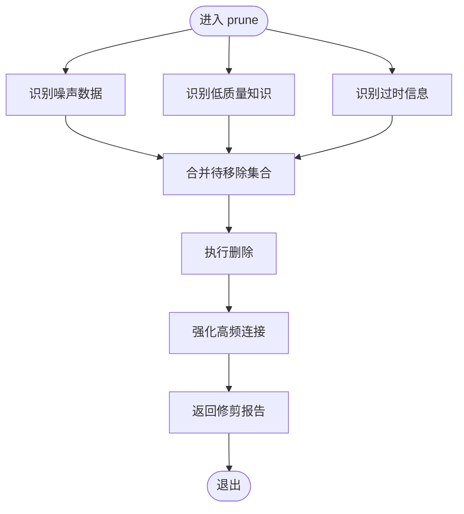
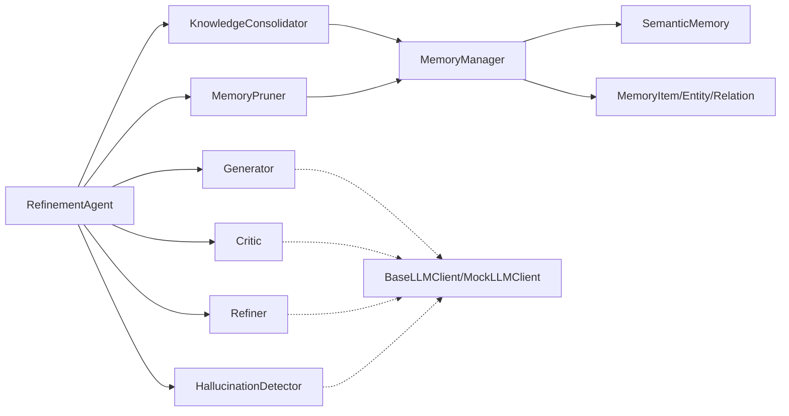

# 精炼代理

<cite>
**本文引用的文件**
- [src/refinement/agent.py](file://src/refinement/agent.py)
- [src/refinement/generator.py](file://src/refinement/generator.py)
- [src/refinement/critic.py](file://src/refinement/critic.py)
- [src/refinement/refiner.py](file://src/refinement/refiner.py)
- [src/refinement/hallucination.py](file://src/refinement/hallucination.py)
- [src/refinement/consolidator.py](file://src/refinement/consolidator.py)
- [src/refinement/pruner.py](file://src/refinement/pruner.py)
- [src/refinement/models.py](file://src/refinement/models.py)
- [src/memory/manager.py](file://src/memory/manager.py)
- [src/memory/semantic_memory.py](file://src/memory/semantic_memory.py)
- [src/memory/models.py](file://src/memory/models.py)
- [src/core/llm/base.py](file://src/core/llm/base.py)
- [src/core/llm/mock.py](file://src/core/llm/mock.py)
- [example/example_usage.py](file://example/example_usage.py)
</cite>

## 目录
1. [简介](#简介)
2. [项目结构](#项目结构)
3. [核心组件](#核心组件)
4. [架构总览](#架构总览)
5. [详细组件分析](#详细组件分析)
6. [依赖关系分析](#依赖关系分析)
7. [性能考量](#性能考量)
8. [故障排查指南](#故障排查指南)
9. [结论](#结论)
10. [附录](#附录)

## 简介
本文件面向“精炼代理”模块，系统化阐述其在异步知识固化、幻觉自检与记忆修剪方面的完整流程与实现细节。精炼代理采用“生成-批判-修正”的三重验证闭环，并结合幻觉检测器进行事实一致性、逻辑连贯性与证据支撑度的综合评估；同时通过知识固化器与记忆修剪器实现知识的持续优化与维护。本文还提供配置参数说明、调优策略、算法实现与评估标准，以及扩展与定制指导。

## 项目结构
精炼代理位于 src/refinement 目录，围绕 RefinementAgent 主类组织各子模块：Generator（答案生成）、Critic（批判评估）、Refiner（答案修正）、HallucinationDetector（幻觉检测）、KnowledgeConsolidator（知识固化）、MemoryPruner（记忆修剪）。上述模块与 MemoryManager、SemanticMemory、LLM 抽象层协同工作，形成从感知编码到记忆存储、检索、精炼与交互的完整链路。

图表来源
- [src/refinement/agent.py:16-151](file://src/refinement/agent.py#L16-L151)
- [src/refinement/generator.py:15-208](file://src/refinement/generator.py#L15-L208)
- [src/refinement/critic.py:9-72](file://src/refinement/critic.py#L9-L72)
- [src/refinement/refiner.py:8-64](file://src/refinement/refiner.py#L8-L64)
- [src/refinement/hallucination.py:9-154](file://src/refinement/hallucination.py#L9-L154)
- [src/refinement/consolidator.py:9-142](file://src/refinement/consolidator.py#L9-L142)
- [src/refinement/pruner.py:10-157](file://src/refinement/pruner.py#L10-L157)
- [src/memory/manager.py:16-186](file://src/memory/manager.py#L16-L186)
- [src/memory/semantic_memory.py:21-179](file://src/memory/semantic_memory.py#L21-L179)
- [src/memory/models.py:12-67](file://src/memory/models.py#L12-L67)
- [src/core/llm/base.py:11-178](file://src/core/llm/base.py#L11-L178)
- [src/core/llm/mock.py:16-313](file://src/core/llm/mock.py#L16-L313)

章节来源
- [src/refinement/agent.py:16-151](file://src/refinement/agent.py#L16-L151)
- [src/refinement/__init__.py:6-25](file://src/refinement/__init__.py#L6-L25)

## 核心组件
- RefinementAgent：主控制器，协调生成、批判、修正、幻觉检测与后台固化/修剪任务。
- Generator：基于检索证据生成答案，支持 LLM 客户端注入与规则回退，内置置信度估算。
- Critic：对答案进行质量评估，产出问题与建议，计算质量分数。
- Refiner：依据批判意见修正答案，调整置信度与引用。
- HallucinationDetector：检测事实一致性、逻辑连贯性与证据支撑度，输出幻觉报告。
- KnowledgeConsolidator：分析查询模式、识别知识缺口、补充与合并知识，异步执行。
- MemoryPruner：识别噪声、低质量与过时记忆，执行修剪并强化高频连接。

章节来源
- [src/refinement/agent.py:16-151](file://src/refinement/agent.py#L16-L151)
- [src/refinement/models.py:9-66](file://src/refinement/models.py#L9-L66)

## 架构总览
精炼代理在“生成-批判-修正-幻觉检测”的闭环基础上，引入“异步知识固化”和“记忆修剪”，形成持续优化的知识体系。其关键流程如下：
- 输入：查询 query、证据 evidence、上下文 context。
- 输出：最终答案 answer、置信度 confidence、引用 citations、迭代次数 iterations、幻觉检测报告。
- 后台：异步运行知识固化与记忆修剪，提升长期知识质量与稳定性。

图表来源
- [src/refinement/agent.py:61-128](file://src/refinement/agent.py#L61-L128)
- [src/refinement/generator.py:67-101](file://src/refinement/generator.py#L67-L101)
- [src/refinement/critic.py:25-71](file://src/refinement/critic.py#L25-L71)
- [src/refinement/refiner.py:24-63](file://src/refinement/refiner.py#L24-L63)
- [src/refinement/hallucination.py:34-75](file://src/refinement/hallucination.py#L34-L75)

## 详细组件分析

### 生成器（Generator）
- 功能要点
  - 基于检索证据生成答案，支持 LLM 客户端注入与规则回退。
  - 通过提示词模板与上下文增强生成质量。
  - 内置置信度估算，综合证据数量、答案长度与关键词覆盖。
- 关键实现
  - 当提供 LLM 客户端时，构造提示词并调用 generate；否则走规则回退。
  - 置信度评估函数综合多项启发式因子，上限控制在合理范围。

图表来源
- [src/refinement/generator.py:67-174](file://src/refinement/generator.py#L67-L174)
- [src/refinement/generator.py:176-208](file://src/refinement/generator.py#L176-L208)

章节来源
- [src/refinement/generator.py:15-208](file://src/refinement/generator.py#L15-L208)

### 批判器（Critic）
- 功能要点
  - 基于证据支撑、置信度阈值与答案完整性进行质量评估。
  - 计算质量分数并给出改进建议。
- 关键实现
  - 若无引用、置信度过低或答案过短，则计入问题并降低质量分数。

章节来源
- [src/refinement/critic.py:9-72](file://src/refinement/critic.py#L9-L72)

### 修正器（Refiner）
- 功能要点
  - 根据批判报告修正答案内容与引用，动态调整置信度。
  - 可选追加补充证据，增强答案可信度。
- 关键实现
  - 质量分数较高时适度提升置信度，否则下调。

章节来源
- [src/refinement/refiner.py:8-64](file://src/refinement/refiner.py#L8-L64)

### 幻觉检测器（HallucinationDetector）
- 功能要点
  - 检测事实一致性、逻辑连贯性与证据支撑度三项指标。
  - 综合阈值判断是否存在幻觉，并列出具体问题。
- 关键实现
  - 事实一致性：基于答案与证据的词集合重叠比例。
  - 逻辑连贯性：基于长度与逻辑连接词存在性。
  - 证据支撑度：基于证据数量的简单计数。

图表来源
- [src/refinement/hallucination.py:34-75](file://src/refinement/hallucination.py#L34-L75)
- [src/refinement/hallucination.py:77-154](file://src/refinement/hallucination.py#L77-L154)

章节来源
- [src/refinement/hallucination.py:9-154](file://src/refinement/hallucination.py#L9-L154)

### 知识固化器（KnowledgeConsolidator）
- 功能要点
  - 分析查询模式、识别知识缺口、补充与合并知识、更新图谱连接。
  - 异步执行，避免阻塞主线程。
- 关键实现
  - 当前为最小实现，预留后续接入查询日志与外部知识源。

章节来源
- [src/refinement/consolidator.py:9-142](file://src/refinement/consolidator.py#L9-L142)

### 记忆修剪器（MemoryPruner）
- 功能要点
  - 识别噪声、低质量与过时记忆，执行删除与强化高频连接。
  - 通过权重与访问次数等指标进行判定。
- 关键实现
  - 噪声：低权重且低访问次数。
  - 低质量：内容过短且权重低。
  - 过时：超过设定天数未访问。
  - 强化：高频访问记忆权重提升。

图表来源
- [src/refinement/pruner.py:41-69](file://src/refinement/pruner.py#L41-L69)
- [src/refinement/pruner.py:71-157](file://src/refinement/pruner.py#L71-L157)

章节来源
- [src/refinement/pruner.py:10-157](file://src/refinement/pruner.py#L10-L157)

### 精炼代理（RefinementAgent）
- 功能要点
  - 协调生成、批判、修正与幻觉检测，达到验证通过即返回。
  - 若多次迭代仍未通过，按最低置信度阈值决定返回兜底答案。
  - 提供后台任务：异步运行知识固化与记忆修剪。
- 关键实现
  - 迭代终止条件：通过验证或达到最大迭代次数。
  - 幻觉发生时降低置信度，引导进一步修正。

章节来源
- [src/refinement/agent.py:16-151](file://src/refinement/agent.py#L16-L151)

## 依赖关系分析
- 组件耦合
  - RefinementAgent 依赖 Generator、Critic、Refiner、HallucinationDetector、KnowledgeConsolidator、MemoryPruner。
  - 知识固化与记忆修剪依赖 MemoryManager 与 SemanticMemory。
  - 生成与评估可注入 LLM 客户端，支持 Mock 实现以便测试。
- 外部依赖
  - LLM 抽象接口与 Mock 实现解耦具体模型提供商。
  - 记忆层通过 MemoryManager 统一管理三层记忆，支持向量检索与图谱实体关系。

图表来源
- [src/refinement/agent.py:48-59](file://src/refinement/agent.py#L48-L59)
- [src/refinement/consolidator.py:32-33](file://src/refinement/consolidator.py#L32-L33)
- [src/refinement/pruner.py:36-39](file://src/refinement/pruner.py#L36-L39)
- [src/memory/manager.py:40-43](file://src/memory/manager.py#L40-L43)
- [src/memory/semantic_memory.py:46-48](file://src/memory/semantic_memory.py#L46-L48)
- [src/core/llm/base.py:11-178](file://src/core/llm/base.py#L11-L178)
- [src/core/llm/mock.py:16-313](file://src/core/llm/mock.py#L16-L313)

章节来源
- [src/refinement/agent.py:48-59](file://src/refinement/agent.py#L48-L59)
- [src/memory/manager.py:40-43](file://src/memory/manager.py#L40-L43)

## 性能考量
- 生成阶段
  - 控制最大证据数量与温度参数，平衡生成多样性与稳定性。
  - 置信度估算避免过度乐观，减少后续迭代次数。
- 评估与修正
  - 批判评估与修正应尽量聚焦关键问题，避免过度修改导致信息丢失。
- 幻觉检测
  - 事实一致性与证据支撑度可结合更细粒度的语义匹配与外部知识库交叉验证。
- 记忆修剪
  - 噪声与过时阈值需结合业务场景调优，防止误删有效知识。
- 异步固化
  - 知识固化周期与批量大小需权衡资源占用与效果收敛速度。

## 故障排查指南
- 生成为空或置信度为 0
  - 检查证据是否为空或数量过少。
  - 确认 LLM 客户端是否正确注入，或 Mock 是否正常工作。
- 批判频繁指出“答案过短”
  - 增加最大证据数量或调整温度参数，鼓励更详细回答。
- 幻觉检测频繁触发
  - 提升证据支撑度阈值或增加证据数量。
  - 对事实一致性检测进行更严格的语义对齐。
- 迭代次数过多仍不通过
  - 适当提高最低置信度阈值或缩短最大迭代次数，避免无限循环。
- 后台固化/修剪未生效
  - 确认 MemoryManager 初始化与知识存储是否正常。
  - 检查修剪阈值设置是否过于严格。

章节来源
- [src/refinement/generator.py:84-90](file://src/refinement/generator.py#L84-L90)
- [src/refinement/critic.py:45-58](file://src/refinement/critic.py#L45-L58)
- [src/refinement/hallucination.py:54-58](file://src/refinement/hallucination.py#L54-L58)
- [src/refinement/agent.py:120-128](file://src/refinement/agent.py#L120-L128)
- [src/refinement/pruner.py:36-39](file://src/refinement/pruner.py#L36-L39)

## 结论
精炼代理通过“生成-批判-修正-幻觉检测”的闭环与“异步知识固化+记忆修剪”的持续优化，实现了高质量、可验证、可持续演进的知识处理流程。建议在生产环境中逐步完善各检测与评估模块的算法实现，并结合业务数据调优阈值与参数，以获得更稳定的效果。

## 附录

### 配置参数与调优策略
- RefinementAgent
  - llm_model：LLM 模型名称或标识。
  - memory：MemoryManager 实例，启用知识固化与修剪。
  - max_iterations：最大迭代次数，建议 2–5。
  - min_confidence：最低置信度阈值，建议 0.6–0.8。
- Generator
  - max_evidence：最大使用证据数量，建议 3–10。
  - temperature：生成温度，建议 0.7 左右。
- HallucinationDetector
  - fact_threshold：事实一致性阈值，建议 0.6–0.8。
  - support_threshold：证据支撑度阈值，建议 0.4–0.6。
- MemoryPruner
  - noise_threshold：噪声判定阈值，建议 0.1–0.3。
  - quality_threshold：质量判定阈值，建议 0.2–0.4。
  - outdated_days：过时天数判定，建议 30–120。
- KnowledgeConsolidator
  - min_query_frequency：最小查询频率阈值，建议 3–10。

章节来源
- [src/refinement/agent.py:27-46](file://src/refinement/agent.py#L27-L46)
- [src/refinement/generator.py:25-41](file://src/refinement/generator.py#L25-L41)
- [src/refinement/hallucination.py:19-32](file://src/refinement/hallucination.py#L19-L32)
- [src/refinement/pruner.py:20-39](file://src/refinement/pruner.py#L20-L39)
- [src/refinement/consolidator.py:20-33](file://src/refinement/consolidator.py#L20-L33)

### 幻觉检测算法与评估标准
- 事实一致性：答案与证据的词集合重叠比例，越接近 1 越可靠。
- 逻辑连贯性：基于答案长度与逻辑连接词存在性，衡量推理链条连贯程度。
- 证据支撑度：基于证据数量的简单计数，证据越多通常越可靠。
- 综合判定：任一关键指标低于阈值即视为存在幻觉。

章节来源
- [src/refinement/hallucination.py:34-75](file://src/refinement/hallucination.py#L34-L75)
- [src/refinement/hallucination.py:77-154](file://src/refinement/hallucination.py#L77-L154)

### 知识固化与记忆修剪的决策逻辑
- 知识固化
  - 分析查询模式与命中率，识别高频未命中查询作为知识缺口。
  - 异步补充与合并碎片知识，更新图谱连接。
- 记忆修剪
  - 噪声：低权重且低访问次数。
  - 低质量：内容过短且权重低。
  - 过时：超过设定天数未访问。
  - 强化：高频访问记忆权重提升，保持知识活力。

章节来源
- [src/refinement/consolidator.py:35-61](file://src/refinement/consolidator.py#L35-L61)
- [src/refinement/pruner.py:41-69](file://src/refinement/pruner.py#L41-L69)
- [src/refinement/pruner.py:71-157](file://src/refinement/pruner.py#L71-L157)

### 开发者扩展与定制指导
- 扩展生成策略
  - 在 Generator 中增加更多提示词模板与上下文融合策略。
  - 引入外部知识库进行交叉验证，提升事实一致性。
- 完善批判评估
  - 基于 LLM 的质量评估替代现有启发式规则，提升判别能力。
- 增强修正能力
  - 引入检索增强的补充证据与结构化提示，指导 Refiner 更精准修正。
- 优化幻觉检测
  - 使用语义相似度、外部知识库比对与逻辑推理引擎，提升检测精度。
- 完善知识固化
  - 接入查询日志分析、自动问答对生成与外部知识源补充。
- 丰富记忆修剪
  - 引入更精细的权重衰减模型与图谱强度计算，提升修剪效果。

章节来源
- [src/refinement/generator.py:51-65](file://src/refinement/generator.py#L51-L65)
- [src/refinement/critic.py:40-41](file://src/refinement/critic.py#L40-L41)
- [src/refinement/refiner.py:41-42](file://src/refinement/refiner.py#L41-L42)
- [src/refinement/hallucination.py:92-93](file://src/refinement/hallucination.py#L92-L93)
- [src/refinement/consolidator.py:70-73](file://src/refinement/consolidator.py#L70-L73)
- [src/refinement/consolidator.py:104-117](file://src/refinement/consolidator.py#L104-L117)

### 使用示例参考
- 完整工作流示例展示了从感知编码、记忆存储与检索，到精炼代理与交互响应的全流程。

章节来源
- [example/example_usage.py:139-173](file://example/example_usage.py#L139-L173)