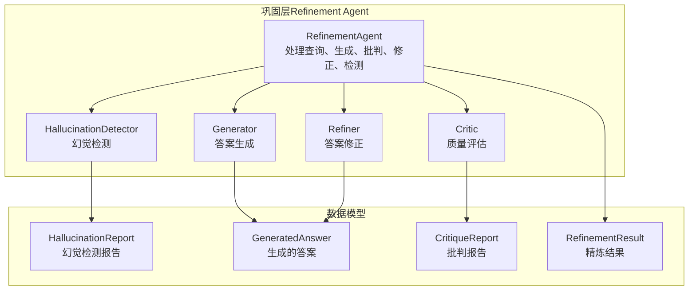
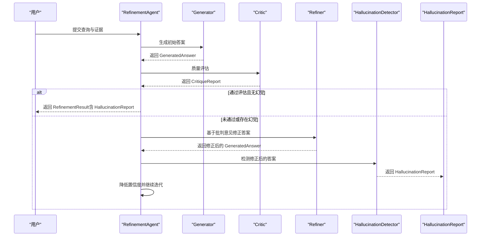
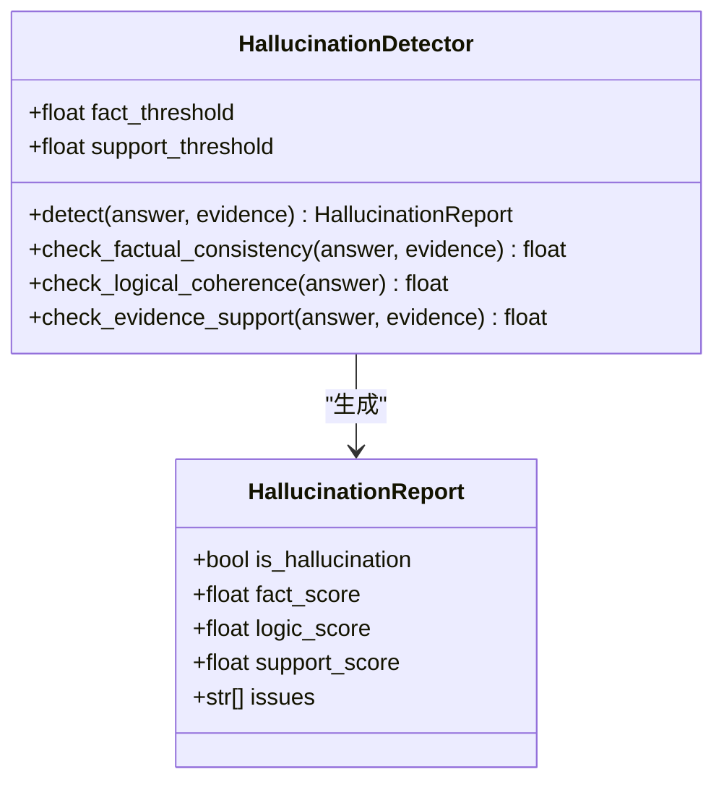
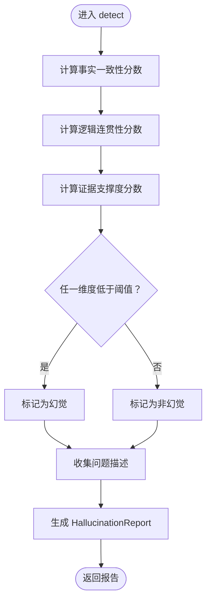
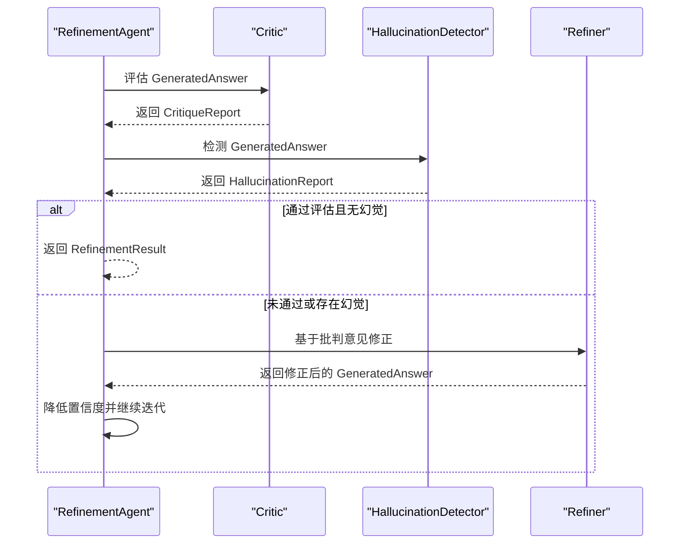
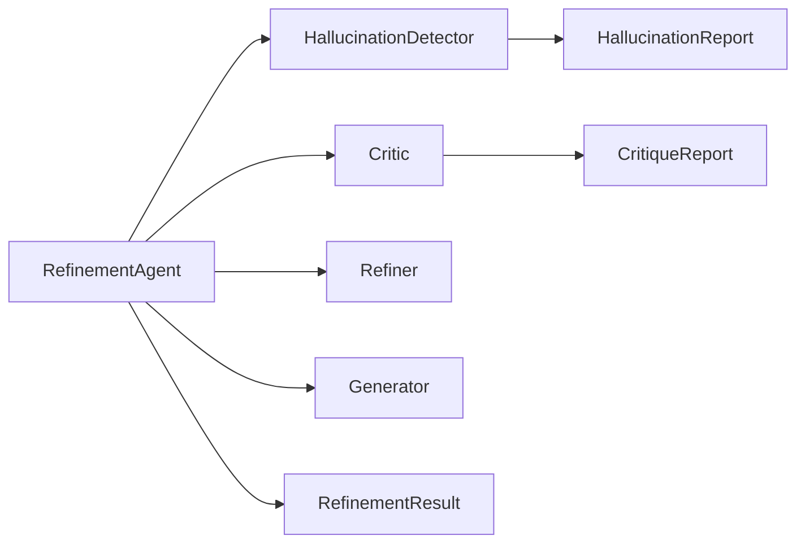

# 幻觉检测器

<cite>
**本文引用的文件**
- [src/refinement/hallucination.py](file://src/refinement/hallucination.py)
- [src/refinement/models.py](file://src/refinement/models.py)
- [src/refinement/agent.py](file://src/refinement/agent.py)
- [src/refinement/critic.py](file://src/refinement/critic.py)
- [src/refinement/generator.py](file://src/refinement/generator.py)
- [src/refinement/refiner.py](file://src/refinement/refiner.py)
- [src/core/base.py](file://src/core/base.py)
- [example/example_usage.py](file://example/example_usage.py)
- [README.md](file://README.md)
</cite>

## 目录
1. [简介](#简介)
2. [项目结构](#项目结构)
3. [核心组件](#核心组件)
4. [架构总览](#架构总览)
5. [详细组件分析](#详细组件分析)
6. [依赖关系分析](#依赖关系分析)
7. [性能考量](#性能考量)
8. [故障排查指南](#故障排查指南)
9. [结论](#结论)
10. [附录](#附录)

## 简介
本文件面向开发者与使用者，系统化阐述 NecoRAG 巩固层中的幻觉检测器组件（HallucinationDetector）。文档聚焦以下目标：
- 深入解释 HallucinationDetector 的检测算法与判断机制，涵盖事实一致性、逻辑连贯性与证据支撑度三个维度。
- 说明检测报告的数据结构与结果解释方法。
- 提供检测精度优化与误报控制的实践建议。
- 介绍不同类型的幻觉识别策略与可配置项。
- 给出扩展检测算法与定制验证规则的开发指导。

## 项目结构
与幻觉检测器直接相关的模块位于“巩固层”（Refinement Agent）与“数据模型”层，同时与生成器、批判器、精炼器共同构成“生成-批判-修正-检测”的闭环。

图表来源
- [src/refinement/agent.py:16-128](file://src/refinement/agent.py#L16-L128)
- [src/refinement/hallucination.py:9-75](file://src/refinement/hallucination.py#L9-L75)
- [src/refinement/models.py:9-46](file://src/refinement/models.py#L9-L46)

章节来源
- [src/refinement/agent.py:16-128](file://src/refinement/agent.py#L16-L128)
- [src/refinement/hallucination.py:9-75](file://src/refinement/hallucination.py#L9-L75)
- [src/refinement/models.py:9-46](file://src/refinement/models.py#L9-L46)

## 核心组件
- HallucinationDetector：负责对生成答案进行事实一致性、逻辑连贯性与证据支撑度的评分与判定，并输出 HallucinationReport。
- HallucinationReport：承载检测结果，包含是否幻觉、三项评分与问题清单。
- RefinementAgent：在生成-批判-修正闭环中调用 HallucinationDetector，并据此调整答案置信度与迭代策略。
- GeneratedAnswer/CritiqueReport/RefinementResult：作为输入输出数据载体，支撑检测与后续流程。

章节来源
- [src/refinement/hallucination.py:9-75](file://src/refinement/hallucination.py#L9-L75)
- [src/refinement/models.py:9-46](file://src/refinement/models.py#L9-L46)
- [src/refinement/agent.py:61-128](file://src/refinement/agent.py#L61-L128)

## 架构总览
幻觉检测器在“生成-批判-修正-检测”闭环中的位置如下：

图表来源
- [src/refinement/agent.py:61-128](file://src/refinement/agent.py#L61-L128)
- [src/refinement/hallucination.py:34-75](file://src/refinement/hallucination.py#L34-L75)
- [src/refinement/critic.py:25-71](file://src/refinement/critic.py#L25-L71)
- [src/refinement/refiner.py:24-63](file://src/refinement/refiner.py#L24-L63)

## 详细组件分析

### HallucinationDetector 类
- 角色定位：对生成答案进行三维度评分与综合判定，输出是否幻觉及具体问题。
- 关键阈值：
  - 事实一致性阈值（fact_threshold，默认 0.7）
  - 证据支撑度阈值（support_threshold，默认 0.5）
- 评分维度：
  - 事实一致性：基于答案与证据的关键词重叠比例，衡量“是否与证据一致”。
  - 逻辑连贯性：基于答案长度与逻辑连接词，衡量“是否具备推理连贯性”。
  - 证据支撑度：基于证据数量，衡量“是否有足够证据支撑”。
- 判定规则：只要任一维度低于阈值，即判定为“存在幻觉”，并收集相应问题描述。

图表来源
- [src/refinement/hallucination.py:9-75](file://src/refinement/hallucination.py#L9-L75)
- [src/refinement/models.py:9-16](file://src/refinement/models.py#L9-L16)

章节来源
- [src/refinement/hallucination.py:19-75](file://src/refinement/hallucination.py#L19-L75)
- [src/refinement/models.py:9-16](file://src/refinement/models.py#L9-L16)

### HallucinationReport 数据结构
- 字段说明：
  - is_hallucination：是否被判定为幻觉。
  - fact_score：事实一致性评分（0-1）。
  - logic_score：逻辑连贯性评分（0-1）。
  - support_score：证据支撑度评分（0-1）。
  - issues：问题列表，包含“事实一致性较低”“逻辑连贯性不足”“证据支撑度不足”等。
- 使用场景：由 RefinementAgent 将 HallucinationReport 作为 RefinementResult 的一部分返回给上层。

章节来源
- [src/refinement/models.py:9-16](file://src/refinement/models.py#L9-L16)
- [src/refinement/agent.py:99-106](file://src/refinement/agent.py#L99-L106)

### 检测算法与判断机制
- 事实一致性（check_factual_consistency）
  - 当前实现：以答案与证据的关键词集合重叠比例作为评分；无证据时返回 0.0。
  - 优化方向：引入语义相似度、实体对齐、抽取式验证等。
- 逻辑连贯性（check_logical_coherence）
  - 当前实现：基于答案长度与逻辑连接词出现与否进行二分类评分；无证据时返回 0.3。
  - 优化方向：引入句法/语义分析、推理链完整性检查。
- 证据支撑度（check_evidence_support）
  - 当前实现：基于证据数量的线性映射（最多 5 条证据），超过上限按 1.0 截断。
  - 优化方向：考虑证据质量、相关性、多样性与覆盖度。

图表来源
- [src/refinement/hallucination.py:34-75](file://src/refinement/hallucination.py#L34-L75)

章节来源
- [src/refinement/hallucination.py:77-153](file://src/refinement/hallucination.py#L77-L153)

### 与 RefinementAgent 的集成
- RefinementAgent 在每次迭代中先进行批判评估，再进行幻觉检测，最后根据结果决定是否修正答案与降低置信度。
- 若检测到幻觉，会将答案置信度按固定比例下调，以促使后续迭代修正。

图表来源
- [src/refinement/agent.py:84-128](file://src/refinement/agent.py#L84-L128)
- [src/refinement/critic.py:25-71](file://src/refinement/critic.py#L25-L71)
- [src/refinement/hallucination.py:34-75](file://src/refinement/hallucination.py#L34-L75)
- [src/refinement/refiner.py:24-63](file://src/refinement/refiner.py#L24-L63)

章节来源
- [src/refinement/agent.py:61-128](file://src/refinement/agent.py#L61-L128)

### 评估标准与结果解释
- 评估标准（阈值与评分）：
  - 事实一致性阈值：默认 0.7，越低越容易触发“事实一致性较低”问题。
  - 证据支撑度阈值：默认 0.5，越低越容易触发“证据支撑度不足”问题。
  - 逻辑连贯性阈值：当前硬编码为 0.6，用于判定“逻辑连贯性不足”。
- 结果解释：
  - is_hallucination 为真：至少一项指标不达标，需要进一步修正。
  - issues 列表：列出具体问题类别，便于定位与修复。
  - 三项评分：用于诊断问题来源（例如事实不一致可能源于证据不足或表述冲突）。

章节来源
- [src/refinement/hallucination.py:19-75](file://src/refinement/hallucination.py#L19-L75)
- [src/refinement/models.py:9-16](file://src/refinement/models.py#L9-L16)

### 不同类型的幻觉识别策略与配置选项
- 事实性幻觉：答案与证据矛盾或存在事实错误。可通过提升证据质量、增加证据数量、引入语义对齐与抽取式验证来缓解。
- 逻辑性幻觉：推理链条断裂或前后矛盾。可通过引入句法/语义分析、约束生成模板、增加上下文引导等方式改善。
- 来源性幻觉：无证据支撑的断言或臆测。可通过强制引用证据、限制生成范围、提高证据支撑度阈值来控制。

配置选项（当前可用）：
- HallucinationDetector 初始化参数：
  - fact_threshold：事实一致性阈值（默认 0.7）
  - support_threshold：证据支撑度阈值（默认 0.5）
- RefinementAgent 迭代控制：
  - max_iterations：最大迭代次数（默认 3）
  - min_confidence：最低置信度阈值（默认 0.7）

章节来源
- [src/refinement/hallucination.py:19-32](file://src/refinement/hallucination.py#L19-L32)
- [src/refinement/agent.py:27-46](file://src/refinement/agent.py#L27-L46)
- [README.md:290-329](file://README.md#L290-L329)

### 开发者扩展与定制指导
- 扩展检测算法：
  - 新增维度：在 HallucinationDetector 中新增评分方法，并在 detect 中纳入综合判定。
  - 替换现有实现：将当前基于关键词/长度/数量的启发式替换为基于 LLM 的语义验证、事实核查 API 或外部 KBQA。
- 定制验证规则：
  - 通过调整阈值（fact_threshold、support_threshold）与逻辑阈值（如逻辑连贯性阈值）实现策略切换。
  - 在 RefinementAgent 中根据 HallucinationReport 的 issues 选择性地触发特定修正策略。
- 抽象基类参考：
  - 可参考抽象基类 BaseHallucinationDetector 的接口设计，实现符合统一规范的自定义检测器。

章节来源
- [src/core/base.py:437-456](file://src/core/base.py#L437-L456)
- [src/refinement/hallucination.py:9-75](file://src/refinement/hallucination.py#L9-L75)

## 依赖关系分析
- HallucinationDetector 依赖 HallucinationReport 数据模型。
- RefinementAgent 依赖 HallucinationDetector、Critic、Refiner、Generator 以及 HallucinationReport/RefinementResult。
- HallucinationDetector 与 RefinementAgent 的耦合主要体现在 detect 调用与结果消费。

图表来源
- [src/refinement/hallucination.py](file://src/refinement/hallucination.py#L6)
- [src/refinement/models.py:9-46](file://src/refinement/models.py#L9-L46)
- [src/refinement/agent.py:10-13](file://src/refinement/agent.py#L10-L13)

章节来源
- [src/refinement/hallucination.py](file://src/refinement/hallucination.py#L6)
- [src/refinement/models.py:9-46](file://src/refinement/models.py#L9-L46)
- [src/refinement/agent.py:10-13](file://src/refinement/agent.py#L10-L13)

## 性能考量
- 当前实现为启发式规则，计算开销极低，适合大规模批处理。
- 若引入 LLM 验证或外部 API，需关注延迟与成本，建议：
  - 对高频低风险场景保留启发式规则。
  - 对高风险场景引入轻量级 LLM 或本地模型进行验证。
  - 使用缓存与批量请求减少外部调用次数。
- 证据数量与关键词重叠的计算复杂度较低，但若证据规模较大，可考虑分片与并行处理。

## 故障排查指南
- 常见问题与定位：
  - “事实一致性较低”：检查证据质量与数量，确认答案是否过度泛化或臆测。
  - “逻辑连贯性不足”：检查答案长度与逻辑连接词，必要时引导生成模板。
  - “证据支撑度不足”：增加检索证据数量或提升检索质量。
- 误报控制建议：
  - 提升 support_threshold 与 fact_threshold，降低误报但可能提高漏报。
  - 在 RefinementAgent 中结合 CritiqueReport 与 HallucinationReport 的综合信号进行决策。
- 结果解读：
  - 通过 RefinementResult.hallucination_report.issues 快速定位问题类型。
  - 若多次迭代仍存在幻觉，考虑引入更强的验证策略或外部事实核查服务。

章节来源
- [src/refinement/hallucination.py:54-75](file://src/refinement/hallucination.py#L54-L75)
- [src/refinement/agent.py:96-128](file://src/refinement/agent.py#L96-L128)

## 结论
HallucinationDetector 当前以启发式规则为核心，提供三维度评分与快速判定，满足快速迭代与低成本部署的需求。随着业务复杂度提升，建议逐步引入语义验证、事实核查与外部 KBQA，配合 RefinementAgent 的闭环机制，持续优化幻觉检测的准确性与鲁棒性。

## 附录
- 使用示例中展示了如何获取并解读 HallucinationReport：
  - 示例代码中打印了事实一致性、证据支撑度等关键指标，便于开发者理解报告字段含义与使用方式。

章节来源
- [example/example_usage.py:167-173](file://example/example_usage.py#L167-L173)