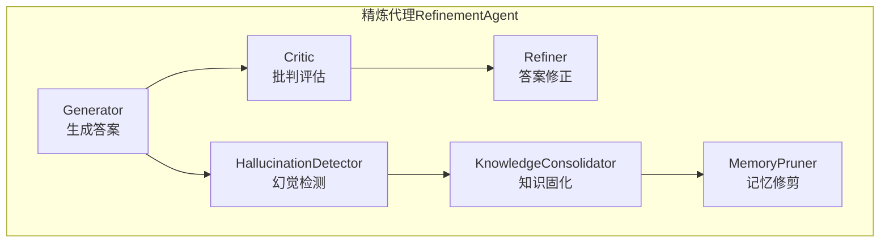
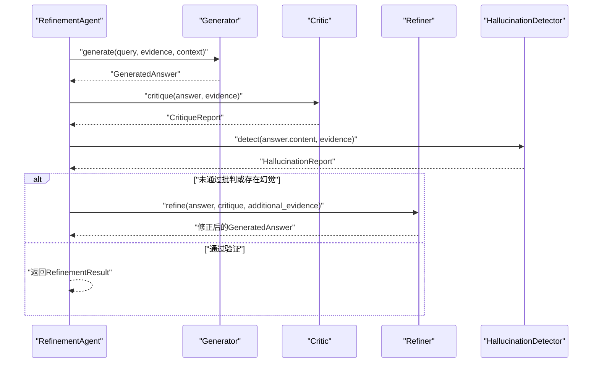
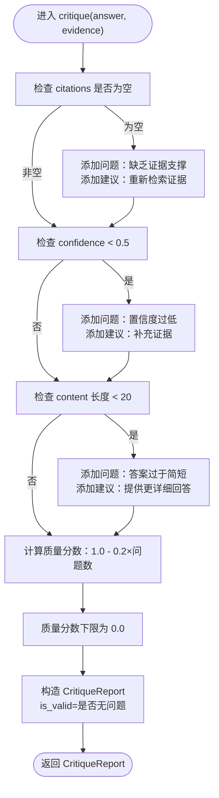
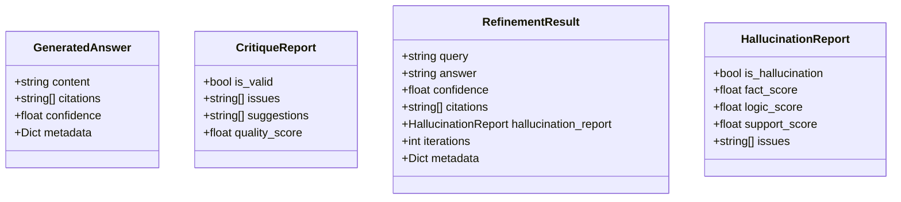
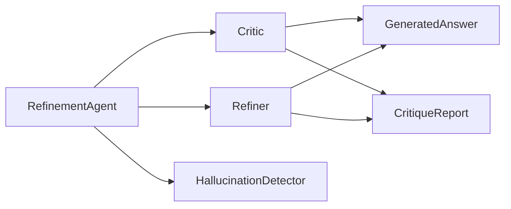

# 批判评估器

<cite>
**本文引用的文件**
- [src/refinement/critic.py](file://src/refinement/critic.py)
- [src/refinement/models.py](file://src/refinement/models.py)
- [src/refinement/agent.py](file://src/refinement/agent.py)
- [src/refinement/refiner.py](file://src/refinement/refiner.py)
- [src/refinement/hallucination.py](file://src/refinement/hallucination.py)
- [example/example_usage.py](file://example/example_usage.py)
- [README.md](file://README.md)
</cite>

## 目录
1. [简介](#简介)
2. [项目结构](#项目结构)
3. [核心组件](#核心组件)
4. [架构总览](#架构总览)
5. [详细组件分析](#详细组件分析)
6. [依赖分析](#依赖分析)
7. [性能考虑](#性能考虑)
8. [故障排查指南](#故障排查指南)
9. [结论](#结论)
10. [附录](#附录)

## 简介
本文件面向“批判评估器”组件，聚焦于Critic类的验证机制与评估标准，系统阐述答案有效性检查与逻辑一致性验证的实现思路；解释批判评估的算法与评分机制；说明critique结果的数据结构与判断逻辑；给出评估标准的配置选项与自定义策略；并提供性能优化与准确性提升方法，以及扩展评估规则与定制验证逻辑的实践指导。

## 项目结构
批判评估器位于精炼代理（Refinement Agent）的“巩固层”，与生成器（Generator）、修正器（Refiner）、幻觉检测器（HallucinationDetector）共同构成“生成-批判-修正”的闭环。Critic负责对GeneratedAnswer进行质量评估，并输出CritiqueReport用于后续决策。

图表来源
- [src/refinement/agent.py:16-151](file://src/refinement/agent.py#L16-L151)
- [src/refinement/critic.py:9-72](file://src/refinement/critic.py#L9-L72)
- [src/refinement/refiner.py:8-64](file://src/refinement/refiner.py#L8-L64)
- [src/refinement/hallucination.py:9-154](file://src/refinement/hallucination.py#L9-L154)

章节来源
- [src/refinement/agent.py:16-151](file://src/refinement/agent.py#L16-L151)
- [README.md:290-329](file://README.md#L290-L329)

## 核心组件
- Critic：对GeneratedAnswer进行质量评估，输出CritiqueReport，包含问题列表、改进建议、质量评分与有效性标记。
- GeneratedAnswer：封装内容、引用证据ID、置信度与元数据。
- CritiqueReport：封装评估结果，包括是否有效、问题、建议、质量评分。
- RefinementAgent：协调生成、批判、修正与幻觉检测，控制迭代与收敛条件。
- HallucinationDetector：独立的幻觉检测模块，提供事实一致性、逻辑连贯性、证据支撑度等指标。
- Refiner：根据批判报告与可选补充证据对答案进行修正与置信度调整。

章节来源
- [src/refinement/critic.py:9-72](file://src/refinement/critic.py#L9-L72)
- [src/refinement/models.py:19-35](file://src/refinement/models.py#L19-L35)
- [src/refinement/agent.py:16-151](file://src/refinement/agent.py#L16-L151)
- [src/refinement/hallucination.py:9-154](file://src/refinement/hallucination.py#L9-L154)
- [src/refinement/refiner.py:8-64](file://src/refinement/refiner.py#L8-L64)

## 架构总览
批判评估器在精炼代理中的调用序列如下：RefinementAgent先生成答案，再由Critic进行质量评估，若未通过则由Refiner进行修正，同时HallucinationDetector对答案进行幻觉检测，最终根据综合结果决定是否继续迭代或返回结果。

图表来源
- [src/refinement/agent.py:61-128](file://src/refinement/agent.py#L61-L128)
- [src/refinement/critic.py:25-71](file://src/refinement/critic.py#L25-L71)
- [src/refinement/refiner.py:24-63](file://src/refinement/refiner.py#L24-L63)
- [src/refinement/hallucination.py:34-75](file://src/refinement/hallucination.py#L34-L75)

## 详细组件分析

### Critic类：验证机制与评估标准
- 输入输出
  - 输入：GeneratedAnswer（包含content、citations、confidence、metadata），证据列表evidence。
  - 输出：CritiqueReport（is_valid、issues、suggestions、quality_score）。
- 验证机制
  - 证据支撑检查：若answer.citations为空，则记录“答案缺乏证据支撑”，并建议“重新检索相关证据”。
  - 置信度检查：若answer.confidence低于阈值（默认0.5），记录“答案置信度过低”，并建议“补充更多证据”。
  - 完整性检查：若answer.content长度小于阈值（默认20字符），记录“答案过于简短”，并建议“提供更详细的回答”。
- 评分机制
  - 初始质量分数为1.0；
  - 每发现一个问题，质量分数减少0.2×问题数量；
  - 最终质量分数不低于0.0；
  - 若无问题，is_valid为True，否则为False。
- 适用场景
  - 作为快速质量门禁，过滤明显低质量答案；
  - 为后续修正提供问题清单与建议方向。

图表来源
- [src/refinement/critic.py:25-71](file://src/refinement/critic.py#L25-L71)

章节来源
- [src/refinement/critic.py:9-72](file://src/refinement/critic.py#L9-L72)
- [src/refinement/models.py:29-35](file://src/refinement/models.py#L29-L35)

### 评估结果数据结构与判断逻辑
- GeneratedAnswer
  - 字段：content、citations、confidence、metadata。
  - 作用：承载生成阶段的产物，供Critic与Refiner消费。
- CritiqueReport
  - 字段：is_valid、issues、suggestions、quality_score。
  - 判断逻辑：is_valid取决于问题数量；quality_score用于衡量整体质量，辅助Refiner调整置信度。
- RefinementResult（Agent返回）
  - 字段：query、answer、confidence、citations、hallucination_report、iterations、metadata。
  - 作用：封装一次迭代过程的最终产出，便于上层交互层使用。

图表来源
- [src/refinement/models.py:19-66](file://src/refinement/models.py#L19-L66)

章节来源
- [src/refinement/models.py:19-66](file://src/refinement/models.py#L19-L66)

### 与Refiner的协作与评分机制
- 当Critic返回的quality_score较高时，Refiner会适度提升置信度；反之则降低置信度，以反映质量变化。
- Refiner还可追加additional_evidence，扩展答案内容并更新citations，同时在metadata中标记refined与问题数量，便于溯源与审计。

章节来源
- [src/refinement/refiner.py:24-63](file://src/refinement/refiner.py#L24-L63)

### 与HallucinationDetector的协同
- HallucinationDetector独立运行，提供事实一致性、逻辑连贯性、证据支撑度三个维度的分数与问题列表。
- RefinementAgent在每次迭代中同时调用Critic与HallucinationDetector，仅当两者均通过时才认为答案合格。

章节来源
- [src/refinement/hallucination.py:34-75](file://src/refinement/hallucination.py#L34-L75)
- [src/refinement/agent.py:84-118](file://src/refinement/agent.py#L84-L118)

### 在精炼代理中的工作流
- RefinementAgent初始化各子组件（Generator、Critic、Refiner、HallucinationDetector），并在process循环中：
  - 生成答案；
  - 批判评估；
  - 幻觉检测；
  - 若未通过，调用Refiner进行修正；
  - 达到最大迭代次数或满足收敛条件后返回结果。

章节来源
- [src/refinement/agent.py:27-128](file://src/refinement/agent.py#L27-L128)

## 依赖分析
- 组件耦合
  - Critic依赖GeneratedAnswer与CritiqueReport；
  - Refiner依赖GeneratedAnswer与CritiqueReport；
  - RefinementAgent依赖Critic、Refiner、HallucinationDetector；
  - HallucinationDetector独立，不依赖Critic。
- 外部依赖
  - 当前实现为最小可用版本，部分检测逻辑标注TODO，未来可替换为LLM驱动的更精确评估。
- 循环依赖
  - 无直接循环依赖，调用方向清晰。

图表来源
- [src/refinement/critic.py:5-6](file://src/refinement/critic.py#L5-L6)
- [src/refinement/refiner.py](file://src/refinement/refiner.py#L5)
- [src/refinement/agent.py:5-13](file://src/refinement/agent.py#L5-L13)

章节来源
- [src/refinement/critic.py:5-6](file://src/refinement/critic.py#L5-L6)
- [src/refinement/refiner.py](file://src/refinement/refiner.py#L5)
- [src/refinement/agent.py:5-13](file://src/refinement/agent.py#L5-L13)

## 性能考虑
- 评估复杂度
  - 当前Critic的检查为常数时间操作（字符串长度、列表长度、数值比较），整体O(1)。
  - HallucinationDetector的最小实现为线性时间（按词集合并与重叠计算），对证据规模敏感。
- 优化建议
  - 将证据预处理为词集缓存，避免重复计算；
  - 对证据数量较多时，采用采样或阈值裁剪；
  - 将TODO项替换为轻量级规则引擎或嵌入相似度计算，减少LLM调用成本；
  - 在Refiner中引入增量修正策略，避免全量重写。
- 准确性提升
  - 引入多粒度证据匹配（如实体级、语义级）；
  - 结合上下文一致性与跨句逻辑连贯性；
  - 使用对比学习或提示工程优化LLM驱动的评估。

[本节为通用性能讨论，无需具体文件分析]

## 故障排查指南
- 常见问题
  - 答案频繁被判定为“缺乏证据支撑”：检查证据检索是否正确传递给Critic。
  - 置信度始终偏低：确认Refiner是否正确调整置信度，或考虑提高Critic阈值。
  - 答案过短：增加证据或引导生成器输出更详细内容。
  - 幻觉误报/漏报：调整HallucinationDetector的阈值或扩展检测逻辑。
- 定位方法
  - 通过RefinementResult的iterations与metadata定位迭代过程；
  - 在示例中观察幻觉检测报告的fact_score、logic_score、support_score，辅助诊断。

章节来源
- [src/refinement/agent.py:96-128](file://src/refinement/agent.py#L96-L128)
- [src/refinement/hallucination.py:19-32](file://src/refinement/hallucination.py#L19-L32)
- [example/example_usage.py:139-173](file://example/example_usage.py#L139-L173)

## 结论
Critic作为精炼代理中的质量门禁，提供了简洁高效的验证与评分机制。其当前实现以启发式规则为主，具备良好的可读性与可扩展性。建议在保持现有接口不变的前提下，逐步引入LLM驱动的评估与更精细的证据匹配策略，以进一步提升准确性与鲁棒性。

[本节为总结性内容，无需具体文件分析]

## 附录

### 评估标准配置与自定义策略
- Critic阈值
  - citations为空、confidence阈值、content长度阈值均可在Critic初始化时传参（当前实现为硬编码，建议扩展为可配置参数）。
- HallucinationDetector阈值
  - fact_threshold、support_threshold可在初始化时设置，默认值见源码。
- Refiner行为
  - 置信度调整幅度与metadata标记可按需修改，以满足不同业务场景。

章节来源
- [src/refinement/critic.py](file://src/refinement/critic.py#L16)
- [src/refinement/hallucination.py:19-32](file://src/refinement/hallucination.py#L19-L32)
- [src/refinement/refiner.py:15-22](file://src/refinement/refiner.py#L15-L22)

### 扩展评估规则与定制验证逻辑
- 建议步骤
  - 在Critic中新增规则（如实体一致性、引用格式规范、术语使用规范）；
  - 引入规则引擎或提示模板，将评估逻辑模块化；
  - 将HallucinationDetector的最小实现替换为基于LLM的多维度打分；
  - 在Refiner中引入“证据优先级排序”与“上下文一致性修正”策略。
- 接口兼容性
  - 保持GeneratedAnswer、CritiqueReport、RefinementResult的字段稳定，确保与Agent的调用链兼容。

章节来源
- [src/refinement/critic.py](file://src/refinement/critic.py#L40)
- [src/refinement/hallucination.py:92-147](file://src/refinement/hallucination.py#L92-L147)
- [src/refinement/refiner.py](file://src/refinement/refiner.py#L41)