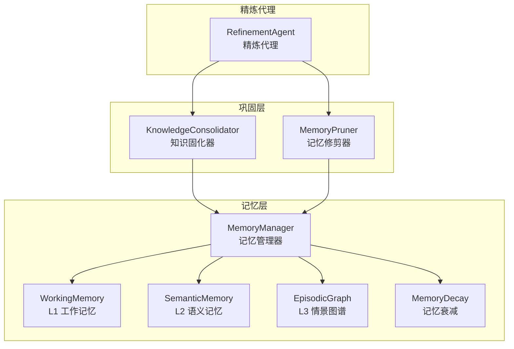
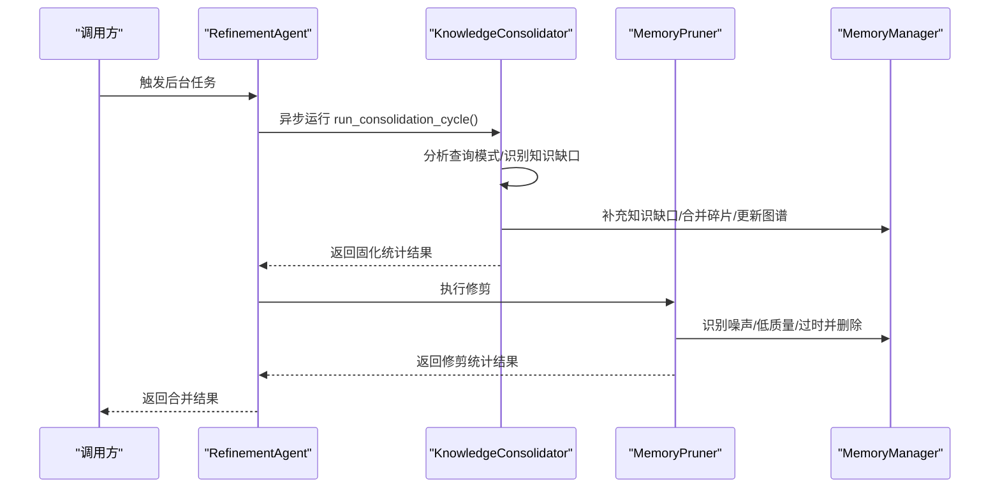
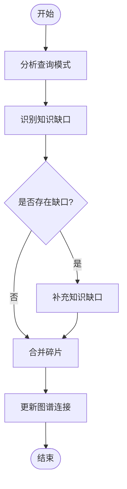
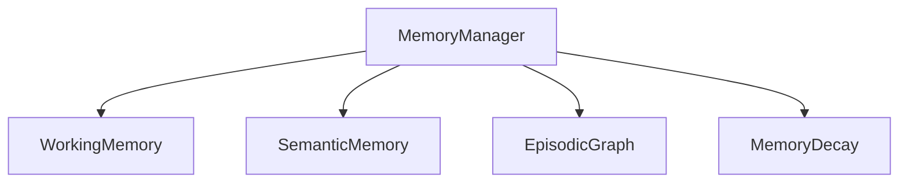
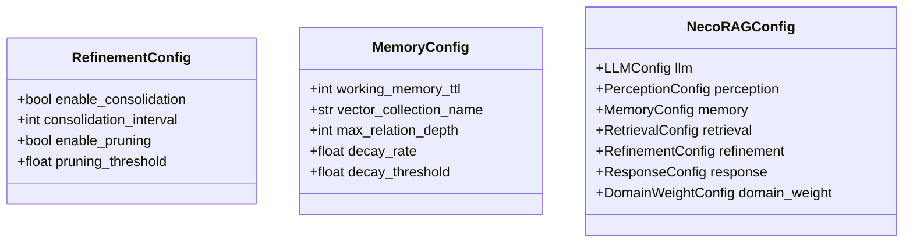
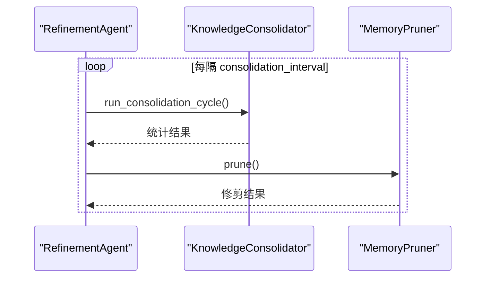
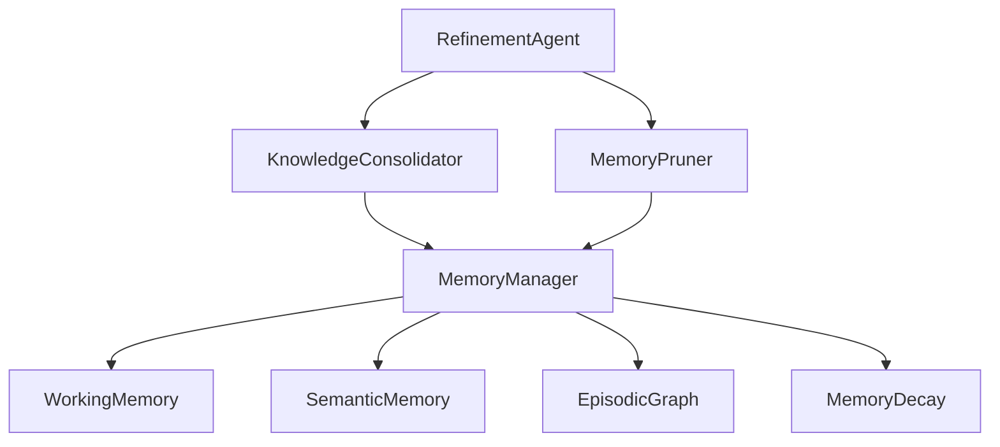

# 知识固化器

<cite>
**本文引用的文件**
- [consolidator.py](file://src/refinement/consolidator.py)
- [agent.py](file://src/refinement/agent.py)
- [models.py](file://src/refinement/models.py)
- [manager.py](file://src/memory/manager.py)
- [models.py](file://src/memory/models.py)
- [working_memory.py](file://src/memory/working_memory.py)
- [semantic_memory.py](file://src/memory/semantic_memory.py)
- [episodic_graph.py](file://src/memory/episodic_graph.py)
- [decay.py](file://src/memory/decay.py)
- [pruner.py](file://src/refinement/pruner.py)
- [design.md](file://design/design.md)
- [config.py](file://src/core/config.py)
- [example_usage.py](file://example/example_usage.py)
</cite>

## 目录
1. [简介](#简介)
2. [项目结构](#项目结构)
3. [核心组件](#核心组件)
4. [架构总览](#架构总览)
5. [详细组件分析](#详细组件分析)
6. [依赖分析](#依赖分析)
7. [性能考量](#性能考量)
8. [故障排查指南](#故障排查指南)
9. [结论](#结论)
10. [附录](#附录)

## 简介
本文件围绕知识固化器组件（KnowledgeConsolidator）展开，系统阐述其异步固化机制、知识整合策略、与记忆管理器（MemoryManager）的交互接口与数据同步流程、知识筛选与质量评估机制、配置选项与性能优化方法、固化时机控制与批量处理机制，并提供扩展与定制指导。该组件位于“巩固层”（Refinement Agent），负责异步分析高频未命中查询、自动补充知识缺口、合并碎片化知识、更新图谱连接，从而实现类脑记忆的“系统巩固”。

## 项目结构
知识固化器位于精炼模块，与记忆管理器协同工作，构成“感知-记忆-检索-巩固-交互”的五层认知架构。下图展示了与知识固化器直接相关的模块关系。

**图表来源**
- [consolidator.py:9-142](file://src/refinement/consolidator.py#L9-L142)
- [agent.py:16-151](file://src/refinement/agent.py#L16-L151)
- [manager.py:16-186](file://src/memory/manager.py#L16-L186)
- [working_memory.py:11-120](file://src/memory/working_memory.py#L11-L120)
- [semantic_memory.py:21-179](file://src/memory/semantic_memory.py#L21-L179)
- [episodic_graph.py:10-194](file://src/memory/episodic_graph.py#L10-L194)
- [decay.py:11-155](file://src/memory/decay.py#L11-L155)
- [pruner.py:10-157](file://src/refinement/pruner.py#L10-L157)

**章节来源**
- [consolidator.py:1-142](file://src/refinement/consolidator.py#L1-L142)
- [agent.py:1-151](file://src/refinement/agent.py#L1-L151)
- [manager.py:1-186](file://src/memory/manager.py#L1-L186)

## 核心组件
- 知识固化器（KnowledgeConsolidator）：负责异步运行固化周期，分析查询模式、识别知识缺口、补充缺口、合并碎片、更新图谱连接。
- 记忆管理器（MemoryManager）：统一管理 L1/L2/L3 三层记忆，提供存储、检索、巩固与遗忘能力。
- 记忆修剪器（MemoryPruner）：与固化器并行运行，负责噪声、低质量、过时知识的识别与修剪。
- 精炼代理（RefinementAgent）：协调 Generator-Critic-Refiner 闭环与后台任务，调度固化器与修剪器。

**章节来源**
- [consolidator.py:9-142](file://src/refinement/consolidator.py#L9-L142)
- [agent.py:16-151](file://src/refinement/agent.py#L16-L151)
- [pruner.py:10-157](file://src/refinement/pruner.py#L10-L157)
- [manager.py:16-186](file://src/memory/manager.py#L16-L186)

## 架构总览
知识固化器在精炼代理的后台任务中被调用，与记忆管理器协作完成“固化-修剪-巩固”的闭环。下图展示了典型的一次固化周期调用序列。

**图表来源**
- [agent.py:130-151](file://src/refinement/agent.py#L130-L151)
- [consolidator.py:35-61](file://src/refinement/consolidator.py#L35-L61)
- [pruner.py:41-69](file://src/refinement/pruner.py#L41-L69)
- [manager.py:149-186](file://src/memory/manager.py#L149-L186)

## 详细组件分析

### 知识固化器（KnowledgeConsolidator）
- 异步固化周期（run_consolidation_cycle）：按顺序执行“分析查询模式 → 识别知识缺口 → 补充缺口 → 合并碎片 → 更新图谱连接”，并返回统计信息。
- 查询模式分析（analyze_query_patterns）：当前返回空列表，预留实现空间。
- 知识缺口识别（identify_knowledge_gaps）：基于命中率与查询频率阈值筛选缺口，构造 KnowledgeGap。
- 知识缺口补充（fill_knowledge_gap）：当前最小实现，预留从外部源获取或提示管理员的扩展点。
- 碎片合并（merge_fragments）：当前最小实现，预留碎片化知识合并算法。
- 图谱连接更新（update_graph_connections）：当前最小实现，预留图谱关系维护逻辑。

**图表来源**
- [consolidator.py:35-61](file://src/refinement/consolidator.py#L35-L61)
- [models.py:49-66](file://src/refinement/models.py#L49-L66)

**章节来源**
- [consolidator.py:9-142](file://src/refinement/consolidator.py#L9-L142)
- [models.py:49-66](file://src/refinement/models.py#L49-L66)

### 与记忆管理器的交互与数据同步
- 存储与检索：MemoryManager.store 将编码后的 Chunk 存入 L2 语义记忆并建立 L3 实体关系；retrieve 基于 L2 向量检索并结合衰减强化访问记忆。
- 记忆巩固：consolidate 应用衰减、识别归档项并删除，forget 支持主动遗忘低价值记忆。
- 知识固化器通过 MemoryManager 的统一存储与三层记忆实现数据同步，确保固化过程读取到最新状态。

**图表来源**
- [manager.py:16-186](file://src/memory/manager.py#L16-L186)
- [working_memory.py:11-120](file://src/memory/working_memory.py#L11-L120)
- [semantic_memory.py:21-179](file://src/memory/semantic_memory.py#L21-L179)
- [episodic_graph.py:10-194](file://src/memory/episodic_graph.py#L10-L194)
- [decay.py:11-155](file://src/memory/decay.py#L11-L155)

**章节来源**
- [manager.py:48-186](file://src/memory/manager.py#L48-L186)

### 知识筛选与质量评估机制
- 查询模式与缺口识别：基于命中率与频率阈值（min_query_frequency）筛选高频未命中查询，形成知识缺口。
- 质量评估预留：fill_knowledge_gap、merge_fragments、update_graph_connections 当前为最小实现，建议在实际实现中引入外部知识源、相似度阈值、图谱连通性评估等质量控制策略。

**章节来源**
- [consolidator.py:75-102](file://src/refinement/consolidator.py#L75-L102)
- [models.py:49-66](file://src/refinement/models.py#L49-L66)

### 固化策略配置选项
- 精炼配置（RefinementConfig）：包含最大迭代次数、置信度阈值、是否启用固化与修剪、固化间隔等。
- 记忆配置（MemoryConfig）：包含 L1 TTL、L2 向量集合名、L3 最大关系深度、衰减率与阈值等。
- 全局配置（NecoRAGConfig）：统一管理各层配置，支持从文件与环境变量加载。

**图表来源**
- [config.py:176-195](file://src/core/config.py#L176-L195)
- [config.py:127-147](file://src/core/config.py#L127-L147)
- [config.py:232-284](file://src/core/config.py#L232-L284)

**章节来源**
- [config.py:174-195](file://src/core/config.py#L174-L195)
- [config.py:125-147](file://src/core/config.py#L125-L147)
- [config.py:232-284](file://src/core/config.py#L232-L284)

### 性能优化方法
- 异步执行：run_consolidation_cycle 为异步方法，可在后台任务中调度，避免阻塞主线程。
- 批量处理：在识别缺口与执行补充时，建议采用批处理策略，减少外部调用次数与 IO 开销。
- 衰减与修剪：结合 MemoryDecay 与 MemoryPruner，定期清理低价值与过时知识，维持检索效率。
- 索引与检索优化：在 SemanticMemory 中采用向量检索与混合检索策略，合理设置 top_k 与阈值。

**章节来源**
- [consolidator.py:35-61](file://src/refinement/consolidator.py#L35-L61)
- [pruner.py:41-69](file://src/refinement/pruner.py#L41-L69)
- [semantic_memory.py:80-142](file://src/memory/semantic_memory.py#L80-L142)
- [decay.py:72-94](file://src/memory/decay.py#L72-L94)

### 固化时机控制与批量处理机制
- 后台任务调度：RefinementAgent.run_background_tasks 异步运行固化与修剪，返回结果字典。
- 固化间隔：可通过 RefinementConfig.consolidation_interval 控制固化周期。
- 批量更新：结合知识库演化引擎（见设计文档），可实现定时批量更新与增量同步。

**图表来源**
- [agent.py:130-151](file://src/refinement/agent.py#L130-L151)
- [config.py:189-191](file://src/core/config.py#L189-L191)

**章节来源**
- [agent.py:130-151](file://src/refinement/agent.py#L130-L151)
- [config.py:189-191](file://src/core/config.py#L189-L191)

### 扩展与定制指导
- 扩展查询模式分析：在 analyze_query_patterns 中接入查询日志统计与模式识别算法。
- 补充缺口策略：在 fill_knowledge_gap 中集成外部知识源（如 API、数据库）或人工审核流程。
- 碎片合并算法：在 merge_fragments 中实现基于语义相似度或图谱连通性的合并策略。
- 图谱连接更新：在 update_graph_connections 中实现基于实体关系强度与访问频率的更新逻辑。
- 质量评估：在知识入库与固化过程中引入可信度、相关性、新颖性等多维度评分。

**章节来源**
- [consolidator.py:63-142](file://src/refinement/consolidator.py#L63-L142)
- [design.md:373-455](file://design/design.md#L373-L455)

## 依赖分析
- 知识固化器依赖记忆管理器提供的统一存储与三层记忆能力。
- 精炼代理负责调度固化器与修剪器，并在后台任务中统一返回结果。
- 记忆修剪器与固化器并行工作，共同维护知识库质量。

**图表来源**
- [agent.py:16-151](file://src/refinement/agent.py#L16-L151)
- [consolidator.py:9-142](file://src/refinement/consolidator.py#L9-L142)
- [pruner.py:10-157](file://src/refinement/pruner.py#L10-L157)
- [manager.py:16-186](file://src/memory/manager.py#L16-L186)

**章节来源**
- [agent.py:16-151](file://src/refinement/agent.py#L16-L151)
- [consolidator.py:9-142](file://src/refinement/consolidator.py#L9-L142)
- [pruner.py:10-157](file://src/refinement/pruner.py#L10-L157)
- [manager.py:16-186](file://src/memory/manager.py#L16-L186)

## 性能考量
- 异步与并发：利用异步方法与后台任务，避免阻塞主线程，提升系统吞吐。
- 批处理与缓存：对高频查询与外部知识源请求进行批处理与缓存，减少重复开销。
- 索引与检索：合理设置 SemanticMemory 的 top_k 与阈值，平衡召回与速度。
- 衰减与修剪：定期应用 MemoryDecay 与 MemoryPruner，保持知识库新鲜度与连通性。

[本节为通用性能建议，不直接分析具体文件]

## 故障排查指南
- 后台任务未执行：确认 MemoryManager 已初始化，否则后台任务会跳过。
- 固化结果为空：检查查询模式分析与知识缺口识别逻辑，确认阈值设置合理。
- 记忆修剪误删：调整噪声、低质量与过时阈值，确保修剪策略符合业务需求。
- 存储与检索异常：检查 MemoryManager.store 与 retrieve 的调用参数与返回结果。

**章节来源**
- [agent.py:137-138](file://src/refinement/agent.py#L137-L138)
- [pruner.py:71-118](file://src/refinement/pruner.py#L71-L118)
- [manager.py:48-147](file://src/memory/manager.py#L48-L147)

## 结论
知识固化器通过异步周期化任务，结合查询模式分析与知识缺口识别，实现从“高频未命中查询”到“长期稳定知识”的转化。与记忆管理器的协同使固化过程具备统一的数据入口与三层记忆支撑。通过合理的配置与性能优化策略，可有效提升知识库的稳定性与检索效率。建议在后续实现中完善查询模式分析、质量评估与图谱维护逻辑，以满足生产环境的复杂需求。

[本节为总结性内容，不直接分析具体文件]

## 附录
- 使用示例：MemoryManager 的存储与检索、记忆巩固与主动遗忘示例，可参考示例脚本。

**章节来源**
- [example_usage.py:50-91](file://example/example_usage.py#L50-L91)