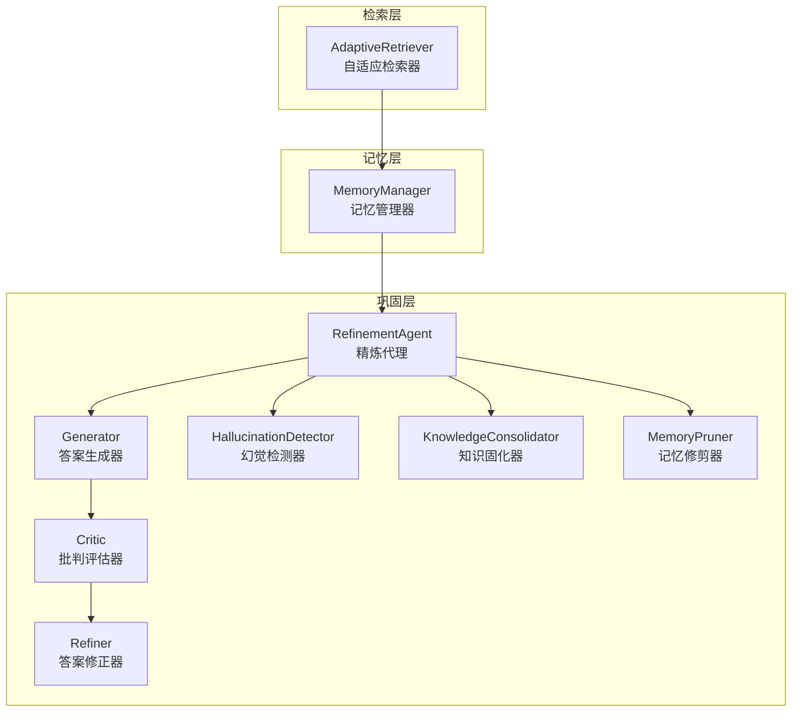
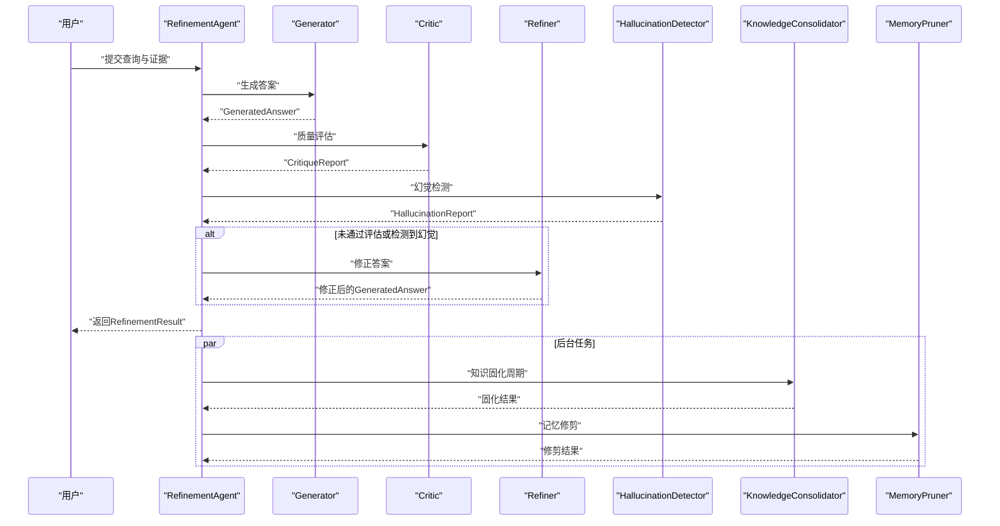
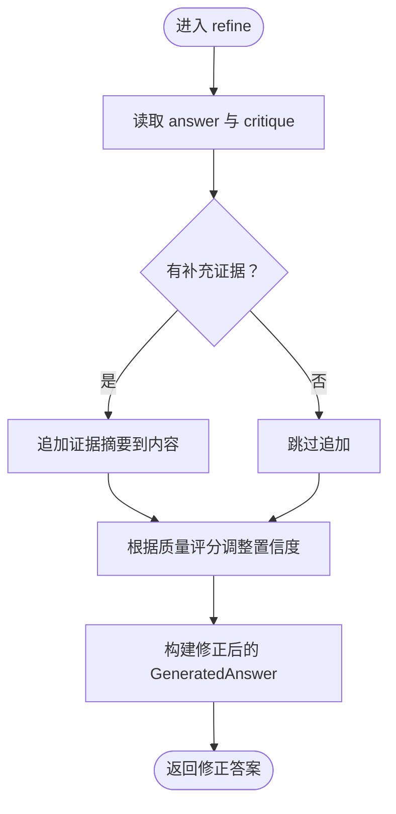
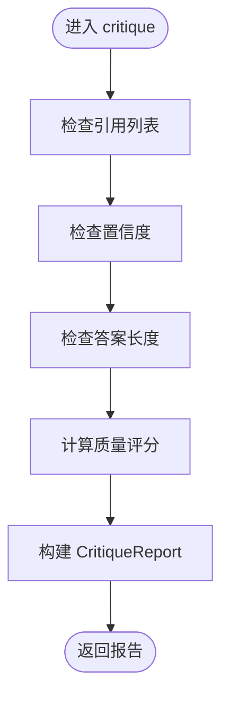
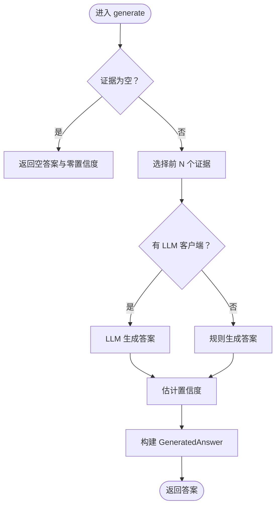
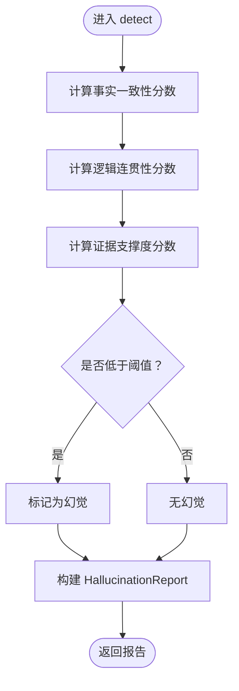
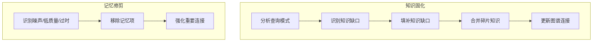
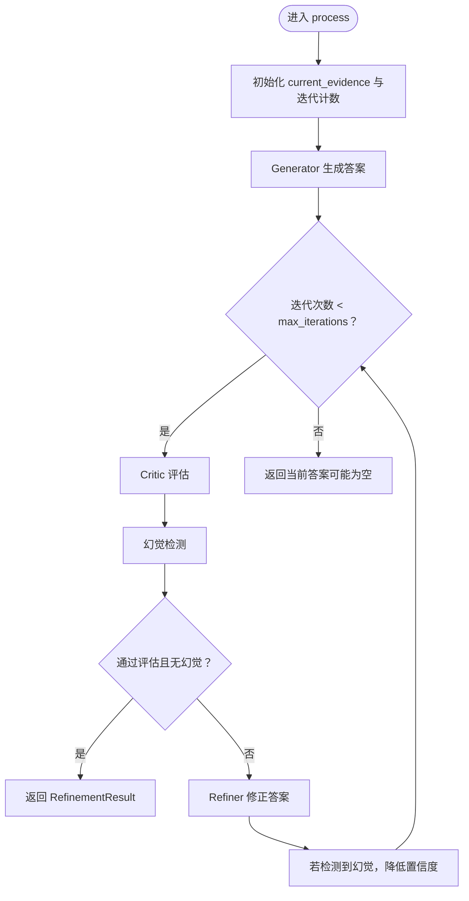
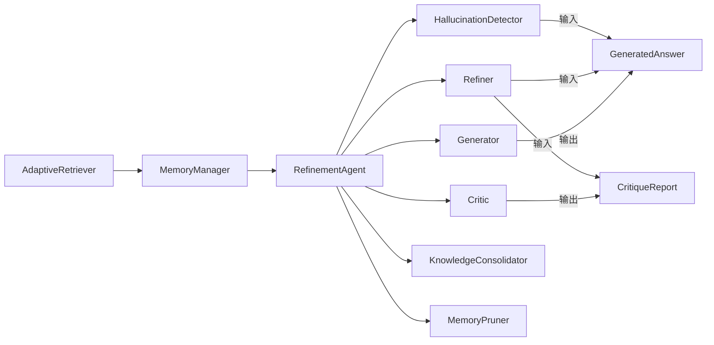
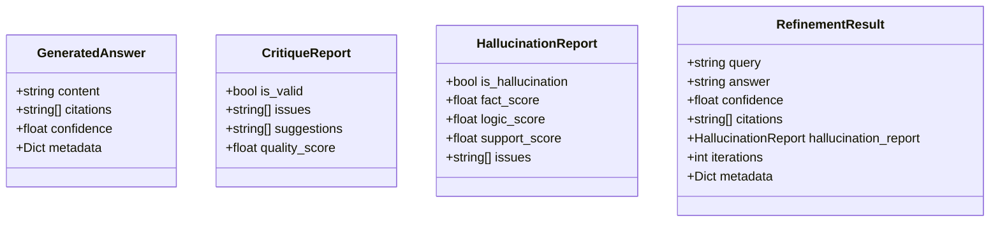

# 答案修正器

<cite>
**本文引用的文件**
- [src/refinement/refiner.py](file://src/refinement/refiner.py)
- [src/refinement/models.py](file://src/refinement/models.py)
- [src/refinement/critic.py](file://src/refinement/critic.py)
- [src/refinement/generator.py](file://src/refinement/generator.py)
- [src/refinement/agent.py](file://src/refinement/agent.py)
- [src/refinement/hallucination.py](file://src/refinement/hallucination.py)
- [src/refinement/consolidator.py](file://src/refinement/consolidator.py)
- [src/refinement/pruner.py](file://src/refinement/pruner.py)
- [src/core/config.py](file://src/core/config.py)
- [src/memory/manager.py](file://src/memory/manager.py)
- [src/retrieval/retriever.py](file://src/retrieval/retriever.py)
- [example/example_usage.py](file://example/example_usage.py)
</cite>

## 目录
1. [简介](#简介)
2. [项目结构](#项目结构)
3. [核心组件](#核心组件)
4. [架构总览](#架构总览)
5. [详细组件分析](#详细组件分析)
6. [依赖关系分析](#依赖关系分析)
7. [性能考量](#性能考量)
8. [故障排查指南](#故障排查指南)
9. [结论](#结论)
10. [附录](#附录)

## 简介
本文件面向“答案修正器”组件，系统性阐述 Refiner 类的修正机制与改进策略，解释如何依据批判反馈优化答案质量；说明证据检索与上下文更新逻辑；解析修正算法的实现原理与迭代优化机制；提供修正效果评估与质量控制方法；给出修正策略的配置选项与参数调优建议，并为开发者提供扩展修正算法与定制优化规则的指导。

## 项目结构
答案修正器位于“巩固层”，与生成器、批判器、幻觉检测器、知识固化器、记忆修剪器共同构成闭环精炼体系。其上游由检索层提供证据，下游对接响应层输出最终答案。

图表来源
- [src/refinement/agent.py:16-151](file://src/refinement/agent.py#L16-L151)
- [src/refinement/generator.py:15-208](file://src/refinement/generator.py#L15-L208)
- [src/refinement/critic.py:9-72](file://src/refinement/critic.py#L9-L72)
- [src/refinement/refiner.py:8-64](file://src/refinement/refiner.py#L8-L64)
- [src/refinement/hallucination.py:9-154](file://src/refinement/hallucination.py#L9-L154)
- [src/refinement/consolidator.py:9-142](file://src/refinement/consolidator.py#L9-L142)
- [src/refinement/pruner.py:10-157](file://src/refinement/pruner.py#L10-L157)
- [src/retrieval/retriever.py:122-440](file://src/retrieval/retriever.py#L122-L440)
- [src/memory/manager.py:16-186](file://src/memory/manager.py#L16-L186)

章节来源
- [src/refinement/agent.py:16-151](file://src/refinement/agent.py#L16-L151)
- [src/refinement/generator.py:15-208](file://src/refinement/generator.py#L15-L208)
- [src/refinement/critic.py:9-72](file://src/refinement/critic.py#L9-L72)
- [src/refinement/refiner.py:8-64](file://src/refinement/refiner.py#L8-L64)
- [src/refinement/hallucination.py:9-154](file://src/refinement/hallucination.py#L9-L154)
- [src/refinement/consolidator.py:9-142](file://src/refinement/consolidator.py#L9-L142)
- [src/refinement/pruner.py:10-157](file://src/refinement/pruner.py#L10-L157)
- [src/retrieval/retriever.py:122-440](file://src/retrieval/retriever.py#L122-L440)
- [src/memory/manager.py:16-186](file://src/memory/manager.py#L16-L186)

## 核心组件
- Refiner（答案修正器）：接收原始答案与批判报告，结合补充证据与质量评分，对答案内容、引用与置信度进行修正与增强。
- Critic（批判评估器）：对答案进行质量评估，产出问题清单、改进建议与质量评分。
- Generator（答案生成器）：基于证据与上下文生成答案，并估计置信度。
- HallucinationDetector（幻觉检测器）：检测事实一致性、逻辑连贯性与证据支撑度，辅助质量控制。
- KnowledgeConsolidator（知识固化器）：分析高频未命中查询，自动补充知识缺口，合并碎片知识，更新图谱连接。
- MemoryPruner（记忆修剪器）：识别噪声、低质量与过时信息，执行修剪并强化重要连接。
- RefinementAgent（精炼代理）：协调生成-批判-修正闭环，集成幻觉检测与后台固化/修剪任务。

章节来源
- [src/refinement/refiner.py:8-64](file://src/refinement/refiner.py#L8-L64)
- [src/refinement/critic.py:9-72](file://src/refinement/critic.py#L9-L72)
- [src/refinement/generator.py:15-208](file://src/refinement/generator.py#L15-L208)
- [src/refinement/hallucination.py:9-154](file://src/refinement/hallucination.py#L9-L154)
- [src/refinement/consolidator.py:9-142](file://src/refinement/consolidator.py#L9-L142)
- [src/refinement/pruner.py:10-157](file://src/refinement/pruner.py#L10-L157)
- [src/refinement/agent.py:16-151](file://src/refinement/agent.py#L16-L151)

## 架构总览
答案修正器在“巩固层”的核心流程如下：
- 输入：查询、证据列表、上下文。
- 生成阶段：Generator 基于证据与上下文生成答案并估计置信度。
- 评估阶段：Critic 对答案进行质量评估，产出问题与质量评分；HallucinationDetector 检测事实、逻辑与证据支撑问题。
- 修正阶段：Refiner 根据批判报告与补充证据调整答案内容、引用与置信度。
- 迭代优化：RefinementAgent 控制最大迭代次数与最低置信度阈值，未达标则重复上述流程。
- 后台维护：KnowledgeConsolidator 与 MemoryPruner 异步运行，持续优化知识库质量与结构。

图表来源
- [src/refinement/agent.py:61-151](file://src/refinement/agent.py#L61-L151)
- [src/refinement/generator.py:67-141](file://src/refinement/generator.py#L67-L141)
- [src/refinement/critic.py:25-72](file://src/refinement/critic.py#L25-L72)
- [src/refinement/refiner.py:24-64](file://src/refinement/refiner.py#L24-L64)
- [src/refinement/hallucination.py:34-76](file://src/refinement/hallucination.py#L34-L76)
- [src/refinement/consolidator.py:35-62](file://src/refinement/consolidator.py#L35-L62)
- [src/refinement/pruner.py:41-70](file://src/refinement/pruner.py#L41-L70)

## 详细组件分析

### Refiner（答案修正器）
- 职责：根据批判报告与补充证据，对答案内容、引用与置信度进行修正与增强。
- 关键输入：
  - GeneratedAnswer：原始答案（内容、引用、置信度、元数据）。
  - CritiqueReport：批判报告（有效性、问题列表、建议、质量评分）。
  - additional_evidence：可选的补充证据。
- 修正策略：
  - 内容增强：将补充证据以摘要形式追加到答案末尾，提升可信度与信息密度。
  - 引用扩展：为补充证据生成新的引用标识，确保溯源完整。
  - 置信度调整：依据质量评分动态增减置信度，鼓励高质量答案，抑制低质量答案。
- 输出：修正后的 GeneratedAnswer，包含更新的置信度与元数据标记（如已修正、问题数量）。

图表来源
- [src/refinement/refiner.py:24-64](file://src/refinement/refiner.py#L24-L64)

章节来源
- [src/refinement/refiner.py:8-64](file://src/refinement/refiner.py#L8-L64)

### Critic（批判评估器）
- 职责：对答案进行质量评估，识别证据缺失、置信度过低、答案过短等问题，计算质量评分。
- 评估维度：
  - 证据支撑：若无引用，视为缺乏证据支撑。
  - 置信度阈值：低于阈值则提出补充证据建议。
  - 答案完整性：过短则建议提供更详细回答。
- 质量评分：基于问题数量线性扣分，保证评分范围有效。

图表来源
- [src/refinement/critic.py:25-72](file://src/refinement/critic.py#L25-L72)

章节来源
- [src/refinement/critic.py:9-72](file://src/refinement/critic.py#L9-L72)

### Generator（答案生成器）
- 职责：基于证据与上下文生成答案，并估计置信度。
- 生成策略：
  - LLM 生成：构造提示词，拼接证据与上下文，调用 LLM 客户端生成答案。
  - 规则生成：无 LLM 客户端时，采用规则化模板与证据要点生成答案。
- 置信度估计：综合证据数量、答案长度、关键词覆盖等特征，避免极端置信度。

图表来源
- [src/refinement/generator.py:67-208](file://src/refinement/generator.py#L67-L208)

章节来源
- [src/refinement/generator.py:15-208](file://src/refinement/generator.py#L15-L208)

### HallucinationDetector（幻觉检测器）
- 职责：检测事实一致性、逻辑连贯性与证据支撑度，辅助质量控制。
- 检测指标：
  - 事实一致性：基于答案与证据的词集重叠比例。
  - 逻辑连贯性：基于答案长度与逻辑连接词出现情况。
  - 证据支撑度：基于证据数量的线性映射。
- 判定标准：当事实一致性或证据支撑度低于阈值时，判定存在幻觉。

图表来源
- [src/refinement/hallucination.py:34-76](file://src/refinement/hallucination.py#L34-L76)

章节来源
- [src/refinement/hallucination.py:9-154](file://src/refinement/hallucination.py#L9-L154)

### KnowledgeConsolidator（知识固化器）与 MemoryPruner（记忆修剪器）
- 知识固化器：分析查询模式，识别知识缺口，补充知识、合并碎片、更新图谱连接。
- 记忆修剪器：识别噪声、低质量与过时信息，执行修剪并强化重要连接。
- 两者均提供异步运行能力，作为后台任务持续优化知识库质量与结构。

图表来源
- [src/refinement/consolidator.py:35-62](file://src/refinement/consolidator.py#L35-L62)
- [src/refinement/pruner.py:41-70](file://src/refinement/pruner.py#L41-L70)

章节来源
- [src/refinement/consolidator.py:9-142](file://src/refinement/consolidator.py#L9-L142)
- [src/refinement/pruner.py:10-157](file://src/refinement/pruner.py#L10-L157)

### RefinementAgent（精炼代理）
- 职责：协调生成-批判-修正闭环，集成幻觉检测与后台任务。
- 控制参数：
  - max_iterations：最大迭代次数。
  - min_confidence：最低置信度阈值。
- 流程：生成答案 → 批判评估 → 幻觉检测 → 未达标则修正 → 达到阈值或迭代上限后返回。

图表来源
- [src/refinement/agent.py:61-151](file://src/refinement/agent.py#L61-L151)

章节来源
- [src/refinement/agent.py:16-151](file://src/refinement/agent.py#L16-L151)

## 依赖关系分析
- Refiner 依赖数据模型 GeneratedAnswer 与 CritiqueReport。
- RefinementAgent 协调 Generator、Critic、Refiner、HallucinationDetector，并在具备 MemoryManager 时启用 KnowledgeConsolidator 与 MemoryPruner。
- 检索层提供证据给 RefinementAgent，记忆层承载证据与实体关系，支撑检索与固化。

图表来源
- [src/refinement/agent.py:48-60](file://src/refinement/agent.py#L48-L60)
- [src/refinement/generator.py:15-208](file://src/refinement/generator.py#L15-L208)
- [src/refinement/critic.py:9-72](file://src/refinement/critic.py#L9-L72)
- [src/refinement/refiner.py:8-64](file://src/refinement/refiner.py#L8-L64)
- [src/refinement/hallucination.py:9-154](file://src/refinement/hallucination.py#L9-L154)
- [src/refinement/consolidator.py:9-142](file://src/refinement/consolidator.py#L9-L142)
- [src/refinement/pruner.py:10-157](file://src/refinement/pruner.py#L10-L157)
- [src/retrieval/retriever.py:122-440](file://src/retrieval/retriever.py#L122-L440)
- [src/memory/manager.py:16-186](file://src/memory/manager.py#L16-L186)

章节来源
- [src/refinement/agent.py:48-60](file://src/refinement/agent.py#L48-L60)
- [src/refinement/generator.py:15-208](file://src/refinement/generator.py#L15-L208)
- [src/refinement/critic.py:9-72](file://src/refinement/critic.py#L9-L72)
- [src/refinement/refiner.py:8-64](file://src/refinement/refiner.py#L8-L64)
- [src/refinement/hallucination.py:9-154](file://src/refinement/hallucination.py#L9-L154)
- [src/refinement/consolidator.py:9-142](file://src/refinement/consolidator.py#L9-L142)
- [src/refinement/pruner.py:10-157](file://src/refinement/pruner.py#L10-L157)
- [src/retrieval/retriever.py:122-440](file://src/retrieval/retriever.py#L122-L440)
- [src/memory/manager.py:16-186](file://src/memory/manager.py#L16-L186)

## 性能考量
- 证据数量控制：Generator 默认限制最大使用证据数量，避免 LLM 负载过高与上下文截断。
- 置信度估计：通过多特征融合估计置信度，减少无效迭代。
- 早停机制：检索层的早停控制器在置信度达到阈值时提前终止，节省计算资源。
- 后台任务：知识固化与记忆修剪异步执行，不影响主流程响应时间。
- 参数调优建议：
  - max_iterations：根据业务容忍度与成本平衡，建议在 2~5 之间。
  - min_confidence：建议不低于 0.7，确保输出可靠性。
  - hallucination thresholds：fact_threshold、support_threshold 可根据数据质量微调。
  - Evidence 追加长度：Refiner 中对补充证据进行截断，建议控制在合理长度以避免上下文污染。

[本节为通用性能讨论，不直接分析具体文件]

## 故障排查指南
- 答案质量差或置信度异常：
  - 检查 Critic 的问题列表与质量评分，确认证据缺失、置信度过低或答案过短问题。
  - 检查 HallucinationDetector 的三项指标，关注事实一致性与证据支撑度。
- 证据不足导致答案不可靠：
  - 使用检索层的早停控制器与重排序策略，确保返回高质量证据。
  - 启用 HyDE 或领域权重增强，提高检索质量。
- 迭代未收敛：
  - 提升 max_iterations 或放宽 min_confidence。
  - 检查 Refiner 的置信度调整策略是否过于保守。
- 后台任务未生效：
  - 确认 MemoryManager 已初始化，以便启用 KnowledgeConsolidator 与 MemoryPruner。
  - 检查异步任务调度与日志输出。

章节来源
- [src/refinement/critic.py:25-72](file://src/refinement/critic.py#L25-L72)
- [src/refinement/hallucination.py:34-76](file://src/refinement/hallucination.py#L34-L76)
- [src/refinement/agent.py:61-151](file://src/refinement/agent.py#L61-L151)
- [src/retrieval/retriever.py:30-120](file://src/retrieval/retriever.py#L30-L120)
- [src/refinement/consolidator.py:35-62](file://src/refinement/consolidator.py#L35-L62)
- [src/refinement/pruner.py:41-70](file://src/refinement/pruner.py#L41-L70)

## 结论
答案修正器通过“生成-批判-修正”的闭环机制，结合证据检索与上下文更新，实现答案质量的持续优化。配合幻觉检测与后台知识固化/修剪，系统能够在动态环境中不断提升答案的准确性、完整性与可信度。开发者可通过调优参数与扩展算法，进一步定制化修正策略与优化规则。

[本节为总结性内容，不直接分析具体文件]

## 附录

### 数据模型概览
- GeneratedAnswer：答案内容、引用、置信度与元数据。
- CritiqueReport：答案有效性、问题列表、建议与质量评分。
- HallucinationReport：事实一致性、逻辑连贯性、证据支撑度与问题列表。
- RefinementResult：查询、答案、置信度、引用、幻觉报告、迭代次数与元数据。

图表来源
- [src/refinement/models.py:19-66](file://src/refinement/models.py#L19-L66)

章节来源
- [src/refinement/models.py:19-66](file://src/refinement/models.py#L19-L66)

### 配置选项与参数调优
- 巩固层配置（RefinementConfig）：
  - max_iterations：最大迭代次数。
  - confidence_threshold：质量评估阈值。
  - factual_threshold、logical_threshold、evidence_threshold：幻觉检测阈值。
  - enable_consolidation、enable_pruning：是否启用后台任务。
  - consolidation_interval、pruning_threshold：后台任务周期与修剪阈值。
- 记忆层配置（MemoryConfig）：
  - 向量数据库与图数据库提供商、集合名、衰减参数等。
- 检索层配置（RetrievalConfig）：
  - 早停阈值、HyDE 与重排序开关、rerank 参数等。
- 使用示例参考：
  - example_usage.py 展示了如何初始化各组件并运行完整流程。

章节来源
- [src/core/config.py:177-195](file://src/core/config.py#L177-L195)
- [src/core/config.py:128-147](file://src/core/config.py#L128-L147)
- [src/core/config.py:151-172](file://src/core/config.py#L151-L172)
- [example/example_usage.py:139-174](file://example/example_usage.py#L139-L174)

### 开发者扩展指南
- 扩展 Refiner 的修正策略：
  - 基于 CritiqueReport 的 issues 与 suggestions，设计针对性的修正规则（如结构化重写、引用补充、术语规范化）。
  - 引入 LLM 驱动的重写与压缩，提升答案表达质量。
- 自定义 Critic 的评估维度：
  - 新增证据相关性、答案完整性、风格一致性等指标。
  - 将评估结果映射到质量评分的非线性函数，提升区分度。
- 优化 HallucinationDetector：
  - 引入事实核查服务或外部知识库，提升事实一致性检测精度。
  - 增强逻辑连贯性检测，考虑句法与语义一致性。
- 定制知识固化与修剪策略：
  - 基于查询日志统计与用户反馈，动态调整知识缺口识别与填补策略。
  - 设计更精细的噪声与低质量识别规则，结合时间衰减与访问频率。

章节来源
- [src/refinement/refiner.py:24-64](file://src/refinement/refiner.py#L24-L64)
- [src/refinement/critic.py:25-72](file://src/refinement/critic.py#L25-L72)
- [src/refinement/hallucination.py:34-76](file://src/refinement/hallucination.py#L34-L76)
- [src/refinement/consolidator.py:35-62](file://src/refinement/consolidator.py#L35-L62)
- [src/refinement/pruner.py:41-70](file://src/refinement/pruner.py#L41-L70)