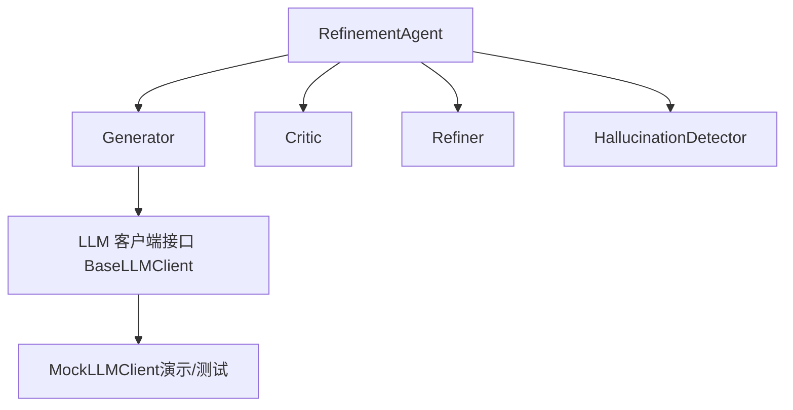
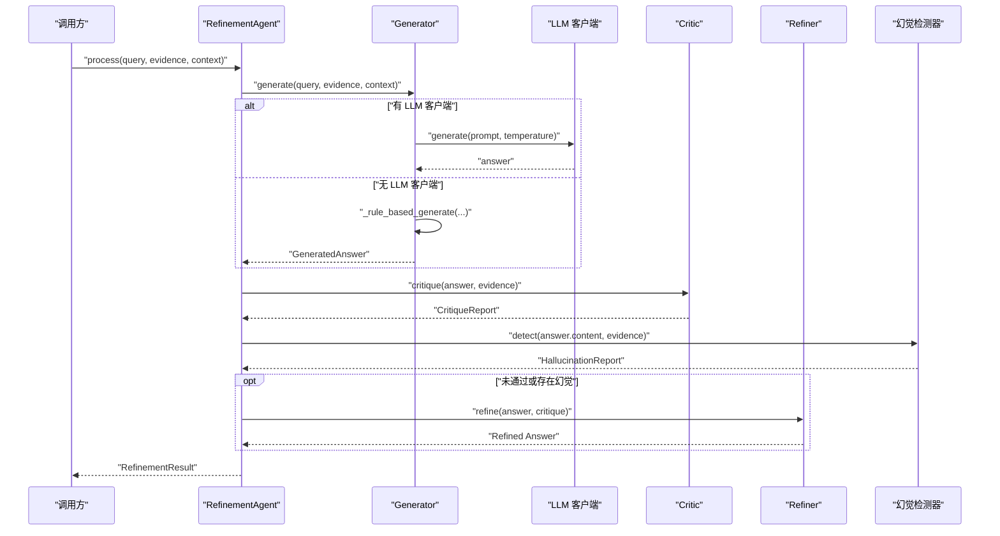
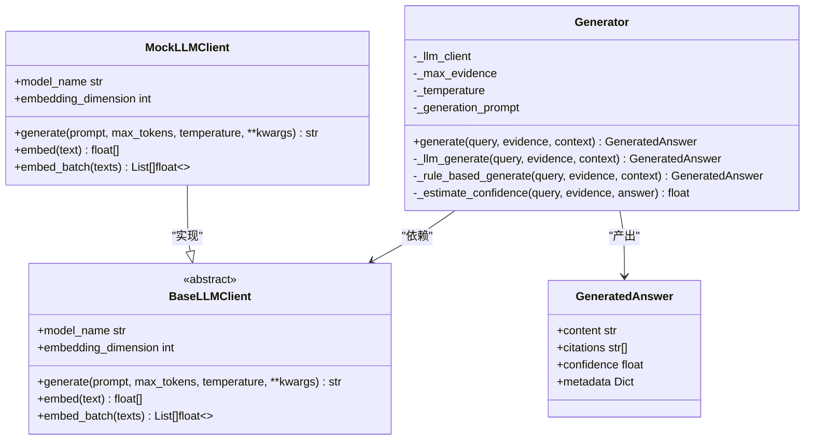
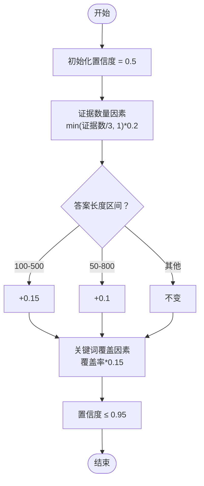
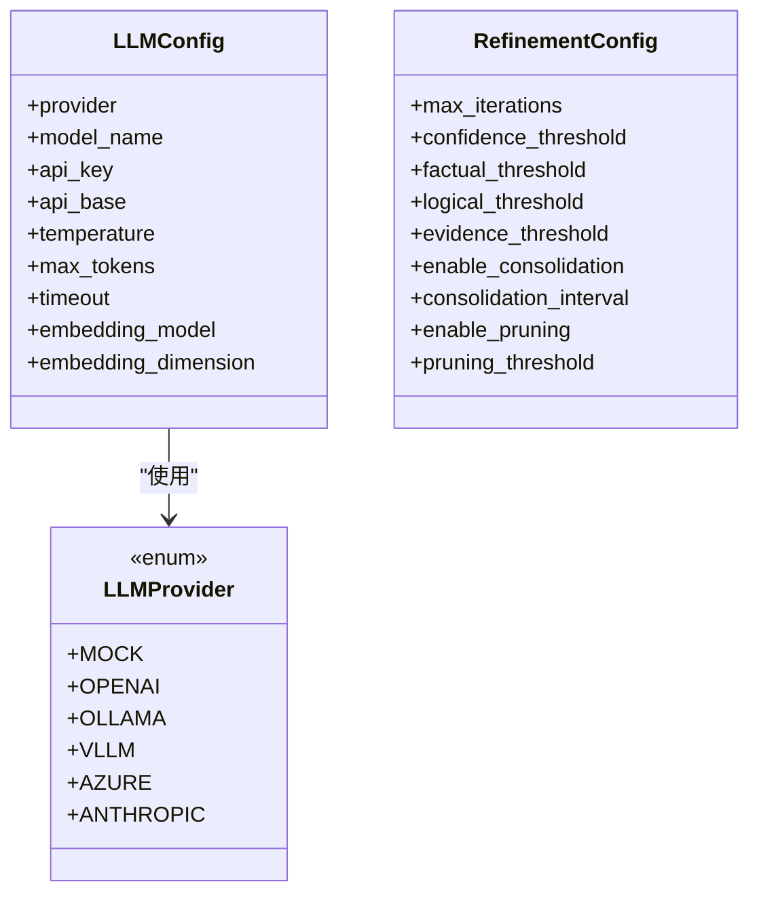
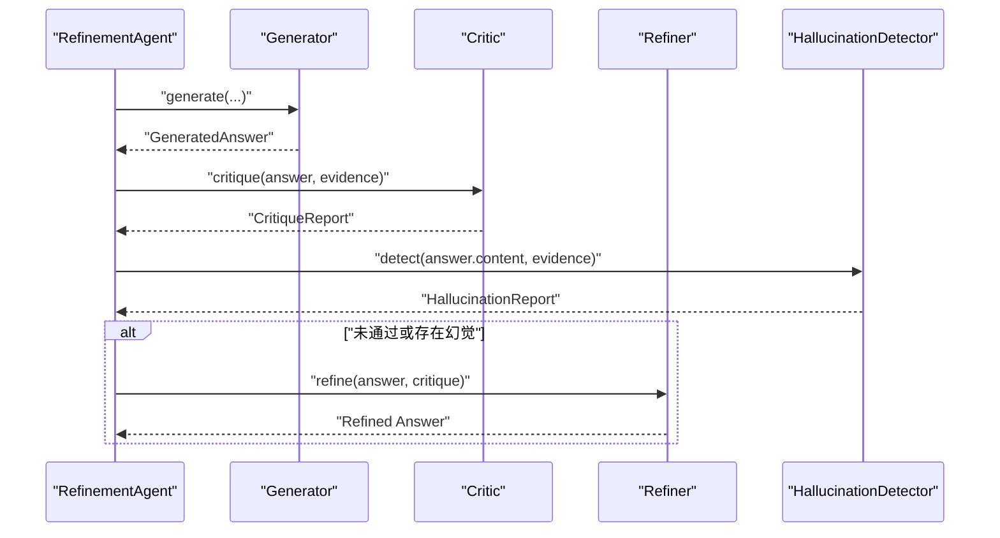
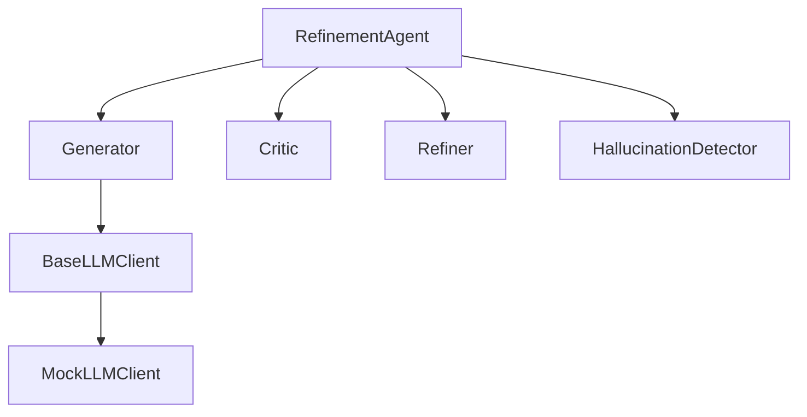

# 答案生成器

<cite>
**本文引用的文件**
- [src/refinement/generator.py](file://src/refinement/generator.py)
- [src/refinement/models.py](file://src/refinement/models.py)
- [src/core/llm/base.py](file://src/core/llm/base.py)
- [src/core/llm/mock.py](file://src/core/llm/mock.py)
- [src/refinement/agent.py](file://src/refinement/agent.py)
- [src/refinement/critic.py](file://src/refinement/critic.py)
- [src/refinement/refiner.py](file://src/refinement/refiner.py)
- [src/refinement/hallucination.py](file://src/refinement/hallucination.py)
- [example/example_usage.py](file://example/example_usage.py)
- [design/design.md](file://design/design.md)
- [src/core/config.py](file://src/core/config.py)
</cite>

## 目录
1. [简介](#简介)
2. [项目结构](#项目结构)
3. [核心组件](#核心组件)
4. [架构总览](#架构总览)
5. [详细组件分析](#详细组件分析)
6. [依赖分析](#依赖分析)
7. [性能考虑](#性能考虑)
8. [故障排查指南](#故障排查指南)
9. [结论](#结论)
10. [附录](#附录)

## 简介
本文件为“答案生成器”组件的全面技术文档，聚焦于 Generator 类的实现原理与工作流程，涵盖以下主题：
- 如何利用 LLM 模型生成初始答案
- 提示工程技巧与上下文融合策略
- 置信度 confidence 的计算机制
- 引用标注 citations 的实现方式
- 不同 LLM 模型的集成方式与配置选项
- 生成质量控制与参数调优的最佳实践
- 为开发者提供的扩展与定制指导

## 项目结构
答案生成器位于“巩固层”（Refinement Agent）中，与“批判器”“修正器”“幻觉检测器”协同工作，形成“生成-批判-修正-验证”的闭环。其核心职责是基于检索证据生成高质量答案，并在无 LLM 可用时提供规则化回退方案。

**图示来源**
- [src/refinement/agent.py:16-128](file://src/refinement/agent.py#L16-L128)
- [src/refinement/generator.py:15-208](file://src/refinement/generator.py#L15-L208)
- [src/core/llm/base.py:11-85](file://src/core/llm/base.py#L11-L85)
- [src/core/llm/mock.py:16-130](file://src/core/llm/mock.py#L16-L130)

**章节来源**
- [src/refinement/agent.py:16-128](file://src/refinement/agent.py#L16-L128)
- [src/refinement/generator.py:15-208](file://src/refinement/generator.py#L15-L208)
- [src/core/llm/base.py:11-85](file://src/core/llm/base.py#L11-L85)
- [src/core/llm/mock.py:16-130](file://src/core/llm/mock.py#L16-L130)

## 核心组件
- Generator：基于检索证据生成答案，支持 LLM 客户端依赖注入与规则化回退；内置提示词模板、证据选择、置信度估计与引用标注。
- GeneratedAnswer：生成答案的数据模型，包含内容、引用 ID 列表与置信度，以及可选元数据。
- BaseLLMClient：LLM 客户端抽象接口，定义 generate/embed 等统一方法。
- MockLLMClient：演示用 LLM 客户端，提供确定性响应与嵌入向量，便于开发与测试。
- RefinementAgent：整合 Generator/Critic/Refiner/HallucinationDetector 的主控制器，驱动生成-验证-修正闭环。
- 其他配套组件：Critic、Refiner、HallucinationDetector 用于质量评估、修正与幻觉检测。

**章节来源**
- [src/refinement/generator.py:15-208](file://src/refinement/generator.py#L15-L208)
- [src/refinement/models.py:19-26](file://src/refinement/models.py#L19-L26)
- [src/core/llm/base.py:11-85](file://src/core/llm/base.py#L11-L85)
- [src/core/llm/mock.py:16-130](file://src/core/llm/mock.py#L16-L130)
- [src/refinement/agent.py:16-128](file://src/refinement/agent.py#L16-L128)
- [src/refinement/critic.py:9-72](file://src/refinement/critic.py#L9-L72)
- [src/refinement/refiner.py:8-64](file://src/refinement/refiner.py#L8-L64)
- [src/refinement/hallucination.py:9-75](file://src/refinement/hallucination.py#L9-L75)

## 架构总览
答案生成器在“巩固层”中作为核心节点，接收查询与证据，调用 LLM 生成答案，并结合批判与修正流程提升质量。若未提供 LLM 客户端，则回退到规则化生成。

**图示来源**
- [src/refinement/agent.py:61-128](file://src/refinement/agent.py#L61-L128)
- [src/refinement/generator.py:67-174](file://src/refinement/generator.py#L67-L174)
- [src/refinement/critic.py:25-71](file://src/refinement/critic.py#L25-L71)
- [src/refinement/refiner.py:24-63](file://src/refinement/refiner.py#L24-L63)
- [src/refinement/hallucination.py:34-75](file://src/refinement/hallucination.py#L34-L75)

## 详细组件分析

### Generator 类分析
- 职责与能力
  - 基于检索证据生成答案，支持 LLM 客户端注入与规则化回退
  - 内置提示词模板，支持上下文信息融合
  - 估算置信度并生成引用 ID 列表
  - 控制最大证据数量与生成温度
- 关键方法
  - generate：入口方法，处理无证据、证据截断、LLM 生成与规则生成
  - _llm_generate：构造提示词、调用 LLM、评估置信度、封装结果
  - _rule_based_generate：规则化生成，按证据拼装要点并估算置信度
  - _estimate_confidence：综合证据数量、答案长度与关键词覆盖度计算置信度
- 提示工程与上下文融合
  - 使用固定提示词模板，将证据与查询注入
  - 支持可选上下文字典，将其序列化后前置到提示词
- 引用标注
  - 引用 ID 采用顺序编号（evidence_0, evidence_1, ...），与证据顺序一一对应
- 默认行为
  - 若未提供 LLM 客户端，默认使用 MockLLMClient，便于演示与测试

**图示来源**
- [src/refinement/generator.py:15-208](file://src/refinement/generator.py#L15-L208)
- [src/core/llm/base.py:11-85](file://src/core/llm/base.py#L11-L85)
- [src/core/llm/mock.py:16-130](file://src/core/llm/mock.py#L16-L130)
- [src/refinement/models.py:19-26](file://src/refinement/models.py#L19-L26)

**章节来源**
- [src/refinement/generator.py:15-208](file://src/refinement/generator.py#L15-L208)
- [src/core/llm/base.py:11-85](file://src/core/llm/base.py#L11-L85)
- [src/core/llm/mock.py:16-130](file://src/core/llm/mock.py#L16-L130)
- [src/refinement/models.py:19-26](file://src/refinement/models.py#L19-L26)

### 置信度计算机制
- 输入要素
  - 证据数量：证据越多，置信度越高，上限为 0.2
  - 答案长度：在 100-500 字之间给予最高加分，50-800 字次之
  - 关键词覆盖：查询词与答案词的交集占查询词的比例，按比例加分
- 输出范围
  - 最终置信度不超过 0.95，避免过度乐观

**图示来源**
- [src/refinement/generator.py:176-207](file://src/refinement/generator.py#L176-L207)

**章节来源**
- [src/refinement/generator.py:176-207](file://src/refinement/generator.py#L176-L207)

### 引用标注实现
- 引用 ID 规则
  - 顺序编号：evidence_0, evidence_1, ...
  - 与证据列表长度一致，便于溯源
- 生成路径
  - LLM 生成路径：为每个证据分配一个引用 ID
  - 规则生成路径：同样为证据生成引用 ID

**章节来源**
- [src/refinement/generator.py:136-140](file://src/refinement/generator.py#L136-L140)
- [src/refinement/generator.py:170-173](file://src/refinement/generator.py#L170-L173)

### LLM 集成与配置
- 接口契约
  - BaseLLMClient 定义 generate/embed 等统一接口，支持同步与异步版本
- Mock 实现
  - MockLLMClient 提供确定性响应与嵌入，便于开发与测试
- 配置选项
  - LLMProvider 枚举支持 MOCK、OPENAI、OLLAMA、VLLM、AZURE、ANTHROPIC
  - LLMConfig 提供模型名、温度、最大 token、超时、嵌入维度等
  - RefinementConfig 提供最大迭代次数、置信度阈值等巩固层参数
- 使用方式
  - RefinementAgent 在初始化时可传入 llm_model 名称，Generator 接收该名称并注入相应客户端
  - 若未提供客户端，Generator 将自动回退到 MockLLMClient

**图示来源**
- [src/core/config.py:18-95](file://src/core/config.py#L18-L95)
- [src/core/config.py:176-195](file://src/core/config.py#L176-L195)

**章节来源**
- [src/core/llm/base.py:11-85](file://src/core/llm/base.py#L11-L85)
- [src/core/llm/mock.py:16-130](file://src/core/llm/mock.py#L16-L130)
- [src/core/config.py:18-95](file://src/core/config.py#L18-L95)
- [src/core/config.py:176-195](file://src/core/config.py#L176-L195)
- [src/refinement/agent.py:27-60](file://src/refinement/agent.py#L27-L60)

### 与精炼流程的协作
- RefinementAgent 调用 Generator 生成初始答案
- Critic 对答案进行质量评估（证据支撑、置信度、完整性）
- HallucinationDetector 检测事实一致性、逻辑连贯性与证据支撑度
- Refiner 根据批判意见修正答案并调整置信度
- 循环直至满足质量阈值或达到最大迭代次数

**图示来源**
- [src/refinement/agent.py:61-128](file://src/refinement/agent.py#L61-L128)
- [src/refinement/critic.py:25-71](file://src/refinement/critic.py#L25-L71)
- [src/refinement/refiner.py:24-63](file://src/refinement/refiner.py#L24-L63)
- [src/refinement/hallucination.py:34-75](file://src/refinement/hallucination.py#L34-L75)

**章节来源**
- [src/refinement/agent.py:61-128](file://src/refinement/agent.py#L61-L128)
- [src/refinement/critic.py:25-71](file://src/refinement/critic.py#L25-L71)
- [src/refinement/refiner.py:24-63](file://src/refinement/refiner.py#L24-L63)
- [src/refinement/hallucination.py:34-75](file://src/refinement/hallucination.py#L34-L75)

## 依赖分析
- 组件耦合
  - Generator 依赖 BaseLLMClient 接口，通过注入实现松耦合
  - RefinementAgent 协调 Generator/Critic/Refiner/HallucinationDetector，形成闭环
- 外部依赖
  - LLM 提供商通过 LLMProvider/LLMConfig 管理
  - MockLLMClient 作为演示与测试的默认实现

**图示来源**
- [src/refinement/generator.py:15-50](file://src/refinement/generator.py#L15-L50)
- [src/core/llm/base.py:11-85](file://src/core/llm/base.py#L11-L85)
- [src/core/llm/mock.py:16-130](file://src/core/llm/mock.py#L16-L130)
- [src/refinement/agent.py:16-60](file://src/refinement/agent.py#L16-L60)

**章节来源**
- [src/refinement/generator.py:15-50](file://src/refinement/generator.py#L15-L50)
- [src/core/llm/base.py:11-85](file://src/core/llm/base.py#L11-L85)
- [src/core/llm/mock.py:16-130](file://src/core/llm/mock.py#L16-L130)
- [src/refinement/agent.py:16-60](file://src/refinement/agent.py#L16-L60)

## 性能考虑
- 证据截断
  - 通过 max_evidence 控制提示词长度，避免超出上下文窗口
- 温度参数
  - temperature 控制生成多样性，较低温度偏向保守与一致
- 规则化回退
  - 在无 LLM 或 LLM 不可用时，使用规则化生成保障可用性
- 早停与迭代
  - RefinementAgent 的最大迭代次数与置信度阈值可调，平衡质量与性能

**章节来源**
- [src/refinement/generator.py:25-41](file://src/refinement/generator.py#L25-L41)
- [src/refinement/agent.py:27-46](file://src/refinement/agent.py#L27-L46)
- [src/core/config.py:176-195](file://src/core/config.py#L176-L195)

## 故障排查指南
- 无证据返回
  - 当 evidence 为空时，Generator 直接返回默认兜底内容与零引用、零置信度
- 置信度过低
  - 检查证据数量、答案长度与关键词覆盖；必要时增加证据或调整提示词
- 幻觉风险
  - 使用 HallucinationDetector 的事实一致性、逻辑连贯性与证据支撑度指标
  - 若检测到幻觉，RefinementAgent 会降低置信度并尝试修正
- LLM 集成问题
  - 确认 LLMProvider/LLMConfig 配置正确，API Key/URL 设置无误
  - 无可用 LLM 时，确认已启用 MockLLMClient 回退

**章节来源**
- [src/refinement/generator.py:84-90](file://src/refinement/generator.py#L84-L90)
- [src/refinement/hallucination.py:34-75](file://src/refinement/hallucination.py#L34-L75)
- [src/refinement/agent.py:116-118](file://src/refinement/agent.py#L116-L118)
- [src/core/config.py:18-95](file://src/core/config.py#L18-L95)

## 结论
Generator 通过“提示工程 + 上下文融合 + 置信度估计 + 引用标注”的组合，实现了可控、可解释的答案生成。其与 Critic/Refiner/HallucinationDetector 的协同，进一步提升了答案质量与可靠性。通过 LLM 客户端接口与配置体系，系统支持多种 LLM 提供商与灵活的参数调优，满足不同场景需求。

## 附录

### 使用示例与集成路径
- 示例脚本展示了从感知层到响应层的完整流程，其中巩固层使用 RefinementAgent 调用 Generator 生成答案
- 可据此路径定位 Generator 的调用入口与输出结构

**章节来源**
- [example/example_usage.py:139-173](file://example/example_usage.py#L139-L173)

### 设计理念与最佳实践
- 人脑记忆与检索机制映射至五层架构，强调“巩固层”的自检与修正能力
- 建议在生产环境中：
  - 明确证据截断与温度参数
  - 启用幻觉检测与质量评估
  - 通过配置管理 LLM 提供商与模型参数
  - 在无 LLM 场景下使用 MockLLMClient 保障可用性

**章节来源**
- [design/design.md:419-427](file://design/design.md#L419-L427)
- [src/core/config.py:18-95](file://src/core/config.py#L18-L95)