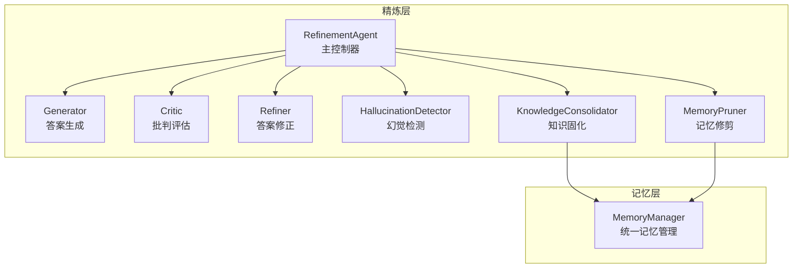
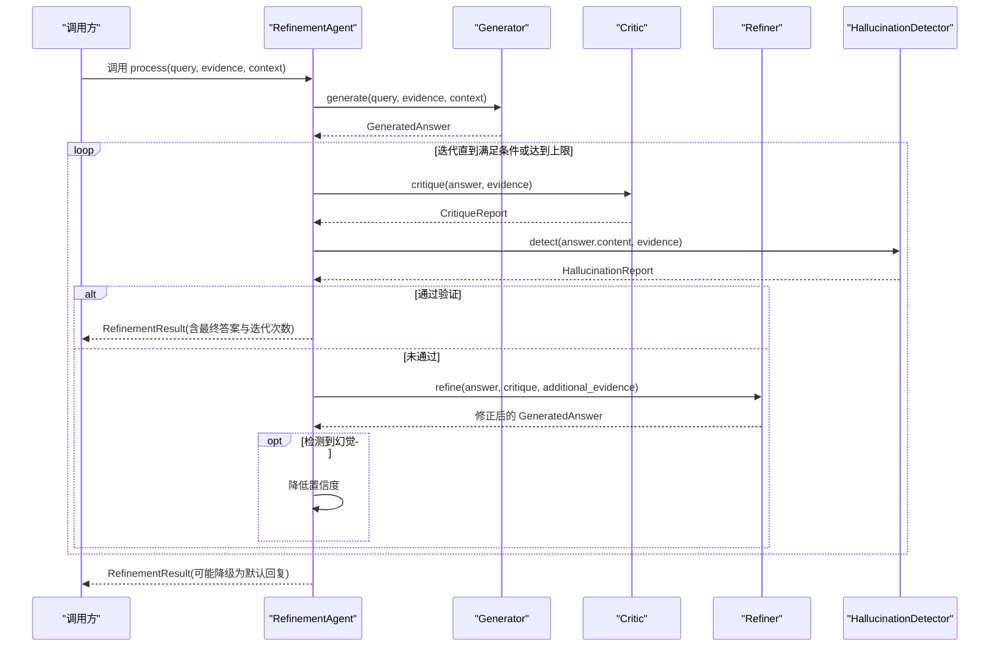
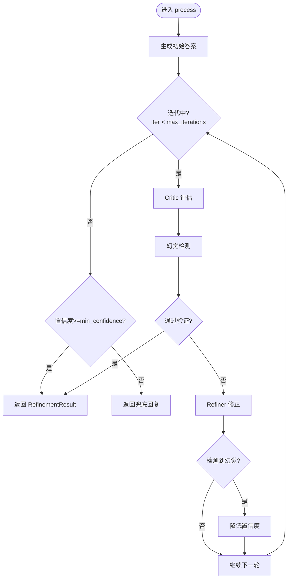
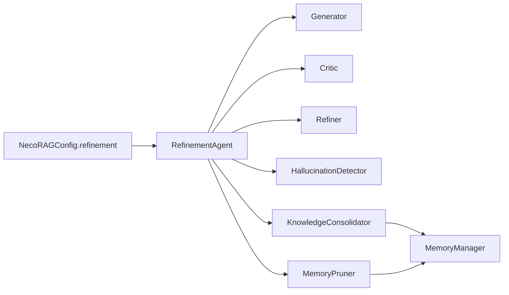

# 精炼代理核心

<cite>
**本文引用的文件**
- [src/refinement/agent.py](file://src/refinement/agent.py)
- [src/refinement/models.py](file://src/refinement/models.py)
- [src/refinement/generator.py](file://src/refinement/generator.py)
- [src/refinement/critic.py](file://src/refinement/critic.py)
- [src/refinement/refiner.py](file://src/refinement/refiner.py)
- [src/refinement/hallucination.py](file://src/refinement/hallucination.py)
- [src/refinement/consolidator.py](file://src/refinement/consolidator.py)
- [src/refinement/pruner.py](file://src/refinement/pruner.py)
- [src/memory/manager.py](file://src/memory/manager.py)
- [src/core/config.py](file://src/core/config.py)
- [src/core/base.py](file://src/core/base.py)
- [example/example_usage.py](file://example/example_usage.py)
</cite>

## 目录
1. [简介](#简介)
2. [项目结构](#项目结构)
3. [核心组件](#核心组件)
4. [架构总览](#架构总览)
5. [详细组件分析](#详细组件分析)
6. [依赖分析](#依赖分析)
7. [性能考量](#性能考量)
8. [故障排查指南](#故障排查指南)
9. [结论](#结论)
10. [附录](#附录)

## 简介
本文件面向精炼代理核心组件，系统性阐述 RefinementAgent 主类的设计架构与工作流程，重点解释“生成-批判-修正”三重验证循环的实现机制；详述 process 方法的执行流程，包括答案生成、批判评估、幻觉检测与迭代优化；解释 max_iterations 与 min_confidence 参数的作用与调优策略；说明异步知识固化任务的执行机制与 run_background_tasks 的实现细节；给出 RefinementResult 与 HallucinationReport 数据模型的详细说明；并提供初始化配置与使用示例，帮助开发者快速上手与高效调优。

## 项目结构
精炼代理位于 src/refinement 目录，围绕 RefinementAgent 主类组织子组件：Generator（答案生成）、Critic（批判评估）、Refiner（答案修正）、HallucinationDetector（幻觉检测）、KnowledgeConsolidator（知识固化）、MemoryPruner（记忆修剪）。同时，RefinementAgent 依赖 MemoryManager 进行知识持久化与检索。

图表来源
- [src/refinement/agent.py:16-151](file://src/refinement/agent.py#L16-L151)
- [src/refinement/generator.py:15-208](file://src/refinement/generator.py#L15-L208)
- [src/refinement/critic.py:9-72](file://src/refinement/critic.py#L9-L72)
- [src/refinement/refiner.py:8-64](file://src/refinement/refiner.py#L8-L64)
- [src/refinement/hallucination.py:9-154](file://src/refinement/hallucination.py#L9-L154)
- [src/refinement/consolidator.py:9-142](file://src/refinement/consolidator.py#L9-L142)
- [src/refinement/pruner.py:10-157](file://src/refinement/pruner.py#L10-L157)
- [src/memory/manager.py:16-186](file://src/memory/manager.py#L16-L186)

章节来源
- [src/refinement/agent.py:16-151](file://src/refinement/agent.py#L16-L151)
- [src/memory/manager.py:16-186](file://src/memory/manager.py#L16-L186)

## 核心组件
- RefinementAgent：主控制器，协调 Generator、Critic、Refiner、HallucinationDetector，并在具备 MemoryManager 时驱动 KnowledgeConsolidator 与 MemoryPruner 的后台任务。
- Generator：基于检索证据生成答案，支持 LLM 客户端注入与规则回退，输出 GeneratedAnswer 及置信度。
- Critic：对 GeneratedAnswer 进行质量评估，产出 CritiqueReport。
- Refiner：依据 CritiqueReport 对答案进行修正，调整置信度与引用。
- HallucinationDetector：检测事实一致性、逻辑连贯性与证据支撑度，产出 HallucinationReport。
- KnowledgeConsolidator：分析查询模式、识别知识缺口并进行补充与合并，异步执行。
- MemoryPruner：识别噪声、低质量与过时记忆，执行修剪与强化。

章节来源
- [src/refinement/agent.py:16-151](file://src/refinement/agent.py#L16-L151)
- [src/refinement/generator.py:15-208](file://src/refinement/generator.py#L15-L208)
- [src/refinement/critic.py:9-72](file://src/refinement/critic.py#L9-L72)
- [src/refinement/refiner.py:8-64](file://src/refinement/refiner.py#L8-L64)
- [src/refinement/hallucination.py:9-154](file://src/refinement/hallucination.py#L9-L154)
- [src/refinement/consolidator.py:9-142](file://src/refinement/consolidator.py#L9-L142)
- [src/refinement/pruner.py:10-157](file://src/refinement/pruner.py#L10-L157)

## 架构总览
RefinementAgent 采用“生成-批判-修正-检测-收敛”的闭环控制流，结合幻觉检测与置信度动态调整，确保答案质量与可靠性。当具备 MemoryManager 时，异步运行知识固化与记忆修剪，持续优化知识库质量。

图表来源
- [src/refinement/agent.py:61-128](file://src/refinement/agent.py#L61-L128)
- [src/refinement/generator.py:67-101](file://src/refinement/generator.py#L67-L101)
- [src/refinement/critic.py:25-71](file://src/refinement/critic.py#L25-L71)
- [src/refinement/refiner.py:24-63](file://src/refinement/refiner.py#L24-L63)
- [src/refinement/hallucination.py:34-75](file://src/refinement/hallucination.py#L34-L75)

## 详细组件分析

### RefinementAgent 设计与工作流
- 初始化：接收 llm_model、memory、max_iterations、min_confidence；实例化 Generator、Critic、Refiner、HallucinationDetector；若提供 memory，则实例化 KnowledgeConsolidator 与 MemoryPruner。
- process 流程：
  - 初始生成：调用 Generator.generate 生成初始答案。
  - 三重验证循环：在迭代次数内重复执行“批判评估 + 幻觉检测”，若通过则返回 RefinementResult；否则调用 Refiner.refine 修正答案，若检测到幻觉则降低置信度。
  - 收敛与兜底：达到最大迭代次数后，若置信度仍低于 min_confidence，则返回默认兜底回复；否则返回当前答案。
- 异步后台任务：run_background_tasks 仅在具备 KnowledgeConsolidator 与 MemoryPruner 时执行，分别运行知识固化周期与记忆修剪，并返回执行结果。

图表来源
- [src/refinement/agent.py:61-128](file://src/refinement/agent.py#L61-L128)

章节来源
- [src/refinement/agent.py:27-60](file://src/refinement/agent.py#L27-L60)
- [src/refinement/agent.py:61-128](file://src/refinement/agent.py#L61-L128)
- [src/refinement/agent.py:130-151](file://src/refinement/agent.py#L130-L151)

### Generator（答案生成器）
- 功能：基于检索证据生成高质量答案，支持 LLM 客户端注入与规则回退；估算置信度。
- 关键点：
  - 若无证据，直接返回兜底答案与零置信度。
  - 限制最大证据数量，避免上下文过长。
  - LLM 生成：构造提示词，调用 llm_client.generate，随后基于证据数量、答案长度与关键词覆盖估算置信度。
  - 规则回退：在无 LLM 客户端时，按证据要点拼装答案并估算置信度。
- 置信度估计：综合证据数量、答案长度与关键词覆盖率，上限约束在合理范围。

章节来源
- [src/refinement/generator.py:67-101](file://src/refinement/generator.py#L67-L101)
- [src/refinement/generator.py:102-140](file://src/refinement/generator.py#L102-L140)
- [src/refinement/generator.py:142-174](file://src/refinement/generator.py#L142-L174)
- [src/refinement/generator.py:176-208](file://src/refinement/generator.py#L176-L208)

### Critic（批判评估器）
- 功能：评估 GeneratedAnswer 的质量，产出 CritiqueReport。
- 关键点：
  - 检查证据支撑、置信度阈值与答案完整性。
  - 基于问题数量计算质量分数，作为后续修正的参考。

章节来源
- [src/refinement/critic.py:25-71](file://src/refinement/critic.py#L25-L71)

### Refiner（答案修正器）
- 功能：根据 CritiqueReport 对答案进行修正，调整置信度与引用。
- 关键点：
  - 当前实现为最小可行版本：追加补充证据片段、根据质量分数微调置信度，并标记 metadata。

章节来源
- [src/refinement/refiner.py:24-63](file://src/refinement/refiner.py#L24-L63)

### HallucinationDetector（幻觉检测器）
- 功能：检测事实一致性、逻辑连贯性与证据支撑度，产出 HallucinationReport。
- 关键点：
  - 事实一致性：基于答案与证据的词集重叠比例。
  - 逻辑连贯性：基于答案长度与逻辑连接词。
  - 证据支撑度：基于证据数量。
  - 通过阈值组合判断是否存在幻觉。

章节来源
- [src/refinement/hallucination.py:34-75](file://src/refinement/hallucination.py#L34-L75)
- [src/refinement/hallucination.py:77-107](file://src/refinement/hallucination.py#L77-L107)
- [src/refinement/hallucination.py:109-129](file://src/refinement/hallucination.py#L109-L129)
- [src/refinement/hallucination.py:131-153](file://src/refinement/hallucination.py#L131-L153)

### KnowledgeConsolidator（知识固化器）
- 功能：分析查询模式、识别知识缺口、补充知识、合并碎片、更新图谱连接。
- 关键点：
  - 当前实现为最小可行版本，返回占位结果；实际流程在异步周期中逐步完善。

章节来源
- [src/refinement/consolidator.py:35-61](file://src/refinement/consolidator.py#L35-L61)
- [src/refinement/consolidator.py:75-102](file://src/refinement/consolidator.py#L75-L102)
- [src/refinement/consolidator.py:104-117](file://src/refinement/consolidator.py#L104-L117)
- [src/refinement/consolidator.py:119-129](file://src/refinement/consolidator.py#L119-L129)
- [src/refinement/consolidator.py:131-141](file://src/refinement/consolidator.py#L131-L141)

### MemoryPruner（记忆修剪器）
- 功能：识别噪声、低质量与过时记忆，执行修剪并强化重要连接。
- 关键点：
  - 噪声：低权重且访问次数少。
  - 低质量：内容过短且权重低。
  - 过时：超过设定天数未访问。
  - 强化：高频访问的记忆权重提升。

章节来源
- [src/refinement/pruner.py:41-69](file://src/refinement/pruner.py#L41-L69)
- [src/refinement/pruner.py:71-85](file://src/refinement/pruner.py#L71-L85)
- [src/refinement/pruner.py:87-101](file://src/refinement/pruner.py#L87-L101)
- [src/refinement/pruner.py:103-118](file://src/refinement/pruner.py#L103-L118)
- [src/refinement/pruner.py:120-137](file://src/refinement/pruner.py#L120-L137)
- [src/refinement/pruner.py:139-156](file://src/refinement/pruner.py#L139-L156)

### 数据模型详解
- HallucinationReport：记录幻觉检测结果，包含是否幻觉、事实一致性、逻辑连贯性、证据支撑度与问题列表。
- GeneratedAnswer：生成的答案，包含内容、引用、置信度与元数据。
- CritiqueReport：批判评估结果，包含有效性、问题列表、建议与质量评分。
- RefinementResult：精炼结果，包含查询、答案、置信度、引用、幻觉报告、迭代次数与元数据。
- KnowledgeGap：知识缺口，包含标识、主题、描述、频率与元数据。
- QueryPattern：查询模式，包含模式、计数、命中率与示例。

章节来源
- [src/refinement/models.py:9-17](file://src/refinement/models.py#L9-L17)
- [src/refinement/models.py:19-26](file://src/refinement/models.py#L19-L26)
- [src/refinement/models.py:29-35](file://src/refinement/models.py#L29-L35)
- [src/refinement/models.py:38-47](file://src/refinement/models.py#L38-L47)
- [src/refinement/models.py:50-57](file://src/refinement/models.py#L50-L57)
- [src/refinement/models.py:60-66](file://src/refinement/models.py#L60-L66)

## 依赖分析
- RefinementAgent 依赖各子组件与 MemoryManager；当 memory 为空时，不启用知识固化与修剪。
- 各组件间耦合度低，职责清晰：Generator 负责生成，Critic 负责评估，Refiner 负责修正，HallucinationDetector 负责检测，Consolidator 与 Pruner 负责知识维护。
- 配置层通过 NecoRAGConfig 提供统一入口，精炼层配置位于 RefinementConfig，包含 max_iterations、min_confidence 等关键参数。

图表来源
- [src/refinement/agent.py:48-59](file://src/refinement/agent.py#L48-L59)
- [src/core/config.py:177-195](file://src/core/config.py#L177-L195)
- [src/memory/manager.py:16-46](file://src/memory/manager.py#L16-L46)

章节来源
- [src/refinement/agent.py:48-59](file://src/refinement/agent.py#L48-L59)
- [src/core/config.py:177-195](file://src/core/config.py#L177-L195)

## 性能考量
- 迭代次数与置信度阈值：max_iterations 控制收敛速度与成本，min_confidence 保障最终输出质量。建议在生产环境适度提高 max_iterations，以换取更高稳定性；同时根据业务场景调整 min_confidence。
- 证据数量与提示词长度：Generator 限制最大证据数量与温度参数，有助于控制上下文长度与生成开销。
- 幻觉检测成本：当前实现为启发式规则，复杂度低；若引入 LLM 评估，需权衡延迟与准确性。
- 异步任务：run_background_tasks 仅在具备 MemoryManager 时执行，避免无意义的空操作；建议在后台定时调度，避免阻塞主线程。

[本节为通用指导，无需特定文件来源]

## 故障排查指南
- 无证据输入：Generator 在无证据时返回兜底答案与零置信度，确认上游检索是否正常。
- 置信度过低：检查 Evidence 数量与内容质量；适当增加 max_iterations 或补充证据。
- 幻觉误报/漏报：调整 HallucinationDetector 的阈值（fact_threshold、support_threshold），或扩展检测逻辑。
- 后台任务未执行：确认 RefinementAgent 初始化时传入了 MemoryManager；否则 run_background_tasks 将跳过执行。
- 记忆修剪过度：调整噪声、低质量与过时阈值，避免误删有效知识。

章节来源
- [src/refinement/generator.py:84-90](file://src/refinement/generator.py#L84-L90)
- [src/refinement/agent.py:137-138](file://src/refinement/agent.py#L137-L138)
- [src/refinement/hallucination.py:19-32](file://src/refinement/hallucination.py#L19-L32)
- [src/refinement/pruner.py:20-39](file://src/refinement/pruner.py#L20-L39)

## 结论
RefinementAgent 通过“生成-批判-修正-检测-收敛”的闭环设计，结合置信度动态调整与幻觉检测，有效提升答案质量与可靠性。配合异步知识固化与记忆修剪，形成持续优化的知识体系。开发者可通过合理配置 max_iterations 与 min_confidence，以及扩展各子组件的评估与修正策略，进一步提升系统性能与稳定性。

[本节为总结，无需特定文件来源]

## 附录

### 参数与配置说明
- max_iterations：最大迭代次数，控制收敛速度与成本。
- min_confidence：最低置信度阈值，决定最终输出是否降级为兜底回复。
- 精炼层配置：位于 NecoRAGConfig.refinement，包含上述两个关键参数及幻觉检测阈值、是否启用固化与修剪等选项。

章节来源
- [src/refinement/agent.py:27-46](file://src/refinement/agent.py#L27-L46)
- [src/core/config.py:177-195](file://src/core/config.py#L177-L195)

### 使用示例（初始化与调用）
- 初始化 RefinementAgent：传入 llm_model、memory（可选）、max_iterations。
- 调用 process：传入 query、evidence 与可选 context，获得 RefinementResult。
- 异步后台任务：调用 run_background_tasks，在具备 MemoryManager 时执行知识固化与记忆修剪。

章节来源
- [example/example_usage.py:139-173](file://example/example_usage.py#L139-L173)
- [src/refinement/agent.py:27-60](file://src/refinement/agent.py#L27-L60)
- [src/refinement/agent.py:130-151](file://src/refinement/agent.py#L130-L151)