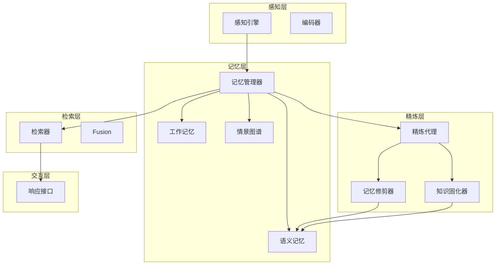
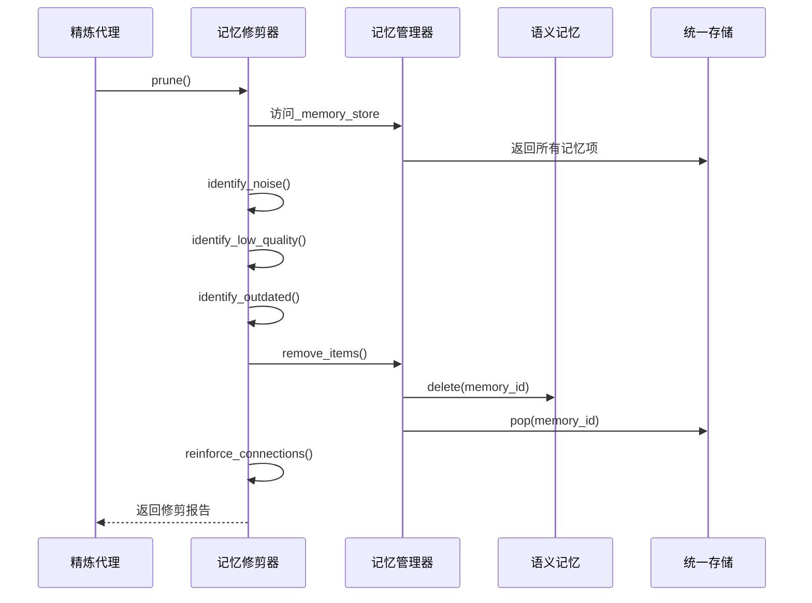
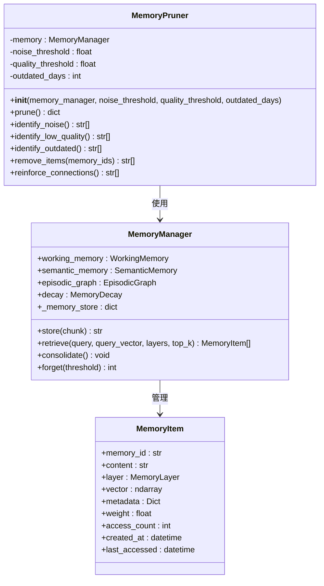
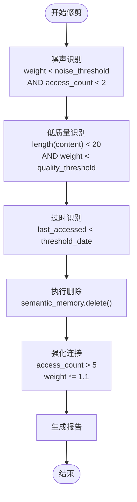
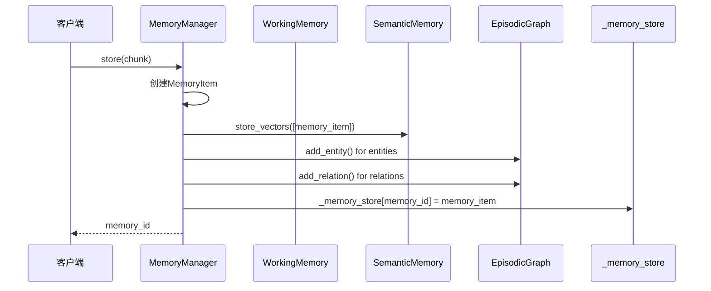
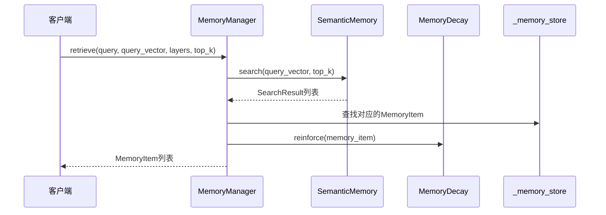
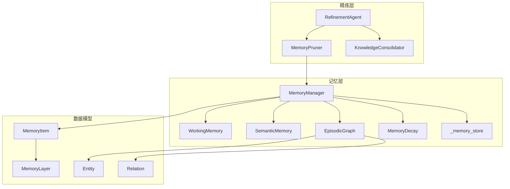

# 记忆修剪器

<cite>
**本文档引用的文件**
- [pruner.py](file://src/refinement/pruner.py)
- [agent.py](file://src/refinement/agent.py)
- [manager.py](file://src/memory/manager.py)
- [models.py](file://src/memory/models.py)
- [semantic_memory.py](file://src/memory/semantic_memory.py)
- [decay.py](file://src/memory/decay.py)
- [working_memory.py](file://src/memory/working_memory.py)
- [episodic_graph.py](file://src/memory/episodic_graph.py)
- [design.md](file://design/design.md)
- [README.md](file://src/memory/README.md)
</cite>

## 目录
1. [简介](#简介)
2. [项目结构](#项目结构)
3. [核心组件](#核心组件)
4. [架构概览](#架构概览)
5. [详细组件分析](#详细组件分析)
6. [依赖关系分析](#依赖关系分析)
7. [性能考虑](#性能考虑)
8. [故障排除指南](#故障排除指南)
9. [结论](#结论)
10. [附录](#附录)

## 简介

记忆修剪器（MemoryPruner）是NecoRAG框架中的一个关键组件，负责模拟猫"舔毛梳理"行为，对记忆系统进行主动修剪和优化。该组件通过识别噪声数据、低质量知识和过时信息，执行针对性的清理操作，同时强化重要的记忆连接，确保记忆系统的高效运行。

记忆修剪器与记忆管理器（MemoryManager）紧密协作，通过统一的内存存储结构管理所有三层记忆（工作记忆、语义记忆、情景图谱），实现了从感知层到交互层的完整记忆生命周期管理。

## 项目结构

NecoRAG框架采用分层架构设计，记忆修剪器位于精炼层（Refinement Layer），与感知层、记忆层、检索层和交互层协同工作：



**图表来源**
- [agent.py:16-59](file://src/refinement/agent.py#L16-L59)
- [manager.py:16-46](file://src/memory/manager.py#L16-L46)

**章节来源**
- [agent.py:16-59](file://src/refinement/agent.py#L16-L59)
- [manager.py:16-46](file://src/memory/manager.py#L16-L46)

## 核心组件

记忆修剪器由以下核心组件构成：

### MemoryPruner类
- **主要职责**：执行记忆修剪操作，识别并清理无用或过时的记忆条目
- **设计模式**：策略模式 + 规则引擎
- **关键特性**：三阶段修剪（噪声识别、质量评估、时效检查）

### MemoryManager类
- **主要职责**：统一管理三层记忆系统
- **核心功能**：存储、检索、巩固、主动遗忘
- **数据结构**：统一内存存储（_memory_store）管理所有记忆项

### MemoryItem数据模型
- **属性**：memory_id、content、layer、vector、metadata、weight、access_count、created_at、last_accessed
- **用途**：标准化记忆条目的存储和传输格式

**章节来源**
- [pruner.py:10-40](file://src/refinement/pruner.py#L10-L40)
- [manager.py:16-46](file://src/memory/manager.py#L16-L46)
- [models.py:19-31](file://src/memory/models.py#L19-L31)

## 架构概览

记忆修剪器在整个NecoRAG架构中的位置和作用：



**图表来源**
- [pruner.py:41-69](file://src/refinement/pruner.py#L41-L69)
- [manager.py:168-185](file://src/memory/manager.py#L168-L185)

**章节来源**
- [pruner.py:41-69](file://src/refinement/pruner.py#L41-L69)
- [manager.py:168-185](file://src/memory/manager.py#L168-L185)

## 详细组件分析

### MemoryPruner类详细分析

#### 类结构图



**图表来源**
- [pruner.py:10-156](file://src/refinement/pruner.py#L10-L156)
- [manager.py:16-185](file://src/memory/manager.py#L16-L185)
- [models.py:19-31](file://src/memory/models.py#L19-L31)

#### 修剪算法实现原理

记忆修剪器采用三阶段识别算法：

1. **噪声数据识别**：基于权重和访问次数双重条件
2. **低质量知识识别**：基于内容长度和权重的综合评估
3. **过时信息识别**：基于最后访问时间的时间阈值判断

#### 决策逻辑流程图



**图表来源**
- [pruner.py:71-156](file://src/refinement/pruner.py#L71-L156)

#### 批量操作机制

记忆修剪器实现了高效的批量操作机制：

1. **去重处理**：对识别出的记忆ID进行去重，避免重复删除
2. **原子操作**：删除操作在语义记忆和统一存储中同步执行
3. **状态更新**：删除后立即从内存存储中移除对应记录

**章节来源**
- [pruner.py:71-156](file://src/refinement/pruner.py#L71-L156)
- [manager.py:168-185](file://src/memory/manager.py#L168-L185)

### MemoryManager交互接口

#### 存储接口

MemoryManager提供了统一的记忆存储接口，支持三层记忆的协调工作：



**图表来源**
- [manager.py:48-112](file://src/memory/manager.py#L48-L112)

#### 检索接口



**图表来源**
- [manager.py:114-147](file://src/memory/manager.py#L114-L147)

**章节来源**
- [manager.py:48-147](file://src/memory/manager.py#L48-L147)

### 记忆保留和删除标准

#### 保留标准

记忆系统采用多层次的保留策略：

1. **高权重记忆**：经过时间衰减和访问频率增强后仍保持较高权重
2. **高频访问记忆**：access_count > 5的热点知识
3. **最新记忆**：last_accessed在合理时间范围内的活跃知识
4. **高质量内容**：content长度≥20字符的重要信息

#### 删除标准

删除操作基于以下严格条件：

1. **噪声数据**：weight < 0.1 且 access_count < 2
2. **低质量知识**：content长度 < 20字符且 weight < 0.3
3. **过时信息**：last_accessed距离当前时间超过90天

**章节来源**
- [pruner.py:71-118](file://src/refinement/pruner.py#L71-L118)
- [models.py:19-31](file://src/memory/models.py#L19-L31)

## 依赖关系分析

### 组件耦合关系



**图表来源**
- [pruner.py:10-156](file://src/refinement/pruner.py#L10-L156)
- [agent.py:16-59](file://src/refinement/agent.py#L16-L59)
- [manager.py:16-46](file://src/memory/manager.py#L16-L46)

### 外部依赖分析

记忆修剪器的主要外部依赖包括：

1. **NumPy**：用于向量运算和数学计算
2. **DateTime**：用于时间戳管理和过时判断
3. **TypeHinting**：提供类型安全的编程体验

这些依赖确保了修剪算法的高性能和可靠性。

**章节来源**
- [pruner.py:6-7](file://src/refinement/pruner.py#L6-L7)
- [manager.py:6](file://src/memory/manager.py#L6)

## 性能考虑

### 时间复杂度分析

记忆修剪器的算法复杂度分析：

1. **识别阶段**：O(n)，其中n为记忆总数
2. **删除阶段**：O(m)，其中m为待删除记忆数
3. **强化阶段**：O(n)，需要遍历所有记忆项

总体时间复杂度：O(n + m)

### 空间复杂度分析

- **内存占用**：O(n)，存储统一内存映射
- **临时数据**：O(m)，存储待处理的记忆ID列表
- **缓存友好**：顺序遍历，局部性良好

### 优化建议

1. **批量处理**：利用set去重减少重复操作
2. **增量更新**：只对变化的记忆项进行权重更新
3. **索引优化**：为常用查询字段建立索引

## 故障排除指南

### 常见问题及解决方案

#### 问题1：修剪结果为空
**可能原因**：
- 所有记忆都满足保留条件
- memory._memory_store为空
- 配置参数过于严格

**解决方法**：
- 检查memory._memory_store的内容
- 调整阈值参数（noise_threshold、quality_threshold）
- 验证记忆管理器的初始化状态

#### 问题2：删除操作失败
**可能原因**：
- 记忆ID不存在
- 语义记忆存储异常
- 权限不足

**解决方法**：
- 检查记忆ID的有效性
- 验证semantic_memory.delete()的返回值
- 确认存储后端的可用性

#### 问题3：性能问题
**可能原因**：
- 记忆数量过多
- 频繁调用修剪操作
- 配置参数不合理

**解决方法**：
- 实施定期批量修剪
- 优化阈值参数
- 考虑分布式存储方案

**章节来源**
- [pruner.py:120-137](file://src/refinement/pruner.py#L120-L137)
- [manager.py:168-185](file://src/memory/manager.py#L168-L185)

## 结论

记忆修剪器作为NecoRAG框架的核心组件，通过模拟生物记忆的主动修剪机制，有效维护了记忆系统的健康状态。其三阶段识别算法、批量操作机制和灵活的配置选项，为开发者提供了强大的记忆管理工具。

该组件的成功实施体现了以下关键优势：
- **智能化识别**：基于多种特征的综合判断
- **高效执行**：批量化操作确保性能
- **可扩展性**：模块化设计便于功能扩展
- **稳定性**：完善的错误处理机制

未来发展方向包括：
- 实现更复杂的连接强化算法
- 集成机器学习模型优化修剪策略
- 支持动态阈值调整
- 增强与其他记忆管理组件的协同

## 附录

### 配置选项详解

| 参数名 | 类型 | 默认值 | 说明 | 影响范围 |
|--------|------|--------|------|----------|
| noise_threshold | float | 0.1 | 噪声判定阈值 | 噪声识别 |
| quality_threshold | float | 0.3 | 质量判定阈值 | 低质量识别 |
| outdated_days | int | 90 | 过时天数判定 | 过时识别 |

### 扩展指导

#### 自定义修剪算法

开发者可以通过继承MemoryPruner类来实现自定义算法：

```python
class CustomMemoryPruner(MemoryPruner):
    def identify_noise(self) -> List[str]:
        # 实现自定义噪声识别逻辑
        pass
    
    def identify_low_quality(self) -> List[str]:
        # 实现自定义质量评估逻辑
        pass
    
    def reinforce_connections(self) -> List[str]:
        # 实现自定义连接强化逻辑
        pass
```

#### 集成新的记忆类型

支持添加新的记忆类型识别规则：

1. 在MemoryItem中添加新的属性
2. 在识别方法中加入相应的判断逻辑
3. 更新删除和强化操作的处理流程

#### 性能监控

建议实现以下监控指标：
- 修剪操作耗时
- 删除成功率
- 保留记忆质量
- 系统资源使用情况