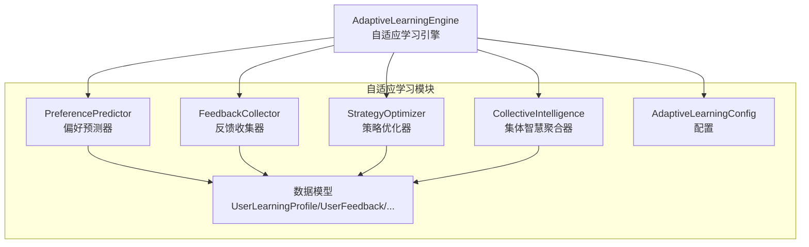
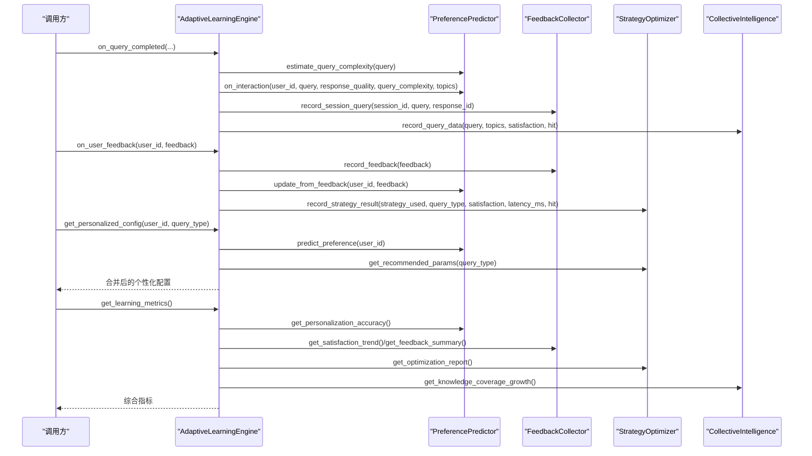
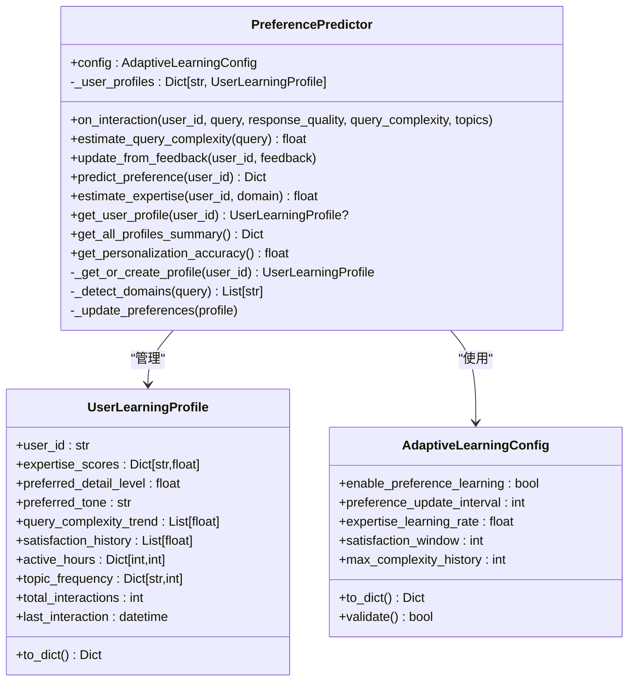
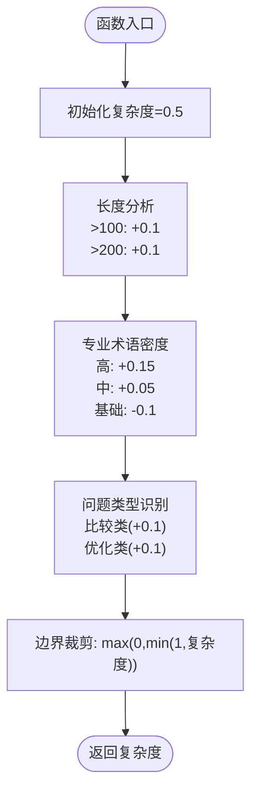
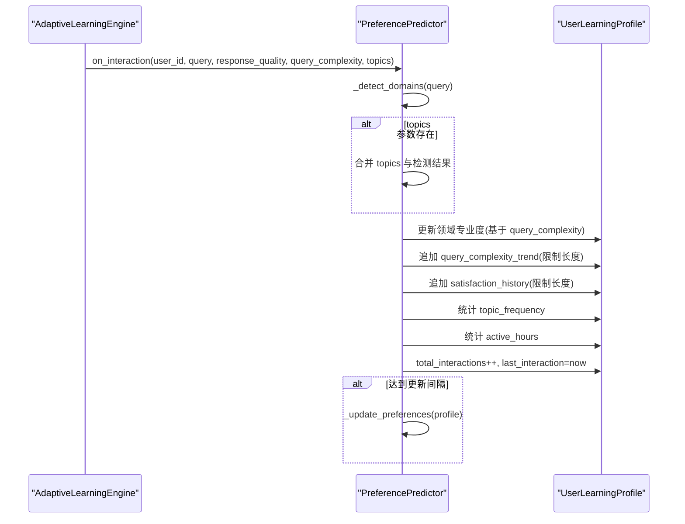
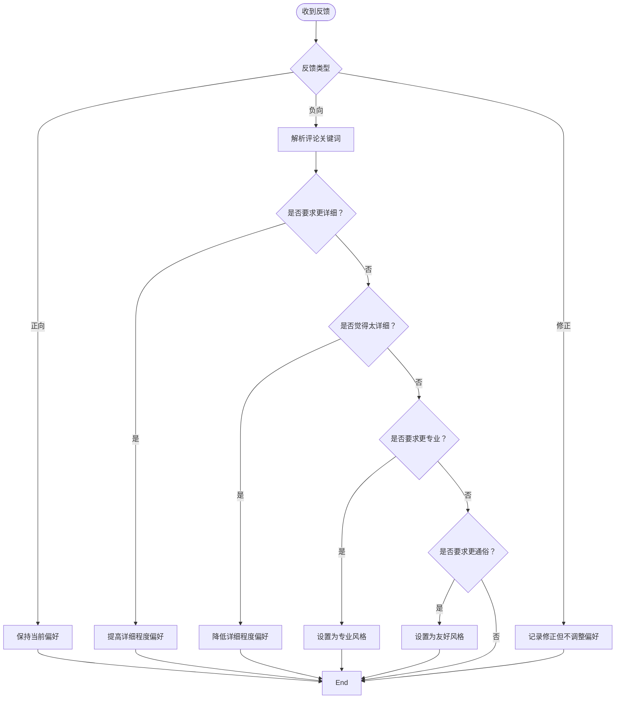
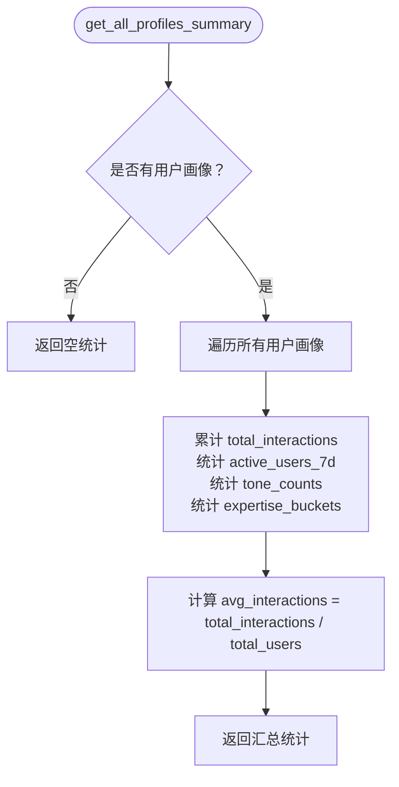
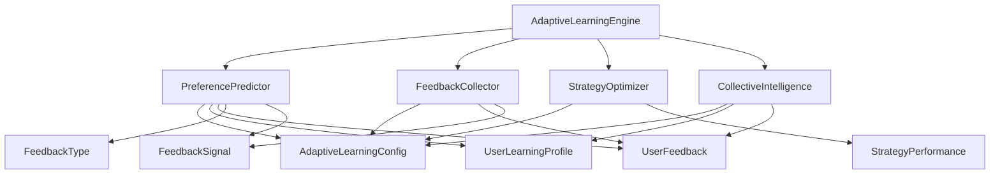

# 偏好预测系统

<cite>
**本文档引用的文件**
- [preference_predictor.py](file://src/adaptive/preference_predictor.py)
- [models.py](file://src/adaptive/models.py)
- [engine.py](file://src/adaptive/engine.py)
- [feedback.py](file://src/adaptive/feedback.py)
- [strategy_optimizer.py](file://src/adaptive/strategy_optimizer.py)
- [collective.py](file://src/adaptive/collective.py)
- [config.py](file://src/adaptive/config.py)
- [README.md](file://src/adaptive/README.md)
</cite>

## 目录
1. [简介](#简介)
2. [项目结构](#项目结构)
3. [核心组件](#核心组件)
4. [架构总览](#架构总览)
5. [详细组件分析](#详细组件分析)
6. [依赖关系分析](#依赖关系分析)
7. [性能考量](#性能考量)
8. [故障排查指南](#故障排查指南)
9. [结论](#结论)
10. [附录](#附录)

## 简介
本文件面向偏好预测系统，围绕 PreferencePredictor 类的机器学习架构与用户画像建模机制进行深入技术说明。内容涵盖：
- 用户偏好特征提取与预测算法实现
- 查询复杂度估计 estimate_query_complexity 的算法设计（查询长度分析、关键词密度计算、主题分布评估）
- 用户交互处理 on_interaction 的实时学习机制（交互数据收集、偏好特征更新、模型参数调整）
- 显式反馈更新 update_from_feedback 的反馈驱动学习策略（反馈权重计算、偏好偏移调整）
- 用户画像管理 get_user_profile 的用户状态跟踪机制（活跃度评估、偏好历史分析、画像完整性检查）
- 偏好预测 predict_preference 的个性化配置生成（专家水平估计、详细程度偏好、响应风格预测）
- 查询类型识别的上下文感知机制
- 用户偏好准确性评估 get_personalization_accuracy 的模型性能监控
- 用户画像汇总 get_all_profiles_summary 的批量数据分析功能

## 项目结构
偏好预测系统位于 src/adaptive 目录，核心文件如下：
- preference_predictor.py：偏好预测器主体，包含用户画像、偏好预测、复杂度估计、反馈更新等逻辑
- models.py：数据模型定义（用户画像、反馈、策略表现等）
- engine.py：自适应学习引擎，协调反馈收集、偏好预测、策略优化、集体智慧
- feedback.py：反馈收集器，负责显式/隐式反馈采集与分析
- strategy_optimizer.py：策略优化器，基于在线学习为不同查询类型选择最优检索策略
- collective.py：集体智慧聚合器，从全局视角提炼知识盲点、最佳实践与趋势
- config.py：配置类，集中管理学习开关、学习速率、窗口大小等参数

图表来源
- [engine.py:30-121](file://src/adaptive/engine.py#L30-L121)
- [preference_predictor.py:21-62](file://src/adaptive/preference_predictor.py#L21-L62)
- [feedback.py:19-38](file://src/adaptive/feedback.py#L19-L38)
- [strategy_optimizer.py:19-76](file://src/adaptive/strategy_optimizer.py#L19-L76)
- [collective.py:26-60](file://src/adaptive/collective.py#L26-L60)
- [config.py:15-60](file://src/adaptive/config.py#L15-L60)
- [models.py:124-160](file://src/adaptive/models.py#L124-L160)

章节来源
- [engine.py:30-121](file://src/adaptive/engine.py#L30-L121)
- [preference_predictor.py:21-62](file://src/adaptive/preference_predictor.py#L21-L62)
- [feedback.py:19-38](file://src/adaptive/feedback.py#L19-L38)
- [strategy_optimizer.py:19-76](file://src/adaptive/strategy_optimizer.py#L19-L76)
- [collective.py:26-60](file://src/adaptive/collective.py#L26-L60)
- [config.py:15-60](file://src/adaptive/config.py#L15-L60)
- [models.py:124-160](file://src/adaptive/models.py#L124-L160)

## 核心组件
- PreferencePredictor：用户偏好预测器，负责用户画像构建与维护、偏好预测、查询复杂度估计、显式反馈更新、个性化配置生成、画像汇总与准确性评估
- FeedbackCollector：反馈收集器，负责显式/隐式反馈采集、满意度趋势分析、反馈模式分析
- StrategyOptimizer：策略优化器，基于在线学习为不同查询类型选择最优检索策略
- CollectiveIntelligence：集体智慧聚合器，从全局视角提炼知识盲点、最佳实践与趋势
- AdaptiveLearningEngine：统一协调器，整合上述子系统，提供查询完成回调、用户反馈处理、个性化配置生成、学习指标与仪表盘数据

章节来源
- [preference_predictor.py:21-62](file://src/adaptive/preference_predictor.py#L21-L62)
- [feedback.py:19-38](file://src/adaptive/feedback.py#L19-L38)
- [strategy_optimizer.py:19-76](file://src/adaptive/strategy_optimizer.py#L19-L76)
- [collective.py:26-60](file://src/adaptive/collective.py#L26-L60)
- [engine.py:30-121](file://src/adaptive/engine.py#L30-L121)

## 架构总览
PreferencePredictor 与 AdaptiveLearningEngine 的交互关系如下：

图表来源
- [engine.py:122-196](file://src/adaptive/engine.py#L122-L196)
- [engine.py:198-244](file://src/adaptive/engine.py#L198-L244)
- [engine.py:278-337](file://src/adaptive/engine.py#L278-L337)
- [engine.py:339-372](file://src/adaptive/engine.py#L339-L372)
- [preference_predictor.py:301-338](file://src/adaptive/preference_predictor.py#L301-L338)
- [preference_predictor.py:225-268](file://src/adaptive/preference_predictor.py#L225-L268)
- [feedback.py:39-65](file://src/adaptive/feedback.py#L39-L65)
- [strategy_optimizer.py:93-154](file://src/adaptive/strategy_optimizer.py#L93-L154)
- [collective.py:61-92](file://src/adaptive/collective.py#L61-L92)

章节来源
- [engine.py:122-196](file://src/adaptive/engine.py#L122-L196)
- [engine.py:198-244](file://src/adaptive/engine.py#L198-L244)
- [engine.py:278-337](file://src/adaptive/engine.py#L278-L337)
- [engine.py:339-372](file://src/adaptive/engine.py#L339-L372)
- [preference_predictor.py:301-338](file://src/adaptive/preference_predictor.py#L301-L338)
- [preference_predictor.py:225-268](file://src/adaptive/preference_predictor.py#L225-L268)
- [feedback.py:39-65](file://src/adaptive/feedback.py#L39-L65)
- [strategy_optimizer.py:93-154](file://src/adaptive/strategy_optimizer.py#L93-L154)
- [collective.py:61-92](file://src/adaptive/collective.py#L61-L92)

## 详细组件分析

### PreferencePredictor 类分析
PreferencePredictor 是偏好预测系统的核心，负责用户画像建模、偏好预测、查询复杂度估计与反馈驱动学习。

图表来源
- [preference_predictor.py:21-62](file://src/adaptive/preference_predictor.py#L21-L62)
- [preference_predictor.py:58-62](file://src/adaptive/preference_predictor.py#L58-L62)
- [preference_predictor.py:130-149](file://src/adaptive/preference_predictor.py#L130-L149)
- [preference_predictor.py:151-173](file://src/adaptive/preference_predictor.py#L151-L173)
- [models.py:124-160](file://src/adaptive/models.py#L124-L160)
- [config.py:15-60](file://src/adaptive/config.py#L15-L60)

章节来源
- [preference_predictor.py:21-62](file://src/adaptive/preference_predictor.py#L21-L62)
- [preference_predictor.py:58-62](file://src/adaptive/preference_predictor.py#L58-L62)
- [preference_predictor.py:130-149](file://src/adaptive/preference_predictor.py#L130-L149)
- [preference_predictor.py:151-173](file://src/adaptive/preference_predictor.py#L151-L173)
- [models.py:124-160](file://src/adaptive/models.py#L124-L160)
- [config.py:15-60](file://src/adaptive/config.py#L15-L60)

#### 查询复杂度估计 estimate_query_complexity
算法设计要点：
- 基于查询长度：超过阈值时增加复杂度权重
- 基于专业术语密度：按级别（高/中/低）对复杂度进行加权
- 基于问题类型：识别比较类、优化类问题时提高复杂度
- 边界裁剪：最终复杂度限制在 [0,1]

图表来源
- [preference_predictor.py:301-338](file://src/adaptive/preference_predictor.py#L301-L338)

章节来源
- [preference_predictor.py:301-338](file://src/adaptive/preference_predictor.py#L301-L338)

#### 用户交互处理 on_interaction 的实时学习机制
处理流程：
- 专业度估计更新：基于查询复杂度趋势对领域专业度进行调整
- 查询复杂度趋势记录：维护最近 N 次复杂度，限制历史长度
- 满意度历史记录：维护最近窗口的满意度，限制历史长度
- 主题频率统计：统计用户关注主题的出现频次
- 活跃时间段统计：统计用户活跃小时分布
- 总交互次数与最后交互时间更新
- 定期偏好更新：达到更新间隔时触发偏好更新

图表来源
- [preference_predictor.py:64-128](file://src/adaptive/preference_predictor.py#L64-L128)
- [preference_predictor.py:151-173](file://src/adaptive/preference_predictor.py#L151-L173)

章节来源
- [preference_predictor.py:64-128](file://src/adaptive/preference_predictor.py#L64-L128)
- [preference_predictor.py:151-173](file://src/adaptive/preference_predictor.py#L151-L173)

#### 显式反馈更新 update_from_feedback 的反馈驱动学习策略
策略要点：
- 正反馈：保持当前偏好（轻微强化）
- 负反馈：根据评论关键词调整偏好
  - “太详细/简洁/啰嗦” → 降低详细程度偏好
  - “不够详细/更多/展开” → 提高详细程度偏好
  - “太专业/看不懂/通俗” → 调整为友好风格
  - “太基础/深入/专业” → 调整为专业风格
- 修正反馈：记录但不直接调整偏好

图表来源
- [preference_predictor.py:225-268](file://src/adaptive/preference_predictor.py#L225-L268)

章节来源
- [preference_predictor.py:225-268](file://src/adaptive/preference_predictor.py#L225-L268)

#### 用户画像管理 get_user_profile 与 get_all_profiles_summary
- get_user_profile：返回指定用户的用户画像对象，不存在则返回 None
- get_all_profiles_summary：批量统计所有用户画像，包括：
  - 总用户数
  - 近7天活跃用户数
  - 平均交互次数
  - 专业度分布（初学者/中级/高级）
  - 响应风格分布

图表来源
- [preference_predictor.py:352-401](file://src/adaptive/preference_predictor.py#L352-L401)

章节来源
- [preference_predictor.py:352-401](file://src/adaptive/preference_predictor.py#L352-L401)

#### 偏好预测 predict_preference 的个性化配置生成
预测逻辑：
- 若用户数据不足（交互次数 < 3），返回默认偏好
- 否则计算：
  - 专家水平：领域专业度的平均值
  - Top 兴趣：按主题频率排序取前5
  - 偏好格式：基于详细程度偏好判断（详尽/简洁/结构化）
- 返回包含详细程度、风格、专家水平、Top 兴趣、偏好格式与是否默认标记的字典

章节来源
- [preference_predictor.py:174-223](file://src/adaptive/preference_predictor.py#L174-L223)

#### 用户偏好准确性评估 get_personalization_accuracy
- 基于用户满意度历史计算全局个性化准确度
- 计算每个用户的平均满意度，再对所有用户取平均

章节来源
- [preference_predictor.py:403-426](file://src/adaptive/preference_predictor.py#L403-L426)

### AdaptiveLearningEngine 组件分析
AdaptiveLearningEngine 作为统一协调器，将偏好预测、反馈收集、策略优化与集体智慧整合在一起，并提供：
- 查询完成回调：记录策略效果、更新用户画像、记录会话查询、记录集体智慧数据
- 用户反馈处理：记录反馈、更新偏好、更新策略（若包含策略信息）
- 个性化配置生成：合并用户偏好与最优策略参数
- 学习指标：满意度趋势、策略优化收益、个性化准确度、知识覆盖增长
- 仪表盘数据：指标、反馈汇总、策略表现、用户画像汇总、集体智慧洞察

章节来源
- [engine.py:122-196](file://src/adaptive/engine.py#L122-L196)
- [engine.py:198-244](file://src/adaptive/engine.py#L198-L244)
- [engine.py:278-337](file://src/adaptive/engine.py#L278-L337)
- [engine.py:339-372](file://src/adaptive/engine.py#L339-L372)
- [engine.py:408-447](file://src/adaptive/engine.py#L408-L447)

### FeedbackCollector 组件分析
- 反馈记录：显式反馈入库，维护索引与历史长度
- 会话查询记录：用于检测隐式反馈
- 隐式反馈检测：基于查询相似度与追问关键词判断
- 满意度趋势：按时间窗口比较前后两阶段平均满意度
- 反馈汇总与模式分析：按查询类型、小时分布、修正模式等统计

章节来源
- [feedback.py:39-65](file://src/adaptive/feedback.py#L39-L65)
- [feedback.py:67-95](file://src/adaptive/feedback.py#L67-L95)
- [feedback.py:96-170](file://src/adaptive/feedback.py#L96-L170)
- [feedback.py:198-239](file://src/adaptive/feedback.py#L198-L239)
- [feedback.py:241-284](file://src/adaptive/feedback.py#L241-L284)
- [feedback.py:286-349](file://src/adaptive/feedback.py#L286-L349)
- [feedback.py:351-367](file://src/adaptive/feedback.py#L351-L367)
- [feedback.py:369-397](file://src/adaptive/feedback.py#L369-L397)

### StrategyOptimizer 组件分析
- 策略表现记录：维护每种策略在不同查询类型下的表现统计
- 在线权重更新：基于奖励（满意度-0.5）增量更新策略权重
- 探索-利用：使用 ε-greedy 在探索与利用之间平衡
- 推荐参数：根据查询类型微调检索参数（如 top_k、置信度阈值）

章节来源
- [strategy_optimizer.py:93-154](file://src/adaptive/strategy_optimizer.py#L93-L154)
- [strategy_optimizer.py:156-197](file://src/adaptive/strategy_optimizer.py#L156-L197)
- [strategy_optimizer.py:198-232](file://src/adaptive/strategy_optimizer.py#L198-L232)
- [strategy_optimizer.py:265-289](file://src/adaptive/strategy_optimizer.py#L265-L289)

### CollectiveIntelligence 组件分析
- 查询数据记录：统计主题频率与低满意度主题
- 知识盲区识别：识别低满意度主题并分级
- 最佳实践提取：基于反馈与查询模式提取最佳实践
- 趋势检测：识别热门话题趋势
- 洞察生成：综合生成知识盲区、最佳实践、趋势与用户群体洞察

章节来源
- [collective.py:61-92](file://src/adaptive/collective.py#L61-L92)
- [collective.py:124-153](file://src/adaptive/collective.py#L124-L153)
- [collective.py:155-201](file://src/adaptive/collective.py#L155-L201)
- [collective.py:203-230](file://src/adaptive/collective.py#L203-L230)
- [collective.py:232-322](file://src/adaptive/collective.py#L232-L322)
- [collective.py:324-356](file://src/adaptive/collective.py#L324-L356)
- [collective.py:358-377](file://src/adaptive/collective.py#L358-L377)

## 依赖关系分析
PreferencePredictor 与其他组件的依赖关系如下：

图表来源
- [preference_predictor.py:14-15](file://src/adaptive/preference_predictor.py#L14-L15)
- [engine.py:12-24](file://src/adaptive/engine.py#L12-L24)
- [feedback.py:12-13](file://src/adaptive/feedback.py#L12-L13)
- [strategy_optimizer.py:12-13](file://src/adaptive/strategy_optimizer.py#L12-L13)
- [collective.py:15-20](file://src/adaptive/collective.py#L15-L20)
- [models.py:14-25](file://src/adaptive/models.py#L14-L25)
- [models.py:85-100](file://src/adaptive/models.py#L85-L100)
- [models.py:124-160](file://src/adaptive/models.py#L124-L160)

章节来源
- [preference_predictor.py:14-15](file://src/adaptive/preference_predictor.py#L14-L15)
- [engine.py:12-24](file://src/adaptive/engine.py#L12-L24)
- [feedback.py:12-13](file://src/adaptive/feedback.py#L12-L13)
- [strategy_optimizer.py:12-13](file://src/adaptive/strategy_optimizer.py#L12-L13)
- [collective.py:15-20](file://src/adaptive/collective.py#L15-L20)
- [models.py:14-25](file://src/adaptive/models.py#L14-L25)
- [models.py:85-100](file://src/adaptive/models.py#L85-L100)
- [models.py:124-160](file://src/adaptive/models.py#L124-L160)

## 性能考量
- 偏好更新频率：通过配置项 preference_update_interval 控制，避免过于频繁的更新导致抖动
- 历史窗口限制：query_complexity_trend 与 satisfaction_history 通过 max_complexity_history 与 satisfaction_window 限制长度，控制内存占用与计算开销
- 专业度学习速率：expertise_learning_rate 控制专业度估计的更新速度，过高可能导致震荡，过低收敛缓慢
- 字符串匹配与关键词查找：DOMAIN_KEYWORDS 与 PROFESSIONAL_TERMS 的查找复杂度与关键词数量相关，建议在高频场景下考虑预编译正则或建立倒排索引
- 反馈历史清理：FeedbackCollector 与 AdaptiveLearningEngine 的周期性优化会清理旧反馈，避免无限增长

## 故障排查指南
- 偏好预测不准确
  - 检查用户交互历史是否充足（至少 3 次交互）
  - 调整 expertise_learning_rate 与 preference_update_interval
  - 确认 topics 参数是否正确传递
- 反馈信号稀疏
  - 启用隐式反馈检测（implicit_feedback_enabled）
  - 主动请求反馈（如会话较长时）
  - 检查 FeedbackCollector 的 feedback_history_size 设置
- 策略优化收敛慢
  - 提高 strategy_learning_rate 与 exploration_rate
  - 确认 min_samples_for_optimization 设置合理
- 个性化准确度偏低
  - 检查 get_personalization_accuracy 的计算逻辑与满意度历史
  - 关注用户画像的活跃度与偏好稳定性

章节来源
- [preference_predictor.py:186-195](file://src/adaptive/preference_predictor.py#L186-L195)
- [config.py:28-40](file://src/adaptive/config.py#L28-L40)
- [feedback.py:46-47](file://src/adaptive/feedback.py#L46-L47)
- [strategy_optimizer.py:35-45](file://src/adaptive/strategy_optimizer.py#L35-L45)

## 结论
偏好预测系统通过 PreferencePredictor 的用户画像建模与偏好预测、AdaptiveLearningEngine 的统一协调、FeedbackCollector 的反馈采集与分析、StrategyOptimizer 的策略优化以及 CollectiveIntelligence 的全局洞察，实现了从单次交互到长期演进的多层次自适应学习。系统在保证实时性的同时，通过配置化参数与批量分析能力，提供了良好的可扩展性与可观测性。

## 附录
- 配置项说明
  - enable_preference_learning：是否启用偏好学习
  - preference_update_interval：偏好更新间隔
  - expertise_learning_rate：专业度学习速率
  - satisfaction_window：满意度滑动窗口
  - max_complexity_history：复杂度历史最大长度
  - enable_feedback_collection/implicit_feedback_enabled：反馈收集与隐式反馈开关
  - enable_strategy_optimization：策略优化开关
  - enable_collective_learning：集体学习开关
  - min_users_for_insight：生成洞察所需的最少用户数
  - insight_refresh_interval：洞察刷新间隔
  - max_insights：最大洞察数量
  - metrics_window_days/trend_comparison_ratio：指标计算窗口与趋势比较比例
  - max_interaction_history/interaction_retention_days：交互记录最大数量与保留天数

章节来源
- [config.py:23-60](file://src/adaptive/config.py#L23-L60)
- [config.py:85-155](file://src/adaptive/config.py#L85-L155)
- [config.py:157-192](file://src/adaptive/config.py#L157-L192)