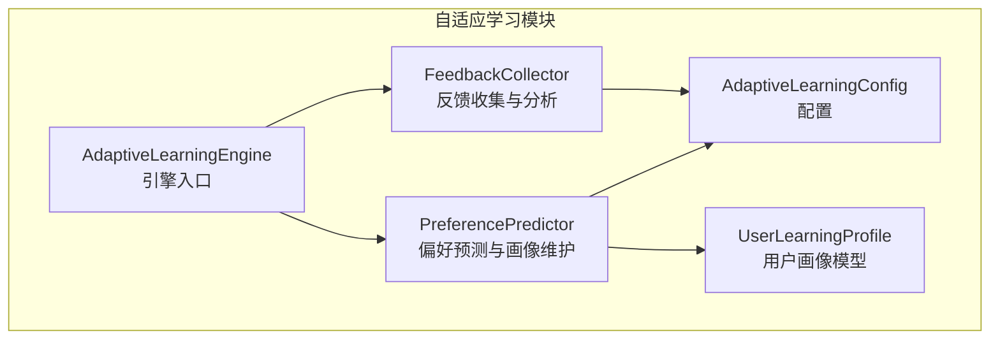
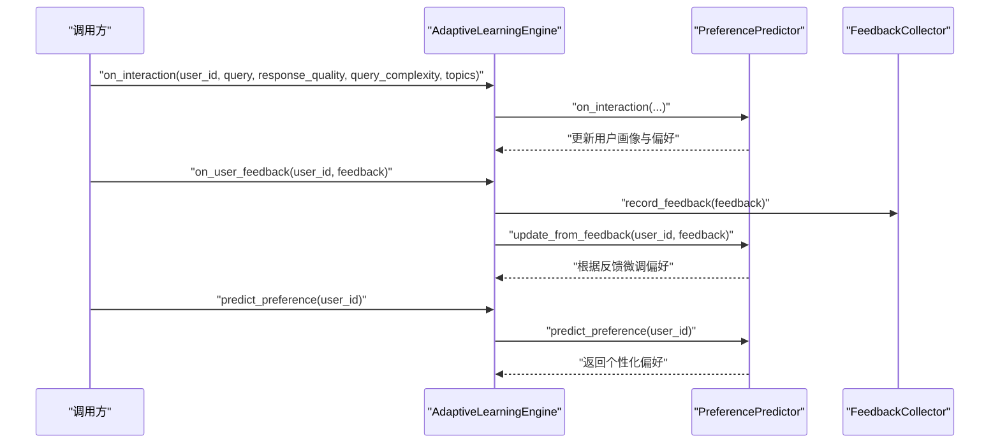
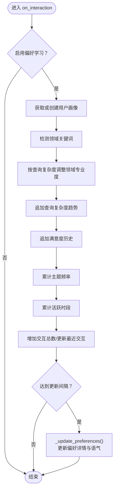
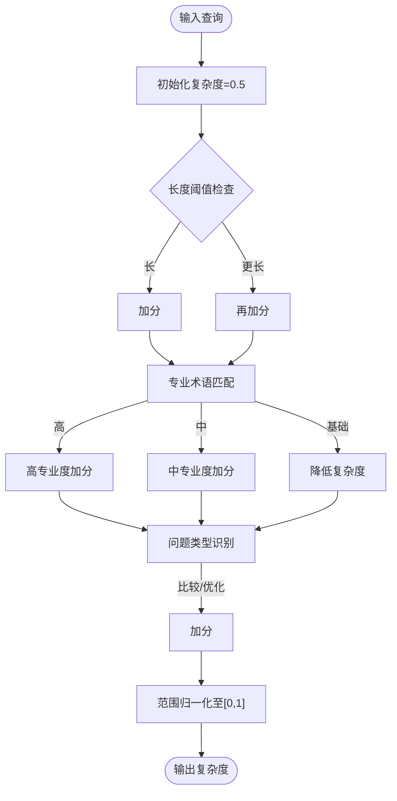
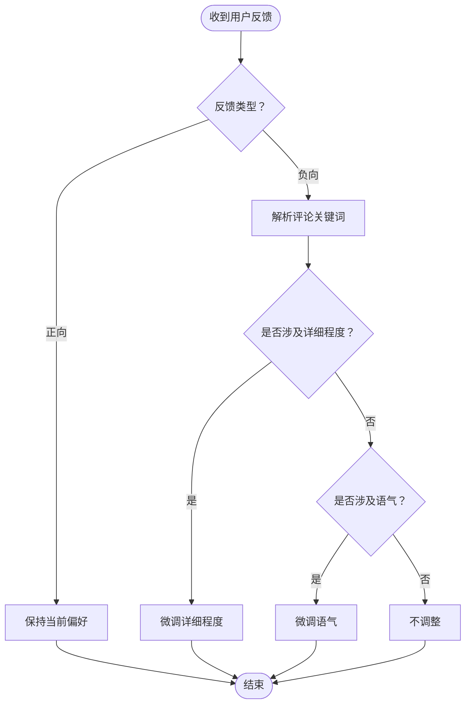
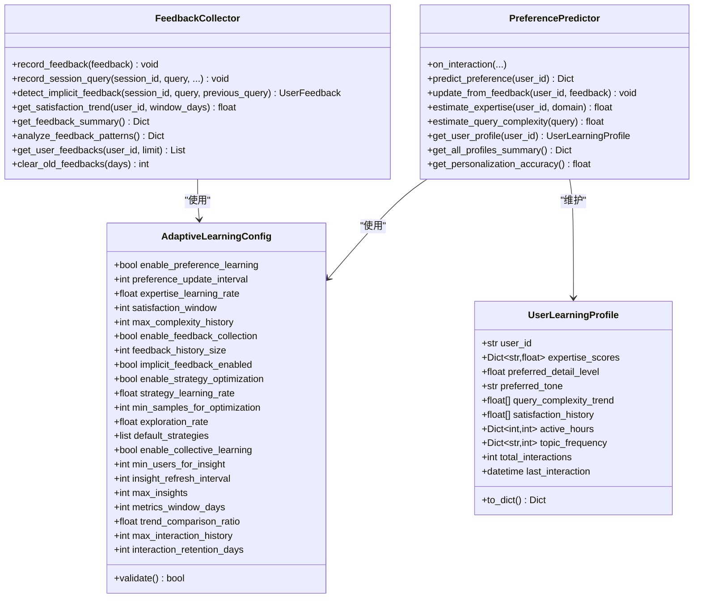

# 偏好预测系统

<cite>
**本文档引用的文件**
- [preference_predictor.py](file://src/adaptive/preference_predictor.py)
- [feedback.py](file://src/adaptive/feedback.py)
- [config.py](file://src/adaptive/config.py)
- [models.py](file://src/adaptive/models.py)
- [engine.py](file://src/adaptive/engine.py)
- [README.md](file://src/adaptive/README.md)
</cite>

## 目录
1. [简介](#简介)
2. [项目结构](#项目结构)
3. [核心组件](#核心组件)
4. [架构总览](#架构总览)
5. [详细组件分析](#详细组件分析)
6. [依赖关系分析](#依赖关系分析)
7. [性能考量](#性能考量)
8. [故障排查指南](#故障排查指南)
9. [结论](#结论)
10. [附录](#附录)

## 简介
本文件面向偏好预测系统，聚焦于PreferencePredictor的用户偏好建模算法与用户画像构建维护机制，详解查询复杂度估计、实时学习机制、反馈融合策略与学习率调节、个性化配置生成算法以及专家水平估算与自适应调整机制。同时给出完整的机器学习模型说明、训练数据要求与预测准确性评估建议，帮助读者快速理解并正确使用该系统。

## 项目结构
偏好预测系统位于src/adaptive目录，主要由以下模块组成：
- PreferencePredictor：用户偏好预测与画像维护
- FeedbackCollector：显式/隐式反馈收集与分析
- AdaptiveLearningConfig：自适应学习配置
- UserLearningProfile：用户画像数据模型
- AdaptiveLearningEngine：统一协调各子系统的引擎入口
- README：模块功能与使用说明

图表来源
- [engine.py:84-107](file://src/adaptive/engine.py#L84-L107)
- [preference_predictor.py:48-62](file://src/adaptive/preference_predictor.py#L48-L62)
- [feedback.py:27-38](file://src/adaptive/feedback.py#L27-L38)
- [config.py:15-60](file://src/adaptive/config.py#L15-L60)
- [models.py:124-160](file://src/adaptive/models.py#L124-L160)

章节来源
- [engine.py:84-107](file://src/adaptive/engine.py#L84-L107)
- [preference_predictor.py:48-62](file://src/adaptive/preference_predictor.py#L48-L62)
- [feedback.py:27-38](file://src/adaptive/feedback.py#L27-L38)
- [config.py:15-60](file://src/adaptive/config.py#L15-L60)
- [models.py:124-160](file://src/adaptive/models.py#L124-L160)

## 核心组件
- PreferencePredictor：负责用户画像构建与维护、偏好预测、查询复杂度估计、专家水平估算、反馈融合后的偏好更新。
- FeedbackCollector：负责显式/隐式反馈的收集、相似度检测、满意度趋势分析与反馈模式统计。
- AdaptiveLearningConfig：提供偏好学习、策略优化、反馈收集、集体学习等关键参数的配置与校验。
- UserLearningProfile：用户画像数据结构，包含领域专业度、偏好详情、复杂度趋势、满意度历史、主题频率、活跃时段等。
- AdaptiveLearningEngine：统一调度PreferencePredictor与FeedbackCollector，并在查询完成与收到用户反馈时触发相应流程。

章节来源
- [preference_predictor.py:21-62](file://src/adaptive/preference_predictor.py#L21-L62)
- [feedback.py:19-38](file://src/adaptive/feedback.py#L19-L38)
- [config.py:15-60](file://src/adaptive/config.py#L15-L60)
- [models.py:124-160](file://src/adaptive/models.py#L124-L160)
- [engine.py:84-107](file://src/adaptive/engine.py#L84-L107)

## 架构总览
偏好预测系统采用“引擎-子系统”架构，AdaptiveLearningEngine按需延迟初始化各子系统；PreferencePredictor与FeedbackCollector分别承担“画像维护/偏好预测”和“反馈收集/分析”的职责；配置项贯穿于两者之中，确保学习速率、窗口大小、阈值等参数的一致性。

图表来源
- [engine.py:180-243](file://src/adaptive/engine.py#L180-L243)
- [preference_predictor.py:64-128](file://src/adaptive/preference_predictor.py#L64-L128)
- [feedback.py:39-65](file://src/adaptive/feedback.py#L39-L65)

章节来源
- [engine.py:180-243](file://src/adaptive/engine.py#L180-L243)
- [preference_predictor.py:64-128](file://src/adaptive/preference_predictor.py#L64-L128)
- [feedback.py:39-65](file://src/adaptive/feedback.py#L39-L65)

## 详细组件分析

### PreferencePredictor：用户偏好建模与画像维护
- 用户画像构建与维护
  - 通过on_interaction记录每次交互，更新领域专业度、查询复杂度趋势、满意度历史、主题频率、活跃时段、交互总数与最近交互时间。
  - 每隔固定次数交互触发偏好更新，依据复杂度趋势与平均专业度确定偏好详情与语气。
- 偏好预测
  - predict_preference返回用户偏好详情：详细程度、语气、专家水平、Top兴趣、偏好格式与是否默认偏好。
  - 专家水平为各领域专业度的均值；Top兴趣来自主题频率排序。
- 查询复杂度估计
  - estimate_query_complexity基于查询长度、专业术语、问题类型（比较/优化类）进行加权评分，范围归一化至[0,1]。
- 专家水平估算
  - estimate_expertise结合领域专业度与近期复杂度趋势，采用加权平均得到最终专家水平。
- 反馈融合与偏好更新
  - update_from_feedback根据反馈类型与评论关键词微调偏好：对“详细程度”和“语气”进行小幅调整，避免过度抖动。

图表来源
- [preference_predictor.py:64-128](file://src/adaptive/preference_predictor.py#L64-L128)
- [preference_predictor.py:151-173](file://src/adaptive/preference_predictor.py#L151-L173)

章节来源
- [preference_predictor.py:64-128](file://src/adaptive/preference_predictor.py#L64-L128)
- [preference_predictor.py:151-173](file://src/adaptive/preference_predictor.py#L151-L173)
- [preference_predictor.py:225-268](file://src/adaptive/preference_predictor.py#L225-L268)
- [preference_predictor.py:301-338](file://src/adaptive/preference_predictor.py#L301-L338)
- [preference_predictor.py:270-299](file://src/adaptive/preference_predictor.py#L270-L299)

### 查询复杂度估计：文本分析与评分模型
- 输入：查询文本
- 特征提取：
  - 长度特征：超过阈值时逐步加分
  - 专业术语：按级别（高/中/低）加权
  - 问题类型：比较类、优化类问题额外加分
- 评分范围归一化至[0,1]
- 适用场景：指导专家水平估算与偏好更新

图表来源
- [preference_predictor.py:301-338](file://src/adaptive/preference_predictor.py#L301-L338)

章节来源
- [preference_predictor.py:301-338](file://src/adaptive/preference_predictor.py#L301-L338)

### 实时学习机制：on_interaction的响应质量、复杂度与主题影响
- 响应质量：作为满意度历史的一部分，参与短期趋势分析与偏好更新
- 查询复杂度：直接影响领域专业度的调整幅度与方向
- 主题分布：用于扩展领域检测，丰富Top兴趣与偏好格式推断
- 更新节奏：通过配置项控制偏好更新频率，避免过于频繁导致抖动

章节来源
- [preference_predictor.py:64-128](file://src/adaptive/preference_predictor.py#L64-L128)
- [config.py:28-34](file://src/adaptive/config.py#L28-L34)

### 反馈融合策略与学习率调节：update_from_feedback
- 显式反馈：正反馈保持现状，负反馈根据评论关键词微调偏好
- 关键词驱动：
  - “详细/简洁/啰嗦”→调整详细程度
  - “专业/通俗/基础/深入”→调整语气
- 学习率调节：通过配置项控制专家度学习速率与偏好更新间隔，实现保守/积极两种模式

图表来源
- [preference_predictor.py:225-268](file://src/adaptive/preference_predictor.py#L225-L268)

章节来源
- [preference_predictor.py:225-268](file://src/adaptive/preference_predictor.py#L225-L268)
- [config.py:96-135](file://src/adaptive/config.py#L96-L135)

### 个性化配置生成：predict_preference的综合预测
- 输出字段：
  - detail_level：偏好详细程度（0~1）
  - tone：偏好语气（professional/friendly/balanced）
  - expertise_level：专家水平（0~1）
  - top_interests：Top兴趣领域
  - preferred_format：偏好格式（detailed/concise/structured）
  - is_default：是否为默认偏好
- 生成逻辑：
  - 专家水平=各领域专业度均值
  - Top兴趣=主题频率排序Top5
  - 偏好格式=基于详细程度阈值推断

章节来源
- [preference_predictor.py:174-223](file://src/adaptive/preference_predictor.py#L174-L223)

### 专家水平估算：estimate_expertise的技能评估与自适应调整
- 输入：用户ID、领域（默认general）
- 评估依据：
  - 领域专业度得分
  - 近期查询复杂度趋势（加权）
- 输出：0~1之间的专家水平，用于个性化参数调整（如top_k）

章节来源
- [preference_predictor.py:270-299](file://src/adaptive/preference_predictor.py#L270-L299)

### 机器学习模型说明、训练数据要求与预测准确性评估
- 模型说明
  - PreferencePredictor当前实现以规则与统计为主，未包含深度学习模型。若启用深度分析，需满足足够样本量与特征工程。
- 训练数据要求
  - 偏好学习：至少3次交互以上才进行预测；建议积累至少min_samples_for_optimization级别的样本以稳定策略优化。
  - 反馈融合：隐式反馈依赖会话历史与相似度计算，建议开启implicit_feedback_enabled并合理设置反馈历史窗口。
- 预测准确性评估
  - 个性化准确度可通过满意度历史计算，作为短期指标之一；长期指标可结合全局满意度趋势与策略改进幅度。

章节来源
- [preference_predictor.py:184-195](file://src/adaptive/preference_predictor.py#L184-L195)
- [preference_predictor.py:403-425](file://src/adaptive/preference_predictor.py#L403-L425)
- [config.py:157-192](file://src/adaptive/config.py#L157-L192)

## 依赖关系分析
- PreferencePredictor依赖AdaptiveLearningConfig与UserLearningProfile
- AdaptiveLearningEngine按配置延迟初始化PreferencePredictor与FeedbackCollector
- FeedbackCollector依赖AdaptiveLearningConfig与UserFeedback模型

图表来源
- [preference_predictor.py:48-62](file://src/adaptive/preference_predictor.py#L48-L62)
- [feedback.py:27-38](file://src/adaptive/feedback.py#L27-L38)
- [config.py:15-60](file://src/adaptive/config.py#L15-L60)
- [models.py:124-160](file://src/adaptive/models.py#L124-L160)

章节来源
- [preference_predictor.py:48-62](file://src/adaptive/preference_predictor.py#L48-L62)
- [feedback.py:27-38](file://src/adaptive/feedback.py#L27-L38)
- [config.py:15-60](file://src/adaptive/config.py#L15-L60)
- [models.py:124-160](file://src/adaptive/models.py#L124-L160)

## 性能考量
- 偏好更新频率：通过preference_update_interval控制，避免频繁更新带来的抖动
- 历史窗口：satisfaction_window与max_complexity_history限制内存占用与计算开销
- 专家度学习速率：expertise_learning_rate决定调整幅度，过高易震荡，过低收敛慢
- 隐式反馈：开启implicit_feedback_enabled会增加相似度计算成本，建议结合业务场景权衡

## 故障排查指南
- 偏好预测不准确
  - 增加交互样本数量，确保至少3次交互以上
  - 调整特征工程（如加入时间、复杂度等），必要时启用深度分析
- 策略优化收敛慢
  - 提高学习率与探索率，或切换到更高效的采样策略
- 反馈信号稀疏
  - 主动请求反馈，启用隐式反馈跟踪，或迁移学习（从相似用户）

章节来源
- [README.md:530-575](file://src/adaptive/README.md#L530-L575)

## 结论
PreferencePredictor通过规则与统计相结合的方式实现了用户画像的构建与维护，支持查询复杂度估计、专家水平估算与个性化偏好生成。配合AdaptiveLearningEngine与FeedbackCollector，系统形成了从交互记录到偏好更新再到策略优化的完整闭环。对于大规模部署，建议结合配置项进行参数调优，并在具备足够样本时考虑引入深度学习模型以提升预测精度。

## 附录
- 配置项一览（节选）
  - enable_preference_learning：启用偏好学习
  - preference_update_interval：偏好更新间隔
  - expertise_learning_rate：专家度学习速率
  - satisfaction_window：满意度滑动窗口
  - max_complexity_history：复杂度历史长度
  - enable_feedback_collection：启用反馈收集
  - feedback_history_size：反馈历史容量
  - implicit_feedback_enabled：启用隐式反馈
  - enable_strategy_optimization：启用策略优化
  - strategy_learning_rate：策略学习速率
  - min_samples_for_optimization：最小优化样本数
  - exploration_rate：探索率
  - enable_collective_learning：启用集体学习
  - min_users_for_insight：洞察生成最少用户数
  - insight_refresh_interval：洞察刷新间隔
  - max_insights：最大洞察数量
  - metrics_window_days：指标计算窗口
  - trend_comparison_ratio：趋势对比比例
  - max_interaction_history：交互记录最大数量
  - interaction_retention_days：交互记录保留天数

章节来源
- [config.py:23-60](file://src/adaptive/config.py#L23-L60)
- [config.py:157-192](file://src/adaptive/config.py#L157-L192)