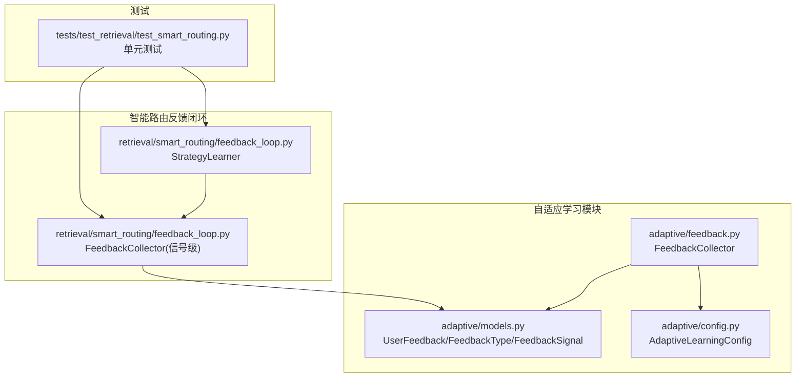
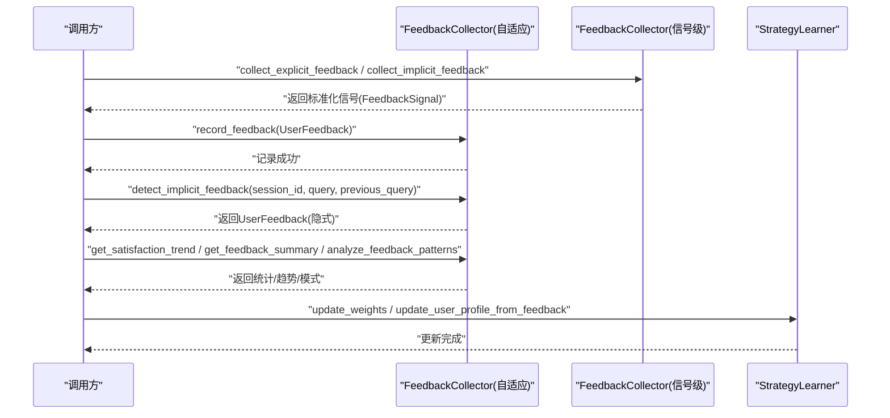
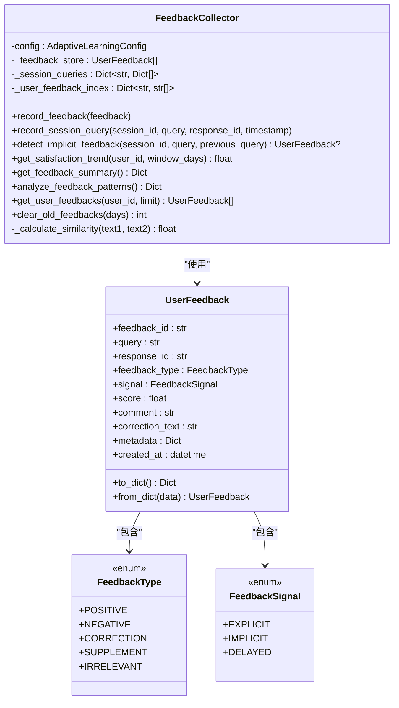
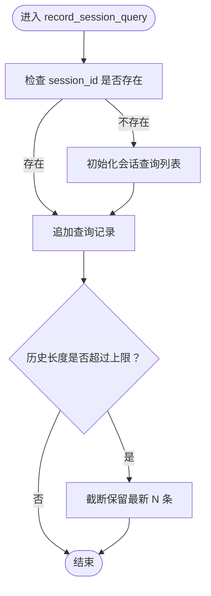
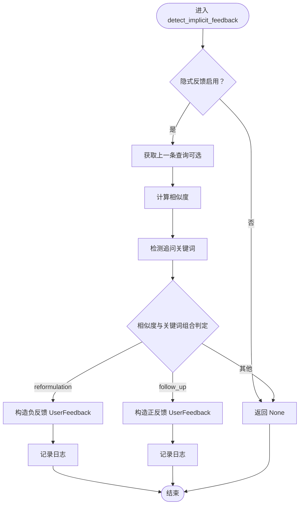
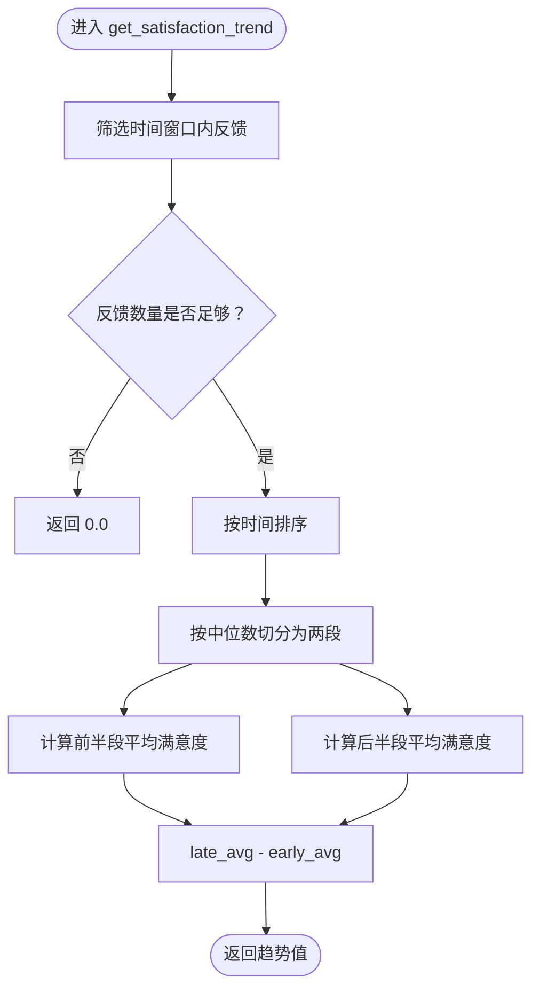
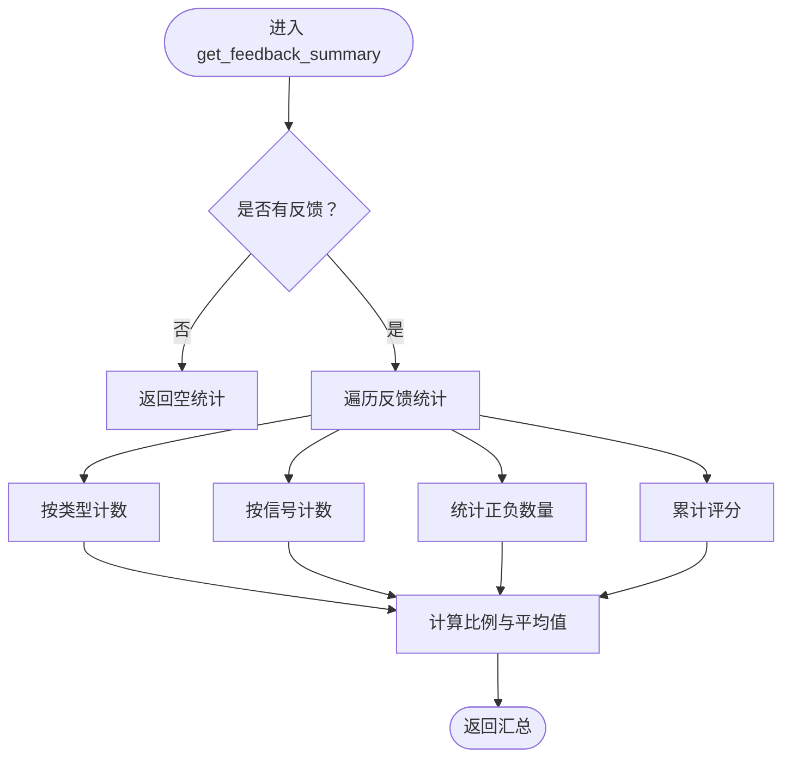
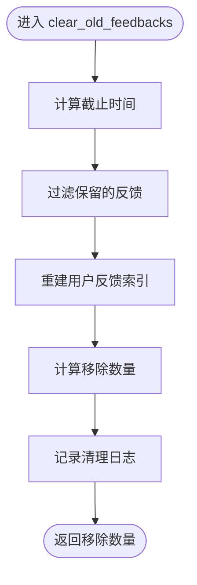
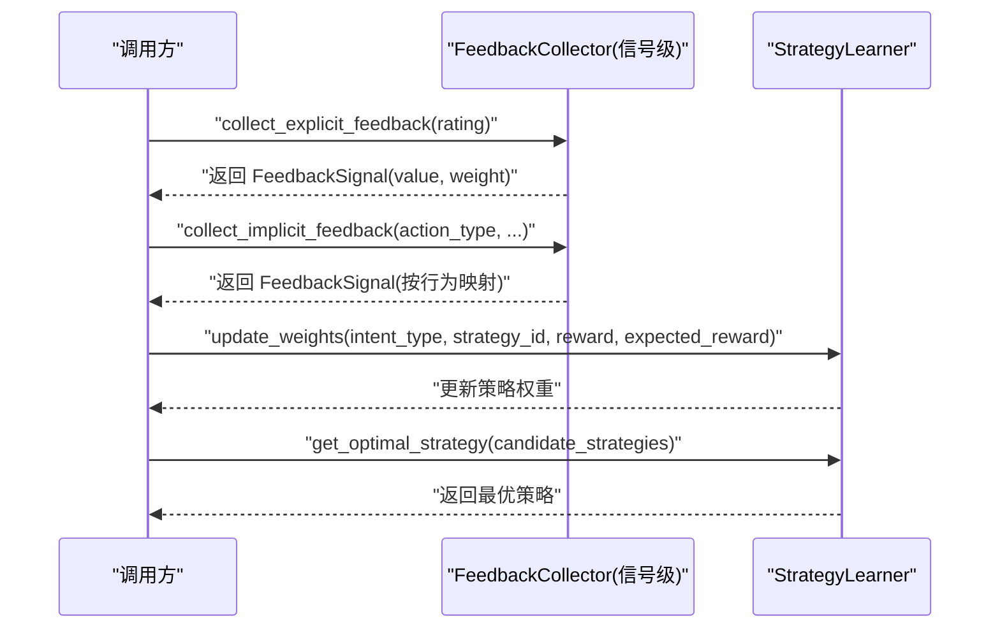
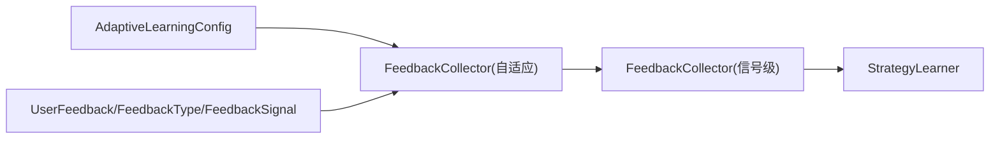

# 反馈收集系统

<cite>
**本文档引用的文件**
- [src/adaptive/feedback.py](file://src/adaptive/feedback.py)
- [src/adaptive/models.py](file://src/adaptive/models.py)
- [src/adaptive/config.py](file://src/adaptive/config.py)
- [src/retrieval/smart_routing/feedback_loop.py](file://src/retrieval/smart_routing/feedback_loop.py)
- [tests/test_retrieval/test_smart_routing.py](file://tests/test_retrieval/test_smart_routing.py)
</cite>

## 目录
1. [简介](#简介)
2. [项目结构](#项目结构)
3. [核心组件](#核心组件)
4. [架构总览](#架构总览)
5. [详细组件分析](#详细组件分析)
6. [依赖关系分析](#依赖关系分析)
7. [性能考量](#性能考量)
8. [故障排查指南](#故障排查指南)
9. [结论](#结论)

## 简介
本文件面向“反馈收集系统”的技术文档，聚焦于 FeedbackCollector 类的设计架构与反馈数据管理机制，涵盖显式反馈与隐式反馈的收集策略、用户行为分析算法（会话查询模式识别、隐式反馈检测机制、用户满意度趋势分析）、反馈数据结构设计（UserFeedback 模型、FeedbackType 枚举、FeedbackSignal 信号类型与元数据管理）、会话查询记录 record_session_query 的会话状态跟踪机制（会话 ID 生成、查询序列分析与行为模式识别）、隐式反馈检测算法实现（查询相似度分析、用户行为时间窗口与反馈信号提取）、反馈清理机制 clear_old_feedbacks 的存储管理与数据保留策略、反馈摘要生成 get_feedback_summary 的统计分析功能、反馈模式分析 analyze_feedback_patterns 的行为特征挖掘，以及反馈质量评估与数据完整性验证机制。

## 项目结构
反馈收集系统主要分布在以下模块：
- 自适应学习模块（adaptive）：包含 FeedbackCollector、UserFeedback 数据模型、配置与指标
- 智能路由反馈闭环模块（retrieval/smart_routing）：包含另一个 FeedbackCollector（信号级）与策略学习器
- 测试模块（tests/test_retrieval/test_smart_routing.py）：覆盖显式反馈、隐式反馈与策略学习的单元测试

图表来源
- [src/adaptive/feedback.py:19-398](file://src/adaptive/feedback.py#L19-L398)
- [src/adaptive/models.py:14-258](file://src/adaptive/models.py#L14-L258)
- [src/adaptive/config.py:15-200](file://src/adaptive/config.py#L15-L200)
- [src/retrieval/smart_routing/feedback_loop.py:30-435](file://src/retrieval/smart_routing/feedback_loop.py#L30-L435)
- [tests/test_retrieval/test_smart_routing.py:220-273](file://tests/test_retrieval/test_smart_routing.py#L220-L273)

章节来源
- [src/adaptive/feedback.py:19-398](file://src/adaptive/feedback.py#L19-L398)
- [src/adaptive/models.py:14-258](file://src/adaptive/models.py#L14-L258)
- [src/adaptive/config.py:15-200](file://src/adaptive/config.py#L15-L200)
- [src/retrieval/smart_routing/feedback_loop.py:30-435](file://src/retrieval/smart_routing/feedback_loop.py#L30-L435)
- [tests/test_retrieval/test_smart_routing.py:220-273](file://tests/test_retrieval/test_smart_routing.py#L220-L273)

## 核心组件
- FeedbackCollector（自适应学习模块）：负责显式与隐式反馈的收集、存储、会话查询记录、隐式反馈检测、满意度趋势分析、反馈汇总统计、模式分析与旧数据清理。
- FeedbackCollector（智能路由模块）：负责显式评分与多种隐式信号（查询改写、会话放弃、再次搜索、停留时长、引用行为）的信号标准化与权重处理。
- UserFeedback 数据模型：统一的反馈载体，包含反馈类型、信号来源、评分、评论、修正内容与元数据。
- FeedbackType/FeedbackSignal 枚举：定义反馈类型与信号来源，确保系统一致性。
- AdaptiveLearningConfig：控制反馈收集、偏好学习、策略优化、集体智慧与指标计算的配置项。

章节来源
- [src/adaptive/feedback.py:19-398](file://src/adaptive/feedback.py#L19-L398)
- [src/retrieval/smart_routing/feedback_loop.py:30-435](file://src/retrieval/smart_routing/feedback_loop.py#L30-L435)
- [src/adaptive/models.py:14-258](file://src/adaptive/models.py#L14-L258)
- [src/adaptive/config.py:15-200](file://src/adaptive/config.py#L15-L200)

## 架构总览
反馈收集系统采用“双 Collector”架构：
- 自适应学习模块的 FeedbackCollector：面向学习闭环，维护 UserFeedback 列表与用户索引，支持会话查询记录、隐式反馈检测、满意度趋势与统计分析。
- 智能路由模块的 FeedbackCollector：面向实时信号收集，将用户行为转化为标准化信号（FeedbackSignal），并提供策略学习器进行在线权重更新。

图表来源
- [src/adaptive/feedback.py:39-398](file://src/adaptive/feedback.py#L39-L398)
- [src/retrieval/smart_routing/feedback_loop.py:57-294](file://src/retrieval/smart_routing/feedback_loop.py#L57-L294)
- [src/retrieval/smart_routing/feedback_loop.py:297-435](file://src/retrieval/smart_routing/feedback_loop.py#L297-L435)

## 详细组件分析

### FeedbackCollector（自适应学习模块）
- 设计目标：构建学习闭环，支持显式与隐式反馈的统一管理与分析。
- 关键职责：
  - 记录反馈：将 UserFeedback 存入内存列表，并维护用户 ID 到反馈 ID 的索引。
  - 会话查询记录：按会话 ID 维护查询序列，支持隐式反馈检测。
  - 隐式反馈检测：通过查询相似度与追问关键词判断隐式正/负反馈。
  - 满意度趋势分析：按时间窗口划分前后两段，计算平均满意度差值。
  - 反馈汇总统计：统计总数、正负比例、按类型与信号分布、平均评分。
  - 反馈模式分析：按查询类型满意度、小时活跃度、修正模式与低满意度查询进行分析。
  - 用户反馈查询：按用户 ID 获取其最近反馈。
  - 旧数据清理：按天数清理过期反馈并重建索引。

图表来源
- [src/adaptive/feedback.py:19-398](file://src/adaptive/feedback.py#L19-L398)
- [src/adaptive/models.py:38-82](file://src/adaptive/models.py#L38-L82)

章节来源
- [src/adaptive/feedback.py:39-398](file://src/adaptive/feedback.py#L39-L398)
- [src/adaptive/models.py:38-82](file://src/adaptive/models.py#L38-L82)

#### 会话查询记录与行为模式识别
- 会话 ID 生成：由调用方提供 session_id；若不存在则初始化空列表。
- 查询序列分析：每个会话维护最多固定长度的历史（如 50 条），记录查询、响应 ID 与时间戳。
- 行为模式识别：通过相似度阈值与追问关键词识别隐式反馈类型（reformulation/follow_up）。

图表来源
- [src/adaptive/feedback.py:67-95](file://src/adaptive/feedback.py#L67-L95)

章节来源
- [src/adaptive/feedback.py:67-95](file://src/adaptive/feedback.py#L67-L95)

#### 隐式反馈检测算法
- 相似度计算：基于字符集合重叠度，避免大小写影响与空字符串边界。
- 关键词检测：中文追问关键词集合，辅助判断深入程度。
- 反馈判定规则：
  - 相似度在中间区间 → reformulation → 负反馈
  - 存在追问关键词且相似度较低 → follow-up → 正反馈
  - 否则返回 None

图表来源
- [src/adaptive/feedback.py:96-171](file://src/adaptive/feedback.py#L96-L171)
- [src/adaptive/feedback.py:172-196](file://src/adaptive/feedback.py#L172-L196)

章节来源
- [src/adaptive/feedback.py:96-171](file://src/adaptive/feedback.py#L96-L171)
- [src/adaptive/feedback.py:172-196](file://src/adaptive/feedback.py#L172-L196)

#### 用户满意度趋势分析
- 时间窗口：默认 30 天，可按用户过滤。
- 划分策略：将反馈按时间排序后分为前后两段，分别计算平均满意度，返回差值作为趋势指标。

图表来源
- [src/adaptive/feedback.py:198-239](file://src/adaptive/feedback.py#L198-L239)

章节来源
- [src/adaptive/feedback.py:198-239](file://src/adaptive/feedback.py#L198-L239)

#### 反馈摘要统计与模式分析
- 汇总统计：计算总数、正负比例、按类型与信号分布、平均评分。
- 模式分析：按查询类型满意度、小时活跃度、修正模式与低满意度查询进行聚合与排序。

图表来源
- [src/adaptive/feedback.py:241-284](file://src/adaptive/feedback.py#L241-L284)

章节来源
- [src/adaptive/feedback.py:241-284](file://src/adaptive/feedback.py#L241-L284)

#### 旧数据清理与存储管理
- 清理策略：按天数阈值删除过期反馈，重建用户索引，返回清理数量。
- 保留策略：通过配置项控制历史大小与保留天数，避免无限增长。

图表来源
- [src/adaptive/feedback.py:369-397](file://src/adaptive/feedback.py#L369-L397)

章节来源
- [src/adaptive/feedback.py:369-397](file://src/adaptive/feedback.py#L369-L397)

### FeedbackCollector（智能路由模块）与策略学习器
- 显式反馈收集：将 1-5 分标准化到 [-1, 1]，封装为 FeedbackSignal。
- 隐式反馈收集：支持多种行为信号（查询改写、会话放弃、再次搜索、停留时长、引用行为），按行为强度映射为负/正反馈值。
- 信号权重：不同信号赋予不同权重，用于后续策略学习。
- 策略学习器：基于增量误差更新策略权重，支持最优策略选择与统计输出。

图表来源
- [src/retrieval/smart_routing/feedback_loop.py:57-294](file://src/retrieval/smart_routing/feedback_loop.py#L57-L294)
- [src/retrieval/smart_routing/feedback_loop.py:297-435](file://src/retrieval/smart_routing/feedback_loop.py#L297-L435)

章节来源
- [src/retrieval/smart_routing/feedback_loop.py:57-294](file://src/retrieval/smart_routing/feedback_loop.py#L57-L294)
- [src/retrieval/smart_routing/feedback_loop.py:297-435](file://src/retrieval/smart_routing/feedback_loop.py#L297-L435)

### 数据模型与元数据管理
- UserFeedback：统一反馈载体，包含唯一 ID、查询、响应 ID、反馈类型、信号来源、评分、评论、修正内容、元数据与创建时间；支持序列化/反序列化。
- FeedbackType：定义正向、负向、修正、补充、无关等反馈类型。
- FeedbackSignal：定义显式、隐式、延迟等信号来源。
- 元数据：用于承载用户 ID、查询类型、策略使用、命中情况、满意度等上下文信息，便于后续分析与策略优化。

章节来源
- [src/adaptive/models.py:14-258](file://src/adaptive/models.py#L14-L258)

## 依赖关系分析
- FeedbackCollector（自适应）依赖：
  - AdaptiveLearningConfig：控制开关与容量
  - UserFeedback/FeedbackType/FeedbackSignal：统一数据模型与枚举
- FeedbackCollector（信号级）依赖：
  - UserFeedback/FeedbackType/FeedbackSignal：复用数据模型
  - asyncio：异步存储与处理
- StrategyLearner 依赖：
  - FeedbackCollector（信号级）：接收标准化信号
  - 配置项：学习率、权重范围等

图表来源
- [src/adaptive/config.py:15-200](file://src/adaptive/config.py#L15-L200)
- [src/adaptive/feedback.py:19-398](file://src/adaptive/feedback.py#L19-L398)
- [src/retrieval/smart_routing/feedback_loop.py:30-435](file://src/retrieval/smart_routing/feedback_loop.py#L30-L435)

章节来源
- [src/adaptive/config.py:15-200](file://src/adaptive/config.py#L15-L200)
- [src/adaptive/feedback.py:19-398](file://src/adaptive/feedback.py#L19-L398)
- [src/retrieval/smart_routing/feedback_loop.py:30-435](file://src/retrieval/smart_routing/feedback_loop.py#L30-L435)

## 性能考量
- 内存存储：反馈与会话查询均采用内存列表，注意容量与清理策略。
- 时间复杂度：
  - 相似度计算：O(n+m)，n/m 为字符数
  - 趋势分析：O(n log n)（排序）+ O(n)（分段与求和）
  - 汇总统计/模式分析：O(n)
- 索引优化：按用户 ID 维护反馈 ID 列表，快速定位用户反馈。
- 异步处理：信号级收集使用异步存储，降低阻塞风险。

## 故障排查指南
- 隐式反馈未生效：
  - 检查配置项 implicit_feedback_enabled 是否开启
  - 确认会话查询记录是否正确传入 session_id 与 previous_query
- 相似度异常：
  - 检查输入文本是否为空或仅空白字符
  - 调整相似度阈值以匹配业务场景
- 满意度趋势为 0：
  - 确认时间窗口内反馈数量是否满足最低要求
  - 检查用户 ID 过滤条件
- 旧数据未清理：
  - 检查 days 参数与当前时间
  - 确认清理后索引重建逻辑执行

章节来源
- [src/adaptive/feedback.py:117-118](file://src/adaptive/feedback.py#L117-L118)
- [src/adaptive/feedback.py:224-225](file://src/adaptive/feedback.py#L224-L225)
- [src/adaptive/feedback.py:379-395](file://src/adaptive/feedback.py#L379-L395)

## 结论
反馈收集系统通过“双 Collector”架构实现了从信号级到学习级的完整闭环：信号级收集器负责将用户行为转化为标准化信号并进行权重处理，学习级收集器负责统一管理反馈、进行会话追踪与行为分析，并提供满意度趋势、统计汇总与模式分析能力。配合配置化的清理策略与完善的测试覆盖，系统在保证可扩展性的同时兼顾了实用性与稳定性。