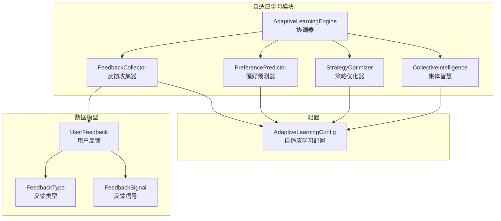
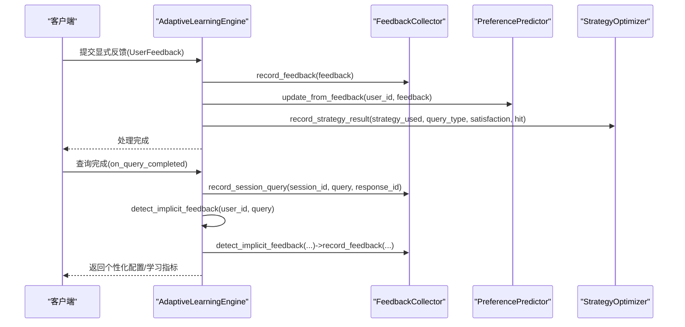
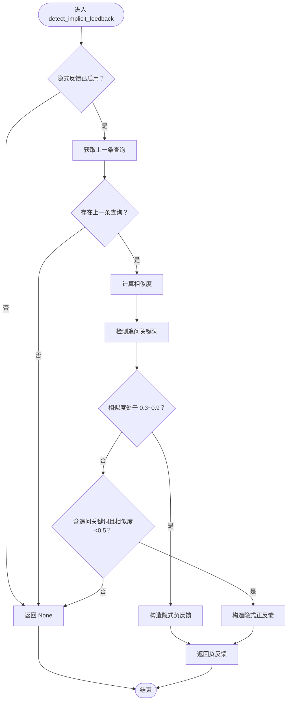
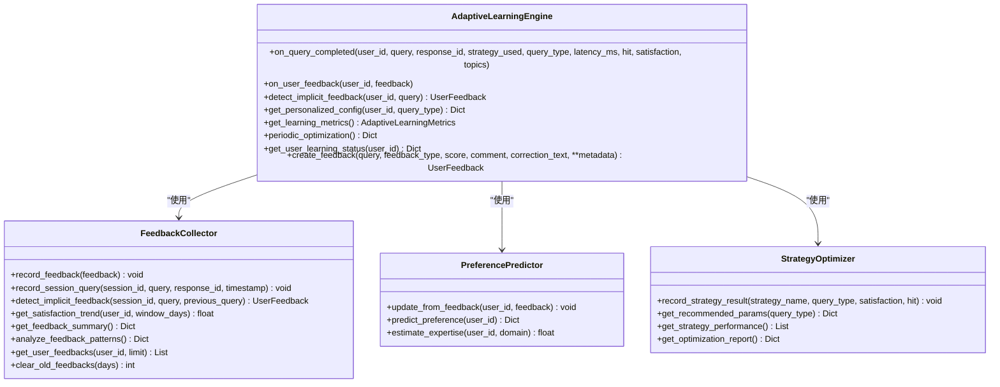
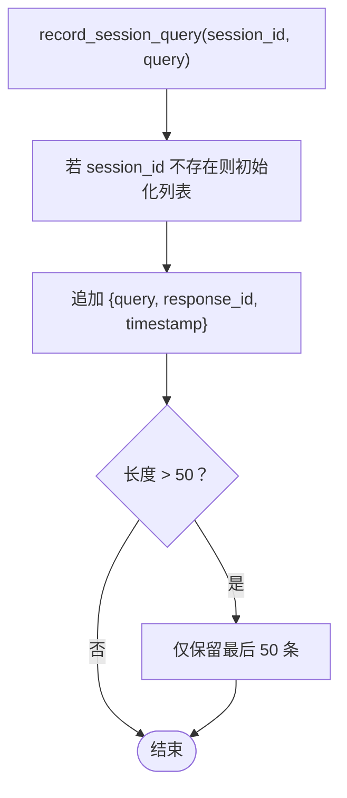
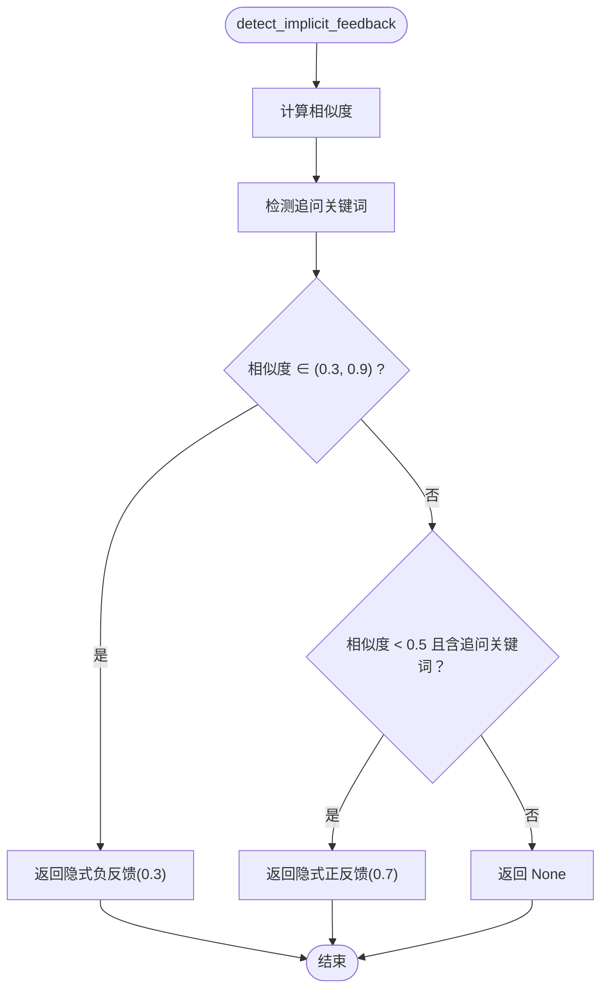
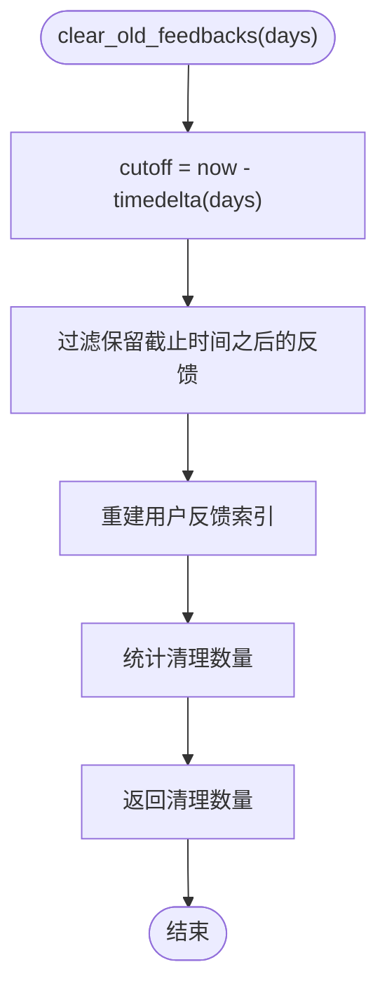
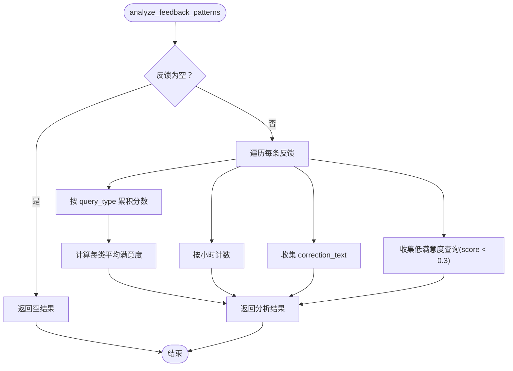
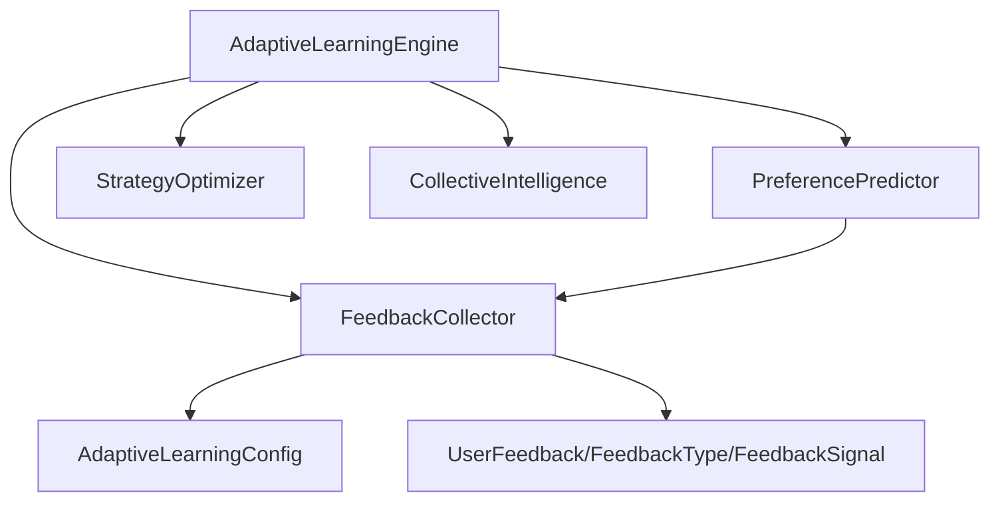

# 反馈收集系统

<cite>
**本文档引用的文件**
- [src/adaptive/feedback.py](file://src/adaptive/feedback.py)
- [src/adaptive/engine.py](file://src/adaptive/engine.py)
- [src/adaptive/models.py](file://src/adaptive/models.py)
- [src/adaptive/config.py](file://src/adaptive/config.py)
- [src/adaptive/preference_predictor.py](file://src/adaptive/preference_predictor.py)
- [src/dashboard/debug/history.py](file://src/dashboard/debug/history.py)
- [src/dashboard/debug/models.py](file://src/dashboard/debug/models.py)
- [src/dashboard/debug/api.py](file://src/dashboard/debug/api.py)
</cite>

## 目录
1. [简介](#简介)
2. [项目结构](#项目结构)
3. [核心组件](#核心组件)
4. [架构总览](#架构总览)
5. [详细组件分析](#详细组件分析)
6. [依赖分析](#依赖分析)
7. [性能考虑](#性能考虑)
8. [故障排除指南](#故障排除指南)
9. [结论](#结论)
10. [附录](#附录)

## 简介
本文件面向反馈收集系统，围绕 FeedbackCollector 的反馈采集机制进行深入技术说明，涵盖显式反馈与隐式反馈的双重采集策略；详细解释会话查询记录 record_session_query 的会话状态管理与查询序列分析；阐述隐式反馈检测算法 detect_implicit_feedback 的用户行为分析模型（点击行为、停留时间、查询间隔等指标的综合判断）；说明反馈清理机制 clear_old_feedbacks 的存储优化策略与数据保留周期管理；介绍反馈模式分析 analyze_feedback_patterns 的功能特性（用户偏好趋势与行为模式识别）。同时提供完整的 API 接口说明、配置参数设置与最佳实践指南。

## 项目结构
反馈收集系统位于 adaptive 子模块中，核心文件包括：
- feedback.py：反馈收集器 FeedbackCollector 的实现，负责显式与隐式反馈的采集、会话查询记录、隐式反馈检测、反馈清理与模式分析。
- engine.py：自适应学习引擎，协调反馈收集、偏好预测、策略优化与集体智慧，并通过 on_query_completed、on_user_feedback、detect_implicit_feedback 等方法与 FeedbackCollector 交互。
- models.py：定义反馈类型、信号来源、用户反馈数据结构等核心数据模型。
- config.py：自适应学习配置类，控制反馈收集、偏好学习、策略优化、集体智慧等模块的开关与参数。
- preference_predictor.py：偏好预测器，基于反馈更新用户偏好模型。
- dashboard/debug/history.py、models.py、api.py：调试面板中的查询记录与历史管理，辅助理解会话查询记录与调试流程。

**图表来源**
- [src/adaptive/engine.py:30-121](file://src/adaptive/engine.py#L30-L121)
- [src/adaptive/feedback.py:19-38](file://src/adaptive/feedback.py#L19-L38)
- [src/adaptive/models.py:14-82](file://src/adaptive/models.py#L14-L82)
- [src/adaptive/config.py:15-60](file://src/adaptive/config.py#L15-L60)

**章节来源**
- [src/adaptive/feedback.py:1-398](file://src/adaptive/feedback.py#L1-L398)
- [src/adaptive/engine.py:1-598](file://src/adaptive/engine.py#L1-L598)
- [src/adaptive/models.py:1-258](file://src/adaptive/models.py#L1-L258)
- [src/adaptive/config.py:1-200](file://src/adaptive/config.py#L1-L200)

## 核心组件
- FeedbackCollector：负责显式反馈记录、会话查询记录、隐式反馈检测、满意度趋势分析、反馈汇总统计、反馈模式分析与旧数据清理。
- AdaptiveLearningEngine：作为统一协调器，在查询完成回调、用户反馈回调、隐式反馈检测中与 FeedbackCollector 协同工作，并将反馈传递给偏好预测器与策略优化器。
- UserFeedback/FeedbackType/FeedbackSignal：定义反馈的数据结构与类型枚举。
- AdaptiveLearningConfig：控制反馈收集、隐式反馈、偏好学习、策略优化、集体智慧等模块的开关与参数。

**章节来源**
- [src/adaptive/feedback.py:19-398](file://src/adaptive/feedback.py#L19-L398)
- [src/adaptive/engine.py:30-277](file://src/adaptive/engine.py#L30-L277)
- [src/adaptive/models.py:14-82](file://src/adaptive/models.py#L14-L82)
- [src/adaptive/config.py:15-60](file://src/adaptive/config.py#L15-L60)

## 架构总览
反馈收集系统采用“显式反馈 + 隐式反馈”的双轨采集策略：
- 显式反馈：通过 AdaptiveLearningEngine.on_user_feedback 接收用户提交的 UserFeedback，记录到 FeedbackCollector，并同步更新偏好预测器与策略优化器。
- 隐式反馈：通过 AdaptiveLearningEngine.on_query_completed 记录会话查询序列，随后在 detect_implicit_feedback 中基于查询相似度与追问关键词进行隐式反馈判定，再回写到 FeedbackCollector。

**图表来源**
- [src/adaptive/engine.py:122-277](file://src/adaptive/engine.py#L122-L277)
- [src/adaptive/feedback.py:39-170](file://src/adaptive/feedback.py#L39-L170)

**章节来源**
- [src/adaptive/engine.py:122-277](file://src/adaptive/engine.py#L122-L277)
- [src/adaptive/feedback.py:39-170](file://src/adaptive/feedback.py#L39-L170)

## 详细组件分析

### FeedbackCollector 组件分析
- 显式反馈采集：record_feedback 将反馈写入内存存储，并维护用户反馈索引，确保 feedback_history_size 限制内滚动移除最旧反馈。
- 会话查询记录：record_session_query 维护 session_id -> queries 的查询序列，限制长度为 50，便于后续隐式反馈检测。
- 隐式反馈检测：detect_implicit_feedback 基于以下规则：
  - 查询相似度在 0.3~0.9 之间：判定为“查询改写”，返回隐式负反馈；
  - 含追问关键词且相似度小于 0.5：判定为“连续追问”，返回隐式正反馈；
  - 否则返回 None。
- 相似度计算：_calculate_similarity 使用字符集合重叠率，避免复杂的语义匹配。
- 满意度趋势：get_satisfaction_trend 将反馈按时间窗口分为前后两段，计算均值差，衡量满意度变化趋势。
- 反馈汇总：get_feedback_summary 统计总数、正负比、按类型与信号来源分布、平均分。
- 反馈模式分析：analyze_feedback_patterns 按查询类型满意度、小时活跃度、常见修正模式与低满意度查询进行分析。
- 用户反馈查询：get_user_feedbacks 基于用户索引快速返回最近 N 条反馈。
- 旧数据清理：clear_old_feedbacks 根据 days 截止时间过滤并重建索引，支持定期清理以优化存储。

**图表来源**
- [src/adaptive/feedback.py:96-170](file://src/adaptive/feedback.py#L96-L170)

**章节来源**
- [src/adaptive/feedback.py:39-398](file://src/adaptive/feedback.py#L39-L398)

### AdaptiveLearningEngine 组件分析
- on_query_completed：记录策略结果、更新用户画像、记录会话查询、记录集体智慧数据。
- on_user_feedback：为反馈补全用户元数据，依次写入 FeedbackCollector、更新 PreferencePredictor、更新 StrategyOptimizer。
- detect_implicit_feedback：生成 session_id，委托 FeedbackCollector 检测隐式反馈，并回写到 FeedbackCollector。
- get_personalized_config：综合用户偏好与最优策略，返回个性化配置。
- get_learning_metrics/periodic_optimization：汇总学习指标、执行周期性优化与清理。
- get_user_learning_status/create_feedback：提供用户学习状态与便捷反馈对象创建。

**图表来源**
- [src/adaptive/engine.py:30-277](file://src/adaptive/engine.py#L30-L277)
- [src/adaptive/feedback.py:19-398](file://src/adaptive/feedback.py#L19-L398)

**章节来源**
- [src/adaptive/engine.py:122-277](file://src/adaptive/engine.py#L122-L277)

### 会话查询记录与查询序列分析
- record_session_query：为每个 session_id 维护最多 50 条查询记录，包含 query、response_id、timestamp，便于后续隐式反馈检测。
- 查询序列分析：detect_implicit_feedback 通过比较相邻查询的相似度与关键词，识别“查询改写”和“连续追问”两类隐式反馈信号。

**图表来源**
- [src/adaptive/feedback.py:67-95](file://src/adaptive/feedback.py#L67-L95)

**章节来源**
- [src/adaptive/feedback.py:67-95](file://src/adaptive/feedback.py#L67-L95)

### 隐式反馈检测算法与用户行为分析模型
- 相似度阈值：0.3~0.9 之间视为“查询改写”，返回隐式负反馈；否则继续判断。
- 追问关键词：包含“为什么、怎么、详细、更多、进一步、然后、接下来、还有、具体、例如、比如、解释”等，用于识别“连续追问”。
- 综合判断：相似度低且存在追问关键词 → 隐式正反馈；相似度中等 → 隐式负反馈；其他 → 无隐式反馈。
- 评分策略：隐式负反馈给较低分（如 0.3），隐式正反馈给较高分（如 0.7），用于后续满意度趋势与策略优化。

**图表来源**
- [src/adaptive/feedback.py:96-170](file://src/adaptive/feedback.py#L96-L170)

**章节来源**
- [src/adaptive/feedback.py:96-170](file://src/adaptive/feedback.py#L96-L170)

### 反馈清理机制与存储优化策略
- clear_old_feedbacks：根据 days 截止时间过滤反馈，仅保留截止时间之后的数据，并重建用户反馈索引，保证查询效率。
- 存储优化：通过 feedback_history_size 与会话历史长度限制，控制内存占用；定期清理过期数据，降低存储压力。
- 数据保留周期：由 AdaptiveLearningConfig.interaction_retention_days 控制，默认 90 天。

**图表来源**
- [src/adaptive/feedback.py:369-398](file://src/adaptive/feedback.py#L369-L398)
- [src/adaptive/config.py:58-59](file://src/adaptive/config.py#L58-L59)

**章节来源**
- [src/adaptive/feedback.py:369-398](file://src/adaptive/feedback.py#L369-L398)
- [src/adaptive/config.py:58-59](file://src/adaptive/config.py#L58-L59)

### 反馈模式分析与用户偏好趋势识别
- analyze_feedback_patterns：输出四类信息：
  - query_type_satisfaction：按查询类型计算平均满意度；
  - hourly_activity：按小时统计反馈活跃度；
  - correction_patterns：收集修正内容（最多 20 条）；
  - low_satisfaction_queries：低满意度查询（Top 10）。
- get_satisfaction_trend：按时间窗口（默认 30 天）计算满意度趋势，衡量整体改善或下降情况。
- get_feedback_summary：提供总量、正负比、按类型与信号来源分布、平均分等汇总统计。

**图表来源**
- [src/adaptive/feedback.py:286-349](file://src/adaptive/feedback.py#L286-L349)

**章节来源**
- [src/adaptive/feedback.py:198-349](file://src/adaptive/feedback.py#L198-L349)

## 依赖分析
- FeedbackCollector 依赖 AdaptiveLearningConfig 控制开关与参数，依赖 UserFeedback/FeedbackType/FeedbackSignal 数据模型。
- AdaptiveLearningEngine 依赖 FeedbackCollector、PreferencePredictor、StrategyOptimizer 四个子系统，协调反馈、偏好、策略与集体智慧。
- preference_predictor 依赖 FeedbackCollector 的反馈数据进行偏好更新。

**图表来源**
- [src/adaptive/feedback.py:12-13](file://src/adaptive/feedback.py#L12-L13)
- [src/adaptive/engine.py:20-24](file://src/adaptive/engine.py#L20-L24)

**章节来源**
- [src/adaptive/feedback.py:12-13](file://src/adaptive/feedback.py#L12-L13)
- [src/adaptive/engine.py:20-24](file://src/adaptive/engine.py#L20-L24)

## 性能考虑
- 内存存储：FeedbackCollector 使用内存列表存储反馈与会话查询，适合中小规模场景；可通过 feedback_history_size 与会话历史长度限制控制内存占用。
- 索引优化：用户反馈索引按用户 ID 维护反馈 ID 列表，get_user_feedbacks 通过切片快速返回最近 N 条反馈，时间复杂度 O(N)。
- 相似度计算：字符集合重叠率计算简单高效，适合大规模文本；如需更高精度，可替换为更复杂的语义相似度算法。
- 定期清理：clear_old_feedbacks 支持按天清理，建议结合业务量与存储成本设定合理的保留周期。

## 故障排除指南
- 隐式反馈未生效：检查 AdaptiveLearningConfig.implicit_feedback_enabled 是否开启；确认 on_query_completed 是否正确调用 record_session_query。
- 反馈未被记录：检查 AdaptiveLearningConfig.enable_feedback_collection；确认 feedback_history_size 是否过小导致频繁移除。
- 偏好更新异常：检查 on_user_feedback 流程是否正确传递 feedback 与 user_id；确认 PreferencePredictor.update_from_feedback 的触发条件。
- 满意度趋势异常：确认反馈时间戳是否正确；检查时间窗口与数据量（至少 4 条）是否满足趋势计算要求。
- 旧数据清理失败：确认 days 参数是否合理；检查 clear_old_feedbacks 的过滤逻辑与索引重建过程。

**章节来源**
- [src/adaptive/config.py:23-27](file://src/adaptive/config.py#L23-L27)
- [src/adaptive/feedback.py:46-65](file://src/adaptive/feedback.py#L46-L65)
- [src/adaptive/engine.py:198-243](file://src/adaptive/engine.py#L198-L243)

## 结论
反馈收集系统通过显式与隐式反馈的双重采集，结合会话查询记录与相似度分析，实现了对用户行为的全面感知与学习闭环。配合满意度趋势、反馈模式分析与定期清理机制，系统能够在保证性能的同时持续优化个性化配置与策略选择。建议在生产环境中合理配置保留周期与历史长度，并根据业务需求扩展隐式反馈的判定规则与相似度算法。

## 附录

### API 接口说明
- FeedbackCollector
  - record_feedback(feedback)：记录显式反馈
  - record_session_query(session_id, query, response_id="", timestamp=None)：记录会话查询
  - detect_implicit_feedback(session_id, query, previous_query=None)：检测隐式反馈
  - get_satisfaction_trend(user_id=None, window_days=30)：计算满意度趋势
  - get_feedback_summary()：获取反馈汇总统计
  - analyze_feedback_patterns()：分析反馈模式
  - get_user_feedbacks(user_id, limit=50)：获取用户反馈列表
  - clear_old_feedbacks(days=90)：清理旧反馈
- AdaptiveLearningEngine
  - on_query_completed(...)：查询完成回调
  - on_user_feedback(user_id, feedback)：处理用户反馈
  - detect_implicit_feedback(user_id, query)：检测隐式反馈
  - get_personalized_config(user_id, query_type)：获取个性化配置
  - get_learning_metrics()：获取学习指标
  - periodic_optimization()：周期性优化
  - get_user_learning_status(user_id)：获取用户学习状态
  - create_feedback(...)：便捷创建反馈对象

**章节来源**
- [src/adaptive/feedback.py:39-398](file://src/adaptive/feedback.py#L39-L398)
- [src/adaptive/engine.py:122-521](file://src/adaptive/engine.py#L122-L521)

### 配置参数设置
- AdaptiveLearningConfig
  - enable_feedback_collection：启用反馈收集
  - feedback_history_size：反馈历史数量上限
  - implicit_feedback_enabled：启用隐式反馈
  - enable_preference_learning：启用偏好学习
  - preference_update_interval：偏好更新间隔
  - expertise_learning_rate：专业度学习速率
  - enable_strategy_optimization：启用策略优化
  - strategy_learning_rate：策略学习速率
  - exploration_rate：探索率
  - enable_collective_learning：启用集体学习
  - interaction_retention_days：交互记录保留天数

**章节来源**
- [src/adaptive/config.py:15-60](file://src/adaptive/config.py#L15-L60)

### 最佳实践指南
- 显式反馈优先：鼓励用户提供评分与评论，作为策略优化与偏好学习的主要依据。
- 隐式反馈补充：通过查询改写与连续追问识别用户意图变化，提升学习鲁棒性。
- 会话记录规范：确保 on_query_completed 正确调用 record_session_query，避免隐式反馈缺失。
- 定期清理策略：结合业务量与存储成本，设置合理的 interaction_retention_days 与 feedback_history_size。
- 模式分析应用：利用 analyze_feedback_patterns 识别低满意度查询与修正模式，指导内容与策略优化。
- 性能监控：关注反馈数量与内存占用，必要时扩展为持久化存储或外部缓存。